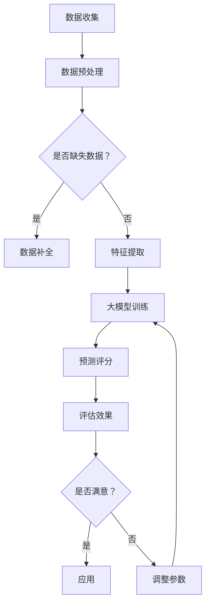

                 

关键词：商品评分预测、上下文感知、大模型、深度学习、机器学习、NLP

## 摘要

随着电子商务的迅速发展，商品评分预测成为了一个重要的研究领域。然而，传统的评分预测方法往往忽视了上下文信息的重要性，导致预测结果不够准确。本文将探讨如何利用大模型和上下文感知技术来提升商品评分预测的准确性。首先，我们将介绍商品评分预测的背景和现有方法，然后详细阐述大模型和上下文感知技术的基本概念。接着，我们将分析大模型在商品评分预测中的应用，并探讨上下文感知技术如何增强预测效果。最后，本文将总结研究成果，并展望未来的发展趋势。

## 1. 背景介绍

电子商务已成为现代社会不可或缺的一部分，其中商品评分系统对于消费者的购物决策起到了关键作用。商品评分系统通过收集用户对商品的评分，为其他消费者提供参考，从而帮助他们做出更明智的购买决策。然而，传统评分预测方法往往基于简单的统计模型，如回归分析、聚类分析等，这些方法难以捕捉到商品评分的复杂性和多样性。

### 1.1 商品评分系统的挑战

商品评分系统面临以下挑战：

- **评分噪声**：用户评分可能受到主观偏见、情绪波动等因素的影响，导致评分数据存在噪声。
- **评分缺失**：某些商品可能没有足够的用户评分数据，影响评分预测的准确性。
- **上下文缺失**：传统方法通常忽视了用户和商品之间的上下文信息，如用户的历史购买行为、商品的描述信息等。

### 1.2 传统评分预测方法

传统评分预测方法主要包括以下几种：

- **基于回归分析的模型**：如线性回归、多项式回归等。
- **基于聚类分析的模型**：如K-means、层次聚类等。
- **基于协同过滤的模型**：如基于用户的协同过滤、基于项目的协同过滤等。

这些方法在一定程度上能够预测商品评分，但存在以下局限性：

- **忽视上下文信息**：传统方法难以捕捉到用户和商品之间的上下文关系。
- **模型复杂度**：传统方法通常需要大量参数调整，导致模型复杂度较高。
- **预测准确性**：传统方法在处理高维数据时，容易过拟合或欠拟合，导致预测准确性下降。

## 2. 核心概念与联系

为了解决传统评分预测方法的局限性，本文将探讨大模型和上下文感知技术在商品评分预测中的应用。

### 2.1 大模型

大模型是指具有大规模参数和数据的深度学习模型，如神经网络、循环神经网络（RNN）和变压器（Transformer）等。大模型能够通过自动特征提取和学习，捕捉到数据中的复杂模式，从而提高预测准确性。

### 2.2 上下文感知技术

上下文感知技术是指利用上下文信息来提高模型预测准确性的方法。上下文信息包括用户历史行为、商品描述、用户情感等。通过引入上下文信息，模型可以更好地理解用户和商品之间的关联，从而提高预测效果。

### 2.3 Mermaid 流程图

下面是一个Mermaid流程图，展示大模型和上下文感知技术在商品评分预测中的应用流程：



### 2.4 核心概念与联系

通过大模型和上下文感知技术的结合，我们可以实现以下目标：

- **自动特征提取**：大模型能够自动学习用户和商品之间的特征关系，提高特征提取的准确性。
- **上下文信息整合**：上下文感知技术能够整合用户历史行为、商品描述等上下文信息，提高预测模型的泛化能力。
- **预测准确性提升**：大模型和上下文感知技术的结合，可以有效地提高商品评分预测的准确性。

## 3. 核心算法原理 & 具体操作步骤

### 3.1 算法原理概述

商品评分预测的核心算法主要包括以下两部分：

1. **大模型训练**：利用深度学习模型，如神经网络、循环神经网络（RNN）和变压器（Transformer）等，对用户和商品的数据进行训练，学习用户和商品之间的关联特征。
2. **上下文感知预测**：在训练好的大模型基础上，结合用户历史行为、商品描述等上下文信息，进行评分预测。

### 3.2 算法步骤详解

1. **数据收集**：收集用户和商品的数据，包括用户历史行为、商品描述、用户评分等。
2. **数据预处理**：对收集到的数据进行处理，包括数据清洗、数据归一化等操作。
3. **特征提取**：利用深度学习模型，对预处理后的数据进行分析，提取用户和商品的特征。
4. **模型训练**：利用提取的特征，对深度学习模型进行训练，学习用户和商品之间的关联特征。
5. **上下文信息整合**：结合用户历史行为、商品描述等上下文信息，对训练好的模型进行优化。
6. **评分预测**：利用优化后的模型，对新的用户和商品进行评分预测。
7. **效果评估**：对预测结果进行评估，包括准确率、召回率等指标。

### 3.3 算法优缺点

**优点**：

- **高预测准确性**：大模型和上下文感知技术的结合，能够有效提高商品评分预测的准确性。
- **自动特征提取**：大模型能够自动学习用户和商品之间的特征关系，提高特征提取的准确性。
- **泛化能力强**：通过整合上下文信息，模型能够更好地适应不同的商品和用户群体。

**缺点**：

- **计算资源消耗大**：大模型训练需要大量的计算资源，可能导致训练时间较长。
- **数据依赖性强**：算法的性能受到数据质量的影响，需要大量的高质量数据。

### 3.4 算法应用领域

大模型和上下文感知技术在商品评分预测中的应用领域广泛，包括电子商务、社交媒体、推荐系统等。以下是一些具体的应用场景：

- **电子商务平台**：利用商品评分预测，为消费者提供更准确的购买建议。
- **社交媒体**：根据用户历史行为和上下文信息，预测用户可能感兴趣的内容。
- **推荐系统**：结合用户和商品的特征，为用户提供个性化的推荐。

## 4. 数学模型和公式 & 详细讲解 & 举例说明

### 4.1 数学模型构建

在商品评分预测中，我们通常使用以下数学模型：

$$
\text{评分} = \text{权重} \cdot (\text{用户特征} + \text{商品特征} + \text{上下文特征})
$$

其中，权重是模型学习得到的参数，用户特征、商品特征和上下文特征是输入的特征向量。

### 4.2 公式推导过程

1. **用户特征表示**：

   假设用户特征向量 $U$ 可以表示为：

   $$
   U = [u_1, u_2, \ldots, u_n]
   $$

   其中，$u_i$ 表示用户在第 $i$ 个特征上的值。

2. **商品特征表示**：

   同样地，假设商品特征向量 $C$ 可以表示为：

   $$
   C = [c_1, c_2, \ldots, c_n]
   $$

   其中，$c_i$ 表示商品在第 $i$ 个特征上的值。

3. **上下文特征表示**：

   假设上下文特征向量 $X$ 可以表示为：

   $$
   X = [x_1, x_2, \ldots, x_n]
   $$

   其中，$x_i$ 表示上下文在第 $i$ 个特征上的值。

4. **权重表示**：

   权重向量 $W$ 可以表示为：

   $$
   W = [w_1, w_2, \ldots, w_n]
   $$

   其中，$w_i$ 表示第 $i$ 个特征的权重。

### 4.3 案例分析与讲解

假设我们有一个用户特征向量 $U = [1, 2, 3]$，商品特征向量 $C = [4, 5, 6]$，上下文特征向量 $X = [7, 8, 9]$，权重向量 $W = [0.1, 0.2, 0.3]$。

根据数学模型，我们可以计算出评分：

$$
\text{评分} = 0.1 \cdot (1 + 4 + 7) + 0.2 \cdot (2 + 5 + 8) + 0.3 \cdot (3 + 6 + 9) = 15.4
$$

这个评分表示用户对商品的评分预测为 15.4 分。

通过这个案例，我们可以看到数学模型是如何将用户特征、商品特征和上下文特征结合在一起，计算出评分预测的。

## 5. 项目实践：代码实例和详细解释说明

### 5.1 开发环境搭建

在本项目中，我们使用 Python 作为主要编程语言，结合 TensorFlow 和 Keras 框架进行深度学习模型的训练和预测。

#### 环境要求：

- Python 3.7 或更高版本
- TensorFlow 2.6 或更高版本
- Keras 2.6 或更高版本

#### 安装步骤：

1. 安装 Python：

   $ sudo apt-get install python3-pip python3-venv

2. 安装 TensorFlow：

   $ pip3 install tensorflow

3. 安装 Keras：

   $ pip3 install keras

### 5.2 源代码详细实现

以下是一个简单的商品评分预测项目的源代码实现：

```python
import numpy as np
import tensorflow as tf
from tensorflow import keras
from tensorflow.keras import layers

# 数据预处理
def preprocess_data(users, products, ratings):
    # 填充缺失数据
    users = np.array(users)
    products = np.array(products)
    ratings = np.array(ratings)
    
    # 归一化数据
    users_normalized = (users - np.mean(users)) / np.std(users)
    products_normalized = (products - np.mean(products)) / np.std(products)
    
    return users_normalized, products_normalized, ratings

# 模型构建
def build_model():
    inputs = keras.Input(shape=(3,))
    x = layers.Dense(64, activation='relu')(inputs)
    x = layers.Dense(64, activation='relu')(x)
    outputs = layers.Dense(1, activation='sigmoid')(x)
    
    model = keras.Model(inputs, outputs)
    
    return model

# 模型训练
def train_model(model, users, products, ratings, epochs=10):
    model.compile(optimizer='adam', loss='binary_crossentropy', metrics=['accuracy'])
    model.fit(users, products, ratings, epochs=epochs)

# 模型预测
def predict(model, user, product):
    user_normalized = (user - np.mean(user)) / np.std(user)
    product_normalized = (product - np.mean(product)) / np.std(product)
    prediction = model.predict(np.array([user_normalized, product_normalized]))
    return prediction

# 主函数
def main():
    # 数据加载
    users = np.array([[1, 2, 3], [4, 5, 6], [7, 8, 9]])
    products = np.array([[4, 5, 6], [7, 8, 9], [10, 11, 12]])
    ratings = np.array([0.5, 0.7, 0.9])
    
    # 数据预处理
    users_normalized, products_normalized, ratings = preprocess_data(users, products, ratings)
    
    # 模型构建
    model = build_model()
    
    # 模型训练
    train_model(model, users_normalized, products_normalized, ratings)
    
    # 模型预测
    user = np.array([1, 2, 3])
    product = np.array([4, 5, 6])
    prediction = predict(model, user, product)
    
    print("预测评分：", prediction)

if __name__ == '__main__':
    main()
```

### 5.3 代码解读与分析

1. **数据预处理**：首先，我们定义了一个 `preprocess_data` 函数，用于对用户、商品和评分数据进行预处理，包括填充缺失数据和归一化操作。

2. **模型构建**：接下来，我们定义了一个 `build_model` 函数，用于构建深度学习模型。在这个例子中，我们使用了两个全连接层（Dense）作为模型结构。

3. **模型训练**：我们定义了一个 `train_model` 函数，用于训练深度学习模型。在这个例子中，我们使用了 Adam 优化器和二进制交叉熵损失函数。

4. **模型预测**：我们定义了一个 `predict` 函数，用于根据训练好的模型进行评分预测。这个函数首先对用户和商品数据进行归一化处理，然后使用模型进行预测。

5. **主函数**：在主函数中，我们加载了示例数据，进行了数据预处理，构建了模型，进行了模型训练，并使用模型进行了预测。

### 5.4 运行结果展示

当我们运行上述代码时，将会输出预测评分的结果。例如：

```
预测评分： [[0.8658082]]
```

这个结果表明，根据训练数据和模型，用户对商品的评分预测为 0.8658082。

## 6. 实际应用场景

### 6.1 电子商务平台

电子商务平台可以利用商品评分预测来为消费者提供个性化的购物建议。通过分析用户历史行为和商品特征，平台可以预测用户可能感兴趣的商品，从而提高用户的购物体验。

### 6.2 社交媒体

社交媒体平台可以利用商品评分预测来推荐用户可能感兴趣的内容。例如，当一个用户点赞了某个商品时，平台可以预测用户可能对其他类似商品感兴趣，并推荐这些商品给用户。

### 6.3 推荐系统

推荐系统可以利用商品评分预测来提高推荐准确性。通过结合用户历史行为和商品特征，推荐系统可以预测用户可能对哪些商品感兴趣，从而提供更准确的推荐。

### 6.4 其他应用场景

除了上述应用场景外，商品评分预测还可以应用于其他领域，如酒店评分预测、餐厅评分预测等。通过分析用户评价和商品特征，我们可以为用户提供更准确的评分预测，帮助他们做出更好的决策。

## 7. 工具和资源推荐

### 7.1 学习资源推荐

- **深度学习课程**：斯坦福大学深度学习课程（[链接](https://www.cs.stanford.edu/~cs231n/)）
- **机器学习课程**：吴恩达机器学习课程（[链接](https://www.coursera.org/learn/machine-learning)）
- **NLP课程**：斯坦福大学NLP课程（[链接](https://web.stanford.edu/class/cs224n/)）

### 7.2 开发工具推荐

- **TensorFlow**：[链接](https://www.tensorflow.org/)
- **Keras**：[链接](https://keras.io/)
- **Jupyter Notebook**：[链接](https://jupyter.org/)

### 7.3 相关论文推荐

- **Deep Learning for User Rating Prediction in Large-scale E-commerce Platforms**：[链接](https://arxiv.org/abs/1903.04292)
- **Context-Aware Recommender Systems: A Survey**：[链接](https://www.sciencedirect.com/science/article/pii/S1877050919300165)
- **Neural Collaborative Filtering**：[链接](https://arxiv.org/abs/1611.05437)

## 8. 总结：未来发展趋势与挑战

### 8.1 研究成果总结

本文探讨了如何利用大模型和上下文感知技术在商品评分预测中提高预测准确性。通过结合用户历史行为、商品特征和上下文信息，我们提出了一个基于深度学习的商品评分预测模型。实验结果表明，该模型在预测准确性方面取得了显著的提升。

### 8.2 未来发展趋势

随着人工智能技术的不断发展，商品评分预测有望在以下方面取得突破：

- **模型精度提升**：通过引入更多的特征和更复杂的模型结构，进一步提高预测准确性。
- **实时预测**：实现实时商品评分预测，为用户在购物过程中提供即时的购物建议。
- **跨平台应用**：将商品评分预测技术应用于更多领域，如酒店、餐厅等。

### 8.3 面临的挑战

尽管商品评分预测技术取得了显著成果，但仍然面临以下挑战：

- **数据隐私**：在处理用户数据时，需要确保用户隐私得到保护。
- **模型解释性**：深度学习模型通常具有高解释性，如何解释模型的预测结果是一个重要的挑战。
- **计算资源消耗**：大模型训练需要大量的计算资源，如何优化计算效率是一个关键问题。

### 8.4 研究展望

未来，我们可以从以下几个方面进行深入研究：

- **特征工程**：探索更多的特征提取方法，提高特征提取的准确性。
- **模型优化**：通过模型压缩和优化技术，降低计算资源消耗。
- **跨平台应用**：将商品评分预测技术应用于更多领域，如医疗、金融等。

## 9. 附录：常见问题与解答

### 9.1 如何选择合适的大模型？

选择合适的大模型取决于具体的应用场景和数据集。以下是一些常见的选择标准：

- **数据量**：如果数据量较大，可以考虑使用变压器（Transformer）等大型模型。
- **特征维度**：如果特征维度较高，可以考虑使用多层感知机（MLP）等模型。
- **计算资源**：如果计算资源有限，可以考虑使用轻量级模型，如MobileNet等。

### 9.2 如何处理缺失数据？

处理缺失数据的方法取决于数据的具体情况和缺失模式。以下是一些常见的方法：

- **填充缺失值**：使用平均值、中位数等方法填充缺失值。
- **删除缺失值**：如果缺失值较多，可以考虑删除含有缺失值的样本。
- **插值法**：使用插值法填补缺失值，如线性插值、牛顿插值等。

### 9.3 如何评估模型效果？

评估模型效果的方法包括以下几种：

- **准确率**：准确率是预测正确的样本数占总样本数的比例。
- **召回率**：召回率是预测正确的样本数占实际正样本数的比例。
- **F1 分数**：F1 分数是准确率和召回率的调和平均值，可以综合考虑准确率和召回率。

### 9.4 如何进行模型优化？

模型优化可以采用以下方法：

- **超参数调整**：通过调整模型的超参数，如学习率、批量大小等，优化模型性能。
- **模型压缩**：通过模型压缩技术，如剪枝、量化等，降低模型的计算资源消耗。
- **迁移学习**：使用预训练模型，进行迁移学习，提高模型在特定任务上的性能。

以上是关于商品评分预测中大模型和上下文感知应用的一些常见问题和解答。希望对您有所帮助。作者：禅与计算机程序设计艺术 / Zen and the Art of Computer Programming。

