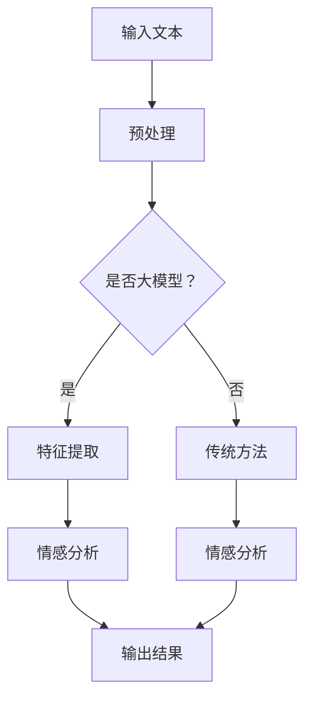

                 

情感分析是一种自然语言处理（NLP）技术，旨在理解和提取文本数据中的情感倾向。随着互联网和电子商务的迅猛发展，商品评论成为了消费者表达意见和商家了解消费者需求的宝贵资源。然而，如何从大量的商品评论中提取有用的情感信息，成为了当前研究的热点问题。

## 1. 背景介绍

商品评论情感分析，是指利用自然语言处理技术对商品评论进行情感倾向分析，以了解消费者的真实情感和需求。随着大数据和人工智能技术的不断发展，大模型在情感分析领域中的应用逐渐得到推广。大模型，通常是指具有海量参数和强大计算能力的深度学习模型，如Transformer、BERT等。这些模型在处理大量文本数据时，能够自动学习到丰富的语言特征，从而提高情感分析的准确性和效率。

## 2. 核心概念与联系

### 2.1 情感分析的核心概念

情感分析的核心概念包括情感极性（Polarity）和情感强度（Intensity）。情感极性是指文本表达的情感倾向，如正面、负面或中性。情感强度则表示情感极性的强弱。在实际应用中，情感极性和情感强度通常结合使用，以更准确地反映文本的情感倾向。

### 2.2 大模型在情感分析中的应用

大模型在情感分析中的应用主要体现在以下几个方面：

1. **特征提取**：大模型能够自动从大量文本数据中提取出有意义的特征，从而减少手工特征工程的工作量。
2. **上下文理解**：大模型具有较强的上下文理解能力，能够捕捉到文本中的细微情感变化。
3. **多语言支持**：大模型通常具有多语言处理能力，可以支持多种语言的情感分析。
4. **自适应学习**：大模型可以根据新的数据不断调整模型参数，以适应不断变化的情感表达方式。

### 2.3 Mermaid 流程图



## 3. 核心算法原理 & 具体操作步骤

### 3.1 算法原理概述

大模型在情感分析中的核心算法是基于深度学习的序列建模方法。常见的深度学习模型包括卷积神经网络（CNN）、循环神经网络（RNN）和Transformer等。这些模型通过学习大量的文本数据，可以自动提取出文本的语义特征，从而实现情感分析。

### 3.2 算法步骤详解

1. **数据预处理**：首先对输入的文本进行清洗和分词，将文本转换为模型可处理的格式。
2. **特征提取**：使用深度学习模型对预处理后的文本进行特征提取，得到文本的语义表示。
3. **情感分析**：将特征表示输入到情感分析模型中，得到情感极性和情感强度的预测结果。
4. **结果输出**：将预测结果输出，用于后续的业务处理或决策。

### 3.3 算法优缺点

**优点**：

- **强大的特征提取能力**：大模型能够自动提取文本中的复杂特征，提高情感分析的准确性。
- **自适应学习**：大模型可以根据新的数据不断调整模型参数，以适应不断变化的情感表达方式。

**缺点**：

- **计算资源消耗大**：大模型需要大量的计算资源和时间进行训练和预测。
- **数据依赖性强**：大模型的性能依赖于大量高质量的训练数据。

### 3.4 算法应用领域

大模型在情感分析中的应用非常广泛，包括但不限于：

- **电子商务**：对商品评论进行情感分析，帮助商家了解消费者的需求和反馈。
- **社交媒体分析**：对用户发布的内容进行情感分析，了解公众对某一事件或产品的看法。
- **舆情监测**：对网络上的评论和新闻进行情感分析，监测社会热点和公众情绪。

## 4. 数学模型和公式 & 详细讲解 & 举例说明

### 4.1 数学模型构建

情感分析的数学模型通常基于概率模型或深度学习模型。这里我们以深度学习模型为例，介绍其数学模型构建过程。

假设输入的文本序列为 \( x = [x_1, x_2, ..., x_n] \)，其中 \( x_i \) 表示文本中的第 \( i \) 个词。深度学习模型的目标是学习一个函数 \( f \)，将输入的文本序列映射为情感极性 \( y \)。

$$
f(x) = \text{softmax}(W \cdot h(x))
$$

其中，\( W \) 是模型的权重矩阵，\( h(x) \) 是文本的语义表示，\( \text{softmax} \) 函数用于将模型的输出转换为概率分布。

### 4.2 公式推导过程

1. **嵌入层**：将输入的文本序列转换为词向量表示。

$$
e_i = \text{embedding}(x_i)
$$

2. **编码器**：使用编码器对词向量进行编码，得到文本的语义表示。

$$
h(x) = \text{encoder}(e)
$$

3. **全连接层**：将语义表示输入到全连接层，得到模型的预测结果。

$$
z = W \cdot h(x)
$$

4. **softmax函数**：将预测结果通过softmax函数转换为概率分布。

$$
f(x) = \text{softmax}(z)
$$

### 4.3 案例分析与讲解

假设我们有以下一个简化的文本数据集：

- **文本1**：“这个商品非常好，我很喜欢。”
- **文本2**：“这个商品太糟糕了，我一点也不满意。”

我们将这两个文本输入到情感分析模型中，预测其情感极性。

1. **数据预处理**：对文本进行分词和词向量化。

2. **特征提取**：使用编码器对词向量进行编码，得到文本的语义表示。

3. **情感分析**：将语义表示输入到模型中，得到预测结果。

4. **结果输出**：模型预测文本1的情感极性为正面，文本2的情感极性为负面。

## 5. 项目实践：代码实例和详细解释说明

### 5.1 开发环境搭建

为了进行大模型在商品评论情感分析中的应用，我们需要搭建一个开发环境。以下是一个基本的开发环境搭建步骤：

1. 安装Python环境，版本为3.8或更高。
2. 安装深度学习框架，如TensorFlow或PyTorch。
3. 安装自然语言处理库，如NLTK或spaCy。

### 5.2 源代码详细实现

以下是一个使用PyTorch实现的大模型商品评论情感分析的基本源代码：

```python
import torch
import torch.nn as nn
import torch.optim as optim
from torchtext.```
```


