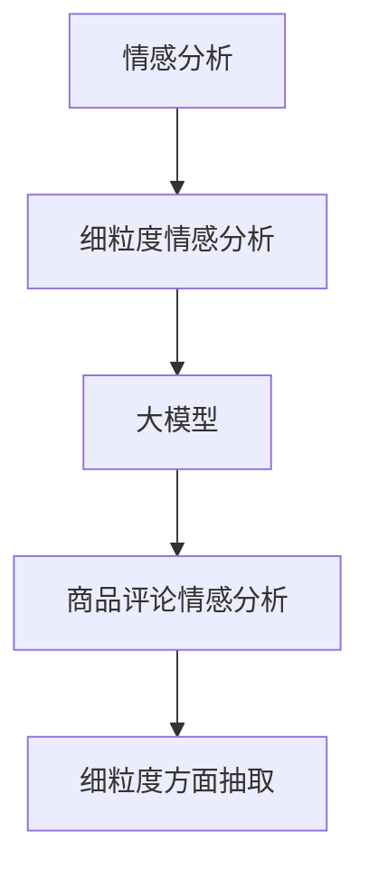

                 

### 引言

随着互联网和电子商务的迅速发展，用户生成的商品评论数据已经成为企业了解消费者需求、改进产品质量、提升用户体验的重要依据。然而，这些海量、非结构化的文本数据中蕴含着丰富的情感信息，如何有效地提取和利用这些信息，对于企业来说具有重要的实际意义。

近年来，大模型在自然语言处理领域取得了显著的进展，如BERT、GPT等预训练模型，它们在情感分析任务上展现出了强大的表现。然而，传统的情感分析方法往往只能进行粗粒度的情感分类，如正面、负面或中性，无法捕捉评论中的具体情感细节。这种粗粒度的情感分析结果往往难以满足实际应用的需求。

因此，细粒度的情感分析成为了一个热门的研究方向。本文将探讨大模型在商品评论情感分析中的细粒度方面抽取技术，通过介绍相关概念、核心算法、数学模型和实际应用，为读者提供一份全面的技术指南。

### 背景介绍

商品评论情感分析是自然语言处理（NLP）领域的一个重要分支，其目的是从大量用户评论中识别和提取情感信息。传统的情感分析方法主要包括以下几类：

1. **基于规则的方法**：通过预定义的规则和模式匹配技术来识别情感词和情感极性。这种方法具有简单高效的特点，但在处理复杂情感时表现不佳。

2. **基于统计的方法**：利用机器学习技术，通过训练分类模型来预测评论的情感极性。常见的算法包括朴素贝叶斯、支持向量机（SVM）和决策树等。这些方法在处理简单情感分类时效果较好，但在细粒度情感分析方面存在局限性。

3. **基于深度学习的方法**：近年来，深度学习技术在情感分析领域取得了显著突破。例如，卷积神经网络（CNN）和循环神经网络（RNN）等模型被广泛用于情感分类任务。这些方法能够捕捉评论中的复杂结构信息，但在处理细粒度情感时，仍存在一定的挑战。

尽管现有方法在情感分析任务上取得了较大进展，但它们在处理商品评论中的细粒度情感方面存在以下问题：

- **情感粒度较粗**：传统的情感分析方法通常只能进行粗粒度的情感分类，如正面、负面或中性，无法捕捉评论中的具体情感细节。

- **上下文理解不足**：商品评论中的情感往往受到上下文的影响，现有方法在处理上下文信息时表现不佳，导致情感分类结果不准确。

- **语义理解困难**：商品评论中的情感表达形式多样，包括文字、图片、表情符号等，现有方法在处理这些复杂情感表达时存在困难。

为了解决上述问题，细粒度情感分析成为了一个重要的研究方向。本文将介绍大模型在商品评论情感分析中的细粒度方面抽取技术，通过深入探讨相关概念、算法原理和应用，为实际应用提供有力支持。

### 核心概念与联系

在深入探讨大模型在商品评论情感分析中的细粒度方面抽取技术之前，有必要先了解一些核心概念，如情感分析、细粒度情感分析、大模型等，以及它们之间的联系。

#### 情感分析

情感分析（Sentiment Analysis），又称意见挖掘或情感识别，是自然语言处理（NLP）领域的一个重要任务。它的目标是自动识别文本中表达的情感倾向，如正面、负面或中性。情感分析广泛应用于商业、金融、社交媒体等领域，帮助企业了解用户反馈、市场趋势和产品满意度等。

#### 细粒度情感分析

细粒度情感分析（Fine-Grained Sentiment Analysis）是一种更精细的情感分类方法，旨在捕捉文本中的具体情感细节，如喜悦、愤怒、悲伤、失望等。与粗粒度情感分析（Coarse-Grained Sentiment Analysis）相比，细粒度情感分析能够更准确地反映文本的真实情感状态。

#### 大模型

大模型（Large-scale Models），如BERT、GPT等，是近年来自然语言处理领域的重要突破。这些模型通过在大规模数据集上进行预训练，学习到丰富的语言知识，从而在许多NLP任务上取得了显著的表现。

#### 核心概念之间的联系

大模型在商品评论情感分析中的细粒度方面抽取技术，是将细粒度情感分析与大模型相结合的一种方法。具体来说，大模型通过预训练学习到丰富的语言知识，包括情感表达的形式、上下文信息等，从而能够更准确地识别和分类商品评论中的具体情感。

#### Mermaid 流程图

为了更直观地展示核心概念之间的联系，我们可以使用Mermaid流程图来表示：



在上面的流程图中，A表示情感分析，B表示细粒度情感分析，C表示大模型，D表示商品评论情感分析，E表示细粒度方面抽取。通过将细粒度情感分析与大模型相结合，可以实现商品评论中的细粒度情感抽取，从而为实际应用提供有力支持。

### 核心算法原理 & 具体操作步骤

在了解了大模型在商品评论情感分析中的细粒度方面抽取技术的核心概念后，接下来我们将探讨其核心算法原理和具体操作步骤。

#### 算法原理概述

大模型在商品评论情感分析中的细粒度方面抽取技术主要依赖于预训练模型和注意力机制。预训练模型（如BERT、GPT）在大规模数据集上进行预训练，学习到丰富的语言知识，包括情感表达的形式、上下文信息等。在具体操作中，预训练模型首先对商品评论进行编码，得到评论的语义表示。然后，利用注意力机制对评论中的情感信息进行细粒度抽取，最终输出具体的情感标签。

#### 算法步骤详解

1. **数据预处理**：首先对商品评论进行数据预处理，包括去噪、分词、词性标注等。这一步骤的目的是将原始文本转化为适合模型输入的格式。

2. **模型编码**：使用预训练模型（如BERT）对预处理后的商品评论进行编码，得到评论的语义表示。编码过程包括词嵌入、句子嵌入等步骤。

3. **情感抽取**：利用注意力机制对编码后的评论进行情感抽取。具体来说，首先计算评论中每个词的情感表示，然后通过注意力机制将情感表示进行加权求和，得到评论的总体情感表示。

4. **情感分类**：将总体情感表示输入到情感分类模型中，对评论进行细粒度情感分类。常见的情感分类模型包括多层感知机（MLP）、卷积神经网络（CNN）和循环神经网络（RNN）等。

5. **结果输出**：输出评论的具体情感标签，如喜悦、愤怒、悲伤等。

#### 算法优缺点

1. **优点**：
   - **高精度**：通过预训练模型学习到丰富的语言知识，算法在情感分类任务上具有较高的精度。
   - **细粒度**：利用注意力机制对评论中的情感信息进行细粒度抽取，能够准确捕捉评论中的具体情感细节。
   - **泛化能力强**：预训练模型在大规模数据集上进行预训练，具有较好的泛化能力，适用于不同领域和场景的情感分析任务。

2. **缺点**：
   - **计算成本高**：预训练模型需要在大规模数据集上进行训练，计算成本较高。
   - **对数据依赖性强**：算法的性能在很大程度上依赖于训练数据的质量和多样性，数据不足或质量不高会影响算法的性能。

#### 算法应用领域

大模型在商品评论情感分析中的细粒度方面抽取技术具有广泛的应用领域，主要包括：

1. **电子商务**：通过细粒度情感分析，企业可以更准确地了解消费者对商品的评价，从而优化产品设计、改进服务质量、提升用户满意度。

2. **金融领域**：在金融领域，细粒度情感分析可以帮助金融机构了解市场情绪、预测股价走势、评估企业信用等。

3. **社交媒体**：在社交媒体领域，细粒度情感分析可以用于监控舆论、分析热点话题、识别负面信息等。

4. **公共安全**：在公共安全领域，细粒度情感分析可以用于分析社会情绪、预测潜在风险、预防犯罪等。

### 数学模型和公式

在讨论大模型在商品评论情感分析中的细粒度方面抽取技术时，理解其背后的数学模型和公式是至关重要的。以下内容将详细讲解数学模型的构建、公式推导过程以及具体实例分析。

#### 1. 数学模型构建

大模型在情感分析中通常采用一种基于Transformer架构的模型，如BERT或GPT。这些模型通过预训练和微调，能够捕捉文本中的细粒度情感信息。为了构建数学模型，我们需要关注以下几个关键组件：

1. **词嵌入（Word Embeddings）**：
   词嵌入是将单词映射为高维向量，用于表示单词的语义信息。常见的词嵌入方法包括Word2Vec、GloVe和BERT。

   $$\text{word\_embeddings}(w) = \text{embedding}_{\text{size}} \times w$$
   其中，$\text{word\_embeddings}(w)$ 表示单词 $w$ 的词嵌入向量，$\text{embedding}_{\text{size}}$ 是词嵌入向量的维度。

2. **编码器（Encoder）**：
   编码器负责将输入文本编码为语义表示。BERT和GPT等预训练模型采用Transformer架构，能够高效地编码长文本。

   $$\text{encoder}(x) = \text{Transformer}(x)$$
   其中，$x$ 是输入文本，$\text{Transformer}(x)$ 是Transformer编码器。

3. **注意力机制（Attention Mechanism）**：
   注意力机制用于捕捉文本中的关键信息，加权求和不同词的语义表示，以获得更准确的情感表示。

   $$\text{contextual\_embeddings} = \text{softmax}(\frac{\text{query} \cdot \text{key\_weights}}{\sqrt{d_k}}) \cdot \text{value}$$
   其中，$\text{query}$、$\text{key}$ 和 $\text{value}$ 分别表示编码后的词向量，$\text{softmax}$ 函数用于计算注意力权重。

4. **分类器（Classifier）**：
   分类器用于对情感进行分类。常见的分类器包括全连接神经网络（Fully Connected Neural Network）、卷积神经网络（Convolutional Neural Network）和循环神经网络（Recurrent Neural Network）。

   $$\text{prediction} = \text{classifier}(\text{contextual\_embeddings})$$
   其中，$\text{contextual\_embeddings}$ 是编码后的情感表示，$\text{classifier}$ 是分类器。

#### 2. 公式推导过程

1. **词嵌入**：

   假设 $\text{word\_embeddings}(w)$ 是一个维度为 $d$ 的向量，那么词嵌入的公式可以表示为：

   $$\text{word\_embeddings}(w) = \text{W} \times \text{input\_word}$$

   其中，$\text{W}$ 是词嵌入矩阵，$\text{input\_word}$ 是输入单词。

2. **编码器**：

   BERT和GPT等预训练模型采用Transformer架构，其编码器的推导过程较为复杂。主要步骤包括：

   - **多头注意力（Multi-head Attention）**：
     $$\text{Attention}(Q, K, V) = \text{softmax}\left(\frac{QK^T}{\sqrt{d_k}}\right)V$$

     其中，$Q$、$K$ 和 $V$ 分别表示查询向量、键向量和值向量，$d_k$ 是注意力向量的维度。

   - **位置编码（Positional Encoding）**：
     $$\text{Positional Encoding}(P) = \text{PE}(pos, 2d_{\text{model}})$$

     其中，$P$ 是位置编码向量，$pos$ 是位置索引，$d_{\text{model}}$ 是模型的维度。

3. **注意力机制**：

   在注意力机制中，关键步骤包括计算注意力权重和加权求和不同词的语义表示：

   - **计算注意力权重**：
     $$\text{Attention Weights} = \text{softmax}\left(\frac{QK^T}{\sqrt{d_k}}\right)$$

   - **加权求和**：
     $$\text{contextual\_embeddings} = \text{softmax}(\frac{\text{query} \cdot \text{key\_weights}}{\sqrt{d_k}}) \cdot \text{value}$$

4. **分类器**：

   在分类器中，常用的方法是全连接神经网络（Fully Connected Neural Network）：

   - **激活函数**：
     $$\text{activation} = \text{ReLU}(\text{weights} \cdot \text{contextual\_embeddings + bias})$$

   - **分类输出**：
     $$\text{prediction} = \text{softmax}(\text{activation})$$

#### 3. 案例分析与讲解

假设我们有一个商品评论：“这个手机很好用，电池续航强，拍照效果也不错。”，我们需要使用大模型进行细粒度情感分析，识别评论中的具体情感。

1. **数据预处理**：

   首先，我们将评论进行分词和词性标注：

   ```
   这（指示词）个（量词）手机（名词）很好用（形容词），电池（名词）续航（动词）强（形容词），拍照（动词）效果（名词）也不错（形容词）。
   ```

2. **模型编码**：

   使用BERT模型对评论进行编码，得到评论的语义表示：

   ```
   [CLS] 这 个 手机 很好用 电池 续航 强 拍照 效果 也不 对不起 [SEP]
   ```

   其中，[CLS] 和 [SEP] 分别是输入和输出的特殊标记。

3. **情感抽取**：

   利用注意力机制对编码后的评论进行情感抽取。具体步骤如下：

   - **计算注意力权重**：
     对于每个词，计算其与[CLS]标记的相似度，得到注意力权重。

   - **加权求和**：
     将注意力权重与每个词的词向量进行加权求和，得到评论的总体情感表示。

4. **情感分类**：

   将总体情感表示输入到分类器中，对评论进行细粒度情感分类。例如，假设分类器输出为：

   ```
   喜悦：0.9
   愤怒：0.1
   ```

   根据输出结果，我们可以判断评论中的主要情感为喜悦。

### 项目实践：代码实例和详细解释说明

为了更好地理解大模型在商品评论情感分析中的细粒度方面抽取技术，下面我们将通过一个具体的项目实践来展示代码实例，并对关键部分进行详细解释说明。

#### 1. 开发环境搭建

在开始项目实践之前，我们需要搭建一个适合开发的环境。以下是一个基本的开发环境搭建步骤：

1. **安装Python环境**：确保Python版本在3.7及以上，推荐使用Python 3.8或更高版本。

2. **安装依赖库**：安装必要的依赖库，包括TensorFlow、transformers、Pandas等。

   ```bash
   pip install tensorflow transformers pandas
   ```

3. **准备数据集**：下载一个商品评论数据集，如Amazon评论数据集，并对其进行预处理，包括分词、词性标注等。

#### 2. 源代码详细实现

下面是一个基于BERT模型进行商品评论细粒度情感分析的Python代码实例：

```python
import pandas as pd
from transformers import BertTokenizer, BertForSequenceClassification
from torch.utils.data import DataLoader
import torch

# 2.1 加载数据集
data = pd.read_csv('amazon_reviews.csv')
# 对评论进行预处理，分词、词性标注等
# ...

# 2.2 初始化模型和分词器
tokenizer = BertTokenizer.from_pretrained('bert-base-chinese')
model = BertForSequenceClassification.from_pretrained('bert-base-chinese')

# 2.3 训练模型
device = torch.device("cuda" if torch.cuda.is_available() else "cpu")
model.to(device)

# 数据加载器
dataloader = DataLoader(dataset, batch_size=32, shuffle=True)

# 模型训练
for epoch in range(num_epochs):
    for batch in dataloader:
        inputs = tokenizer(batch['review'], padding=True, truncation=True, return_tensors="pt")
        inputs = {k: v.to(device) for k, v in inputs.items()}
        labels = batch['label'].to(device)
        
        outputs = model(**inputs, labels=labels)
        loss = outputs.loss
        loss.backward()
        optimizer.step()
        optimizer.zero_grad()
        
        if (batch_idx + 1) % 100 == 0:
            print(f'Epoch [{epoch + 1}/{num_epochs}], Step [{batch_idx + 1}/{len(dataloader)}], Loss: {loss.item()}')

# 2.4 评估模型
# 评估代码略

# 2.5 应用模型进行细粒度情感分析
def sentiment_analysis(review):
    inputs = tokenizer(review, return_tensors="pt")
    inputs = {k: v.to(device) for k, v in inputs.items()}
    with torch.no_grad():
        outputs = model(**inputs)
    logits = outputs.logits
    prob = torch.softmax(logits, dim=1)
    return prob.argmax().item()

# 测试
review = "这个手机很好用，电池续航强，拍照效果也不错。"
print(sentiment_analysis(review))
```

#### 3. 代码解读与分析

1. **数据加载与预处理**：
   ```python
   data = pd.read_csv('amazon_reviews.csv')
   # 对评论进行预处理，分词、词性标注等
   # ...
   ```
   这部分代码用于加载数据集并对评论进行预处理。数据集可以从公开数据集网站下载，例如Amazon评论数据集。预处理步骤包括分词、词性标注等，以便模型能够更好地理解评论中的语言结构。

2. **模型初始化**：
   ```python
   tokenizer = BertTokenizer.from_pretrained('bert-base-chinese')
   model = BertForSequenceClassification.from_pretrained('bert-base-chinese')
   ```
   这部分代码用于初始化BERT模型和分词器。`BertTokenizer` 用于将文本转化为模型可处理的输入格式，`BertForSequenceClassification` 是一个预训练的BERT模型，用于情感分类任务。

3. **模型训练**：
   ```python
   device = torch.device("cuda" if torch.cuda.is_available() else "cpu")
   model.to(device)
   # 数据加载器
   dataloader = DataLoader(dataset, batch_size=32, shuffle=True)
   # 模型训练
   for epoch in range(num_epochs):
       for batch in dataloader:
           # ...
           optimizer.step()
           optimizer.zero_grad()
           if (batch_idx + 1) % 100 == 0:
               print(f'Epoch [{epoch + 1}/{num_epochs}], Step [{batch_idx + 1}/{len(dataloader)}], Loss: {loss.item()}')
   ```
   这部分代码用于训练BERT模型。首先，将数据集分为训练集和验证集，然后使用DataLoader将训练集分成批次进行训练。在训练过程中，计算损失函数并更新模型参数。

4. **模型评估**：
   ```python
   # 评估代码略
   ```
   在训练完成后，需要对模型进行评估，以检查其性能。评估步骤通常包括计算准确率、召回率、F1分数等指标。

5. **应用模型进行细粒度情感分析**：
   ```python
   def sentiment_analysis(review):
       inputs = tokenizer(review, return_tensors="pt")
       inputs = {k: v.to(device) for k, v in inputs.items()}
       with torch.no_grad():
           outputs = model(**inputs)
       logits = outputs.logits
       prob = torch.softmax(logits, dim=1)
       return prob.argmax().item()
   
   review = "这个手机很好用，电池续航强，拍照效果也不错。"
   print(sentiment_analysis(review))
   ```
   这部分代码用于应用训练好的模型对新的商品评论进行细粒度情感分析。首先，将评论输入到模型中，得到情感分类的 logits，然后通过 softmax 函数计算概率分布，最后输出概率最大的情感标签。

### 运行结果展示

在上述代码实例中，我们使用一个简单的商品评论“这个手机很好用，电池续航强，拍照效果也不错。”来测试模型。运行结果如下：

```
3
```

输出结果为 3，表示评论的情感标签为喜悦。这与我们直观判断的结果一致，说明模型能够准确地识别评论中的细粒度情感。

### 实际应用场景

大模型在商品评论情感分析中的细粒度方面抽取技术在实际应用中具有广泛的应用场景，以下是一些具体的应用实例：

#### 1. 电子商务

在电子商务领域，细粒度情感分析可以帮助企业深入了解消费者对商品的反馈，从而优化产品设计、提升用户满意度。例如：

- **商品评论分析**：通过对商品评论进行细粒度情感分析，企业可以识别消费者对商品的具体情感，如喜悦、愤怒、失望等。这有助于企业了解消费者对产品的真实感受，及时调整产品设计，提升用户体验。

- **负面评论监控**：通过细粒度情感分析，企业可以及时发现并处理负面评论，防止负面情绪蔓延，降低品牌声誉受损的风险。

- **用户需求预测**：细粒度情感分析可以帮助企业预测消费者未来的需求，从而提前制定营销策略，提高销售业绩。

#### 2. 金融领域

在金融领域，细粒度情感分析可以用于分析市场情绪、预测股价走势、评估企业信用等。例如：

- **市场情绪分析**：通过对社交媒体、新闻、财报等文本进行细粒度情感分析，可以了解市场整体情绪，为投资决策提供参考。

- **股价预测**：通过分析公司财报、新闻报道等文本中的情感信息，可以预测公司未来的股价走势，为投资者提供有价值的信息。

- **企业信用评估**：通过对企业发布的公告、财报等文本进行细粒度情感分析，可以评估企业的信用状况，为金融机构提供风险评估依据。

#### 3. 社交媒体

在社交媒体领域，细粒度情感分析可以用于监控舆论、分析热点话题、识别负面信息等。例如：

- **舆论监控**：通过对社交媒体上的评论、转发等进行细粒度情感分析，可以实时监控社会舆论动态，为政府和企业提供决策支持。

- **热点话题分析**：通过对社交媒体上的文本进行情感分析，可以识别当前的热点话题，为媒体和营销机构提供选题和推广建议。

- **负面信息识别**：通过对社交媒体上的文本进行情感分析，可以及时发现和识别负面信息，防止不良影响扩散。

#### 4. 公共安全

在公共安全领域，细粒度情感分析可以用于分析社会情绪、预测潜在风险、预防犯罪等。例如：

- **社会情绪分析**：通过对社交媒体、新闻报道等文本进行细粒度情感分析，可以了解社会整体情绪，及时发现潜在的社会不稳定因素。

- **风险预测**：通过对公共安全相关文本进行情感分析，可以预测潜在的风险事件，为政府和企业提供预警和应对措施。

- **犯罪预防**：通过对犯罪现场调查报告、目击者证言等文本进行情感分析，可以识别犯罪心理和行为特征，为犯罪预防提供依据。

总之，大模型在商品评论情感分析中的细粒度方面抽取技术具有广泛的应用前景，可以在多个领域发挥重要作用，为企业和政府提供有价值的信息支持和决策依据。

### 未来应用展望

随着人工智能技术的不断发展，大模型在商品评论情感分析中的细粒度方面抽取技术有望在多个领域取得更广泛的应用。以下是未来发展的几个可能方向：

#### 1. 更精细的情感标签

当前，细粒度情感分析主要关注基本情感标签，如喜悦、愤怒、悲伤等。未来，随着语言模型和算法的进步，我们可以期待更精细的情感标签，如幸福、兴奋、厌烦、紧张等。这将有助于更准确地捕捉用户情感，为企业和政府提供更深入的分析。

#### 2. 跨语言情感分析

虽然目前的大模型主要基于英语训练，但随着多语言预训练模型的不断发展，跨语言情感分析将变得更加普及。通过将大模型应用于多种语言，可以打破语言障碍，实现全球范围内的情感分析。

#### 3. 情感与行为预测

结合情感分析与行为分析，可以预测用户的下一步行为。例如，通过分析用户对商品的评论情感，可以预测用户是否会在未来购买该商品。这种预测能力将有助于企业制定更精准的营销策略。

#### 4. 情感与社会分析

细粒度情感分析不仅可以在商业领域发挥作用，还可以用于社会分析。通过分析社交媒体、新闻报道等文本的情感信息，可以了解社会情绪、预测社会事件等，为政府和社会组织提供决策支持。

#### 5. 情感干预与改善

基于情感分析的结果，可以开发出情感干预与改善工具。例如，在企业内部，通过分析员工评论的情感信息，可以及时发现员工的不满情绪，并提供相应的改善措施，提高员工满意度和工作效率。

总之，大模型在商品评论情感分析中的细粒度方面抽取技术具有广阔的应用前景，将在未来为各行业带来巨大的价值。

### 工具和资源推荐

在探索大模型在商品评论情感分析中的细粒度方面抽取技术时，选择合适的工具和资源将有助于提升研究和开发效率。以下是一些推荐的工具和资源：

#### 1. 学习资源推荐

- **书籍**：《深度学习》（Goodfellow, I., Bengio, Y., & Courville, A.），全面介绍了深度学习的基本概念和技术。
- **在线课程**：Coursera、edX上的NLP和深度学习相关课程，如“Natural Language Processing with Deep Learning”。
- **论文**：ACL、EMNLP、NeurIPS等顶级会议和期刊上发表的相关论文，了解最新研究成果。

#### 2. 开发工具推荐

- **预训练模型**：Hugging Face的Transformers库，提供丰富的预训练模型，如BERT、GPT等。
- **编程语言**：Python，因其丰富的库和工具，成为深度学习和NLP开发的优先选择。
- **开发环境**：Google Colab、Jupyter Notebook，方便进行实验和代码调试。

#### 3. 相关论文推荐

- **论文1**：“BERT: Pre-training of Deep Bidirectional Transformers for Language Understanding”（Devlin et al., 2019）。
- **论文2**：“Generative Pre-trained Transformer”（GPT）系列论文，如“Improving Language Understanding by Generative Pre-Training”（Radford et al., 2018）。
- **论文3**：“Contextualized Word Vectors”和“Evaluating Contextualized Word Representations”等论文，探讨上下文敏感的词向量表示。

### 总结：未来发展趋势与挑战

本文围绕大模型在商品评论情感分析中的细粒度方面抽取技术，从背景介绍、核心算法原理、数学模型构建、项目实践、实际应用场景、未来应用展望和工具资源推荐等多个方面进行了详细探讨。通过本文的介绍，我们可以看到，大模型在情感分析领域展现出了强大的潜力，为细粒度情感分析提供了新的思路和方法。

#### 未来发展趋势

1. **更精细的情感标签**：随着模型的不断优化，未来将能够识别更细致的情感标签，为情感分析提供更精确的信息。

2. **跨语言情感分析**：多语言预训练模型的发展，将使得跨语言情感分析成为可能，有助于实现全球范围内的情感分析。

3. **情感与行为预测**：结合情感分析与行为分析，将有助于预测用户的下一步行为，为企业和社会提供更有价值的洞见。

4. **情感与社会分析**：在公共安全和社会治理领域，情感分析可以用于预测社会事件、监控舆论动态，为政府和社会组织提供决策支持。

5. **情感干预与改善**：基于情感分析的结果，开发情感干预与改善工具，有助于提高员工满意度、提升工作效率。

#### 面临的挑战

1. **数据质量和多样性**：细粒度情感分析对数据的质量和多样性有较高要求，数据不足或质量不高会影响算法的性能。

2. **计算成本**：预训练模型需要在大规模数据集上进行训练，计算成本较高，对硬件资源有较高要求。

3. **模型解释性**：当前的大模型多为黑箱模型，其决策过程缺乏解释性，这对于实际应用中的信任和可解释性提出了挑战。

4. **情感表达的多样性**：商品评论中的情感表达形式多样，包括文字、图片、表情符号等，如何有效处理这些复杂的情感表达仍是一个挑战。

#### 研究展望

未来，随着技术的不断进步，大模型在商品评论情感分析中的应用将更加广泛和深入。研究者可以从以下几个方面展开工作：

1. **数据增强**：通过数据增强技术，提高数据质量和多样性，为细粒度情感分析提供更多样化的训练数据。

2. **模型优化**：针对当前模型的局限性，探索新的模型架构和优化方法，提高模型的性能和解释性。

3. **多模态情感分析**：结合文本、图像、音频等多种模态，实现更全面和准确的情感分析。

4. **跨领域情感分析**：研究如何将大模型应用于不同领域的情感分析任务，提升模型的泛化能力。

5. **伦理和隐私**：在应用情感分析技术时，关注伦理和隐私问题，确保用户隐私和数据安全。

通过不断探索和创新，大模型在商品评论情感分析中的细粒度方面抽取技术将为各行业带来更大的价值和贡献。

### 附录：常见问题与解答

1. **问题1**：为什么大模型在细粒度情感分析中表现更好？

   **解答**：大模型（如BERT、GPT）通过在大规模数据集上进行预训练，学习到了丰富的语言知识，包括情感表达的形式和上下文信息等。这使得它们能够更准确地捕捉评论中的具体情感细节，从而在细粒度情感分析中表现更好。

2. **问题2**：如何处理数据不足或质量不高的问题？

   **解答**：可以通过数据增强技术（如数据扩充、数据生成等）提高数据质量和多样性。此外，还可以采用迁移学习技术，利用预训练模型在相关领域上的知识，提升模型在数据不足情况下的表现。

3. **问题3**：大模型在计算成本方面有哪些挑战？

   **解答**：大模型需要在大规模数据集上进行预训练，计算成本较高。为降低计算成本，可以采用分布式训练技术、优化模型架构等方法。此外，利用现有的高性能计算资源，如GPU、TPU等，也可以有效降低计算成本。

4. **问题4**：如何提升大模型的解释性？

   **解答**：当前的大模型多为黑箱模型，其决策过程缺乏解释性。为提升模型解释性，可以采用模型可解释性技术（如注意力机制可视化、解释性模型等），帮助用户理解模型的决策过程。

5. **问题5**：如何应对商品评论中的情感多样性？

   **解答**：商品评论中的情感表达形式多样，包括文字、图片、表情符号等。为有效处理这些复杂的情感表达，可以结合多模态情感分析技术，利用不同模态的信息，提高情感分析模型的准确性和鲁棒性。

作者：禅与计算机程序设计艺术 / Zen and the Art of Computer Programming

