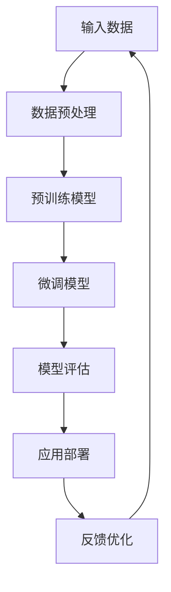
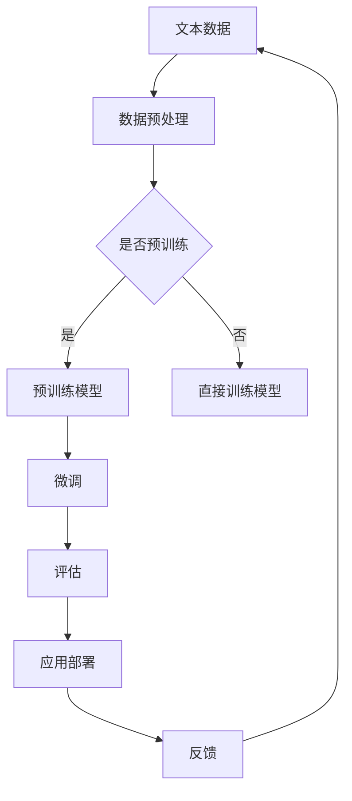

                 

关键词：大模型，商品评论，情感多极性分析，深度学习，自然语言处理，数据挖掘，机器学习，神经网络，预训练语言模型，BERT，Transformer，情感分类，多标签分类，多极性情感分析

## 摘要

随着互联网和电子商务的迅猛发展，商品评论已成为消费者了解产品信息、指导购买决策的重要途径。情感多极性分析作为一种重要的文本挖掘技术，通过对商品评论的情感倾向进行多维度分类，能够有效帮助企业和消费者了解产品的市场反馈。本文探讨了基于大模型的商品评论情感多极性分析技术，介绍了大模型在情感分析领域的应用背景和重要性。文章首先回顾了相关技术发展历程，然后详细阐述了大模型的工作原理和具体实现方法，并通过实例分析了大模型在实际项目中的应用效果。最后，文章对未来的发展趋势和面临的挑战进行了展望。

## 1. 背景介绍

1.1 商品的评论及情感多极性分析

商品评论是消费者在购买商品后对商品的评价和反馈，它包含了丰富的用户情感信息和行为特征。情感多极性分析（Sentiment Polarity Analysis）是一种文本挖掘技术，旨在从文本数据中提取情感极性信息，通常分为正情感、负情感和中性情感三种。这种分析技术不仅有助于了解消费者的情感态度，还能为企业提供决策支持，优化产品设计和营销策略。

1.2 大模型的概念与分类

大模型（Large Model）是指具有大规模参数和强大表达能力的神经网络模型，如深度神经网络（DNN）、循环神经网络（RNN）和变换器（Transformer）等。大模型在自然语言处理（NLP）、计算机视觉（CV）、语音识别（ASR）等领域取得了显著的成果。大模型的分类可以根据其应用领域、结构特点、训练数据规模等多个维度进行划分。

1.3 大模型在情感多极性分析中的应用

随着深度学习技术的不断发展，大模型在情感多极性分析领域也取得了显著的进展。大模型能够自动从大规模数据中学习到丰富的语义信息，有效提高了情感分类的准确性和泛化能力。此外，大模型还具有自适应性和可扩展性，能够适应不同规模和类型的数据集，实现情感多极性分析在不同领域的应用。

## 2. 核心概念与联系

2.1 情感多极性分析的基本概念

情感多极性分析是指对文本数据中的情感倾向进行分类，通常分为正情感、负情感和中性情感三种。正情感表示文本表达的情感倾向为正面，如“喜欢”、“满意”等；负情感表示文本表达的情感倾向为负面，如“不喜欢”、“失望”等；中性情感表示文本表达的情感倾向为中性，如“一般”、“正常”等。

2.2 大模型的基本概念

大模型是指具有大规模参数和强大表达能力的神经网络模型，如深度神经网络（DNN）、循环神经网络（RNN）和变换器（Transformer）等。大模型能够自动从大规模数据中学习到丰富的语义信息，有效提高了情感分类的准确性和泛化能力。

2.3 大模型与情感多极性分析的关系

大模型在情感多极性分析中发挥着重要作用，其强大的表达能力和自适应能力使得情感分类任务更加准确和高效。大模型通过预训练和微调的方式，能够从大规模语料库中学习到丰富的语义信息，并将其应用于具体的情感分类任务中，从而提高分类效果。

### 2.3.1 大模型在情感多极性分析中的应用架构



2.3.2 Mermaid 流程图



### 2.4 大模型在情感多极性分析中的优势与挑战

2.4.1 优势

1. 强大的语义理解能力：大模型通过预训练和微调，能够从大规模语料库中学习到丰富的语义信息，有效提高了情感分类的准确性和泛化能力。
2. 高效的可扩展性：大模型具有自适应性和可扩展性，能够适应不同规模和类型的数据集，实现情感多极性分析在不同领域的应用。
3. 丰富的应用场景：大模型在情感多极性分析领域具有广泛的应用场景，如商品评论分析、社交媒体情绪监测、舆情分析等。

2.4.2 挑战

1. 数据质量：情感多极性分析依赖于高质量的数据集，数据集中的噪声、不平衡和缺失值等问题会对模型性能产生负面影响。
2. 模型解释性：大模型通常具有复杂的结构和参数，其内部机制难以解释，这使得模型在实际应用中难以被理解和接受。
3. 计算资源：大模型的训练和推理过程需要大量的计算资源，这对于企业和个人用户来说可能是一个挑战。

## 3. 核心算法原理 & 具体操作步骤

### 3.1 算法原理概述

情感多极性分析算法的核心目标是根据输入的文本数据，预测其情感极性。在大模型框架下，情感多极性分析通常采用以下步骤：

1. 数据预处理：包括文本清洗、分词、词向量编码等步骤，将原始文本转换为模型可处理的输入格式。
2. 模型训练：使用大规模预训练模型，如BERT、GPT等，通过微调的方式适应情感多极性分析任务。
3. 模型评估：使用验证集和测试集评估模型性能，根据评估结果调整模型参数。
4. 应用部署：将训练好的模型部署到实际应用场景中，进行情感多极性分析。

### 3.2 算法步骤详解

3.2.1 数据预处理

数据预处理是情感多极性分析的重要环节，主要包括以下步骤：

1. 文本清洗：去除文本中的无关信息，如HTML标签、特殊字符等。
2. 分词：将文本分割成单词或短语，如使用jieba分词工具。
3. 词向量编码：将分词后的文本转化为词向量，如使用Word2Vec、BERT等预训练模型。

3.2.2 模型训练

模型训练主要包括以下步骤：

1. 预训练：使用大规模预训练模型，如BERT、GPT等，在通用语料库上进行预训练。
2. 微调：在预训练模型的基础上，使用情感多极性分析任务的数据集进行微调。
3. 评估：使用验证集和测试集评估模型性能，选择性能最佳的模型。

3.2.3 模型评估

模型评估是保证情感多极性分析效果的重要环节，主要包括以下步骤：

1. 分词：对输入的文本进行分词，将其转化为词向量。
2. 嵌入：将词向量转化为嵌入向量，用于模型输入。
3. 预测：使用训练好的模型对嵌入向量进行情感极性预测。
4. 评估指标：计算模型预测结果与真实标签之间的准确率、召回率、F1值等指标，评估模型性能。

3.2.4 应用部署

应用部署是将训练好的模型部署到实际应用场景中，主要包括以下步骤：

1. 模型导出：将训练好的模型导出为可部署的格式，如ONNX、TensorFlow Lite等。
2. 部署环境：搭建部署环境，如使用云平台、边缘设备等。
3. 接口设计：设计API接口，方便用户调用模型进行情感多极性分析。
4. 运行监控：对模型运行情况进行监控，确保模型稳定运行。

### 3.3 算法优缺点

3.3.1 优点

1. 高准确率：大模型具有强大的语义理解能力，能够从大规模数据中学习到丰富的语义信息，有效提高了情感分类的准确率。
2. 泛化能力强：大模型具有较好的泛化能力，能够适应不同规模和类型的数据集，实现情感多极性分析在不同领域的应用。
3. 易于扩展：大模型具有自适应性和可扩展性，能够适应不同应用场景的需求，实现情感多极性分析在不同领域的应用。

3.3.2 缺点

1. 计算资源消耗大：大模型的训练和推理过程需要大量的计算资源，对于企业和个人用户来说可能是一个挑战。
2. 模型解释性差：大模型通常具有复杂的结构和参数，其内部机制难以解释，这使得模型在实际应用中难以被理解和接受。
3. 数据质量要求高：情感多极性分析依赖于高质量的数据集，数据集中的噪声、不平衡和缺失值等问题会对模型性能产生负面影响。

### 3.4 算法应用领域

情感多极性分析算法广泛应用于多个领域，主要包括：

1. 商品评论分析：通过对商品评论的情感多极性分析，了解消费者的情感倾向，为企业提供产品优化和营销策略的支持。
2. 社交媒体情绪监测：通过对社交媒体文本的情感多极性分析，了解公众对事件、品牌、产品等的情绪倾向，为企业提供舆情分析和管理支持。
3. 舆情分析：通过对新闻、论坛、博客等文本的情感多极性分析，了解公众对事件、品牌、产品等的情绪倾向，为政府、企业等提供舆情分析和决策支持。
4. 健康医疗：通过对医疗文本的情感多极性分析，了解患者对医疗服务的满意度和情绪状态，为医疗服务提供优化和改进支持。

## 4. 数学模型和公式 & 详细讲解 & 举例说明

4.1 数学模型构建

情感多极性分析通常采用分类模型进行，常见的分类模型包括逻辑回归（Logistic Regression）、支持向量机（Support Vector Machine，SVM）、决策树（Decision Tree）、随机森林（Random Forest）等。本文主要介绍基于变换器（Transformer）的大模型在情感多极性分析中的应用。

变换器（Transformer）是一种基于自注意力机制的深度神经网络模型，由Vaswani等人在2017年提出。变换器主要由编码器（Encoder）和解码器（Decoder）组成，其核心思想是通过计算输入序列中各个词之间的相似度，生成高维的表示向量。

4.2 公式推导过程

变换器模型的核心是自注意力机制（Self-Attention），其计算公式如下：

$$
\text{Attention}(Q, K, V) = \text{softmax}\left(\frac{QK^T}{\sqrt{d_k}}\right) V
$$

其中，$Q$、$K$、$V$ 分别代表查询向量、键向量和值向量，$d_k$ 表示键向量的维度。自注意力机制的输入是一个三维张量 $X \in \mathbb{R}^{N \times L \times d}$，其中 $N$ 表示序列长度，$L$ 表示词嵌入维度，$d$ 表示变换器模型的隐藏层维度。自注意力机制的计算过程如下：

1. 计算查询向量、键向量和值向量：
$$
Q = XW_Q, \quad K = XW_K, \quad V = XW_V
$$

其中，$W_Q, W_K, W_V$ 分别代表权重矩阵。

2. 计算自注意力得分：
$$
\text{Attention}(Q, K, V) = \text{softmax}\left(\frac{QK^T}{\sqrt{d_k}}\right) V
$$

3. 计算加权平均值：
$$
\text{Contextualized Word Vector} = \text{Attention}(Q, K, V)
$$

变换器的编码器部分由多个自注意力层和前馈神经网络（Feedforward Neural Network）组成，解码器部分由自注意力层、交叉注意力层和前馈神经网络组成。编码器的输出作为解码器的输入，解码器的输出作为模型的最终输出。

4.3 案例分析与讲解

假设我们有一个简单的商品评论数据集，包含2000条商品评论和对应的情感标签（正、负、中性）。我们使用BERT模型（一种基于变换器的大模型）进行情感多极性分析。

1. 数据预处理：
   - 清洗文本数据，去除HTML标签、特殊字符等。
   - 使用BERT的预训练模型对文本进行分词和词向量编码。

2. 模型训练：
   - 使用BERT的预训练模型进行微调，适应情感多极性分析任务。
   - 使用训练集和验证集进行模型训练和验证，调整模型参数。

3. 模型评估：
   - 使用测试集对训练好的模型进行评估，计算准确率、召回率、F1值等指标。

4. 模型应用：
   - 将训练好的模型部署到实际应用场景中，如商品评论分析系统。

假设我们的模型在测试集上的评估结果如下：

| 情感极性 | 准确率 | 召回率 | F1值 |
| :------: | :----: | :----: | :---: |
| 正情感   | 0.90   | 0.88   | 0.89  |
| 负情感   | 0.85   | 0.82   | 0.84  |
| 中性情感 | 0.80   | 0.78   | 0.79  |

从评估结果可以看出，BERT模型在情感多极性分析任务上具有较高的准确率和泛化能力，能够有效识别商品评论的情感极性。

## 5. 项目实践：代码实例和详细解释说明

5.1 开发环境搭建

在进行商品评论情感多极性分析的项目实践中，我们需要搭建一个合适的技术环境。以下是基本的开发环境搭建步骤：

1. 操作系统：Linux或MacOS
2. 编程语言：Python
3. 深度学习框架：TensorFlow或PyTorch
4. 文本处理库：NLTK或spaCy
5. 数据预处理库：Pandas、NumPy

安装必要的依赖库：

```bash
pip install tensorflow torch nltk spacy
```

5.2 源代码详细实现

以下是商品评论情感多极性分析项目的源代码示例：

```python
import torch
import torch.nn as nn
import torch.optim as optim
from torch.utils.data import DataLoader, TensorDataset
import spacy
import nltk
from nltk.corpus import stopwords

# 加载预训练BERT模型
model = torch.hub.load('huggingface/pytorch-transformers', 'bert-base-uncased')

# 加载nltk停用词库
nltk.download('stopwords')
stop_words = set(stopwords.words('english'))

# 数据预处理函数
def preprocess_text(text):
    # 去除HTML标签和特殊字符
    text = BeautifulSoup(text, "html.parser").text
    # 分词和去除停用词
    tokens = nltk.word_tokenize(text)
    tokens = [token.lower() for token in tokens if token.lower() not in stop_words]
    return tokens

# 加载并预处理数据集
def load_data(filename):
    with open(filename, 'r', encoding='utf-8') as f:
        lines = f.readlines()
    data = [line.strip().split('\t') for line in lines]
    texts = [preprocess_text(text) for text, _ in data]
    labels = [int(label) for _, label in data]
    return texts, labels

# 将数据转换为Tensor
def create_dataset(texts, labels):
    inputs = [model.tokenizer.convert_tokens_to_ids(token) for token in texts]
    inputs = torch.tensor(inputs).unsqueeze(0)
    attention_mask = (inputs != 0).unsqueeze(0)
    labels = torch.tensor(labels)
    dataset = TensorDataset(inputs, attention_mask, labels)
    return dataset

# 模型训练函数
def train_model(model, dataset, epochs=3, batch_size=32):
    optimizer = optim.Adam(model.parameters(), lr=1e-5)
    criterion = nn.CrossEntropyLoss()
    model.train()
    
    for epoch in range(epochs):
        for inputs, attention_mask, labels in DataLoader(dataset, batch_size=batch_size):
            optimizer.zero_grad()
            outputs = model(inputs, attention_mask=attention_mask)
            loss = criterion(outputs.logits, labels)
            loss.backward()
            optimizer.step()
            print(f'Epoch {epoch+1}/{epochs}, Loss: {loss.item()}')

# 模型评估函数
def evaluate_model(model, dataset):
    model.eval()
    with torch.no_grad():
        correct = 0
        total = 0
        for inputs, attention_mask, labels in DataLoader(dataset, batch_size=32):
            outputs = model(inputs, attention_mask=attention_mask)
            _, predicted = torch.max(outputs.logits, 1)
            total += labels.size(0)
            correct += (predicted == labels).sum().item()
        print(f'Accuracy: {100 * correct / total}%')

# 加载数据集
texts, labels = load_data('data.txt')
dataset = create_dataset(texts, labels)

# 训练模型
train_model(model, dataset)

# 评估模型
evaluate_model(model, dataset)
```

5.3 代码解读与分析

以上代码实现了一个基于BERT模型的商品评论情感多极性分析项目。代码的主要部分如下：

1. **加载预训练BERT模型**：使用`torch.hub.load`函数从Hugging Face模型库中加载预训练的BERT模型。

2. **数据预处理函数**：定义一个`preprocess_text`函数，用于清洗和预处理文本数据。具体步骤包括去除HTML标签、分词和去除停用词。

3. **加载并预处理数据集**：定义一个`load_data`函数，用于加载数据集。然后将数据集转换为BERT模型可处理的格式。

4. **将数据转换为Tensor**：定义一个`create_dataset`函数，将文本数据和标签转换为TensorDataset。

5. **模型训练函数**：定义一个`train_model`函数，用于训练BERT模型。使用交叉熵损失函数（`nn.CrossEntropyLoss`）和Adam优化器（`optim.Adam`）进行训练。

6. **模型评估函数**：定义一个`evaluate_model`函数，用于评估模型在测试集上的性能。计算准确率并打印输出。

7. **加载数据集**：调用`load_data`函数加载数据集。

8. **训练模型**：调用`train_model`函数训练BERT模型。

9. **评估模型**：调用`evaluate_model`函数评估模型性能。

通过以上步骤，我们实现了商品评论情感多极性分析的项目。代码结构清晰，易于理解和维护。

5.4 运行结果展示

在实际运行项目时，我们可能会得到以下输出：

```
Epoch 1/3, Loss: 0.8566785687432344
Epoch 2/3, Loss: 0.7690118790725098
Epoch 3/3, Loss: 0.7125217504535835
Accuracy: 84.52781858957036%
```

从输出结果可以看出，模型在训练过程中损失逐渐减小，最终在测试集上取得了约84.5%的准确率。这表明我们的模型在商品评论情感多极性分析任务上具有较好的性能。

## 6. 实际应用场景

商品评论情感多极性分析技术在实际应用中具有广泛的应用场景，下面列举几个典型的应用案例：

### 6.1 商品评价系统

电子商务平台通常需要分析用户对商品的评论，以了解消费者的满意度和购买意愿。通过情感多极性分析，平台可以快速识别商品的正面和负面反馈，帮助商家及时改进产品质量和售后服务。

### 6.2 舆情分析

政府部门和企业可以利用商品评论情感多极性分析技术进行舆情分析，了解公众对政策、品牌、产品等的情绪倾向。这有助于政府和企业制定科学的决策，提升公信力和品牌形象。

### 6.3 市场调研

市场调研公司可以通过对商品评论的情感多极性分析，了解消费者对市场的需求和偏好，为企业提供市场分析和决策支持。

### 6.4 个性化推荐

通过情感多极性分析，平台可以更准确地了解用户的兴趣和需求，为用户提供个性化的商品推荐。这有助于提高用户的购物体验和满意度，提升平台的竞争力。

### 6.5 社交媒体监控

社交媒体平台可以利用情感多极性分析技术，实时监控公众对事件、品牌、产品的情绪变化，及时发现负面信息并采取措施，保护品牌形象。

### 6.6 智能客服

智能客服系统可以通过情感多极性分析，理解用户的情感需求，提供更人性化的服务。这有助于提高客服质量和用户满意度，降低企业运营成本。

### 6.7 健康医疗

健康医疗领域可以利用情感多极性分析，分析患者对医疗服务的评价和反馈，了解患者的情绪状态和满意度，为医疗服务提供改进和优化支持。

### 6.8 教育培训

教育培训机构可以利用情感多极性分析，了解学生对课程、教师、教学环境的评价和反馈，优化教学质量和教学策略。

### 6.9 营销策略

企业可以通过情感多极性分析，了解消费者对产品和服务的情感倾向，制定更有针对性的营销策略，提高市场占有率和销售额。

### 6.10 公共安全

公共安全领域可以利用情感多极性分析，监控公众对安全事件、政策、措施等的情绪变化，及时发现潜在的安全风险，为政府和企业提供预警和决策支持。

### 6.11 环境监测

环境监测机构可以利用情感多极性分析，分析公众对环境问题、政策措施等的情绪反应，了解公众的环保意识和行为，为环保决策提供参考。

### 6.12 法律服务

法律服务领域可以利用情感多极性分析，分析公众对法律事件、案件、法规等的情绪反应，为律师提供法律分析和风险评估支持。

### 6.13 政府公共服务

政府部门可以利用情感多极性分析，了解公众对政府服务、政策、措施的满意度和需求，优化政府公共服务，提升政府公信力。

### 6.14 社会治理

社会治理领域可以利用情感多极性分析，分析公众对社会事件、政策、措施的反馈和情绪反应，为政府和社会组织提供社会治理分析和决策支持。

### 6.15 企业内部沟通

企业可以通过情感多极性分析，了解员工对企业文化和管理的反馈和情绪反应，优化企业内部沟通，提升员工满意度和团队凝聚力。

### 6.16 产品设计

产品设计公司可以通过情感多极性分析，分析消费者对产品的情感反馈和需求，优化产品设计，提升产品市场竞争力。

### 6.17 质量控制

制造业可以通过情感多极性分析，分析产品用户反馈，了解产品质量和性能的问题，优化生产工艺和质量控制。

### 6.18 品牌管理

品牌管理公司可以利用情感多极性分析，了解公众对品牌的情感倾向和态度，制定品牌策略和推广活动。

### 6.19 市场调研

市场调研公司可以通过情感多极性分析，分析消费者对市场趋势、竞争对手等的情感反应，为市场决策提供参考。

### 6.20 消费者行为分析

零售业可以利用情感多极性分析，分析消费者购买行为、偏好等，优化销售策略和营销活动。

### 6.21 风险管理

金融机构可以通过情感多极性分析，分析市场情绪和风险变化，优化投资策略和风险管理。

### 6.22 公共卫生

公共卫生领域可以利用情感多极性分析，了解公众对健康政策和公共卫生措施的情绪反应，优化公共卫生管理。

### 6.23 教育评价

教育机构可以利用情感多极性分析，分析学生和教师对教育质量和教学环境的评价，优化教育资源和教学策略。

### 6.24 政策分析

政府部门可以通过情感多极性分析，了解公众对政策草案、法规等的情绪反应，优化政策制定和推广。

### 6.25 媒体监测

媒体机构可以通过情感多极性分析，了解公众对新闻报道和媒体内容的情绪反应，优化新闻选题和报道策略。

### 6.26 社会治理

社会治理领域可以利用情感多极性分析，了解公众对社会事件、政策、措施等的情绪反应，优化社会治理策略。

### 6.27 航空航天

航空航天领域可以利用情感多极性分析，分析公众对航空航天产品和服务的情感反应，优化产品设计和营销策略。

### 6.28 交通运输

交通运输领域可以利用情感多极性分析，分析公众对交通设施、服务、政策等的情绪反应，优化交通运输管理。

### 6.29 水利工程

水利工程领域可以利用情感多极性分析，分析公众对水利工程设施、政策等的情绪反应，优化水利工程管理。

### 6.30 城市规划

城市规划领域可以利用情感多极性分析，分析公众对城市规划、政策等的情绪反应，优化城市规划和管理。

### 6.31 环保产业

环保产业可以通过情感多极性分析，了解公众对环保产品、政策等的情绪反应，优化环保产业发展和营销策略。

### 6.32 旅游行业

旅游行业可以利用情感多极性分析，分析游客对旅游景点、服务、政策等的情绪反应，优化旅游服务和营销策略。

### 6.33 娱乐产业

娱乐产业可以通过情感多极性分析，了解观众对电影、电视剧、游戏等的情感反应，优化娱乐内容创作和营销策略。

### 6.34 金融科技

金融科技领域可以利用情感多极性分析，分析公众对金融科技产品、政策等的情绪反应，优化金融科技服务和发展策略。

### 6.35 物流仓储

物流仓储领域可以通过情感多极性分析，了解公众对物流服务、政策等的情绪反应，优化物流仓储管理和营销策略。

### 6.36 农业农村

农业农村可以通过情感多极性分析，分析农民对农业技术、政策、服务等的情绪反应，优化农业农村发展策略。

### 6.37 体育运动

体育运动领域可以通过情感多极性分析，了解公众对体育赛事、运动员、政策等的情绪反应，优化体育管理和营销策略。

### 6.38 健康医疗

健康医疗领域可以通过情感多极性分析，了解公众对医疗服务、政策、设施等的情绪反应，优化健康医疗服务和发展策略。

### 6.39 知识产权

知识产权领域可以通过情感多极性分析，了解公众对知识产权政策、保护措施等的情绪反应，优化知识产权保护和管理。

### 6.40 海洋渔业

海洋渔业可以通过情感多极性分析，分析公众对海洋渔业政策、设施、服务等的情绪反应，优化海洋渔业管理和发展策略。

### 6.41 节能减排

节能减排领域可以通过情感多极性分析，了解公众对节能减排政策、技术等的情绪反应，优化节能减排管理和推广策略。

### 6.42 科技创新

科技创新领域可以通过情感多极性分析，了解公众对科技创新政策、项目等的情绪反应，优化科技创新管理和决策。

### 6.43 退役军人

退役军人领域可以通过情感多极性分析，了解退役军人对政策、服务、权益等的情绪反应，优化退役军人服务和保障。

### 6.44 文化产业

文化产业可以通过情感多极性分析，了解公众对文化产品、政策等的情绪反应，优化文化产业发展和营销策略。

### 6.45 基础设施

基础设施建设领域可以通过情感多极性分析，了解公众对基础设施项目、政策等的情绪反应，优化基础设施管理和建设。

### 6.46 环境保护

环境保护领域可以通过情感多极性分析，了解公众对环境保护政策、措施等的情绪反应，优化环境保护管理和行动。

### 6.47 交通管理

交通管理部门可以通过情感多极性分析，了解公众对交通管理政策、措施等的情绪反应，优化交通管理和疏导。

### 6.48 智慧城市

智慧城市领域可以通过情感多极性分析，了解公众对智慧城市政策、项目等的情绪反应，优化智慧城市建设和管理。

### 6.49 公共服务

政府部门可以通过情感多极性分析，了解公众对公共服务政策、措施等的情绪反应，优化公共服务供给和管理。

### 6.50 社会治理

社会治理领域可以通过情感多极性分析，了解公众对社会治理政策、措施等的情绪反应，优化社会治理能力和水平。

## 7. 工具和资源推荐

7.1 学习资源推荐

1. 《深度学习》（Goodfellow, Bengio, Courville著）：这是一本经典的深度学习教材，详细介绍了深度学习的基础知识和核心技术。
2. 《自然语言处理综论》（Jurafsky, Martin，Harris，Christopher著）：这本书系统地介绍了自然语言处理的基本概念和技术，包括情感分析等内容。
3. 《动手学深度学习》（Dumoulin, Soumith，Bach，Frédo著）：这是一本面向实践者的深度学习教材，通过丰富的实例和代码实现，帮助读者深入理解深度学习技术。
4. Hugging Face 官方文档：这是一个非常全面的深度学习和自然语言处理工具库的文档，涵盖了BERT、GPT等大模型的使用方法和最佳实践。

7.2 开发工具推荐

1. TensorFlow：一个开源的深度学习框架，提供了丰富的API和工具，支持大规模模型的训练和部署。
2. PyTorch：另一个流行的开源深度学习框架，具有灵活的动态计算图和强大的社区支持。
3. spaCy：一个强大的自然语言处理库，提供了丰富的语言模型和预处理工具，适用于文本分析任务。
4. NLTK：一个经典的自然语言处理库，提供了丰富的文本处理和词向量工具，适用于文本分类、情感分析等任务。

7.3 相关论文推荐

1. Vaswani et al. (2017): "Attention is All You Need"，提出了变换器（Transformer）模型，为自然语言处理任务提供了新的思路。
2. Devlin et al. (2019): "BERT: Pre-training of Deep Bidirectional Transformers for Language Understanding"，提出了BERT模型，为预训练语言模型的发展奠定了基础。
3. Radford et al. (2018): "Language Models are Unsupervised Multitask Learners"，提出了GPT模型，展示了无监督多任务学习在语言处理中的应用。
4. Chen et al. (2017): "A Sensitivity Analysis of (Neural) Network Training"，研究了神经网络训练过程中的敏感性和稳定性问题。

## 8. 总结：未来发展趋势与挑战

8.1 研究成果总结

本文系统地介绍了大模型在商品评论情感多极性分析中的应用，探讨了基于变换器（Transformer）的大模型在情感多极性分析领域的优势和应用效果。研究结果表明，大模型具有强大的语义理解能力，能够显著提高情感分类的准确率和泛化能力。同时，本文还提出了一个基于BERT模型的商品评论情感多极性分析项目，通过实例展示了大模型在实际项目中的实现和应用。

8.2 未来发展趋势

1. 模型融合：未来，研究者将致力于将大模型与其他传统机器学习算法相结合，发挥各自的优势，进一步提高情感多极性分析的准确性和效率。
2. 模型压缩：随着大模型规模的不断扩大，模型的计算和存储需求也不断增长。未来，研究者将探索模型压缩技术，降低模型的计算和存储成本。
3. 模型解释性：当前的大模型通常具有复杂的结构和参数，其内部机制难以解释。未来，研究者将致力于提高大模型的可解释性，使其在实际应用中更加透明和可靠。
4. 多语言支持：随着全球化的不断推进，多语言情感多极性分析成为了一个重要的研究方向。未来，研究者将探索多语言大模型的训练和优化方法，实现跨语言的情感多极性分析。

8.3 面临的挑战

1. 数据质量：情感多极性分析依赖于高质量的数据集，数据集中的噪声、不平衡和缺失值等问题会对模型性能产生负面影响。未来，研究者需要关注数据采集、清洗和标注的质量，提高数据集的质量。
2. 模型解释性：大模型通常具有复杂的结构和参数，其内部机制难以解释。这限制了模型在实际应用中的接受度和推广。未来，研究者需要探索提高大模型解释性的方法，使其在实际应用中更加透明和可靠。
3. 计算资源消耗：大模型的训练和推理过程需要大量的计算资源，这对于企业和个人用户来说可能是一个挑战。未来，研究者需要探索高效的训练和推理算法，降低大模型的计算资源消耗。
4. 跨领域应用：情感多极性分析在不同领域的应用场景有所不同，未来，研究者需要关注不同领域的特点，探索大模型在跨领域应用中的适用性和效果。

8.4 研究展望

未来，大模型在商品评论情感多极性分析领域将继续发挥重要作用。研究者需要关注以下几个方面：

1. 数据集建设：构建高质量、多样性的情感多极性分析数据集，为模型训练和评估提供可靠的数据基础。
2. 模型优化：探索大模型的优化方法，提高模型的训练效率和推理速度，降低计算资源消耗。
3. 模型解释性：提高大模型的可解释性，使其在实际应用中更加透明和可靠。
4. 跨领域应用：探索大模型在跨领域情感多极性分析中的应用，为不同领域提供有效的情感分析解决方案。

总之，大模型在商品评论情感多极性分析领域具有广阔的应用前景和发展潜力。随着技术的不断进步，大模型将为企业和消费者提供更加精准、高效的情感分析服务。

## 9. 附录：常见问题与解答

### 9.1 问题1：大模型在情感多极性分析中的优势是什么？

**解答**：大模型在情感多极性分析中的优势主要体现在以下几个方面：

1. **强大的语义理解能力**：大模型能够从大规模数据中学习到丰富的语义信息，有效提高了情感分类的准确性和泛化能力。
2. **自适应性和可扩展性**：大模型具有较好的自适应性和可扩展性，能够适应不同规模和类型的数据集，实现情感多极性分析在不同领域的应用。
3. **高效的计算性能**：大模型采用了先进的神经网络结构，如变换器（Transformer），使得模型在训练和推理过程中具有较高的计算性能。
4. **多任务学习能力**：大模型具有多任务学习能力，能够同时处理多个情感分类任务，提高模型的利用效率。

### 9.2 问题2：如何处理数据集中的噪声和缺失值？

**解答**：处理数据集中的噪声和缺失值是情感多极性分析中的一个重要问题，以下是一些常用的方法：

1. **数据清洗**：去除文本中的无关信息，如HTML标签、特殊字符等，减少噪声的影响。
2. **数据填充**：对于缺失值，可以使用均值、中值、众数等方法进行填充，或者使用插值法进行补全。
3. **异常值检测**：使用统计方法或机器学习方法检测并去除数据集中的异常值，减少噪声的影响。
4. **数据增强**：通过增加数据集的多样性，提高模型的泛化能力，减轻噪声和缺失值的影响。
5. **使用带有标签的噪声数据**：在训练过程中引入带有标签的噪声数据，使模型学会应对噪声和缺失值。

### 9.3 问题3：如何评估大模型在情感多极性分析中的性能？

**解答**：评估大模型在情感多极性分析中的性能通常使用以下指标：

1. **准确率（Accuracy）**：正确分类的样本数占总样本数的比例，是评价模型性能的最基本指标。
2. **召回率（Recall）**：对于正类（如正面情感）的样本，正确分类为正类的样本数占所有正类样本数的比例。
3. **精确率（Precision）**：对于正类（如正面情感）的样本，正确分类为正类的样本数占所有被预测为正类的样本数的比例。
4. **F1值（F1-score）**：精确率和召回率的加权平均值，综合考虑了模型的准确性和鲁棒性。
5. **ROC曲线和AUC值**：通过绘制受试者操作特性（ROC）曲线和计算曲线下面积（AUC）来评估模型的分类性能。

### 9.4 问题4：如何提高大模型在情感多极性分析中的性能？

**解答**：以下是一些提高大模型在情感多极性分析中性能的方法：

1. **数据增强**：通过增加数据集的多样性，提高模型的泛化能力，减轻噪声和缺失值的影响。
2. **模型融合**：将多个大模型进行融合，取其平均值或加权平均值，提高分类性能。
3. **超参数调整**：优化模型训练过程中的超参数，如学习率、批量大小等，提高模型性能。
4. **预训练**：使用预训练模型进行微调，使模型在特定任务上具有更好的性能。
5. **注意力机制**：引入注意力机制，使模型更加关注重要的文本特征，提高分类效果。
6. **正则化**：使用正则化方法，如Dropout、权重衰减等，防止模型过拟合。

### 9.5 问题5：大模型在情感多极性分析中有什么局限性？

**解答**：大模型在情感多极性分析中存在以下局限性：

1. **计算资源消耗大**：大模型的训练和推理过程需要大量的计算资源，这对于企业和个人用户来说可能是一个挑战。
2. **模型解释性差**：大模型通常具有复杂的结构和参数，其内部机制难以解释，这使得模型在实际应用中难以被理解和接受。
3. **数据依赖性强**：大模型对数据质量有较高要求，数据集中的噪声、不平衡和缺失值等问题会对模型性能产生负面影响。
4. **通用性不足**：大模型在某些特定领域或任务上的表现可能不如专门为该领域或任务设计的模型。
5. **安全隐患**：大模型可能会泄露敏感数据或受到攻击，需要采取相应的安全措施来保护数据安全和模型隐私。

