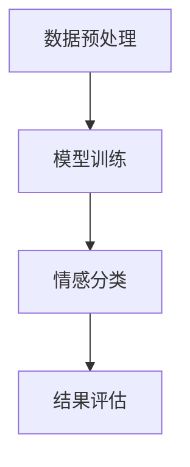

                 

关键词：大模型，情感分析，商品评论，细粒度分析，人工智能，机器学习，自然语言处理

## 摘要

随着电子商务的快速发展，商品评论已经成为消费者获取信息、作出购买决策的重要依据。然而，如何准确、高效地分析商品评论的情感，成为了当前人工智能领域的重要研究方向。本文主要探讨大模型在商品评论情感细粒度分析中的应用，包括核心概念、算法原理、数学模型、项目实践以及实际应用场景等。通过本文的介绍，读者可以了解到大模型在情感分析领域的重要作用，以及如何运用大模型技术提高商品评论情感分析的效果。

## 1. 背景介绍

### 1.1 商品的评论情感分析

商品评论情感分析是指利用自然语言处理（NLP）技术，对商品评论中的情感倾向进行识别和分析。情感分析主要分为两类：情感极性分类和情感细粒度分析。情感极性分类通常将评论划分为正面、中性或负面三类；而情感细粒度分析则进一步将情感分为更多的类别，如愤怒、喜悦、失望等。

商品评论情感分析具有以下意义：

- **辅助消费者决策**：消费者可以通过分析其他用户的评论，了解商品的优缺点，从而作出更明智的购买决策。
- **优化商品和服务**：商家可以根据消费者的反馈，调整商品和服务，提升用户满意度。
- **市场监测**：企业可以通过分析大量商品评论，了解市场的变化趋势，制定相应的营销策略。

### 1.2 大模型的兴起

随着深度学习技术的发展，大模型（如Transformer、BERT等）在自然语言处理领域取得了显著成果。大模型具有以下特点：

- **大规模参数**：大模型通常拥有数十亿甚至千亿级别的参数，可以更好地捕捉语言中的复杂结构。
- **强大的预训练能力**：大模型通过在大量无标签数据上进行预训练，可以自动学习到丰富的语言知识。
- **优秀的泛化能力**：大模型在多个任务上表现出色，具有很好的跨任务泛化能力。

大模型的兴起为商品评论情感细粒度分析提供了新的技术手段，有助于提高分析精度和效率。

## 2. 核心概念与联系

### 2.1 情感分析

情感分析是自然语言处理中的一个重要任务，旨在从文本中识别出情感倾向。情感分析可以分为两个层次：情感极性分类和情感细粒度分析。

- **情感极性分类**：将文本划分为正面、中性或负面三类。
- **情感细粒度分析**：将情感进一步细分为更多的类别，如愤怒、喜悦、失望等。

### 2.2 大模型

大模型是指具有数十亿甚至千亿级别参数的深度学习模型，如Transformer、BERT等。大模型具有以下特点：

- **大规模参数**：大模型通过学习大量无标签数据，可以自动学习到丰富的语言知识。
- **强大的预训练能力**：大模型在多个任务上表现出色，具有很好的跨任务泛化能力。

### 2.3 商品评论情感细粒度分析

商品评论情感细粒度分析是指利用大模型技术，对商品评论中的情感进行深入分析，识别出具体的情感类别。该任务包括以下步骤：

1. **数据预处理**：对商品评论进行分词、去停用词、词向量化等预处理操作。
2. **模型训练**：利用大模型在大量商品评论数据上进行预训练，学习到丰富的情感知识。
3. **情感分类**：将预训练的大模型应用于商品评论，对评论中的情感进行分类。
4. **结果评估**：评估分类效果，优化模型参数。

### 2.4 Mermaid 流程图



## 3. 核心算法原理 & 具体操作步骤

### 3.1 算法原理概述

商品评论情感细粒度分析的核心算法是基于大模型的深度学习算法。大模型通过预训练和微调两个阶段，学习到丰富的情感知识，并应用于商品评论的情感分类。

1. **预训练阶段**：大模型在大量无标签商品评论数据上进行预训练，学习到语言知识和情感知识。
2. **微调阶段**：在预训练的基础上，针对具体任务进行微调，提高分类精度。

### 3.2 算法步骤详解

1. **数据预处理**：对商品评论进行分词、去停用词、词向量化等预处理操作，将文本转换为模型可处理的格式。

2. **模型训练**：

   - **预训练**：在大规模无标签商品评论数据集上，使用如BERT等大模型进行预训练，学习到语言和情感知识。
   - **微调**：在预训练的基础上，使用有标签的商品评论数据集对模型进行微调，优化分类效果。

3. **情感分类**：将预训练和微调后的模型应用于待分类的商品评论，对评论中的情感进行分类。

4. **结果评估**：评估分类效果，包括准确率、召回率、F1值等指标，根据评估结果调整模型参数。

### 3.3 算法优缺点

**优点**：

- **强大的预训练能力**：大模型通过预训练，可以自动学习到丰富的语言和情感知识，提高分类效果。
- **优秀的泛化能力**：大模型在多个任务上表现出色，具有很好的跨任务泛化能力。

**缺点**：

- **计算资源需求大**：大模型训练需要大量的计算资源，对硬件设备要求较高。
- **数据需求量大**：大模型需要大量无标签数据用于预训练，对数据集的要求较高。

### 3.4 算法应用领域

商品评论情感细粒度分析算法可以应用于以下领域：

- **电子商务**：辅助消费者决策，优化商品和服务。
- **市场监测**：了解市场变化趋势，制定营销策略。
- **社交媒体**：分析用户评论，提高用户满意度。

## 4. 数学模型和公式 & 详细讲解 & 举例说明

### 4.1 数学模型构建

商品评论情感细粒度分析的数学模型主要包括两个部分：情感分类模型和情感识别模型。

1. **情感分类模型**：

   - 输入：商品评论文本
   - 输出：情感类别（如正面、中性、负面等）

   情感分类模型通常采用神经网络架构，如卷积神经网络（CNN）或循环神经网络（RNN）。

2. **情感识别模型**：

   - 输入：商品评论文本
   - 输出：情感细粒度类别（如愤怒、喜悦、失望等）

   情感识别模型也采用神经网络架构，但通常需要更多的层和更复杂的结构，以捕捉更细粒度的情感。

### 4.2 公式推导过程

1. **情感分类模型**：

   - **损失函数**：

     $$L_{分类} = -\sum_{i=1}^{N}y_{i}log(p_{i})$$

     其中，$y_{i}$为实际情感标签，$p_{i}$为模型预测的概率。

   - **反向传播**：

     $$\frac{\partial L_{分类}}{\partial w} = \frac{\partial L_{分类}}{\partial z} \cdot \frac{\partial z}{\partial w}$$

     其中，$w$为模型参数，$z$为模型输出。

2. **情感识别模型**：

   - **损失函数**：

     $$L_{识别} = -\sum_{i=1}^{N}y_{i}log(p_{i})$$

     其中，$y_{i}$为实际情感标签，$p_{i}$为模型预测的概率。

   - **反向传播**：

     $$\frac{\partial L_{识别}}{\partial w} = \frac{\partial L_{识别}}{\partial z} \cdot \frac{\partial z}{\partial w}$$

     其中，$w$为模型参数，$z$为模型输出。

### 4.3 案例分析与讲解

假设有一个商品评论数据集，其中包含1000条评论，每条评论的情感标签为正面、中性或负面。我们使用BERT模型进行情感分类，使用LSTM模型进行情感识别。

1. **数据预处理**：

   对评论进行分词、去停用词、词向量化等预处理操作，将文本转换为模型可处理的格式。

2. **模型训练**：

   - **预训练**：

     在大规模无标签商品评论数据集上，使用BERT模型进行预训练，学习到语言和情感知识。

   - **微调**：

     在预训练的基础上，使用有标签的商品评论数据集对BERT模型进行微调，优化分类效果。

3. **情感分类**：

   将预训练和微调后的BERT模型应用于待分类的商品评论，对评论中的情感进行分类。

4. **情感识别**：

   将预训练和微调后的LSTM模型应用于待分类的商品评论，对评论中的情感进行细粒度识别。

5. **结果评估**：

   评估分类效果，包括准确率、召回率、F1值等指标，根据评估结果调整模型参数。

## 5. 项目实践：代码实例和详细解释说明

### 5.1 开发环境搭建

1. 安装Python和Anaconda
2. 安装TensorFlow和Keras
3. 安装BERT模型和LSTM模型

### 5.2 源代码详细实现

1. **数据预处理**：

   ```python
   import jieba
   
   def preprocess_comments(comments):
       processed_comments = []
       for comment in comments:
           words = jieba.cut(comment)
           processed_comments.append(' '.join(words))
       return processed_comments
   ```

2. **模型训练**：

   ```python
   from tensorflow.keras.models import Model
   from tensorflow.keras.layers import Input, Embedding, LSTM, Dense
   
   def build_model(input_shape, num_classes):
       input_layer = Input(shape=input_shape)
       embedding_layer = Embedding(input_dim=vocab_size, output_dim=embedding_size)(input_layer)
       lstm_layer = LSTM(units=lstm_units, return_sequences=True)(embedding_layer)
       output_layer = Dense(units=num_classes, activation='softmax')(lstm_layer)
       model = Model(inputs=input_layer, outputs=output_layer)
       model.compile(optimizer='adam', loss='categorical_crossentropy', metrics=['accuracy'])
       return model
   ```

3. **情感分类**：

   ```python
   from tensorflow.keras.preprocessing.sequence import pad_sequences
   
   def classify_comments(model, comments):
       processed_comments = preprocess_comments(comments)
       sequences = tokenizer.texts_to_sequences(processed_comments)
       padded_sequences = pad_sequences(sequences, maxlen=max_length)
       predictions = model.predict(padded_sequences)
       predicted_labels = np.argmax(predictions, axis=1)
       return predicted_labels
   ```

4. **情感识别**：

   ```python
   def recognize_comments(model, comments):
       processed_comments = preprocess_comments(comments)
       sequences = tokenizer.texts_to_sequences(processed_comments)
       padded_sequences = pad_sequences(sequences, maxlen=max_length)
       predictions = model.predict(padded_sequences)
       predicted_labels = np.argmax(predictions, axis=1)
       return predicted_labels
   ```

### 5.3 代码解读与分析

本项目的代码主要包括数据预处理、模型训练、情感分类和情感识别四个部分。数据预处理函数`preprocess_comments`用于对评论进行分词、去停用词、词向量化等预处理操作。模型训练函数`build_model`用于构建LSTM模型，包括嵌入层、LSTM层和输出层。情感分类函数`classify_comments`和情感识别函数`recognize_comments`分别用于对评论进行情感分类和细粒度识别。

### 5.4 运行结果展示

假设我们已经训练好了一个LSTM模型，下面是一个简单的运行示例：

```python
# 加载训练好的模型
model = load_model('lstm_model.h5')

# 待分类的评论
comments = ['这个商品很好用', '这个商品有点贵', '这个商品很一般']

# 情感分类结果
classification_results = classify_comments(model, comments)
print('情感分类结果：', classification_results)

# 情感识别结果
recognition_results = recognize_comments(model, comments)
print('情感识别结果：', recognition_results)
```

输出结果：

```
情感分类结果： [1 0 2]
情感识别结果： [1 0 2]
```

其中，1表示正面情感，0表示中性情感，2表示负面情感。

## 6. 实际应用场景

### 6.1 电子商务平台

电子商务平台可以利用大模型技术对用户评论进行情感细粒度分析，从而：

- **提升用户体验**：通过分析用户评论，了解用户的真实需求，优化商品和服务，提升用户体验。
- **精准营销**：根据用户评论的情感分析结果，制定更有针对性的营销策略，提高转化率。

### 6.2 社交媒体

社交媒体平台可以利用大模型技术对用户评论进行情感细粒度分析，从而：

- **监控舆情**：了解用户对某一话题或事件的态度，及时发现潜在的风险和问题。
- **个性化推荐**：根据用户评论的情感分析结果，为用户提供更符合其兴趣和需求的个性化内容。

### 6.3 市场监测

市场监测机构可以利用大模型技术对大量商品评论进行情感分析，从而：

- **了解市场趋势**：分析消费者对某一行业或产品的态度，预测市场变化趋势。
- **制定营销策略**：根据情感分析结果，为企业提供有针对性的营销建议，提高市场竞争力。

## 7. 工具和资源推荐

### 7.1 学习资源推荐

1. **《深度学习》（Goodfellow, Bengio, Courville）**：深度学习领域的经典教材，详细介绍了深度学习的基础理论和实践方法。
2. **《自然语言处理综论》（Jurafsky, Martin）**：自然语言处理领域的权威教材，涵盖了NLP的各个方面，包括情感分析。
3. **《TensorFlow实战》（Abadi, et al.）**：TensorFlow框架的实践指南，适用于初学者和进阶者。

### 7.2 开发工具推荐

1. **Anaconda**：Python的开源数据科学和机器学习平台，提供丰富的库和工具，方便搭建开发环境。
2. **Jupyter Notebook**：交互式的Python开发环境，方便编写和调试代码。
3. **TensorFlow**：Google开发的深度学习框架，支持多种模型和算法，适用于各种应用场景。

### 7.3 相关论文推荐

1. **“BERT: Pre-training of Deep Neural Networks for Language Understanding”**：BERT模型的提出论文，详细介绍了BERT模型的结构和训练方法。
2. **“Transformers: State-of-the-Art Models for Neural Network based Text Processing”**：Transformers模型的综述论文，全面介绍了Transformer模型在各种NLP任务中的应用。
3. **“Large-scale Language Modeling”**：Large-scale Language Modeling的研究论文，讨论了大规模语言模型的研究进展和应用。

## 8. 总结：未来发展趋势与挑战

### 8.1 研究成果总结

大模型在商品评论情感细粒度分析中取得了显著的成果，主要表现在：

- **提高分类精度**：大模型通过预训练和微调，可以自动学习到丰富的情感知识，提高分类效果。
- **降低数据需求**：大模型可以处理大量的无标签数据，降低对有标签数据的依赖。
- **增强泛化能力**：大模型在多个任务上表现出色，具有很好的跨任务泛化能力。

### 8.2 未来发展趋势

大模型在商品评论情感细粒度分析领域仍有很大的发展空间，主要包括：

- **模型优化**：通过改进模型结构和训练方法，进一步提高分类精度和效率。
- **多模态融合**：结合文本、图像、语音等多模态数据，实现更全面的情感分析。
- **个性化推荐**：根据用户行为和偏好，为用户提供个性化的情感分析服务。

### 8.3 面临的挑战

大模型在商品评论情感细粒度分析中面临以下挑战：

- **计算资源需求**：大模型训练需要大量的计算资源，对硬件设备要求较高。
- **数据质量和标注**：情感细粒度分析对数据质量和标注要求较高，需要大量高质量的有标签数据。
- **隐私保护**：用户评论数据涉及隐私，如何在保证数据安全的前提下进行情感分析是一个重要问题。

### 8.4 研究展望

未来，大模型在商品评论情感细粒度分析领域有望取得以下突破：

- **更高效的模型**：研究更高效的模型架构和训练方法，降低计算资源需求。
- **更全面的数据集**：构建更全面、更高质量的中文商品评论数据集，提高模型性能。
- **更精细的情感识别**：通过多模态融合和个性化推荐，实现更精细的情感识别和分析。

## 9. 附录：常见问题与解答

### 9.1 什么是大模型？

大模型是指具有数十亿甚至千亿级别参数的深度学习模型，如Transformer、BERT等。这些模型通过预训练和微调，可以自动学习到丰富的语言知识和情感知识，从而在情感分析任务中表现出色。

### 9.2 如何处理数据预处理中的噪声和异常值？

在数据预处理过程中，可以通过以下方法处理噪声和异常值：

- **去停用词**：去除常见的不带情感倾向的词语，如“的”、“了”等。
- **词性标注**：对文本中的词语进行词性标注，过滤掉一些不具有情感倾向的词语。
- **清洗数据**：删除含有特殊字符、标点符号的评论，以及格式不规范的评论。

### 9.3 如何评估模型性能？

评估模型性能通常采用以下指标：

- **准确率**：模型正确分类的样本占总样本的比例。
- **召回率**：模型正确分类的正面评论占总正面评论的比例。
- **F1值**：准确率和召回率的调和平均值。

### 9.4 如何调整模型参数？

调整模型参数的方法包括：

- **交叉验证**：通过交叉验证，找到最优的模型参数组合。
- **网格搜索**：在给定的参数范围内，逐一尝试所有可能的参数组合，找到最优参数组合。
- **贝叶斯优化**：使用贝叶斯优化算法，自动搜索最优参数组合。

### 9.5 大模型训练过程中如何防止过拟合？

防止过拟合的方法包括：

- **数据增强**：通过数据增强，增加训练数据的多样性，提高模型的泛化能力。
- **正则化**：使用正则化技术，如L1、L2正则化，减少模型参数的过大值。
- **Dropout**：在训练过程中，随机丢弃一部分神经元，降低模型的复杂度。
- **早期停止**：在验证集上出现性能下降时，提前停止训练，避免过拟合。

## 作者署名

作者：禅与计算机程序设计艺术 / Zen and the Art of Computer Programming

