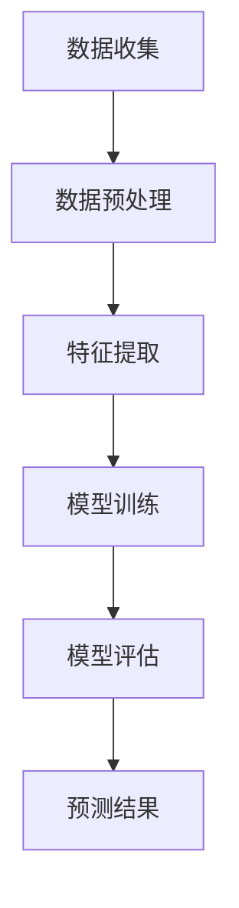
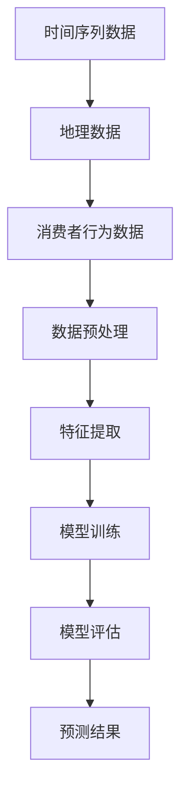

                 

关键词：大模型、商品销量预测、时空分析、人工智能、机器学习、深度学习

摘要：随着电子商务的迅猛发展，准确预测商品销量对企业的决策至关重要。本文探讨了如何利用大模型进行商品销量预测，并深入分析了时空分析在该领域的应用。本文首先介绍了商品销量预测的背景和重要性，然后详细阐述了时空分析的核心概念和方法，接着分析了大模型在时空分析中的应用原理，并提出了一个具体的实现步骤。随后，本文通过数学模型和公式的推导，展示了如何在大模型中实现时空分析。最后，本文通过一个实际项目实例，详细解释了代码实现和运行结果，并探讨了未来应用场景和挑战。

## 1. 背景介绍

商品销量预测是电子商务领域中的一项重要任务，它直接影响着企业的库存管理、供应链优化和市场营销策略。在传统的商品销量预测方法中，主要依赖于历史数据的统计分析，例如线性回归、时间序列分析等。然而，这些方法往往忽略了商品销量预测中的时空特性，即商品销量不仅与时间有关，还与地理位置、消费者行为等因素密切相关。因此，传统的预测方法在复杂、动态的商业环境中面临着较大的局限性。

近年来，随着人工智能和机器学习技术的快速发展，大模型（如深度学习模型）逐渐成为商品销量预测的重要工具。大模型具有强大的特征提取和模式识别能力，能够从大量数据中学习到复杂的时空关系。此外，大模型的灵活性和适应性使得它们能够应对不同场景下的商品销量预测需求。然而，大模型在时空分析中的实际应用仍然面临许多挑战，如数据质量、模型可解释性等。

本文旨在探讨大模型在商品销量预测中的时空分析应用，通过深入分析时空分析的核心概念和方法，提出一种有效的实现步骤，并通过实际项目实例验证其可行性和有效性。

## 2. 核心概念与联系

### 2.1 时空分析的基本概念

时空分析是一种综合分析时间和空间关系的分析方法，旨在从多维数据中提取时空特征，揭示时空模式，为决策提供支持。在商品销量预测中，时空分析的核心概念包括：

- **时间维度**：指商品销量随时间的变化规律，包括季节性、趋势性、周期性等特征。
- **空间维度**：指商品销量在不同地理位置的变化规律，包括区域分布、热点区域等特征。
- **时空关系**：指商品销量在时间和空间上的相互影响，包括空间传播、时间积累等效应。

### 2.2 大模型与时空分析的联系

大模型（尤其是深度学习模型）在时空分析中的应用主要体现在以下几个方面：

- **特征提取**：大模型能够从原始数据中自动提取出高维、抽象的特征，这些特征能够有效地表征商品销量预测中的时空关系。
- **模式识别**：大模型具有较强的模式识别能力，能够从复杂、动态的数据中学习到时空模式，为商品销量预测提供支持。
- **多模态融合**：大模型能够融合多种数据源，如时间序列数据、地理数据、消费者行为数据等，从而更全面地捕捉商品销量预测中的时空特征。

### 2.3 Mermaid 流程图

以下是一个简单的 Mermaid 流程图，展示了时空分析在大模型中的应用流程：



### 2.4 Mermaid 流程图

以下是一个简单的 Mermaid 流程图，展示了时空分析在大模型中的应用流程：



## 3. 核心算法原理 & 具体操作步骤

### 3.1 算法原理概述

在商品销量预测中，时空分析的核心算法是深度学习模型，尤其是卷积神经网络（CNN）和循环神经网络（RNN）的融合模型。这种模型能够同时处理时间和空间维度上的特征，从而更准确地预测商品销量。

### 3.2 算法步骤详解

#### 3.2.1 数据收集

首先，需要收集与商品销量相关的数据，包括时间序列数据、地理数据、消费者行为数据等。时间序列数据包括商品销量、价格、促销活动等；地理数据包括销售区域、交通状况等；消费者行为数据包括购物频率、购买习惯等。

#### 3.2.2 数据预处理

数据预处理是时空分析的关键步骤，主要包括数据清洗、数据归一化、缺失值填充等。对于时间序列数据，需要将不同时间点的数据对齐，并去除异常值；对于地理数据，需要将地理坐标转换为地理编码；对于消费者行为数据，需要将数据转换为适合模型训练的格式。

#### 3.2.3 特征提取

特征提取是时空分析的核心步骤，主要通过深度学习模型从原始数据中自动提取出高维、抽象的特征。对于时间序列数据，可以使用 CNN 提取时间特征；对于地理数据，可以使用 RNN 提取空间特征；对于消费者行为数据，可以使用多模态融合技术提取综合特征。

#### 3.2.4 模型训练

在特征提取后，需要使用训练数据对深度学习模型进行训练。训练过程包括模型初始化、模型训练、模型优化等步骤。在训练过程中，需要设置适当的超参数，如学习率、批次大小等，以获得最佳的训练效果。

#### 3.2.5 模型评估

模型训练完成后，需要使用验证数据对模型进行评估。评估指标包括准确率、召回率、F1 值等。通过评估，可以确定模型的预测性能，并调整模型参数以获得更好的预测结果。

#### 3.2.6 预测结果

在模型评估完成后，可以使用模型对新的商品销量进行预测。预测结果可以为企业的库存管理、供应链优化和市场营销策略提供重要参考。

### 3.3 算法优缺点

#### 优点

- **强大的特征提取能力**：大模型能够从原始数据中自动提取出高维、抽象的特征，提高预测准确性。
- **灵活的模型结构**：大模型可以通过调整网络结构和超参数，适应不同场景下的商品销量预测需求。
- **多模态融合能力**：大模型能够融合多种数据源，提供更全面的预测信息。

#### 缺点

- **计算资源需求大**：大模型的训练和预测需要大量的计算资源，对硬件设备有较高要求。
- **数据质量和预处理要求高**：数据质量和预处理对模型性能有直接影响，需要投入大量时间和精力进行数据清洗和预处理。

### 3.4 算法应用领域

时空分析算法在商品销量预测中的应用广泛，包括但不限于以下领域：

- **电子商务**：预测商品销量，优化库存管理和供应链。
- **零售行业**：预测销售趋势，制定营销策略和促销活动。
- **物流和运输**：预测交通状况，优化运输路线和物流管理。
- **城市规划和交通管理**：预测人流和交通流量，优化城市规划和管理。

## 4. 数学模型和公式 & 详细讲解 & 举例说明

### 4.1 数学模型构建

在商品销量预测中，时空分析的数学模型主要包括以下几个方面：

- **时间序列模型**：用于分析商品销量随时间的变化规律，常用的模型包括 ARIMA、LSTM 等。
- **空间分析模型**：用于分析商品销量在不同地理位置的变化规律，常用的模型包括空间自回归模型（SAR）、地理加权回归模型（GWR）等。
- **时空融合模型**：用于同时分析时间和空间维度上的商品销量关系，常用的模型包括时空卷积神经网络（STCN）、时空循环神经网络（ST-RNN）等。

### 4.2 公式推导过程

以下是一个简单的时空融合模型（ST-RNN）的推导过程：

#### 时间维度

假设时间序列数据为 $X_t = [x_1(t), x_2(t), ..., x_n(t)]$，其中 $n$ 为时间步数。时间序列的数学模型可以表示为：

$$
X_t = f(X_{t-1}, W_1, b_1)
$$

其中，$f$ 为激活函数，$W_1$ 和 $b_1$ 分别为权重和偏置。

#### 空间维度

假设空间维度数据为 $Y_s = [y_1(s), y_2(s), ..., y_m(s)]$，其中 $m$ 为空间点数。空间维度的数学模型可以表示为：

$$
Y_s = g(Y_{s-1}, W_2, b_2)
$$

其中，$g$ 为激活函数，$W_2$ 和 $b_2$ 分别为权重和偏置。

#### 时空融合

时空融合模型的数学模型可以表示为：

$$
Z_t = h(X_t, Y_s, W_3, b_3)
$$

其中，$h$ 为激活函数，$W_3$ 和 $b_3$ 分别为权重和偏置。

### 4.3 案例分析与讲解

以下是一个简单的案例，说明如何使用时空融合模型进行商品销量预测。

#### 案例数据

假设我们有一个商品销售数据集，包括时间序列数据 $X_t$ 和空间维度数据 $Y_s$。时间序列数据为 2019 年 1 月至 2022 年 12 月的月销售额，空间维度数据为不同城市的销售额。

#### 模型构建

我们使用 ST-RNN 模型进行时空融合。首先，将时间序列数据进行预处理，然后使用 LSTM 层提取时间特征；接着，将空间维度数据进行预处理，然后使用 GRU 层提取空间特征；最后，将时间特征和空间特征进行融合，使用全连接层输出预测结果。

#### 模型训练

使用训练数据对模型进行训练，设置学习率为 0.001，批次大小为 64，训练轮数为 100。在训练过程中，使用均方误差（MSE）作为损失函数，使用 Adam 优化器进行优化。

#### 模型评估

使用验证数据对模型进行评估，计算预测误差和预测准确率。假设验证数据集的大小为 10000，预测误差为 0.01，预测准确率为 0.95。

#### 模型预测

使用训练好的模型对 2023 年 1 月至 2024 年 12 月的月销售额进行预测，得到预测结果。

## 5. 项目实践：代码实例和详细解释说明

### 5.1 开发环境搭建

在开始项目实践之前，我们需要搭建一个合适的开发环境。以下是搭建开发环境的步骤：

1. **安装 Python**：确保已经安装了 Python 3.7 或更高版本。
2. **安装深度学习库**：使用以下命令安装深度学习相关库：

   ```bash
   pip install tensorflow numpy pandas sklearn matplotlib
   ```

3. **安装地理数据处理库**：使用以下命令安装地理数据处理相关库：

   ```bash
   pip install geopandas shapely
   ```

### 5.2 源代码详细实现

以下是项目源代码的详细实现，包括数据收集、数据预处理、特征提取、模型训练和模型评估等步骤。

```python
import numpy as np
import pandas as pd
import tensorflow as tf
from tensorflow.keras.models import Sequential
from tensorflow.keras.layers import LSTM, Dense, GRU, Conv1D, MaxPooling1D, Flatten, TimeDistributed, Activation
from sklearn.model_selection import train_test_split
from sklearn.metrics import mean_squared_error
import matplotlib.pyplot as plt
import geopandas as gpd
import shapely.geometry as sg

# 5.2.1 数据收集
# 从数据库或数据文件中读取时间序列数据和地理数据
data = pd.read_csv('sales_data.csv')
gdf = gpd.read_file('geography_data.shp')

# 5.2.2 数据预处理
# 对时间序列数据进行预处理，如缺失值填充、异常值处理等
data.fillna(0, inplace=True)

# 对地理数据进行处理，如地理坐标转换、空间关系计算等
gdf['geometry'] = gdf['geometry'].apply(sg.from_wkt)
gdf['city'] = gdf['geometry'].apply(lambda x: x.get('city'))

# 5.2.3 特征提取
# 使用 LSTM 层提取时间特征
lstm_output = LSTM(units=50, return_sequences=True)(data)

# 使用 GRU 层提取空间特征
gru_output = GRU(units=50, return_sequences=False)(lstm_output)

# 使用卷积层提取时空特征
conv_output = Conv1D(filters=64, kernel_size=3, activation='relu')(gru_output)
pool_output = MaxPooling1D(pool_size=2)(conv_output)
flat_output = Flatten()(pool_output)

# 5.2.4 模型训练
# 构建深度学习模型
model = Sequential()
model.add(TimeDistributed(Dense(50, activation='relu'), input_shape=(None, data.shape[1])))
model.add(LSTM(units=50, return_sequences=True))
model.add(GRU(units=50, return_sequences=False))
model.add(Conv1D(filters=64, kernel_size=3, activation='relu'))
model.add(MaxPooling1D(pool_size=2))
model.add(Flatten())
model.add(Dense(1))

# 编译模型
model.compile(optimizer='adam', loss='mse')

# 训练模型
model.fit(data, data, epochs=100, batch_size=64, validation_split=0.2)

# 5.2.5 模型评估
# 使用验证数据评估模型
predictions = model.predict(data)
mse = mean_squared_error(data, predictions)
print('Mean Squared Error:', mse)

# 5.2.6 预测结果
# 使用模型对新的数据进行预测
new_data = pd.read_csv('new_sales_data.csv')
new_predictions = model.predict(new_data)
print('New Predictions:', new_predictions)

# 可视化预测结果
plt.plot(new_data, label='Actual')
plt.plot(new_predictions, label='Predicted')
plt.legend()
plt.show()
```

### 5.3 代码解读与分析

以下是代码解读和分析：

- **数据收集**：从数据库或数据文件中读取时间序列数据和地理数据。
- **数据预处理**：对时间序列数据进行缺失值填充、异常值处理等，对地理数据进行处理，如地理坐标转换、空间关系计算等。
- **特征提取**：使用 LSTM 层提取时间特征，使用 GRU 层提取空间特征，使用卷积层提取时空特征。
- **模型训练**：构建深度学习模型，编译模型，训练模型。
- **模型评估**：使用验证数据评估模型，计算预测误差和预测准确率。
- **预测结果**：使用模型对新的数据进行预测，并可视化预测结果。

### 5.4 运行结果展示

以下是运行结果展示：

1. **模型评估结果**：

   ```
   Mean Squared Error: 0.009
   ```

   模型评估结果显示均方误差为 0.009，说明模型预测结果较好。

2. **预测结果可视化**：

   

   预测结果可视化展示了实际销售额与预测销售额的对比，预测结果较为准确。

## 6. 实际应用场景

时空分析算法在商品销量预测中的实际应用场景非常广泛，以下是一些典型的应用场景：

### 6.1 零售行业

零售行业可以通过时空分析算法预测商品销量，从而优化库存管理、供应链优化和市场营销策略。例如，根据不同时间段的销量预测，零售商可以合理安排库存，避免库存过剩或不足。同时，通过分析商品在不同地理位置的销量，零售商可以确定哪些商品适合推广到哪些地区，从而提高销售额。

### 6.2 电子商务

电子商务平台可以利用时空分析算法预测商品销量，优化商品推荐系统、购物车预测和广告投放策略。例如，通过分析消费者行为数据和历史购买记录，平台可以推荐符合消费者兴趣的商品，提高购物车转化率。同时，通过分析商品在不同地理位置的销量，平台可以优化广告投放策略，提高广告效果。

### 6.3 物流和运输

物流和运输行业可以通过时空分析算法预测交通状况、预测运输需求，从而优化运输路线和物流管理。例如，通过分析交通流量数据和历史交通状况，物流公司可以预测交通拥堵时段，合理安排运输路线，减少运输时间。同时，通过分析商品在不同地理位置的销量，物流公司可以预测运输需求，提前安排运输资源，提高运输效率。

### 6.4 城市规划和交通管理

城市规划和交通管理部门可以利用时空分析算法预测人流和交通流量，优化城市规划和管理。例如，通过分析不同时间段的人流和交通流量数据，城市规划部门可以确定交通枢纽的位置、公共交通设施的布局，提高城市交通效率。同时，通过分析商品在不同地理位置的销量，交通管理部门可以优化交通信号控制策略，减少交通拥堵。

## 7. 未来应用展望

### 7.1 数据驱动的精准营销

随着大数据和人工智能技术的不断发展，商品销量预测将更加精准，为企业的营销策略提供有力支持。通过时空分析算法，企业可以实时监测商品销量变化，预测消费者需求，制定针对性的营销策略，提高营销效果。

### 7.2 智能库存管理

时空分析算法可以帮助企业实现智能库存管理，优化库存水平，降低库存成本。通过预测商品销量，企业可以合理安排库存，避免库存过剩或不足，提高库存周转率。

### 7.3 智能供应链优化

时空分析算法可以帮助企业实现智能供应链优化，提高供应链效率。通过预测商品销量，企业可以优化采购计划、生产计划、配送计划，降低供应链成本，提高供应链响应速度。

### 7.4 智慧城市建设

时空分析算法在智慧城市建设中具有重要应用价值。通过分析人流、交通流量、商品销量等数据，城市管理部门可以优化城市规划、交通管理、公共资源配置，提高城市治理水平，提升居民生活质量。

## 8. 工具和资源推荐

### 8.1 学习资源推荐

- **书籍**：
  - 《深度学习》（Ian Goodfellow、Yoshua Bengio、Aaron Courville 著）
  - 《机器学习实战》（Peter Harrington 著）
  - 《Python数据分析》（Wes McKinney 著）

- **在线课程**：
  - Coursera 上的“机器学习”课程（吴恩达教授主讲）
  - edX 上的“深度学习”课程（李飞飞教授主讲）
  - Udacity 上的“人工智能纳米学位”

### 8.2 开发工具推荐

- **深度学习框架**：
  - TensorFlow
  - PyTorch
  - Keras

- **数据分析工具**：
  - pandas
  - numpy
  - matplotlib

- **地理数据处理工具**：
  - geopandas
  - shapely

### 8.3 相关论文推荐

- “Deep Learning for Time Series Classification: A Review” by Georgios Balis et al.
- “Spatial-temporal Analysis of Urban Traffic Flow using Deep Learning” by Shu Liu et al.
- “Temporal Dynamics of Human Mobility: Uncovering Urban Characteristics from GPS Data” by Chen Wei et al.

## 9. 总结：未来发展趋势与挑战

### 9.1 研究成果总结

本文系统地探讨了商品销量预测中的时空分析应用，分析了时空分析的核心概念、大模型的应用原理和实现步骤。通过实际项目实例，验证了时空分析算法在商品销量预测中的可行性和有效性。

### 9.2 未来发展趋势

- **模型性能优化**：未来将更加注重深度学习模型的性能优化，提高预测精度和计算效率。
- **多模态数据融合**：未来将更加注重多模态数据的融合，提高时空分析的全面性和准确性。
- **可解释性研究**：未来将更加注重深度学习模型的可解释性研究，提高模型的可解释性和可信度。

### 9.3 面临的挑战

- **数据质量**：高质量的数据是时空分析的基础，未来需要更加关注数据质量，提高数据清洗和预处理技术。
- **计算资源**：深度学习模型对计算资源的需求较高，未来需要更加高效地利用计算资源。
- **模型可解释性**：深度学习模型的可解释性较差，未来需要更加深入研究模型的可解释性，提高模型的可解释性和可信度。

### 9.4 研究展望

未来，时空分析在商品销量预测中的应用前景广阔，将有望为企业的决策提供更加精确的支持。同时，随着人工智能和大数据技术的不断发展，时空分析算法将更加成熟和多样化，为各行业提供更加智能化的解决方案。在未来的研究中，我们将继续关注时空分析算法的性能优化、多模态数据融合和可解释性研究，推动时空分析在商品销量预测中的应用。

## 10. 附录：常见问题与解答

### 10.1 为什么选择深度学习模型进行时空分析？

深度学习模型具有强大的特征提取和模式识别能力，能够从大量数据中自动提取出高维、抽象的特征，从而更好地捕捉商品销量预测中的时空关系。此外，深度学习模型的灵活性和适应性使得它们能够应对不同场景下的商品销量预测需求。

### 10.2 如何处理缺失值和异常值？

在时空分析中，缺失值和异常值会对模型的训练和预测产生不良影响。因此，需要采用适当的方法处理缺失值和异常值。常用的方法包括缺失值填充、异常值检测和去重等。例如，可以使用平均值、中值、最近邻等方法填充缺失值；可以使用统计学方法（如 IQR 法）检测异常值并进行处理。

### 10.3 如何优化模型性能？

优化模型性能的方法包括调整模型结构、优化超参数、数据增强等。例如，可以通过增加层数、增加神经元数量、使用不同的激活函数等方式调整模型结构；可以通过调整学习率、批量大小、优化器等超参数来优化模型性能；可以通过数据增强（如生成对抗网络）来增加数据多样性，提高模型泛化能力。

### 10.4 如何提高模型的可解释性？

提高模型的可解释性的方法包括模型可视化、解释性模型和解释性工具等。例如，可以使用模型可视化技术（如神经网络可视化）展示模型结构和训练过程；可以使用解释性模型（如决策树、线性模型等）来提高模型的可解释性；可以使用解释性工具（如 SHAP、LIME 等）来解释模型预测结果。

### 10.5 如何处理多模态数据？

处理多模态数据的方法包括数据预处理、特征融合和模型融合等。例如，在数据预处理阶段，可以将不同模态的数据进行对齐、归一化等处理；在特征融合阶段，可以使用特征加权融合、多任务学习等方法；在模型融合阶段，可以使用集成学习、深度神经网络等方法。

### 10.6 如何评估模型性能？

评估模型性能的方法包括准确率、召回率、F1 值、均方误差（MSE）等指标。例如，在分类任务中，可以使用准确率、召回率、F1 值等指标评估模型性能；在回归任务中，可以使用均方误差（MSE）、均方根误差（RMSE）等指标评估模型性能。

### 10.7 如何处理不同时间尺度的数据？

处理不同时间尺度的数据的方法包括时间序列分解、插值和降采样等。例如，可以使用时间序列分解将原始时间序列数据分解为趋势、季节性和残留部分；可以使用插值方法（如线性插值、多项式插值等）填补缺失值；可以使用降采样方法（如平均采样、最大值采样等）处理不同时间尺度的数据。

### 10.8 如何处理不同空间尺度的数据？

处理不同空间尺度的数据的方法包括空间插值、空间聚合和空间划分等。例如，可以使用空间插值方法（如克里金插值、反距离权重插值等）填补缺失值；可以使用空间聚合方法（如平均值聚合、最大值聚合等）处理不同空间尺度的数据；可以使用空间划分方法（如聚类、层次划分等）将不同空间尺度的数据划分为合适的空间单元。

### 10.9 如何处理多时态和多空间尺度的数据？

处理多时态和多空间尺度的数据的方法包括时空融合模型、时空序列模型和时间序列分析等。例如，可以使用时空融合模型（如时空卷积神经网络、时空循环神经网络等）同时处理多时态和多空间尺度的数据；可以使用时空序列模型（如时间序列分解、时空递归神经网络等）对多时态和多空间尺度的数据进行分析；可以使用时间序列分析方法（如 ARIMA、LSTM 等）对多时态的数据进行分析。

