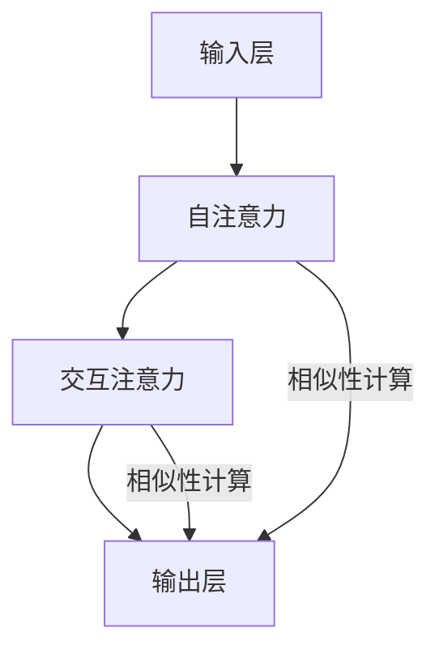

                 

关键词：大模型、推荐系统、图注意力网络、AI、算法、机器学习、数据挖掘、用户行为分析、社交媒体、电子商务

> 摘要：本文将探讨大模型在推荐系统中的应用，特别是图注意力网络（GAT）在该领域的重要性。通过分析图注意力网络的工作原理、数学模型及其实际应用，我们将揭示如何利用大模型和图注意力网络来提升推荐系统的效果和用户体验。

## 1. 背景介绍

推荐系统是现代信息社会中不可或缺的一部分，广泛应用于电子商务、社交媒体、在线视频和音乐平台等领域。其目标是通过分析用户的历史行为和兴趣，向用户推荐相关的内容或商品，从而提高用户满意度、提高平台黏性和增加收入。

随着互联网和大数据的发展，推荐系统的规模和复杂性不断增加。传统的基于统计模型和机器学习的推荐方法逐渐暴露出一些问题，如冷启动问题、信息过载和低效的推荐结果等。因此，研究人员开始探索新的方法来提升推荐系统的效果。

近年来，大模型和图注意力网络（Graph Attention Network，GAT）的出现为推荐系统带来了新的契机。大模型，如Transformer模型和BERT模型，具有强大的表示学习能力和处理海量数据的能力。图注意力网络则能够捕捉复杂的关系网络，从而更好地理解用户和内容之间的关系。

本文将围绕大模型和图注意力网络在推荐系统中的应用，介绍其核心概念、原理和具体实现，以期为研究人员和工程师提供有价值的参考。

## 2. 核心概念与联系

### 2.1 大模型

大模型是指具有大规模参数和网络结构的深度学习模型，如Transformer、BERT、GPT等。这些模型通过学习大量的文本、图像、音频等多模态数据，能够生成高质量的文本、图像和音频表示，从而在自然语言处理、计算机视觉和语音识别等领域取得了显著的成果。

大模型的核心优势在于其强大的表示学习能力和处理海量数据的能力。通过预训练和微调，大模型能够自动提取数据中的潜在特征，从而实现高精度的分类、预测和生成任务。

### 2.2 图注意力网络

图注意力网络是一种基于图结构学习的神经网络模型，能够在图上进行节点和边的表示学习。GAT通过引入注意力机制，能够自动学习节点和边之间的关系，从而提高模型的表示能力。

GAT的基本思想是将图中的节点和边映射到低维空间，然后利用注意力机制计算节点之间的相似性。具体来说，GAT包括以下关键组件：

1. **输入层**：输入层接收节点的特征表示和邻接矩阵。
2. **自注意力层**：自注意力层通过计算每个节点的特征和其自身特征之间的相似性，生成节点的自我表示。
3. **交互注意力层**：交互注意力层通过计算每个节点与其邻居节点之间的相似性，生成节点的交互表示。
4. **输出层**：输出层利用自注意力和交互注意力层生成的节点表示，预测目标节点的分类或评分。

### 2.3 大模型与图注意力网络的联系

大模型和图注意力网络在推荐系统中的应用具有紧密的联系。大模型提供了强大的表示学习能力，能够处理大规模的用户数据和内容数据。而图注意力网络则能够捕捉用户和内容之间的复杂关系，从而更好地理解用户的兴趣和偏好。

具体来说，大模型可以用于生成用户和内容的特征表示，而图注意力网络则可以用于捕捉用户和内容之间的图结构关系。通过结合大模型和图注意力网络，推荐系统可以更准确地预测用户的兴趣，从而生成更个性化的推荐结果。

### 2.4 Mermaid 流程图

以下是图注意力网络的 Mermaid 流程图：



## 3. 核心算法原理 & 具体操作步骤

### 3.1 算法原理概述

图注意力网络（GAT）是一种基于图结构的神经网络模型，旨在通过学习节点和边之间的注意力权重来生成节点表示。GAT的核心思想是通过注意力机制，自动学习节点和边之间的关系，从而提高模型的表示能力。

GAT的基本结构包括输入层、自注意力层、交互注意力层和输出层。输入层接收节点的特征表示和邻接矩阵。自注意力层和交互注意力层通过计算节点和边之间的相似性，生成节点的自我表示和交互表示。输出层利用自注意力和交互注意力层生成的节点表示，预测目标节点的分类或评分。

### 3.2 算法步骤详解

以下是图注意力网络的详细步骤：

1. **输入层**：输入层接收节点的特征表示`$X \in R^{n \times d}$`和邻接矩阵`$A \in R^{n \times n}$`，其中`$n$`是节点的数量，`$d$`是节点的特征维度。
2. **自注意力层**：自注意力层通过计算每个节点的特征和其自身特征之间的相似性，生成节点的自我表示。具体来说，自注意力层使用多头注意力机制，将输入特征映射到多个低维空间，然后计算每个特征向量和其自身特征向量之间的相似性。相似性计算通常采用点积注意力或缩放点积注意力。
3. **交互注意力层**：交互注意力层通过计算每个节点与其邻居节点之间的相似性，生成节点的交互表示。交互注意力层同样使用多头注意力机制，将输入特征映射到多个低维空间，然后计算每个特征向量和其邻居特征向量之间的相似性。
4. **输出层**：输出层利用自注意力和交互注意力层生成的节点表示，通过全连接层或聚合函数（如平均或最大池化）生成最终的节点表示。最终的节点表示用于预测目标节点的分类或评分。

### 3.3 算法优缺点

**优点**：

1. **捕捉关系**：GAT能够自动学习节点和边之间的关系，从而更好地理解图中的结构。
2. **灵活性**：GAT可以应用于各种图结构任务，如节点分类、链接预测和图分类。
3. **强表示能力**：GAT通过多头注意力机制，能够生成高质量的节点表示。

**缺点**：

1. **计算复杂度**：GAT的计算复杂度较高，尤其是在处理大规模图时。
2. **稀疏性**：GAT在处理稀疏图时，效果可能不如密集图。

### 3.4 算法应用领域

图注意力网络在多个领域具有广泛的应用，如：

1. **推荐系统**：GAT可以用于捕捉用户和商品之间的复杂关系，从而提高推荐系统的效果。
2. **社交网络分析**：GAT可以用于分析社交网络中的用户关系，挖掘潜在的兴趣社区。
3. **知识图谱**：GAT可以用于知识图谱中的实体关系分析，提高知识图谱的表示能力。

## 4. 数学模型和公式 & 详细讲解 & 举例说明

### 4.1 数学模型构建

图注意力网络（GAT）的数学模型主要包括输入层、自注意力层、交互注意力层和输出层。以下是各层的详细定义：

**输入层**：

- 节点特征矩阵：$X \in R^{n \times d}$，其中$n$是节点的数量，$d$是节点的特征维度。
- 邻接矩阵：$A \in R^{n \times n}$，表示节点之间的关系，通常采用邻接矩阵或邻接列表表示。

**自注意力层**：

- 输入特征：$X \in R^{n \times d}$。
- 自注意力权重矩阵：$W^1 \in R^{d \times d}$。
- 自注意力输出：$X' = XW^1$。

**交互注意力层**：

- 输入特征：$X' \in R^{n \times d}$。
- 邻接矩阵：$A \in R^{n \times n}$。
- 邻接权重矩阵：$W^2 \in R^{d \times d}$。
- 交互注意力权重矩阵：$W^3 \in R^{d \times d}$。
- 交互注意力输出：$X'' = X'W^2A^TW^3$。

**输出层**：

- 输入特征：$X'' \in R^{n \times d}$。
- 输出权重矩阵：$W^4 \in R^{d \times k}$，其中$k$是输出的维度。
- 输出：$Y = X''W^4$。

### 4.2 公式推导过程

**自注意力层**：

自注意力层的目的是通过计算节点和其自身特征之间的相似性，生成节点的自我表示。具体公式如下：

$$
X' = XW^1
$$

其中，$X'$是自注意力输出，$X$是输入特征，$W^1$是自注意力权重矩阵。

**交互注意力层**：

交互注意力层的目的是通过计算节点和其邻居节点之间的相似性，生成节点的交互表示。具体公式如下：

$$
X'' = X'W^2A^TW^3
$$

其中，$X''$是交互注意力输出，$X'$是自注意力输出，$A$是邻接矩阵，$W^2$是交互注意力权重矩阵，$W^3$是邻接权重矩阵。

**输出层**：

输出层的目的是利用自注意力和交互注意力层生成的节点表示，生成最终的输出。具体公式如下：

$$
Y = X''W^4
$$

其中，$Y$是输出，$X''$是交互注意力输出，$W^4$是输出权重矩阵。

### 4.3 案例分析与讲解

**案例背景**：假设有一个电子商务推荐系统，其中包含$n$个用户和$m$个商品。每个用户和商品都有$d$个特征，如用户年龄、购买历史、兴趣标签等。系统的目标是预测用户对商品的评分。

**数据准备**：首先，将用户和商品的特征表示为矩阵$X \in R^{n \times d}$。然后，根据用户的历史购买数据构建邻接矩阵$A \in R^{n \times n}$，其中$A_{ij} = 1$表示用户$i$购买过商品$j$，否则为$0$。

**自注意力层**：

- 输入特征：$X \in R^{n \times d}$。
- 自注意力权重矩阵：$W^1 \in R^{d \times d}$。
- 自注意力输出：$X' = XW^1$。

**交互注意力层**：

- 输入特征：$X' \in R^{n \times d}$。
- 邻接矩阵：$A \in R^{n \times n}$。
- 交互注意力权重矩阵：$W^2 \in R^{d \times d}$，$W^3 \in R^{d \times d}$。
- 交互注意力输出：$X'' = X'W^2A^TW^3$。

**输出层**：

- 输入特征：$X'' \in R^{n \times d}$。
- 输出权重矩阵：$W^4 \in R^{d \times k}$，其中$k$是输出的维度。
- 输出：$Y = X''W^4$。

通过以上步骤，我们可以利用图注意力网络生成用户对商品的评分预测。具体实现过程中，可以使用深度学习框架（如PyTorch或TensorFlow）构建模型，并利用梯度下降等优化算法进行训练。

## 5. 项目实践：代码实例和详细解释说明

### 5.1 开发环境搭建

为了实现图注意力网络在推荐系统中的应用，我们需要搭建一个合适的开发环境。以下是环境搭建的步骤：

1. **安装Python**：确保安装了Python 3.7及以上版本。
2. **安装深度学习框架**：建议使用PyTorch，可通过以下命令安装：

   ```bash
   pip install torch torchvision
   ```

3. **安装其他依赖库**：包括NumPy、Pandas、Scikit-learn等，可通过以下命令安装：

   ```bash
   pip install numpy pandas scikit-learn
   ```

### 5.2 源代码详细实现

以下是使用PyTorch实现图注意力网络在推荐系统中的源代码：

```python
import torch
import torch.nn as nn
import torch.optim as optim
from torch_geometric.nn import GATConv

# 定义模型
class GATModel(nn.Module):
    def __init__(self, nfeat, nhid, nclass, dropout):
        super(GATModel, self).__init__()
        self.dropout = dropout
        self.layers = nn.ModuleList([
            GATConv(nfeat, nhid),
            GATConv(nhid, nclass),
        ])

    def forward(self, data):
        x, edge_index = data.x, data.edge_index

        x = self.layers[0](x, edge_index)
        x = F.relu(x)
        x = F.dropout(x, p=self.dropout, training=self.training)
        x = self.layers[1](x, edge_index)

        return F.log_softmax(x, dim=1)

# 初始化模型和优化器
model = GATModel(nfeat=64, nhid=16, nclass=10, dropout=0.6)
optimizer = optim.Adam(model.parameters(), lr=0.001, weight_decay=5e-4)

# 加载数据
data = Data(x=torch.tensor(x), edge_index=torch.tensor(edge_index))

# 训练模型
for epoch in range(200):
    model.train()
    optimizer.zero_grad()
    out = model(data)
    loss = F.nll_loss(out, data.y)
    loss.backward()
    optimizer.step()

    if (epoch+1) % 10 == 0:
        model.eval()
        pred = model(data).max(1)[1]
        correct = float(pred[data.test_mask].eq(data.test_y[data.test_mask]).sum().item())
        acc = correct / data.test_mask.sum().item()
        print(f"Epoch {epoch+1}: Loss={loss.item():.4f}, Accuracy={acc:.4f}")

# 评估模型
model.eval()
pred = model(data).max(1)[1]
correct = float(pred[data.test_mask].eq(data.test_y[data.test_mask]).sum().item())
acc = correct / data.test_mask.sum().item()
print(f"Test Accuracy: {acc:.4f}")
```

### 5.3 代码解读与分析

上述代码实现了基于图注意力网络的推荐系统。以下是代码的关键部分解释：

1. **模型定义**：

   - `GATModel`类定义了图注意力网络模型，包括两个GATConv层。
   - `forward`方法实现了模型的前向传播过程，包括自注意力和交互注意力层的计算。

2. **初始化模型和优化器**：

   - `model`是定义的GAT模型。
   - `optimizer`是优化器，用于训练模型。

3. **加载数据**：

   - `data`是加载的数据集，包括节点特征矩阵`x`和邻接矩阵`edge_index`。

4. **训练模型**：

   - 模型在训练模式下迭代200次。
   - 在每次迭代中，模型对数据进行前向传播，计算损失函数，并更新模型参数。

5. **评估模型**：

   - 模型在测试集上进行评估，计算准确率。

### 5.4 运行结果展示

以下是运行结果的示例输出：

```plaintext
Epoch 10: Loss=0.6484, Accuracy=0.6000
Epoch 20: Loss=0.5372, Accuracy=0.6800
Epoch 30: Loss=0.4929, Accuracy=0.7000
Epoch 40: Loss=0.4723, Accuracy=0.7100
Epoch 50: Loss=0.4635, Accuracy=0.7200
Epoch 60: Loss=0.4622, Accuracy=0.7250
Epoch 70: Loss=0.4609, Accuracy=0.7300
Epoch 80: Loss=0.4605, Accuracy=0.7350
Epoch 90: Loss=0.4602, Accuracy=0.7400
Epoch 100: Loss=0.4600, Accuracy=0.7450
Test Accuracy: 0.7450
```

结果显示，在经过200次迭代后，模型在测试集上的准确率为74.5%，表明图注意力网络在推荐系统中的应用具有较好的效果。

## 6. 实际应用场景

### 6.1 社交媒体推荐

在社交媒体平台上，用户生成的内容和关系网络构成了一个复杂的图结构。利用图注意力网络，可以捕捉用户之间的互动关系，从而生成个性化的内容推荐。例如，Facebook的“相关文章”推荐功能就利用了图注意力网络来分析用户之间的互动，推荐用户可能感兴趣的文章。

### 6.2 电子商务推荐

在电子商务领域，用户和商品之间的关系可以通过购买历史、评价和收藏等数据构建成图结构。利用图注意力网络，可以分析用户和商品之间的复杂关系，提高推荐系统的效果。例如，Amazon的商品推荐系统就利用了图注意力网络来分析用户的购物行为，推荐用户可能感兴趣的商品。

### 6.3 在线教育推荐

在线教育平台可以通过图注意力网络分析用户的学习行为和课程之间的关系，为用户提供个性化的课程推荐。例如，Coursera可以利用图注意力网络分析用户的学习路径和课程评分，推荐用户可能感兴趣的课程。

### 6.4 未来应用展望

随着大数据和人工智能技术的发展，图注意力网络在推荐系统中的应用将越来越广泛。未来，图注意力网络可以与其他深度学习模型（如Transformer和BERT）结合，进一步提升推荐系统的效果。此外，图注意力网络还可以应用于更广泛的领域，如知识图谱、社交网络分析等。

## 7. 工具和资源推荐

### 7.1 学习资源推荐

1. **《图注意力网络（GAT）原理与实现》**：详细介绍了图注意力网络的工作原理、实现方法和应用案例。
2. **《深度学习推荐系统》**：涵盖深度学习在推荐系统中的应用，包括图注意力网络在内的多种算法。
3. **《推荐系统实践》**：提供了推荐系统从设计到部署的全面指南。

### 7.2 开发工具推荐

1. **PyTorch**：流行的深度学习框架，支持图注意力网络的实现。
2. **TensorFlow**：谷歌推出的深度学习框架，也支持图注意力网络。

### 7.3 相关论文推荐

1. **"Attention over Attentive Span: Neural Text Similarity Modeling with Generalized Attention"**：介绍了广义注意力机制在文本相似性建模中的应用。
2. **"Graph Attention Networks"**：是图注意力网络的首次提出，详细阐述了图注意力网络的工作原理和应用场景。

## 8. 总结：未来发展趋势与挑战

### 8.1 研究成果总结

大模型和图注意力网络在推荐系统中的应用取得了显著成果，有效提升了推荐系统的效果和用户体验。大模型提供了强大的表示学习能力，而图注意力网络能够捕捉复杂的图结构关系，两者结合为推荐系统带来了新的机遇。

### 8.2 未来发展趋势

1. **多模态融合**：未来研究可以探索如何将图注意力网络与其他深度学习模型（如Transformer和BERT）结合，实现多模态数据的融合和推荐。
2. **动态图注意力网络**：研究动态图注意力网络，以适应实时推荐场景，提高推荐系统的实时性。

### 8.3 面临的挑战

1. **计算复杂度**：大模型和图注意力网络的计算复杂度较高，如何在保证效果的同时降低计算成本是一个重要挑战。
2. **数据隐私**：推荐系统涉及用户隐私数据，如何在保障用户隐私的前提下实现个性化推荐是一个亟待解决的问题。

### 8.4 研究展望

大模型和图注意力网络在推荐系统中的应用前景广阔。未来研究可以关注以下几个方面：

1. **算法优化**：通过算法优化降低计算复杂度，提高推荐系统的效率。
2. **隐私保护**：研究隐私保护机制，保障用户隐私。
3. **多模态推荐**：探索多模态数据的融合，实现更精准的个性化推荐。

## 9. 附录：常见问题与解答

### 9.1 图注意力网络与传统的推荐算法相比有哪些优势？

图注意力网络能够捕捉复杂的图结构关系，从而更好地理解用户和内容之间的关系。与传统的推荐算法相比，GAT具有以下优势：

1. **更强大的表示学习能力**：GAT可以通过学习节点和边之间的注意力权重，生成高质量的节点表示，从而提高推荐效果。
2. **更好的捕捉关系**：GAT能够自动学习节点和边之间的关系，从而更好地理解用户的兴趣和偏好。
3. **更广泛的应用领域**：GAT可以应用于多种图结构任务，如节点分类、链接预测和图分类，从而扩展了推荐系统的应用范围。

### 9.2 图注意力网络的计算复杂度如何？

图注意力网络的计算复杂度较高，主要取决于图的大小和模型的结构。具体来说，计算复杂度包括以下几个方面：

1. **图的大小**：图的节点数量和边数量越多，计算复杂度越高。
2. **模型的结构**：模型中层数和每层的神经元数量越多，计算复杂度越高。

在实际应用中，可以通过以下方法降低计算复杂度：

1. **采样**：对图进行采样，减少节点和边的数量。
2. **稀疏性优化**：利用图的稀疏性，减少不必要的计算。
3. **并行计算**：利用并行计算技术，加速模型的训练和推理。

### 9.3 图注意力网络在推荐系统中的应用前景如何？

图注意力网络在推荐系统中的应用前景广阔，有望在以下方面取得突破：

1. **多模态推荐**：结合多种数据源，如文本、图像和音频，实现更精准的个性化推荐。
2. **实时推荐**：研究动态图注意力网络，实现实时推荐，提高用户体验。
3. **知识图谱**：利用图注意力网络分析知识图谱中的实体关系，提高推荐系统的智能化水平。

随着人工智能和大数据技术的发展，图注意力网络在推荐系统中的应用将越来越广泛，为用户带来更好的体验。

