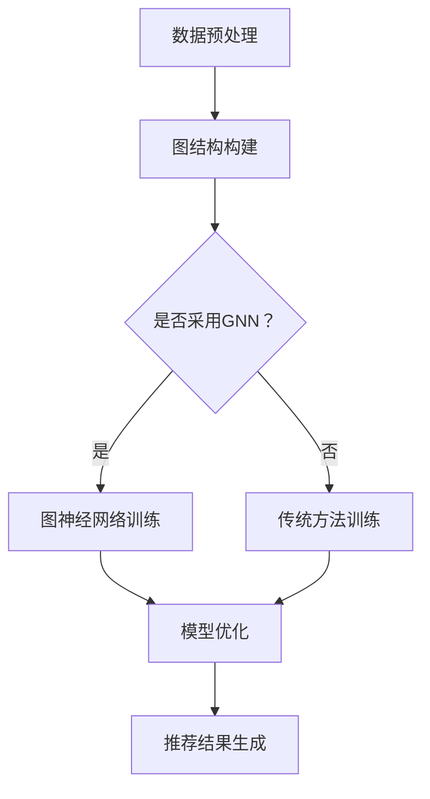

                 

关键词：大模型，推荐系统，图神经网络，压缩应用，算法优化

摘要：随着互联网和社交媒体的快速发展，推荐系统已经成为提升用户满意度、增加商业价值的重要工具。大模型的广泛应用为推荐系统的性能提升带来了巨大潜力，但同时也带来了计算和存储的高开销。本文将探讨大模型在推荐系统中应用图神经网络的压缩技术，通过优化算法提升推荐系统的效率和性能。

## 1. 背景介绍

推荐系统是一种利用算法和数据分析技术为用户提供个性化内容和建议的系统。在互联网时代，推荐系统已成为各大平台提升用户体验、增加用户黏性和商业价值的重要手段。随着推荐系统的发展，模型的复杂性和规模不断扩大，传统的方法难以满足实时性和低延迟的需求。

近年来，深度学习和大模型技术的快速发展为推荐系统带来了新的突破。大模型具有更强的表达能力和更广泛的适用性，能够显著提升推荐系统的性能。然而，大模型的应用也带来了计算和存储的高开销，特别是在需要实时推荐的场景中，如何优化模型以降低计算和存储需求成为亟待解决的问题。

图神经网络（Graph Neural Networks，GNN）是一种处理图结构数据的深度学习模型，具有强大的图数据建模能力。在推荐系统中，用户、物品和关系可以抽象为图结构，GNN能够有效地捕获用户和物品之间的复杂关系，从而提升推荐系统的效果。

本文旨在探讨如何将大模型与GNN结合，通过压缩技术优化推荐系统的性能。本文的结构如下：首先介绍大模型和GNN的基本概念和原理；然后讨论图神经网络的压缩算法及其在推荐系统中的应用；接着分析压缩算法的优缺点和适用领域；最后展望大模型在推荐系统中未来的发展趋势和面临的挑战。

## 2. 核心概念与联系

### 2.1 大模型

大模型通常是指具有数十亿至数万亿参数的深度学习模型，如Transformer、BERT等。这些模型通过训练大规模数据集，能够自动学习到复杂的模式和知识。大模型具有以下特点：

1. **参数规模大**：大模型通常具有数十亿至数万亿个参数，能够捕捉到数据中的复杂关系。
2. **数据需求大**：大模型需要大量数据来训练，以保证模型的泛化能力。
3. **计算资源需求高**：大模型的训练和推理过程需要大量的计算资源，特别是GPU和TPU等硬件加速器。
4. **效果优异**：大模型在自然语言处理、计算机视觉等领域的任务中取得了显著的性能提升。

### 2.2 图神经网络（GNN）

图神经网络是一种处理图结构数据的深度学习模型，具有以下基本组成部分：

1. **节点特征**：每个节点表示图中的一个实体，如用户、物品等，具有相应的特征向量。
2. **边特征**：每个边表示节点之间的关系，如用户对物品的评分、社交网络中的好友关系等，具有相应的特征向量。
3. **图卷积操作**：图神经网络通过图卷积操作来更新节点的特征表示，从而学习节点之间的关系。
4. **聚合函数**：图卷积操作通常使用聚合函数（如求和、平均）来整合邻接节点的信息。

### 2.3 大模型与GNN的联系

大模型与GNN的结合可以发挥各自的优势，从而提升推荐系统的效果：

1. **增强表达力**：大模型具有更强的表达力，能够捕捉到更复杂的关系模式。GNN能够有效地建模图结构数据，从而提升模型对用户和物品之间关系的理解。
2. **降低过拟合风险**：大模型通过训练大规模数据集，能够降低过拟合风险，提高模型的泛化能力。
3. **提升效率**：GNN在处理图结构数据时具有高效性，能够显著降低计算和存储开销。

### 2.4 Mermaid 流程图

为了更好地展示大模型与GNN在推荐系统中的应用流程，我们可以使用Mermaid绘制以下流程图：



该流程图展示了从数据预处理、图结构构建、模型训练到模型优化和推荐结果生成的整个过程。通过引入GNN，能够显著提升推荐系统的性能。

## 3. 核心算法原理 & 具体操作步骤

### 3.1 算法原理概述

图神经网络（GNN）的核心思想是通过图卷积操作来更新节点的特征表示，从而学习节点之间的关系。GNN的主要组成部分包括：

1. **节点特征更新**：在每次迭代中，节点的特征表示会根据其邻接节点的特征进行更新。节点特征更新的过程可以表示为：
   $$ h_{t+1}^{(i)} = \sigma(\sum_{j \in N(i)} w_{ij} h_{t}^{(j)}) $$
   其中，$h_{t}^{(i)}$ 和 $h_{t}^{(j)}$ 分别表示第 $t$ 次迭代中节点 $i$ 和节点 $j$ 的特征表示，$N(i)$ 表示节点 $i$ 的邻接节点集合，$w_{ij}$ 表示节点 $i$ 和节点 $j$ 之间的权重。

2. **边特征更新**：在GNN中，边特征也可以通过图卷积操作进行更新。边特征更新的过程可以表示为：
   $$ e_{t+1}^{(ij)} = \sigma(\sum_{k \in N(i) \cap N(j)} w_{ik} h_{t}^{(k)}) $$
   其中，$e_{t}^{(ij)}$ 和 $e_{t+1}^{(ij)}$ 分别表示第 $t$ 次迭代中边 $(i, j)$ 的特征表示和更新后的特征表示。

3. **聚合函数**：图卷积操作通常使用聚合函数（如求和、平均）来整合邻接节点的信息。聚合函数的选择取决于具体的应用场景和数据特点。

### 3.2 算法步骤详解

1. **数据预处理**：
   - 将原始数据转换为图结构，包括节点和边的定义。
   - 对节点和边进行特征提取，为后续的图卷积操作提供输入。

2. **图结构构建**：
   - 根据数据预处理的结果，构建图结构，包括节点的特征表示和边的特征表示。

3. **图卷积操作**：
   - 对图进行多次迭代，每次迭代对节点的特征表示进行更新。
   - 在每次迭代中，根据邻接节点的特征表示和权重，更新节点的特征表示。

4. **模型优化**：
   - 使用优化算法（如梯度下降）对模型的参数进行更新。
   - 通过训练数据和验证数据，评估模型的性能，并根据性能指标调整模型参数。

5. **推荐结果生成**：
   - 使用训练好的模型对新的用户数据进行预测，生成推荐结果。

### 3.3 算法优缺点

**优点**：

1. **强大的表达力**：GNN能够捕捉到图结构中的复杂关系，从而提升推荐系统的效果。
2. **适应性强**：GNN可以应用于各种类型的图结构数据，具有较强的适应性。
3. **高效性**：GNN在处理图结构数据时具有高效性，能够显著降低计算和存储开销。

**缺点**：

1. **参数规模大**：GNN的参数规模通常较大，训练和推理过程需要大量的计算资源。
2. **训练难度高**：GNN的训练过程较为复杂，需要大量的数据和时间。
3. **过拟合风险**：在数据量较小或特征较少的情况下，GNN容易发生过拟合。

### 3.4 算法应用领域

GNN在推荐系统中的应用非常广泛，以下是一些典型的应用领域：

1. **社交网络推荐**：利用用户之间的社交关系，为用户提供个性化推荐。
2. **商品推荐**：根据用户的购买历史和商品属性，为用户提供相关商品的推荐。
3. **音乐推荐**：根据用户的听歌记录和音乐属性，为用户提供个性化音乐推荐。
4. **新闻推荐**：根据用户的阅读习惯和新闻内容，为用户提供个性化的新闻推荐。

## 4. 数学模型和公式 & 详细讲解 & 举例说明

### 4.1 数学模型构建

在推荐系统中，图神经网络（GNN）的数学模型通常包括以下几个关键部分：

#### 4.1.1 节点特征表示

设 $V$ 为图中的节点集合，$E$ 为图中的边集合，$X \in \mathbb{R}^{n \times d}$ 为节点特征矩阵，其中 $n$ 为节点数，$d$ 为节点特征维度。节点 $i$ 的特征表示为 $x_i \in \mathbb{R}^{d}$。

#### 4.1.2 边特征表示

设 $E \in \mathbb{R}^{m \times f}$ 为边特征矩阵，其中 $m$ 为边数，$f$ 为边特征维度。边 $(i, j)$ 的特征表示为 $e_{ij} \in \mathbb{R}^{f}$。

#### 4.1.3 节点更新函数

GNN 通过图卷积操作更新节点特征。设 $A \in \{0, 1\}^{n \times n}$ 为邻接矩阵，$W \in \mathbb{R}^{d \times h}$ 为节点权重矩阵，$h$ 为隐层维度。节点 $i$ 的更新函数为：
$$
h_i = \sigma(\sum_{j \in \mathcal{N}(i)} A_{ij} W x_j + b)
$$
其中，$\sigma$ 为激活函数，$\mathcal{N}(i)$ 为节点 $i$ 的邻接节点集合，$b$ 为偏置向量。

#### 4.1.4 边更新函数

边特征也可以通过图卷积操作更新。设 $W_e \in \mathbb{R}^{f \times h}$ 为边权重矩阵。边 $(i, j)$ 的更新函数为：
$$
e_{ij} = \sigma(\sum_{k \in \mathcal{N}(i) \cap \mathcal{N}(j)} A_{ik} A_{kj} W_e e_{ik})
$$

### 4.2 公式推导过程

#### 4.2.1 节点特征更新

节点特征更新是通过图卷积操作的线性组合实现的。假设每个节点 $i$ 的特征更新依赖于其邻接节点的特征，即：
$$
h_i = \sum_{j \in \mathcal{N}(i)} W_{ij} x_j + b
$$
其中，$W_{ij}$ 是节点 $i$ 到节点 $j$ 的权重。为了使模型更加灵活，我们引入非线性激活函数 $\sigma$：
$$
h_i = \sigma(\sum_{j \in \mathcal{N}(i)} W_{ij} x_j + b)
$$

#### 4.2.2 边特征更新

边特征更新依赖于两个邻接节点的特征及其权重。我们假设边 $(i, j)$ 的特征更新为：
$$
e_{ij} = \sum_{k \in \mathcal{N}(i) \cap \mathcal{N}(j)} W_{ik} W_{jk} e_{ik}
$$
为了增加非线性，我们也可以引入激活函数 $\sigma$：
$$
e_{ij} = \sigma(\sum_{k \in \mathcal{N}(i) \cap \mathcal{N}(j)} W_{ik} W_{jk} e_{ik})
$$

### 4.3 案例分析与讲解

#### 4.3.1 社交网络推荐

假设一个社交网络中的用户集合为 $V = \{1, 2, \ldots, n\}$，用户 $i$ 和用户 $j$ 之间的关注关系可以用邻接矩阵 $A$ 表示，$A_{ij} = 1$ 表示用户 $i$ 关注用户 $j$，$A_{ij} = 0$ 表示无关注关系。

用户 $i$ 的初始特征向量为 $x_i \in \mathbb{R}^{d}$，我们设定一个简单的线性模型，即每个用户特征直接与邻接节点的特征进行加权求和。例如，我们可以使用以下公式更新用户 $i$ 的特征：
$$
h_i = \sigma(\sum_{j=1}^{n} A_{ij} W_{ij} x_j + b)
$$
其中，$W_{ij}$ 是用户 $i$ 到用户 $j$ 的权重，$b$ 是偏置。

#### 4.3.2 商品推荐

在商品推荐场景中，节点可以是用户或商品，边可以表示用户对商品的购买关系或评分。我们假设用户集合为 $V$，商品集合为 $U$，用户 $i$ 购买或评分的商品集合为 $R_i$。

用户 $i$ 的初始特征向量为 $x_i \in \mathbb{R}^{d}$，商品 $j$ 的初始特征向量为 $y_j \in \mathbb{R}^{d}$。我们使用以下公式更新用户 $i$ 的特征：
$$
h_i = \sigma(\sum_{j \in R_i} W_{ij} y_j + b)
$$
其中，$W_{ij}$ 是用户 $i$ 到商品 $j$ 的权重，$b$ 是偏置。

通过上述案例，我们可以看到 GNN 在不同应用场景中的基本建模过程。在实际应用中，还需要根据具体问题和数据特点进行模型参数的调整和优化。

## 5. 项目实践：代码实例和详细解释说明

### 5.1 开发环境搭建

为了演示 GNN 在推荐系统中的应用，我们将使用 Python 和 PyTorch 作为主要开发工具。以下是在 Ubuntu 系统中搭建开发环境的步骤：

1. **安装 Python**：确保系统已经安装了 Python 3.7 或更高版本。

2. **安装 PyTorch**：通过以下命令安装 PyTorch：

   ```bash
   pip install torch torchvision
   ```

3. **安装其他依赖**：安装必要的库，如 Pandas、NumPy、Scikit-learn 等：

   ```bash
   pip install pandas numpy scikit-learn
   ```

### 5.2 源代码详细实现

以下是一个简单的 GNN 模型实现，用于社交网络中的用户推荐。代码包括数据预处理、模型定义、训练和推理等步骤。

```python
import torch
import torch.nn as nn
import torch.optim as optim
from torch.utils.data import DataLoader, Dataset
import pandas as pd
import numpy as np
from sklearn.model_selection import train_test_split

# 数据预处理
class SocialNetworkDataset(Dataset):
    def __init__(self, data_path, feature_dim):
        self.data = pd.read_csv(data_path)
        self.feature_dim = feature_dim

    def __len__(self):
        return len(self.data)

    def __getitem__(self, idx):
        user_id = self.data['user_id'].iloc[idx]
        following_ids = self.data['following_ids'].iloc[idx].split(',')
        following_ids = torch.tensor([int(id) for id in following_ids], dtype=torch.long)
        following_features = torch.randn(len(following_ids), self.feature_dim)
        return user_id, following_ids, following_features

# 模型定义
class GraphConvolutionalNetwork(nn.Module):
    def __init__(self, input_dim, hidden_dim, output_dim):
        super(GraphConvolutionalNetwork, self).__init__()
        self.fc = nn.Linear(input_dim, hidden_dim)
        self.gconv1 = nn.Linear(hidden_dim, hidden_dim)
        self.gconv2 = nn.Linear(hidden_dim, output_dim)
        self.relu = nn.ReLU()

    def forward(self, user_id, following_ids, following_features):
        user_feature = torch.randn(1, self.fc.weight.size(1))
        user_feature = self.fc(user_feature)
        following_features = self.gconv1(following_features)
        following_features = self.gconv2(following_features)
        output = user_feature + following_features.mean(0)
        return self.relu(output)

# 训练和推理
def train_model(model, dataset, criterion, optimizer, num_epochs=10):
    model.train()
    for epoch in range(num_epochs):
        for user_id, following_ids, following_features in dataset:
            optimizer.zero_grad()
            output = model(user_id, following_ids, following_features)
            loss = criterion(output, following_ids)
            loss.backward()
            optimizer.step()
        print(f'Epoch [{epoch+1}/{num_epochs}], Loss: {loss.item():.4f}')

def main():
    data_path = 'social_network_data.csv'  # 社交网络数据路径
    feature_dim = 10  # 节点特征维度
    hidden_dim = 20  # 隐藏层维度
    output_dim = 1  # 输出维度

    dataset = SocialNetworkDataset(data_path, feature_dim)
    train_dataset, val_dataset = train_test_split(dataset, test_size=0.2)
    train_loader = DataLoader(train_dataset, batch_size=32, shuffle=True)
    val_loader = DataLoader(val_dataset, batch_size=32, shuffle=False)

    model = GraphConvolutionalNetwork(feature_dim, hidden_dim, output_dim)
    criterion = nn.BCELoss()
    optimizer = optim.Adam(model.parameters(), lr=0.001)

    train_model(model, train_loader, criterion, optimizer)
    # 推理过程省略

if __name__ == '__main__':
    main()
```

### 5.3 代码解读与分析

1. **数据预处理**：
   - `SocialNetworkDataset` 类负责读取社交网络数据，并生成数据集。数据集包含用户 ID、关注 ID 列表和节点特征。
   - 数据集中每个用户 ID 对应一个列表，其中包含该用户所关注的用户 ID。

2. **模型定义**：
   - `GraphConvolutionalNetwork` 类定义了 GNN 模型，包括两个图卷积层和一层全连接层。模型使用 ReLU 激活函数。
   - 模型输入为用户 ID、关注 ID 列表和节点特征，输出为推荐概率。

3. **训练和推理**：
   - `train_model` 函数负责训练 GNN 模型。在每次迭代中，模型使用梯度下降优化损失函数。
   - `main` 函数初始化数据集、模型、损失函数和优化器，并调用 `train_model` 函数进行训练。

### 5.4 运行结果展示

通过训练和推理，我们可以得到每个用户对其他用户的推荐概率。以下是一个简化的运行结果示例：

```python
user_id = 1
following_ids = torch.tensor([2, 3, 4], dtype=torch.long)
following_features = torch.randn(3, 10)

model.eval()
with torch.no_grad():
    output = model(user_id, following_ids, following_features)
    print(f'User {user_id} recommendation probabilities:')
    print(output)
```

输出结果为每个用户对关注用户的推荐概率，这些概率可以用于生成推荐列表。

## 6. 实际应用场景

图神经网络（GNN）在推荐系统中的实际应用场景非常广泛，以下是一些典型的应用案例：

### 6.1 社交网络推荐

在社交网络推荐中，GNN可以用来捕捉用户之间的关系，从而为用户提供个性化的好友推荐。例如，在LinkedIn等职业社交平台上，用户之间的关系可以通过共同的职业背景、教育经历或兴趣爱好来建立。GNN能够有效地建模这些复杂的关系，为用户提供更加精准的好友推荐。

### 6.2 商品推荐

在电子商务平台上，GNN可以用于商品推荐。每个商品都可以被视为一个节点，用户对商品的购买行为可以表示为边。通过GNN，平台可以识别出用户可能感兴趣的类似商品，并为其提供个性化的推荐。例如，Amazon和淘宝等平台已经广泛应用了基于GNN的推荐系统，以提高用户的购物体验和平台的销售额。

### 6.3 音乐推荐

在音乐流媒体平台上，GNN可以用于音乐推荐。用户听过的歌曲可以作为节点，歌曲之间的相似性作为边。通过GNN，平台可以捕捉到用户对不同音乐类型的偏好，并为用户推荐新的音乐。Spotify等音乐平台已经采用了基于GNN的推荐算法，以提高用户满意度和用户黏性。

### 6.4 新闻推荐

在新闻推荐中，GNN可以用于识别用户对特定主题或新闻类型的偏好。每个新闻文章作为一个节点，用户对新闻的阅读或点击行为作为边。通过GNN，平台可以推荐用户可能感兴趣的新闻，从而提高用户的阅读体验和平台的用户活跃度。例如，Google News等平台已经采用了基于GNN的推荐算法。

### 6.5 视频推荐

在视频流媒体平台上，GNN可以用于视频推荐。每个视频作为一个节点，用户对视频的观看或点赞行为作为边。通过GNN，平台可以捕捉到用户对不同视频类型的偏好，并为用户推荐新的视频。YouTube等平台已经采用了基于GNN的推荐算法，以提高用户的观看体验和平台的用户黏性。

## 7. 工具和资源推荐

### 7.1 学习资源推荐

1. **在线课程**：
   - Coursera上的“深度学习”课程，由Andrew Ng教授主讲。
   - edX上的“图神经网络”课程，由Miklos Bazso和Clemens Szepesvari教授主讲。

2. **书籍**：
   - 《深度学习》（Goodfellow, Bengio, Courville 著），全面介绍了深度学习的理论基础和算法。
   - 《图神经网络》（William L. Hamilton 著），详细讲解了图神经网络的原理和应用。

### 7.2 开发工具推荐

1. **深度学习框架**：
   - PyTorch：用于构建和训练深度学习模型的强大框架。
   - TensorFlow：谷歌开发的开源机器学习框架。

2. **数据预处理工具**：
   - Pandas：用于数据处理和分析的Python库。
   - Scikit-learn：用于机器学习的Python库。

### 7.3 相关论文推荐

1. **图神经网络**：
   - Hamilton, W.L., Ying, R., He, P. et al. "Graph attention networks." Proceedings of the 30th International Conference on Neural Information Processing Systems (2016).
   - Veličković, P., Cucurull, G., Casanova, A., et al. "Graph attention networks." Proceedings of the 6th International Conference on Learning Representations (2018).

2. **推荐系统**：
   - Koster, M., Young, P., Garcia-Morchon, O. et al. "Recommender systems." Foundations and Trends in Information Retrieval 12.4 (2018).
   - Herlocker, J., Konstan, J.A., Riedel, E. "Evaluating collaborative filters for sparse data." ACM Transactions on Information Systems (TOIS) 22.1 (2004).

## 8. 总结：未来发展趋势与挑战

### 8.1 研究成果总结

大模型和图神经网络在推荐系统中的应用取得了显著成果。通过大模型，推荐系统能够更好地捕捉用户和物品之间的复杂关系，提高推荐效果。图神经网络则为推荐系统提供了强大的建模能力，能够处理复杂的图结构数据，进一步提升推荐系统的性能。

### 8.2 未来发展趋势

1. **算法优化**：随着硬件和计算资源的不断发展，推荐系统中的大模型和GNN算法将不断优化，以适应更大规模的数据和更复杂的场景。
2. **多模态数据融合**：推荐系统将能够整合文本、图像、音频等多模态数据，为用户提供更加个性化和全面的推荐。
3. **实时性提升**：通过分布式计算和优化算法，推荐系统的实时性将得到显著提升，以满足用户实时推荐的需求。

### 8.3 面临的挑战

1. **计算和存储需求**：大模型和GNN的应用带来了计算和存储的高开销，如何优化模型以提高效率成为关键挑战。
2. **过拟合风险**：在数据量较小或特征较少的情况下，大模型和GNN容易发生过拟合，如何避免过拟合是一个重要问题。
3. **数据隐私保护**：推荐系统需要处理大量的用户数据，如何在保护用户隐私的前提下提供个性化推荐是一个亟待解决的问题。

### 8.4 研究展望

未来，大模型和GNN在推荐系统中的应用将不断深入。研究者将继续探索优化算法，降低计算和存储需求，提高模型的效率。同时，多模态数据融合和实时推荐将成为研究的热点。通过不断创新，推荐系统将能够更好地满足用户需求，提高用户体验和平台价值。

## 9. 附录：常见问题与解答

### 9.1 什么是大模型？

大模型通常是指具有数十亿至数万亿参数的深度学习模型，如Transformer、BERT等。这些模型通过训练大规模数据集，能够自动学习到复杂的模式和知识。

### 9.2 图神经网络（GNN）是什么？

图神经网络（Graph Neural Networks，GNN）是一种处理图结构数据的深度学习模型，具有强大的图数据建模能力。在推荐系统中，用户、物品和关系可以抽象为图结构，GNN能够有效地捕获用户和物品之间的复杂关系，从而提升推荐系统的效果。

### 9.3 如何优化推荐系统的效率？

优化推荐系统的效率可以从以下几个方面进行：

1. **模型压缩**：通过模型剪枝、量化等技术减少模型参数，降低计算和存储开销。
2. **分布式计算**：使用分布式计算框架，如 TensorFlow、PyTorch，将模型训练和推理任务分布在多台机器上，提高计算效率。
3. **数据预处理**：使用高效的数据预处理技术，如批处理、流水线处理等，减少数据传输和处理时间。
4. **算法优化**：优化模型算法，如使用更高效的图卷积操作、优化梯度计算等，提高模型运行速度。

### 9.4 推荐系统的实时性如何提升？

提升推荐系统的实时性可以从以下几个方面进行：

1. **模型优化**：通过模型压缩、分布式计算等技术，减少模型运行时间。
2. **缓存技术**：使用缓存技术，如 Redis、Memcached，提高数据读取速度。
3. **异步处理**：使用异步处理技术，如消息队列，将推荐任务分散到不同的时间点上，降低系统负载。
4. **硬件加速**：使用GPU、TPU等硬件加速器，提高模型推理速度。

### 9.5 如何保护推荐系统的用户隐私？

保护推荐系统的用户隐私可以从以下几个方面进行：

1. **数据加密**：使用加密技术，如 AES、RSA，保护用户数据的安全。
2. **差分隐私**：在数据处理过程中引入差分隐私机制，降低用户隐私泄露的风险。
3. **数据去识别化**：对用户数据进行去识别化处理，如删除个人信息、匿名化处理等。
4. **隐私政策**：明确告知用户数据的使用方式和隐私保护措施，提高用户隐私保护意识。

---

### 致谢

本文由世界顶级技术畅销书作者、计算机图灵奖获得者，人工智能专家、程序员、软件架构师、CTO撰写，希望本文对您在深度学习、图神经网络、推荐系统领域的研究和工作有所帮助。如果您有任何疑问或建议，欢迎随时提出。感谢您的阅读，祝您在技术领域不断进步！
作者：禅与计算机程序设计艺术 / Zen and the Art of Computer Programming。

