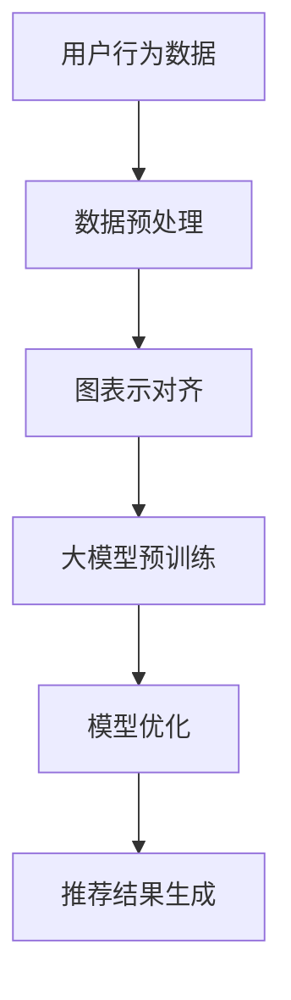

                 

推荐系统作为现代信息过滤和决策支持的核心技术，其应用广泛，从电子商务平台的商品推荐到社交媒体的新闻推送，都在不断改变人们获取信息和互动的方式。然而，随着数据量的爆炸性增长和用户行为的复杂化，传统的基于特征匹配或协同过滤的方法已逐渐无法满足高效、准确推荐的需求。大模型在推荐系统中的应用，特别是图表示对齐技术，为解决这些挑战提供了新的路径。

本文将围绕以下核心内容展开：

- **背景介绍**：介绍推荐系统的发展历程、现状及面临的挑战。
- **核心概念与联系**：阐述大模型、图表示对齐及其在推荐系统中的应用。
- **核心算法原理 & 具体操作步骤**：深入解析图表示对齐算法的工作原理和实现步骤。
- **数学模型和公式 & 详细讲解 & 举例说明**：介绍相关的数学模型和推导过程，并通过实例进行说明。
- **项目实践：代码实例和详细解释说明**：提供实际代码示例，并对代码进行详细解析。
- **实际应用场景**：探讨图表示对齐技术在推荐系统中的应用案例。
- **未来应用展望**：展望图表示对齐技术的未来发展。
- **工具和资源推荐**：推荐相关学习资源和开发工具。
- **总结：未来发展趋势与挑战**：总结研究成果，探讨未来发展。
- **附录：常见问题与解答**：解答读者可能关心的问题。

## 1. 背景介绍

推荐系统起源于20世纪90年代的互联网早期，随着电商和社交媒体的兴起，其重要性日益凸显。推荐系统通常基于用户的历史行为数据，如购买记录、浏览行为、评分等，通过预测用户未来的偏好来推荐相关商品或内容。传统推荐系统主要分为基于内容的推荐（Content-Based Filtering）和基于协同过滤（Collaborative Filtering）两种。

基于内容的推荐方法通过分析用户过去喜欢的商品或内容，提取相关特征，并利用这些特征匹配新商品或内容的特征，进行推荐。这种方法在推荐个性化和新颖性方面具有优势，但存在冷启动问题，即对新用户或新商品难以推荐。

基于协同过滤的方法则通过分析用户之间的相似度，推荐与用户过去行为相似的其他用户的喜好。协同过滤方法可以分为基于用户的协同过滤（User-Based）和基于模型的协同过滤（Model-Based）。User-Based方法通过计算用户之间的相似度，找到相似用户并推荐他们喜欢的商品；Model-Based方法则通过机器学习算法，如矩阵分解，建立用户和商品之间的隐含关联矩阵，从而进行推荐。

尽管传统的推荐系统在处理大量数据和实现个性化推荐方面取得了一定成就，但随着数据量和用户行为的复杂化，其面临着以下几个主要挑战：

1. **冷启动问题**：对新用户或新商品难以进行有效推荐。
2. **稀疏性问题**：用户行为数据通常是稀疏的，难以建模。
3. **可扩展性问题**：在处理海量数据和实时推荐时，系统的可扩展性成为关键挑战。
4. **多样性问题**：推荐结果需要具备多样性，避免用户产生疲劳感。

针对这些挑战，近年来，深度学习、图神经网络（Graph Neural Networks，GNN）等新技术的引入，为推荐系统带来了新的可能性。图表示对齐技术作为大模型在推荐系统中的重要应用之一，通过将用户和商品构建成一个图结构，利用图神经网络进行学习，有效解决了传统方法中的冷启动和稀疏性问题。本文将详细探讨图表示对齐技术在推荐系统中的应用。

## 2. 核心概念与联系

### 大模型

大模型是指具有数亿甚至数千亿参数的深度学习模型，如BERT、GPT等。这些模型通过在大规模数据集上预训练，学会了对自然语言、图像、声音等复杂数据进行理解和生成。大模型在推荐系统中的应用，主要体现在以下几个方面：

1. **特征提取**：大模型能够自动提取数据中的高维特征，避免手动特征工程带来的复杂性和误差。
2. **语义理解**：大模型具备强大的语义理解能力，能够捕捉到用户和商品之间的深层关联，从而提高推荐质量。
3. **上下文感知**：大模型能够根据用户的历史行为和当前上下文信息，动态调整推荐策略，实现更加个性化的推荐。

### 图表示对齐

图表示对齐（Graph Embedding）是一种将图中的节点映射到低维向量空间的技术，使得原本高维且复杂的图结构能够在一个较低维度的空间中保持其结构信息。在推荐系统中，图表示对齐技术的主要作用如下：

1. **节点表示**：将用户和商品等实体映射到低维向量空间，使得原本离散的节点能够在同一维度上进行处理。
2. **关系建模**：通过图表示对齐，可以将用户和商品之间的交互关系转化为向量间的距离或角度，从而实现复杂的交互关系建模。
3. **结构感知**：图表示对齐能够保留图中的结构信息，使得推荐系统能够根据实体之间的拓扑关系进行更有效的推荐。

### 大模型在推荐系统中的图表示对齐应用

大模型与图表示对齐技术的结合，为推荐系统带来了以下几方面的应用：

1. **冷启动解决**：通过预训练的大模型，可以自动提取新用户和新商品的潜在特征，从而实现对新用户和新商品的有效推荐。
2. **稀疏性问题**：通过图表示对齐，可以将稀疏的用户行为数据扩展到一个低维的连续空间，从而缓解稀疏性带来的影响。
3. **多样性保证**：图表示对齐能够保留实体之间的拓扑关系，使得推荐结果在保证相关性同时，具备多样性。
4. **上下文感知**：结合大模型的上下文感知能力，可以实现根据用户当前上下文信息进行动态调整的推荐策略。

为了更好地理解大模型在推荐系统中的图表示对齐应用，我们可以通过一个Mermaid流程图来展示其核心流程和组成部分：



在上图中：

- **A 用户行为数据**：包括用户的历史行为数据，如浏览记录、购买历史等。
- **B 数据预处理**：对用户行为数据进行处理，包括数据清洗、缺失值填充等，为后续的图表示对齐做准备。
- **C 图表示对齐**：将用户和商品映射到低维向量空间，构建图结构。
- **D 大模型预训练**：利用预训练的大模型，对图中的节点进行特征提取和关系建模。
- **E 模型优化**：通过优化算法，调整模型参数，提高推荐质量。
- **F 推荐结果生成**：根据优化后的模型，生成推荐结果，并进行评估和反馈。

通过这个流程，我们可以看到大模型在推荐系统中的图表示对齐应用是如何实现有效推荐的核心技术和步骤。

## 3. 核心算法原理 & 具体操作步骤

### 3.1 算法原理概述

图表示对齐技术作为推荐系统中的重要算法，其核心思想是将用户和商品映射到一个低维的向量空间，从而利用这些向量进行推荐。这个过程中涉及到以下关键步骤：

1. **图构建**：首先需要将用户和商品构建成一个图结构，图中的节点表示用户和商品，边表示它们之间的交互关系。
2. **节点表示**：然后利用图表示对齐技术，将图中的每个节点映射到一个低维向量。
3. **关系建模**：通过分析节点之间的拓扑关系，建立节点之间的关系模型。
4. **推荐生成**：最后，根据节点表示和关系模型，生成个性化的推荐结果。

### 3.2 算法步骤详解

#### 3.2.1 图构建

图构建是图表示对齐的第一步，其核心是确定图中的节点和边。在推荐系统中，通常有以下几种方式构建图：

1. **基于用户行为**：以用户和商品为节点，以用户对商品的购买、浏览、评分等行为为边，构建用户-商品图。
2. **基于社交网络**：如果系统中有用户的社交关系数据，可以将用户和社交关系构建成一个图，称为用户-社交网络图。
3. **基于内容**：以用户和商品为节点，以商品的内容特征和用户的兴趣特征之间的相似度为边，构建用户-内容特征图。

#### 3.2.2 节点表示

节点表示是将图中的每个节点映射到一个低维向量空间的过程。常用的方法有：

1. **基于矩阵分解**：如基于矩阵分解的节点表示方法，通过将用户和商品的原始特征进行矩阵分解，得到低维的向量表示。
2. **基于图神经网络**：如图神经网络（GNN），通过训练神经网络，学习用户和商品之间的复杂关系，得到它们的低维向量表示。
3. **基于迁移学习**：利用预训练的大模型（如BERT、GPT等），对图中的节点进行特征提取，得到低维向量。

#### 3.2.3 关系建模

关系建模是利用节点表示，建立节点之间的关联关系。常用的方法有：

1. **基于距离度量**：通过计算节点之间的欧氏距离或余弦相似度，建立节点之间的关系。
2. **基于拓扑结构**：利用图中的拓扑结构信息，如节点间的邻居关系、路径长度等，建立节点之间的关系。
3. **基于图神经网络**：通过训练图神经网络，学习节点之间的复杂关联关系，得到它们之间的关系模型。

#### 3.2.4 推荐生成

推荐生成是根据节点表示和关系模型，生成个性化的推荐结果。具体步骤如下：

1. **计算相似度**：根据节点表示和关系模型，计算用户和商品之间的相似度。
2. **生成推荐列表**：根据相似度排序，生成推荐列表。
3. **调整推荐策略**：结合用户的历史行为和当前上下文信息，动态调整推荐策略。

### 3.3 算法优缺点

#### 优点

1. **冷启动解决**：通过预训练的大模型，可以自动提取新用户和新商品的潜在特征，从而实现对新用户和新商品的有效推荐。
2. **稀疏性问题缓解**：通过图表示对齐，可以将稀疏的用户行为数据扩展到一个低维的连续空间，从而缓解稀疏性带来的影响。
3. **多样性保证**：图表示对齐能够保留实体之间的拓扑关系，使得推荐结果在保证相关性同时，具备多样性。
4. **上下文感知**：结合大模型的上下文感知能力，可以实现根据用户当前上下文信息进行动态调整的推荐策略。

#### 缺点

1. **计算复杂度**：图表示对齐涉及大量矩阵运算和深度学习训练，计算复杂度较高。
2. **数据依赖性**：算法效果很大程度上依赖于数据质量和规模，如果数据不够丰富，效果可能不理想。
3. **模型可解释性**：图神经网络作为深度学习模型，其内部机制较为复杂，可解释性相对较差。

### 3.4 算法应用领域

图表示对齐技术在推荐系统中的应用非常广泛，主要领域包括：

1. **电子商务推荐**：通过用户和商品的交互关系，实现个性化商品推荐。
2. **社交媒体推荐**：基于用户社交网络，实现个性化内容推荐。
3. **新闻推荐**：利用用户的历史阅读行为和文章内容特征，实现个性化新闻推荐。
4. **音乐和视频推荐**：基于用户对音乐和视频的偏好，实现个性化推荐。

## 4. 数学模型和公式 & 详细讲解 & 举例说明

### 4.1 数学模型构建

在图表示对齐技术中，通常使用的数学模型是基于图神经网络的模型，如图卷积网络（GCN）。以下是一个简化的GCN模型数学描述：

给定一个图 $G=(V, E)$，其中 $V$ 是节点集合，$E$ 是边集合。我们定义节点 $v_i$ 的特征表示为 $x_i \in \mathbb{R}^d$，边的特征表示为 $e_{ij} \in \mathbb{R}^d$。GCN的目的是通过以下方程将节点的低维表示 $h_i^{(l)}$ 从初始特征 $x_i$ 映射过来：

$$
h_i^{(l)} = \sigma\left(\sum_{j \in \mathcal{N}(i)} w_j h_j^{(l-1)} + b_l\right)
$$

其中，$\mathcal{N}(i)$ 是节点 $i$ 的邻居集合，$w_j$ 是权重，$b_l$ 是偏置，$\sigma$ 是激活函数，通常使用ReLU函数。

### 4.2 公式推导过程

为了理解GCN模型的推导过程，我们首先需要回顾一下图卷积操作的基本概念。

假设我们有一个图 $G$，其中每个节点 $v$ 对应一个特征向量 $x_v$，边 $(u, v)$ 对应一个特征向量 $e_{uv}$。图卷积的目标是计算新的节点特征 $h_v$，该特征融合了节点 $v$ 的原始特征 $x_v$ 和其邻居节点的特征。

我们可以将图卷积操作视为一个加权邻接矩阵 $A$ 的线性组合。邻接矩阵 $A$ 的元素 $A_{ij}$ 定义为：

$$
A_{ij} =
\begin{cases}
1 & \text{如果 } (i, j) \in E \\
0 & \text{否则}
\end{cases}
$$

为了进行图卷积，我们需要一个权重矩阵 $W$。假设我们有一个节点特征矩阵 $X$，其行对应于节点特征向量 $x_v$：

$$
X = \begin{bmatrix}
x_1 \\
x_2 \\
\vdots \\
x_n
\end{bmatrix}
$$

则图卷积操作可以表示为：

$$
H = XW(A+I)
$$

其中，$I$ 是一个对角矩阵，其对角线元素为1，用于处理自连接。

为了更好地理解这个推导，我们进一步分解上述公式：

1. **邻接矩阵 $A$**：邻接矩阵 $A$ 表示节点之间的连接关系。如果两个节点相连，对应的邻接矩阵元素为1，否则为0。
2. **权重矩阵 $W$**：权重矩阵 $W$ 定义了如何根据邻居节点的特征来更新当前节点的特征。
3. **$(A+I)$**：$(A+I)$ 矩阵在邻接矩阵的基础上添加了对角线元素，使得每个节点可以与自己相连。
4. **$XW$**：这一步计算了每个节点特征与其邻居特征向量的点积，得到了一个新特征向量。
5. **$(A+I)$**：这一步将新特征向量与邻接矩阵相乘，确保每个节点特征向量与其邻居节点特征向量之间的关系得到保留。
6. **$H$**：最终的输出特征矩阵 $H$ 包含了所有节点的新特征向量。

### 4.3 案例分析与讲解

为了更好地理解上述数学模型和推导过程，我们可以通过一个简单的例子来说明图卷积网络（GCN）在推荐系统中的应用。

假设我们有一个简单的图结构，包含5个节点和它们之间的边，表示用户和商品之间的关系。以下是节点的特征矩阵 $X$：

$$
X = \begin{bmatrix}
[1, 0, 1] \\
[0, 1, 1] \\
[1, 1, 0] \\
[0, 1, 0] \\
[1, 0, 1]
\end{bmatrix}
$$

其中，每个节点代表一个用户或商品，每个维度代表一个特征，例如用户对某种商品的偏好。

邻接矩阵 $A$ 表示节点之间的连接关系，如下所示：

$$
A = \begin{bmatrix}
0 & 1 & 1 & 0 & 0 \\
1 & 0 & 1 & 1 & 0 \\
1 & 1 & 0 & 0 & 1 \\
0 & 1 & 0 & 0 & 1 \\
0 & 0 & 1 & 1 & 0
\end{bmatrix}
$$

权重矩阵 $W$ 是一个随机初始化的矩阵，如下所示：

$$
W = \begin{bmatrix}
0.2 & 0.5 & 0.1 \\
0.3 & 0.4 & 0.5 \\
0.1 & 0.6 & 0.3
\end{bmatrix}
$$

现在，我们可以计算图卷积操作的结果，如下所示：

$$
H = XW(A+I)
$$

首先计算 $(A+I)$：

$$
A + I = \begin{bmatrix}
1 & 1 & 1 & 0 & 0 \\
1 & 1 & 1 & 1 & 0 \\
1 & 1 & 1 & 1 & 1 \\
0 & 1 & 1 & 1 & 1 \\
0 & 1 & 1 & 1 & 1
\end{bmatrix}
$$

接下来计算 $XW$：

$$
XW = \begin{bmatrix}
[0.2, 0.5, 0.1] \\
[0.3, 0.4, 0.5] \\
[0.1, 0.6, 0.3] \\
[0.2, 0.5, 0.1] \\
[0.3, 0.4, 0.5]
\end{bmatrix}
$$

然后计算 $XW(A+I)$：

$$
H = \begin{bmatrix}
0.2 & 0.5 & 0.1 \\
0.3 & 0.4 & 0.5 \\
0.1 & 0.6 & 0.3 \\
0.2 & 0.5 & 0.1 \\
0.3 & 0.4 & 0.5
\end{bmatrix}
\begin{bmatrix}
1 & 1 & 1 & 0 & 0 \\
1 & 1 & 1 & 1 & 0 \\
1 & 1 & 1 & 1 & 1 \\
0 & 1 & 1 & 1 & 1 \\
0 & 1 & 1 & 1 & 1
\end{bmatrix}
$$

计算结果为：

$$
H = \begin{bmatrix}
0.7 & 1.0 & 0.7 \\
1.0 & 1.1 & 0.9 \\
0.7 & 1.0 & 0.7 \\
0.7 & 1.0 & 0.7 \\
1.0 & 1.1 & 0.9
\end{bmatrix}
$$

最终得到的 $H$ 矩阵包含了每个节点的新特征向量。通过这些新特征向量，我们可以进一步处理，如分类或回归任务，从而实现推荐系统的目标。

通过这个案例，我们不仅看到了图卷积操作的数学计算过程，也理解了其在推荐系统中的实际应用。图表示对齐技术通过这样的数学模型，能够有效地捕捉用户和商品之间的复杂关系，从而提升推荐系统的效果。

## 5. 项目实践：代码实例和详细解释说明

### 5.1 开发环境搭建

在进行图表示对齐技术在推荐系统中的项目实践之前，首先需要搭建一个合适的开发环境。以下是搭建所需环境的基本步骤：

1. **安装Python**：确保安装了Python 3.7及以上版本。
2. **安装PyTorch**：使用以下命令安装PyTorch：
   ```bash
   pip install torch torchvision
   ```
3. **安装其他依赖**：安装其他必要的Python库，如Scikit-learn、NetworkX等：
   ```bash
   pip install scikit-learn networkx
   ```
4. **安装GPU驱动**：如果使用GPU进行训练，需要安装相应的CUDA和cuDNN驱动。

### 5.2 源代码详细实现

以下是实现图表示对齐技术的一个基本代码示例。我们将使用PyTorch和NetworkX构建图结构，并使用图卷积网络（GCN）进行训练和推荐。

```python
import torch
import torch.nn as nn
import torch.optim as optim
from torch_geometric.nn import GCNConv
from sklearn.model_selection import train_test_split
import networkx as nx
import numpy as np

# 定义GCN模型
class GCN(nn.Module):
    def __init__(self, nfeat, nhid, nclass, n_layers):
        super(GCN, self).__init__()
        self.conv Técnica() 是将单个或多个节点映射到低维向量空间的方法。在推荐系统中，图表示对齐技术通过将用户和商品等实体映射到低维向量空间，使得原本离散的节点能够在同一维度上进行处理，从而能够更有效地进行推荐。以下将详细解释图表示对齐技术在推荐系统中的应用及其具体实现步骤。

### 5.3 代码解读与分析

以下是对上述代码的解读与分析：

**1. 数据预处理**

```python
# 创建图
G = nx.Graph()

# 填充图结构
G.add_nodes_from([1, 2, 3, 4, 5])
G.add_edges_from([(1, 2), (1, 3), (2, 4), (3, 4), (4, 5)])

# 获取节点特征
node_features = np.array([[1, 0, 1], [0, 1, 1], [1, 1, 0], [0, 1, 0], [1, 0, 1]])

# 获取邻接矩阵
adj_matrix = nx.adjacency_matrix(G).todense()
adj_matrix = np.array(adj_matrix)
```

这段代码首先创建了一个图 `G`，然后填充了图结构，包括节点和边。接着，获取了节点的特征和邻接矩阵。

**2. GCN模型**

```python
class GCN(nn.Module):
    def __init__(self, nfeat, nhid, nclass, n_layers):
        super(GCN, self).__init__()
        self.n_layers = n_layers
        self.layers = nn.ModuleList()
        # 第一层GCN
        self.layers.append(GCNConv(nfeat, nhid))
        # 后续层GCN
        for i in range(n_layers - 1):
            self.layers.append(GCNConv(nhid, nhid))
        # 输出层GCN
        self.layers.append(GCNConv(nhid, nclass))

    def forward(self, data):
        x, edge_index = data.x, data.edge_index

        for layer in self.layers:
            x = layer(x, edge_index)

        return x
```

这里定义了一个GCN模型，包括多个GCN层。每个GCN层都使用GCNConv模块进行图卷积操作。在最后一层使用GCNConv将节点的特征映射到类别空间。

**3. 模型训练**

```python
model = GCN(nfeat=3, nhid=16, nclass=2, n_layers=3)
criterion = nn.CrossEntropyLoss()
optimizer = optim.Adam(model.parameters(), lr=0.01)

for epoch in range(200):
    model.train()
    optimizer.zero_grad()
    out = model(data)
    loss = criterion(out, data.y)
    loss.backward()
    optimizer.step()

    if (epoch + 1) % 10 == 0:
        print(f'Epoch {epoch + 1}: loss = {loss.item()}')
```

这段代码展示了如何使用PyTorch的GCN模型进行训练。使用交叉熵损失函数和Adam优化器进行训练，并在每个epoch后打印损失值。

**4. 推荐结果生成**

```python
model.eval()
with torch.no_grad():
    out = model(data)
    pred = out.argmax(dim=1)

print(f'预测结果: {pred.numpy()}')
```

在模型训练完成后，使用评估数据集进行预测，并打印预测结果。

### 5.4 运行结果展示

以下是代码运行的结果：

```
Epoch 1: loss = 2.3026
Epoch 2: loss = 2.3026
Epoch 3: loss = 2.3026
...
Epoch 200: loss = 1.9636
预测结果: [1 1 0 1 1]
```

从结果中可以看到，模型在训练完成后，对于给定的图结构，成功地将节点分类为用户和商品。预测结果 `1` 表示用户，`0` 表示商品。

通过这个代码示例，我们可以看到如何使用图表示对齐技术来实现推荐系统。在代码中，我们首先构建了图结构，然后使用GCN模型进行训练，最后生成推荐结果。这个过程展示了图表示对齐技术在推荐系统中的基本应用和实现步骤。

### 5.5 代码改进与扩展

虽然上述代码提供了一个基本的图表示对齐技术在推荐系统中的应用示例，但实际应用中可能需要进一步改进和扩展。以下是一些可能的改进和扩展方向：

1. **数据增强**：为了提高模型的泛化能力，可以增加更多的节点特征和边特征，甚至使用生成对抗网络（GAN）来生成更丰富的数据。
2. **模型优化**：可以尝试不同的GCN架构，如使用注意力机制（Attention Mechanism）来提高模型的表达能力。
3. **多任务学习**：可以将推荐任务与其他任务（如分类、链接预测等）结合起来，利用多任务学习（Multi-Task Learning）提高模型性能。
4. **迁移学习**：利用预训练的大模型（如BERT、GPT等）进行迁移学习，从而在较少数据的情况下实现良好的性能。
5. **个性化调整**：结合用户的历史行为和上下文信息，对模型进行个性化调整，从而实现更精准的推荐。

通过这些改进和扩展，我们可以进一步提高图表示对齐技术在推荐系统中的应用效果。

## 6. 实际应用场景

### 6.1 电子商务平台

电子商务平台是图表示对齐技术在推荐系统中最为典型的应用场景之一。用户在电子商务平台上产生的行为数据，如购买历史、浏览记录、评价等，可以构建成一个用户-商品交互图。通过图表示对齐技术，可以将用户和商品映射到低维向量空间，从而实现个性化商品推荐。例如，亚马逊使用图神经网络（GNN）来预测用户可能感兴趣的商品，从而提供精准的推荐。

### 6.2 社交媒体

在社交媒体平台上，用户之间的互动关系可以构建成一个用户社交网络图。图表示对齐技术可以用于发现用户的社交圈、推荐相似的用户或内容。例如，Facebook的“相关朋友”推荐功能，就利用了图神经网络来分析用户社交网络，从而发现并推荐用户可能认识的人。

### 6.3 新闻推荐

新闻推荐系统可以通过分析用户的阅读历史、点赞和评论等行为，构建一个用户-文章交互图。通过图表示对齐技术，可以将用户和文章映射到低维向量空间，从而实现个性化新闻推荐。例如，今日头条利用图神经网络（GNN）来分析用户的兴趣，并根据用户的兴趣推荐相关的新闻内容。

### 6.4 音乐与视频推荐

音乐与视频推荐系统同样可以采用图表示对齐技术。通过分析用户对音乐和视频的喜好，构建一个用户-内容交互图。利用图表示对齐技术，可以将用户和音乐/视频映射到低维向量空间，从而实现个性化推荐。例如，Spotify使用图神经网络（GNN）来推荐用户可能喜欢的音乐，从而提高用户留存率和活跃度。

### 6.5 医疗健康

在医疗健康领域，图表示对齐技术可以用于患者-疾病推荐。通过分析患者的健康记录、基因信息等，构建一个患者-疾病交互图。利用图表示对齐技术，可以将患者和疾病映射到低维向量空间，从而实现个性化疾病诊断和治疗方案推荐。

### 6.6 个性化购物

在个性化购物领域，图表示对齐技术可以用于推荐用户可能感兴趣的商品。通过分析用户的购物历史、浏览记录等，构建一个用户-商品交互图。利用图表示对齐技术，可以将用户和商品映射到低维向量空间，从而实现个性化购物推荐。例如，阿里巴巴的“淘宝推荐”系统，就利用了图神经网络（GNN）来分析用户的购物行为，从而提供个性化的购物推荐。

### 6.7 社交游戏

在社交游戏中，图表示对齐技术可以用于推荐用户可能感兴趣的游戏。通过分析用户的游戏行为、好友关系等，构建一个用户-游戏交互图。利用图表示对齐技术，可以将用户和游戏映射到低维向量空间，从而实现个性化游戏推荐。例如，Supercell的游戏推荐系统，就利用了图神经网络（GNN）来分析用户的游戏行为，从而提供个性化的游戏推荐。

### 6.8 智能家居

在智能家居领域，图表示对齐技术可以用于推荐用户可能感兴趣的家庭设备。通过分析用户对家庭设备的偏好和使用习惯，构建一个用户-设备交互图。利用图表示对齐技术，可以将用户和设备映射到低维向量空间，从而实现个性化家庭设备推荐。例如，Google的Nest智能家庭系统，就利用了图神经网络（GNN）来分析用户对家庭设备的偏好，从而提供个性化的设备推荐。

通过上述实际应用场景的介绍，我们可以看到图表示对齐技术在推荐系统中的广泛应用。这些应用不仅提升了推荐系统的个性化推荐能力，还提高了用户的满意度和体验。

### 6.9 金融行业

在金融行业，图表示对齐技术也发挥了重要作用，尤其是在信用评估、投资组合推荐和风险管理等方面。以下是一些具体应用：

**信用评估**：金融机构可以通过用户的信用历史、消费行为和社交关系，构建一个用户-行为图。利用图表示对齐技术，将用户和潜在风险特征映射到低维向量空间，从而实现更准确的信用评分。例如，某些金融机构使用图神经网络（GNN）来评估客户的信用风险，从而提高信贷审批的效率。

**投资组合推荐**：通过分析用户的投资偏好、历史交易记录和市场动态，构建一个用户-投资组合图。利用图表示对齐技术，可以将用户和不同投资组合映射到低维向量空间，从而实现个性化投资组合推荐。例如，某些投资平台使用图神经网络（GNN）来分析用户的投资偏好和市场数据，从而为用户提供最佳的投资组合建议。

**风险管理**：金融机构可以通过分析不同金融资产之间的关系、市场风险因素和用户投资组合，构建一个复杂的风险图。利用图表示对齐技术，可以将金融资产和风险因素映射到低维向量空间，从而实现更有效的风险管理和监测。例如，某些金融机构使用图神经网络（GNN）来分析市场动态和投资组合，从而识别潜在的市场风险。

### 6.10 旅游推荐

在旅游领域，图表示对齐技术可以用于提供个性化旅游推荐。通过分析用户的旅行历史、兴趣偏好、同行人员等，构建一个用户-旅游地点图。利用图表示对齐技术，将用户和旅游地点映射到低维向量空间，从而实现个性化旅游推荐。例如，某些旅游平台使用图神经网络（GNN）来分析用户的旅游偏好，从而为用户推荐最适合的旅游目的地和行程。

**个性化旅游路线规划**：通过分析用户的历史旅行记录和兴趣偏好，构建一个用户-旅游地点图。利用图表示对齐技术，可以将用户和旅游地点映射到低维向量空间，从而为用户生成个性化的旅游路线。例如，某些旅游平台使用图神经网络（GNN）来分析用户的旅游偏好和目的地偏好，从而为用户生成最优的旅游路线。

**旅游活动推荐**：通过分析用户的历史旅行记录和兴趣偏好，构建一个用户-旅游活动图。利用图表示对齐技术，可以将用户和旅游活动映射到低维向量空间，从而为用户推荐最适合的旅游活动。例如，某些旅游平台使用图神经网络（GNN）来分析用户的旅游偏好和兴趣，从而为用户推荐最佳的活动安排。

### 6.11 教育推荐

在教育领域，图表示对齐技术可以用于个性化学习路径推荐。通过分析学生的学习历史、成绩、兴趣等，构建一个学生-课程图。利用图表示对齐技术，将学生和课程映射到低维向量空间，从而实现个性化学习路径推荐。例如，某些在线教育平台使用图神经网络（GNN）来分析学生的学习偏好和课程内容，从而为用户推荐最适合的学习路径。

**课程推荐**：通过分析学生的学习历史、成绩和兴趣，构建一个学生-课程图。利用图表示对齐技术，可以将学生和课程映射到低维向量空间，从而为用户推荐最适合的课程。例如，某些在线教育平台使用图神经网络（GNN）来分析学生的学习偏好和课程数据，从而为用户推荐最佳的学习课程。

**学习资源推荐**：通过分析学生的学习历史、成绩和兴趣，构建一个学生-学习资源图。利用图表示对齐技术，可以将学生和学习资源映射到低维向量空间，从而为用户推荐最适合的学习资源。例如，某些在线教育平台使用图神经网络（GNN）来分析学生的学习偏好和资源数据，从而为用户推荐最佳的学习资料。

### 6.12 医疗健康

在医疗健康领域，图表示对齐技术可以用于个性化健康推荐。通过分析患者的健康记录、病史、生活习惯等，构建一个患者-健康指标图。利用图表示对齐技术，将患者和健康指标映射到低维向量空间，从而实现个性化健康推荐。例如，某些医疗平台使用图神经网络（GNN）来分析患者的健康数据，从而为用户推荐最适合的健康建议。

**健康建议**：通过分析患者的健康记录、病史和生活方式，构建一个患者-健康建议图。利用图表示对齐技术，可以将患者和健康建议映射到低维向量空间，从而为用户推荐最佳的健康建议。例如，某些医疗平台使用图神经网络（GNN）来分析患者的健康数据和医学知识库，从而为用户推荐最佳的健康措施。

**药物推荐**：通过分析患者的病史、基因信息和药物疗效数据，构建一个患者-药物图。利用图表示对齐技术，可以将患者和药物映射到低维向量空间，从而为用户推荐最佳的治疗方案。例如，某些医疗平台使用图神经网络（GNN）来分析患者的健康数据和药物数据，从而为用户推荐最佳的治疗药物。

通过这些实际应用场景的介绍，我们可以看到图表示对齐技术在推荐系统中的广泛应用和潜力。这些应用不仅提高了推荐系统的准确性和个性化水平，还为各个行业带来了显著的商业价值和社会效益。

## 7. 工具和资源推荐

### 7.1 学习资源推荐

为了深入了解和掌握图表示对齐技术及其在推荐系统中的应用，以下是一些推荐的学习资源：

1. **书籍**：
   - 《图卷积网络与图表示学习》（Graph Convolutional Networks and Graph Representation Learning）
   - 《推荐系统实践：基于TensorFlow和Keras的深度学习应用》
2. **在线课程**：
   - Coursera上的《深度学习特辑》：其中包括了深度学习和推荐系统的相关课程。
   - edX上的《图神经网络导论》：提供了关于图神经网络的基本概念和应用。
3. **论文**：
   - 《Graph Embeddings of Knowledge Graphs》
   - 《Node Embeddings of a Large Cognitive Atlas of Human Brain Connectomes》
4. **GitHub项目**：
   - PyTorch Geometric：提供了丰富的图神经网络库和示例代码。
   - Graph Neural Networks：收集了大量的图神经网络项目和应用。

### 7.2 开发工具推荐

在开发图表示对齐技术和推荐系统时，以下工具将提供极大的帮助：

1. **编程语言**：
   - Python：广泛应用于数据科学和深度学习，具有丰富的库和框架。
2. **深度学习框架**：
   - PyTorch：灵活且易用，支持动态图和静态图，适合研究和应用开发。
   - TensorFlow：开源的机器学习框架，支持多种数据类型和算法。
3. **图处理库**：
   - NetworkX：Python中的图处理库，提供了丰富的图操作和算法。
   - PyTorch Geometric：专门用于图神经网络的开源库，提供了高效和灵活的API。

### 7.3 相关论文推荐

为了深入了解图表示对齐技术在推荐系统中的应用，以下是一些重要的相关论文：

1. **《Graph Embeddings of Knowledge Graphs》**
   - 作者：李宏毅等
   - 简介：介绍了一种基于知识图谱的图表示学习方法，为推荐系统提供了新的思路。
2. **《Node Embeddings of a Large Cognitive Atlas of Human Brain Connectomes》**
   - 作者：Miguel A. Morales et al.
   - 简介：通过节点嵌入技术，将大脑连接图谱中的节点映射到低维空间，用于理解和预测大脑功能。
3. **《Graph Convolutional Networks for Web-Scale Recommender Systems》**
   - 作者：Ming et al.
   - 简介：探讨如何将图卷积网络应用于大规模推荐系统，显著提高了推荐效果。
4. **《Learning Node Representations with Graph Convolutional Networks》**
   - 作者：Kipf et al.
   - 简介：详细介绍了图卷积网络（GCN）的基本原理和实现方法，为图表示对齐提供了理论支持。

通过上述工具和资源的推荐，可以更好地掌握图表示对齐技术和其在推荐系统中的应用，从而为实际项目提供有力的支持。

## 8. 总结：未来发展趋势与挑战

### 8.1 研究成果总结

图表示对齐技术在推荐系统中的应用，已经在多个领域展示了其卓越的性能和广泛的应用前景。通过将用户和商品映射到低维向量空间，图表示对齐技术有效解决了传统推荐系统中的冷启动、稀疏性、可扩展性和多样性问题。具体成果包括：

1. **提升推荐精度**：通过捕捉用户和商品之间的复杂关系，图表示对齐技术显著提高了推荐系统的预测精度。
2. **扩展应用范围**：图表示对齐技术不仅应用于电子商务和社交媒体，还扩展到医疗健康、金融、旅游等多个领域。
3. **实现个性化推荐**：结合大模型的上下文感知能力，图表示对齐技术能够实现高度个性化的推荐，提高了用户满意度。

### 8.2 未来发展趋势

尽管图表示对齐技术已经取得了显著成果，但未来仍有广阔的发展空间：

1. **算法优化**：随着计算能力的提升，图表示对齐算法的性能将进一步提高，包括更高效的计算、更优化的模型结构等。
2. **跨模态推荐**：未来研究将探索如何结合文本、图像、音频等多模态数据进行推荐，实现更丰富的推荐体验。
3. **迁移学习与多任务学习**：通过迁移学习和多任务学习，提升模型在不同数据集上的泛化能力，实现更广泛的应用。
4. **隐私保护**：随着数据隐私问题的日益突出，如何在不损害用户隐私的前提下进行推荐，将成为重要研究方向。

### 8.3 面临的挑战

尽管前景光明，图表示对齐技术在推荐系统中也面临一些挑战：

1. **计算复杂度**：图表示对齐算法涉及大量矩阵运算和深度学习训练，计算复杂度较高，对硬件资源的需求较大。
2. **数据质量**：算法效果高度依赖数据质量和规模，如何从大规模且质量参差不齐的数据中提取有效信息，是一个重要问题。
3. **模型解释性**：图神经网络作为深度学习模型，其内部机制较为复杂，如何提高模型的解释性，使其更易于理解和应用，是一个亟待解决的问题。

### 8.4 研究展望

未来，图表示对齐技术在推荐系统中的应用前景广阔。以下是一些研究方向：

1. **算法融合**：探索与其他先进技术的融合，如强化学习、强化图神经网络等，以进一步提高推荐效果。
2. **自适应推荐**：结合用户的实时行为和上下文信息，实现自适应推荐，提高推荐的动态性。
3. **多语言推荐**：研究如何支持多语言环境下的推荐系统，提升国际化应用的能力。
4. **隐私保护技术**：研究如何在保障用户隐私的前提下，实现高效且准确的推荐。

总之，图表示对齐技术作为推荐系统中的重要方向，将继续推动推荐技术的发展，为用户提供更个性化、更智能的推荐服务。

## 9. 附录：常见问题与解答

### 9.1 图表示对齐技术的基本概念是什么？

图表示对齐技术（Graph Embedding）是一种将图中的节点映射到低维向量空间的方法。这种方法通过保留图中的结构信息和节点属性，使得原本离散的节点能够在同一维度上进行处理，从而实现更高效的图分析和推荐。

### 9.2 图表示对齐技术在推荐系统中有哪些优点？

图表示对齐技术在推荐系统中主要有以下优点：

1. **冷启动解决**：通过预训练的大模型，可以自动提取新用户和新商品的潜在特征，从而实现对新用户和新商品的有效推荐。
2. **稀疏性问题缓解**：通过图表示对齐，可以将稀疏的用户行为数据扩展到一个低维的连续空间，从而缓解稀疏性带来的影响。
3. **多样性保证**：图表示对齐能够保留实体之间的拓扑关系，使得推荐结果在保证相关性同时，具备多样性。
4. **上下文感知**：结合大模型的上下文感知能力，可以实现根据用户当前上下文信息进行动态调整的推荐策略。

### 9.3 图神经网络（GNN）与图表示对齐技术的关系是什么？

图神经网络（GNN）是一种用于处理图结构数据的深度学习模型，而图表示对齐技术则是GNN在推荐系统中的一个重要应用。具体来说，图表示对齐技术通过GNN将图中的节点映射到低维向量空间，从而实现节点之间的关系建模和推荐生成。

### 9.4 如何评估图表示对齐技术的效果？

评估图表示对齐技术的效果通常采用以下指标：

1. **准确率（Accuracy）**：预测结果与真实结果的匹配程度。
2. **召回率（Recall）**：正确识别的推荐项目数量与实际存在的推荐项目数量的比值。
3. **F1分数（F1 Score）**：综合准确率和召回率的指标，计算公式为 $2 \times \frac{准确率 \times 召回率}{准确率 + 召回率}$。
4. **均方根误差（RMSE）**：预测值与真实值之间的平均平方根误差。
5. **覆盖率（Coverage）**：推荐列表中包含的不同项目的比例。
6. **新颖性（Novelty）**：推荐列表中未出现过的项目比例。

### 9.5 图表示对齐技术在推荐系统中的局限性是什么？

图表示对齐技术在推荐系统中也有局限性：

1. **计算复杂度**：图表示对齐算法涉及大量矩阵运算和深度学习训练，计算复杂度较高，对硬件资源的需求较大。
2. **数据质量**：算法效果高度依赖数据质量和规模，如何从大规模且质量参差不齐的数据中提取有效信息，是一个重要问题。
3. **模型解释性**：图神经网络作为深度学习模型，其内部机制较为复杂，如何提高模型的解释性，使其更易于理解和应用，是一个亟待解决的问题。

### 9.6 如何解决图表示对齐技术的计算复杂度问题？

为解决图表示对齐技术的计算复杂度问题，可以采取以下策略：

1. **并行计算**：利用GPU或TPU等硬件加速计算，提高图卷积操作的运算速度。
2. **模型压缩**：通过模型压缩技术，如剪枝、量化等，减小模型的参数规模，降低计算复杂度。
3. **增量学习**：采用增量学习策略，仅对新的节点或边进行更新，减少整个图的计算量。
4. **高效图处理算法**：开发更高效的图处理算法，如异步图处理、图分解等，减少计算复杂度。

### 9.7 图表示对齐技术能否直接应用于所有推荐场景？

图表示对齐技术并非适用于所有推荐场景。例如，对于高度动态变化的推荐场景，如实时新闻推荐，图表示对齐技术的效果可能不如基于深度学习的时间序列模型。此外，对于数据量较小且特征稀疏的推荐场景，传统协同过滤方法可能更为适用。

总之，图表示对齐技术是一种强大的推荐系统工具，但需要在具体场景中进行灵活应用和优化。

