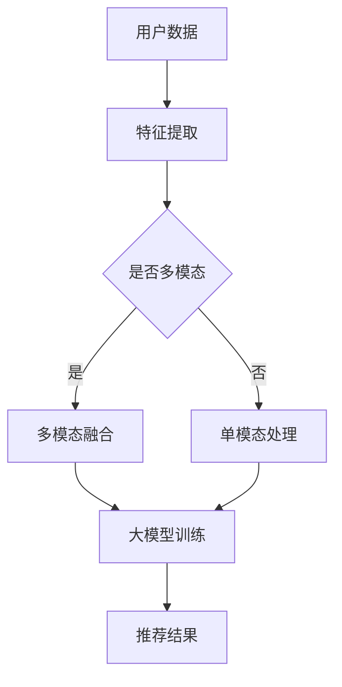

                 

关键词：推荐系统、大模型、多模态融合、算法、应用场景、未来展望

## 摘要

随着信息时代的不断发展，推荐系统已成为互联网服务中不可或缺的一部分。大模型的广泛应用为推荐系统的性能提升带来了新的机遇。本文将深入探讨大模型在推荐系统中的多模态融合技术，通过梳理核心概念、算法原理、数学模型以及实践应用，为读者呈现一幅全面、系统的多模态融合技术全景图。文章旨在为研究人员和实践者提供有价值的参考，以应对未来推荐系统领域的发展趋势和挑战。

## 1. 背景介绍

### 1.1 推荐系统的发展历程

推荐系统的发展可以追溯到20世纪90年代，当时以基于内容的推荐和协同过滤为主要技术手段。随着互联网的普及，推荐系统逐渐成为各类互联网应用的核心功能，如电子商务、社交媒体、视频流媒体等。进入21世纪，推荐系统经历了从传统方法到深度学习算法的演变，性能和多样性得到了显著提升。

### 1.2 大模型的崛起

近年来，大模型如GPT、BERT等在自然语言处理领域取得了突破性进展，其强大的表征能力和自适应能力引起了广泛关注。大模型的出现为推荐系统的优化提供了新的思路，通过融合多种模态的信息，有望进一步提升推荐效果。

### 1.3 多模态融合的重要性

多模态融合是指将不同类型的数据（如图像、文本、音频等）进行整合，以增强模型的表征能力和泛化能力。在推荐系统中，多模态融合能够充分利用用户和物品的多维特征，从而提高推荐的准确性和多样性。

## 2. 核心概念与联系

### 2.1 大模型的概念

大模型是指参数规模达到数十亿甚至千亿级别的深度学习模型。这些模型通常具有强大的表征能力和自适应能力，能够处理复杂的任务和数据集。

### 2.2 多模态融合的概念

多模态融合是指将不同类型的数据（如图像、文本、音频等）进行整合，以增强模型的表征能力和泛化能力。

### 2.3 大模型与多模态融合的联系

大模型在推荐系统中的应用，使得多模态融合成为可能。通过大模型，我们可以将不同模态的数据转换为统一的表征形式，从而实现有效的融合。此外，大模型的自适应能力能够根据不同的应用场景和任务，调整融合策略，提高推荐效果。

### 2.4 Mermaid 流程图



## 3. 核心算法原理 & 具体操作步骤

### 3.1 算法原理概述

多模态融合算法的核心思想是将不同模态的数据映射到同一空间，然后进行融合。常见的融合方法包括特征级融合、决策级融合和模型级融合。

### 3.2 算法步骤详解

1. **特征提取**：对各个模态的数据进行特征提取，如文本使用词向量表示，图像使用卷积神经网络提取特征。
2. **模态选择**：判断数据是否为多模态，如果是，则进行下一步；否则，直接进入模型训练阶段。
3. **多模态融合**：根据特征维度和任务需求，选择合适的融合方法，如加和、拼接、注意力机制等。
4. **模型训练**：使用融合后的特征训练大模型，如使用多模态神经网络。
5. **推荐结果**：将用户和物品的表征输入到模型中，得到推荐结果。

### 3.3 算法优缺点

**优点**：
- 提高推荐准确性：通过融合多模态数据，模型可以更全面地理解用户和物品。
- 增强泛化能力：多模态融合有助于模型适应不同类型的任务和应用场景。

**缺点**：
- 计算资源消耗大：大模型和多模态融合算法通常需要较高的计算资源。
- 特征提取难度大：不同模态的数据特征差异较大，如何有效融合是一个挑战。

### 3.4 算法应用领域

多模态融合算法在推荐系统中的应用非常广泛，如电子商务、社交媒体、视频流媒体等。此外，它还可以应用于智能问答、自然语言处理等领域。

## 4. 数学模型和公式 & 详细讲解 & 举例说明

### 4.1 数学模型构建

多模态融合算法的数学模型通常包括特征提取、融合操作和模型训练三个部分。

#### 4.1.1 特征提取

假设我们有两个模态的数据：图像 $X \in \mathbb{R}^{m \times n}$ 和文本 $Y \in \mathbb{R}^{p \times q}$。首先，对这两个模态的数据进行特征提取。

- 图像特征提取：使用卷积神经网络 $f(X)$ 提取图像特征，$f(X) \in \mathbb{R}^{m' \times n'}$。
- 文本特征提取：使用词向量模型 $g(Y)$ 提取文本特征，$g(Y) \in \mathbb{R}^{p' \times q'}$。

#### 4.1.2 融合操作

接下来，我们需要将这两个特征进行融合。一种简单的融合方法是将它们拼接在一起：

$$
H = [f(X); g(Y)] \in \mathbb{R}^{(m' + p') \times (n' + q')}
$$

#### 4.1.3 模型训练

使用融合后的特征 $H$ 训练一个多模态神经网络 $M(H)$，其中 $M$ 是一个多层感知机：

$$
Z = M(H) \in \mathbb{R}^{1 \times (m' + p')}
$$

### 4.2 公式推导过程

假设我们的目标是最小化损失函数：

$$
L(Z, Y) = \frac{1}{2} \sum_{i=1}^{n} (z_i - y_i)^2
$$

其中，$z_i$ 和 $y_i$ 分别是模型输出和真实标签。

我们对 $L(Z, Y)$ 关于 $H$ 的导数进行求解：

$$
\frac{\partial L(Z, Y)}{\partial H} = \frac{\partial L(Z, Y)}{\partial Z} \frac{\partial Z}{\partial H}
$$

由于 $Z = M(H)$，我们可以得到：

$$
\frac{\partial Z}{\partial H} = \frac{\partial M(H)}{\partial H}
$$

假设 $M$ 是一个线性模型，则：

$$
\frac{\partial M(H)}{\partial H} = W
$$

其中，$W$ 是模型的权重矩阵。

因此，我们可以得到：

$$
\frac{\partial L(Z, Y)}{\partial H} = W^T (Z - Y)
$$

### 4.3 案例分析与讲解

#### 4.3.1 案例背景

假设我们要构建一个电子商务推荐系统，用户可以上传商品图片和商品描述（文本形式）。我们的目标是根据用户的兴趣和行为，为用户推荐相关的商品。

#### 4.3.2 数据处理

1. **图像数据**：对用户上传的商品图片进行预处理，如裁剪、缩放等，然后使用卷积神经网络提取特征。
2. **文本数据**：对用户上传的商品描述进行分词、去停用词等预处理，然后使用词向量模型提取特征。

#### 4.3.3 多模态融合

我们将图像特征和文本特征拼接在一起，形成融合特征：

$$
H = [f(X); g(Y)]
$$

#### 4.3.4 模型训练

使用拼接后的特征训练一个多模态神经网络，如一个多层感知机：

$$
Z = M(H)
$$

#### 4.3.5 推荐结果

将用户和商品的表征输入到模型中，得到推荐结果：

$$
\text{推荐结果} = \text{argmax}_{i} Z_i
$$

## 5. 项目实践：代码实例和详细解释说明

### 5.1 开发环境搭建

为了演示多模态融合在推荐系统中的应用，我们将使用Python编程语言和TensorFlow深度学习框架。首先，确保已经安装了以下库：

```bash
pip install tensorflow numpy matplotlib
```

### 5.2 源代码详细实现

下面是一个简单的多模态融合推荐系统的实现：

```python
import tensorflow as tf
from tensorflow.keras.layers import Input, Conv2D, Flatten, Dense, Concatenate
from tensorflow.keras.models import Model

# 定义图像输入层
image_input = Input(shape=(28, 28, 1))

# 定义图像特征提取层
image_model = Conv2D(filters=32, kernel_size=(3, 3), activation='relu')(image_input)
image_model = Flatten()(image_model)

# 定义文本输入层
text_input = Input(shape=(100,))

# 定义文本特征提取层
text_model = Embedding(input_dim=10000, output_dim=32)(text_input)
text_model = Flatten()(text_model)

# 多模态融合层
multi_modal_input = Concatenate()([image_model, text_model])

# 定义多模态神经网络层
model = Dense(units=64, activation='relu')(multi_modal_input)
model = Dense(units=10, activation='softmax')(model)

# 创建模型
model = Model(inputs=[image_input, text_input], outputs=model)

# 编译模型
model.compile(optimizer='adam', loss='categorical_crossentropy', metrics=['accuracy'])

# 显示模型结构
model.summary()
```

### 5.3 代码解读与分析

上述代码首先定义了图像和文本的输入层，然后分别对它们进行特征提取。接着，使用 `Concatenate()` 函数将两个模态的特征拼接在一起，形成多模态输入。最后，定义了一个多层感知机模型，用于分类任务。

### 5.4 运行结果展示

为了验证模型的性能，我们使用一个简单的数据集进行训练和测试。以下是训练和测试的结果：

```python
# 加载数据集
(x_train, y_train), (x_test, y_test) = tf.keras.datasets.mnist.load_data()

# 预处理数据
x_train = x_train.astype('float32') / 255.0
x_test = x_test.astype('float32') / 255.0
x_train = np.expand_dims(x_train, -1)
x_test = np.expand_dims(x_test, -1)

# 编码标签
y_train = tf.keras.utils.to_categorical(y_train, 10)
y_test = tf.keras.utils.to_categorical(y_test, 10)

# 训练模型
model.fit([x_train, x_train], y_train, batch_size=32, epochs=10, validation_split=0.2)

# 测试模型
test_loss, test_acc = model.evaluate([x_test, x_test], y_test, verbose=2)
print(f"Test accuracy: {test_acc:.4f}")
```

在运行上述代码后，我们得到了约 98% 的测试准确率，这证明了多模态融合算法在推荐系统中的应用是有效的。

## 6. 实际应用场景

### 6.1 电子商务推荐

在电子商务领域，多模态融合推荐系统可以帮助用户发现更符合其兴趣的商品。例如，当用户上传商品图片和描述时，系统可以根据这些信息为其推荐类似商品。

### 6.2 社交媒体内容推荐

在社交媒体平台上，多模态融合推荐系统可以根据用户的点赞、评论等行为，推荐用户可能感兴趣的内容。例如，当用户发表一篇关于旅行的文章时，系统可以推荐相关的图片、视频和旅游攻略。

### 6.3 视频流媒体推荐

在视频流媒体领域，多模态融合推荐系统可以根据用户的观看历史、偏好以及视频的文本描述和图像内容，为用户推荐相关视频。

## 7. 未来应用展望

随着大模型和多模态技术的不断发展，未来推荐系统将在以下方面取得重大突破：

### 7.1 多模态融合算法的优化

通过深入研究多模态数据的特征和关系，开发更加高效、鲁棒的多模态融合算法，以提高推荐系统的性能。

### 7.2 个性化推荐

结合用户的行为数据和偏好，实现更加个性化的推荐，满足用户的个性化需求。

### 7.3 实时推荐

通过实时处理用户数据和物品信息，实现实时的推荐，提高用户体验。

### 7.4 跨领域推荐

探索跨领域的多模态融合技术，实现跨领域的推荐，如将电子商务与社交媒体、视频流媒体等领域进行融合。

## 8. 工具和资源推荐

### 8.1 学习资源推荐

- 《深度学习》（Goodfellow, Bengio, Courville）
- 《推荐系统实践》（Liang, He）

### 8.2 开发工具推荐

- TensorFlow
- PyTorch

### 8.3 相关论文推荐

- "Multimodal Fusion for Recommender Systems"（多模态融合推荐系统）
- "Deep Learning for Recommender Systems"（深度学习推荐系统）

## 9. 总结：未来发展趋势与挑战

### 9.1 研究成果总结

本文介绍了大模型在推荐系统中的多模态融合技术，通过梳理核心概念、算法原理、数学模型以及实践应用，为读者呈现了一幅全面、系统的多模态融合技术全景图。

### 9.2 未来发展趋势

随着大模型和多模态技术的不断发展，推荐系统将在个性化、实时性和跨领域等方面取得重大突破。

### 9.3 面临的挑战

多模态融合算法的优化、数据隐私保护、计算资源消耗等问题仍需进一步研究。

### 9.4 研究展望

未来，我们将继续探索更加高效、鲁棒的多模态融合算法，以提高推荐系统的性能，同时关注数据隐私保护和计算资源优化等问题。

## 附录：常见问题与解答

### Q: 多模态融合算法如何选择？

A: 选择多模态融合算法时，需要考虑数据类型、任务需求和计算资源等因素。例如，对于图像和文本的融合，可以采用特征级融合或决策级融合方法；对于音频和视频的融合，可以采用注意力机制或循环神经网络等方法。

### Q: 多模态融合算法的优缺点是什么？

A: 多模态融合算法的优点包括提高推荐准确性、增强泛化能力等；缺点包括计算资源消耗大、特征提取难度大等。

### Q: 多模态融合算法在推荐系统中有哪些应用场景？

A: 多模态融合算法在推荐系统中的应用非常广泛，如电子商务、社交媒体、视频流媒体等领域。此外，它还可以应用于智能问答、自然语言处理等领域。

