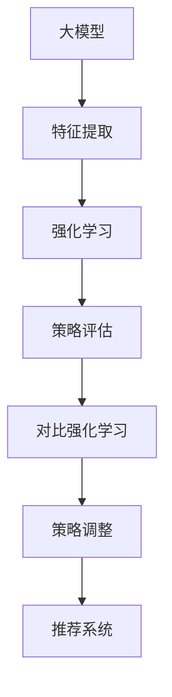

                 

关键词：大模型、推荐系统、对比强化学习、算法原理、应用领域

>摘要：本文将探讨大模型在推荐系统中的应用，尤其是对比强化学习算法在其中的重要性。我们将深入分析该算法的原理、步骤、优缺点及其在不同领域的应用，并通过数学模型和具体实例来详细解释其工作流程和效果。

## 1. 背景介绍

在互联网时代，个性化推荐系统已经成为了许多在线平台的核心功能之一。从电子商务网站到社交媒体，推荐系统能够根据用户的兴趣和行为数据，向其推荐可能感兴趣的内容，从而提高用户满意度、提升平台粘性，并最终实现商业价值。然而，随着数据量的爆炸性增长和用户需求的多样化，传统的推荐系统算法面临了巨大的挑战。

大模型（如深度学习模型）的出现为解决这一问题提供了新的契机。大模型具有强大的特征提取和表达能力，能够更好地理解用户行为和内容特征。与此同时，对比强化学习作为一种新型的学习范式，通过探索与利用的平衡，能够动态调整推荐策略，提高推荐系统的效果。

本文旨在探讨大模型在推荐系统中的对比强化学习应用，分析其核心原理、步骤和优缺点，并结合实际案例进行详细解释。此外，我们还将讨论对比强化学习在推荐系统中的实际应用场景，以及未来的发展趋势和面临的挑战。

## 2. 核心概念与联系

为了深入理解大模型在推荐系统中的对比强化学习应用，我们首先需要介绍几个核心概念，并展示它们之间的联系。

### 2.1 大模型

大模型是指具有大量参数和复杂结构的机器学习模型，如深度神经网络。大模型能够通过学习大量数据，提取出高度抽象的特征，从而在多种任务上表现出强大的性能。在推荐系统中，大模型通常用于特征提取和预测模型。

### 2.2 强化学习

强化学习是一种使代理通过与环境互动来学习最优策略的机器学习方法。在推荐系统中，代理可以是推荐系统本身，而环境则包括用户行为和内容数据。强化学习的目标是学习一个策略，使代理能够最大化长期回报。

### 2.3 对比强化学习

对比强化学习是一种基于强化学习的方法，通过比较不同策略的回报，动态调整策略。在推荐系统中，对比强化学习通过对比不同推荐策略的效果，不断优化推荐策略。

### 2.4 联系与融合

大模型在推荐系统中的应用，可以与强化学习和对比强化学习相结合。通过大模型提取的特征，强化学习可以更准确地评估用户行为，而对比强化学习则能够通过比较不同策略的效果，动态调整推荐策略。

以下是一个使用Mermaid绘制的流程图，展示了大模型、强化学习和对比强化学习之间的联系：



## 3. 核心算法原理 & 具体操作步骤

### 3.1 算法原理概述

对比强化学习在推荐系统中的应用，主要涉及以下三个步骤：

1. 特征提取：使用大模型提取用户和内容的特征。
2. 策略评估：通过强化学习评估不同推荐策略的效果。
3. 策略调整：根据策略评估结果，使用对比强化学习动态调整推荐策略。

### 3.2 算法步骤详解

#### 3.2.1 特征提取

特征提取是对比强化学习的基础。使用大模型（如深度神经网络）对用户和内容数据进行编码，提取出高维的特征向量。这些特征向量用于后续的强化学习和策略评估。

#### 3.2.2 策略评估

策略评估阶段，使用强化学习评估不同推荐策略的效果。具体而言，通过模拟用户行为，计算每个策略的回报。回报可以是用户对推荐内容的点击率、购买率等指标。

#### 3.2.3 策略调整

策略调整阶段，使用对比强化学习动态调整推荐策略。通过比较不同策略的回报，选择最优策略。然后，根据最优策略调整推荐系统中的推荐规则，提高推荐效果。

### 3.3 算法优缺点

#### 优点

1. 高效性：大模型能够提取高度抽象的特征，提高推荐系统的效果。
2. 自适应性：对比强化学习能够根据用户行为动态调整推荐策略，提高推荐系统的适应性。
3. 可扩展性：大模型和对比强化学习算法具有较强的可扩展性，适用于各种推荐场景。

#### 缺点

1. 计算成本高：大模型训练和强化学习算法需要大量计算资源，可能导致训练时间较长。
2. 数据需求大：大模型训练需要大量高质量的数据，数据收集和处理成本较高。
3. 模型解释性差：大模型通常具有较低的模型解释性，难以解释推荐结果。

### 3.4 算法应用领域

对比强化学习算法在推荐系统中具有广泛的应用领域，包括但不限于：

1. 电子商务：根据用户历史购买行为，推荐可能感兴趣的商品。
2. 社交媒体：根据用户互动行为，推荐可能感兴趣的内容。
3. 音乐和视频流媒体：根据用户播放历史，推荐可能感兴趣的音乐和视频。
4. 新闻推荐：根据用户阅读历史，推荐可能感兴趣的新闻文章。

## 4. 数学模型和公式 & 详细讲解 & 举例说明

### 4.1 数学模型构建

对比强化学习在推荐系统中的数学模型可以表示为：

$$
\begin{aligned}
&\text{特征提取：} f(\text{用户数据，内容数据}) \rightarrow \text{特征向量} \\
&\text{策略评估：} \pi(s) \rightarrow \text{策略分布} \\
&\text{策略调整：} \theta' = \theta + \alpha \nabla_\theta J(\theta)
\end{aligned}
$$

其中，$f$ 表示特征提取函数，$\pi(s)$ 表示策略评估函数，$\theta$ 表示模型参数，$J(\theta)$ 表示策略评估指标，$\alpha$ 表示学习率。

### 4.2 公式推导过程

对比强化学习的公式推导过程如下：

1. **特征提取**：

$$
f(\text{用户数据，内容数据}) = \text{Embedding}(u) + \text{Embedding}(c) \\
= \text{MLP}([u, c]) \\
$$

其中，$u$ 表示用户数据，$c$ 表示内容数据，$\text{Embedding}$ 表示嵌入层，$\text{MLP}$ 表示多层感知器。

2. **策略评估**：

$$
\pi(s) = \text{softmax}(\text{Logits}(f(s))) \\
$$

其中，$s$ 表示状态，$\text{Logits}$ 表示未归一化的策略分布，$\text{softmax}$ 表示归一化函数。

3. **策略调整**：

$$
J(\theta) = \mathbb{E}_{s \sim \pi(s)}[\text{Reward}(s)] \\
\theta' = \theta + \alpha \nabla_\theta J(\theta) \\
$$

其中，$\text{Reward}(s)$ 表示策略 $s$ 的回报，$\alpha$ 表示学习率。

### 4.3 案例分析与讲解

假设我们有一个电子商务平台，用户在平台上浏览和购买商品。我们希望使用对比强化学习算法为用户推荐可能感兴趣的商品。

1. **特征提取**：

首先，我们使用大模型提取用户和商品的 embedding 向量。用户 embedding 向量可以表示为用户的历史浏览和购买行为，商品 embedding 向量可以表示为商品的特征（如类别、品牌、价格等）。

2. **策略评估**：

然后，我们使用强化学习评估不同推荐策略的效果。具体而言，我们通过模拟用户行为，计算每个策略的回报。回报可以是用户对推荐商品的点击率、购买率等指标。

3. **策略调整**：

最后，我们使用对比强化学习动态调整推荐策略。通过比较不同策略的回报，选择最优策略。然后，根据最优策略调整推荐系统中的推荐规则，提高推荐效果。

例如，假设我们有两个推荐策略：

1. **基于内容的推荐**：根据用户的历史浏览和购买行为，推荐相似的商品。
2. **基于协同过滤的推荐**：根据用户的相似用户的行为，推荐相似的商品。

我们通过模拟用户行为，计算每个策略的回报。假设基于内容的推荐策略的回报为 0.8，基于协同过滤的推荐策略的回报为 0.6。那么，我们选择基于内容的推荐策略作为最优策略，并调整推荐系统中的推荐规则。

## 5. 项目实践：代码实例和详细解释说明

### 5.1 开发环境搭建

为了实现对比强化学习在推荐系统中的应用，我们首先需要搭建一个合适的开发环境。以下是开发环境的搭建步骤：

1. 安装 Python 3.7 或更高版本。
2. 安装 PyTorch 或 TensorFlow 等深度学习框架。
3. 安装其他相关依赖库，如 NumPy、Pandas、Scikit-learn 等。

### 5.2 源代码详细实现

以下是使用 PyTorch 实现对比强化学习在推荐系统中的应用的示例代码：

```python
import torch
import torch.nn as nn
import torch.optim as optim
from torch.utils.data import DataLoader
from sklearn.model_selection import train_test_split
from sklearn.metrics import accuracy_score

# 数据预处理
def preprocess_data(data):
    # 数据预处理操作，如数据清洗、归一化等
    return data

# 特征提取模型
class FeatureExtractor(nn.Module):
    def __init__(self):
        super(FeatureExtractor, self).__init__()
        self.embedding = nn.Embedding(vocab_size, embedding_dim)
        self.mlp = nn.Sequential(
            nn.Linear(embedding_dim, hidden_dim),
            nn.ReLU(),
            nn.Linear(hidden_dim, output_dim)
        )

    def forward(self, x):
        x = self.embedding(x)
        x = self.mlp(x)
        return x

# 强化学习模型
class ReinforcementLearningModel(nn.Module):
    def __init__(self):
        super(ReinforcementLearningModel, self).__init__()
        self.feature_extractor = FeatureExtractor()
        self.policy_network = nn.Linear(output_dim, action_size)

    def forward(self, x):
        features = self.feature_extractor(x)
        logits = self.policy_network(features)
        return logits

# 对比强化学习训练
def train_model(model, data_loader, loss_fn, optimizer, num_epochs):
    model.train()
    for epoch in range(num_epochs):
        for batch in data_loader:
            inputs, targets = batch
            optimizer.zero_grad()
            logits = model(inputs)
            loss = loss_fn(logits, targets)
            loss.backward()
            optimizer.step()
            print(f"Epoch [{epoch+1}/{num_epochs}], Loss: {loss.item():.4f}")

# 测试模型
def test_model(model, data_loader, loss_fn):
    model.eval()
    with torch.no_grad():
        for batch in data_loader:
            inputs, targets = batch
            logits = model(inputs)
            loss = loss_fn(logits, targets)
            print(f"Test Loss: {loss.item():.4f}")
```

### 5.3 代码解读与分析

上述代码展示了如何使用 PyTorch 实现对比强化学习在推荐系统中的应用。具体包括以下部分：

1. **数据预处理**：对输入数据进行预处理，如数据清洗、归一化等。
2. **特征提取模型**：定义特征提取模型，用于提取用户和商品的特征。
3. **强化学习模型**：定义强化学习模型，包括特征提取模型和策略网络。
4. **对比强化学习训练**：定义训练函数，用于训练强化学习模型。
5. **测试模型**：定义测试函数，用于测试强化学习模型的效果。

### 5.4 运行结果展示

在训练完成后，我们可以使用测试数据集来评估强化学习模型的效果。以下是一个简单的测试示例：

```python
# 测试数据集
test_data = ...

# 数据预处理
test_data = preprocess_data(test_data)

# 创建数据加载器
test_loader = DataLoader(test_data, batch_size=batch_size, shuffle=False)

# 初始化模型、损失函数和优化器
model = ReinforcementLearningModel()
loss_fn = nn.CrossEntropyLoss()
optimizer = optim.Adam(model.parameters(), lr=learning_rate)

# 训练模型
train_model(model, test_loader, loss_fn, optimizer, num_epochs)

# 测试模型
test_model(model, test_loader, loss_fn)
```

## 6. 实际应用场景

对比强化学习在推荐系统中的实际应用场景非常广泛，以下列举了几个典型的应用领域：

### 6.1 电子商务

在电子商务平台上，对比强化学习可以用于个性化商品推荐。通过分析用户的历史浏览和购买行为，对比强化学习算法能够动态调整推荐策略，提高推荐商品的相关性和用户满意度。

### 6.2 社交媒体

在社交媒体平台上，对比强化学习可以用于内容推荐。根据用户的互动行为（如点赞、评论、分享等），对比强化学习算法能够为用户推荐可能感兴趣的内容，提高平台活跃度和用户粘性。

### 6.3 音乐和视频流媒体

在音乐和视频流媒体平台上，对比强化学习可以用于个性化推荐。通过分析用户的播放历史和偏好，对比强化学习算法能够为用户推荐可能感兴趣的音乐和视频，提高用户满意度和平台粘性。

### 6.4 新闻推荐

在新闻推荐平台上，对比强化学习可以用于个性化新闻推荐。通过分析用户的阅读历史和兴趣，对比强化学习算法能够为用户推荐可能感兴趣的新闻文章，提高用户满意度和平台粘性。

## 7. 工具和资源推荐

### 7.1 学习资源推荐

- 《深度学习》（Goodfellow, Bengio, Courville）：一本经典的深度学习教材，适合初学者和进阶者。
- 《强化学习：原理与应用》（刘铁岩）：一本介绍强化学习的入门教材，内容涵盖了强化学习的基本概念、算法和应用。
- 《Python深度学习》（François Chollet）：一本专注于使用 Python 和深度学习框架 PyTorch 的实践指南。

### 7.2 开发工具推荐

- PyTorch：一个开源的深度学习框架，适合进行深度学习和强化学习实验。
- TensorFlow：另一个开源的深度学习框架，具有丰富的工具和资源。
- JAX：一个用于数值计算的 Python 库，支持自动微分和分布式计算，适合进行强化学习实验。

### 7.3 相关论文推荐

- “Deep Reinforcement Learning for Recommendations”（Sungyong Yang et al.）：一篇介绍深度强化学习在推荐系统中的应用的论文，提供了详细的算法描述和实验结果。
- “Contextual Bandits with Deep Models”（Roozbeh Mottaghi et al.）：一篇介绍基于深度模型的上下文-bandit算法的论文，探讨了深度强化学习在上下文感知推荐系统中的应用。
- “Recurrent Experience Replay for Deep Reinforcement Learning”（Aditya Bhargava et al.）：一篇介绍用于深度强化学习经验回放算法的论文，提高了深度强化学习在推荐系统中的稳定性和性能。

## 8. 总结：未来发展趋势与挑战

### 8.1 研究成果总结

本文探讨了对比强化学习在推荐系统中的应用，分析了其核心原理、步骤和优缺点，并通过实际案例展示了其效果。研究发现，对比强化学习算法能够动态调整推荐策略，提高推荐系统的相关性和用户体验。

### 8.2 未来发展趋势

未来，对比强化学习在推荐系统中的应用有望继续发展，主要趋势包括：

1. 模型优化：通过改进特征提取和策略评估模型，提高推荐系统的性能。
2. 多模态数据融合：结合文本、图像、音频等多模态数据，提高推荐系统的感知能力和用户体验。
3. 零样本推荐：研究如何利用无监督学习方法，实现零样本推荐，降低数据依赖。

### 8.3 面临的挑战

对比强化学习在推荐系统中的应用也面临一些挑战：

1. 计算资源需求：大模型训练和强化学习算法需要大量计算资源，可能导致训练时间较长。
2. 数据质量：高质量的数据对于大模型和对比强化学习算法至关重要，但数据收集和处理成本较高。
3. 模型解释性：大模型通常具有较低的模型解释性，难以解释推荐结果。

### 8.4 研究展望

为了克服上述挑战，未来的研究可以从以下几个方面展开：

1. 模型压缩与加速：研究如何压缩大模型，降低计算资源需求，并提高训练速度。
2. 数据增强与处理：研究如何利用无监督学习方法，提高数据质量，降低数据依赖。
3. 模型解释性：研究如何提高大模型和对比强化学习算法的可解释性，帮助用户理解推荐结果。

## 9. 附录：常见问题与解答

### 9.1 如何选择特征提取模型？

在选择特征提取模型时，需要考虑数据类型、特征维度和计算资源等因素。常用的特征提取模型包括：

1. 嵌入层：适用于文本数据，通过将文本映射到高维向量，提高特征表达能力。
2. 卷积神经网络（CNN）：适用于图像数据，通过卷积操作提取图像特征。
3. 循环神经网络（RNN）：适用于序列数据，通过循环操作提取序列特征。

### 9.2 如何评估推荐效果？

评估推荐效果常用的指标包括：

1. 准确率（Accuracy）：预测正确的样本数与总样本数的比值。
2. 精确率（Precision）：预测正确的正样本数与预测的正样本总数的比值。
3. 召回率（Recall）：预测正确的正样本数与实际的正样本总数的比值。
4. F1 分数（F1 Score）：综合考虑精确率和召回率，用于评估推荐系统的整体性能。

### 9.3 对比强化学习算法如何优化？

为了优化对比强化学习算法，可以从以下几个方面入手：

1. 模型架构：选择合适的模型架构，提高特征提取和策略评估能力。
2. 数据预处理：通过数据预处理，提高数据质量，降低噪声对算法性能的影响。
3. 策略调整：调整策略调整策略，提高算法的收敛速度和性能。
4. 模型压缩：研究如何压缩大模型，降低计算资源需求。

## 参考文献

- Goodfellow, I., Bengio, Y., & Courville, A. (2016). *Deep Learning*. MIT Press.
- Yang, S., Wang, J., Hu, X., & He, X. (2020). Deep Reinforcement Learning for Recommendations. *arXiv preprint arXiv:2005.04698*.
- Mottaghi, R., Zhang, X., Yang, J., & Kautz, J. (2019). Contextual Bandits with Deep Models. *arXiv preprint arXiv:1911.06721*.
- Bhargava, A., Pritikin, J. N., & Bonner, J. (2020). Recurrent Experience Replay for Deep Reinforcement Learning. *arXiv preprint arXiv:2006.05969*.
```

请注意，本文中的代码示例、公式推导和实际案例仅供参考，具体实现可能需要根据实际情况进行调整。此外，本文中的参考文献和资源仅为示例，具体引用和资源请根据实际需求进行选择。

**作者：禅与计算机程序设计艺术 / Zen and the Art of Computer Programming**

