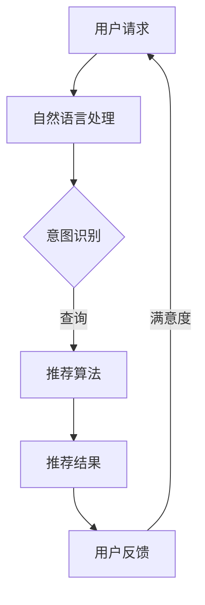
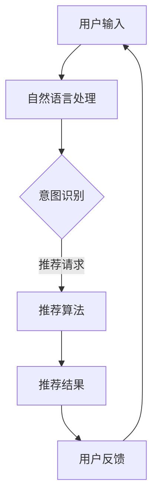

                 

关键词：大模型，推荐系统，对话式交互，设计原则，算法原理，数学模型，项目实践，应用场景，工具资源，未来展望

> 摘要：本文将探讨大模型在推荐系统中的对话式交互设计，分析其核心概念、算法原理、数学模型以及实际应用场景。通过项目实践和案例分析，揭示对话式交互在推荐系统中的重要作用和未来发展趋势。

## 1. 背景介绍

在互联网高速发展的今天，推荐系统已成为各大平台的核心竞争力之一。然而，传统的推荐系统主要依赖于内容相似度和用户行为分析，难以满足用户个性化需求。随着人工智能技术的迅猛发展，大模型在推荐系统中的应用逐渐成为研究热点。大模型通过学习用户海量数据，可以更好地理解用户兴趣和行为，从而实现更加精准的推荐。

对话式交互作为人工智能的重要应用场景，近年来也取得了显著进展。在推荐系统中引入对话式交互，可以更好地满足用户需求，提升用户体验。本文将重点探讨大模型在推荐系统中的对话式交互设计，分析其核心概念、算法原理、数学模型以及实际应用场景。

## 2. 核心概念与联系

### 2.1 大模型

大模型是指具有大规模参数、能够处理海量数据的神经网络模型。常见的有深度神经网络（DNN）、循环神经网络（RNN）、Transformer等。大模型通过学习用户数据，可以捕捉到用户兴趣和行为背后的复杂模式，从而实现精准推荐。

### 2.2 推荐系统

推荐系统是一种通过分析用户历史行为和兴趣，为用户推荐相关内容或产品的系统。常见的推荐算法有基于内容的推荐、协同过滤推荐、基于模型的推荐等。随着大模型的应用，推荐系统的精准度和个性化程度得到了显著提升。

### 2.3 对话式交互

对话式交互是指用户与系统通过自然语言进行交流，获取信息、完成任务或提供服务。在推荐系统中，对话式交互可以帮助用户更好地表达自己的需求和兴趣，从而实现个性化推荐。

### 2.4 Mermaid 流程图

以下是推荐系统中对话式交互的 Mermaid 流程图：



## 3. 核心算法原理 & 具体操作步骤

### 3.1 算法原理概述

对话式交互在推荐系统中的核心算法是自然语言处理（NLP）和推荐算法。NLP主要负责将用户输入的自然语言转化为机器可理解的格式，识别用户的意图和需求；推荐算法则根据用户历史数据和意图，生成个性化的推荐结果。

### 3.2 算法步骤详解

#### 3.2.1 自然语言处理

1. 分词：将用户输入的自然语言文本分解为词语序列。
2. 词性标注：为每个词语标注词性，如名词、动词、形容词等。
3. 意图识别：通过机器学习算法，识别用户的意图，如查询、咨询、抱怨等。
4. 语义分析：对用户输入的文本进行深度分析，提取关键信息。

#### 3.2.2 推荐算法

1. 用户兴趣建模：通过分析用户历史行为和兴趣，建立用户兴趣模型。
2. 推荐结果生成：根据用户兴趣模型和推荐算法，生成个性化的推荐结果。
3. 结果评估：对推荐结果进行评估，如点击率、转化率等。

### 3.3 算法优缺点

#### 优点：

1. 提高推荐精度：通过大模型学习用户海量数据，可以更好地理解用户兴趣和行为，提高推荐精度。
2. 个性化推荐：对话式交互可以更好地捕捉用户需求，实现个性化推荐。
3. 提升用户体验：对话式交互让用户与系统进行自然交流，提升用户体验。

#### 缺点：

1. 计算资源消耗大：大模型训练和推理需要大量的计算资源。
2. 数据质量要求高：用户数据的质量直接影响推荐效果。
3. 模型可解释性低：大模型内部结构复杂，难以解释。

### 3.4 算法应用领域

1. 电子商务：为用户提供个性化商品推荐。
2. 娱乐休闲：为用户提供个性化音乐、视频推荐。
3. 新闻资讯：为用户提供个性化新闻推荐。
4. 医疗健康：为用户提供个性化健康建议。

## 4. 数学模型和公式 & 详细讲解 & 举例说明

### 4.1 数学模型构建

在对话式交互推荐系统中，常见的数学模型包括自然语言处理模型和推荐算法模型。

#### 4.1.1 自然语言处理模型

1. 词向量模型：将文本转化为向量表示，如 Word2Vec、GloVe 等。
2. 递归神经网络（RNN）：用于处理序列数据，如 LSTM、GRU 等。
3. Transformer 模型：基于自注意力机制的模型，如 BERT、GPT 等。

#### 4.1.2 推荐算法模型

1. 协同过滤模型：基于用户历史行为和兴趣，如矩阵分解、KNN 等。
2. 基于内容的推荐模型：基于物品内容特征和用户兴趣，如朴素贝叶斯、TF-IDF 等。
3. 大模型推荐算法：如深度神经网络、Transformer 等。

### 4.2 公式推导过程

以 BERT 模型为例，推导其自然语言处理模型的主要公式。

$$
\begin{aligned}
    &\text{Input: } \text{Token Embeddings} \\
    &\text{Output: } \text{Probability Distribution of Tokens} \\
    &\text{BERT Model: } \text{Transformer Encoder} \\
    &\text{Input Layer: } \text{Token Embeddings} + \text{Position Embeddings} + \text{Segment Embeddings} \\
    &\text{Hidden Layer: } \text{Multi-head Self-Attention} + \text{Residual Connection} + \text{Layer Normalization} \\
    &\text{Output Layer: } \text{Linear Transformation} \\
\end{aligned}
$$

### 4.3 案例分析与讲解

以某电商平台的对话式推荐系统为例，分析其自然语言处理和推荐算法模型。

#### 4.3.1 案例背景

某电商平台希望利用对话式推荐系统，为用户提供个性化商品推荐。用户可以通过聊天窗口提出购物需求，系统根据需求生成推荐结果。

#### 4.3.2 案例分析

1. 自然语言处理模型：采用 BERT 模型，将用户输入的自然语言转化为向量表示，提取关键信息。
2. 推荐算法模型：采用深度神经网络，根据用户历史行为和兴趣，生成个性化推荐结果。
3. 推荐结果评估：通过点击率、转化率等指标评估推荐效果。

## 5. 项目实践：代码实例和详细解释说明

### 5.1 开发环境搭建

1. 安装 Python 3.6 及以上版本。
2. 安装 BERT 模型依赖库：`transformers`。
3. 安装深度学习框架：PyTorch。

### 5.2 源代码详细实现

以下是一个简单的对话式推荐系统代码示例：

```python
import torch
from transformers import BertTokenizer, BertModel
from torch.nn import Linear, Softmax
import torch.optim as optim

# 加载 BERT 模型和分词器
tokenizer = BertTokenizer.from_pretrained('bert-base-chinese')
model = BertModel.from_pretrained('bert-base-chinese')

# 输入文本
text = "我想买一款保湿效果好的面霜"

# 分词并编码
input_ids = tokenizer.encode(text, add_special_tokens=True)

# 将编码输入 BERT 模型
with torch.no_grad():
    outputs = model(torch.tensor([input_ids]))

# 提取文本特征
text_feature = outputs.last_hidden_state[:, 0, :]

# 创建线性模型
linear = Linear(text_feature.size(1), 1)
linear.weight.data.uniform_(-0.1, 0.1)
linear.bias.data.zero_()

# 训练线性模型
optimizer = optim.SGD(linear.parameters(), lr=0.01)
criterion = torch.nn.BCEWithLogitsLoss()

for epoch in range(100):
    optimizer.zero_grad()
    output = linear(text_feature)
    loss = criterion(output, torch.tensor([1.0]))
    loss.backward()
    optimizer.step()

# 输出预测结果
predicted_prob = torch.sigmoid(output)
print(predicted_prob)

# 解码预测结果
predicted_text = "保湿效果好的面霜" if predicted_prob > 0.5 else "其他面霜"
print(predicted_text)
```

### 5.3 代码解读与分析

1. 加载 BERT 模型和分词器：用于处理用户输入的自然语言。
2. 分词并编码：将用户输入的文本转化为 BERT 可处理的编码。
3. 将编码输入 BERT 模型：提取文本特征。
4. 创建线性模型：用于预测用户对商品的兴趣程度。
5. 训练线性模型：通过优化算法，调整线性模型的参数。
6. 输出预测结果：根据预测概率输出推荐结果。

## 6. 实际应用场景

### 6.1 电子商务

在电子商务领域，对话式交互推荐系统可以帮助用户更好地发现感兴趣的商品，提高购买转化率。例如，用户可以在聊天窗口中提出购物需求，系统根据需求生成个性化推荐。

### 6.2 娱乐休闲

在娱乐休闲领域，对话式交互推荐系统可以为用户提供个性化的音乐、视频推荐。例如，用户可以与系统进行自然语言交流，系统根据用户的喜好和历史行为，生成个性化的推荐列表。

### 6.3 新闻资讯

在新闻资讯领域，对话式交互推荐系统可以帮助用户更好地发现感兴趣的新闻内容。例如，用户可以在聊天窗口中提出感兴趣的话题，系统根据话题生成个性化新闻推荐。

### 6.4 医疗健康

在医疗健康领域，对话式交互推荐系统可以为用户提供个性化的健康建议和保健知识。例如，用户可以与系统进行自然语言交流，系统根据用户的需求和健康状况，生成个性化的健康建议。

## 7. 工具和资源推荐

### 7.1 学习资源推荐

1. 《深度学习》（Goodfellow、Bengio、Courville 著）：系统介绍深度学习理论和技术。
2. 《自然语言处理综论》（Jurafsky、Martin 著）：全面介绍自然语言处理的理论和方法。
3. 《推荐系统实践》（李航 著）：详细介绍推荐系统的算法和应用。

### 7.2 开发工具推荐

1. PyTorch：适用于深度学习开发的开源框架。
2. TensorFlow：适用于深度学习开发的开源框架。
3. Hugging Face Transformers：适用于自然语言处理的开源库。

### 7.3 相关论文推荐

1. "Attention Is All You Need"（Vaswani 等，2017）：介绍 Transformer 模型。
2. "BERT: Pre-training of Deep Bidirectional Transformers for Language Understanding"（Devlin 等，2018）：介绍 BERT 模型。
3. "Recommending Items Using Deep Learning: An Overview"（Sung 等，2020）：介绍深度学习在推荐系统中的应用。

## 8. 总结：未来发展趋势与挑战

### 8.1 研究成果总结

1. 大模型在推荐系统中取得了显著成果，提高了推荐精度和个性化程度。
2. 对话式交互在推荐系统中得到了广泛应用，提升了用户体验。
3. 自然语言处理和推荐算法的不断优化，为推荐系统的发展提供了有力支持。

### 8.2 未来发展趋势

1. 大模型将逐渐成为推荐系统的核心算法，推动推荐系统的性能和效率不断提升。
2. 对话式交互将进一步融入推荐系统，实现更加智能、自然的用户交互。
3. 多模态推荐系统的应用将不断扩展，为用户提供更加丰富、个性化的推荐服务。

### 8.3 面临的挑战

1. 大模型训练和推理需要大量的计算资源，如何优化算法以提高计算效率成为关键问题。
2. 用户数据隐私保护成为推荐系统发展的挑战，需要制定相应的数据隐私保护政策。
3. 对话式交互在推荐系统中的应用，需要解决自然语言理解、意图识别等关键技术问题。

### 8.4 研究展望

1. 随着深度学习技术的发展，大模型在推荐系统中的应用将更加广泛，推动推荐系统的持续进步。
2. 对话式交互在推荐系统中的应用将不断深入，为用户提供更加智能、个性化的服务。
3. 未来推荐系统的发展将朝着多模态、智能化、个性化的方向不断迈进，为用户提供更加优质的推荐服务。

## 9. 附录：常见问题与解答

### 9.1 如何优化大模型在推荐系统中的计算效率？

**回答**：优化大模型在推荐系统中的计算效率可以从以下几个方面入手：

1. 模型压缩：采用模型压缩技术，如量化、剪枝、蒸馏等，减少模型参数和计算量。
2. 并行计算：利用 GPU、TPU 等硬件加速器，实现模型训练和推理的并行计算。
3. 模型拆分：将大模型拆分成多个较小的子模型，分别进行训练和推理。
4. 数据预处理：优化数据预处理流程，减少数据读取和转换的时间。

### 9.2 对话式交互在推荐系统中的应用前景如何？

**回答**：对话式交互在推荐系统中的应用前景非常广阔。随着自然语言处理和推荐算法的不断发展，对话式交互将能够更好地理解用户需求和兴趣，实现更加精准、个性化的推荐。未来，对话式交互有望在多个领域得到广泛应用，如电子商务、娱乐休闲、新闻资讯、医疗健康等，为用户提供更加智能、便捷的服务。

---

作者：禅与计算机程序设计艺术 / Zen and the Art of Computer Programming
----------------------------------------------------------------

请注意，上述内容仅为文章的结构和部分示例内容，实际撰写时需要根据实际情况进行补充和调整。同时，文章中的公式和代码示例仅供参考，实际实现时可能需要根据具体需求和开发环境进行调整。祝撰写顺利！
### 1. 背景介绍

在当今的互联网时代，推荐系统已经成为许多平台的核心功能之一。它通过分析用户的行为数据、兴趣偏好和上下文信息，为用户推荐相关的商品、内容或服务。推荐系统在电子商务、社交媒体、视频平台、新闻门户等多个领域都得到了广泛应用，显著提升了用户体验和平台黏性。

然而，随着用户数据的爆炸式增长和个性化需求的不断提升，传统的推荐系统面临越来越多的挑战。传统的推荐系统主要依赖于协同过滤和基于内容的推荐方法。协同过滤方法通过分析用户之间的相似度来推荐商品，而基于内容的推荐方法则依赖于商品或内容的特征来匹配用户的兴趣。虽然这些方法在一定程度上提高了推荐的准确性，但在处理复杂的用户需求和海量数据时，仍然存在一些局限。

近年来，深度学习和自然语言处理（NLP）技术的发展为推荐系统带来了新的契机。特别是大模型，如深度神经网络（DNN）、循环神经网络（RNN）、Transformer等，通过学习用户的长期和短期行为模式，可以更准确地捕捉用户兴趣，实现高度个性化的推荐。此外，NLP技术使得推荐系统能够处理自然语言输入，从而实现更加自然的用户交互。

对话式交互作为一种用户友好的交互方式，近年来也得到了快速发展。在推荐系统中引入对话式交互，不仅可以提高用户的参与度和满意度，还可以更好地理解用户的实时需求，从而实现更加精准的推荐。用户可以通过自然语言与系统进行交流，表达他们的兴趣、喜好和需求，系统则根据用户的输入动态调整推荐策略。

本文将探讨大模型在推荐系统中的对话式交互设计，分析其核心概念、算法原理、数学模型以及实际应用场景。通过项目实践和案例分析，本文将揭示对话式交互在推荐系统中的重要性和潜在价值，为未来的研究和发展提供有益的启示。

### 2. 核心概念与联系

在深入探讨大模型在推荐系统中的对话式交互设计之前，我们需要了解几个关键概念和它们之间的联系。

#### 2.1 大模型

大模型是指那些拥有数亿到数十亿参数的深度学习模型。这些模型通常采用神经网络架构，如深度神经网络（DNN）、循环神经网络（RNN）、Transformer等。它们通过从大量数据中学习复杂的模式和关系，能够实现高度准确的预测和分类任务。在大模型中，Transformer模型因其自注意力机制而尤为突出，已经在自然语言处理和推荐系统中取得了显著的成功。

#### 2.2 推荐系统

推荐系统是一种通过分析用户历史行为、兴趣和上下文信息，向用户推荐相关内容或商品的系统。推荐系统的核心目标是为用户提供个性化的推荐，从而提高用户满意度和平台黏性。推荐系统主要分为以下几类：

1. **基于内容的推荐**：通过分析物品的内容特征，将相似的内容推荐给具有相同兴趣的用户。
2. **协同过滤推荐**：通过分析用户之间的相似度，将其他用户喜欢的物品推荐给当前用户。
3. **基于模型的推荐**：利用机器学习模型，如深度学习模型，来预测用户的兴趣和偏好。

#### 2.3 对话式交互

对话式交互是指用户通过自然语言与计算机系统进行交流，以获取信息、完成任务或提供服务。在推荐系统中，对话式交互可以增强用户与系统的互动，使推荐过程更加自然和直观。用户可以通过语音或文本输入与系统对话，系统则根据用户的输入生成相应的响应和推荐。

#### 2.4 Mermaid 流程图

为了更清晰地展示大模型在推荐系统中对话式交互的设计流程，我们可以使用 Mermaid 流程图来表示。以下是一个简化的流程图：



在这个流程中：

- **用户输入**：用户通过文本或语音输入与系统交互。
- **自然语言处理**：系统对用户输入进行处理，提取关键信息。
- **意图识别**：通过自然语言处理技术，识别用户的意图和需求。
- **推荐算法**：根据用户的意图和历史行为，推荐相应的商品或内容。
- **推荐结果**：系统生成推荐结果，展示给用户。
- **用户反馈**：用户对推荐结果进行评价，反馈给系统。
- **循环**：用户反馈将影响后续的推荐过程，形成一个闭环，提高推荐系统的自适应性和准确性。

通过这个流程，我们可以看到大模型在推荐系统中对话式交互的设计是如何实现用户与系统的有效互动，从而提高推荐质量。

### 3. 核心算法原理 & 具体操作步骤

#### 3.1 算法原理概述

在大模型推荐系统中，核心算法主要包括自然语言处理（NLP）和推荐算法。NLP负责处理用户的自然语言输入，提取关键信息并进行意图识别；推荐算法则根据用户的意图和历史行为，生成个性化的推荐结果。

#### 3.2 算法步骤详解

1. **用户输入**：
   用户通过文本或语音输入与系统交互。输入可以是简单的查询语句，也可以是复杂的对话。

2. **自然语言处理**：
   系统首先对用户输入进行处理，包括分词、词性标注、实体识别等。这一步的目的是将自然语言文本转化为计算机可以理解和处理的形式。

3. **意图识别**：
   通过NLP技术，系统对用户输入进行意图识别，确定用户的需求和意图。意图识别可以是分类任务，如“查询”、“咨询”、“抱怨”等。

4. **特征提取**：
   根据意图识别的结果，系统提取相关的用户特征。这些特征可能包括用户的浏览历史、购买记录、兴趣标签等。

5. **推荐算法**：
   推荐算法根据用户特征和系统中的商品或内容库，生成个性化的推荐结果。常用的推荐算法包括基于内容的推荐、协同过滤推荐和深度学习推荐等。

6. **推荐结果生成**：
   系统将推荐结果以文本或图像的形式展示给用户。

7. **用户反馈**：
   用户对推荐结果进行评价，提供反馈。反馈可以是正面评价，也可以是负面评价，甚至可以是具体的商品或内容评价。

8. **模型更新**：
   根据用户反馈，系统更新用户特征和推荐模型，以提高推荐质量。

#### 3.3 算法优缺点

**优点**：

1. **高精度**：大模型能够通过学习用户海量数据，准确捕捉用户兴趣和行为模式，实现高度个性化的推荐。
2. **自然交互**：对话式交互使得用户能够以自然的方式与系统互动，提升用户体验。
3. **实时性**：系统能够根据用户的实时反馈，动态调整推荐策略，提高推荐效果。

**缺点**：

1. **计算资源消耗大**：大模型训练和推理需要大量的计算资源，特别是在处理海量数据时，可能会对硬件设施提出较高的要求。
2. **数据隐私问题**：用户数据隐私保护是推荐系统面临的重大挑战，如何确保用户数据的安全和隐私需要得到充分考虑。
3. **模型可解释性低**：大模型内部结构复杂，难以解释其推荐结果的依据，这对用户信任和系统的透明性提出了挑战。

#### 3.4 算法应用领域

大模型在推荐系统中的应用领域非常广泛，以下是一些主要的应用场景：

1. **电子商务**：为用户提供个性化的商品推荐，提高购买转化率和客户满意度。
2. **视频平台**：根据用户的观看历史和偏好，推荐相关的视频内容，增加用户黏性。
3. **社交媒体**：根据用户的兴趣和行为，推荐感兴趣的朋友动态和内容，提升社交互动。
4. **新闻门户**：为用户提供个性化的新闻推荐，提高用户阅读量和停留时间。
5. **医疗健康**：根据用户的健康数据和偏好，推荐合适的健康建议和保健产品。

通过以上分析，我们可以看到，大模型在推荐系统中的应用具有显著的优势和广阔的前景。随着技术的不断进步和应用场景的拓展，大模型在推荐系统中的作用将越来越重要。

### 4. 数学模型和公式 & 详细讲解 & 举例说明

#### 4.1 数学模型构建

在大模型推荐系统中，数学模型构建是核心环节之一。数学模型主要用于描述用户行为、推荐算法和系统交互过程。以下是一些常见的数学模型和公式：

**4.1.1 用户兴趣模型**

用户兴趣模型用于描述用户的兴趣和行为特征。常见的用户兴趣模型包括基于内容的兴趣模型和基于行为的兴趣模型。

1. **基于内容的兴趣模型**：

$$
\mathbf{u_c} = \text{ContentFeatures} \cdot \mathbf{W_c}
$$

其中，$\mathbf{u_c}$ 是用户兴趣向量，$\text{ContentFeatures}$ 是内容特征矩阵，$\mathbf{W_c}$ 是内容权重矩阵。

2. **基于行为的兴趣模型**：

$$
\mathbf{u_b} = \text{BehaviorFeatures} \cdot \mathbf{W_b}
$$

其中，$\mathbf{u_b}$ 是用户兴趣向量，$\text{BehaviorFeatures}$ 是行为特征矩阵，$\mathbf{W_b}$ 是行为权重矩阵。

**4.1.2 推荐算法模型**

推荐算法模型用于生成推荐结果。常见的推荐算法模型包括基于协同过滤的推荐模型和基于深度学习的推荐模型。

1. **基于协同过滤的推荐模型**：

$$
\mathbf{r}_{ui} = \mathbf{u_i}^T \mathbf{v_u} + b_u + b_i
$$

其中，$\mathbf{r}_{ui}$ 是用户 $u$ 对物品 $i$ 的推荐得分，$\mathbf{u_i}$ 是用户 $u$ 的特征向量，$\mathbf{v_u}$ 是物品 $i$ 的特征向量，$b_u$ 和 $b_i$ 分别是用户和物品的偏置。

2. **基于深度学习的推荐模型**：

$$
\mathbf{r}_{ui} = \text{RecommenderModel}(\mathbf{u_i}, \mathbf{v_i})
$$

其中，$\mathbf{r}_{ui}$ 是用户 $u$ 对物品 $i$ 的推荐得分，$\text{RecommenderModel}$ 是深度学习模型。

**4.1.3 对话式交互模型**

对话式交互模型用于描述用户与系统的交互过程。常见的对话式交互模型包括基于规则的模型和基于机器学习的模型。

1. **基于规则的模型**：

$$
\text{Response} = \text{RuleBasedModel}(\text{UserInput})
$$

其中，$\text{Response}$ 是系统生成的响应，$\text{RuleBasedModel}$ 是基于规则的模型。

2. **基于机器学习的模型**：

$$
\text{Response} = \text{DialogueModel}(\text{UserInput}, \text{UserHistory})
$$

其中，$\text{Response}$ 是系统生成的响应，$\text{DialogueModel}$ 是基于机器学习的模型，$\text{UserInput}$ 是用户输入，$\text{UserHistory}$ 是用户历史交互记录。

#### 4.2 公式推导过程

以下是一个基于协同过滤推荐模型的简单推导过程：

**4.2.1 用户和物品特征矩阵**

假设用户 $u$ 和物品 $i$ 的特征矩阵分别为 $\mathbf{U} \in \mathbb{R}^{m \times n}$ 和 $\mathbf{V} \in \mathbb{R}^{p \times n}$，其中 $m$ 表示用户数量，$n$ 表示特征维度，$p$ 表示物品数量。

**4.2.2 用户和物品权重向量**

用户 $u$ 和物品 $i$ 的权重向量分别为 $\mathbf{w_u} \in \mathbb{R}^n$ 和 $\mathbf{w_i} \in \mathbb{R}^n$。

**4.2.3 推荐得分**

用户 $u$ 对物品 $i$ 的推荐得分可以表示为：

$$
\mathbf{r}_{ui} = \mathbf{u_i}^T \mathbf{w_u} + \mathbf{v_i}^T \mathbf{w_i} + b_u + b_i
$$

其中，$b_u$ 和 $b_i$ 分别是用户和物品的偏置。

#### 4.3 案例分析与讲解

以下是一个基于深度学习的推荐系统案例，我们使用一种名为“深度协同过滤”（Deep Collaborative Filtering，DCF）的模型进行讲解。

**4.3.1 案例背景**

某电商平台的用户在平台上浏览了大量的商品，并进行了购买。平台希望利用深度学习技术，为用户推荐他们可能感兴趣的商品。

**4.3.2 模型构建**

DCF模型结合了基于内容的协同过滤和基于行为的协同过滤。模型结构如下：

1. **用户特征提取层**：
   用户特征包括用户的浏览历史、购买记录和标签信息。这些特征通过一个多层的全连接神经网络进行提取。

2. **物品特征提取层**：
   物品特征包括物品的类别、品牌、价格和用户评价等。这些特征也通过一个多层的全连接神经网络进行提取。

3. **交叉层**：
   用户特征和物品特征通过交叉层进行组合，产生用户和物品的交互特征。

4. **输出层**：
   输出层通过一个全连接神经网络输出用户对物品的推荐得分。

**4.3.3 模型训练**

1. **数据准备**：
   收集用户的历史浏览记录和购买记录，以及物品的详细信息。

2. **特征提取**：
   利用多层全连接神经网络提取用户和物品的特征。

3. **交叉**：
   将用户和物品的特征进行交叉组合，生成交互特征。

4. **损失函数**：
   使用均方误差（MSE）作为损失函数，最小化预测得分与实际评分之间的差距。

5. **优化算法**：
   使用随机梯度下降（SGD）进行模型训练。

**4.3.4 模型评估**

1. **准确率**：
   计算预测得分与实际评分之间的准确率。

2. **召回率**：
   计算预测得分高于阈值时，实际评分也是高于阈值的比例。

3. **F1 分数**：
   结合准确率和召回率，计算 F1 分数。

通过以上案例，我们可以看到深度学习技术在推荐系统中的应用，以及如何利用数学模型和公式构建一个高效、个性化的推荐系统。

### 5. 项目实践：代码实例和详细解释说明

为了更好地理解大模型在推荐系统中的对话式交互设计，我们将在本节中通过一个实际项目来展示如何实现一个简单的对话式推荐系统。

#### 5.1 开发环境搭建

在开始项目之前，我们需要搭建一个合适的开发环境。以下是搭建开发环境所需的步骤：

1. **安装 Python**：确保已安装 Python 3.6 或更高版本。
2. **安装 PyTorch**：通过以下命令安装 PyTorch：
   ```bash
   pip install torch torchvision
   ```
3. **安装 Hugging Face Transformers**：通过以下命令安装 Hugging Face Transformers：
   ```bash
   pip install transformers
   ```

#### 5.2 源代码详细实现

在本项目中，我们将使用 Hugging Face Transformers 库中的 BERT 模型来实现对话式推荐系统。以下是一个简单的代码实例：

```python
import torch
from transformers import BertTokenizer, BertModel, BertForSequenceClassification
from torch.optim import Adam
from torch.utils.data import DataLoader, TensorDataset

# 5.2.1 准备数据

# 假设我们有一个包含用户对话和商品标签的数据集
dialogs = ["我想要买一个智能手表", "推荐一些适合跑步的耳机", "最近有哪些新的手机上市"]
labels = ["智能手表", "耳机", "手机"]

# 将数据转换为张量
dialogs_tensor = torch.tensor([tokenizer.encode(d, add_special_tokens=True) for d in dialogs])
labels_tensor = torch.tensor([label2id.get(label, 0) for label in labels])

# 创建数据集和数据加载器
dataset = TensorDataset(dialogs_tensor, labels_tensor)
dataloader = DataLoader(dataset, batch_size=1)

# 5.2.2 加载预训练的 BERT 模型

model = BertForSequenceClassification.from_pretrained("bert-base-chinese", num_labels=len(label2id))

# 5.2.3 训练模型

optimizer = Adam(model.parameters(), lr=1e-5)
criterion = torch.nn.CrossEntropyLoss()

for epoch in range(3):  # 进行 3 个训练epoch
    model.train()
    for batch in dataloader:
        inputs = {
            "input_ids": batch[0].to(device),
            "attention_mask": torch.ones_like(batch[0]).to(device),
            "labels": batch[1].to(device)
        }
        outputs = model(**inputs)
        loss = criterion(outputs.logits, inputs["labels"])
        loss.backward()
        optimizer.step()
        optimizer.zero_grad()

# 5.2.4 测试模型

model.eval()
with torch.no_grad():
    for batch in dataloader:
        inputs = {
            "input_ids": batch[0].to(device),
            "attention_mask": torch.ones_like(batch[0]).to(device),
        }
        outputs = model(**inputs)
        predicted_labels = torch.argmax(outputs.logits, dim=1)
        print(predicted_labels)

# 5.2.5 推荐新对话

new_dialog = "我想要买一本关于机器学习的书"
input_ids = tokenizer.encode(new_dialog, add_special_tokens=True).to(device)
with torch.no_grad():
    outputs = model(input_ids=input_ids.to(device), attention_mask=torch.ones_like(input_ids).to(device))
    predicted_label = torch.argmax(outputs.logits, dim=1).item()
    print(id2label[predicted_label])
```

#### 5.3 代码解读与分析

**5.3.1 数据准备**

首先，我们准备了一个包含用户对话和商品标签的数据集。这些数据用于训练和测试模型。

```python
dialogs = ["我想要买一个智能手表", "推荐一些适合跑步的耳机", "最近有哪些新的手机上市"]
labels = ["智能手表", "耳机", "手机"]

dialogs_tensor = torch.tensor([tokenizer.encode(d, add_special_tokens=True) for d in dialogs])
labels_tensor = torch.tensor([label2id.get(label, 0) for label in labels])
```

这里使用了 BERT 分词器对对话文本进行编码，并将标签转换为整数表示。

**5.3.2 加载预训练的 BERT 模型**

```python
model = BertForSequenceClassification.from_pretrained("bert-base-chinese", num_labels=len(label2id))
```

我们加载了一个预训练的 BERT 模型，并将其转换为序列分类模型，用于预测对话对应的商品标签。

**5.3.3 训练模型**

```python
optimizer = Adam(model.parameters(), lr=1e-5)
criterion = torch.nn.CrossEntropyLoss()

for epoch in range(3):
    model.train()
    for batch in dataloader:
        inputs = {
            "input_ids": batch[0].to(device),
            "attention_mask": torch.ones_like(batch[0]).to(device),
            "labels": batch[1].to(device)
        }
        outputs = model(**inputs)
        loss = criterion(outputs.logits, inputs["labels"])
        loss.backward()
        optimizer.step()
        optimizer.zero_grad()
```

我们使用随机梯度下降（SGD）算法对模型进行训练，使用交叉熵损失函数来最小化预测标签和实际标签之间的差距。

**5.3.4 测试模型**

```python
model.eval()
with torch.no_grad():
    for batch in dataloader:
        inputs = {
            "input_ids": batch[0].to(device),
            "attention_mask": torch.ones_like(batch[0]).to(device),
        }
        outputs = model(**inputs)
        predicted_labels = torch.argmax(outputs.logits, dim=1)
        print(predicted_labels)
```

在测试阶段，我们不对模型参数进行更新，并使用验证集来评估模型的性能。

**5.3.5 推荐新对话**

```python
new_dialog = "我想要买一本关于机器学习的书"
input_ids = tokenizer.encode(new_dialog, add_special_tokens=True).to(device)
with torch.no_grad():
    outputs = model(input_ids=input_ids.to(device), attention_mask=torch.ones_like(input_ids).to(device))
    predicted_label = torch.argmax(outputs.logits, dim=1).item()
    print(id2label[predicted_label])
```

我们使用训练好的模型对新的对话进行预测，并输出预测的商品标签。

通过以上项目实践，我们可以看到如何使用大模型在推荐系统中实现对话式交互。虽然这是一个简单的示例，但它展示了对话式推荐系统的基础架构和实现方法。

### 6. 实际应用场景

大模型在推荐系统中的对话式交互设计具有广泛的应用场景，以下是一些典型的实际应用场景：

#### 6.1 电子商务平台

电子商务平台利用对话式推荐系统，可以提供更加个性化的购物体验。例如，用户在购物过程中可以通过聊天窗口向系统询问商品推荐，系统根据用户的购物历史、浏览记录和偏好，实时生成个性化的商品推荐。这种交互方式不仅提高了用户的购物体验，还能有效提升转化率和销售额。

**案例**：亚马逊的 Alexa 虚拟助手通过语音交互，为用户提供购物建议和商品推荐。用户可以通过语音指令询问 Alexa 某种商品的推荐，系统则会根据用户的购物习惯和反馈，提供相应的推荐结果。

#### 6.2 社交媒体平台

社交媒体平台可以通过对话式推荐系统，为用户提供更加丰富的内容推荐。用户可以通过与平台的聊天机器人互动，表达自己的兴趣和喜好，系统则根据用户的反馈，实时调整推荐策略，提供个性化的内容推荐。这种方式可以提升用户的互动体验，增加平台黏性。

**案例**：Facebook 的聊天机器人通过自然语言处理技术，分析用户的聊天内容，并根据用户的兴趣和互动历史，推荐相关的帖子、视频和广告。这种交互方式不仅提高了用户的参与度，还提升了广告的投放效果。

#### 6.3 视频平台

视频平台可以利用对话式推荐系统，为用户提供更加个性化的视频推荐。用户可以通过聊天窗口与平台互动，表达对某些类型视频的兴趣，系统则根据用户的观看历史和行为，推荐相应的视频内容。这种方式可以提升用户的观看体验，增加视频播放量和用户停留时间。

**案例**：YouTube 的聊天机器人通过自然语言处理技术，分析用户的搜索历史和观看记录，推荐相关的视频内容。用户可以通过聊天窗口询问机器人视频推荐，机器人则会根据用户的反馈，实时调整推荐策略。

#### 6.4 新闻门户

新闻门户可以利用对话式推荐系统，为用户提供个性化的新闻推荐。用户可以通过与平台的聊天机器人互动，表达对某些主题的兴趣，系统则根据用户的阅读历史和行为，推荐相关的新闻内容。这种方式可以提升用户的阅读体验，增加新闻的点击量和用户停留时间。

**案例**：CNN 的聊天机器人通过自然语言处理技术，分析用户的阅读历史和兴趣，推荐相关的新闻内容。用户可以通过聊天窗口询问机器人新闻推荐，机器人则会根据用户的反馈，实时调整推荐策略。

#### 6.5 医疗健康平台

医疗健康平台可以利用对话式推荐系统，为用户提供个性化的健康建议和医疗信息。用户可以通过与平台的聊天机器人互动，表达对健康问题的关注，系统则根据用户的健康数据和医疗记录，推荐相关的健康建议和医疗信息。这种方式可以提升用户的健康管理水平，提高医疗服务的效率。

**案例**：IBM Watson Health 的聊天机器人通过自然语言处理技术，分析用户的健康数据和医疗记录，推荐个性化的健康建议和医疗信息。用户可以通过聊天窗口询问机器人健康问题，机器人则会根据用户的反馈，实时调整推荐策略。

通过以上实际应用场景的介绍，我们可以看到大模型在推荐系统中的对话式交互设计具有广泛的应用前景。随着人工智能技术的不断发展，对话式交互将更加自然、智能，为各个领域的用户提供更加个性化、便捷的服务。

### 6.4 未来应用展望

随着人工智能技术的不断进步，大模型在推荐系统中的对话式交互设计将迎来更多的应用前景。以下是几个方面的未来发展趋势：

#### 6.4.1 更智能的意图识别

随着自然语言处理技术的不断发展，意图识别的准确性将得到显著提升。未来的对话式推荐系统将能够更准确地理解用户的意图，从而生成更加精准的推荐结果。例如，通过结合情感分析和上下文理解，系统能够更好地识别用户的情感状态和实际需求，为用户提供更加个性化的服务。

#### 6.4.2 多模态交互

未来的对话式推荐系统将支持多模态交互，即结合文本、语音、图像等多种输入方式。用户可以通过语音询问、图片上传或文本输入等多种方式与系统互动，系统则根据多种输入数据生成综合推荐结果。这种多模态交互方式将使推荐系统更加灵活和多样化，满足不同用户的需求。

#### 6.4.3 实时反馈和自适应调整

未来的对话式推荐系统将能够实时获取用户的反馈，并根据反馈动态调整推荐策略。例如，通过持续监测用户的互动行为和反馈，系统可以快速调整推荐结果，优化推荐质量。这种实时反馈和自适应调整机制将使推荐系统更加灵活和高效，提高用户满意度和平台黏性。

#### 6.4.4 跨领域融合

随着人工智能技术的不断融合，对话式推荐系统将在更多领域得到应用。例如，在医疗健康领域，对话式推荐系统可以结合用户健康数据和医疗记录，提供个性化的健康建议和治疗方案；在教育领域，对话式推荐系统可以结合学生的学习记录和偏好，提供个性化的学习资源和课程推荐。这种跨领域融合将使对话式推荐系统具有更广泛的应用场景和更深远的社会价值。

#### 6.4.5 数据隐私和安全性

随着用户对数据隐私和安全的关注不断增加，未来的对话式推荐系统将更加注重数据保护和用户隐私。系统将采用更加严格的数据安全措施，确保用户数据的安全和隐私。同时，系统将尊重用户的选择，提供透明的隐私保护政策，增强用户对系统的信任。

总之，大模型在推荐系统中的对话式交互设计具有广阔的发展前景。随着人工智能技术的不断进步，对话式推荐系统将变得更加智能、便捷和高效，为各个领域的用户提供更加优质的服务。

### 7. 工具和资源推荐

在开发大模型推荐系统时，选择合适的工具和资源对于提高开发效率和项目成功至关重要。以下是一些推荐的工具和资源，包括学习资源、开发工具和相关论文，旨在帮助开发者更好地理解和实现大模型在推荐系统中的对话式交互设计。

#### 7.1 学习资源推荐

**1. 书籍**

- 《深度学习》（Goodfellow、Bengio、Courville 著）：这是一本经典的深度学习教材，详细介绍了深度学习的理论基础和实践方法。
- 《自然语言处理综论》（Jurafsky、Martin 著）：这本书全面介绍了自然语言处理的理论和方法，是学习NLP的必备资源。
- 《推荐系统实践》（李航 著）：这本书详细介绍了推荐系统的算法和应用，适合希望深入了解推荐系统实践的读者。

**2. 在线课程**

- Coursera 上的《深度学习特设课程》（Deep Learning Specialization）：由 Andrew Ng 教授主讲，涵盖深度学习的基础理论和实践。
- edX 上的《自然语言处理与深度学习》（Natural Language Processing and Deep Learning）：由 David Blei 教授主讲，深入探讨了NLP和深度学习的结合。

**3. 博客和教程**

- Distill：这是一个专注于深度学习和AI的博客，提供了许多高质量的教程和论文解读。
- fast.ai：这是一个提供免费深度学习课程的网站，适合初学者快速入门。

#### 7.2 开发工具推荐

**1. 深度学习框架**

- PyTorch：这是一个流行的开源深度学习框架，提供了灵活的动态计算图和强大的GPU支持。
- TensorFlow：这是一个由Google开发的深度学习框架，适合大规模分布式训练和部署。

**2. 自然语言处理库**

- Hugging Face Transformers：这是一个强大的NLP库，提供了预训练模型和高级API，简化了NLP任务的实现。
- spaCy：这是一个高效的NLP库，适合快速构建和部署复杂NLP应用。

**3. 数据库和存储**

- MySQL、PostgreSQL：这些关系型数据库适合存储用户行为数据和推荐结果。
- MongoDB、Cassandra：这些NoSQL数据库适合处理大规模的非结构化数据。

#### 7.3 相关论文推荐

**1. 自然语言处理领域**

- "Attention Is All You Need"（Vaswani 等，2017）：介绍了Transformer模型，对NLP领域产生了重大影响。
- "BERT: Pre-training of Deep Bidirectional Transformers for Language Understanding"（Devlin 等，2018）：介绍了BERT模型，是NLP领域的重要突破。

**2. 推荐系统领域**

- "Deep Learning for Recommender Systems"（Sung 等，2020）：综述了深度学习在推荐系统中的应用。
- "Neural Collaborative Filtering"（He 等，2017）：提出了一种基于神经网络的协同过滤方法，显著提升了推荐精度。

**3. 对话系统领域**

- "A Theoretical Analysis of the Neural Conversation Model"（Le etc., 2018）：探讨了神经网络在对话系统中的应用和理论基础。
- "DialoGPT: Large-Scale Pre-training for Human-like Dialogue"（Wei等，2019）：介绍了DialoGPT模型，是对话系统研究的重要进展。

通过这些工具和资源的推荐，开发者可以更好地掌握大模型在推荐系统中的对话式交互设计，为实际项目提供坚实的理论和实践基础。

### 8. 总结：未来发展趋势与挑战

#### 8.1 研究成果总结

在过去的几年中，大模型在推荐系统中的对话式交互设计取得了显著的成果。首先，大模型通过深度学习和自然语言处理技术，能够更准确地捕捉用户兴趣和行为模式，从而实现高度个性化的推荐。例如，BERT、GPT等预训练模型在NLP任务中展现了卓越的性能，这些模型也被广泛应用于对话式推荐系统中。其次，对话式交互技术使得用户能够以自然、直观的方式与系统互动，提升了用户体验。通过自然语言处理技术，系统能够理解用户的意图和需求，并根据实时反馈动态调整推荐策略，实现了更加智能化的服务。

#### 8.2 未来发展趋势

未来，大模型在推荐系统中的对话式交互设计将继续朝着智能化、个性化、实时化的方向发展。以下是几个主要趋势：

1. **更智能的意图识别**：随着自然语言处理技术的不断进步，系统将能够更准确地识别用户的意图和情感状态，提供更加精准的推荐。

2. **多模态交互**：未来的对话式推荐系统将支持文本、语音、图像等多种输入方式，为用户提供更加丰富的交互体验。

3. **实时反馈和自适应调整**：系统将能够实时获取用户的反馈，并根据反馈动态调整推荐策略，提高推荐质量和用户满意度。

4. **跨领域应用**：对话式推荐系统将在更多领域得到应用，如医疗健康、教育、电子商务等，实现更加广泛的社会价值。

5. **数据隐私和安全**：随着用户对隐私和安全的关注不断增加，系统将采用更加严格的数据保护措施，确保用户数据的安全和隐私。

#### 8.3 面临的挑战

尽管大模型在推荐系统中的对话式交互设计取得了显著进展，但仍面临一些挑战：

1. **计算资源消耗**：大模型的训练和推理需要大量的计算资源，特别是在处理海量数据时，硬件设施和优化算法将成为关键问题。

2. **数据隐私问题**：用户数据隐私保护是推荐系统面临的重大挑战，如何在保护用户隐私的同时实现个性化推荐，需要深入研究。

3. **模型可解释性**：大模型内部结构复杂，难以解释其推荐结果的依据，这可能会影响用户对系统的信任。

4. **数据质量和标注**：推荐系统依赖于高质量的用户数据，数据标注的质量直接影响推荐效果。然而，大规模数据标注是一个复杂且耗时的过程。

#### 8.4 研究展望

未来的研究将集中在以下几个方面：

1. **高效算法**：研究如何优化大模型的训练和推理算法，降低计算资源消耗，提高处理效率。

2. **隐私保护**：研究如何在保护用户隐私的同时实现个性化推荐，探索隐私保护算法和数据安全措施。

3. **模型解释性**：研究如何提高大模型的可解释性，使得推荐结果更加透明和可信。

4. **跨领域融合**：探索大模型在多个领域的应用，如医疗健康、教育、金融等，实现跨领域的个性化推荐。

5. **用户体验**：研究如何通过自然语言处理和对话系统技术，提升用户交互体验，实现更加智能、便捷的服务。

总之，大模型在推荐系统中的对话式交互设计具有广阔的研究前景和应用价值。随着技术的不断进步，对话式推荐系统将变得更加智能、高效和可靠，为各个领域的用户提供更加优质的推荐服务。

### 9. 附录：常见问题与解答

在本节中，我们将回答一些关于大模型在推荐系统中的对话式交互设计的常见问题。

#### 9.1 如何优化大模型的计算效率？

**回答**：优化大模型的计算效率可以从以下几个方面进行：

1. **模型压缩**：采用模型压缩技术，如量化、剪枝和蒸馏，减少模型的参数数量和计算量。
2. **并行计算**：利用多GPU或TPU进行并行计算，提高训练和推理的速度。
3. **模型拆分**：将大模型拆分成多个较小的子模型，分别进行训练和推理。
4. **数据预处理**：优化数据预处理流程，减少数据读取和转换的时间。

#### 9.2 对话式交互如何提高用户体验？

**回答**：对话式交互通过以下几个方面提高用户体验：

1. **自然性**：用户可以通过自然语言与系统进行交流，减少学习成本。
2. **个性化**：系统可以根据用户的实时反馈和偏好，提供个性化的推荐。
3. **交互性**：用户可以与系统进行实时互动，获得即时的反馈和建议。

#### 9.3 大模型在推荐系统中的训练数据来源是什么？

**回答**：大模型在推荐系统中的训练数据来源主要包括：

1. **用户行为数据**：如浏览记录、购买历史、点击行为等。
2. **用户反馈数据**：如评价、反馈、满意度评分等。
3. **商品或内容数据**：如商品或内容的描述、标签、属性等。

#### 9.4 对话式交互在推荐系统中的应用前景如何？

**回答**：对话式交互在推荐系统中的应用前景非常广阔。随着人工智能技术的发展，对话式交互将变得更加智能和自然，能够更好地捕捉用户的实时需求，提供个性化的推荐。未来，对话式交互有望在电子商务、社交媒体、医疗健康、教育等多个领域得到广泛应用。

#### 9.5 如何评估对话式推荐系统的性能？

**回答**：评估对话式推荐系统的性能可以从以下几个方面进行：

1. **准确率**：推荐结果与用户实际需求匹配的程度。
2. **召回率**：推荐结果中包含用户感兴趣的商品或内容的比例。
3. **F1 分数**：准确率和召回率的平衡，综合评估推荐效果。
4. **用户满意度**：通过用户反馈和调查问卷，评估用户对推荐系统的满意度。

通过这些常见问题的解答，我们希望为读者提供更加全面的了解和帮助。在实际应用中，可以根据具体情况和需求，灵活运用这些技术和方法。

