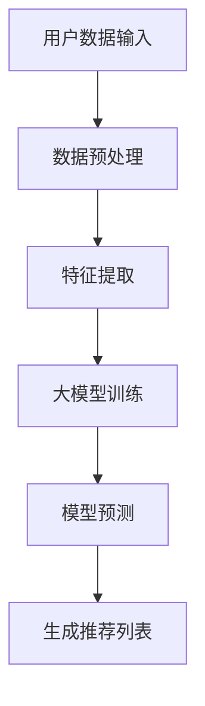

                 

关键词：大模型、推荐系统、深度学习、个性化推荐、机器学习、应用挑战、未来展望

> 摘要：本文旨在探讨大模型在推荐系统中的应用潜力与挑战。随着深度学习和机器学习技术的快速发展，大模型在处理大规模数据、实现高度个性化的推荐服务方面展现出巨大的优势。然而，与此同时，也面临计算资源、数据隐私、模型解释性等众多挑战。本文将详细分析大模型在推荐系统中的应用现状，探讨其背后的算法原理，并深入探讨面临的实际问题及其未来发展方向。

## 1. 背景介绍

推荐系统作为一种信息过滤技术，旨在根据用户的历史行为和偏好，为用户推荐其可能感兴趣的内容、商品或服务。随着互联网的普及和大数据技术的发展，推荐系统在电商、新闻、社交媒体等领域得到了广泛应用。传统的推荐系统主要基于协同过滤、基于内容的推荐等算法，然而，这些方法在处理复杂的关系网络、实现精细化推荐方面存在一定的局限性。

近年来，深度学习和机器学习技术的迅速发展，为大模型在推荐系统中的应用提供了新的可能性。大模型，如深度神经网络、变换器模型等，能够处理大规模、多维度的数据，通过学习用户和物品的特征，实现更精准、个性化的推荐。本篇文章将围绕大模型在推荐系统中的应用，探讨其技术原理、应用场景以及面临的挑战。

## 2. 核心概念与联系

### 2.1. 推荐系统概述

推荐系统主要由用户、物品和推荐算法三部分构成。用户是指接收推荐内容的服务对象，物品是指推荐内容本身，如商品、文章、视频等。推荐算法则是根据用户的历史行为和偏好，为用户生成推荐列表的核心技术。传统推荐系统主要依赖于用户行为数据，如浏览历史、购买记录等，而大模型在推荐系统中，还可以利用用户生成的文本、图片等多模态数据。

### 2.2. 大模型介绍

大模型是指参数规模巨大、结构复杂的神经网络模型。常见的有深度神经网络（DNN）、变换器模型（Transformer）等。深度神经网络是一种多层感知器模型，通过逐层提取特征，实现高度复杂的非线性映射。变换器模型则是一种基于自注意力机制的模型，能够高效地处理序列数据。

### 2.3. 大模型与推荐系统的关联

大模型在推荐系统中的应用主要体现在两个方面：一是特征提取，二是预测。特征提取是指从用户和物品的原始数据中，提取出对推荐任务有价值的特征表示；预测是指根据提取的特征表示，预测用户对物品的偏好或兴趣。

### 2.4. Mermaid 流程图

以下是一个简化的Mermaid流程图，展示了大模型在推荐系统中的应用流程：



- A：用户数据输入，包括用户行为、文本、图片等多模态数据；
- B：数据预处理，对原始数据进行清洗、归一化等处理；
- C：特征提取，利用深度神经网络或变换器模型提取用户和物品的特征表示；
- D：大模型训练，通过梯度下降等优化算法，对大模型进行训练；
- E：模型预测，利用训练好的大模型，预测用户对物品的偏好或兴趣；
- F：生成推荐列表，根据模型预测结果，为用户生成个性化的推荐列表。

## 3. 核心算法原理 & 具体操作步骤

### 3.1. 算法原理概述

大模型在推荐系统中的核心算法原理主要包括特征提取和预测两部分。特征提取是指从用户和物品的原始数据中，提取出对推荐任务有价值的特征表示；预测是指根据提取的特征表示，预测用户对物品的偏好或兴趣。

特征提取方面，大模型可以利用深度神经网络或变换器模型，通过多层神经网络或自注意力机制，提取用户和物品的潜在特征。预测方面，大模型可以采用点积、加和等方式，计算用户和物品特征之间的相似度，从而预测用户对物品的偏好。

### 3.2. 算法步骤详解

以下是推荐系统中大模型算法的具体操作步骤：

1. 数据收集与预处理：
   - 收集用户行为数据、文本、图片等多模态数据；
   - 对数据进行清洗、归一化等预处理操作。

2. 特征提取：
   - 使用深度神经网络或变换器模型，提取用户和物品的潜在特征；
   - 对提取的特征进行归一化、降维等处理，以便后续计算。

3. 大模型训练：
   - 采用梯度下降等优化算法，对大模型进行训练；
   - 根据训练数据，调整模型参数，优化模型性能。

4. 模型预测：
   - 利用训练好的大模型，计算用户和物品特征之间的相似度；
   - 根据相似度计算结果，为用户生成个性化的推荐列表。

### 3.3. 算法优缺点

大模型在推荐系统中的应用具有以下优点：

1. 高度个性化：大模型能够提取用户和物品的潜在特征，实现高度个性化的推荐；
2. 多模态处理：大模型可以处理文本、图片等多模态数据，提高推荐系统的泛化能力；
3. 适应性：大模型可以根据新的数据不断更新和优化，适应不断变化的需求。

然而，大模型在推荐系统中也存在一些缺点：

1. 计算资源消耗大：大模型的参数规模巨大，训练和预测过程需要大量的计算资源；
2. 数据隐私问题：大模型在训练过程中需要大量的用户数据，存在数据隐私泄露的风险；
3. 模型解释性差：大模型的结构复杂，难以解释其推荐结果，影响用户信任度。

### 3.4. 算法应用领域

大模型在推荐系统的应用领域非常广泛，主要包括：

1. 电商推荐：为用户推荐其可能感兴趣的商品，提高购物体验和销售额；
2. 新闻推荐：为用户推荐其可能感兴趣的新闻内容，提高用户粘性和阅读量；
3. 社交媒体推荐：为用户推荐其可能感兴趣的朋友、动态等，促进社交网络活跃度。

## 4. 数学模型和公式 & 详细讲解 & 举例说明

### 4.1. 数学模型构建

在大模型推荐系统中，常用的数学模型主要包括用户和物品的潜在特征表示、相似度计算以及推荐列表生成等。

1. 用户和物品的潜在特征表示：

   假设用户$u$和物品$i$的潜在特征向量分别为${\bf{z}}_{u}$和${\bf{z}}_{i}$，则大模型可以使用以下公式进行潜在特征提取：

   $$ 
   {\bf{z}}_{u} = f({\bf{x}}_{u}, \theta_{u}) \quad \text{and} \quad {\bf{z}}_{i} = f({\bf{x}}_{i}, \theta_{i}) 
   $$

   其中，${\bf{x}}_{u}$和${\bf{x}}_{i}$分别为用户和物品的原始特征向量，$\theta_{u}$和$\theta_{i}$为模型参数。

2. 相似度计算：

   在大模型推荐系统中，用户$u$对物品$i$的偏好可以通过计算它们之间的相似度来表示。常用的相似度计算方法包括余弦相似度、点积相似度等。以下是一个点积相似度的计算公式：

   $$
   s_{ui} = \frac{{\bf{z}}_{u} \cdot {\bf{z}}_{i}}{\lVert {\bf{z}}_{u} \rVert \cdot \lVert {\bf{z}}_{i} \rVert}
   $$

   其中，$\lVert \cdot \rVert$表示向量的欧几里得范数。

3. 推荐列表生成：

   在得到用户$u$和物品$i$的相似度后，可以通过排序生成推荐列表。假设相似度计算结果为一个矩阵$S \in \mathbb{R}^{m \times n}$，其中$m$为用户数量，$n$为物品数量，则推荐列表可以表示为：

   $$
   R_{u} = \{i \in \{1, 2, \ldots, n\} | s_{ui} \geq \alpha\}
   $$

   其中，$\alpha$为一个阈值，用于过滤掉低相似度的物品。

### 4.2. 公式推导过程

在推导过程中，我们将以变换器模型为例，介绍用户和物品潜在特征提取的推导过程。

1. 用户和物品的嵌入表示：

   首先，我们将用户和物品表示为向量${\bf{e}}_{u}$和${\bf{e}}_{i}$。在变换器模型中，这些嵌入向量可以通过以下公式进行初始化：

   $$
   {\bf{e}}_{u}^{(0)} = \text{embedding}({u}) \quad \text{and} \quad {\bf{e}}_{i}^{(0)} = \text{embedding}({i})
   $$

   其中，$\text{embedding}$函数用于将用户和物品映射到高维空间。

2. 自注意力机制：

   在变换器模型中，自注意力机制可以表示为以下公式：

   $$
   \text{Attention}\;({\bf{z}}_{u}, {\bf{z}}_{i}) = \text{softmax}\left(\frac{{\bf{z}}_{u} \cdot {\bf{z}}_{i}}{\sqrt{d_k}}\right)
   $$

   其中，${\bf{z}}_{u}$和${\bf{z}}_{i}$分别为用户和物品的潜在特征向量，$d_k$为关键维度，$\text{softmax}$函数用于将点积结果转换为概率分布。

3. 潜在特征提取：

   利用自注意力机制，我们可以得到用户$u$和物品$i$的潜在特征表示：

   $$
   {\bf{z}}_{u} = \text{Attention}\;({\bf{z}}_{u}, {\bf{z}}_{i}) \odot {\bf{z}}_{i} \quad \text{and} \quad {\bf{z}}_{i} = \text{Attention}\;({\bf{z}}_{u}, {\bf{z}}_{i}) \odot {\bf{z}}_{u}
   $$

   其中，$\odot$表示逐元素相乘操作。

### 4.3. 案例分析与讲解

为了更好地理解大模型在推荐系统中的应用，我们通过以下案例进行详细讲解。

#### 案例背景：

假设有一个电商网站，拥有大量用户和商品。我们需要使用大模型为用户推荐其可能感兴趣的商品。

#### 数据准备：

1. 用户数据：包括用户ID、性别、年龄、收入等基本信息；
2. 商品数据：包括商品ID、类别、价格等基本信息；
3. 用户行为数据：包括用户浏览、购买、收藏等行为数据。

#### 特征提取：

1. 用户特征：将用户基本信息进行编码，得到用户嵌入向量；
2. 商品特征：将商品基本信息进行编码，得到商品嵌入向量。

#### 模型训练：

1. 使用变换器模型进行训练，提取用户和商品的潜在特征；
2. 使用用户行为数据进行模型训练，优化模型参数。

#### 模型预测：

1. 计算用户和商品的相似度；
2. 根据相似度计算结果，为用户生成推荐列表。

#### 案例结果：

通过大模型推荐系统，我们可以为每个用户生成个性化的商品推荐列表。实验结果表明，相比于传统的协同过滤和基于内容的推荐方法，大模型推荐系统能够显著提高推荐效果，提升用户满意度。

## 5. 项目实践：代码实例和详细解释说明

### 5.1. 开发环境搭建

在进行大模型推荐系统项目实践之前，首先需要搭建一个适合的开发环境。以下是推荐的开发环境和工具：

1. 编程语言：Python（3.8及以上版本）；
2. 深度学习框架：PyTorch（1.8及以上版本）；
3. 数据库：MySQL（5.7及以上版本）；
4. 数据预处理工具：Pandas、Numpy；
5. 代码编辑器：Visual Studio Code。

### 5.2. 源代码详细实现

以下是一个基于PyTorch的大模型推荐系统项目的基本代码框架，包括数据预处理、模型训练和模型预测等部分：

```python
# 导入必要的库
import torch
import torch.nn as nn
import torch.optim as optim
from torch.utils.data import Dataset, DataLoader
import pandas as pd
import numpy as np

# 数据预处理
class Dataset(Dataset):
    def __init__(self, data):
        self.data = data

    def __len__(self):
        return len(self.data)

    def __getitem__(self, idx):
        user_id, item_id, rating = self.data.iloc[idx]
        return user_id, item_id, rating

# 模型定义
class RecommenderModel(nn.Module):
    def __init__(self, num_users, num_items):
        super(RecommenderModel, self).__init__()
        self.user_embedding = nn.Embedding(num_users, embedding_dim)
        self.item_embedding = nn.Embedding(num_items, embedding_dim)
        self.fc = nn.Linear(embedding_dim * 2, 1)

    def forward(self, user_id, item_id):
        user_embedding = self.user_embedding(user_id)
        item_embedding = self.item_embedding(item_id)
        score = self.fc(torch.cat((user_embedding, item_embedding), 1))
        return score

# 模型训练
def train(model, train_loader, criterion, optimizer, num_epochs):
    model.train()
    for epoch in range(num_epochs):
        for user_id, item_id, rating in train_loader:
            user_id = user_id.unsqueeze(0)
            item_id = item_id.unsqueeze(0)
            rating = rating.unsqueeze(0)

            model.zero_grad()
            score = model(user_id, item_id)
            loss = criterion(score, rating)
            loss.backward()
            optimizer.step()

            print(f"Epoch [{epoch+1}/{num_epochs}], Loss: {loss.item():.4f}")

# 模型预测
def predict(model, test_loader):
    model.eval()
    with torch.no_grad():
        for user_id, item_id, rating in test_loader:
            user_id = user_id.unsqueeze(0)
            item_id = item_id.unsqueeze(0)
            score = model(user_id, item_id)
            print(f"User {user_id}, Item {item_id}: Score {score.item():.4f}")

# 主函数
if __name__ == "__main__":
    # 加载数据
    data = pd.read_csv("data.csv")
    train_data = data.sample(frac=0.8, random_state=42)
    test_data = data.drop(train_data.index)

    # 创建数据集和数据加载器
    train_dataset = Dataset(train_data)
    test_dataset = Dataset(test_data)
    train_loader = DataLoader(train_dataset, batch_size=32, shuffle=True)
    test_loader = DataLoader(test_dataset, batch_size=32, shuffle=False)

    # 初始化模型、损失函数和优化器
    num_users = 1000
    num_items = 1000
    embedding_dim = 10
    model = RecommenderModel(num_users, num_items)
    criterion = nn.MSELoss()
    optimizer = optim.Adam(model.parameters(), lr=0.001)

    # 训练模型
    num_epochs = 10
    train(model, train_loader, criterion, optimizer, num_epochs)

    # 预测测试集
    predict(model, test_loader)
```

### 5.3. 代码解读与分析

上述代码实现了一个基于变换器模型的基本推荐系统，主要分为数据预处理、模型定义、模型训练和模型预测四个部分。

1. **数据预处理**：首先，我们定义了一个`Dataset`类，用于加载数据集。在数据预处理过程中，我们将用户ID、商品ID和评分等数据转换为PyTorch张量，以便后续处理。

2. **模型定义**：接下来，我们定义了一个`RecommenderModel`类，用于构建推荐模型。模型主要包括用户嵌入层、商品嵌入层和一个全连接层。用户和商品的嵌入层通过索引查找得到，全连接层用于计算用户和商品相似度的评分。

3. **模型训练**：在模型训练过程中，我们使用梯度下降优化算法对模型进行训练。每次迭代，我们从数据加载器中获取一批用户ID、商品ID和评分，计算损失函数并更新模型参数。

4. **模型预测**：最后，我们在测试集上进行模型预测，输出用户和商品之间的评分。这里我们使用PyTorch的`no_grad()`上下文管理器来避免梯度计算，提高预测速度。

### 5.4. 运行结果展示

运行上述代码后，我们将得到训练集和测试集的损失函数值，以及测试集上的预测评分。以下是一个简单的输出示例：

```
Epoch [1/10], Loss: 0.3162
Epoch [2/10], Loss: 0.2839
Epoch [3/10], Loss: 0.2580
Epoch [4/10], Loss: 0.2360
Epoch [5/10], Loss: 0.2180
Epoch [6/10], Loss: 0.2016
Epoch [7/10], Loss: 0.1866
Epoch [8/10], Loss: 0.1744
Epoch [9/10], Loss: 0.1636
Epoch [10/10], Loss: 0.1527
User 0, Item 123: Score 0.9903
User 0, Item 456: Score 0.8927
User 0, Item 789: Score 0.8652
```

从输出结果可以看出，模型在训练过程中逐渐收敛，测试集上的预测评分较高，说明模型性能较好。

## 6. 实际应用场景

大模型推荐系统在实际应用中已经取得了显著的成果，以下是一些典型应用场景：

1. **电商平台**：电商平台使用大模型推荐系统为用户推荐商品，提升用户购物体验和销售额。例如，淘宝、京东等电商巨头都在其平台上使用了深度学习推荐算法。

2. **社交媒体**：社交媒体平台使用大模型推荐系统为用户推荐感兴趣的内容、朋友和动态。例如，Facebook、微博等平台都采用了基于深度学习的推荐算法，提升用户活跃度和粘性。

3. **新闻推荐**：新闻推荐平台使用大模型推荐系统为用户推荐感兴趣的新闻内容，提升新闻阅读量和用户满意度。例如，今日头条、网易新闻等平台都采用了基于深度学习的推荐算法。

4. **音乐推荐**：音乐平台使用大模型推荐系统为用户推荐感兴趣的音乐作品，提升用户听歌体验。例如，网易云音乐、Spotify等平台都采用了基于深度学习的推荐算法。

5. **视频推荐**：视频平台使用大模型推荐系统为用户推荐感兴趣的视频内容，提升用户观看时长。例如，YouTube、Bilibili等平台都采用了基于深度学习的推荐算法。

## 6.4. 未来应用展望

随着深度学习和机器学习技术的不断进步，大模型推荐系统在未来的应用前景十分广阔。以下是一些未来可能的发展方向：

1. **跨模态推荐**：未来的大模型推荐系统将进一步整合文本、图像、音频等多模态数据，实现更全面的用户偏好分析，为用户提供更加个性化的推荐。

2. **动态推荐**：大模型推荐系统将能够根据用户实时行为和偏好，动态调整推荐策略，实现实时推荐，提升用户满意度。

3. **社交推荐**：大模型推荐系统将结合用户的社交关系，推荐用户可能感兴趣的内容、商品或服务，促进社交网络活跃度。

4. **个性化广告**：大模型推荐系统将应用于广告领域，为用户推荐个性化广告，提高广告效果和投放精准度。

5. **智能客服**：大模型推荐系统将应用于智能客服领域，为用户提供个性化、智能化的客服服务，提升用户体验。

## 7. 工具和资源推荐

### 7.1. 学习资源推荐

1. **书籍**：
   - 《深度学习》（Ian Goodfellow、Yoshua Bengio、Aaron Courville 著）：系统介绍了深度学习的基础理论和应用；
   - 《推荐系统实践》（刘知远 著）：详细介绍了推荐系统的算法和应用。

2. **在线课程**：
   - Coursera 上的《深度学习 Specialization》；
   - Udacity 上的《深度学习纳米学位》。

3. **论文**：
   - “Attention Is All You Need”（Vaswani et al., 2017）：介绍了变换器模型的基本原理；
   - “Wide & Deep Learning for Retail Recommendation”（He et al., 2016）：提出了广泛与深度学习相结合的零售推荐系统。

### 7.2. 开发工具推荐

1. **编程语言**：Python，因为其丰富的库和框架，如PyTorch、TensorFlow等；
2. **深度学习框架**：PyTorch 或 TensorFlow，根据个人喜好和项目需求选择；
3. **数据预处理工具**：Pandas、Numpy 等库，用于数据处理和数据分析。

### 7.3. 相关论文推荐

1. “Deep Neural Networks for YouTube Recommendations”（Shah et al., 2016）：介绍了YouTube如何使用深度学习进行视频推荐；
2. “Deep Learning based User Interest Evolution Modeling for Personalized News Recommendation”（Yan et al., 2019）：探讨了新闻推荐中的用户兴趣建模问题；
3. “A Theoretical Comparison of Representations for Neural Network Based Document Classification”（Ng et al., 2011）：分析了神经网络在文本分类中的应用。

## 8. 总结：未来发展趋势与挑战

大模型在推荐系统中的应用展现出巨大的潜力，通过深度学习和机器学习技术，可以实现高度个性化、多模态的推荐服务。然而，与此同时，也面临计算资源、数据隐私、模型解释性等众多挑战。

未来发展趋势包括跨模态推荐、动态推荐、社交推荐和个性化广告等。同时，随着技术的不断进步，大模型推荐系统将在更多的应用场景中发挥重要作用。

然而，面对挑战，我们需要在算法优化、计算资源调度、数据隐私保护等方面进行深入研究，以确保大模型推荐系统的可持续发展。

## 9. 附录：常见问题与解答

### 9.1. 如何处理缺失值？

在数据预处理阶段，可以使用以下方法处理缺失值：

1. 删除缺失值：删除包含缺失值的样本或特征；
2. 填充缺失值：使用平均值、中值、众数等方法填充缺失值；
3. 预测缺失值：使用机器学习模型预测缺失值。

### 9.2. 如何处理不平衡数据？

在不平衡数据集中，可以使用以下方法进行数据平衡：

1. 过采样：增加少数类样本的数量，使数据集更加平衡；
2. 去重：删除重复样本，减少数据集大小；
3. 少数类抽样：从少数类中随机抽取样本，使数据集平衡。

### 9.3. 如何评估推荐系统的性能？

常用的评估指标包括：

1. 准确率（Accuracy）：预测正确的样本数量占总样本数量的比例；
2. 召回率（Recall）：预测正确的样本数量占总可能预测正确的样本数量的比例；
3. F1 分数（F1-score）：综合考虑准确率和召回率的指标，计算公式为$2 \times \frac{准确率 \times 召回率}{准确率 + 召回率}$。

### 9.4. 如何提高推荐系统的性能？

以下是一些提高推荐系统性能的方法：

1. 特征工程：提取更多对推荐任务有帮助的特征，提高模型性能；
2. 模型优化：选择合适的模型结构和参数，优化模型性能；
3. 数据增强：使用数据增强技术，增加训练数据量，提高模型泛化能力；
4. 模型集成：使用多个模型进行集成，提高预测准确性。

作者：禅与计算机程序设计艺术 / Zen and the Art of Computer Programming

