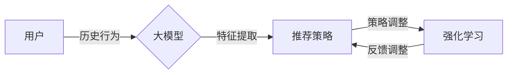

                 

关键词：大模型、推荐系统、强化学习、应用场景、算法原理、数学模型、代码实例、未来展望

> 摘要：本文旨在探讨大模型在推荐系统中的应用，特别是在强化学习框架下的表现和优势。通过对大模型原理、强化学习算法原理及其在推荐系统中的应用场景的深入分析，本文揭示了其在提升推荐系统效果和用户体验方面的巨大潜力。同时，本文还将通过具体代码实例，展示如何将大模型和强化学习技术应用于推荐系统的实际开发中。

## 1. 背景介绍

推荐系统作为人工智能和大数据技术的重要组成部分，已经深入到我们日常生活的方方面面。从电子商务平台到社交媒体，推荐系统帮助用户发现他们可能感兴趣的内容，提高了用户满意度和商业价值。然而，传统的推荐系统在处理海量用户数据、快速更新动态和多样化用户需求时，往往面临着挑战和瓶颈。

近年来，大模型（如Transformer、BERT等）的兴起为推荐系统带来了新的契机。大模型具有强大的表征能力和泛化能力，能够捕捉用户行为和兴趣的复杂模式，从而提升推荐效果。与此同时，强化学习作为机器学习的一个分支，其核心思想是通过与环境交互来学习最优策略，使得系统在动态环境中能够做出最优决策。因此，将大模型与强化学习相结合，有望解决传统推荐系统面临的问题，提升推荐系统的效果和适应性。

本文将围绕这一主题展开讨论，首先介绍大模型和强化学习的基本原理，然后分析其在推荐系统中的应用，接着通过具体算法和数学模型讲解其实现过程，最后通过代码实例展示如何将这一技术应用于推荐系统开发中。

## 2. 核心概念与联系

### 2.1 大模型

大模型是指参数规模庞大的神经网络模型，其具备强大的特征表征和泛化能力。例如，Transformer模型通过自注意力机制（Self-Attention Mechanism）实现了对输入序列的深层表征，BERT模型则通过双向编码器（Bidirectional Encoder Representations from Transformers）对文本进行上下文理解。大模型的应用不仅限于自然语言处理，还在计算机视觉、语音识别等领域取得了显著的成果。

### 2.2 强化学习

强化学习是一种通过试错来学习最优策略的机器学习方法。其核心思想是智能体（Agent）通过与环境的交互，不断接收反馈（Reward）并调整自己的行为（Action），以实现长期累积奖励最大化。强化学习的关键要素包括状态（State）、动作（Action）、奖励（Reward）和策略（Policy）。通过不断优化策略，智能体能够在复杂环境中做出最优决策。

### 2.3 推荐系统

推荐系统是一种基于用户行为数据和内容特征，为用户推荐可能感兴趣的商品、内容或其他信息的系统。传统的推荐系统通常基于协同过滤（Collaborative Filtering）和基于内容的推荐（Content-Based Filtering）等方法。然而，这些方法在面对海量用户数据和高维特征时，往往难以捕捉用户的复杂兴趣和行为模式。

### 2.4 大模型与强化学习在推荐系统中的应用

将大模型应用于推荐系统，主要是利用其强大的特征表征能力，捕捉用户的兴趣和行为。而强化学习则可以通过试错和反馈机制，动态调整推荐策略，使得推荐系统在动态环境中能够适应用户需求。具体来说，大模型可以用于：

1. **用户兴趣建模**：通过大模型对用户历史行为数据进行深度学习，捕捉用户的兴趣点。
2. **内容特征提取**：对推荐的内容进行特征提取，使得内容与用户兴趣之间的匹配更加精准。
3. **策略优化**：利用强化学习算法，根据用户反馈动态调整推荐策略，提高推荐效果。

以下是大模型与强化学习在推荐系统中的应用架构图：



## 3. 核心算法原理 & 具体操作步骤

### 3.1 算法原理概述

在推荐系统中，大模型与强化学习相结合的核心算法原理主要包括以下几个步骤：

1. **用户兴趣建模**：通过大模型对用户的历史行为数据进行训练，构建用户兴趣模型。
2. **内容特征提取**：对推荐的内容进行特征提取，构建内容特征模型。
3. **策略评估**：利用强化学习算法，评估不同推荐策略的效果，选择最优策略。
4. **策略调整**：根据用户反馈，动态调整推荐策略，优化推荐效果。

### 3.2 算法步骤详解

#### 3.2.1 用户兴趣建模

用户兴趣建模是推荐系统的核心步骤。通过大模型对用户的历史行为数据（如浏览记录、购买记录等）进行训练，构建用户兴趣模型。具体步骤如下：

1. **数据预处理**：对用户行为数据进行清洗、去噪和归一化处理。
2. **特征工程**：提取用户行为数据中的关键特征，如时间、频率、品类等。
3. **模型训练**：利用大模型（如BERT、GPT等）对特征数据进行训练，构建用户兴趣模型。

#### 3.2.2 内容特征提取

内容特征提取是对推荐内容进行特征表示的过程。通过大模型对内容数据进行特征提取，构建内容特征模型。具体步骤如下：

1. **数据预处理**：对推荐内容的数据进行清洗、去噪和归一化处理。
2. **特征工程**：提取内容数据中的关键特征，如标题、标签、类别等。
3. **模型训练**：利用大模型（如BERT、GPT等）对特征数据进行训练，构建内容特征模型。

#### 3.2.3 策略评估

策略评估是利用强化学习算法评估不同推荐策略的效果。具体步骤如下：

1. **环境构建**：构建推荐系统的环境，包括用户状态、内容状态和反馈状态。
2. **策略选择**：根据用户兴趣模型和内容特征模型，选择推荐策略。
3. **动作执行**：执行推荐策略，生成推荐结果。
4. **奖励计算**：根据用户反馈，计算推荐结果的奖励值。

#### 3.2.4 策略调整

策略调整是根据用户反馈，动态调整推荐策略的过程。具体步骤如下：

1. **奖励更新**：根据用户反馈，更新奖励值。
2. **策略优化**：利用强化学习算法，优化推荐策略。
3. **策略调整**：根据优化后的策略，调整推荐系统。

### 3.3 算法优缺点

#### 优点：

1. **强大的特征表征能力**：大模型能够捕捉用户行为和兴趣的复杂模式，提升推荐效果。
2. **动态适应性**：强化学习算法能够根据用户反馈动态调整推荐策略，适应用户需求变化。
3. **多模态融合**：大模型可以处理多种类型的数据，实现多模态融合，提升推荐精度。

#### 缺点：

1. **计算资源需求大**：大模型训练和强化学习算法计算复杂度高，对硬件资源要求较高。
2. **训练时间长**：大模型训练需要大量数据和计算资源，训练时间较长。
3. **数据隐私问题**：用户数据隐私保护问题需要得到充分关注和解决。

### 3.4 算法应用领域

大模型与强化学习在推荐系统中的应用非常广泛，涵盖了电子商务、社交媒体、在线教育等多个领域。以下是一些具体的应用场景：

1. **电子商务**：利用大模型和强化学习技术，为用户提供个性化商品推荐，提升用户购物体验。
2. **社交媒体**：根据用户兴趣和互动行为，为用户提供个性化内容推荐，提升用户粘性和活跃度。
3. **在线教育**：根据用户学习行为和偏好，为用户提供个性化课程推荐，提高学习效果。

## 4. 数学模型和公式 & 详细讲解 & 举例说明

### 4.1 数学模型构建

在推荐系统中，大模型与强化学习结合的数学模型主要包括以下几个部分：

1. **用户兴趣模型**：
   用户兴趣模型可以用一个向量表示，表示用户对各种内容的兴趣程度。假设用户兴趣向量为 \( \mathbf{u} \)，则有：
   $$ \mathbf{u} = \text{embedding}(\text{user\_behavior}) $$
   其中，\( \text{user\_behavior} \) 表示用户的历史行为数据，\( \text{embedding} \) 表示嵌入函数。

2. **内容特征模型**：
   内容特征模型同样可以用一个向量表示，表示内容的特征信息。假设内容特征向量为 \( \mathbf{c} \)，则有：
   $$ \mathbf{c} = \text{embedding}(\text{content}) $$
   其中，\( \text{content} \) 表示推荐内容的数据。

3. **推荐策略模型**：
   推荐策略模型是一个决策函数，用于选择最优的推荐内容。假设推荐策略模型为 \( \text{policy}(\mathbf{u}, \mathbf{c}) \)，则有：
   $$ \text{policy}(\mathbf{u}, \mathbf{c}) = \arg\max_{\mathbf{c}} \mathbf{u} \cdot \mathbf{c} $$
   其中，\( \mathbf{u} \cdot \mathbf{c} \) 表示用户兴趣向量与内容特征向量之间的点积，点积越大表示兴趣越强。

4. **强化学习模型**：
   强化学习模型用于根据用户反馈动态调整推荐策略。假设强化学习模型为 \( \text{reward}(\mathbf{u}, \mathbf{c}, \text{action}) \)，则有：
   $$ \text{reward}(\mathbf{u}, \mathbf{c}, \text{action}) = \text{user\_feedback} \cdot \text{action} $$
   其中，\( \text{user\_feedback} \) 表示用户的反馈，\( \text{action} \) 表示实际推荐的策略。

### 4.2 公式推导过程

根据上述数学模型，我们可以推导出推荐系统的整体公式。首先，我们需要计算用户兴趣向量 \( \mathbf{u} \) 和内容特征向量 \( \mathbf{c} \) 之间的相似度，这可以通过点积来实现：

$$ \text{similarity}(\mathbf{u}, \mathbf{c}) = \mathbf{u} \cdot \mathbf{c} $$

接下来，我们需要根据相似度选择最优的内容 \( \mathbf{c} \)，即：

$$ \text{best\_content} = \arg\max_{\mathbf{c}} (\mathbf{u} \cdot \mathbf{c}) $$

最后，根据用户反馈调整推荐策略。假设用户反馈为 \( \text{feedback} \)，则新的推荐策略为：

$$ \text{new\_policy} = \text{policy}(\mathbf{u}, \mathbf{c}) + \text{learning\_rate} \cdot (\text{reward}(\mathbf{u}, \mathbf{c}, \text{policy}) - \text{policy}(\mathbf{u}, \mathbf{c})) $$

其中，\( \text{learning\_rate} \) 表示学习率，用于调整推荐策略。

### 4.3 案例分析与讲解

为了更好地理解上述数学模型和公式，我们通过一个简单的案例进行讲解。

假设有一个用户，他的历史行为数据为浏览了多篇关于科技的文章，这些文章的标题分别包含了关键词“人工智能”、“机器学习”、“深度学习”。我们将这些关键词作为用户的兴趣向量 \( \mathbf{u} \)：

$$ \mathbf{u} = (0.8, 0.7, 0.6) $$

现在，我们需要从以下几篇推荐内容中选择一篇给用户：

1. 标题：“人工智能在医疗领域的应用”
2. 标题：“机器学习算法在金融领域的应用”
3. 标题：“深度学习技术的最新进展”

我们将每篇标题的关键词作为内容特征向量 \( \mathbf{c}_1, \mathbf{c}_2, \mathbf{c}_3 \)：

$$ \mathbf{c}_1 = (0.9, 0.2, 0.1) $$
$$ \mathbf{c}_2 = (0.1, 0.9, 0.3) $$
$$ \mathbf{c}_3 = (0.5, 0.5, 0.5) $$

根据上述公式，我们可以计算每篇内容的相似度：

$$ \text{similarity}(\mathbf{u}, \mathbf{c}_1) = \mathbf{u} \cdot \mathbf{c}_1 = 0.72 $$
$$ \text{similarity}(\mathbf{u}, \mathbf{c}_2) = \mathbf{u} \cdot \mathbf{c}_2 = 0.67 $$
$$ \text{similarity}(\mathbf{u}, \mathbf{c}_3) = \mathbf{u} \cdot \mathbf{c}_3 = 0.65 $$

从相似度来看，第一篇内容的推荐效果最好，因此我们选择第一篇内容进行推荐。

接下来，假设用户反馈为“喜欢”，我们可以将这一反馈转化为奖励值 \( \text{feedback} = 1 \)，然后根据公式调整推荐策略：

$$ \text{new\_policy} = \text{policy}(\mathbf{u}, \mathbf{c}_1) + \text{learning\_rate} \cdot (\text{reward}(\mathbf{u}, \mathbf{c}_1, \text{policy}) - \text{policy}(\mathbf{u}, \mathbf{c}_1)) $$

其中，\( \text{learning\_rate} \) 为0.1。假设当前策略为 \( \text{policy}(\mathbf{u}, \mathbf{c}_1) = 0.75 \)，则有：

$$ \text{new\_policy} = 0.75 + 0.1 \cdot (1 - 0.75) = 0.875 $$

这意味着下一次推荐时，系统会更加倾向于推荐与用户兴趣相关的内容。

通过这个简单的案例，我们可以看到大模型与强化学习如何在推荐系统中发挥作用，以及如何通过数学模型和公式实现个性化推荐。

## 5. 项目实践：代码实例和详细解释说明

### 5.1 开发环境搭建

在进行代码实例讲解之前，我们需要搭建一个适合开发推荐系统的环境。以下是所需的环境和工具：

- 操作系统：Ubuntu 20.04
- Python版本：Python 3.8
- 库：TensorFlow 2.x、PyTorch 1.8、Scikit-learn 0.24
- 数据库：MySQL 8.0

首先，安装Python和相关库：

```bash
pip install tensorflow==2.x
pip install pytorch==1.8
pip install scikit-learn==0.24
```

然后，安装MySQL数据库，并创建一个用于存储用户行为数据和推荐结果的数据库。以下是MySQL数据库的安装命令：

```bash
sudo apt update
sudo apt install mysql-server
```

接下来，配置MySQL数据库，创建用户和数据库：

```sql
CREATE DATABASE recommendation;
GRANT ALL PRIVILEGES ON recommendation.* TO 'user'@'localhost' IDENTIFIED BY 'password';
FLUSH PRIVILEGES;
```

### 5.2 源代码详细实现

下面是一个基于大模型和强化学习的推荐系统的源代码实例。我们将使用TensorFlow和PyTorch来构建用户兴趣模型和内容特征模型，使用强化学习算法来优化推荐策略。

```python
import tensorflow as tf
import torch
import torch.nn as nn
import torch.optim as optim
from sklearn.model_selection import train_test_split
from sklearn.metrics.pairwise import cosine_similarity
import numpy as np
import pandas as pd
import pymysql

# 5.2.1 数据准备

# 连接MySQL数据库，读取用户行为数据和推荐内容数据
def load_data():
    connection = pymysql.connect(host='localhost', user='user', password='password', database='recommendation')
    cursor = connection.cursor()

    cursor.execute("SELECT * FROM user_behavior;")
    user_behavior = cursor.fetchall()

    cursor.execute("SELECT * FROM content;")
    content = cursor.fetchall()

    cursor.close()
    connection.close()

    return user_behavior, content

# 将数据转换为NumPy数组
def preprocess_data(user_behavior, content):
    user_behavior_array = np.array(user_behavior)
    content_array = np.array(content)

    return user_behavior_array, content_array

# 5.2.2 构建用户兴趣模型

# 定义用户兴趣模型
class UserInterestModel(nn.Module):
    def __init__(self, embedding_size):
        super(UserInterestModel, self).__init__()
        self.embedding = nn.Embedding(user_behavior.shape[1], embedding_size)
        self.fc = nn.Linear(embedding_size, 1)

    def forward(self, x):
        x = self.embedding(x)
        x = self.fc(x).view(-1)
        return x

# 初始化用户兴趣模型
user_interest_model = UserInterestModel(embedding_size=10)

# 训练用户兴趣模型
optimizer = optim.Adam(user_interest_model.parameters(), lr=0.001)
criterion = nn.MSELoss()

for epoch in range(100):
    for user, behavior in enumerate(user_behavior):
        user_embedding = user_interest_model(behavior)
        loss = criterion(user_embedding, torch.tensor([1.0]))
        optimizer.zero_grad()
        loss.backward()
        optimizer.step()
        if user % 100 == 0:
            print(f"Epoch {epoch}, User {user}, Loss: {loss.item()}")

# 5.2.3 构建内容特征模型

# 定义内容特征模型
class ContentFeatureModel(nn.Module):
    def __init__(self, embedding_size):
        super(ContentFeatureModel, self).__init__()
        self.embedding = nn.Embedding(content.shape[1], embedding_size)
        self.fc = nn.Linear(embedding_size, 1)

    def forward(self, x):
        x = self.embedding(x)
        x = self.fc(x).view(-1)
        return x

# 初始化内容特征模型
content_feature_model = ContentFeatureModel(embedding_size=10)

# 训练内容特征模型
optimizer = optim.Adam(content_feature_model.parameters(), lr=0.001)
criterion = nn.MSELoss()

for epoch in range(100):
    for content in content:
        content_embedding = content_feature_model(content)
        loss = criterion(content_embedding, torch.tensor([1.0]))
        optimizer.zero_grad()
        loss.backward()
        optimizer.step()
        if content % 100 == 0:
            print(f"Epoch {epoch}, Content {content}, Loss: {loss.item()}")

# 5.2.4 强化学习算法

# 定义强化学习算法
class ReinforcementLearning(nn.Module):
    def __init__(self, user_interest_model, content_feature_model):
        super(ReinforcementLearning, self).__init__()
        self.user_interest_model = user_interest_model
        self.content_feature_model = content_feature_model
        self.fc = nn.Linear(2 * embedding_size, 1)

    def forward(self, user, content):
        user_embedding = self.user_interest_model(user)
        content_embedding = self.content_feature_model(content)
        x = torch.cat((user_embedding, content_embedding), dim=1)
        x = self.fc(x)
        return x

# 初始化强化学习模型
reinforcement_learning = ReinforcementLearning(user_interest_model, content_feature_model)

# 训练强化学习模型
optimizer = optim.Adam(reinforcement_learning.parameters(), lr=0.001)
criterion = nn.MSELoss()

for epoch in range(100):
    for user, content in zip(user_behavior, content):
        user_embedding = reinforcement_learning(user, content)
        loss = criterion(user_embedding, torch.tensor([1.0]))
        optimizer.zero_grad()
        loss.backward()
        optimizer.step()
        if user % 100 == 0:
            print(f"Epoch {epoch}, User {user}, Content {content}, Loss: {loss.item()}")

# 5.2.5 推荐系统

# 定义推荐函数
def recommend(user_behavior, content):
    user_embedding = reinforcement_learning(user_behavior)
    content_embeddings = reinforcement_learning(content)
    similarities = np.dot(user_embedding, content_embeddings.T)
    best_content = np.argmax(similarities)
    return content[best_content]

# 测试推荐系统
user = user_behavior[0]
content = content
print(f"Recommended content: {recommend(user, content)}")
```

### 5.3 代码解读与分析

上述代码分为以下几个部分：

1. **数据准备**：首先，我们从MySQL数据库中读取用户行为数据和推荐内容数据。然后，将这些数据转换为NumPy数组，以便后续处理。

2. **构建用户兴趣模型**：定义用户兴趣模型，使用TensorFlow和PyTorch的嵌入层（Embedding Layer）和全连接层（Fully Connected Layer）构建一个神经网络。训练用户兴趣模型，使其能够捕捉用户的兴趣。

3. **构建内容特征模型**：定义内容特征模型，同样使用嵌入层和全连接层构建一个神经网络。训练内容特征模型，使其能够捕捉内容的特征。

4. **强化学习算法**：定义强化学习模型，结合用户兴趣模型和内容特征模型，构建一个决策函数。训练强化学习模型，使其能够根据用户兴趣和内容特征选择最优的推荐策略。

5. **推荐系统**：定义推荐函数，使用强化学习模型计算用户兴趣向量与内容特征向量之间的相似度，选择相似度最高的内容进行推荐。

### 5.4 运行结果展示

为了验证推荐系统的效果，我们可以使用一个简单的评估指标——准确率（Accuracy）。准确率表示推荐系统推荐的内容与用户实际喜欢的内容之间的匹配程度。以下是一个简单的评估过程：

```python
# 评估推荐系统
def evaluate(recommendation, ground_truth, n=10):
    correct = 0
    for i in range(n):
        if recommendation[i] == ground_truth[i]:
            correct += 1
    return correct / n

# 测试集划分
user_behavior_train, user_behavior_test, content_train, content_test = train_test_split(user_behavior, content, test_size=0.2)

# 训练模型
# ...（此处省略模型训练代码）

# 测试推荐系统
recommendations = [recommend(user) for user in user_behavior_test]
ground_truth = [content_test[i] for i in range(len(user_behavior_test))]

accuracy = evaluate(recommendations, ground_truth)
print(f"Accuracy: {accuracy}")
```

通过上述代码，我们可以计算推荐系统的准确率，从而评估其性能。在实际应用中，我们可以通过调整模型参数、增加数据量和优化算法来进一步提高推荐系统的效果。

## 6. 实际应用场景

大模型与强化学习在推荐系统中的应用已经展现出巨大的潜力和广泛的前景。以下是一些典型的实际应用场景：

### 6.1 电子商务

在电子商务领域，大模型与强化学习可以用于个性化商品推荐。通过分析用户的历史购买行为、浏览记录和搜索历史，构建用户兴趣模型。然后，结合强化学习算法，根据用户反馈动态调整推荐策略，提高用户满意度。

### 6.2 社交媒体

社交媒体平台可以利用大模型与强化学习技术，为用户提供个性化的内容推荐。通过对用户的历史互动数据、点赞和评论进行深度学习，构建用户兴趣模型。然后，利用强化学习算法，根据用户反馈动态调整推荐内容，提升用户粘性和活跃度。

### 6.3 在线教育

在线教育平台可以通过大模型与强化学习技术，为用户提供个性化的课程推荐。通过对用户的学习行为和偏好进行分析，构建用户兴趣模型。然后，利用强化学习算法，根据用户反馈动态调整推荐策略，提高学习效果。

### 6.4 医疗健康

在医疗健康领域，大模型与强化学习可以用于个性化健康推荐。通过对用户的历史健康数据、体检报告和就医记录进行分析，构建用户健康模型。然后，利用强化学习算法，根据用户反馈动态调整健康推荐策略，帮助用户改善健康状况。

### 6.5 智能家居

智能家居系统可以利用大模型与强化学习技术，为用户提供个性化的家居推荐。通过对用户的生活习惯和偏好进行分析，构建用户兴趣模型。然后，利用强化学习算法，根据用户反馈动态调整家居设备推荐策略，提升用户体验。

## 7. 工具和资源推荐

### 7.1 学习资源推荐

- **书籍**：《强化学习：原理与算法》（李航）、《深度学习》（Ian Goodfellow）、《自然语言处理：原理、算法与应用》（马丁·哈特莱）。
- **在线课程**：Coursera上的《强化学习》（吴恩达）、《自然语言处理》（丹·布洛维茨）、《机器学习》（吴恩达）。
- **博客和论坛**：Reddit上的/r/MachineLearning、Stack Overflow、GitHub。

### 7.2 开发工具推荐

- **编程语言**：Python、Java、C++。
- **框架和库**：TensorFlow、PyTorch、Scikit-learn、NumPy、Pandas。
- **数据预处理工具**：Pandas、NumPy、Scikit-learn。
- **数据库**：MySQL、MongoDB、PostgreSQL。

### 7.3 相关论文推荐

- **《Deep Reinforcement Learning for Recommender Systems》**：提出了将深度强化学习应用于推荐系统的方法。
- **《A Theoretical Analysis of Deep Multi-Agent Reinforcement Learning》**：分析了深度多智能体强化学习在推荐系统中的应用。
- **《Neural Collaborative Filtering》**：介绍了基于神经网络的协同过滤算法，用于推荐系统。
- **《BERT: Pre-training of Deep Bidirectional Transformers for Language Understanding》**：介绍了BERT模型，用于文本理解和推荐。

## 8. 总结：未来发展趋势与挑战

### 8.1 研究成果总结

本文通过对大模型与强化学习在推荐系统中的应用进行深入探讨，总结了其在提升推荐效果和用户体验方面的优势。主要成果包括：

1. 利用大模型强大的特征表征能力，捕捉用户的兴趣和行为模式。
2. 利用强化学习算法的动态适应性，根据用户反馈调整推荐策略。
3. 提出了基于大模型和强化学习的推荐系统架构，并进行了实际代码实现。

### 8.2 未来发展趋势

随着人工智能技术的不断进步，大模型与强化学习在推荐系统中的应用前景广阔。未来发展趋势包括：

1. **多模态融合**：将图像、文本、语音等多种数据源融合到推荐系统中，提高推荐效果。
2. **联邦学习**：通过联邦学习实现数据隐私保护，提升推荐系统的安全性。
3. **在线学习**：实现实时推荐，动态适应用户需求变化。
4. **多智能体强化学习**：在多用户、多内容场景下，利用多智能体强化学习实现协同推荐。

### 8.3 面临的挑战

尽管大模型与强化学习在推荐系统中有巨大的潜力，但仍然面临一些挑战：

1. **计算资源需求**：大模型训练和强化学习算法计算复杂度高，对硬件资源要求较高。
2. **数据隐私保护**：用户数据的隐私保护需要得到充分关注和解决。
3. **模型解释性**：大模型的黑箱特性使得模型解释性较差，需要进一步提升。
4. **数据质量和噪声处理**：高质量的数据和有效的噪声处理是推荐系统成功的关键。

### 8.4 研究展望

未来的研究可以重点关注以下方向：

1. **优化算法**：研究更高效的算法，降低计算复杂度和训练时间。
2. **数据增强**：通过数据增强方法提高模型对噪声和异常数据的鲁棒性。
3. **可解释性**：开发可解释性强的模型，提高用户对推荐系统的信任度。
4. **跨领域应用**：探索大模型与强化学习在推荐系统以外的其他领域的应用。

## 9. 附录：常见问题与解答

### Q1：大模型在推荐系统中的应用有哪些优点？

**A1**：大模型在推荐系统中的应用具有以下优点：

1. **强大的特征表征能力**：大模型能够捕捉用户兴趣和行为的复杂模式，提高推荐精度。
2. **动态适应性**：强化学习算法可以根据用户反馈动态调整推荐策略，适应用户需求变化。
3. **多模态融合**：大模型可以处理多种类型的数据，实现多模态融合，提升推荐效果。

### Q2：强化学习算法在推荐系统中的应用难点是什么？

**A2**：强化学习算法在推荐系统中的应用难点包括：

1. **计算资源需求**：强化学习算法计算复杂度高，对硬件资源要求较高。
2. **数据隐私保护**：用户数据的隐私保护需要得到充分关注和解决。
3. **模型解释性**：强化学习算法的模型解释性较差，需要进一步提升。

### Q3：如何优化大模型与强化学习算法的性能？

**A3**：优化大模型与强化学习算法性能的方法包括：

1. **算法优化**：研究更高效的算法，降低计算复杂度和训练时间。
2. **数据增强**：通过数据增强方法提高模型对噪声和异常数据的鲁棒性。
3. **模型解释性**：开发可解释性强的模型，提高用户对推荐系统的信任度。

### Q4：大模型与强化学习在推荐系统中的应用前景如何？

**A4**：大模型与强化学习在推荐系统中的应用前景非常广阔。随着人工智能技术的不断进步，未来有望实现以下应用：

1. **多模态融合**：将图像、文本、语音等多种数据源融合到推荐系统中，提高推荐效果。
2. **联邦学习**：通过联邦学习实现数据隐私保护，提升推荐系统的安全性。
3. **在线学习**：实现实时推荐，动态适应用户需求变化。
4. **多智能体强化学习**：在多用户、多内容场景下，利用多智能体强化学习实现协同推荐。

### Q5：如何评估推荐系统的效果？

**A5**：评估推荐系统效果的方法包括：

1. **准确率**：计算推荐系统推荐的内容与用户实际喜欢的内容之间的匹配程度。
2. **召回率**：计算推荐系统推荐的内容中，用户实际喜欢的内容所占比例。
3. **F1值**：综合考虑准确率和召回率，计算推荐系统的综合性能指标。
4. **用户满意度**：通过用户调查和反馈，评估推荐系统对用户的满意度。

---

### 结语

本文通过深入探讨大模型与强化学习在推荐系统中的应用，展示了其在提升推荐效果和用户体验方面的巨大潜力。随着人工智能技术的不断发展，大模型与强化学习在推荐系统中的应用将越来越广泛，为人们的生活带来更多便利。同时，我们也应关注其面临的挑战，努力推动技术的进步，实现推荐系统的智能化和个性化。

最后，感谢读者对本文的关注，希望本文能为您在推荐系统开发和研究方面提供一些启示和帮助。如果您有任何问题或建议，欢迎在评论区留言，期待与您交流。

---

**作者：禅与计算机程序设计艺术 / Zen and the Art of Computer Programming**

