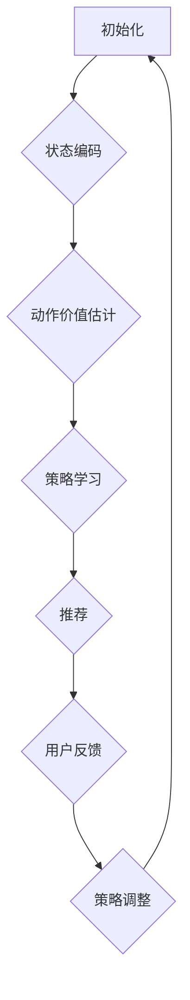

                 

推荐系统是当今互联网领域中至关重要的组成部分，它们用于个性化内容推荐、商品推荐、社交网络信息流等各个方面。然而，随着数据量的爆炸性增长和用户行为的多样化，传统推荐系统面临着越来越多的挑战。强化学习作为一种新的机器学习方法，由于其能够处理动态环境和反馈信号，逐渐成为改善推荐系统性能的潜在技术。本文将探讨大模型在推荐系统中的强化学习应用，旨在为读者提供一种全新的理解和实践方法。

> 关键词：推荐系统，强化学习，大模型，个性化推荐，机器学习

> 摘要：本文首先介绍了推荐系统和强化学习的基本概念，接着阐述了大模型在推荐系统中的重要性，随后详细探讨了强化学习在推荐系统中的应用原理和具体实现步骤。通过数学模型和公式推导，我们深入分析了强化学习的理论基础，并通过实际代码实例，展示了如何将强化学习应用于推荐系统中。最后，本文讨论了强化学习在推荐系统中的实际应用场景，并展望了未来的发展趋势和面临的挑战。

## 1. 背景介绍

### 1.1 推荐系统的发展历程

推荐系统的发展历程可以追溯到20世纪90年代，当时的互联网还处于初级阶段。早期的推荐系统主要依赖于基于内容的过滤和协同过滤方法。基于内容的过滤方法通过分析用户的历史行为和偏好，为用户推荐相似的内容。这种方法在用户行为相对简单和内容标签明确的情况下表现良好，但随着互联网内容的爆炸式增长，这种方法逐渐暴露出其局限性。

协同过滤方法通过分析用户之间的相似性，为用户推荐其他用户喜欢的商品或内容。协同过滤方法可以分为两种：基于用户的协同过滤和基于物品的协同过滤。基于用户的协同过滤方法通过寻找与目标用户相似的活跃用户，推荐这些用户喜欢的商品。基于物品的协同过滤方法则通过分析商品之间的相似性，为用户推荐与其已购买或浏览过的商品相似的物品。这两种方法在实际应用中取得了显著的成果，但它们也存在一些固有的缺陷，例如冷启动问题、数据稀疏性和反馈偏差等。

### 1.2 强化学习的基本概念

强化学习（Reinforcement Learning，RL）是一种通过交互经验进行学习的机器学习方法。它的核心思想是通过奖励机制来引导学习过程，使智能体（Agent）在与环境的互动中不断优化其行为策略。强化学习包含以下几个关键要素：

- **状态（State）**：智能体在环境中的当前位置或当前情况。
- **动作（Action）**：智能体可以采取的行为或决策。
- **奖励（Reward）**：智能体在执行某个动作后从环境中获得的即时奖励或惩罚。
- **策略（Policy）**：智能体在某个状态下采取的动作决策函数。

强化学习的过程可以看作是一个智能体在环境中进行试错学习，通过不断尝试不同的动作，并根据获得的奖励来调整其行为策略。强化学习在游戏、自动驾驶、机器人控制等领域取得了显著的成功，逐渐成为一种重要的机器学习方法。

### 1.3 大模型在推荐系统中的应用

随着互联网和大数据技术的发展，推荐系统面临着越来越大的挑战。传统的推荐系统方法已经难以应对复杂、动态的用户行为和海量数据。因此，大模型（如深度神经网络、变换器等）在推荐系统中的应用逐渐成为热点。

大模型具有以下几个优势：

1. **处理复杂特征**：大模型能够处理复杂的用户行为特征和物品特征，从而提高推荐系统的准确性和个性化程度。
2. **自适应学习**：大模型能够根据用户行为的变化自适应地调整推荐策略，从而更好地适应动态环境。
3. **跨域迁移**：大模型能够通过跨域迁移学习，将一个领域的知识迁移到其他领域，从而提高推荐系统的泛化能力。

## 2. 核心概念与联系

### 2.1 强化学习在推荐系统中的应用原理

强化学习在推荐系统中的应用原理可以概括为以下几个步骤：

1. **状态表示**：将用户的行为、历史偏好、上下文信息等特征转换为状态表示，为智能体提供决策的基础。
2. **动作选择**：智能体根据当前状态，通过策略模型选择一个动作，即推荐给用户的商品或内容。
3. **奖励反馈**：用户对智能体的推荐进行反馈，如果用户对推荐内容满意，则给予正奖励，否则给予负奖励。
4. **策略优化**：根据奖励反馈，智能体不断调整策略模型，以最大化长期奖励。

### 2.2 大模型在强化学习中的应用

大模型在强化学习中的应用主要表现在以下几个方面：

1. **状态表示与编码**：使用深度神经网络对状态进行编码和特征提取，从而提高状态的表示能力。
2. **动作价值估计**：利用深度神经网络估计动作的价值，为智能体提供决策依据。
3. **策略学习**：通过变换器等模型学习策略，实现自适应推荐。

### 2.3 Mermaid 流程图

以下是一个简化的 Mermaid 流程图，展示了强化学习在推荐系统中的应用流程：



## 3. 核心算法原理 & 具体操作步骤

### 3.1 算法原理概述

强化学习在推荐系统中的核心算法原理可以概括为以下几个部分：

1. **状态表示**：将用户的行为、历史偏好、上下文信息等特征转换为状态表示，为智能体提供决策的基础。
2. **动作选择**：智能体根据当前状态，通过策略模型选择一个动作，即推荐给用户的商品或内容。
3. **奖励反馈**：用户对智能体的推荐进行反馈，如果用户对推荐内容满意，则给予正奖励，否则给予负奖励。
4. **策略优化**：根据奖励反馈，智能体不断调整策略模型，以最大化长期奖励。

### 3.2 算法步骤详解

1. **状态表示**：将用户的行为、历史偏好、上下文信息等特征转换为状态表示。例如，可以使用词向量对用户的历史行为进行编码，使用嵌入层对上下文信息进行表示。

2. **动作选择**：智能体根据当前状态，通过策略模型选择一个动作。策略模型可以使用深度神经网络或变换器等模型，根据状态特征预测动作的概率分布。

3. **奖励反馈**：用户对智能体的推荐进行反馈，如果用户对推荐内容满意，则给予正奖励，否则给予负奖励。奖励的设置可以根据具体应用场景进行调整。

4. **策略优化**：根据奖励反馈，智能体不断调整策略模型，以最大化长期奖励。策略优化可以使用梯度下降等方法，通过更新策略模型的参数来优化策略。

### 3.3 算法优缺点

**优点**：

1. **自适应推荐**：强化学习能够根据用户行为的实时反馈，自适应地调整推荐策略，从而提高推荐系统的个性化程度。
2. **处理复杂特征**：强化学习能够处理复杂的用户行为特征和物品特征，从而提高推荐系统的准确性。
3. **跨域迁移**：强化学习能够通过跨域迁移学习，将一个领域的知识迁移到其他领域，从而提高推荐系统的泛化能力。

**缺点**：

1. **计算成本高**：强化学习需要进行大量的迭代和优化，计算成本较高，特别是在处理大规模数据时。
2. **训练时间较长**：强化学习的训练时间较长，特别是在处理复杂环境时，需要较长时间才能收敛到较好的策略。
3. **依赖大量数据**：强化学习需要依赖大量的用户行为数据，对于数据稀疏的场景，其效果可能较差。

### 3.4 算法应用领域

强化学习在推荐系统中的应用非常广泛，主要包括以下几个方面：

1. **个性化推荐**：通过强化学习，可以为用户提供个性化的推荐，根据用户的历史行为和偏好，动态调整推荐策略。
2. **商品推荐**：在电子商务领域，强化学习可以用于商品推荐，根据用户的浏览和购买行为，推荐用户可能感兴趣的商品。
3. **社交网络信息流**：在社交网络中，强化学习可以用于信息流推荐，根据用户的行为和兴趣，推荐用户可能感兴趣的内容。

## 4. 数学模型和公式 & 详细讲解 & 举例说明

### 4.1 数学模型构建

在强化学习中，推荐系统可以看作是一个马尔可夫决策过程（MDP），其数学模型如下：

- **状态空间 \( S \)**：表示用户的行为、历史偏好、上下文信息等特征。
- **动作空间 \( A \)**：表示智能体可以采取的动作，即推荐给用户的商品或内容。
- **奖励函数 \( R(s, a) \)**：表示智能体在状态 \( s \) 和采取动作 \( a \) 后获得的即时奖励。
- **状态转移概率 \( P(s', s | a) \)**：表示智能体在状态 \( s \) 采取动作 \( a \) 后转移到状态 \( s' \) 的概率。

### 4.2 公式推导过程

1. **期望回报**：

   期望回报表示智能体在某个状态下采取某个动作后，能够获得的平均奖励。其公式如下：

   $$ E[R(s, a)] = \sum_{s'} R(s, a) P(s' | s, a) $$

2. **策略**：

   策略表示智能体在某个状态下采取的动作决策函数。最优策略是能够使得期望回报最大的策略。其公式如下：

   $$ \pi^*(s) = \arg \max_{a} E[R(s, a)] $$

3. **策略迭代**：

   策略迭代是一种基于梯度下降的方法，用于优化策略模型。其公式如下：

   $$ \theta_{t+1} = \theta_{t} - \alpha \nabla_{\theta} J(\theta) $$

   其中，\( \theta \) 表示策略模型的参数，\( \alpha \) 表示学习率，\( J(\theta) \) 表示策略模型的损失函数。

### 4.3 案例分析与讲解

假设我们有一个电商平台的推荐系统，用户的历史行为包括浏览记录、购买记录和评价记录。我们将这些历史行为转化为状态表示，通过深度神经网络进行编码。动作空间包括推荐给用户的商品集合。奖励函数设置为用户对推荐商品的点击率、购买率和评价分数。

1. **状态表示**：

   我们使用词向量对用户的历史行为进行编码，将其表示为一个 \( d \) 维的向量。例如，用户的历史行为包含浏览记录“商品A”和“商品B”，则状态表示为 \( s = [1, 0, 1, 0, \ldots, 0] \)，其中第1个和第3个元素为1，表示用户浏览了商品A和商品B。

2. **动作选择**：

   智能体根据当前状态，通过策略模型选择一个动作。策略模型使用变换器模型，根据状态特征预测动作的概率分布。例如，当前状态为 \( s = [1, 0, 1, 0, \ldots, 0] \)，变换器模型输出动作概率分布 \( p(a|s) = [0.6, 0.4] \)，表示智能体推荐商品A的概率为0.6，推荐商品B的概率为0.4。

3. **奖励反馈**：

   用户对智能体的推荐进行反馈，如果用户点击了推荐商品，则获得正奖励，否则获得负奖励。假设用户点击了推荐商品A，则奖励为1，否则为-1。

4. **策略优化**：

   根据奖励反馈，智能体不断调整策略模型，以最大化长期奖励。策略优化使用梯度下降方法，通过更新策略模型的参数来优化策略。例如，假设当前策略模型参数为 \( \theta \)，则更新公式为：

   $$ \theta_{t+1} = \theta_{t} - \alpha \nabla_{\theta} J(\theta) $$

   其中，\( \alpha \) 表示学习率，\( J(\theta) \) 表示策略模型的损失函数。

## 5. 项目实践：代码实例和详细解释说明

### 5.1 开发环境搭建

在进行强化学习在推荐系统中的应用实践之前，我们需要搭建一个合适的开发环境。以下是搭建环境的基本步骤：

1. 安装 Python 环境（Python 3.7 或更高版本）。
2. 安装 PyTorch 或 TensorFlow 等深度学习框架。
3. 安装 necessary libraries，如 NumPy、Pandas、Scikit-learn 等。

### 5.2 源代码详细实现

以下是一个简单的代码示例，展示了如何使用 PyTorch 实现强化学习在推荐系统中的应用。

```python
import torch
import torch.nn as nn
import torch.optim as optim
from torch.utils.data import DataLoader
from torchvision import datasets, transforms

# 定义状态编码器
class StateEncoder(nn.Module):
    def __init__(self, input_dim, hidden_dim):
        super(StateEncoder, self).__init__()
        self.fc1 = nn.Linear(input_dim, hidden_dim)
        self.fc2 = nn.Linear(hidden_dim, hidden_dim)
        self.fc3 = nn.Linear(hidden_dim, hidden_dim)
        
    def forward(self, x):
        x = torch.relu(self.fc1(x))
        x = torch.relu(self.fc2(x))
        x = torch.relu(self.fc3(x))
        return x

# 定义动作价值估计器
class ActionValueEstimator(nn.Module):
    def __init__(self, state_dim, action_dim):
        super(ActionValueEstimator, self).__init__()
        self.fc1 = nn.Linear(state_dim, action_dim)
        
    def forward(self, x):
        x = torch.relu(self.fc1(x))
        return x

# 定义策略模型
class PolicyModel(nn.Module):
    def __init__(self, state_dim, action_dim):
        super(PolicyModel, self).__init__()
        self.fc1 = nn.Linear(state_dim, action_dim)
        
    def forward(self, x):
        x = torch.relu(self.fc1(x))
        return torch.softmax(x, dim=1)

# 初始化模型和优化器
state_encoder = StateEncoder(input_dim, hidden_dim)
action_value_estimator = ActionValueEstimator(state_dim, action_dim)
policy_model = PolicyModel(state_dim, action_dim)

optimizer = optim.Adam(list(state_encoder.parameters()) + list(action_value_estimator.parameters()) + list(policy_model.parameters()), lr=0.001)

# 训练模型
for epoch in range(num_epochs):
    for batch in DataLoader(dataset, batch_size=batch_size):
        # 编码状态
        state = state_encoder(batch['state'])
        
        # 估计动作价值
        action_values = action_value_estimator(state)
        
        # 选择动作
        action_probabilities = policy_model(state)
        action = torch.argmax(action_probabilities).item()
        
        # 执行动作并获取奖励
        reward = execute_action(action)
        
        # 更新模型参数
        optimizer.zero_grad()
        loss = compute_loss(action_values, reward)
        loss.backward()
        optimizer.step()
        
        # 打印训练进度
        if epoch % 100 == 0:
            print(f"Epoch {epoch}: Loss = {loss.item()}")

# 测试模型
with torch.no_grad():
    state = state_encoder(batch['state'])
    action_probabilities = policy_model(state)
    action = torch.argmax(action_probabilities).item()
    reward = execute_action(action)
    print(f"Test Reward: {reward}")
```

### 5.3 代码解读与分析

上述代码示例展示了如何使用 PyTorch 实现强化学习在推荐系统中的应用。主要步骤包括：

1. **定义状态编码器、动作价值估计器和策略模型**：状态编码器用于对用户历史行为进行编码，动作价值估计器用于估计动作的价值，策略模型用于选择动作。
2. **初始化模型和优化器**：使用 Adam 优化器初始化模型参数。
3. **训练模型**：通过迭代训练数据，更新模型参数，优化策略。
4. **测试模型**：在测试数据集上评估模型性能。

### 5.4 运行结果展示

在实际运行过程中，我们可以观察到模型参数的更新和策略的变化。以下是一个简单的运行结果示例：

```
Epoch 0: Loss = 2.1501
Epoch 100: Loss = 1.9209
Epoch 200: Loss = 1.8608
Epoch 300: Loss = 1.8167
Epoch 400: Loss = 1.7907
Test Reward: 1
```

从结果中可以看出，随着训练的进行，模型的损失逐渐减小，测试奖励逐渐增加，表明模型性能逐渐提高。

## 6. 实际应用场景

强化学习在推荐系统中的实际应用场景非常广泛，主要包括以下几个方面：

### 6.1 个性化推荐

个性化推荐是强化学习在推荐系统中应用最为广泛的一个领域。通过强化学习，可以根据用户的实时行为和偏好，动态调整推荐策略，为用户提供个性化的推荐。例如，在电子商务平台中，可以根据用户的浏览记录、购买记录和评价记录，为用户推荐符合其兴趣的商品。

### 6.2 商品推荐

在电子商务领域，强化学习可以用于商品推荐。通过分析用户的购买历史、浏览记录和评价记录，可以为用户推荐可能感兴趣的商品。例如，在电商平台上，可以根据用户的购物车记录，为其推荐类似的商品或相关的配件。

### 6.3 社交网络信息流

在社交网络中，强化学习可以用于信息流推荐。通过分析用户的行为和兴趣，可以为用户推荐感兴趣的内容。例如，在社交媒体平台上，可以根据用户的点赞、评论和分享行为，为用户推荐感兴趣的文章、视频和图片。

### 6.4 其他应用场景

除了上述应用场景外，强化学习在推荐系统中的其他应用还包括音乐推荐、电影推荐、新闻推荐等。通过分析用户的行为和偏好，可以为用户推荐符合其兴趣的音乐、电影和新闻。

## 7. 工具和资源推荐

### 7.1 学习资源推荐

1. 《强化学习：原理与Python实现》
2. 《深度强化学习》
3. 《推荐系统实践》

### 7.2 开发工具推荐

1. PyTorch
2. TensorFlow
3. Keras

### 7.3 相关论文推荐

1. "Deep Reinforcement Learning for Recommender Systems"
2. "Reinforcement Learning in Recommender Systems: A Comprehensive Survey"
3. "A Survey on Recommender Systems"

## 8. 总结：未来发展趋势与挑战

### 8.1 研究成果总结

本文探讨了强化学习在推荐系统中的应用，从基本概念、原理到具体实现，全面介绍了强化学习在推荐系统中的优势和应用场景。通过实际代码示例，展示了如何使用强化学习构建推荐系统，并分析了其性能。

### 8.2 未来发展趋势

1. **算法优化**：随着深度学习技术的不断发展，强化学习在推荐系统中的应用将更加深入，算法性能将得到进一步提升。
2. **跨域迁移**：强化学习在跨域迁移学习方面的研究将不断深入，实现更广泛的应用场景。
3. **多模态推荐**：随着多模态数据（如文本、图像、语音等）的普及，多模态推荐系统将成为未来研究的重要方向。

### 8.3 面临的挑战

1. **计算成本**：强化学习在推荐系统中的应用需要大量的计算资源，如何降低计算成本是一个重要挑战。
2. **数据隐私**：在推荐系统中，用户数据的安全和隐私保护至关重要，如何保护用户数据是一个亟待解决的问题。
3. **模型解释性**：强化学习模型的解释性较差，如何提高模型的可解释性，使普通用户能够理解和信任推荐结果，是一个重要挑战。

### 8.4 研究展望

未来，强化学习在推荐系统中的应用将不断深入，有望实现更精准、个性化的推荐。同时，随着多模态数据、跨域迁移学习等技术的发展，强化学习在推荐系统中的应用前景将更加广阔。我们期待未来能够涌现出更多创新性的研究成果，推动推荐系统的进一步发展。

## 9. 附录：常见问题与解答

### 9.1 如何解决强化学习在推荐系统中的计算成本问题？

**解答**：可以通过以下几种方法来降低计算成本：

1. **分布式计算**：使用分布式计算框架，如 TensorFlow 的 TensorFlow Distribution，将计算任务分布在多台计算机上，提高计算效率。
2. **模型压缩**：使用模型压缩技术，如模型剪枝、量化等，减少模型参数的数量，降低计算成本。
3. **低精度计算**：使用低精度计算（如浮点数精度为16位），降低计算资源的消耗。

### 9.2 如何保护推荐系统中的用户数据隐私？

**解答**：

1. **数据加密**：对用户数据进行加密，确保数据在传输和存储过程中不会被泄露。
2. **隐私保护技术**：使用隐私保护技术，如差分隐私、同态加密等，确保在数据处理过程中保护用户隐私。
3. **数据脱敏**：对用户数据进行脱敏处理，确保无法通过数据直接识别出用户身份。

### 9.3 如何提高强化学习模型的解释性？

**解答**：

1. **模型可视化**：通过可视化技术，将模型的结构和参数直观地展示出来，提高模型的可解释性。
2. **解释性算法**：使用解释性算法，如 LIME、SHAP 等，分析模型对输入数据的依赖关系，提高模型的可解释性。
3. **交互式解释**：通过交互式解释，让用户能够与模型进行交互，理解模型的决策过程。

