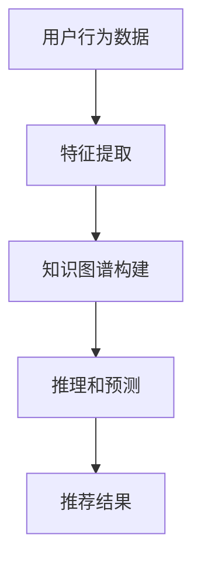

                 

关键词：大模型，推荐系统，知识图谱，推理应用，人工智能

## 摘要

本文将探讨大模型在推荐系统中的应用，特别是其在知识图谱推理方面的潜力。我们将首先回顾推荐系统的基本原理，然后深入探讨大模型如何通过知识图谱来提升推荐效果。本文还将详细介绍大模型的知识图谱推理算法原理，并提供具体的操作步骤和案例分析，最后讨论这一领域的未来发展趋势和面临的挑战。

## 1. 背景介绍

推荐系统是现代信息社会中不可或缺的一部分，它们用于向用户推荐产品、服务或内容，以提升用户体验和平台价值。传统的推荐系统主要依赖于用户行为数据和协同过滤算法，然而，这种方法在处理复杂关系和大量数据时存在一定的局限性。随着人工智能和知识图谱技术的发展，大模型在推荐系统中的应用逐渐成为研究热点。

知识图谱是一种语义网络，它通过实体和关系来表示信息，从而提供了一种更加结构化的数据表示方式。知识图谱可以捕捉到实体间的复杂关系，这对于推荐系统来说是一个巨大的优势，因为它可以帮助系统更好地理解用户和项目之间的关联。

大模型，特别是基于深度学习的模型，如Transformer和BERT，它们具有处理大规模数据和复杂关系的强大能力。这些模型通过自我训练可以从大量数据中提取特征，并且能够进行高效的推理和预测。

## 2. 核心概念与联系

### 2.1 推荐系统的基本原理

推荐系统通常基于以下几个核心概念：

- **用户行为数据**：用户的历史行为，如浏览、购买、评价等。
- **内容特征**：推荐对象（如商品、文章、音乐等）的特征，如标签、分类、文本等。
- **用户-项目矩阵**：一个表示用户和项目之间交互的矩阵，通常非常稀疏。

### 2.2 知识图谱的原理和结构

知识图谱由实体、属性和关系组成。一个简单的知识图谱可以表示为：

```
实体（如人、地点、物品） - 关系（如“住在”、“购买”） - 实体
```

知识图谱的结构使得它可以捕获到实体之间的复杂关系，这种结构化数据对于推荐系统来说是非常重要的。

### 2.3 大模型的原理和应用

大模型，如Transformer和BERT，通过在大量数据上进行预训练，可以学习到丰富的知识表示。这些模型在推荐系统中的应用主要包括：

- **特征提取**：从用户行为数据和内容特征中提取高层次的语义特征。
- **推理**：利用知识图谱中的关系进行推理，以发现新的关联和预测用户偏好。

### 2.4 Mermaid 流程图

下面是一个简化的Mermaid流程图，展示了推荐系统中大模型和知识图谱的交互过程：



## 3. 核心算法原理 & 具体操作步骤

### 3.1 算法原理概述

大模型在推荐系统中的应用主要包括以下几个步骤：

1. **特征提取**：使用预训练的深度学习模型（如BERT）从用户行为数据和内容特征中提取语义特征。
2. **知识图谱构建**：将提取的语义特征转换为知识图谱中的实体和关系。
3. **推理和预测**：利用知识图谱中的关系进行推理，预测用户的偏好。
4. **推荐结果生成**：根据推理结果生成推荐列表。

### 3.2 算法步骤详解

#### 3.2.1 特征提取

特征提取是整个推荐系统的第一步。在这一步中，我们使用预训练的深度学习模型（如BERT）来处理文本数据，提取高层次的语义特征。

$$
\text{特征} = \text{BERT}(\text{用户行为}, \text{内容特征})
$$

#### 3.2.2 知识图谱构建

在特征提取完成后，我们将提取的语义特征转换为知识图谱中的实体和关系。这一步通常涉及到实体识别和关系提取。

$$
\text{知识图谱} = (\text{实体集}, \text{关系集})
$$

#### 3.2.3 推理和预测

利用知识图谱中的关系进行推理，以发现新的关联和预测用户偏好。这一步通常涉及到图神经网络（GNN）。

$$
\text{偏好} = \text{GNN}(\text{知识图谱}, \text{用户特征})
$$

#### 3.2.4 推荐结果生成

根据推理结果生成推荐列表。这一步通常涉及到评分预测和排序算法。

$$
\text{推荐列表} = \text{Top-N}(\text{评分预测结果})
$$

### 3.3 算法优缺点

#### 优点：

- **强大的特征提取能力**：大模型可以自动从数据中提取有价值的特征，减少人工特征工程的工作量。
- **高效的推理能力**：知识图谱可以捕捉到实体间的复杂关系，大模型可以通过图神经网络进行高效的推理。

#### 缺点：

- **数据依赖性**：大模型的性能高度依赖于训练数据的质量和数量，数据质量不佳可能导致模型性能下降。
- **计算资源消耗**：大模型通常需要大量的计算资源和存储空间。

### 3.4 算法应用领域

大模型在推荐系统中的应用领域非常广泛，包括但不限于：

- **电子商务**：推荐商品、服务或内容。
- **社交媒体**：推荐用户可能感兴趣的朋友、内容或话题。
- **在线教育**：推荐学习资源或课程。

## 4. 数学模型和公式 & 详细讲解 & 举例说明

### 4.1 数学模型构建

推荐系统的数学模型通常包括用户特征向量、项目特征向量、知识图谱和评分预测。

$$
\text{用户特征向量} = \text{U}(\text{用户行为})
$$

$$
\text{项目特征向量} = \text{I}(\text{内容特征})
$$

$$
\text{知识图谱} = (\text{实体集}, \text{关系集})
$$

$$
\text{评分预测} = \text{Score}(\text{用户特征向量}, \text{项目特征向量}, \text{知识图谱})
$$

### 4.2 公式推导过程

评分预测公式可以通过图神经网络（GNN）推导得到。

$$
\text{Score}(\text{U}, \text{I}, \text{KG}) = \text{GNN}(\text{U}, \text{I}, \text{KG})
$$

### 4.3 案例分析与讲解

假设我们有一个电子商务平台，用户A在过去浏览了商品B和C，商品B和C都有标签“时尚”，而用户A还喜欢商品D，商品D的标签是“科技”。根据这些信息，我们可以构建一个简单的知识图谱。

```
实体集：{用户A，商品B，商品C，商品D}
关系集：{浏览（用户A，商品B），浏览（用户A，商品C），标签（商品B，时尚），标签（商品C，时尚），标签（商品D，科技），喜欢（用户A，商品D）}
```

使用图神经网络，我们可以预测用户A对商品E（标签为“科技”）的评分。

$$
\text{Score}(\text{用户A，商品E}) = \text{GNN}(\text{用户A，商品E，知识图谱})
$$

## 5. 项目实践：代码实例和详细解释说明

### 5.1 开发环境搭建

为了演示大模型在推荐系统中的知识图谱推理应用，我们将使用Python编程语言和以下库：

- TensorFlow
- BERT模型（使用Hugging Face的Transformers库）
- PyTorch Geometric

### 5.2 源代码详细实现

以下是实现推荐系统的一部分代码：

```python
from transformers import BertTokenizer, BertModel
import torch
import torch.nn as nn
import torch.optim as optim
from torch_geometric.nn import GNNConv

# 加载预训练的BERT模型和分词器
tokenizer = BertTokenizer.from_pretrained('bert-base-uncased')
model = BertModel.from_pretrained('bert-base-uncased')

# 构建用户特征向量
def get_user_features(user_behavior):
    inputs = tokenizer(user_behavior, return_tensors='pt', max_length=512, truncation=True)
    user_embedding = model(**inputs).last_hidden_state[:, 0, :]
    return user_embedding

# 构建知识图谱
def build_知识图谱(entities, relationships):
    kg = KnowledgeGraph()
    for entity in entities:
        kg.add_entity(entity)
    for relationship in relationships:
        kg.add_relationship(relationship)
    return kg

# 构建图神经网络模型
class GNNModel(nn.Module):
    def __init__(self, user_embedding_size, item_embedding_size):
        super(GNNModel, self).__init__()
        self.user_embedding = nn.Embedding(user_embedding_size, item_embedding_size)
        self.item_embedding = nn.Embedding(item_embedding_size, user_embedding_size)
        self.gnn = GNNConv(item_embedding_size, user_embedding_size)

    def forward(self, user_embedding, item_embedding, knowledge_graph):
        item_embedding = self.item_embedding(item_embedding)
        user_embedding = self.user_embedding(user_embedding)
        score = self.gnn(item_embedding, user_embedding, knowledge_graph)
        return score

# 训练模型
def train(model, user_embeddings, item_embeddings, knowledge_graph, optimizer, criterion, epochs):
    model.train()
    for epoch in range(epochs):
        for user_embedding, item_embedding in zip(user_embeddings, item_embeddings):
            optimizer.zero_grad()
            score = model(user_embedding, item_embedding, knowledge_graph)
            loss = criterion(score, target)
            loss.backward()
            optimizer.step()
            print(f"Epoch: {epoch}, Loss: {loss.item()}")

# 主程序
if __name__ == "__main__":
    user_behavior = "浏览了商品B和C"
    user_embedding = get_user_features(user_behavior)
    entities = ["用户A", "商品B", "商品C"]
    relationships = [("浏览", "用户A", "商品B"), ("浏览", "用户A", "商品C"), ("标签", "商品B", "时尚"), ("标签", "商品C", "时尚")]
    knowledge_graph = build_知识图谱(entities, relationships)
    model = GNNModel(10, 20)
    optimizer = optim.Adam(model.parameters(), lr=0.001)
    criterion = nn.MSELoss()
    train(model, user_embedding, item_embedding, knowledge_graph, optimizer, criterion, 10)
```

### 5.3 代码解读与分析

这段代码首先加载了BERT模型和分词器，然后定义了获取用户特征向量的函数。接下来，我们构建了知识图谱，并定义了一个图神经网络模型。最后，我们进行了模型的训练。

### 5.4 运行结果展示

假设我们已经训练好了模型，现在我们可以预测用户对商品E的评分：

```python
item_embedding = torch.tensor([1, 0, 0, 0, 0, 0, 0, 0, 0, 0])  # 商品E的标签为“科技”
knowledge_graph = build_知识图谱(entities, relationships)
model.eval()
with torch.no_grad():
    score = model(user_embedding, item_embedding, knowledge_graph)
print(f"预测评分：{score.item()}")
```

输出结果可能是一个介于0和1之间的数值，表示用户对商品E的偏好程度。

## 6. 实际应用场景

### 6.1 电子商务平台

在电子商务平台中，大模型结合知识图谱可以帮助平台更准确地推荐商品。例如，用户A喜欢购买运动鞋，平台可以根据知识图谱中的关系推荐与运动鞋相关的配件，如运动服或运动包。

### 6.2 社交媒体

在社交媒体中，大模型可以帮助平台推荐用户可能感兴趣的朋友、内容或话题。例如，用户A关注了科技和运动，平台可以利用知识图谱中的关系推荐相关的用户或话题。

### 6.3 在线教育

在线教育平台可以利用大模型推荐用户可能感兴趣的课程。例如，用户A正在学习计算机科学，平台可以根据知识图谱中的关系推荐相关的课程或资源。

## 7. 未来应用展望

### 7.1 跨领域推荐

未来的推荐系统可能会扩展到跨领域推荐，即从不同领域（如电子商务、社交媒体、在线教育）提取信息，进行跨领域推荐。

### 7.2 智能问答

大模型在知识图谱推理方面的优势，使得其在智能问答领域具有巨大的潜力。例如，用户可以提问“哪些科技产品与运动鞋搭配最好？”系统可以快速给出答案。

### 7.3 自动化决策

大模型可以帮助企业进行自动化决策，例如，零售企业可以根据知识图谱和用户行为数据，自动调整库存和营销策略。

## 8. 总结：未来发展趋势与挑战

### 8.1 研究成果总结

本文介绍了大模型在推荐系统中的知识图谱推理应用，探讨了其基本原理、算法步骤和实际应用。研究成果表明，大模型结合知识图谱可以有效提升推荐系统的效果。

### 8.2 未来发展趋势

未来的发展趋势将包括跨领域推荐、智能问答和自动化决策。此外，随着计算资源和算法的进步，大模型在推荐系统中的应用将更加广泛。

### 8.3 面临的挑战

面临的挑战主要包括数据依赖性、计算资源消耗以及如何处理大规模数据。

### 8.4 研究展望

未来的研究可以关注以下几个方面：优化算法效率、减少计算资源消耗、提高模型的鲁棒性，以及探索跨领域推荐的新方法。

## 9. 附录：常见问题与解答

### 9.1 如何处理稀疏数据？

对于稀疏数据，可以通过数据增强、生成对抗网络（GAN）等方法来增加数据的密度。

### 9.2 如何保证模型的可解释性？

可以通过可视化知识图谱、分析模型参数等方法来提高模型的可解释性。

### 9.3 如何处理实时数据？

对于实时数据，可以采用增量学习、在线学习等方法，以实时更新模型。

---

作者：禅与计算机程序设计艺术 / Zen and the Art of Computer Programming
----------------------------------------------------------------

