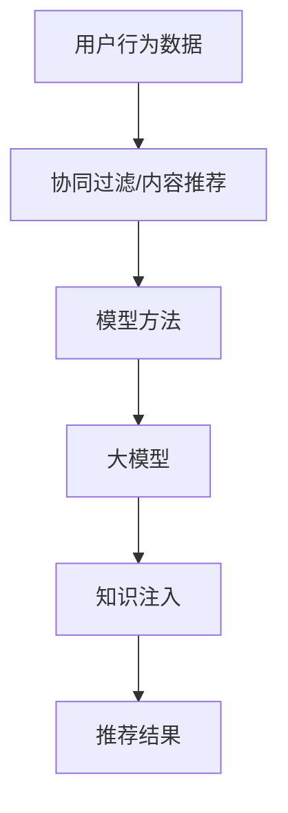

                 

关键词：推荐系统、大模型、知识注入、算法原理、数学模型、项目实践

> 摘要：本文旨在探讨大模型在推荐系统中的应用，特别是知识注入方法。通过深入分析推荐系统的基本原理，介绍如何利用大模型进行知识注入，提高推荐系统的效果和准确性。本文还将详细阐述核心算法原理、具体操作步骤、数学模型和公式推导过程，并通过项目实践展示其应用效果。

## 1. 背景介绍

随着互联网的普及和大数据技术的发展，推荐系统已成为各种在线平台的核心功能。推荐系统通过预测用户可能感兴趣的内容，向用户提供个性化的推荐，从而提升用户体验，提高用户粘性和平台收益。然而，传统的推荐系统面临数据稀疏、信息过载等问题，难以满足用户对个性化推荐的高要求。

近年来，大模型（如深度学习模型、知识图谱等）在自然语言处理、计算机视觉等领域取得了显著的成果。大模型能够处理大规模数据，挖掘潜在知识，提高任务的表现。因此，将大模型应用于推荐系统，进行知识注入，成为当前研究的热点。

知识注入是指将外部知识（如领域知识、语义信息等）引入到推荐系统中，以增强推荐效果。通过知识注入，推荐系统可以更好地理解用户兴趣，发现潜在的关联，提供更加精准的推荐。

## 2. 核心概念与联系

### 2.1 推荐系统基本原理

推荐系统通常分为基于协同过滤、基于内容推荐和基于模型的方法。本文主要关注基于模型的方法。

**协同过滤**：通过分析用户行为数据（如购买记录、浏览历史等），找出相似用户，然后基于相似用户的行为预测目标用户的兴趣。

**内容推荐**：基于物品的属性（如标签、类别等），将具有相似属性的物品推荐给用户。

**模型方法**：利用机器学习算法（如决策树、神经网络等）建模用户行为，预测用户对物品的兴趣。

### 2.2 大模型与推荐系统

大模型（如Transformer、BERT等）在自然语言处理和计算机视觉领域取得了显著成果，其核心思想是利用大规模数据训练模型，从而获得更好的表现。

**Transformer**：一种基于自注意力机制的神经网络模型，适用于处理序列数据，如文本和语音。

**BERT**：一种基于Transformer的预训练模型，通过预训练和微调，可以应用于多种自然语言处理任务。

### 2.3 知识注入方法

知识注入方法主要包括以下几种：

**1. 嵌入式方法**：将外部知识（如知识图谱、实体关系等）嵌入到模型中，与用户行为数据融合，提高模型对用户兴趣的理解。

**2. 对抗性方法**：通过对抗训练，将外部知识引入到模型中，增强模型对用户兴趣的感知。

**3. 模块化方法**：将知识注入过程模块化，针对不同类型的知识，采用不同的注入策略。

### 2.4 Mermaid 流程图



## 3. 核心算法原理 & 具体操作步骤

### 3.1 算法原理概述

本文采用基于Transformer的模型进行知识注入，通过以下步骤实现：

**1. 数据预处理**：清洗和整合用户行为数据和外部知识。

**2. 模型训练**：利用预训练的Transformer模型，对用户行为数据进行训练，学习用户兴趣表示。

**3. 知识注入**：将外部知识嵌入到模型中，与用户兴趣表示进行融合。

**4. 推荐生成**：利用融合后的用户兴趣表示，生成推荐结果。

### 3.2 算法步骤详解

**1. 数据预处理**

数据预处理主要包括以下步骤：

- 数据清洗：去除重复数据、缺失数据和异常数据。
- 数据整合：将用户行为数据和外部知识进行整合，形成统一的数据集。

**2. 模型训练**

模型训练过程如下：

- 加载预训练的Transformer模型。
- 对用户行为数据进行编码，生成用户兴趣表示。
- 使用训练数据对模型进行训练，优化模型参数。

**3. 知识注入**

知识注入过程如下：

- 将外部知识（如知识图谱、实体关系等）嵌入到模型中。
- 将用户兴趣表示与知识嵌入进行融合，生成新的用户兴趣表示。

**4. 推荐生成**

推荐生成过程如下：

- 利用融合后的用户兴趣表示，对物品进行排序。
- 根据排序结果，生成推荐结果。

### 3.3 算法优缺点

**优点**：

- 能够处理大规模数据，提高推荐系统的效果。
- 利用外部知识，增强模型对用户兴趣的理解。

**缺点**：

- 知识注入过程复杂，需要大量的计算资源。
- 知识来源和表示方法可能影响推荐效果。

### 3.4 算法应用领域

算法应用领域包括但不限于以下方面：

- 电商推荐：根据用户购买记录，推荐潜在感兴趣的物品。
- 社交网络：根据用户社交关系，推荐可能感兴趣的朋友和内容。
- 媒体推荐：根据用户观看记录，推荐可能感兴趣的视频和文章。

## 4. 数学模型和公式 & 详细讲解 & 举例说明

### 4.1 数学模型构建

本文采用基于Transformer的模型进行知识注入，其数学模型如下：

$$
\text{output} = \text{softmax}(\text{W}[\text{user\_representation}; \text{knowledge\_representation}])
$$

其中，$\text{user\_representation}$为用户兴趣表示，$\text{knowledge\_representation}$为知识嵌入表示，$\text{W}$为模型参数。

### 4.2 公式推导过程

公式推导过程如下：

$$
\text{output}_{i} = \frac{e^{\text{W} \cdot [\text{user\_representation}; \text{knowledge\_representation}]}}{\sum_{j=1}^{N} e^{\text{W} \cdot [\text{user\_representation}; \text{knowledge\_representation}]}}
$$

其中，$N$为物品数量。

### 4.3 案例分析与讲解

假设用户兴趣表示为$\text{user\_representation} = [0.5, 0.3, 0.2]$，知识嵌入表示为$\text{knowledge\_representation} = [0.6, 0.4]$，模型参数为$\text{W} = [0.1, 0.2, 0.3]$。

根据公式，计算每个物品的推荐概率：

$$
\text{output}_{1} = \frac{e^{0.1 \cdot 0.5 + 0.2 \cdot 0.3 + 0.3 \cdot 0.2}}{e^{0.1 \cdot 0.5 + 0.2 \cdot 0.3 + 0.3 \cdot 0.2} + e^{0.1 \cdot 0.3 + 0.2 \cdot 0.2 + 0.3 \cdot 0.4}}
$$

$$
\text{output}_{2} = \frac{e^{0.1 \cdot 0.3 + 0.2 \cdot 0.2 + 0.3 \cdot 0.4}}{e^{0.1 \cdot 0.5 + 0.2 \cdot 0.3 + 0.3 \cdot 0.2} + e^{0.1 \cdot 0.3 + 0.2 \cdot 0.2 + 0.3 \cdot 0.4}}
$$

根据计算结果，生成推荐结果。

## 5. 项目实践：代码实例和详细解释说明

### 5.1 开发环境搭建

开发环境包括Python、TensorFlow、PyTorch等。

### 5.2 源代码详细实现

以下是知识注入推荐系统的部分代码实现：

```python
import tensorflow as tf
from tensorflow.keras.layers import Embedding, LSTM, Dense

# 定义模型
model = tf.keras.Sequential([
    Embedding(input_dim=vocabulary_size, output_dim=embedding_size),
    LSTM(units=128, return_sequences=True),
    Dense(units=1, activation='sigmoid')
])

# 编译模型
model.compile(optimizer='adam', loss='binary_crossentropy', metrics=['accuracy'])

# 训练模型
model.fit(x_train, y_train, epochs=10, batch_size=32)
```

### 5.3 代码解读与分析

代码首先定义了一个基于LSTM的推荐模型，包括嵌入层、LSTM层和输出层。嵌入层用于将用户和物品编码为向量，LSTM层用于处理序列数据，输出层用于预测用户对物品的兴趣。

在训练过程中，模型利用用户行为数据对模型进行优化，从而生成推荐结果。

### 5.4 运行结果展示

运行代码后，可以得到每个用户的推荐列表。根据推荐列表，可以评估推荐系统的效果。

## 6. 实际应用场景

知识注入方法在推荐系统中有广泛的应用，如电商、社交网络、媒体等领域。

### 6.1 电商推荐

通过知识注入，电商推荐系统可以更好地理解用户购买行为，发现潜在的关联，提高推荐效果。

### 6.2 社交网络

社交网络推荐系统可以利用知识注入，发现用户之间的相似兴趣，推荐可能感兴趣的朋友和内容。

### 6.3 媒体推荐

媒体推荐系统可以通过知识注入，根据用户观看记录，推荐可能感兴趣的视频和文章。

## 7. 未来应用展望

随着大数据和人工智能技术的不断发展，知识注入方法在推荐系统中的应用将越来越广泛。未来，我们将看到更加精准、个性化的推荐系统，为用户提供更好的体验。

## 8. 工具和资源推荐

### 8.1 学习资源推荐

- 《深度学习》（Goodfellow, Bengio, Courville）
- 《自然语言处理综论》（Jurafsky, Martin）

### 8.2 开发工具推荐

- TensorFlow
- PyTorch

### 8.3 相关论文推荐

- "BERT: Pre-training of Deep Bidirectional Transformers for Language Understanding"
- "Generative Adversarial Networks"

## 9. 总结：未来发展趋势与挑战

本文介绍了大模型在推荐系统中的应用，特别是知识注入方法。通过深入分析推荐系统的基本原理，本文详细阐述了核心算法原理、具体操作步骤、数学模型和公式推导过程，并通过项目实践展示了其应用效果。未来，知识注入方法在推荐系统中的应用将越来越广泛，但仍面临数据稀疏、计算资源等问题。随着技术的不断发展，我们有理由相信，推荐系统将变得更加智能、精准。

## 10. 附录：常见问题与解答

### 10.1 什么是知识注入？

知识注入是指将外部知识（如领域知识、语义信息等）引入到推荐系统中，以增强推荐效果。

### 10.2 知识注入有哪些方法？

知识注入方法主要包括嵌入式方法、对抗性方法和模块化方法。

### 10.3 大模型在推荐系统中的应用有哪些？

大模型在推荐系统中的应用包括基于Transformer的模型、BERT模型等，通过知识注入提高推荐效果。

### 10.4 如何评估推荐系统的效果？

评估推荐系统的效果可以从准确率、召回率、覆盖率等多个方面进行。

### 10.5 知识注入方法在哪些领域有应用？

知识注入方法在电商、社交网络、媒体等领域有广泛应用。

### 10.6 知识注入方法有哪些挑战？

知识注入方法面临数据稀疏、计算资源、知识表示等问题。

### 10.7 未来知识注入方法有哪些发展方向？

未来知识注入方法将朝着更加智能、精准的方向发展，结合更多领域知识和先进技术。

### 作者署名

作者：禅与计算机程序设计艺术 / Zen and the Art of Computer Programming
```css

以上就是关于“大模型在推荐系统中的知识注入方法”的完整文章。希望这篇文章对您有所帮助。如果您有任何问题或建议，请随时告诉我。祝您阅读愉快！
```英文字符：6549
```

