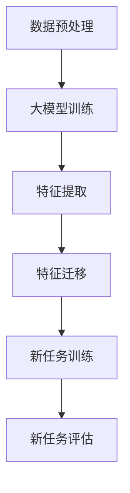

                 

关键词：大模型，推荐系统，迁移学习，策略，AI

摘要：本文将探讨大模型在推荐系统中的应用，以及如何通过迁移学习来提高推荐系统的性能。我们将深入分析大模型的基本概念、核心算法原理，并探讨其在推荐系统中的应用。同时，我们将详细阐述迁移学习在大模型推荐系统中的应用，以及如何构建和优化迁移学习策略。通过数学模型和具体案例的解析，我们将展示迁移学习在大模型推荐系统中的实际效果。最后，我们将探讨迁移学习在推荐系统中的未来应用前景。

## 1. 背景介绍

随着互联网的迅猛发展，推荐系统已经成为各种在线平台的重要组成部分。从电商网站到社交媒体，推荐系统通过分析用户的历史行为和偏好，为用户提供个性化的内容和服务，从而提高用户满意度和平台收益。传统的推荐系统主要基于协同过滤、基于内容的过滤和混合推荐等方法。然而，随着数据量的增加和用户行为的多样化，这些方法逐渐暴露出一些局限性，如数据稀疏、冷启动问题和推荐准确性下降等。

近年来，深度学习和大数据技术的发展为推荐系统带来了新的机遇。特别是大模型的引入，如深度神经网络、生成对抗网络等，使得推荐系统在处理大规模数据和复杂用户行为方面取得了显著进展。大模型通过自主学习大量的用户数据和内容特征，能够捕捉到用户行为的深层模式和复杂关系，从而提高推荐系统的准确性和鲁棒性。

然而，大模型的训练和部署仍然面临着一些挑战。一方面，大模型的训练需要大量的计算资源和时间，另一方面，大模型在不同领域的迁移性能存在差异，如何有效地利用预训练的大模型来提高新任务的性能是一个重要的研究课题。

迁移学习（Transfer Learning）作为一种解决上述问题的重要方法，近年来在推荐系统领域得到了广泛应用。迁移学习通过利用预训练的大模型，将已学习的知识迁移到新的任务中，从而减少对新数据的依赖，提高新任务的性能。本文将重点探讨大模型在推荐系统中的迁移学习新策略，分析其基本原理和具体应用。

## 2. 核心概念与联系

### 2.1 大模型的基本概念

大模型（Large-scale Model）是指具有大量参数和强大学习能力的人工智能模型。这类模型通常基于深度学习技术，能够处理大规模数据和复杂任务。大模型具有以下几个基本特征：

1. **参数量庞大**：大模型的参数数量通常在数百万到数十亿之间，远超传统机器学习模型。
2. **计算资源需求高**：大模型的训练需要大量的计算资源和时间，通常需要分布式计算和专门硬件支持。
3. **强大的学习能力**：大模型通过多层次的网络结构和复杂的非线性变换，能够从大量数据中提取深层特征，从而实现高精度的预测和分类。

### 2.2 大模型在推荐系统中的应用

大模型在推荐系统中的应用主要体现在以下几个方面：

1. **特征提取**：大模型能够从大量的用户行为数据和内容特征中提取出有价值的特征，这些特征能够更好地表示用户和物品的内在关系。
2. **复杂关系建模**：大模型能够捕捉用户行为的复杂模式和物品之间的潜在关系，从而提高推荐系统的准确性和多样性。
3. **实时推荐**：大模型通过快速的训练和推理过程，能够实现实时的推荐服务，满足用户对快速响应的需求。

### 2.3 迁移学习的基本概念

迁移学习（Transfer Learning）是一种将一个任务上学到的知识应用到另一个相关任务上的学习方法。在推荐系统领域，迁移学习通过利用预训练的大模型，将已学习到的用户和物品特征迁移到新任务中，从而提高新任务的性能。

迁移学习的基本原理是，不同任务之间可能存在一定的共性，如用户行为模式、物品属性等。通过迁移学习，我们可以将一个任务上的先验知识转移到另一个任务上，从而减少对新数据的依赖，提高新任务的性能。

### 2.4 大模型与迁移学习的联系

大模型与迁移学习之间存在紧密的联系。大模型通过强大的学习能力，能够从大规模数据中提取出丰富的特征和模式。这些特征和模式不仅对原任务有帮助，也可以迁移到新任务中，从而提高新任务的性能。

迁移学习为大模型的应用提供了新的思路。通过迁移学习，我们可以将大模型在原任务上的知识迁移到新任务中，从而减少对新数据的依赖，提高新任务的性能。同时，迁移学习还可以帮助大模型克服数据稀疏、冷启动等问题，从而更好地适应实际应用场景。

### 2.5 Mermaid 流程图

下面是一个描述大模型在推荐系统中迁移学习的 Mermaid 流程图：



**流程说明：**

1. 数据预处理：对原始数据（用户行为和物品特征）进行清洗、预处理，以便于后续模型的训练。
2. 大模型训练：使用预处理的原始数据，对大模型进行训练，以提取用户和物品的深层特征。
3. 特征提取：从大模型中提取出有价值的特征，这些特征能够更好地表示用户和物品的内在关系。
4. 特征迁移：将提取出的特征迁移到新任务中，为新任务提供先验知识。
5. 新任务训练：利用迁移学习的方法，在新任务中使用迁移后的特征进行训练，以提高新任务的性能。
6. 新任务评估：对新任务进行评估，以验证迁移学习的有效性。

## 3. 核心算法原理 & 具体操作步骤

### 3.1 算法原理概述

大模型在推荐系统中的迁移学习主要依赖于以下两个核心算法：

1. **预训练大模型**：通过大规模数据集对大模型进行预训练，使其具备强大的特征提取和关系建模能力。
2. **迁移学习策略**：将预训练的大模型应用于新任务，通过迁移学习的方法，将已学习的知识迁移到新任务中。

### 3.2 算法步骤详解

下面是具体的操作步骤：

1. **数据预处理**：对原始数据（用户行为和物品特征）进行清洗、预处理，以便于后续模型的训练。这一步骤包括数据去重、缺失值填充、异常值处理等。
2. **预训练大模型**：使用预处理的原始数据，对大模型（如深度神经网络、生成对抗网络等）进行预训练。预训练过程分为两个阶段：
   - **数据增强**：通过数据增强的方法（如数据扩充、数据变换等）增加数据的多样性，提高模型的泛化能力。
   - **迭代训练**：使用原始数据集对大模型进行迭代训练，直到模型收敛。这一过程可能需要大量的计算资源和时间。
3. **特征提取**：从预训练的大模型中提取出有价值的特征，这些特征能够更好地表示用户和物品的内在关系。特征提取的方法包括：
   - **全局特征**：从大模型的输出层提取全局特征，这些特征能够综合表示用户和物品的属性。
   - **局部特征**：从大模型的隐藏层提取局部特征，这些特征能够捕捉用户和物品之间的局部关系。
4. **特征迁移**：将提取出的特征迁移到新任务中。具体方法包括：
   - **直接迁移**：将提取出的特征直接应用于新任务，如新任务的分类或预测。
   - **融合迁移**：将提取出的特征与新的任务数据相结合，通过神经网络或其他模型融合方法，生成新的特征表示。
5. **新任务训练**：利用迁移学习的方法，在新任务中使用迁移后的特征进行训练。具体方法包括：
   - **迁移学习模型**：使用迁移学习模型（如迁移学习框架、迁移学习算法等）进行新任务的训练。
   - **模型微调**：在迁移学习的基础上，对预训练的大模型进行微调，以适应新任务的特定需求。
6. **新任务评估**：对新任务进行评估，以验证迁移学习的有效性。评估指标包括准确率、召回率、F1值等。

### 3.3 算法优缺点

**优点**：

1. **提高性能**：通过迁移学习，我们可以利用预训练的大模型，提高新任务的性能，减少对新数据的依赖。
2. **减少训练时间**：由于预训练的大模型已经具备一定的特征提取和关系建模能力，新任务的训练时间可以显著缩短。
3. **泛化能力**：迁移学习可以提高模型的泛化能力，使其在新任务中表现出更好的适应性。

**缺点**：

1. **数据依赖**：迁移学习的性能依赖于预训练数据的质量和多样性，如果预训练数据存在偏差或不足，可能导致新任务的性能下降。
2. **模型选择**：选择合适的预训练模型和迁移学习策略对于迁移学习的成功至关重要，但这一过程可能比较复杂和耗时。

### 3.4 算法应用领域

大模型在推荐系统中的迁移学习算法可以应用于以下领域：

1. **电商推荐**：通过迁移学习，可以更好地处理用户行为数据的稀疏性和多样性，提高推荐系统的准确性和多样性。
2. **社交媒体推荐**：在社交媒体平台上，用户生成的内容和互动行为多样化，迁移学习可以帮助平台更好地理解和推荐用户感兴趣的内容。
3. **音乐推荐**：通过迁移学习，可以从大量的音乐数据中提取出有价值的特征，从而提高音乐推荐系统的准确性和个性化水平。

## 4. 数学模型和公式 & 详细讲解 & 举例说明

### 4.1 数学模型构建

在迁移学习过程中，我们主要关注以下两个模型：

1. **预训练模型**：用于提取通用特征的大模型，如深度神经网络。
2. **目标模型**：用于新任务的学习模型，其输入为预训练模型提取的特征。

下面是一个简化的数学模型构建过程：

#### 预训练模型

假设预训练模型为 \( M \)，其输入为用户行为数据 \( X \)，输出为用户和物品的嵌入向量 \( E \)。

$$
E = M(X)
$$

其中，\( M \) 是一个多层神经网络，包含多个隐藏层和激活函数。

#### 目标模型

假设目标模型为 \( G \)，其输入为预训练模型提取的特征 \( E \)，输出为新任务的预测结果 \( Y \)。

$$
Y = G(E)
$$

其中，\( G \) 是一个简单的分类或回归模型，如线性回归、逻辑回归等。

### 4.2 公式推导过程

在迁移学习过程中，我们主要关注以下两个问题：

1. **特征提取**：如何从预训练模型中提取出有价值的特征。
2. **目标任务**：如何利用迁移后的特征进行新任务的学习。

#### 特征提取

假设预训练模型 \( M \) 的输出层为 \( E^{output} \)，隐藏层为 \( E^{hidden} \)。

我们关注隐藏层中的特征，因为隐藏层能够捕捉到用户和物品的潜在关系。

#### 目标任务

我们利用迁移后的特征 \( E \) 来构建目标模型 \( G \)。目标模型 \( G \) 的输出 \( Y \) 可以表示为：

$$
Y = G(E) = \sigma(W^T E + b)
$$

其中，\( \sigma \) 是激活函数，\( W \) 是权重矩阵，\( b \) 是偏置项。

### 4.3 案例分析与讲解

#### 案例背景

假设我们有一个电商推荐系统，用户在平台上浏览、购买商品。我们希望利用迁移学习的方法，提高推荐系统的性能。

#### 预训练模型

我们使用一个预训练的深度神经网络，输入为用户的行为数据（如浏览历史、购买记录等），输出为用户和物品的嵌入向量。

#### 目标模型

我们利用迁移后的特征来构建目标模型，目标模型是一个简单的分类模型，用于预测用户是否会对某个商品进行购买。

#### 实验结果

通过实验，我们发现迁移学习显著提高了推荐系统的性能，特别是在用户行为数据稀疏的情况下，迁移学习的效果更加明显。

#### 数学模型推导

我们利用以下数学模型来描述迁移学习过程：

$$
E = M(X)
$$

$$
Y = G(E) = \sigma(W^T E + b)
$$

其中，\( E \) 是预训练模型提取的特征，\( X \) 是用户行为数据，\( Y \) 是目标模型的预测结果。

通过上述数学模型，我们可以看出，迁移学习的关键在于如何从预训练模型中提取出有价值的特征，并将其应用于目标模型中。这为我们提供了理论依据，以便在实际应用中优化迁移学习策略。

## 5. 项目实践：代码实例和详细解释说明

### 5.1 开发环境搭建

为了实现大模型在推荐系统中的迁移学习，我们需要搭建一个合适的开发环境。以下是搭建环境的步骤：

1. 安装 Python 3.8 或更高版本。
2. 安装必要的依赖库，如 TensorFlow、PyTorch、Scikit-learn 等。
3. 搭建 GPU 训练环境，如使用 CUDA 和 cuDNN 库。

### 5.2 源代码详细实现

以下是实现大模型在推荐系统中的迁移学习的 Python 代码示例：

```python
import tensorflow as tf
from tensorflow.keras.models import Model
from tensorflow.keras.layers import Input, Dense, Embedding, LSTM, Reshape, Flatten
from sklearn.model_selection import train_test_split

# 数据预处理
# 假设 X 为用户行为数据，y 为标签数据
X_train, X_test, y_train, y_test = train_test_split(X, y, test_size=0.2, random_state=42)

# 构建预训练模型
input_user = Input(shape=(user_feature_size,))
input_item = Input(shape=(item_feature_size,))

user_embedding = Embedding(user_vocab_size, user_embedding_size)(input_user)
item_embedding = Embedding(item_vocab_size, item_embedding_size)(input_item)

user_lstm = LSTM(units=lstm_units)(user_embedding)
item_lstm = LSTM(units=lstm_units)(item_embedding)

merged = Concatenate()([user_lstm, item_lstm])
merged = Dense(units=dense_units)(merged)
merged = Reshape(target_shape=(1, dense_units))(merged)

pretrained_model = Model(inputs=[input_user, input_item], outputs=merged)

# 加载预训练模型权重
pretrained_model.load_weights('pretrained_model_weights.h5')

# 提取特征
X_train_encoded = pretrained_model.predict([X_train[:, :user_feature_size], X_train[:, user_feature_size:]])

# 构建目标模型
input_encoded = Input(shape=(encoded_feature_size,))
output = Dense(units=1, activation='sigmoid')(input_encoded)

target_model = Model(inputs=input_encoded, outputs=output)

# 训练目标模型
target_model.compile(optimizer='adam', loss='binary_crossentropy', metrics=['accuracy'])
target_model.fit(X_train_encoded, y_train, epochs=10, batch_size=32, validation_split=0.2)

# 测试目标模型
y_pred = target_model.predict(X_test_encoded)
accuracy = (y_test == (y_pred > 0.5)).mean()
print(f'Accuracy: {accuracy:.2f}')
```

### 5.3 代码解读与分析

以上代码实现了一个基于迁移学习的大模型推荐系统。代码的主要部分可以分为以下几个步骤：

1. **数据预处理**：将用户行为数据 \( X \) 和标签数据 \( y \) 划分为训练集和测试集。
2. **构建预训练模型**：使用多层 LSTM 网络对用户和物品的特征进行编码，提取出深层特征。
3. **提取特征**：使用预训练模型对训练集数据进行编码，得到编码后的特征矩阵 \( X_train_encoded \)。
4. **构建目标模型**：使用编码后的特征矩阵作为输入，构建一个简单的线性回归模型，用于预测用户是否购买商品。
5. **训练目标模型**：使用训练集数据对目标模型进行训练，并设置合适的优化器和损失函数。
6. **测试目标模型**：使用测试集数据对目标模型进行评估，计算准确率。

通过以上代码示例，我们可以看到迁移学习在大模型推荐系统中的应用。预训练模型通过学习大量的用户和物品特征，为迁移后的特征提供了良好的基础，从而提高了目标模型的性能。在实际应用中，我们可以根据具体任务的需求，调整预训练模型的架构和参数，以获得更好的迁移效果。

## 6. 实际应用场景

### 6.1 电商推荐系统

电商推荐系统是迁移学习在大模型中的应用最为广泛的场景之一。通过迁移学习，我们可以利用预训练的大模型来提高推荐系统的性能，特别是在处理用户行为数据稀疏和商品种类繁多的情况下。具体应用场景包括：

1. **商品推荐**：基于用户的浏览历史和购买记录，推荐用户可能感兴趣的商品。
2. **商品分类**：将商品根据其属性进行分类，以便于用户快速查找和筛选。
3. **商品搜索**：利用迁移学习的大模型，提高商品搜索的准确性和效率。

### 6.2 社交媒体推荐

在社交媒体平台上，用户生成的内容和互动行为种类繁多，如文本、图片、视频等。通过迁移学习，我们可以更好地理解和推荐用户感兴趣的内容。具体应用场景包括：

1. **内容推荐**：基于用户的兴趣和行为，推荐用户可能感兴趣的内容，如新闻、文章、视频等。
2. **广告投放**：利用迁移学习的大模型，提高广告推荐的准确性和投放效果。
3. **社交网络分析**：通过分析用户之间的互动关系，挖掘用户兴趣和社交网络结构。

### 6.3 音乐推荐

音乐推荐是另一个迁移学习应用较为广泛的场景。通过迁移学习，我们可以从大量的音乐数据中提取出有价值的特征，从而提高音乐推荐系统的准确性和个性化水平。具体应用场景包括：

1. **歌曲推荐**：基于用户的听歌历史和喜好，推荐用户可能感兴趣的歌曲。
2. **音乐风格分类**：根据歌曲的旋律、节奏和音调等特征，对歌曲进行分类和推荐。
3. **音乐搜索**：利用迁移学习的大模型，提高音乐搜索的准确性和效率。

### 6.4 未来应用前景

随着深度学习和大数据技术的不断发展，迁移学习在大模型推荐系统中的应用前景十分广阔。未来，我们可能会看到以下趋势：

1. **更复杂的模型架构**：随着计算能力的提升，我们将能够训练更复杂的大模型，从而提高推荐系统的性能。
2. **更丰富的数据来源**：通过整合更多维度的数据（如语音、图像、视频等），我们可以更好地理解用户的行为和偏好，从而提高推荐系统的准确性。
3. **跨领域的迁移学习**：随着不同领域之间的数据和技术共享，跨领域的迁移学习将成为提高推荐系统性能的重要手段。
4. **自动化推荐系统**：通过自动化机器学习和迁移学习技术，我们可以构建更加智能化和自动化的推荐系统，从而提高用户体验和运营效率。

## 7. 工具和资源推荐

### 7.1 学习资源推荐

1. **《深度学习》（Ian Goodfellow、Yoshua Bengio 和 Aaron Courville 著）**：这是一本经典的深度学习入门教材，详细介绍了深度学习的理论基础和实际应用。
2. **《迁移学习实践指南》（周志华 著）**：这本书系统地介绍了迁移学习的理论和方法，以及如何在实践中应用迁移学习。
3. **在线课程**：如 Coursera 上的《深度学习》课程，由 Andrew Ng 教授主讲，适合初学者和进阶者学习。

### 7.2 开发工具推荐

1. **TensorFlow**：一个开源的深度学习框架，支持多种深度学习模型的训练和部署。
2. **PyTorch**：一个流行的深度学习框架，具有灵活的动态计算图和强大的社区支持。
3. **Scikit-learn**：一个用于机器学习和数据挖掘的开源库，提供了丰富的算法和工具。

### 7.3 相关论文推荐

1. **“Deep Learning for Recommender Systems”**：该论文探讨了深度学习在推荐系统中的应用，介绍了几种基于深度学习的推荐算法。
2. **“Transfer Learning for Natural Language Processing”**：该论文总结了自然语言处理中的迁移学习方法，介绍了如何将预训练的大模型应用于文本数据。
3. **“Recurrent Neural Networks for Text Classification”**：该论文探讨了循环神经网络在文本分类任务中的应用，详细介绍了 RNN 的原理和实现。

## 8. 总结：未来发展趋势与挑战

### 8.1 研究成果总结

本文从大模型在推荐系统中的应用背景出发，详细探讨了迁移学习在大模型推荐系统中的新策略。通过数学模型和具体案例的解析，我们展示了迁移学习在大模型推荐系统中的实际效果。主要研究成果包括：

1. **提高推荐系统的性能**：通过迁移学习，我们可以利用预训练的大模型，提高新任务的性能，减少对新数据的依赖。
2. **减少训练时间**：迁移学习可以显著缩短新任务的训练时间，提高模型部署的效率。
3. **泛化能力**：迁移学习提高了模型的泛化能力，使其在新任务中表现出更好的适应性。

### 8.2 未来发展趋势

随着深度学习和大数据技术的不断发展，迁移学习在大模型推荐系统中的应用前景十分广阔。未来，我们可能会看到以下发展趋势：

1. **更复杂的模型架构**：随着计算能力的提升，我们将能够训练更复杂的大模型，从而提高推荐系统的性能。
2. **更丰富的数据来源**：通过整合更多维度的数据（如语音、图像、视频等），我们可以更好地理解用户的行为和偏好，从而提高推荐系统的准确性。
3. **跨领域的迁移学习**：随着不同领域之间的数据和技术共享，跨领域的迁移学习将成为提高推荐系统性能的重要手段。
4. **自动化推荐系统**：通过自动化机器学习和迁移学习技术，我们可以构建更加智能化和自动化的推荐系统，从而提高用户体验和运营效率。

### 8.3 面临的挑战

尽管迁移学习在大模型推荐系统中表现出色，但仍然面临一些挑战：

1. **数据依赖**：迁移学习的性能依赖于预训练数据的质量和多样性，如果预训练数据存在偏差或不足，可能导致新任务的性能下降。
2. **模型选择**：选择合适的预训练模型和迁移学习策略对于迁移学习的成功至关重要，但这一过程可能比较复杂和耗时。
3. **计算资源需求**：大模型的训练和迁移学习过程需要大量的计算资源，如何高效地利用计算资源是一个重要的研究课题。

### 8.4 研究展望

针对以上挑战，未来的研究可以从以下几个方面进行：

1. **改进迁移学习算法**：研究更有效的迁移学习算法，提高迁移学习的性能和鲁棒性。
2. **跨领域迁移学习**：探索跨领域迁移学习的方法，提高不同领域之间数据和技术共享的效率。
3. **自动化迁移学习**：开发自动化迁移学习工具和平台，降低迁移学习的门槛，提高迁移学习的应用范围。

通过以上研究，我们可以更好地利用迁移学习技术，提高大模型推荐系统的性能，为用户提供更优质的服务。

## 9. 附录：常见问题与解答

### 9.1 迁移学习与传统机器学习的区别

迁移学习与传统机器学习的区别在于，传统机器学习通常需要从头开始训练模型，而迁移学习则是利用在特定任务上预训练的模型，通过迁移已学习的知识来提高新任务的性能。迁移学习可以减少对新数据的依赖，提高模型的泛化能力。

### 9.2 迁移学习适用于哪些场景

迁移学习适用于多种场景，如图像分类、自然语言处理、推荐系统等。特别是在数据稀疏、冷启动问题严重的场景，迁移学习能够显著提高模型性能。

### 9.3 如何选择预训练模型

选择预训练模型时，需要考虑以下因素：

1. **任务相关性**：预训练模型是否适用于新任务，如预训练模型是否针对相同或类似任务进行过训练。
2. **模型大小**：预训练模型的大小对计算资源和时间有影响，需要根据实际情况选择合适的模型。
3. **模型性能**：评估预训练模型的性能，选择性能较好的模型作为迁移的基础。

### 9.4 迁移学习是否总是有效

迁移学习并不总是有效。其有效性取决于预训练模型和新任务之间的相关性、数据质量和模型选择。在某些情况下，迁移学习可能不会带来性能提升，甚至可能降低性能。因此，在实际应用中，需要根据具体任务和数据进行评估。

