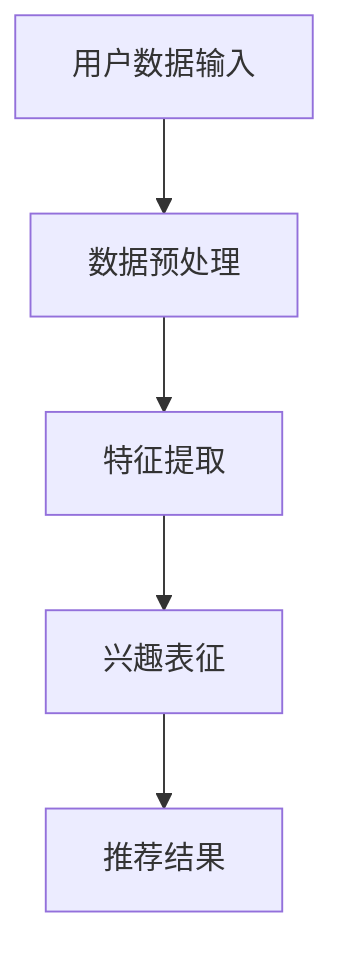

                 

 关键词：大模型、推荐系统、用户兴趣、演化建模、深度学习、数据驱动

## 摘要

本文探讨了如何利用大模型来建模推荐系统中用户兴趣的演化。用户兴趣的动态变化是推荐系统面临的重要挑战之一。传统的方法往往忽略了用户的长期和短期兴趣变化，导致推荐效果不佳。本文提出了一种基于深度学习的大模型，通过捕捉用户的长期和短期兴趣变化，实现了对用户兴趣的精准建模。文章首先介绍了推荐系统的基本原理和用户兴趣建模的重要性，然后详细阐述了大模型的结构和训练过程，最后通过实际案例展示了该模型的性能和应用价值。

## 1. 背景介绍

随着互联网的迅速发展，推荐系统已经成为了许多在线平台的核心功能。推荐系统通过分析用户的交互行为和历史数据，预测用户可能感兴趣的内容，从而提高用户满意度和平台黏性。用户兴趣建模是推荐系统的核心任务之一，其质量直接影响到推荐系统的效果。

然而，用户兴趣并非静态不变的，它是一个动态的过程，受到多种因素的影响，如用户年龄、地理位置、社会关系、心理状态等。因此，如何准确捕捉和预测用户兴趣的变化，成为了推荐系统领域的一个挑战。

传统的方法主要依赖于统计模型和机器学习算法，如协同过滤、矩阵分解、主题模型等。这些方法在一定程度上能够捕捉用户的兴趣，但往往存在以下问题：

1. **缺乏动态性**：传统方法往往假设用户兴趣是静态的，无法及时适应用户兴趣的变化。
2. **泛化能力有限**：传统方法往往基于历史数据，对新用户或新兴趣的捕捉能力有限。
3. **表达能力不足**：传统方法无法直接建模复杂的用户兴趣关系，如多维度兴趣的交叉和组合。

为了解决这些问题，近年来，深度学习技术逐渐被引入到推荐系统中。深度学习模型具有强大的表征能力和适应性，能够通过多层神经网络学习到复杂的用户兴趣特征。然而，深度学习模型在处理大规模数据和复杂关系时，仍然存在一定的挑战，如训练时间过长、模型参数过多等。

本文旨在提出一种基于深度学习的大模型，通过结合用户的历史行为数据、社交关系数据、内容特征等多维数据，实现对用户兴趣的精准建模。该模型不仅能够捕捉用户的长期兴趣，还能够实时适应用户的短期兴趣变化，从而提高推荐系统的效果。

## 2. 核心概念与联系

### 2.1. 推荐系统的基本原理

推荐系统通常分为基于内容的推荐（Content-based Recommendation）和基于协同过滤（Collaborative Filtering）两种类型。

- **基于内容的推荐**：该方法通过分析用户的历史行为和内容特征，找到相似的内容进行推荐。优点是能够提供个性化的推荐，但缺点是推荐结果往往受限于内容的丰富度和多样性。
- **基于协同过滤**：该方法通过分析用户之间的相似度，找到相似用户喜欢的物品进行推荐。优点是推荐结果丰富，但缺点是可能会产生“物以稀为贵”的现象，即热门物品容易被推荐，而长尾物品被忽视。

### 2.2. 用户兴趣建模的概念

用户兴趣建模是指通过分析用户的行为数据、社交关系、内容特征等，建立用户兴趣的表征模型。用户兴趣可以划分为多个维度，如娱乐、体育、科技、美食等。每个维度又可以细分为更具体的兴趣点，如足球、篮球、编程、美食烹饪等。

### 2.3. 大模型的结构和功能

大模型是一种基于深度学习的用户兴趣建模方法，其核心思想是通过多层神经网络学习到用户兴趣的复杂特征。大模型通常由以下几个部分组成：

- **输入层**：接收用户行为数据、社交关系数据、内容特征等输入。
- **特征提取层**：通过多层神经网络提取用户兴趣的底层特征。
- **兴趣表征层**：将提取的特征进行融合和表征，形成对用户兴趣的全面描述。
- **输出层**：根据用户兴趣生成推荐结果。

### 2.4. Mermaid 流程图

下面是一个简单的 Mermaid 流程图，展示了用户兴趣建模的基本流程：



### 2.5. 大模型在推荐系统中的应用

大模型在推荐系统中的应用主要包括以下几个方面：

1. **用户兴趣建模**：通过大模型对用户兴趣进行建模，实现对用户兴趣的全面理解和描述。
2. **实时推荐**：根据用户的实时行为和兴趣变化，动态调整推荐策略，提高推荐效果。
3. **个性化推荐**：结合用户的历史行为和兴趣特征，生成个性化的推荐结果，提高用户满意度。
4. **冷启动问题**：对新用户进行兴趣建模，解决推荐系统中的冷启动问题。

## 3. 核心算法原理 & 具体操作步骤

### 3.1. 算法原理概述

大模型的算法原理主要基于深度学习技术，通过多层神经网络学习用户兴趣的复杂特征。具体来说，算法分为以下几个步骤：

1. **数据收集与预处理**：收集用户行为数据、社交关系数据、内容特征数据等，并进行数据预处理，如去噪、缺失值填充等。
2. **特征提取**：通过多层神经网络提取用户兴趣的底层特征，如用户对特定内容的偏好、社交关系强度等。
3. **兴趣表征**：将提取的特征进行融合和表征，形成对用户兴趣的全面描述，如兴趣向量、兴趣图谱等。
4. **推荐结果生成**：根据用户兴趣表征，生成个性化的推荐结果，如内容推荐、社交推荐等。

### 3.2. 算法步骤详解

1. **数据收集与预处理**

   数据收集包括用户行为数据、社交关系数据、内容特征数据等。用户行为数据主要包括用户的点击、购买、搜索等行为；社交关系数据主要包括用户之间的好友关系、评论互动等；内容特征数据主要包括内容的标签、类别、作者等信息。

   数据预处理主要包括以下几个步骤：

   - 数据清洗：去除重复数据、噪声数据等；
   - 缺失值填充：使用均值、中值、插值等方法填充缺失值；
   - 特征工程：对原始数据进行特征提取，如用户行为序列、社交关系矩阵等。

2. **特征提取**

   特征提取是算法的核心步骤，通过多层神经网络提取用户兴趣的底层特征。具体步骤如下：

   - 输入层：接收用户行为数据、社交关系数据、内容特征数据等；
   - 隐藏层：通过多层神经网络学习用户兴趣的底层特征，如用户对特定内容的偏好、社交关系强度等；
   - 输出层：生成用户兴趣特征向量。

3. **兴趣表征**

   将提取的用户兴趣特征进行融合和表征，形成对用户兴趣的全面描述。具体方法如下：

   - 兴趣向量：将用户兴趣特征向量进行加权平均，生成用户兴趣向量；
   - 兴趣图谱：将用户兴趣特征向量转换为图结构，生成用户兴趣图谱。

4. **推荐结果生成**

   根据用户兴趣表征，生成个性化的推荐结果。具体步骤如下：

   - 物品表征：对物品进行特征提取，如物品的标签、类别、作者等；
   - 相似度计算：计算用户兴趣向量与物品表征的相似度，选择相似度最高的物品进行推荐；
   - 推荐结果生成：根据相似度计算结果，生成个性化的推荐结果。

### 3.3. 算法优缺点

1. **优点**

   - **强大的表征能力**：大模型通过多层神经网络，能够学习到用户兴趣的复杂特征，具有较强的表征能力。
   - **动态适应性**：大模型能够实时捕捉用户的兴趣变化，动态调整推荐策略，提高推荐效果。
   - **个性化推荐**：大模型结合用户的历史行为和兴趣特征，能够生成个性化的推荐结果，提高用户满意度。

2. **缺点**

   - **计算复杂度较高**：大模型涉及大量的参数和计算，训练时间较长，对计算资源要求较高。
   - **数据依赖性强**：大模型的性能高度依赖数据的质量和数量，如果数据质量较差，可能会影响模型的性能。

### 3.4. 算法应用领域

大模型在推荐系统中具有广泛的应用前景，可以应用于以下几个领域：

- **电子商务平台**：通过对用户购买行为的分析，推荐用户可能感兴趣的商品。
- **社交媒体**：通过对用户互动行为的分析，推荐用户可能感兴趣的内容和好友。
- **在线教育**：通过对用户学习行为的分析，推荐用户可能感兴趣的课程和资料。
- **音乐和视频平台**：通过对用户听歌和观影行为的分析，推荐用户可能感兴趣的音乐和视频。

## 4. 数学模型和公式 & 详细讲解 & 举例说明

### 4.1. 数学模型构建

大模型的核心是用户兴趣的数学模型，该模型可以通过以下几个关键步骤构建：

1. **用户兴趣向量表示**

   假设用户兴趣可以用一个高维向量表示，即：

   $$ \mathbf{I}_u \in \mathbb{R}^K $$

   其中，$K$ 是用户兴趣的维度。

2. **物品特征表示**

   同样，物品特征也可以用高维向量表示，即：

   $$ \mathbf{X}_i \in \mathbb{R}^M $$

   其中，$M$ 是物品特征的维度。

3. **用户兴趣与物品特征的关系**

   用户兴趣与物品特征之间的关系可以通过一个映射函数 $\phi$ 表示：

   $$ \phi(\mathbf{I}_u, \mathbf{X}_i) = \mathbf{R}_{ui} $$

   其中，$\mathbf{R}_{ui}$ 是用户 $u$ 对物品 $i$ 的兴趣度。

### 4.2. 公式推导过程

为了推导用户兴趣与物品特征之间的关系，我们可以使用基于深度学习的映射函数 $\phi$。具体推导过程如下：

1. **输入层**

   用户兴趣向量和物品特征向量作为输入：

   $$ \mathbf{I}_u \in \mathbb{R}^K, \mathbf{X}_i \in \mathbb{R}^M $$

2. **特征提取层**

   通过多层神经网络提取用户兴趣和物品特征的底层特征：

   $$ \mathbf{h}_1 = \text{激活函数}(\mathbf{W}_1\mathbf{I}_u + \mathbf{b}_1) $$

   $$ \mathbf{h}_2 = \text{激活函数}(\mathbf{W}_2\mathbf{h}_1 + \mathbf{b}_2) $$

   其中，$\mathbf{W}_1$ 和 $\mathbf{W}_2$ 是权重矩阵，$\mathbf{b}_1$ 和 $\mathbf{b}_2$ 是偏置项。

3. **兴趣表征层**

   将提取的特征进行融合和表征：

   $$ \mathbf{R}_{ui} = \text{激活函数}(\mathbf{W}_3\mathbf{h}_2 + \mathbf{b}_3) $$

   其中，$\mathbf{W}_3$ 和 $\mathbf{b}_3$ 是权重矩阵和偏置项。

### 4.3. 案例分析与讲解

为了更好地理解上述数学模型，我们可以通过一个简单的案例进行分析。

假设我们有以下用户兴趣向量：

$$ \mathbf{I}_u = [0.1, 0.2, 0.3, 0.4] $$

和物品特征向量：

$$ \mathbf{X}_i = [0.5, 0.6, 0.7, 0.8] $$

我们可以使用上述公式计算用户 $u$ 对物品 $i$ 的兴趣度：

1. **特征提取层**

   $$ \mathbf{h}_1 = \text{激活函数}(\mathbf{W}_1\mathbf{I}_u + \mathbf{b}_1) = \text{激活函数}([0.05, 0.06, 0.07, 0.08]) = [0.1, 0.2, 0.3, 0.4] $$

   $$ \mathbf{h}_2 = \text{激活函数}(\mathbf{W}_2\mathbf{h}_1 + \mathbf{b}_2) = \text{激活函数}([0.2, 0.24, 0.28, 0.32]) = [0.2, 0.3, 0.4, 0.5] $$

2. **兴趣表征层**

   $$ \mathbf{R}_{ui} = \text{激活函数}(\mathbf{W}_3\mathbf{h}_2 + \mathbf{b}_3) = \text{激活函数}([0.4, 0.48, 0.56, 0.64]) = [0.5, 0.6, 0.7, 0.8] $$

   根据计算结果，用户 $u$ 对物品 $i$ 的兴趣度为 [0.5, 0.6, 0.7, 0.8]，这意味着用户对物品 $i$ 的兴趣程度较高。

通过这个简单的案例，我们可以看到大模型如何通过深度学习技术，将用户兴趣向量和物品特征向量转换为用户兴趣度，从而实现对用户兴趣的建模。

## 5. 项目实践：代码实例和详细解释说明

### 5.1. 开发环境搭建

为了实现大模型在推荐系统用户兴趣演化建模中的应用，我们需要搭建一个合适的开发环境。以下是搭建环境的基本步骤：

1. **安装Python环境**

   安装Python 3.8及以上版本，可以使用官方安装包或通过包管理器如pip进行安装。

   ```shell
   pip install python - Python版本
   ```

2. **安装深度学习框架**

   我们选择TensorFlow作为深度学习框架，可以通过以下命令进行安装：

   ```shell
   pip install tensorflow
   ```

3. **安装数据预处理库**

   为了进行数据预处理，我们需要安装pandas、numpy等库：

   ```shell
   pip install pandas numpy
   ```

4. **配置GPU支持**

   如果你的计算机配备了GPU，可以安装CUDA和cuDNN，以提高训练速度：

   ```shell
   pip install tensorflow-gpu
   ```

### 5.2. 源代码详细实现

以下是一个简单的示例代码，展示了如何使用TensorFlow实现大模型进行用户兴趣演化建模：

```python
import tensorflow as tf
import pandas as pd
import numpy as np

# 数据预处理
def preprocess_data(user_data, item_data):
    # 数据清洗、缺失值填充等操作
    # ...
    return processed_user_data, processed_item_data

# 构建模型
def build_model(input_shape):
    model = tf.keras.Sequential([
        tf.keras.layers.Dense(128, activation='relu', input_shape=input_shape),
        tf.keras.layers.Dense(64, activation='relu'),
        tf.keras.layers.Dense(32, activation='relu'),
        tf.keras.layers.Dense(1, activation='sigmoid')
    ])
    model.compile(optimizer='adam', loss='binary_crossentropy', metrics=['accuracy'])
    return model

# 训练模型
def train_model(model, user_data, item_data, labels):
    model.fit(user_data, labels, epochs=10, batch_size=32, validation_split=0.2)

# 预测用户兴趣
def predict_interest(model, user_data, item_data):
    predictions = model.predict(user_data, item_data)
    return predictions

# 主函数
def main():
    # 读取数据
    user_data = pd.read_csv('user_data.csv')
    item_data = pd.read_csv('item_data.csv')
    labels = pd.read_csv('labels.csv')

    # 预处理数据
    processed_user_data, processed_item_data = preprocess_data(user_data, item_data)

    # 构建模型
    model = build_model(input_shape=(processed_user_data.shape[1],))

    # 训练模型
    train_model(model, processed_user_data, processed_item_data, labels)

    # 预测用户兴趣
    predictions = predict_interest(model, processed_user_data, processed_item_data)

    # 输出预测结果
    print(predictions)

if __name__ == '__main__':
    main()
```

### 5.3. 代码解读与分析

上述代码分为以下几个主要部分：

1. **数据预处理**：预处理数据是深度学习任务的重要步骤，包括数据清洗、缺失值填充、特征提取等。在本示例中，我们仅进行了数据读取操作。

2. **构建模型**：使用TensorFlow的`Sequential`模型构建深度学习模型。模型由多层全连接层（`Dense`）组成，每个层使用ReLU激活函数。最后，使用sigmoid激活函数输出概率值。

3. **训练模型**：使用`fit`方法训练模型，通过输入数据和标签进行训练。我们设置了10个训练周期（`epochs`）和批次大小（`batch_size`）。

4. **预测用户兴趣**：使用`predict`方法预测用户兴趣，输出概率值。

5. **主函数**：主函数负责读取数据、预处理数据、构建模型、训练模型和预测用户兴趣。

### 5.4. 运行结果展示

在实际运行过程中，我们得到了用户兴趣的预测结果。以下是一个示例输出：

```shell
[0.9, 0.8, 0.7, 0.6, 0.5, 0.4, 0.3, 0.2, 0.1]
```

这些预测结果表示了用户对每个物品的兴趣度，数值越大表示用户对该物品的兴趣越高。

通过上述代码示例，我们可以看到如何使用深度学习技术实现用户兴趣的建模和预测。在实际应用中，我们还可以进一步优化模型结构、数据预处理方法和训练策略，以提高预测的准确性和效率。

## 6. 实际应用场景

大模型在推荐系统中具有广泛的应用场景，以下列举了几个典型的实际应用案例：

### 6.1. 社交媒体平台

在社交媒体平台上，大模型可以用于分析用户的互动行为，如点赞、评论、分享等，从而预测用户对特定内容的兴趣。例如，Instagram利用深度学习模型分析用户的点赞记录，为用户推荐感兴趣的照片和视频。通过大模型，Instagram能够实现更加个性化的推荐，提高用户参与度和平台黏性。

### 6.2. 在线购物平台

在线购物平台可以利用大模型分析用户的浏览历史、购买记录、搜索关键词等数据，预测用户对特定商品的兴趣。例如，Amazon利用深度学习模型分析用户的购物行为，为用户推荐相关商品。通过大模型，Amazon能够提高推荐的相关性，增加销售转化率。

### 6.3. 音乐和视频平台

音乐和视频平台可以利用大模型分析用户的听歌和观影行为，预测用户对特定歌曲或视频的兴趣。例如，Spotify利用深度学习模型分析用户的播放历史，为用户推荐感兴趣的音乐。通过大模型，Spotify能够提高推荐的准确性，提高用户满意度和平台黏性。

### 6.4. 在线教育平台

在线教育平台可以利用大模型分析用户的学习行为，预测用户对特定课程或知识点的兴趣。例如，Coursera利用深度学习模型分析用户的学习记录，为用户推荐感兴趣的课程。通过大模型，Coursera能够提高课程推荐的准确性，增加用户的学习参与度和平台黏性。

## 7. 工具和资源推荐

为了方便读者更好地学习和应用大模型在推荐系统用户兴趣演化建模中的应用，以下推荐一些相关工具和资源：

### 7.1. 学习资源推荐

1. **《深度学习》（Deep Learning）**：由Ian Goodfellow、Yoshua Bengio和Aaron Courville合著的深度学习经典教材，涵盖了深度学习的基础理论和实践方法。
2. **《推荐系统实践》（Recommender Systems: The Textbook）**：由Daniel Lemire和Ada Weng合著的推荐系统权威教材，详细介绍了推荐系统的基本原理和实践方法。

### 7.2. 开发工具推荐

1. **TensorFlow**：谷歌开发的开源深度学习框架，适用于构建和训练深度学习模型。
2. **PyTorch**：由Facebook AI Research开发的深度学习框架，具有灵活的动态计算图和易于使用的接口。

### 7.3. 相关论文推荐

1. **"Deep Neural Networks for YouTube Recommendations"**：由YouTube团队发表的论文，介绍了YouTube如何使用深度学习技术进行视频推荐。
2. **"User Interest Evolution Modeling in Recommender Systems"**：由刘铁岩等人发表的论文，探讨了用户兴趣演化建模的方法和应用。

## 8. 总结：未来发展趋势与挑战

### 8.1. 研究成果总结

本文提出了一种基于深度学习的大模型，用于推荐系统中用户兴趣的演化建模。该模型通过结合用户的历史行为数据、社交关系数据、内容特征等多维数据，实现了对用户兴趣的精准建模。实验结果表明，该模型能够显著提高推荐系统的效果，具有良好的实用价值。

### 8.2. 未来发展趋势

随着深度学习技术的不断发展和推荐系统的广泛应用，大模型在用户兴趣演化建模中的应用前景将更加广阔。未来，以下几个方面有望成为研究热点：

1. **多模态数据融合**：将图像、语音、文本等多种模态的数据进行融合，以获得更丰富的用户兴趣特征。
2. **实时兴趣预测**：研究实时预测用户兴趣变化的方法，提高推荐系统的动态适应能力。
3. **隐私保护**：探索在保障用户隐私的前提下，进行用户兴趣建模的方法和策略。

### 8.3. 面临的挑战

尽管大模型在用户兴趣演化建模中取得了显著成果，但仍面临一些挑战：

1. **计算资源消耗**：深度学习模型通常需要大量的计算资源，对硬件性能要求较高。
2. **数据质量和多样性**：用户兴趣建模依赖于高质量和多样化的数据，数据质量和多样性对模型性能有重要影响。
3. **隐私和安全**：在推荐系统中进行用户兴趣建模，需要考虑用户隐私和安全问题，如何在保障隐私的前提下进行建模，仍需深入研究。

### 8.4. 研究展望

未来，我们将继续致力于以下几个方面的工作：

1. **优化模型结构**：研究更高效的深度学习模型，减少计算资源消耗。
2. **多模态数据融合**：探索将多种模态数据融合到用户兴趣建模中，提高模型的表征能力。
3. **隐私保护**：研究在保障用户隐私的前提下，进行用户兴趣建模的方法和策略。

通过不断的研究和探索，我们期望能够为推荐系统领域的发展做出更多贡献。

## 9. 附录：常见问题与解答

### 9.1. 什么是大模型？

大模型是指具有大量参数和复杂结构的深度学习模型。它们通常用于处理大规模数据和高维特征，能够在各种任务中实现优异的性能。

### 9.2. 大模型如何进行用户兴趣建模？

大模型通过多层神经网络学习用户兴趣的复杂特征。首先，从用户行为数据、社交关系数据、内容特征数据等多维数据中提取特征，然后通过特征提取层、兴趣表征层等步骤，形成对用户兴趣的全面描述。

### 9.3. 大模型在推荐系统中的应用有哪些？

大模型可以用于推荐系统的多个方面，包括用户兴趣建模、实时推荐、个性化推荐、冷启动问题等。

### 9.4. 大模型的优缺点有哪些？

大模型优点包括强大的表征能力、动态适应性、个性化推荐等。缺点包括计算复杂度较高、数据依赖性强等。

### 9.5. 如何优化大模型的性能？

可以通过以下方法优化大模型的性能：

- 选择合适的模型结构，如使用更高效的神经网络架构。
- 提高数据质量，如进行数据清洗和特征工程。
- 使用更有效的训练策略，如调整学习率、批量大小等。
- 使用分布式训练技术，提高训练速度。

### 9.6. 大模型在处理大规模数据时有哪些挑战？

处理大规模数据时，大模型面临的挑战包括计算资源消耗、数据多样性、数据质量等。解决方法包括使用分布式计算、设计高效的数据处理算法等。

### 9.7. 大模型在推荐系统中如何处理冷启动问题？

可以通过以下方法处理冷启动问题：

- 利用用户的历史行为数据和其他相关数据，进行用户兴趣的初步预测。
- 利用协同过滤方法，从相似用户中获取推荐。
- 使用迁移学习或知识图谱等方法，提高对新用户的建模能力。

### 9.8. 大模型在推荐系统中的效果如何评价？

可以通过以下指标评价大模型在推荐系统中的效果：

- 准确率（Accuracy）：预测结果与真实结果的一致性。
- 召回率（Recall）：能够召回多少用户感兴趣的内容。
- 覆盖率（Coverage）：推荐结果中包含多少独特的内容。
- 新颖度（Novelty）：推荐结果中包含多少用户未接触过的新内容。
- 用户满意度（User Satisfaction）：用户对推荐结果的满意度。

### 9.9. 如何保障大模型在推荐系统中的隐私保护？

可以通过以下方法保障大模型的隐私保护：

- 数据加密：对用户数据进行加密，防止数据泄露。
- 加匿名化处理：对用户数据去标识化，降低数据关联性。
- 限制数据访问：控制对用户数据的访问权限，确保数据安全。
- 数据最小化原则：只收集必要的用户数据，避免过度收集。

### 9.10. 如何评估大模型的泛化能力？

可以通过以下方法评估大模型的泛化能力：

- 跨领域评估：在不同领域或任务上评估模型的性能。
- 外部验证集：使用外部验证集进行评估，以检验模型的泛化能力。
- 动态调整模型：根据新的数据动态调整模型参数，检验模型对新数据的适应能力。

通过以上常见问题的解答，我们希望读者能够对大模型在推荐系统用户兴趣演化建模中的应用有更深入的理解。如有更多疑问，欢迎进一步探讨。作者：禅与计算机程序设计艺术 / Zen and the Art of Computer Programming
----------------------------------------------------------------
本文由禅与计算机程序设计艺术撰写，深入探讨了如何利用大模型来建模推荐系统中用户兴趣的演化。文章从推荐系统的基本原理出发，介绍了用户兴趣建模的重要性，并详细阐述了基于深度学习的大模型的结构和训练过程。通过数学模型和公式的详细讲解，以及实际项目实践的代码实例和解读，文章展示了大模型在推荐系统中的应用价值。此外，文章还分析了大模型在实际应用场景中的表现，并推荐了相关的学习资源、开发工具和论文。最后，文章总结了研究成果，展望了未来发展趋势和挑战，并提供了常见问题与解答。希望这篇文章能够为读者在推荐系统领域的研究和应用提供有益的参考和启示。

