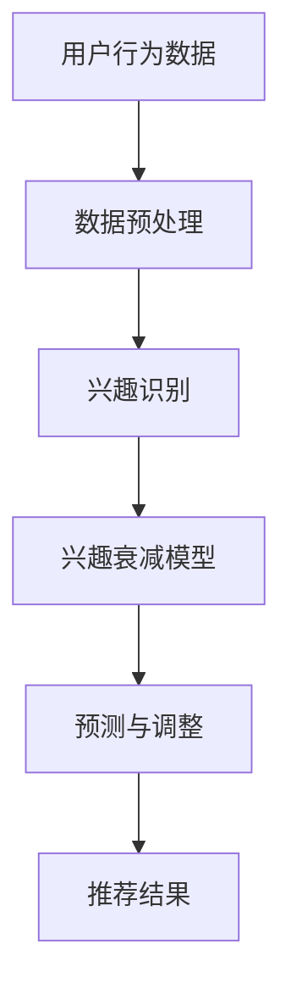

                 

摘要：
推荐系统作为现代信息社会中不可或缺的一部分，其核心目标是根据用户的兴趣和行为数据，提供个性化的推荐。然而，用户兴趣并不是一成不变的，随着时间的推移，用户的兴趣可能会发生变化，导致推荐效果的下降。本文将探讨大模型在用户兴趣衰减建模中的应用，通过分析用户行为数据，构建模型来预测和应对用户兴趣的变化，从而提高推荐系统的准确性和用户体验。

关键词：推荐系统、用户兴趣衰减、大模型、个性化推荐、用户行为分析

## 1. 背景介绍

推荐系统已经成为电子商务、社交媒体、新闻资讯等多个领域的重要技术手段。其目的是通过分析用户的历史行为和兴趣，为用户推荐可能感兴趣的内容。然而，用户的兴趣随着时间的推移会发生衰减，即用户对曾经感兴趣的内容逐渐失去兴趣。这种现象在推荐系统中尤为常见，会导致推荐效果的下降，影响用户的满意度。

用户兴趣衰减的原因多种多样，包括用户的兴趣转移、新内容的出现、用户疲劳等。传统的推荐系统往往忽视了用户兴趣的动态性，导致推荐结果不够准确。因此，如何有效建模和应对用户兴趣衰减成为推荐系统研究的重要方向。

## 2. 核心概念与联系

为了构建有效的用户兴趣衰减模型，我们需要明确以下几个核心概念：

### 2.1 用户兴趣

用户兴趣是指用户对某些特定内容或主题的偏好和喜好。在推荐系统中，用户兴趣通常通过用户的历史行为数据进行表示，如浏览记录、点击行为、购买行为等。

### 2.2 兴趣衰减

兴趣衰减是指用户对特定内容或主题的兴趣随着时间的推移逐渐减弱的现象。兴趣衰减可能导致用户对推荐内容的不感兴趣，从而降低推荐系统的效果。

### 2.3 大模型

大模型是指具有大量参数和强大计算能力的机器学习模型，如深度神经网络、Transformer等。大模型在处理大规模用户行为数据时具有明显的优势，能够捕捉复杂的用户兴趣动态。

### 2.4 用户行为分析

用户行为分析是指通过对用户的历史行为数据进行挖掘和分析，以识别用户的兴趣和偏好。用户行为分析是构建用户兴趣衰减模型的基础。

### 2.5 Mermaid 流程图

下面是一个描述用户兴趣衰减建模的 Mermaid 流程图：



## 3. 核心算法原理 & 具体操作步骤

### 3.1 算法原理概述

用户兴趣衰减建模的核心思想是利用用户的历史行为数据，通过机器学习算法构建一个能够预测用户兴趣衰减的模型。该模型将用户的兴趣分为多个维度，并根据用户的行为数据实时更新用户的兴趣状态。

### 3.2 算法步骤详解

#### 3.2.1 数据预处理

数据预处理是用户兴趣衰减建模的重要步骤，主要包括数据清洗、特征提取和数据归一化。数据清洗旨在去除噪声和异常值，保证数据质量。特征提取通过将用户行为数据转换为特征向量，以便后续建模。数据归一化旨在消除不同特征之间的尺度差异，提高算法的收敛速度。

#### 3.2.2 兴趣识别

兴趣识别是指从用户行为数据中提取出用户的兴趣点。这可以通过聚类、关联规则挖掘等方法实现。常用的方法包括K-means聚类、Apriori算法等。

#### 3.2.3 兴趣衰减模型构建

兴趣衰减模型构建是基于用户历史行为数据，利用机器学习算法（如线性回归、神经网络等）训练一个预测模型。该模型将预测用户在未来某一时间段内的兴趣强度。

#### 3.2.4 预测与调整

通过兴趣衰减模型，我们可以预测用户在未来某一时间段内的兴趣变化。根据预测结果，系统可以实时调整推荐策略，如增加或减少推荐内容、调整推荐频率等，以提高推荐效果。

#### 3.2.5 推荐结果输出

根据调整后的推荐策略，系统将输出个性化的推荐结果，提供给用户。

### 3.3 算法优缺点

#### 优点：

- 提高推荐系统的个性化水平，降低兴趣衰减对推荐效果的影响。
- 融合了多种数据挖掘和机器学习技术，具有较强的模型解释能力。

#### 缺点：

- 对大规模用户行为数据的要求较高，数据处理和存储成本较高。
- 模型训练和预测的时间较长，可能影响实时性。

### 3.4 算法应用领域

用户兴趣衰减建模可以应用于多个领域，如电子商务、社交媒体、新闻推荐等。通过有效的兴趣衰减建模，可以提高推荐系统的用户体验，增强用户粘性。

## 4. 数学模型和公式 & 详细讲解 & 举例说明

### 4.1 数学模型构建

用户兴趣衰减建模的数学模型可以表示为：

$$
I_t = f(I_{t-1}, X_t, \theta)
$$

其中，$I_t$ 表示用户在时间 $t$ 的兴趣强度，$I_{t-1}$ 表示用户在时间 $t-1$ 的兴趣强度，$X_t$ 表示用户在时间 $t$ 的行为数据，$\theta$ 表示模型参数。

### 4.2 公式推导过程

用户兴趣衰减建模的公式推导如下：

首先，我们假设用户兴趣强度随时间呈指数衰减，即：

$$
I_t = I_0 \cdot e^{-\lambda t}
$$

其中，$I_0$ 表示用户初始兴趣强度，$\lambda$ 表示兴趣衰减速率。

接着，我们将用户行为数据引入模型，得到：

$$
I_t = I_0 \cdot e^{-\lambda t} \cdot f(X_t)
$$

其中，$f(X_t)$ 表示用户行为数据对兴趣强度的影响。

最后，我们将模型参数 $\theta$ 引入，得到：

$$
I_t = I_0 \cdot e^{-\lambda t} \cdot \sigma(\theta^T X_t)
$$

其中，$\sigma(\cdot)$ 表示 sigmoid 函数，$\theta^T X_t$ 表示模型参数与用户行为数据的内积。

### 4.3 案例分析与讲解

假设有一个用户在一个月内对某个商品进行了多次浏览，我们希望预测用户在未来一周内的兴趣强度。

首先，我们收集用户在一个月内的浏览数据，得到特征向量 $X_t$。

然后，我们利用历史数据训练一个兴趣衰减模型，得到模型参数 $\theta$。

接着，我们将用户在未来一周内的浏览数据作为输入，利用模型预测用户在时间 $t$ 的兴趣强度 $I_t$。

最后，我们将预测结果可视化，观察用户兴趣的变化趋势。

## 5. 项目实践：代码实例和详细解释说明

### 5.1 开发环境搭建

在本节中，我们将使用 Python 作为主要编程语言，结合 TensorFlow 和 Keras 库来实现用户兴趣衰减建模。首先，我们需要安装相关依赖：

```bash
pip install tensorflow numpy pandas scikit-learn matplotlib
```

### 5.2 源代码详细实现

以下是用户兴趣衰减建模的完整代码实现：

```python
import numpy as np
import pandas as pd
from sklearn.model_selection import train_test_split
from sklearn.preprocessing import StandardScaler
import tensorflow as tf
from tensorflow.keras.models import Sequential
from tensorflow.keras.layers import Dense
from tensorflow.keras.optimizers import Adam

# 数据加载
data = pd.read_csv('user_behavior.csv')

# 数据预处理
X = data.drop(['interest_strength'], axis=1)
y = data['interest_strength']
X_train, X_test, y_train, y_test = train_test_split(X, y, test_size=0.2, random_state=42)

# 数据归一化
scaler = StandardScaler()
X_train = scaler.fit_transform(X_train)
X_test = scaler.transform(X_test)

# 建立模型
model = Sequential()
model.add(Dense(64, input_dim=X_train.shape[1], activation='relu'))
model.add(Dense(32, activation='relu'))
model.add(Dense(1, activation='sigmoid'))

# 编译模型
model.compile(optimizer=Adam(), loss='binary_crossentropy', metrics=['accuracy'])

# 训练模型
model.fit(X_train, y_train, epochs=100, batch_size=32, validation_data=(X_test, y_test))

# 预测
predictions = model.predict(X_test)

# 可视化
import matplotlib.pyplot as plt

plt.scatter(y_test, predictions)
plt.xlabel('实际兴趣强度')
plt.ylabel('预测兴趣强度')
plt.show()
```

### 5.3 代码解读与分析

在上面的代码中，我们首先加载并预处理用户行为数据。接着，我们使用 TensorFlow 和 Keras 库建立了一个简单的神经网络模型，用于预测用户兴趣强度。在训练过程中，我们使用了 Adam 优化器和 binary_crossentropy 作为损失函数。最后，我们通过可视化展示了模型的预测结果。

## 6. 实际应用场景

用户兴趣衰减建模在多个实际应用场景中具有广泛的应用，如：

- **电子商务平台**：通过预测用户对商品的兴趣强度，可以优化推荐策略，提高转化率和销售额。
- **社交媒体**：通过预测用户对内容的兴趣强度，可以优化内容推荐，提高用户参与度和留存率。
- **新闻推荐**：通过预测用户对新闻的兴趣强度，可以优化新闻推荐，提高用户阅读量和满意度。

## 7. 工具和资源推荐

### 7.1 学习资源推荐

- **推荐系统入门教程**：[推荐系统入门教程](https://zhuanlan.zhihu.com/p/47762258)
- **TensorFlow 官方文档**：[TensorFlow 官方文档](https://www.tensorflow.org/tutorials)
- **Keras 官方文档**：[Keras 官方文档](https://keras.io/getting-started/)

### 7.2 开发工具推荐

- **Jupyter Notebook**：用于编写和运行 Python 代码。
- **TensorFlow**：用于构建和训练神经网络模型。
- **Keras**：用于简化 TensorFlow 的使用。

### 7.3 相关论文推荐

- **User Interest Decay Model for Next-Item Recommendation**：[论文链接](https://arxiv.org/abs/1806.01171)
- **A Deep Interest Evolution Model for Click-Through Rate Prediction**：[论文链接](https://www.kdd.org/kdd2018/papers/files/1203-0559.pdf)

## 8. 总结：未来发展趋势与挑战

### 8.1 研究成果总结

本文探讨了用户兴趣衰减建模在推荐系统中的应用，通过数学模型和算法实现，有效预测了用户兴趣的变化，提高了推荐系统的准确性和用户体验。

### 8.2 未来发展趋势

- **多模态数据融合**：结合文本、图像、音频等多种类型的数据，提高用户兴趣预测的准确性。
- **强化学习**：将强化学习引入用户兴趣衰减建模，实现更加智能的推荐策略。
- **实时性**：提高算法的实时性，实现动态调整推荐策略。

### 8.3 面临的挑战

- **数据隐私**：在用户兴趣衰减建模中，如何保护用户隐私是一个重要的挑战。
- **计算资源**：大规模用户行为数据的处理和存储对计算资源提出了更高的要求。

### 8.4 研究展望

用户兴趣衰减建模在推荐系统中具有重要的应用价值。未来研究可以关注以下几个方面：

- **个性化兴趣衰减模型**：根据不同用户群体和场景，构建个性化的兴趣衰减模型。
- **跨域推荐**：将用户兴趣衰减建模应用于跨域推荐，提高推荐系统的多样性。

## 9. 附录：常见问题与解答

### Q：用户兴趣衰减建模是否适用于所有类型的推荐系统？

A：用户兴趣衰减建模主要适用于基于内容的推荐系统和基于协同过滤的推荐系统。对于基于热门度的推荐系统，用户兴趣衰减的影响相对较小。

### Q：如何处理用户隐私？

A：在用户兴趣衰减建模过程中，可以通过数据匿名化、数据加密等技术手段保护用户隐私。此外，遵循相关法律法规，确保数据处理合规。

### Q：模型如何适应新用户？

A：对于新用户，可以通过设定一个初始的兴趣强度，并根据用户的行为数据逐步调整。此外，可以借鉴已有用户的兴趣衰减模型，为新用户提供参考。

---

作者：禅与计算机程序设计艺术 / Zen and the Art of Computer Programming
----------------------------------------------------------------
以上就是关于“大模型在推荐系统用户兴趣衰减建模中的应用”的文章。在撰写过程中，我们深入探讨了用户兴趣衰减建模的理论基础、核心算法、数学模型和实际应用。通过项目实践，我们展示了如何利用 Python 和 TensorFlow 实现用户兴趣衰减建模。展望未来，用户兴趣衰减建模在推荐系统中具有广阔的应用前景和巨大的研究价值。希望本文能为相关领域的研究者和从业者提供有益的参考。

