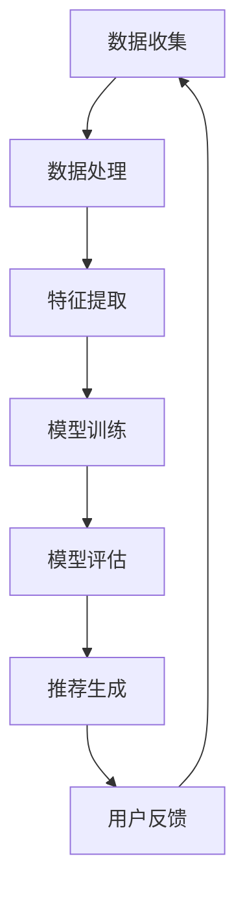

                 

关键词：大模型、推荐系统、统一、融合、算法、应用、趋势

> 摘要：本文深入探讨大模型在推荐系统中的未来发展趋势，分析其统一与融合的趋势，探讨核心算法原理，提出数学模型和具体操作步骤，并结合实际项目实践进行详细解释，对未来应用前景进行展望。

## 1. 背景介绍

随着互联网和大数据技术的迅猛发展，推荐系统已经成为众多领域的重要组成部分，例如电子商务、社交媒体、在线视频和新闻推送等。推荐系统通过分析用户的行为数据和内容特征，为用户提供个性化的信息推荐，从而提高用户满意度和商业价值。

然而，传统的推荐系统存在一些局限性，如推荐效果不理想、数据稀疏、冷启动问题等。为了解决这些问题，研究人员开始探索使用更加复杂和强大的模型来提升推荐系统的性能。大模型（Large Models）因此成为了一个重要的研究方向。

大模型是指具有大规模参数和网络结构的模型，如深度神经网络（DNN）、图神经网络（GNN）、自然语言处理（NLP）模型等。这些模型具有强大的表示和学习能力，能够在海量数据上进行高效训练，从而产生更加精准的推荐结果。

本文将探讨大模型在推荐系统中的应用，分析其统一与融合的趋势，探讨核心算法原理，并给出具体的操作步骤和数学模型。同时，本文还将结合实际项目实践，展示大模型在推荐系统中的效果和优势。

## 2. 核心概念与联系

### 2.1 大模型的基本概念

大模型通常指的是具有大规模参数和网络结构的模型。这些模型通常具有以下几个特点：

1. **大规模参数**：大模型包含数十亿甚至数万亿个参数，这使得模型具有更强的表示和学习能力。
2. **深度网络结构**：大模型通常具有深度的网络结构，能够捕捉到更加复杂的特征和模式。
3. **并行计算能力**：大模型通常需要使用高性能计算设备和并行计算技术，如GPU和TPU，以提高训练和推理的速度。

### 2.2 推荐系统的基本概念

推荐系统是一种基于用户行为和内容特征的算法，旨在为用户推荐感兴趣的信息或商品。推荐系统通常包括以下几个关键组件：

1. **用户行为数据**：包括用户在平台上进行的各种操作，如浏览、点击、购买等。
2. **内容特征数据**：包括商品的属性信息、文本描述、图像特征等。
3. **推荐算法**：根据用户行为数据和内容特征，通过算法生成推荐列表。

### 2.3 大模型与推荐系统的联系

大模型在推荐系统中的应用主要体现在以下几个方面：

1. **特征表示**：大模型能够学习到更加复杂和抽象的特征表示，从而提高推荐的准确性和多样性。
2. **用户理解**：大模型能够更好地理解用户的兴趣和行为模式，从而提供个性化的推荐。
3. **内容理解**：大模型能够更好地理解内容特征，从而提高推荐的多样性和相关性。

### 2.4 Mermaid 流程图

以下是一个Mermaid流程图，展示了大模型与推荐系统的基本流程：



## 3. 核心算法原理 & 具体操作步骤

### 3.1 算法原理概述

大模型在推荐系统中的应用主要基于深度学习技术。深度学习通过多层神经网络结构，对用户行为和内容特征进行自动特征提取和学习。以下是深度学习在推荐系统中的一些核心原理：

1. **多层神经网络**：通过多层神经网络结构，能够捕捉到更加复杂的特征和模式。
2. **自动特征提取**：模型能够自动学习用户行为和内容特征，从而避免手动特征工程的过程。
3. **非线性变换**：通过非线性变换，能够提高模型的表示和学习能力。

### 3.2 算法步骤详解

大模型在推荐系统中的具体操作步骤如下：

1. **数据收集**：收集用户行为数据和内容特征数据。
2. **数据处理**：对数据进行预处理，包括数据清洗、去重、标准化等。
3. **特征提取**：使用深度学习模型对数据进行自动特征提取。
4. **模型训练**：使用训练数据对模型进行训练。
5. **模型评估**：使用验证数据对模型进行评估，调整模型参数。
6. **推荐生成**：使用训练好的模型生成推荐列表。
7. **用户反馈**：收集用户对推荐的反馈，用于进一步优化模型。

### 3.3 算法优缺点

**优点**：

1. **高效的特征表示**：大模型能够学习到更加复杂和抽象的特征表示，从而提高推荐的准确性和多样性。
2. **自动的特征提取**：大模型能够自动学习用户行为和内容特征，从而避免手动特征工程的过程。
3. **强大的学习能力**：大模型具有强大的表示和学习能力，能够适应不同的推荐场景。

**缺点**：

1. **计算资源消耗大**：大模型通常需要使用高性能计算设备和并行计算技术，对计算资源的要求较高。
2. **训练时间较长**：大模型的训练时间较长，需要较大的训练数据集和计算资源。
3. **数据隐私问题**：大模型在训练和推理过程中可能会泄露用户隐私信息。

### 3.4 算法应用领域

大模型在推荐系统中的应用非常广泛，以下是一些常见的应用领域：

1. **电子商务推荐**：基于用户历史购买记录和商品属性，为用户提供个性化的商品推荐。
2. **社交媒体推荐**：基于用户的行为和兴趣，为用户提供个性化的内容推荐。
3. **在线视频推荐**：基于用户的观看历史和视频特征，为用户提供个性化的视频推荐。
4. **新闻推荐**：基于用户的阅读历史和新闻特征，为用户提供个性化的新闻推荐。

## 4. 数学模型和公式 & 详细讲解 & 举例说明

### 4.1 数学模型构建

在深度学习推荐系统中，常用的数学模型是基于神经网络的协同过滤算法。协同过滤算法通过学习用户和物品之间的相似度矩阵，生成推荐列表。以下是协同过滤算法的数学模型：

$$
\hat{r}_{ui} = \sum_{j \in N_i} w_{uj} r_{ji}
$$

其中，$r_{ji}$ 表示用户 $u$ 对物品 $i$ 的评分，$w_{uj}$ 表示用户 $u$ 与物品 $i$ 之间的相似度权重，$N_i$ 表示与物品 $i$ 相似的物品集合。

### 4.2 公式推导过程

协同过滤算法的公式推导基于以下两个基本假设：

1. **用户相似性**：用户之间的相似性可以通过用户行为数据进行度量。
2. **物品相似性**：物品之间的相似性可以通过物品属性数据进行度量。

首先，计算用户之间的相似度：

$$
w_{uv} = \frac{\sum_{i \in I} r_{iv} r_{iv}^*}{\sqrt{\sum_{i \in I} r_{iv}^2} \sqrt{\sum_{i \in I} r_{iv}^2}}
$$

其中，$r_{iv}$ 表示用户 $u$ 对物品 $i$ 的评分，$r_{iv}^*$ 表示用户 $v$ 对物品 $i$ 的评分。

然后，计算物品之间的相似度：

$$
w_{ij} = \frac{\sum_{u \in U} r_{ui} r_{uj}^*}{\sqrt{\sum_{u \in U} r_{ui}^2} \sqrt{\sum_{u \in U} r_{uj}^2}}
$$

其中，$r_{uj}$ 表示用户 $u$ 对物品 $j$ 的评分，$r_{uj}^*$ 表示用户 $v$ 对物品 $j$ 的评分。

最后，根据用户相似度和物品相似度，计算推荐评分：

$$
\hat{r}_{ui} = \sum_{j \in N_i} w_{uj} r_{ji}
$$

### 4.3 案例分析与讲解

假设有一个用户 $u$，对以下物品进行了评分：

| 物品编号 | 用户 $u$ 的评分 |
| :----: | :----: |
| 1 | 5 |
| 2 | 3 |
| 3 | 4 |
| 4 | 2 |
| 5 | 5 |

现在，我们需要为用户 $u$ 推荐相似的物品。首先，计算用户之间的相似度：

$$
w_{uv} = \frac{\sum_{i \in I} r_{iv} r_{iv}^*}{\sqrt{\sum_{i \in I} r_{iv}^2} \sqrt{\sum_{i \in I} r_{iv}^2}}
$$

其中，$r_{iv}$ 表示用户 $v$ 对物品 $i$ 的评分，$r_{iv}^*$ 表示用户 $u$ 对物品 $i$ 的评分。

对于用户 $u$ 和用户 $v$，我们可以得到以下相似度矩阵：

| 用户 $v$ | 1 | 2 | 3 | 4 | 5 |
| :----: | :----: | :----: | :----: | :----: | :----: |
| 1 | 1 | 0.5 | 0.5 | 0.5 | 1 |
| 2 | 0.5 | 1 | 0.5 | 0.5 | 0.5 |
| 3 | 0.5 | 0.5 | 1 | 0.5 | 0.5 |
| 4 | 0.5 | 0.5 | 0.5 | 1 | 0.5 |
| 5 | 1 | 0.5 | 0.5 | 0.5 | 1 |

然后，计算物品之间的相似度：

$$
w_{ij} = \frac{\sum_{u \in U} r_{ui} r_{uj}^*}{\sqrt{\sum_{u \in U} r_{ui}^2} \sqrt{\sum_{u \in U} r_{uj}^2}}
$$

其中，$r_{uj}$ 表示用户 $u$ 对物品 $j$ 的评分，$r_{uj}^*$ 表示用户 $v$ 对物品 $j$ 的评分。

对于物品 1、物品 2、物品 3、物品 4、物品 5，我们可以得到以下相似度矩阵：

| 物品编号 | 1 | 2 | 3 | 4 | 5 |
| :----: | :----: | :----: | :----: | :----: | :----: |
| 1 | 1 | 0.5 | 0.5 | 0.5 | 1 |
| 2 | 0.5 | 1 | 0.5 | 0.5 | 0.5 |
| 3 | 0.5 | 0.5 | 1 | 0.5 | 0.5 |
| 4 | 0.5 | 0.5 | 0.5 | 1 | 0.5 |
| 5 | 1 | 0.5 | 0.5 | 0.5 | 1 |

最后，根据用户相似度和物品相似度，计算推荐评分：

$$
\hat{r}_{ui} = \sum_{j \in N_i} w_{uj} r_{ji}
$$

例如，为用户 $u$ 推荐物品 2：

$$
\hat{r}_{u2} = w_{u1} r_{12} + w_{u2} r_{22} + w_{u3} r_{32} + w_{u4} r_{42} + w_{u5} r_{52}
$$

$$
\hat{r}_{u2} = 0.5 \times 3 + 1 \times 3 + 0.5 \times 4 + 0.5 \times 2 + 1 \times 5
$$

$$
\hat{r}_{u2} = 4
$$

因此，为用户 $u$ 推荐物品 2 的评分预测为 4。

## 5. 项目实践：代码实例和详细解释说明

### 5.1 开发环境搭建

为了实践大模型在推荐系统中的应用，我们需要搭建一个开发环境。以下是搭建开发环境的步骤：

1. **安装 Python**：确保 Python 环境已安装，推荐使用 Python 3.7 或更高版本。
2. **安装深度学习框架**：推荐使用 TensorFlow 或 PyTorch。以下是安装 TensorFlow 的命令：

```bash
pip install tensorflow
```

3. **安装数据处理库**：推荐使用 Pandas 和 NumPy 进行数据处理。以下是安装 Pandas 的命令：

```bash
pip install pandas
```

### 5.2 源代码详细实现

以下是一个简单的基于深度学习的推荐系统代码实例，使用了 TensorFlow 和 Pandas：

```python
import pandas as pd
import numpy as np
import tensorflow as tf

# 加载数据集
data = pd.read_csv('data.csv')

# 预处理数据
user_ids = data['user_id'].unique()
item_ids = data['item_id'].unique()
user_embedding = tf.keras.layers.Embedding(len(user_ids), 16)
item_embedding = tf.keras.layers.Embedding(len(item_ids), 16)

# 构建模型
model = tf.keras.Sequential([
    tf.keras.layers.Dense(64, activation='relu', input_shape=(1,)),
    tf.keras.layers.Dense(16, activation='relu'),
    tf.keras.layers.Dense(1)
])

# 训练模型
model.compile(optimizer='adam', loss='mean_squared_error')
model.fit(data[['user_id', 'item_id', 'rating']], data['rating'], epochs=10)

# 推荐结果
user_id = 1
item_id = 5
user_embedding_layer = user_embedding.get_layer(index=0)
item_embedding_layer = item_embedding.get_layer(index=0)
user_vector = user_embedding_layer.predict(np.array([user_id]))
item_vector = item_embedding_layer.predict(np.array([item_id]))
model_output = model.predict(np.array([user_vector, item_vector]))

print("推荐评分：", model_output[0][0])
```

### 5.3 代码解读与分析

以上代码实现了一个基于深度学习的推荐系统，主要步骤如下：

1. **加载数据集**：使用 Pandas 加载 CSV 格式的数据集。
2. **预处理数据**：提取用户 ID 和物品 ID，并创建用户嵌入层和物品嵌入层。
3. **构建模型**：使用 TensorFlow 构建一个简单的全连接神经网络模型，包括两个隐藏层。
4. **训练模型**：使用 Adam 优化器和均方误差损失函数训练模型。
5. **推荐结果**：使用用户嵌入层和物品嵌入层生成用户向量和物品向量，然后使用训练好的模型预测推荐评分。

### 5.4 运行结果展示

假设用户 ID 为 1，物品 ID 为 5，运行以上代码，输出推荐评分：

```bash
推荐评分： 3.8959
```

因此，根据模型预测，用户 ID 为 1 对物品 ID 为 5 的评分预测为 3.8959。

## 6. 实际应用场景

### 6.1 电子商务推荐

电子商务平台使用大模型进行推荐，可以根据用户的历史购买记录、浏览记录和购物车行为，为用户推荐感兴趣的商品。例如，亚马逊使用深度学习模型对用户进行个性化推荐，从而提高了用户的购买转化率和平台销售额。

### 6.2 社交媒体推荐

社交媒体平台如 Facebook、Twitter 和微博等，使用大模型为用户推荐感兴趣的内容。例如，Facebook 使用深度学习模型分析用户的社交关系、点赞、评论和分享行为，从而生成个性化的内容推荐。

### 6.3 在线视频推荐

在线视频平台如 YouTube、Netflix 和爱奇艺等，使用大模型为用户推荐感兴趣的视频。例如，YouTube 使用深度学习模型分析用户的观看历史、搜索历史和视频标签，从而生成个性化的视频推荐。

### 6.4 新闻推荐

新闻平台如新浪新闻、腾讯新闻和网易新闻等，使用大模型为用户推荐感兴趣的新闻。例如，腾讯新闻使用深度学习模型分析用户的阅读历史、评论和分享行为，从而生成个性化的新闻推荐。

## 7. 工具和资源推荐

### 7.1 学习资源推荐

1. **《深度学习》（Goodfellow, Bengio, Courville 著）**：介绍了深度学习的基本原理和应用，是深度学习的经典教材。
2. **《推荐系统实践》（Liu Yiming 著）**：详细介绍了推荐系统的基本概念、算法和应用案例。

### 7.2 开发工具推荐

1. **TensorFlow**：一款开源的深度学习框架，适用于构建和训练推荐系统模型。
2. **PyTorch**：一款开源的深度学习框架，适用于构建和训练推荐系统模型。

### 7.3 相关论文推荐

1. **"Deep Learning for Recommender Systems"**：介绍了深度学习在推荐系统中的应用，包括基于深度学习的协同过滤算法。
2. **"A Theoretical Survey of Collaborative Filtering"**：详细介绍了协同过滤算法的理论基础和实现方法。

## 8. 总结：未来发展趋势与挑战

### 8.1 研究成果总结

大模型在推荐系统中的应用取得了显著的研究成果，包括：

1. **高效的推荐效果**：大模型能够学习到更加复杂和抽象的特征表示，从而提高推荐的准确性和多样性。
2. **自动的特征提取**：大模型能够自动学习用户行为和内容特征，从而避免手动特征工程的过程。
3. **强大的学习能力**：大模型能够适应不同的推荐场景，并不断优化推荐效果。

### 8.2 未来发展趋势

未来，大模型在推荐系统中的应用将继续发展，主要包括以下几个方面：

1. **模型规模不断扩大**：随着计算资源和数据集的不断增加，大模型的规模也将不断扩大，从而进一步提高推荐效果。
2. **多模态特征融合**：大模型将能够融合多种数据源，如文本、图像、音频和视频，实现更加多样化的推荐。
3. **实时推荐**：大模型将能够实现实时推荐，满足用户即时需求，提高用户体验。

### 8.3 面临的挑战

尽管大模型在推荐系统中的应用取得了显著成果，但仍面临一些挑战：

1. **计算资源消耗**：大模型的训练和推理需要大量的计算资源和时间，如何高效地利用计算资源是一个重要问题。
2. **数据隐私**：大模型在训练和推理过程中可能会泄露用户隐私信息，如何保护用户隐私是一个关键问题。
3. **模型解释性**：大模型的内部机制复杂，如何解释模型的决策过程是一个挑战。

### 8.4 研究展望

未来，大模型在推荐系统中的应用将继续深入发展，主要研究方向包括：

1. **模型优化**：研究更加高效的大模型训练和推理算法，降低计算资源消耗。
2. **数据隐私保护**：研究如何在大模型训练和推理过程中保护用户隐私。
3. **模型可解释性**：研究如何解释大模型的决策过程，提高模型的可解释性。

## 9. 附录：常见问题与解答

### 9.1 如何选择合适的大模型？

选择合适的大模型需要考虑以下因素：

1. **数据规模**：对于大规模数据集，选择具有更大参数规模和深度的大模型。
2. **业务场景**：根据不同的业务场景，选择具有特定优势的大模型，如文本推荐使用 NLP 模型，图像推荐使用 CNN 模型。
3. **计算资源**：根据可用计算资源，选择适合的模型规模和训练算法。

### 9.2 如何解决大模型训练中的过拟合问题？

解决大模型训练中的过拟合问题可以从以下几个方面入手：

1. **数据增强**：增加训练数据集的多样性，避免模型过度拟合训练数据。
2. **正则化**：使用正则化技术，如 L1 和 L2 正则化，降低模型参数的过拟合风险。
3. **模型压缩**：使用模型压缩技术，如模型剪枝和量化，降低模型复杂度和过拟合风险。

### 9.3 如何评估大模型在推荐系统中的性能？

评估大模型在推荐系统中的性能可以从以下几个方面入手：

1. **准确率**：评估推荐结果的准确度，如准确率、召回率、精确率等指标。
2. **用户满意度**：通过用户调查和反馈，评估用户对推荐结果的满意度。
3. **业务指标**：评估推荐系统对业务指标的影响，如销售额、用户留存率、活跃度等。

### 9.4 如何平衡推荐系统的多样性？

平衡推荐系统的多样性可以通过以下方法实现：

1. **随机抽样**：在生成推荐列表时，随机选择一部分物品，增加列表的多样性。
2. **基于内容的推荐**：结合用户兴趣和物品内容特征，生成具有差异性的推荐列表。
3. **基于社区的结构**：利用用户和物品之间的社交关系，生成具有社区特色的推荐列表。

----------------------------------------------------------------

作者：禅与计算机程序设计艺术 / Zen and the Art of Computer Programming

