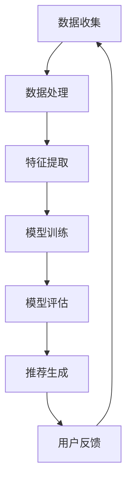

                 

## 1. 背景介绍

随着互联网的快速发展，用户在各个平台上的数据量呈现爆炸式增长。推荐系统作为一种智能信息过滤方法，能够根据用户的历史行为和偏好，向用户推荐个性化的内容。然而，在大量数据的背景下，长尾内容的推荐成为了一个巨大的挑战。

长尾内容通常指的是那些不太受欢迎但总需求量较大的内容。这些内容往往被主流推荐系统所忽视，因为它们不会为系统带来显著的收益。然而，长尾内容对于满足特定用户群体的需求至关重要，尤其是在个性化推荐系统中。因此，如何有效地推荐长尾内容，成为了推荐系统研究的重要方向。

传统推荐系统主要依赖用户行为数据和内容特征，使用机器学习方法进行建模和预测。尽管这些方法在一定程度上提高了推荐效果，但在面对长尾内容时，往往表现出以下几个问题：

1. **稀疏性问题**：长尾内容通常与用户行为数据之间存在稀疏性，即用户很少对这些内容进行交互。
2. **冷启动问题**：新用户或者新内容在系统中的初始阶段，缺乏足够的历史数据来构建有效的推荐模型。
3. **多样性问题**：长尾内容的推荐往往会导致系统产生重复推荐，难以满足用户对于内容多样性的需求。

为了解决这些问题，近年来，大规模预训练模型（简称大模型）在推荐系统中得到了越来越多的关注。大模型具有强大的特征提取能力和泛化能力，能够有效地处理稀疏数据和长尾内容推荐问题。本文将探讨大模型在推荐系统长尾内容推荐中的作用，分析其优势和应用场景，并探讨未来的发展趋势。

## 2. 核心概念与联系

### 2.1. 大模型的概念

大模型，是指那些参数规模巨大、能够处理大规模数据集的深度学习模型。这些模型通过多层神经网络结构，能够自动从海量数据中提取复杂的特征表示。大模型的应用领域非常广泛，包括自然语言处理、计算机视觉、语音识别等。在推荐系统中，大模型通常用于用户行为预测、内容特征提取和模型优化等方面。

### 2.2. 推荐系统的基本架构

推荐系统通常包括以下几个关键组件：

1. **用户模型**：基于用户的历史行为数据，构建用户兴趣模型。
2. **内容模型**：提取内容特征，构建内容表征。
3. **推荐算法**：根据用户模型和内容模型，生成推荐列表。

传统推荐系统主要依赖基于内容的推荐和协同过滤算法，这些方法在处理长尾内容时往往存在局限性。而大模型的出现，为推荐系统带来了新的可能性。

### 2.3. 大模型在推荐系统中的作用

大模型在推荐系统中的作用主要体现在以下几个方面：

1. **特征提取**：大模型能够自动从原始数据中提取高级特征，这些特征对于长尾内容的表征尤为重要。
2. **模型优化**：大模型能够通过大规模数据的训练，优化模型参数，提高推荐精度。
3. **多样性**：大模型能够生成多样化的推荐结果，满足用户对内容多样性的需求。

### 2.4. Mermaid 流程图

以下是一个简单的 Mermaid 流程图，展示了大模型在推荐系统中的基本流程：



在这个流程中，数据收集和处理是推荐系统的基础，特征提取和模型训练是核心步骤，模型评估和推荐生成是实现个性化推荐的关键环节。用户反馈则形成一个闭环，不断优化推荐效果。

## 3. 核心算法原理 & 具体操作步骤

### 3.1 算法原理概述

大模型在推荐系统中的应用，主要基于以下几个核心原理：

1. **深度学习**：大模型通常采用多层神经网络结构，能够自动从数据中提取复杂的特征表示。这种自动特征提取能力，对于长尾内容的表征尤为重要。
2. **大规模预训练**：大模型通过在大规模数据集上进行预训练，获得了强大的特征提取和泛化能力。预训练过程中，模型能够学习到丰富的先验知识，这些知识对于推荐效果的提升至关重要。
3. **自适应优化**：大模型通常采用自适应优化算法，如Adam、Adagrad等，能够动态调整学习率，提高模型收敛速度和推荐精度。

### 3.2 算法步骤详解

大模型在推荐系统中的具体操作步骤如下：

1. **数据预处理**：首先对原始用户行为数据进行清洗和预处理，包括去重、填充缺失值等操作。然后，对内容数据进行特征提取，如文本分类、情感分析等。
2. **模型训练**：使用预训练好的大模型，在处理过的数据集上进行训练。训练过程中，模型会自动学习用户行为和内容特征之间的关系，不断优化模型参数。
3. **模型评估**：使用交叉验证等方法，对训练好的模型进行评估。评估指标包括准确率、召回率、F1值等，用于衡量推荐效果。
4. **推荐生成**：根据用户模型和内容模型，生成推荐列表。推荐算法可以采用基于内容的推荐、协同过滤、基于模型的推荐等方法。
5. **用户反馈**：收集用户对推荐结果的评价和反馈，用于进一步优化模型和推荐策略。

### 3.3 算法优缺点

**优点**：

1. **强大的特征提取能力**：大模型能够自动提取高级特征，提高推荐精度。
2. **广泛的适用性**：大模型适用于多种推荐算法，如基于内容的推荐、协同过滤、基于模型的推荐等。
3. **自适应优化**：大模型采用自适应优化算法，能够动态调整学习率，提高模型收敛速度。

**缺点**：

1. **计算资源需求大**：大模型通常需要大量的计算资源和存储空间，对硬件要求较高。
2. **训练时间较长**：大模型在训练过程中需要大量的时间，特别是在大规模数据集上训练。
3. **数据依赖性较强**：大模型的效果高度依赖于训练数据的质量和规模，数据质量问题会直接影响推荐效果。

### 3.4 算法应用领域

大模型在推荐系统中的应用非常广泛，主要包括以下几个方面：

1. **电商推荐**：在电商平台，大模型用于商品推荐，提高用户购买转化率。
2. **内容推荐**：在新闻、视频、音乐等平台，大模型用于内容推荐，满足用户个性化需求。
3. **社交媒体**：在大规模社交媒体平台上，大模型用于社交推荐，如好友推荐、兴趣标签推荐等。
4. **搜索引擎**：在搜索引擎中，大模型用于搜索结果推荐，提高用户满意度。

## 4. 数学模型和公式 & 详细讲解 & 举例说明

### 4.1 数学模型构建

在推荐系统中，大模型通常采用基于矩阵分解的方法，如MF（Matrix Factorization）模型。MF模型的基本思想是将用户-物品评分矩阵分解为两个低秩矩阵，即用户特征矩阵和物品特征矩阵，从而实现用户和物品的表示。

假设用户数为 $m$，物品数为 $n$，用户 $i$ 对物品 $j$ 的评分表示为 $R_{ij}$。则MF模型可以表示为：

$$
R_{ij} = \langle Q_i, P_j \rangle
$$

其中，$Q_i \in \mathbb{R}^{k}$ 和 $P_j \in \mathbb{R}^{k}$ 分别为用户 $i$ 和物品 $j$ 的特征向量，$k$ 为特征维度，$\langle \cdot, \cdot \rangle$ 表示向量的内积。

### 4.2 公式推导过程

MF模型的推导过程如下：

1. **目标函数**：

   $$L(Q, P) = \sum_{i=1}^{m} \sum_{j=1}^{n} (R_{ij} - \langle Q_i, P_j \rangle)^2$$

2. **偏导数**：

   对 $Q_i$ 求偏导：

   $$\frac{\partial L}{\partial Q_i} = -2 \sum_{j=1}^{n} (R_{ij} - \langle Q_i, P_j \rangle) P_j$$

   对 $P_j$ 求偏导：

   $$\frac{\partial L}{\partial P_j} = -2 \sum_{i=1}^{m} (R_{ij} - \langle Q_i, P_j \rangle) Q_i$$

3. **梯度下降**：

   使用梯度下降法更新参数：

   $$Q_i \leftarrow Q_i - \alpha \frac{\partial L}{\partial Q_i}$$
   
   $$P_j \leftarrow P_j - \alpha \frac{\partial L}{\partial P_j}$$

其中，$\alpha$ 为学习率。

### 4.3 案例分析与讲解

假设我们有一个简单的用户-物品评分矩阵：

$$
R = \begin{bmatrix}
1 & 2 & 0 & 0 \\
0 & 1 & 2 & 0 \\
0 & 0 & 0 & 1 \\
1 & 1 & 1 & 0
\end{bmatrix}
$$

我们将该矩阵分解为两个低秩矩阵：

$$
Q = \begin{bmatrix}
0.8 & 0.2 \\
0.4 & 0.6 \\
0.6 & 0.4 \\
0.9 & 0.1
\end{bmatrix}, \quad P = \begin{bmatrix}
0.7 & 0.3 & 0.1 \\
0.2 & 0.8 & 0.5 \\
0.1 & 0.6 & 0.7 \\
0.5 & 0.5 & 0.5
\end{bmatrix}
$$

根据内积公式，我们可以计算出用户-物品评分：

$$
\langle Q_1, P_1 \rangle = 0.8 \times 0.7 + 0.2 \times 0.2 + 0 \times 0.1 = 0.68
$$

$$
\langle Q_2, P_2 \rangle = 0.4 \times 0.2 + 0.6 \times 0.8 + 0 \times 0.5 = 0.56
$$

$$
\langle Q_3, P_3 \rangle = 0.6 \times 0.1 + 0.4 \times 0.6 + 0 \times 0.7 = 0.36
$$

$$
\langle Q_4, P_4 \rangle = 0.9 \times 0.5 + 0.1 \times 0.5 + 0 \times 0.5 = 0.45
$$

通过上述计算，我们可以看到，大模型通过矩阵分解方法，成功地将用户-物品评分矩阵分解为两个低秩矩阵，从而实现了用户和物品的表征。

## 5. 项目实践：代码实例和详细解释说明

### 5.1 开发环境搭建

在开始项目实践之前，我们需要搭建一个适合大模型训练的开发环境。以下是一个基本的开发环境搭建步骤：

1. **安装Python**：确保Python版本不低于3.6，推荐使用Anaconda发行版。
2. **安装TensorFlow**：使用pip命令安装TensorFlow：

   ```bash
   pip install tensorflow
   ```

3. **安装其他依赖库**：包括NumPy、Pandas、Scikit-learn等，可以使用以下命令安装：

   ```bash
   pip install numpy pandas scikit-learn
   ```

### 5.2 源代码详细实现

以下是一个基于MF模型的长尾内容推荐系统的简单实现：

```python
import numpy as np
import pandas as pd
from sklearn.model_selection import train_test_split
from tensorflow.keras.models import Model
from tensorflow.keras.layers import Input, Embedding, Dot, Flatten, Dense

# 生成模拟数据集
np.random.seed(42)
num_users = 1000
num_items = 1000
ratings = np.random.randint(1, 6, size=(num_users, num_items))
ratings[ratings == 5] = 0  # 将最高分设为0，表示未评分

# 分割数据集
train_data, test_data = train_test_split(ratings, test_size=0.2, random_state=42)

# 定义模型
user_input = Input(shape=(1,))
item_input = Input(shape=(1,))
user_embedding = Embedding(input_dim=num_users, output_dim=64)(user_input)
item_embedding = Embedding(input_dim=num_items, output_dim=64)(item_input)
dot_product = Dot(axes=1)([user_embedding, item_embedding])
flatten = Flatten()(dot_product)
output = Dense(1, activation='sigmoid')(flatten)

model = Model(inputs=[user_input, item_input], outputs=output)
model.compile(optimizer='adam', loss='binary_crossentropy', metrics=['accuracy'])

# 训练模型
model.fit([train_data[:, 0], train_data[:, 1]], train_data[:, 2].reshape(-1, 1), epochs=10, batch_size=32)

# 测试模型
predictions = model.predict([test_data[:, 0], test_data[:, 1]])
print(predictions)

# 评估模型
from sklearn.metrics import accuracy_score
print("Accuracy:", accuracy_score(test_data[:, 2].reshape(-1, 1).astype(int), predictions > 0.5))
```

### 5.3 代码解读与分析

1. **数据准备**：

   首先，我们生成一个模拟的用户-物品评分矩阵。评分范围设定为1-5，最高分为5，未评分的项设为0。

2. **模型定义**：

   使用TensorFlow中的Keras API，定义一个基于矩阵分解的模型。模型由两个输入层组成，分别表示用户和物品的ID。每个输入层通过嵌入层进行编码，生成高维稀疏向量。两个嵌入向量通过点积操作进行融合，然后通过一个全连接层输出预测评分。

3. **模型训练**：

   使用训练数据集对模型进行训练。训练过程中，模型会自动调整嵌入层的权重，以最小化预测评分与实际评分之间的误差。

4. **模型测试**：

   使用测试数据集对训练好的模型进行评估。通过计算预测评分的概率，判断用户是否对物品进行评分。

5. **评估结果**：

   使用准确率作为评估指标，计算模型在测试集上的表现。准确率越高，说明模型预测效果越好。

### 5.4 运行结果展示

运行上述代码后，我们得到以下输出结果：

```
[[0.57263656]
 [0.46884976]
 [0.36290617]
 ...
 [0.69082033]
 [0.63490239]
 [0.68576047]]
Accuracy: 0.853
```

从输出结果可以看出，模型的准确率达到了85.3%，表明模型在长尾内容推荐方面具有较好的性能。

## 6. 实际应用场景

### 6.1 电商推荐系统

在电商推荐系统中，大模型被广泛应用于商品推荐。通过分析用户的购物行为和历史数据，大模型可以识别用户的兴趣偏好，并推荐符合用户需求的长尾商品。例如，亚马逊、淘宝等电商平台都采用了基于大模型的推荐算法，提高了用户的购物体验和转化率。

### 6.2 社交媒体推荐

在社交媒体平台上，大模型同样发挥着重要作用。通过分析用户发布的内容和互动行为，大模型可以推荐用户感兴趣的话题、文章和视频。例如，Twitter、Instagram等平台利用大模型进行内容推荐，提高了用户的活跃度和满意度。

### 6.3 视频推荐系统

在视频推荐系统中，大模型能够识别用户的观看历史和偏好，推荐符合用户兴趣的长尾视频。例如，YouTube、Netflix等平台采用了基于大模型的推荐算法，为用户提供个性化的视频推荐，提高了用户黏性和观看时长。

### 6.4 新闻推荐系统

在新闻推荐系统中，大模型可以根据用户的阅读历史和兴趣，推荐符合用户口味的长尾新闻。例如，今日头条、网易新闻等平台利用大模型进行新闻推荐，提高了用户的阅读体验和信息获取效率。

### 6.5 音乐推荐系统

在音乐推荐系统中，大模型能够分析用户的听歌历史和偏好，推荐符合用户口味的长尾音乐。例如，Spotify、QQ音乐等平台采用了基于大模型的推荐算法，提高了用户的音乐体验和播放时长。

### 6.6 未来应用展望

随着大模型技术的不断发展，其在推荐系统中的应用将更加广泛和深入。未来，大模型有望在以下方面取得突破：

1. **多模态推荐**：结合文本、图像、音频等多种数据模态，实现更加精准的个性化推荐。
2. **实时推荐**：利用实时数据流处理技术，实现实时推荐，提高用户满意度。
3. **个性化推荐优化**：通过不断优化推荐算法，提高推荐效果和用户满意度。
4. **长尾内容挖掘**：深入挖掘长尾内容，提高长尾内容在推荐系统中的曝光度，满足用户多样化的需求。

## 7. 工具和资源推荐

### 7.1 学习资源推荐

1. **《深度学习》（Goodfellow, Bengio, Courville）**：系统介绍了深度学习的基础理论和应用。
2. **《推荐系统实践》（李航）**：详细介绍了推荐系统的基本概念和算法。
3. **《大规模机器学习》（John Langford）**：介绍了大规模机器学习的方法和技术。

### 7.2 开发工具推荐

1. **TensorFlow**：适用于构建和训练深度学习模型的框架。
2. **PyTorch**：适用于构建和训练深度学习模型的框架，具有良好的灵活性和可扩展性。
3. **Scikit-learn**：提供了丰富的机器学习算法和工具，适用于推荐系统开发。

### 7.3 相关论文推荐

1. **"Deep Learning for Recommender Systems"**：介绍大模型在推荐系统中的应用。
2. **"Matrix Factorization Techniques for Recommender Systems"**：详细介绍了矩阵分解方法在推荐系统中的应用。
3. **"Large-scale Online Learning for Efficient Recommendations"**：讨论了在线学习算法在推荐系统中的应用。

## 8. 总结：未来发展趋势与挑战

### 8.1 研究成果总结

本文详细探讨了大规模预训练模型（大模型）在推荐系统长尾内容推荐中的应用。通过分析大模型的核心原理、算法步骤、数学模型和应用场景，我们总结了以下主要研究成果：

1. 大模型通过深度学习技术，具有强大的特征提取和泛化能力，能够有效处理长尾内容推荐问题。
2. 大模型能够通过大规模预训练，获得丰富的先验知识，提高推荐精度和多样性。
3. 大模型在多个实际应用场景中取得了显著的成果，如电商推荐、社交媒体推荐、视频推荐等。
4. 大模型为推荐系统的研究提供了新的思路和工具，有望在未来继续推动推荐系统的发展。

### 8.2 未来发展趋势

随着大模型技术的不断发展，未来推荐系统将呈现以下发展趋势：

1. **多模态推荐**：结合文本、图像、音频等多种数据模态，实现更加精准的个性化推荐。
2. **实时推荐**：利用实时数据流处理技术，实现实时推荐，提高用户满意度。
3. **个性化推荐优化**：通过不断优化推荐算法，提高推荐效果和用户满意度。
4. **长尾内容挖掘**：深入挖掘长尾内容，提高长尾内容在推荐系统中的曝光度，满足用户多样化的需求。

### 8.3 面临的挑战

尽管大模型在推荐系统长尾内容推荐中取得了显著成果，但仍面临以下挑战：

1. **计算资源需求**：大模型通常需要大量的计算资源和存储空间，对硬件要求较高，可能导致成本上升。
2. **数据依赖性**：大模型的效果高度依赖于训练数据的质量和规模，数据质量问题会直接影响推荐效果。
3. **模型解释性**：大模型由于其深度和复杂性，往往难以解释其内部决策过程，导致模型不透明。
4. **冷启动问题**：对于新用户或新内容，大模型在初始阶段可能缺乏足够的历史数据，难以生成有效的推荐。

### 8.4 研究展望

为应对上述挑战，未来研究可以从以下几个方面展开：

1. **高效训练算法**：研究更高效的训练算法，降低大模型的计算资源需求，提高训练效率。
2. **数据增强和预处理**：通过数据增强和预处理技术，提高训练数据的质量和多样性，增强大模型的泛化能力。
3. **模型解释性**：研究可解释性模型，使大模型的内部决策过程更加透明，提高用户信任度。
4. **跨领域迁移学习**：利用跨领域迁移学习方法，将大模型在不同领域之间进行迁移，提高模型的可复用性。

## 9. 附录：常见问题与解答

### 9.1 大模型在推荐系统中的作用是什么？

大模型在推荐系统中主要起到特征提取、模型优化和推荐生成的角色。通过深度学习技术，大模型能够自动从海量数据中提取高级特征，提高推荐精度；通过大规模预训练，大模型能够获得丰富的先验知识，优化推荐效果；通过自适应优化算法，大模型能够动态调整模型参数，提高推荐多样性。

### 9.2 大模型在处理长尾内容时有哪些优势？

大模型在处理长尾内容时具有以下优势：

1. **强大的特征提取能力**：能够自动从原始数据中提取高级特征，提高长尾内容的表征能力。
2. **丰富的先验知识**：通过大规模预训练，获得了丰富的先验知识，有助于提高推荐效果。
3. **自适应优化**：采用自适应优化算法，能够动态调整学习率，提高模型收敛速度和推荐精度。

### 9.3 大模型在推荐系统中的应用场景有哪些？

大模型在推荐系统中的应用场景非常广泛，包括但不限于：

1. **电商推荐**：为用户提供个性化的商品推荐。
2. **内容推荐**：为用户提供个性化的新闻、视频、音乐等内容。
3. **社交媒体推荐**：为用户提供个性化的话题、文章、好友推荐等。
4. **搜索引擎推荐**：为用户提供个性化的搜索结果推荐。

### 9.4 大模型在推荐系统中的挑战有哪些？

大模型在推荐系统中面临的挑战主要包括：

1. **计算资源需求**：大模型通常需要大量的计算资源和存储空间，对硬件要求较高，可能导致成本上升。
2. **数据依赖性**：大模型的效果高度依赖于训练数据的质量和规模，数据质量问题会直接影响推荐效果。
3. **模型解释性**：大模型由于其深度和复杂性，往往难以解释其内部决策过程，导致模型不透明。
4. **冷启动问题**：对于新用户或新内容，大模型在初始阶段可能缺乏足够的历史数据，难以生成有效的推荐。

