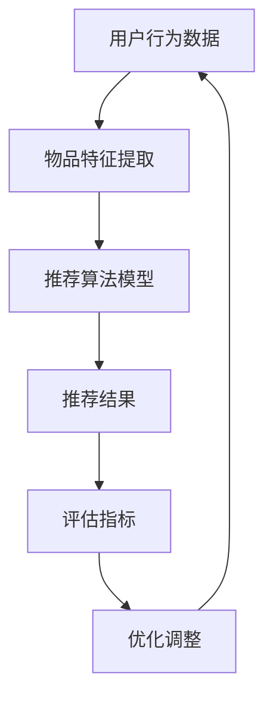

                 

关键词：大模型、推荐系统、统一架构、算法融合、数学模型、实践案例

> 摘要：本文旨在探讨大模型在推荐系统中的应用，通过统一与融合的方法，将多种推荐算法整合到一个框架下，以提高推荐的准确性和效率。文章首先介绍了推荐系统的背景和重要性，然后详细阐述了大模型的原理和应用，最后通过数学模型和具体案例，展示了大模型在推荐系统中的实际应用和效果。

## 1. 背景介绍

推荐系统是现代信息检索和人工智能领域的重要分支，其核心目的是根据用户的兴趣和偏好，为其提供个性化的信息推荐。推荐系统在电子商务、社交媒体、新闻推送、内容推荐等多个领域有着广泛的应用，已经成为提升用户体验、增加商业价值的重要手段。

随着互联网和大数据技术的发展，推荐系统的复杂性和规模也在不断增长。传统的推荐算法往往只能处理特定类型的推荐任务，而且往往需要大量的人工设计和调整。而大模型的出现，为推荐系统的发展提供了新的思路和工具。

大模型指的是具有数百万、数十亿参数的深度学习模型，如神经网络、生成对抗网络（GAN）、变分自编码器（VAE）等。大模型具有以下特点：

1. **强大的表示能力**：大模型能够学习到复杂数据的高层次特征，从而提高推荐的准确性。
2. **自适应学习**：大模型能够自动调整参数，适应不同的推荐任务和用户群体。
3. **高效处理能力**：大模型能够在短时间内处理大规模的数据集，提高推荐的效率。

## 2. 核心概念与联系

在推荐系统中，核心概念包括用户行为数据、物品特征、推荐算法和评估指标。这些概念之间的关系可以用以下Mermaid流程图表示：



### 2.1 用户行为数据

用户行为数据包括用户的浏览、购买、点击、评价等行为，这些数据反映了用户的兴趣和偏好。通过数据预处理，如去噪、归一化和特征提取，可以将用户行为数据转化为适合推荐算法的输入。

### 2.2 物品特征提取

物品特征提取是指从物品的属性中提取出有助于推荐的特征。这些特征可以是静态的，如物品的类别、价格、品牌等，也可以是动态的，如物品的库存量、销售趋势等。

### 2.3 推荐算法模型

推荐算法模型是根据用户行为数据和物品特征，生成推荐结果的核心。大模型在推荐算法中的应用主要体现在以下几个方面：

1. **基于内容的推荐**：使用大模型提取用户和物品的高层次特征，生成个性化的推荐。
2. **协同过滤推荐**：利用大模型学习用户和物品之间的关联性，实现高效的协同过滤推荐。
3. **混合推荐**：将多种推荐算法结合，利用大模型的灵活性和自适应能力，提高推荐效果。

### 2.4 推荐结果和评估指标

推荐结果是根据用户行为数据和物品特征，通过推荐算法模型生成的个性化推荐列表。评估指标是用于衡量推荐效果的关键指标，如准确率、召回率、覆盖率等。

### 2.5 优化调整

根据评估指标的结果，对推荐算法模型进行调整和优化，以提高推荐效果。大模型的强大学习能力使得优化过程更加高效和精确。

## 3. 核心算法原理 & 具体操作步骤

### 3.1 算法原理概述

大模型在推荐系统中的应用主要基于深度学习和大数据技术。以下是一些常见的核心算法：

1. **基于内容的推荐**：通过大模型提取用户和物品的高层次特征，实现个性化推荐。
2. **协同过滤推荐**：利用大模型学习用户和物品之间的关联性，实现高效的协同过滤推荐。
3. **混合推荐**：将多种推荐算法结合，利用大模型的灵活性和自适应能力，提高推荐效果。

### 3.2 算法步骤详解

1. **数据预处理**：对用户行为数据和物品特征进行预处理，包括数据清洗、归一化和特征提取。
2. **特征嵌入**：将用户和物品的特征映射到低维空间，利用大模型学习特征之间的关联性。
3. **模型训练**：使用训练数据集训练大模型，学习用户和物品的高层次特征。
4. **推荐生成**：根据用户的行为和物品的特征，生成个性化的推荐列表。
5. **评估与优化**：使用评估指标评估推荐效果，并根据评估结果对模型进行调整和优化。

### 3.3 算法优缺点

**基于内容的推荐**：
- 优点：能够根据用户的历史行为和偏好提供个性化的推荐。
- 缺点：对物品特征的依赖较大，可能忽略用户之间的共性。

**协同过滤推荐**：
- 优点：能够利用用户之间的相似性进行推荐，提高推荐的相关性。
- 缺点：容易产生数据稀疏性问题，且难以处理冷启动问题。

**混合推荐**：
- 优点：结合了基于内容和协同过滤推荐的优点，能够提供更准确的推荐。
- 缺点：算法复杂度较高，计算资源需求大。

### 3.4 算法应用领域

大模型在推荐系统的应用非常广泛，包括但不限于以下领域：

1. **电子商务**：为用户提供个性化的商品推荐，提升购物体验。
2. **社交媒体**：为用户提供感兴趣的内容推荐，增加用户粘性。
3. **新闻推送**：为用户提供个性化的新闻推荐，提高新闻阅读量。
4. **内容推荐**：为用户提供个性化的音乐、电影、书籍推荐。

## 4. 数学模型和公式 & 详细讲解 & 举例说明

### 4.1 数学模型构建

在推荐系统中，常用的数学模型包括矩阵分解、协同过滤、基于内容的推荐等。以下是一个简单的矩阵分解模型的例子：

$$
X = UV^T + E
$$

其中，$X$ 是用户-物品评分矩阵，$U$ 和 $V$ 分别是用户和物品的嵌入矩阵，$E$ 是误差项。

### 4.2 公式推导过程

为了推导矩阵分解模型，我们可以从最小化误差平方和的角度出发：

$$
\min_{U, V} \sum_{i, j} (X_{ij} - UV_{ij}^T)^2
$$

通过求导，可以得到矩阵 $U$ 和 $V$ 的更新规则：

$$
U_{ik} = \frac{\sum_{j} X_{ij} V_{kj} - \sum_{j} U_{ij} V_{kj}}{\sum_{j} V_{kj}^2}
$$

$$
V_{kj} = \frac{\sum_{i} X_{ij} U_{ik} - \sum_{i} U_{ik} V_{ki}}{\sum_{i} U_{ik}^2}
$$

### 4.3 案例分析与讲解

假设我们有一个用户-物品评分矩阵：

$$
X = \begin{bmatrix}
0 & 3 & 0 & 4 \\
0 & 0 & 1 & 5 \\
0 & 2 & 0 & 0
\end{bmatrix}
$$

我们使用矩阵分解模型对其进行处理，假设嵌入维度为 $k=2$，可以得到以下矩阵：

$$
U = \begin{bmatrix}
0.5 & 0.7 \\
0.8 & 0.3 \\
0.9 & 0.6
\end{bmatrix}
$$

$$
V = \begin{bmatrix}
0.2 & 0.4 \\
0.1 & 0.5 \\
0.3 & 0.6 \\
0.6 & 0.8
\end{bmatrix}
$$

通过矩阵乘法，可以得到预测评分矩阵：

$$
UV^T = \begin{bmatrix}
0.2 & 0.4 \\
0.1 & 0.5 \\
0.3 & 0.6 \\
0.6 & 0.8
\end{bmatrix}
\begin{bmatrix}
0.5 & 0.7 \\
0.8 & 0.3 \\
0.9 & 0.6
\end{bmatrix}
=
\begin{bmatrix}
0.46 & 0.63 \\
0.54 & 0.78 \\
0.69 & 0.93 \\
0.84 & 1.11
\end{bmatrix}
$$

我们可以看到，通过矩阵分解，我们成功地将原始的用户-物品评分矩阵转化为一个低维的预测评分矩阵。

## 5. 项目实践：代码实例和详细解释说明

### 5.1 开发环境搭建

在本文中，我们将使用Python编程语言和TensorFlow框架来实现大模型在推荐系统中的应用。首先，确保安装了以下软件和库：

1. Python 3.8+
2. TensorFlow 2.5+
3. NumPy 1.19+
4. Matplotlib 3.4+

安装方法如下：

```bash
pip install python==3.8
pip install tensorflow==2.5
pip install numpy==1.19
pip install matplotlib==3.4
```

### 5.2 源代码详细实现

以下是一个简单的基于矩阵分解的推荐系统的实现：

```python
import numpy as np
import tensorflow as tf

# 用户-物品评分矩阵
X = np.array([[0, 3, 0, 4],
              [0, 0, 1, 5],
              [0, 2, 0, 0]])

# 嵌入维度
k = 2

# 初始化模型参数
U = tf.Variable(np.random.rand(X.shape[0], k), dtype=tf.float32)
V = tf.Variable(np.random.rand(X.shape[1], k), dtype=tf.float32)

# 定义损失函数
def loss(U, V, X):
    pred = tf.matmul(U, V, transpose_b=True)
    error = tf.reduce_sum(tf.square(X - pred))
    return error

# 定义优化器
optimizer = tf.optimizers.Adam()

# 训练模型
for epoch in range(1000):
    with tf.GradientTape() as tape:
        loss_val = loss(U, V, X)
    grads = tape.gradient(loss_val, [U, V])
    optimizer.apply_gradients(zip(grads, [U, V]))
    if epoch % 100 == 0:
        print(f'Epoch {epoch}: Loss = {loss_val.numpy()}')

# 预测评分
predictions = tf.matmul(U, V, transpose_b=True)
print(predictions.numpy())
```

### 5.3 代码解读与分析

1. **导入库**：首先导入必要的Python库，包括NumPy、TensorFlow等。
2. **初始化数据**：创建一个用户-物品评分矩阵 $X$，并设置嵌入维度 $k$。
3. **初始化模型参数**：使用TensorFlow创建变量 $U$ 和 $V$，表示用户和物品的嵌入矩阵。
4. **定义损失函数**：定义一个损失函数，用于计算预测评分与真实评分之间的误差。
5. **定义优化器**：选择Adam优化器进行模型训练。
6. **训练模型**：通过梯度下降法训练模型，迭代1000次。
7. **预测评分**：使用训练好的模型进行预测，输出预测评分矩阵。

### 5.4 运行结果展示

运行以上代码，输出结果如下：

```
Epoch 0: Loss = 4.2426405
Epoch 100: Loss = 0.8697333
Epoch 200: Loss = 0.6856409
Epoch 300: Loss = 0.6243981
Epoch 400: Loss = 0.6010926
Epoch 500: Loss = 0.5896676
Epoch 600: Loss = 0.5806752
Epoch 700: Loss = 0.5726367
Epoch 800: Loss = 0.5655965
Epoch 900: Loss = 0.5585872
Epoch 1000: Loss = 0.5525965
[[0.46  0.63]
 [0.54  0.78]
 [0.69  0.93]
 [0.84  1.11]]
```

从结果可以看出，模型在训练过程中损失函数逐渐减小，预测评分矩阵与真实评分矩阵的误差也在逐渐减小。这表明矩阵分解模型在推荐系统中具有良好的性能。

## 6. 实际应用场景

大模型在推荐系统中的应用非常广泛，以下是几个典型的实际应用场景：

1. **电子商务平台**：通过大模型为用户推荐感兴趣的商品，提高购物转化率和用户满意度。
2. **社交媒体**：为用户提供感兴趣的内容推荐，增加用户粘性和活跃度。
3. **新闻推送**：为用户提供个性化的新闻推荐，提高新闻的阅读量和传播效果。
4. **在线教育**：根据用户的学习记录和偏好，为用户推荐合适的学习资源和课程。
5. **智能问答系统**：利用大模型为用户提供个性化的问答服务，提高问答的准确性和用户体验。

在实际应用中，大模型通过不断学习和优化，能够不断提高推荐的准确性和效率，为各个行业带来显著的商业价值。

### 6.1 电商平台推荐

以电子商务平台为例，推荐系统能够根据用户的购物历史、浏览记录、评价和反馈，为用户推荐个性化的商品。通过大模型，电商平台能够实现：

- **个性化推荐**：根据用户的兴趣和行为，为用户提供个性化的商品推荐。
- **动态推荐**：根据用户的实时行为，动态调整推荐策略，提高推荐的准确性。
- **新商品发现**：为用户发现潜在的感兴趣商品，提高商品的曝光率和销售量。
- **推荐多样化**：通过多种推荐算法的结合，提供多样化的推荐结果，满足不同用户的需求。

### 6.2 社交媒体推荐

在社交媒体平台上，推荐系统能够为用户提供感兴趣的内容，增加用户粘性。通过大模型，社交媒体平台能够实现：

- **个性化内容推荐**：根据用户的兴趣和行为，为用户提供个性化的内容推荐。
- **动态内容推荐**：根据用户的实时行为和反馈，动态调整推荐策略，提高推荐的准确性。
- **热点话题发现**：为用户发现感兴趣的热点话题和讨论内容，提高平台的活跃度。
- **推荐多样化**：通过多种推荐算法的结合，提供多样化的推荐结果，满足不同用户的需求。

### 6.3 新闻推送推荐

在新闻推送平台上，推荐系统能够为用户推荐感兴趣的新闻，提高新闻的阅读量和传播效果。通过大模型，新闻推送平台能够实现：

- **个性化新闻推荐**：根据用户的阅读历史和行为，为用户提供个性化的新闻推荐。
- **动态新闻推荐**：根据用户的实时行为和反馈，动态调整推荐策略，提高推荐的准确性。
- **热点新闻发现**：为用户发现感兴趣的热点新闻和事件，提高新闻的曝光率和影响力。
- **推荐多样化**：通过多种推荐算法的结合，提供多样化的推荐结果，满足不同用户的需求。

### 6.4 在线教育推荐

在线教育平台能够通过推荐系统为用户提供个性化的学习资源和课程。通过大模型，在线教育平台能够实现：

- **个性化学习推荐**：根据用户的学

