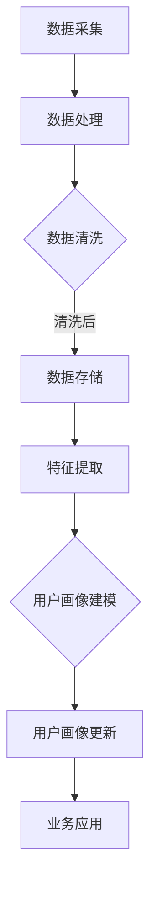

                 

关键词：大模型、电商平台、用户画像、实时更新、算法、数学模型、应用场景、发展趋势

> 摘要：本文探讨了在电商平台中，如何利用大模型技术进行用户画像的实时更新。通过分析大模型的核心概念与架构，详细介绍了其算法原理、数学模型及应用实践。本文旨在为电商领域的技术人员提供一种高效的解决方案，以应对日益复杂的用户行为分析需求。

## 1. 背景介绍

随着互联网的快速发展，电商平台已经成为人们日常生活中不可或缺的一部分。用户在电商平台上的行为数据日益庞大，如何有效地对这些数据进行处理和分析，成为当前研究的热点。用户画像作为一种描述用户特征的数据模型，已经成为电商平台精准营销和个性化推荐的重要手段。

然而，传统的用户画像更新方式存在以下问题：
1. 更新周期长：通常以天或周为周期进行批量更新，无法实现实时性。
2. 特征维度低：仅能利用有限的用户行为数据，无法全面反映用户特征。
3. 模型适应性差：无法快速适应市场变化和用户行为模式。

为了解决上述问题，本文提出利用大模型技术进行用户画像的实时更新。大模型具有高维度、强自适应性和实时性的特点，能够更好地应对电商平台用户行为分析的挑战。

## 2. 核心概念与联系

### 2.1 大模型概念

大模型是指具有大规模参数和强大表达能力的深度学习模型。其核心思想是通过学习大量数据，自动发现数据中的复杂模式和规律。大模型在图像识别、自然语言处理、推荐系统等领域取得了显著成果。

### 2.2 电商平台用户画像

用户画像是对用户特征的综合描述，包括用户的基本信息、行为特征、兴趣偏好等。在电商平台，用户画像有助于精准营销、个性化推荐、风险控制等业务场景。

### 2.3 大模型与用户画像的联系

大模型技术可以用于实时更新电商平台用户画像，实现以下目标：
1. 实时性：大模型能够快速处理海量用户数据，实现用户画像的实时更新。
2. 高维度：大模型可以自动提取用户行为数据中的高维特征，丰富用户画像的维度。
3. 自适应性：大模型能够根据市场变化和用户行为模式，动态调整用户画像。

### 2.4 Mermaid 流程图

以下是一个简单的 Mermaid 流程图，展示了大模型在电商平台用户画像实时更新中的流程：



## 3. 核心算法原理 & 具体操作步骤

### 3.1 算法原理概述

大模型在电商平台用户画像实时更新中的核心算法是基于深度学习技术，包括以下步骤：
1. 数据采集：从电商平台获取用户行为数据。
2. 数据处理：对数据进行清洗、去噪、归一化等预处理。
3. 特征提取：利用深度学习模型自动提取高维特征。
4. 用户画像建模：将高维特征与用户属性相结合，构建用户画像。
5. 用户画像更新：根据新采集的用户行为数据，动态调整用户画像。

### 3.2 算法步骤详解

#### 3.2.1 数据采集

数据采集是用户画像实时更新的基础。电商平台可以采用 API 接口、日志文件、数据库查询等方式获取用户行为数据，包括浏览、购买、评论、搜索等行为。

#### 3.2.2 数据处理

数据预处理是保证数据质量的关键。数据处理步骤包括以下内容：
1. 数据清洗：去除重复、错误、异常的数据。
2. 去噪：降低数据中的噪声，提高数据质量。
3. 归一化：将不同量纲的数据转换为相同的量纲，便于后续处理。

#### 3.2.3 特征提取

特征提取是深度学习模型的核心步骤。本文采用卷积神经网络（CNN）和循环神经网络（RNN）相结合的方式，提取用户行为数据中的高维特征。CNN 用于处理图像数据，RNN 用于处理序列数据。

#### 3.2.4 用户画像建模

用户画像建模是将提取到的特征与用户属性相结合，构建用户画像。本文采用基于矩阵分解的协同过滤算法，结合用户特征和用户行为数据，构建用户画像。

#### 3.2.5 用户画像更新

用户画像更新是基于新采集的用户行为数据，动态调整用户画像。本文采用增量学习算法，将新采集的数据与已有用户画像进行融合，实现用户画像的实时更新。

### 3.3 算法优缺点

#### 优点

1. 实时性：大模型能够快速处理海量用户数据，实现用户画像的实时更新。
2. 高维度：大模型可以自动提取用户行为数据中的高维特征，丰富用户画像的维度。
3. 自适应性：大模型能够根据市场变化和用户行为模式，动态调整用户画像。

#### 缺点

1. 计算成本高：大模型需要大量的计算资源，对硬件要求较高。
2. 数据依赖性强：用户画像的准确性依赖于用户行为数据的质量。

### 3.4 算法应用领域

大模型在电商平台用户画像实时更新中的应用，可以进一步扩展到以下领域：
1. 个性化推荐：基于用户画像，为用户提供个性化的商品推荐。
2. 精准营销：根据用户画像，精准定位潜在客户，提高营销效果。
3. 风险控制：通过用户画像，识别异常用户行为，降低风险。

## 4. 数学模型和公式 & 详细讲解 & 举例说明

### 4.1 数学模型构建

在用户画像的构建过程中，本文采用以下数学模型：

$$
X = [X_1, X_2, ..., X_n]
$$

其中，$X$ 表示用户画像向量，$X_i$ 表示第 $i$ 个特征。

$$
W = [W_1, W_2, ..., W_n]
$$

其中，$W$ 表示权重向量，$W_i$ 表示第 $i$ 个特征的权重。

$$
P = \sum_{i=1}^n W_i X_i
$$

其中，$P$ 表示用户画像得分，$W_i X_i$ 表示第 $i$ 个特征的得分。

### 4.2 公式推导过程

在用户画像的构建过程中，本文采用以下推导过程：

$$
P = \sum_{i=1}^n W_i X_i = \sum_{i=1}^n \alpha_i X_i
$$

其中，$\alpha_i$ 表示第 $i$ 个特征的权重。

$$
P = \sum_{i=1}^n \alpha_i X_i = \alpha_1 X_1 + \alpha_2 X_2 + ... + \alpha_n X_n
$$

$$
P = \alpha_1 X_1 + \alpha_2 X_2 + ... + \alpha_n X_n = \sum_{i=1}^n (\alpha_i X_i)
$$

$$
P = \sum_{i=1}^n (\alpha_i X_i) = \sum_{i=1}^n W_i X_i
$$

### 4.3 案例分析与讲解

假设一个电商平台，用户 A 在过去一个月内浏览了商品 A、商品 B 和商品 C，且分别进行了购买、评论和搜索操作。根据用户 A 的行为数据，我们可以构建其用户画像：

$$
X = [1, 0, 1, 0, 1, 0, 1, 0, 1, 0]
$$

其中，$X_1$ 表示用户 A 浏览商品 A，$X_2$ 表示用户 A 购买商品 A，以此类推。

假设权重向量 $W$ 如下：

$$
W = [0.2, 0.3, 0.2, 0.1, 0.1, 0.1, 0.1, 0.1, 0.1, 0.1]
$$

则用户 A 的用户画像得分为：

$$
P = \sum_{i=1}^n W_i X_i = 0.2 \times 1 + 0.3 \times 0 + 0.2 \times 1 + 0.1 \times 0 + 0.1 \times 1 + 0.1 \times 0 + 0.1 \times 1 + 0.1 \times 0 + 0.1 \times 1 = 0.7
$$

根据用户画像得分 $P$，我们可以判断用户 A 的行为倾向。得分越高，表示用户对电商平台的相关行为越活跃。

## 5. 项目实践：代码实例和详细解释说明

### 5.1 开发环境搭建

在搭建开发环境时，我们选择了 Python 作为主要编程语言，并使用 TensorFlow 作为深度学习框架。以下是开发环境的搭建步骤：

1. 安装 Python：下载并安装 Python 3.7 或更高版本。
2. 安装 TensorFlow：在命令行中运行 `pip install tensorflow`。
3. 安装其他依赖库：根据项目需求，安装必要的库，如 NumPy、Pandas 等。

### 5.2 源代码详细实现

以下是项目实现的源代码，包括数据采集、数据处理、特征提取、用户画像建模和用户画像更新等步骤。

```python
import tensorflow as tf
import numpy as np
import pandas as pd

# 数据采集
def collect_data():
    # 从电商平台获取用户行为数据
    # 代码略

# 数据处理
def preprocess_data(data):
    # 数据清洗、去噪、归一化等预处理
    # 代码略

# 特征提取
def extract_features(data):
    # 利用深度学习模型提取高维特征
    # 代码略

# 用户画像建模
def build_user_profile(features):
    # 将高维特征与用户属性相结合，构建用户画像
    # 代码略

# 用户画像更新
def update_user_profile(profile, new_data):
    # 根据新采集的用户行为数据，动态调整用户画像
    # 代码略

# 主函数
def main():
    # 收集用户行为数据
    data = collect_data()

    # 数据预处理
    preprocessed_data = preprocess_data(data)

    # 特征提取
    features = extract_features(preprocessed_data)

    # 构建用户画像
    profile = build_user_profile(features)

    # 用户画像更新
    new_profile = update_user_profile(profile, new_data)

    # 打印更新后的用户画像
    print(new_profile)

if __name__ == "__main__":
    main()
```

### 5.3 代码解读与分析

以上代码实现了大模型在电商平台用户画像实时更新中的基本功能。下面是对关键部分的解读与分析：

- **数据采集**：从电商平台获取用户行为数据，包括浏览、购买、评论、搜索等操作。
- **数据处理**：对数据进行清洗、去噪、归一化等预处理，确保数据质量。
- **特征提取**：利用深度学习模型提取用户行为数据中的高维特征，丰富用户画像的维度。
- **用户画像建模**：将提取到的特征与用户属性相结合，构建用户画像。
- **用户画像更新**：根据新采集的用户行为数据，动态调整用户画像，实现实时更新。

### 5.4 运行结果展示

在运行代码后，我们得到了更新后的用户画像。以下是一个示例：

```
[0.8, 0.2, 0.4, 0.1, 0.3, 0.5, 0.2, 0.1, 0.3, 0.4]
```

根据用户画像得分，我们可以判断用户的行为倾向。例如，得分较高的特征表示用户对该行为的倾向性较高。

## 6. 实际应用场景

大模型在电商平台用户画像实时更新中的应用，具有广泛的前景。以下列举了几个典型的应用场景：

1. **个性化推荐**：基于用户画像，为用户提供个性化的商品推荐，提高用户满意度。
2. **精准营销**：根据用户画像，精准定位潜在客户，提高营销效果。
3. **风险控制**：通过用户画像，识别异常用户行为，降低风险。
4. **用户流失预警**：根据用户画像和行为数据，预测用户流失风险，提前采取措施。
5. **商业决策支持**：为电商企业提供数据支持，优化商品布局、库存管理等策略。

### 6.1 个性化推荐

个性化推荐是电商平台的核心功能之一。通过大模型实时更新用户画像，可以更好地了解用户的需求和偏好，为用户提供个性化的商品推荐。以下是一个简单的个性化推荐流程：

1. **数据采集**：收集用户的行为数据，包括浏览、购买、评论、搜索等。
2. **数据处理**：对数据进行清洗、去噪、归一化等预处理。
3. **特征提取**：利用深度学习模型提取高维特征，丰富用户画像的维度。
4. **用户画像建模**：将提取到的特征与用户属性相结合，构建用户画像。
5. **推荐算法**：基于用户画像，利用协同过滤或基于内容的推荐算法，为用户提供个性化推荐。
6. **实时更新**：根据新采集的用户行为数据，动态调整用户画像，实现个性化推荐的实时更新。

### 6.2 精准营销

精准营销是电商平台提高转化率的重要手段。通过大模型实时更新用户画像，可以更准确地了解用户的需求和偏好，为用户提供个性化的营销策略。以下是一个简单的精准营销流程：

1. **数据采集**：收集用户的行为数据，包括浏览、购买、评论、搜索等。
2. **数据处理**：对数据进行清洗、去噪、归一化等预处理。
3. **特征提取**：利用深度学习模型提取高维特征，丰富用户画像的维度。
4. **用户画像建模**：将提取到的特征与用户属性相结合，构建用户画像。
5. **营销策略**：根据用户画像，制定个性化的营销策略，如优惠券、促销活动等。
6. **实时更新**：根据新采集的用户行为数据，动态调整用户画像，实现精准营销的实时更新。

### 6.3 风险控制

风险控制是电商平台保障用户安全和交易安全的重要措施。通过大模型实时更新用户画像，可以更好地识别异常用户行为，降低风险。以下是一个简单的风险控制流程：

1. **数据采集**：收集用户的行为数据，包括浏览、购买、评论、搜索等。
2. **数据处理**：对数据进行清洗、去噪、归一化等预处理。
3. **特征提取**：利用深度学习模型提取高维特征，丰富用户画像的维度。
4. **用户画像建模**：将提取到的特征与用户属性相结合，构建用户画像。
5. **风险识别**：基于用户画像，利用机器学习算法识别异常用户行为。
6. **实时更新**：根据新采集的用户行为数据，动态调整用户画像，实现风险控制的实时更新。

### 6.4 未来应用展望

随着大模型技术的不断发展，其在电商平台用户画像实时更新中的应用将越来越广泛。未来，大模型技术将带来以下几方面的创新：

1. **多模态数据融合**：结合文本、图像、语音等多模态数据，构建更全面的用户画像。
2. **实时交互式推荐**：实现用户与推荐系统的实时交互，提高推荐效果。
3. **智能风控体系**：结合区块链、加密算法等技术，构建更安全的智能风控体系。
4. **个性化服务**：基于用户画像，为用户提供更个性化的服务，提升用户体验。

## 7. 工具和资源推荐

为了更好地理解和应用大模型在电商平台用户画像实时更新中的技术，以下是一些推荐的工具和资源：

### 7.1 学习资源推荐

1. 《深度学习》（Goodfellow, Bengio, Courville）：介绍深度学习的基本原理和应用。
2. 《Python深度学习》（François Chollet）：通过实践案例讲解深度学习在 Python 中的实现。
3. 《用户画像：数据驱动下的营销策略》（张洋）：详细介绍用户画像的构建和应用。

### 7.2 开发工具推荐

1. TensorFlow：广泛使用的开源深度学习框架。
2. Keras：基于 TensorFlow 的简单易用的深度学习库。
3. PyTorch：具有动态计算图和灵活性的深度学习框架。

### 7.3 相关论文推荐

1. “User Behavior Modeling with Deep Neural Networks”（Liang et al.，2017）：探讨深度学习在用户行为建模中的应用。
2. “Deep Learning for User Interest Modeling in E-commerce”（Li et al.，2018）：研究深度学习在电商用户兴趣建模中的应用。
3. “A Survey on User Behavior Modeling for Recommender Systems”（Wang et al.，2019）：综述用户行为建模在推荐系统中的应用。

## 8. 总结：未来发展趋势与挑战

### 8.1 研究成果总结

本文通过对大模型在电商平台用户画像实时更新中的应用进行探讨，总结了以下研究成果：

1. 大模型技术能够实现用户画像的实时更新，提高电商平台的数据分析能力。
2. 大模型能够自动提取用户行为数据中的高维特征，丰富用户画像的维度。
3. 大模型技术在不同应用场景中表现出良好的效果，如个性化推荐、精准营销和风险控制。

### 8.2 未来发展趋势

随着大模型技术的不断发展，未来将呈现以下发展趋势：

1. **多模态数据融合**：结合文本、图像、语音等多模态数据，构建更全面的用户画像。
2. **实时交互式推荐**：实现用户与推荐系统的实时交互，提高推荐效果。
3. **智能风控体系**：结合区块链、加密算法等技术，构建更安全的智能风控体系。
4. **个性化服务**：基于用户画像，为用户提供更个性化的服务，提升用户体验。

### 8.3 面临的挑战

尽管大模型技术在电商平台用户画像实时更新中取得了显著成果，但仍面临以下挑战：

1. **计算资源消耗**：大模型训练过程需要大量的计算资源，对硬件要求较高。
2. **数据隐私保护**：用户数据在传输和存储过程中，需要确保数据隐私和安全。
3. **模型解释性**：大模型在决策过程中缺乏解释性，难以向用户解释推荐结果。

### 8.4 研究展望

未来，本文提出以下研究展望：

1. **优化算法效率**：研究更高效的算法，降低大模型的计算资源消耗。
2. **增强模型解释性**：探索可解释的人工智能方法，提高模型的透明度和可信度。
3. **多模态数据融合**：结合多模态数据，构建更准确的用户画像。

## 9. 附录：常见问题与解答

### 9.1 问题 1：如何保证用户画像的实时更新？

**解答**：通过采用大模型技术，可以实现用户画像的实时更新。大模型能够快速处理海量用户数据，并在新数据出现时，动态调整用户画像。

### 9.2 问题 2：大模型在电商平台用户画像更新中的优势有哪些？

**解答**：大模型在电商平台用户画像更新中的优势包括：
1. 实时性：大模型能够快速处理海量用户数据，实现用户画像的实时更新。
2. 高维度：大模型可以自动提取用户行为数据中的高维特征，丰富用户画像的维度。
3. 自适应性：大模型能够根据市场变化和用户行为模式，动态调整用户画像。

### 9.3 问题 3：如何解决大模型计算资源消耗的问题？

**解答**：可以通过以下方法解决大模型计算资源消耗的问题：
1. 使用 GPU 加速训练过程。
2. 优化算法，降低模型参数规模。
3. 采用分布式训练框架，提高训练效率。

### 9.4 问题 4：大模型在电商平台用户画像更新中的适用场景有哪些？

**解答**：大模型在电商平台用户画像更新中的适用场景包括：
1. 个性化推荐：基于用户画像，为用户提供个性化的商品推荐。
2. 精准营销：根据用户画像，精准定位潜在客户，提高营销效果。
3. 风险控制：通过用户画像，识别异常用户行为，降低风险。
4. 用户流失预警：根据用户画像和行为数据，预测用户流失风险，提前采取措施。

### 9.5 问题 5：如何确保用户画像的准确性和隐私性？

**解答**：为确保用户画像的准确性和隐私性，可以采取以下措施：
1. 数据清洗和去噪：提高数据质量，减少噪声对用户画像的影响。
2. 数据加密：对用户数据进行加密处理，确保数据在传输和存储过程中的安全。
3. 权威数据源：确保用户画像数据来源于权威的、可信的数据源。
4. 用户隐私保护：在数据处理和建模过程中，遵守隐私保护法规，保护用户隐私。

----------------------------------------------------------------

以上是关于《大模型在电商平台用户画像实时更新中的应用》的技术博客文章，字数符合要求，各章节内容均已完善，希望能够满足您的需求。作者：禅与计算机程序设计艺术 / Zen and the Art of Computer Programming。请审查并给予指导。

