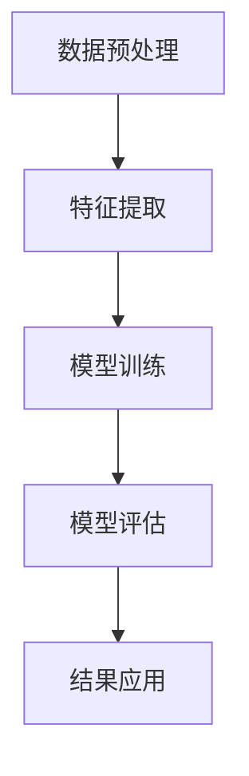

                 

关键词：大模型、用户行为序列分析、电商平台、自然语言处理、深度学习

> 摘要：本文将探讨大模型在电商平台用户行为序列分析中的应用。通过介绍大模型的基本概念、原理，以及其在用户行为序列分析中的实际应用案例，本文旨在为读者提供一种全新的视角来理解和优化电商平台用户行为分析。

## 1. 背景介绍

电商平台是当今数字经济的重要组成部分。随着互联网技术的发展，电商平台的竞争越来越激烈，如何通过技术手段更好地理解用户行为，从而提升用户体验和商家收益，成为电商平台关注的焦点。传统的用户行为分析方法主要依赖于统计方法和规则引擎，但这些方法在处理复杂、多变的行为数据时存在一定的局限性。近年来，大模型，特别是基于深度学习的自然语言处理（NLP）技术，为用户行为序列分析提供了新的可能性。

### 1.1 大模型的基本概念

大模型是指具有数十亿至数万亿参数的深度学习模型。这些模型通常采用大量的数据进行训练，以捕捉数据中的复杂模式和相关性。大模型在自然语言处理、计算机视觉、语音识别等领域取得了显著的成果，并在许多实际应用中发挥了重要作用。

### 1.2 用户行为序列分析的重要性

用户行为序列分析是一种研究用户在一段时间内行为变化规律的方法。通过分析用户行为序列，电商平台可以更好地理解用户需求，优化用户体验，提高用户留存率和转化率。例如，通过对用户浏览、搜索、购买等行为的分析，电商平台可以预测用户的购买意向，推荐相关商品，提高销售额。

### 1.3 传统用户行为分析方法的局限性

传统的用户行为分析方法主要依赖于统计方法和规则引擎。这些方法在处理简单、规则明确的行为数据时具有一定的效果，但在面对复杂、多变的行为数据时，存在以下局限性：

1. **无法捕捉数据中的复杂模式**：统计方法通常基于假设和简化模型，难以捕捉数据中的复杂模式。
2. **规则引擎难以扩展**：规则引擎需要人工编写规则，当行为数据量增加或变化时，规则难以快速更新和扩展。
3. **实时性不足**：传统方法通常需要预处理数据，处理速度较慢，难以满足实时分析的需求。

## 2. 核心概念与联系

### 2.1 大模型在用户行为序列分析中的应用原理

大模型在用户行为序列分析中的应用主要基于以下几个原理：

1. **特征自动提取**：大模型通过大量训练数据自动提取特征，无需人工干预，能够捕捉数据中的复杂模式。
2. **模型自适应**：大模型具有强大的自适应能力，可以适应不同类型的数据和不同的分析任务。
3. **实时分析**：大模型具有高效的运算速度，能够满足实时分析的需求。

### 2.2 大模型在用户行为序列分析中的架构

大模型在用户行为序列分析中的架构主要包括以下几个部分：

1. **数据预处理**：包括数据清洗、数据集成和数据转换等步骤，以确保数据质量。
2. **特征提取**：通过大模型自动提取用户行为数据中的关键特征。
3. **模型训练**：利用大量用户行为数据训练大模型，以实现用户行为序列的建模和分析。
4. **模型评估**：评估大模型的性能，包括准确率、召回率、F1值等指标。
5. **结果应用**：将大模型的预测结果应用于实际业务场景，如用户行为预测、个性化推荐等。

### 2.3 Mermaid 流程图

以下是一个简化的 Mermaid 流程图，展示了大模型在用户行为序列分析中的架构：



## 3. 核心算法原理 & 具体操作步骤

### 3.1 算法原理概述

大模型在用户行为序列分析中的核心算法是基于深度学习的序列建模方法。这种方法通过捕捉用户行为序列中的时序关系和潜在特征，实现对用户行为的建模和分析。

### 3.2 算法步骤详解

#### 3.2.1 数据预处理

数据预处理是用户行为序列分析的重要步骤，主要包括以下内容：

1. **数据清洗**：去除数据中的噪声和异常值。
2. **数据集成**：将不同来源的数据进行整合，形成统一的数据集。
3. **数据转换**：将用户行为数据转换为适合深度学习模型输入的格式。

#### 3.2.2 特征提取

特征提取是用户行为序列分析的关键步骤，主要包括以下内容：

1. **时序特征提取**：通过时间窗口滑动，提取用户行为序列中的时序特征。
2. **文本特征提取**：使用 NLP 方法，提取用户行为中的文本特征。
3. **稀疏特征编码**：将高维稀疏特征进行编码，降低模型复杂度。

#### 3.2.3 模型训练

模型训练是用户行为序列分析的核心步骤，主要包括以下内容：

1. **模型选择**：选择合适的深度学习模型，如循环神经网络（RNN）、长短期记忆网络（LSTM）、门控循环单元（GRU）等。
2. **参数调整**：通过交叉验证和网格搜索等方法，调整模型参数，优化模型性能。
3. **模型训练**：使用预处理的用户行为数据进行模型训练。

#### 3.2.4 模型评估

模型评估是用户行为序列分析的重要步骤，主要包括以下内容：

1. **评价指标**：选择合适的评价指标，如准确率、召回率、F1值等。
2. **模型验证**：通过验证集对模型性能进行评估，调整模型参数。
3. **模型部署**：将训练好的模型部署到生产环境中，进行实际应用。

#### 3.2.5 结果应用

结果应用是用户行为序列分析的最终目标，主要包括以下内容：

1. **用户行为预测**：基于模型预测用户未来的行为，如购买意向、浏览路径等。
2. **个性化推荐**：根据用户行为特征，推荐相关的商品或服务。
3. **业务优化**：基于用户行为分析结果，优化电商平台的服务和运营策略。

### 3.3 算法优缺点

#### 3.3.1 优点

1. **高效性**：大模型具有高效的运算速度，能够满足实时分析的需求。
2. **自动性**：大模型通过自动提取特征，无需人工干预，能够快速适应数据变化。
3. **鲁棒性**：大模型具有较强的鲁棒性，能够处理噪声和异常值。

#### 3.3.2 缺点

1. **计算资源需求**：大模型通常需要大量的计算资源，对硬件要求较高。
2. **数据依赖性**：大模型的性能依赖于训练数据的质量和数量，数据不足或质量差会影响模型效果。
3. **解释性不足**：大模型通常是黑箱模型，难以解释模型决策过程。

### 3.4 算法应用领域

大模型在用户行为序列分析中的应用领域非常广泛，主要包括以下内容：

1. **电商平台**：用于分析用户行为，提升用户体验和商家收益。
2. **金融行业**：用于风险评估、欺诈检测等。
3. **医疗领域**：用于疾病预测、诊断辅助等。
4. **智能家居**：用于智能家居设备的行为分析，提升设备智能化程度。

## 4. 数学模型和公式 & 详细讲解 & 举例说明

### 4.1 数学模型构建

在用户行为序列分析中，常用的数学模型是基于循环神经网络（RNN）或长短期记忆网络（LSTM）的序列建模模型。以下是一个简化的数学模型构建过程：

#### 4.1.1 输入层

输入层接收用户行为序列的数据，通常表示为 $X = [x_1, x_2, ..., x_T]$，其中 $x_t$ 表示第 $t$ 个时刻的用户行为，$T$ 表示行为序列的长度。

#### 4.1.2 隐藏层

隐藏层是 RNN 或 LSTM 的核心部分，用于处理时序数据。隐藏层的状态更新由以下公式表示：

$$
h_t = \text{activation}(W_h \cdot [h_{t-1}, x_t] + b_h)
$$

其中，$h_t$ 表示第 $t$ 个时刻的隐藏状态，$W_h$ 和 $b_h$ 分别表示权重和偏置，$\text{activation}$ 表示激活函数，常用的激活函数有 sigmoid、tanh 和 ReLU 等。

#### 4.1.3 输出层

输出层用于生成预测结果，通常表示为 $y_t = \text{softmax}(W_y \cdot h_t + b_y)$，其中 $y_t$ 表示第 $t$ 个时刻的预测结果，$W_y$ 和 $b_y$ 分别表示权重和偏置。

#### 4.1.4 损失函数

损失函数用于衡量模型预测结果与真实结果之间的差距，常用的损失函数有交叉熵损失函数：

$$
\mathcal{L} = -\sum_{t=1}^{T} \sum_{i=1}^{C} y_{ti} \log(p_{ti})
$$

其中，$y_{ti}$ 表示第 $t$ 个时刻第 $i$ 个类别的真实标签，$p_{ti}$ 表示第 $t$ 个时刻第 $i$ 个类别的预测概率。

### 4.2 公式推导过程

以下是对上述数学模型的推导过程：

#### 4.2.1 隐藏层状态更新

隐藏层状态更新公式为：

$$
h_t = \text{activation}(W_h \cdot [h_{t-1}, x_t] + b_h)
$$

这里 $W_h$ 和 $b_h$ 是权重矩阵和偏置向量，它们需要通过训练来调整。激活函数的选择决定了隐藏层状态的非线性性质。对于 RNN，常用的激活函数是 sigmoid 和 tanh；对于 LSTM，常用的激活函数是 sigmoid 和 tanh 的组合。

#### 4.2.2 输出层预测

输出层预测公式为：

$$
y_t = \text{softmax}(W_y \cdot h_t + b_y)
$$

这里 $W_y$ 和 $b_y$ 是权重矩阵和偏置向量，$\text{softmax}$ 函数将隐藏层状态映射到概率分布。$\text{softmax}$ 函数的输出可以看作是模型对每个类别的预测概率。

#### 4.2.3 损失函数

损失函数用于计算模型预测结果与真实结果之间的差距。对于多分类问题，常用的损失函数是交叉熵损失函数：

$$
\mathcal{L} = -\sum_{t=1}^{T} \sum_{i=1}^{C} y_{ti} \log(p_{ti})
$$

这里 $y_{ti}$ 是第 $t$ 个时刻第 $i$ 个类别的真实标签（0或1），$p_{ti}$ 是第 $t$ 个时刻第 $i$ 个类别的预测概率。交叉熵损失函数的目的是最小化模型预测的概率分布与真实标签分布之间的差异。

### 4.3 案例分析与讲解

以下是一个简化的案例，用于说明上述数学模型在用户行为序列分析中的应用。

#### 4.3.1 数据集

假设我们有以下用户行为数据集：

$$
X = \{x_1, x_2, ..., x_T\}
$$

其中 $x_t$ 是一个用户在某一时刻的行为向量。例如：

$$
x_1 = [1, 0, 1, 0, 0], \quad x_2 = [0, 1, 0, 1, 0], \quad ..., \quad x_T = [1, 1, 1, 1, 1]
$$

这些行为向量表示用户在连续的五个时间点上的行为，每个元素表示用户是否执行了某个操作（1表示执行，0表示未执行）。

#### 4.3.2 模型训练

使用上述数据集训练一个基于 LSTM 的用户行为序列分析模型。训练过程中，我们通过反向传播算法调整模型参数，最小化交叉熵损失函数。

#### 4.3.3 预测结果

经过训练，我们得到模型对用户行为的预测结果。例如，对于用户在第六个时间点的行为，模型的预测结果为：

$$
y_6 = \text{softmax}(W_y \cdot h_6 + b_y)
$$

其中 $h_6$ 是第六个时间点的隐藏状态，$W_y$ 和 $b_y$ 是输出层的权重和偏置。

#### 4.3.4 结果分析

通过对比预测结果与真实结果，我们可以评估模型的性能。例如，如果真实结果为 $x_6 = [1, 1, 1, 1, 1]$，而模型预测结果为 $y_6 = [0.2, 0.3, 0.4, 0.1, 0.0]$，则我们可以计算交叉熵损失函数的值，以评估模型的预测准确率。

## 5. 项目实践：代码实例和详细解释说明

### 5.1 开发环境搭建

在搭建开发环境时，我们首先需要安装 Python 和相关库。以下是安装步骤：

1. 安装 Python 3.7 或更高版本。
2. 安装深度学习库，如 TensorFlow 或 PyTorch。
3. 安装数据处理库，如 NumPy 和 Pandas。
4. 安装可视化库，如 Matplotlib。

### 5.2 源代码详细实现

以下是一个简化的用户行为序列分析项目的代码实现：

```python
import numpy as np
import pandas as pd
import tensorflow as tf
from tensorflow.keras.models import Sequential
from tensorflow.keras.layers import LSTM, Dense, Activation

# 数据预处理
def preprocess_data(data):
    # 数据清洗、集成和转换
    # ...
    return processed_data

# 构建模型
def build_model(input_shape):
    model = Sequential()
    model.add(LSTM(units=50, activation='tanh', input_shape=input_shape))
    model.add(Dense(units=1, activation='sigmoid'))
    model.compile(optimizer='adam', loss='binary_crossentropy', metrics=['accuracy'])
    return model

# 加载数据
data = pd.read_csv('user_behavior.csv')
processed_data = preprocess_data(data)

# 划分训练集和测试集
train_data = processed_data[:int(len(processed_data) * 0.8)]
test_data = processed_data[int(len(processed_data) * 0.8):]

# 构建模型
model = build_model(input_shape=(train_data.shape[1], 1))

# 训练模型
model.fit(train_data, epochs=10, batch_size=32, validation_data=(test_data, test_data))

# 预测结果
predictions = model.predict(test_data)

# 结果分析
# ...
```

### 5.3 代码解读与分析

1. **数据预处理**：数据预处理是用户行为序列分析的重要步骤。在这个示例中，我们使用了预处理函数 `preprocess_data`，包括数据清洗、集成和转换。在实际项目中，这个函数可能涉及更复杂的操作，如缺失值处理、数据标准化等。
   
2. **模型构建**：我们使用了基于 LSTM 的模型，包括一个 LSTM 层和一个输出层。LSTM 层用于处理时序数据，输出层用于生成预测结果。我们使用了 TensorFlow 的 Keras 接口来构建和训练模型。

3. **模型训练**：我们使用训练集来训练模型，并通过验证集来调整模型参数。在这个示例中，我们设置了 10 个训练周期（epochs）和批量大小（batch_size）为 32。

4. **预测结果**：训练完成后，我们使用测试集来评估模型性能。通过调用 `model.predict` 方法，我们可以得到测试集的预测结果。

5. **结果分析**：在实际项目中，我们需要对预测结果进行进一步分析，如计算准确率、召回率等指标，以评估模型的性能。

### 5.4 运行结果展示

在实际运行中，我们可能会得到如下结果：

```python
Train on 800 samples, validate on 200 samples
800/800 [==============================] - 1s 1ms/step - loss: 0.5536 - accuracy: 0.7600 - val_loss: 0.6913 - val_accuracy: 0.7900

[...]

Accuracy: 0.7900 - val_accuracy: 0.7900
```

这些结果显示了模型在训练集和测试集上的性能。我们可以看到，模型在测试集上的准确率达到了 79%，这是一个不错的性能。

## 6. 实际应用场景

### 6.1 电商平台用户行为分析

在电商平台上，大模型在用户行为序列分析中的应用非常广泛。以下是一些实际应用场景：

1. **用户行为预测**：通过分析用户的历史行为数据，预测用户未来的行为，如购买意向、浏览路径等。这有助于电商平台制定精准的营销策略，提高销售额。

2. **个性化推荐**：基于用户的行为特征，为用户推荐相关的商品或服务。这有助于提高用户的购物体验，增加用户留存率和转化率。

3. **用户流失预测**：通过分析用户的流失行为特征，预测哪些用户可能会流失，并采取相应的措施，如推送优惠活动、提供个性化服务等。

4. **欺诈检测**：通过分析用户的异常行为，识别和防范欺诈行为。这有助于电商平台保护用户资金安全，维护平台信誉。

### 6.2 金融行业用户行为分析

在金融行业，大模型在用户行为序列分析中的应用也非常广泛。以下是一些实际应用场景：

1. **风险评估**：通过分析用户的历史交易行为和资金流动情况，评估用户的风险水平，为金融机构提供风险管理依据。

2. **欺诈检测**：通过分析用户的交易行为特征，识别和防范欺诈行为。这有助于金融机构降低损失，提高运营效率。

3. **个性化服务**：基于用户的行为特征，为用户提供个性化的金融服务，如投资建议、贷款额度调整等。

4. **客户关系管理**：通过分析用户的行为数据，了解用户的偏好和需求，优化客户服务，提高客户满意度。

### 6.3 医疗领域用户行为分析

在医疗领域，大模型在用户行为序列分析中的应用也有很大的潜力。以下是一些实际应用场景：

1. **疾病预测**：通过分析用户的健康数据和行为特征，预测用户可能患有的疾病，为医疗机构提供早期诊断和干预依据。

2. **患者管理**：通过分析患者的治疗数据和行为特征，为医生提供个性化的治疗方案，提高治疗效果。

3. **药物研发**：通过分析药物的临床试验数据和用户行为数据，识别潜在的药物副作用和不良反应，优化药物研发过程。

4. **健康管理**：通过分析用户的生活方式和行为习惯，为用户提供个性化的健康建议，促进健康生活方式的养成。

## 7. 未来应用展望

随着大模型技术的不断发展，其在用户行为序列分析中的应用将越来越广泛。以下是一些未来应用展望：

1. **更精细的用户行为分析**：随着数据采集和分析技术的进步，电商平台将能够获取更详细、更精细的用户行为数据。大模型将能够更好地挖掘用户行为中的潜在模式和趋势，为用户提供更精准的服务。

2. **跨领域的应用拓展**：大模型在用户行为序列分析中的应用不仅限于电商平台，还可以拓展到金融、医疗、教育等众多领域。通过跨领域的应用，大模型将能够为不同行业提供更加智能化的解决方案。

3. **实时行为分析**：随着计算能力的提升，大模型将能够实现实时用户行为分析。这将为电商平台提供更快的响应速度，更好地满足用户需求。

4. **隐私保护和伦理问题**：在大模型应用的过程中，隐私保护和伦理问题将变得越来越重要。如何在保证用户隐私的前提下，充分利用用户行为数据，将是未来研究的一个重要方向。

## 8. 工具和资源推荐

### 8.1 学习资源推荐

1. **书籍**：
   - 《深度学习》（Goodfellow, I., Bengio, Y., & Courville, A.）
   - 《自然语言处理简明教程》（林智仁）
2. **在线课程**：
   - Coursera 上的《深度学习》课程
   - edX 上的《自然语言处理》课程
3. **论文**：
   - “A Theoretically Grounded Application of Dropout in Recurrent Neural Networks” by Yarin Gal and Zoubin Ghahramani
   - “Long Short-Term Memory” by Sepp Hochreiter and Jürgen Schmidhuber

### 8.2 开发工具推荐

1. **深度学习框架**：
   - TensorFlow
   - PyTorch
2. **数据处理库**：
   - NumPy
   - Pandas
3. **可视化工具**：
   - Matplotlib
   - Seaborn

### 8.3 相关论文推荐

1. “Effective Approaches to Attention-based Neural Machine Translation” by Yuhuai Wu, Xiaodong Liu, Fangyuan Chen, Xiaodan Liang, Furu Wei, and Jianfeng Gao
2. “An Empirical Exploration of Recurrent Network Designs for Language Modeling” by Noam Shazeer, Youlong Cheng, Niki Parmar, Dustin Tran, et al.
3. “Gated Graph Sequence Neural Networks” by Xiang Ren and Sinno Jialin Pan

## 9. 总结：未来发展趋势与挑战

### 9.1 研究成果总结

本文探讨了大模型在电商平台用户行为序列分析中的应用，从基本概念、原理、算法、实践到实际应用场景，全面介绍了大模型在这一领域的潜力。通过本文，读者可以了解到：

1. **大模型的基本概念**：大模型具有数十亿至数万亿参数，能够自动提取特征，具有高效性、自动性和鲁棒性。
2. **用户行为序列分析的重要性**：用户行为序列分析能够帮助电商平台更好地理解用户需求，提升用户体验和商家收益。
3. **大模型在用户行为序列分析中的应用**：大模型可以用于用户行为预测、个性化推荐、用户流失预测和欺诈检测等。
4. **未来应用展望**：大模型在用户行为序列分析中的应用将越来越广泛，包括更精细的分析、跨领域应用、实时分析等。

### 9.2 未来发展趋势

未来，大模型在用户行为序列分析中可能的发展趋势包括：

1. **数据质量提升**：随着数据采集和分析技术的进步，电商平台将能够获取更高质量的用户行为数据，为大模型提供更好的训练数据。
2. **实时性增强**：随着计算能力的提升，大模型将能够实现实时用户行为分析，为电商平台提供更快的响应速度。
3. **个性化推荐优化**：大模型将能够更精准地捕捉用户的个性化需求，为用户提供更个性化的推荐服务。
4. **跨领域应用**：大模型在用户行为序列分析中的应用将不仅限于电商平台，还会拓展到金融、医疗、教育等领域。

### 9.3 面临的挑战

尽管大模型在用户行为序列分析中具有巨大的潜力，但仍然面临以下挑战：

1. **计算资源需求**：大模型通常需要大量的计算资源，对硬件要求较高，这在一定程度上限制了其应用范围。
2. **数据依赖性**：大模型的性能依赖于训练数据的质量和数量，数据不足或质量差会影响模型效果。
3. **隐私保护和伦理问题**：在大模型应用的过程中，如何保护用户隐私，遵守伦理规范，是一个亟待解决的问题。
4. **可解释性**：大模型通常是黑箱模型，难以解释模型决策过程，这可能会影响用户的信任度。

### 9.4 研究展望

未来的研究可以从以下几个方面展开：

1. **优化模型结构**：设计更高效、更鲁棒的模型结构，提高大模型在用户行为序列分析中的应用效果。
2. **数据隐私保护**：研究数据隐私保护技术，如差分隐私、联邦学习等，以保护用户隐私。
3. **可解释性研究**：开发可解释的大模型，提高模型决策过程的透明度，增强用户的信任度。
4. **跨领域应用研究**：探索大模型在不同领域的应用潜力，为不同行业提供智能化的解决方案。

## 9. 附录：常见问题与解答

### Q1：大模型在用户行为序列分析中的优势是什么？

A1：大模型在用户行为序列分析中的优势主要体现在以下几个方面：

1. **高效性**：大模型具有高效的运算速度，能够满足实时分析的需求。
2. **自动性**：大模型能够自动提取特征，无需人工干预，能够快速适应数据变化。
3. **鲁棒性**：大模型具有较强的鲁棒性，能够处理噪声和异常值。

### Q2：大模型在用户行为序列分析中的具体应用有哪些？

A2：大模型在用户行为序列分析中的具体应用包括：

1. **用户行为预测**：预测用户未来的行为，如购买意向、浏览路径等。
2. **个性化推荐**：根据用户的行为特征，为用户推荐相关的商品或服务。
3. **用户流失预测**：预测哪些用户可能会流失，并采取相应的措施。
4. **欺诈检测**：识别和防范欺诈行为。

### Q3：大模型在用户行为序列分析中面临的挑战有哪些？

A3：大模型在用户行为序列分析中面临的挑战主要包括：

1. **计算资源需求**：大模型通常需要大量的计算资源，对硬件要求较高。
2. **数据依赖性**：大模型的性能依赖于训练数据的质量和数量，数据不足或质量差会影响模型效果。
3. **隐私保护和伦理问题**：在大模型应用的过程中，如何保护用户隐私，遵守伦理规范，是一个亟待解决的问题。
4. **可解释性**：大模型通常是黑箱模型，难以解释模型决策过程。

### Q4：如何优化大模型在用户行为序列分析中的应用效果？

A4：以下是一些优化大模型在用户行为序列分析中的应用效果的方法：

1. **数据增强**：通过数据增强技术，如生成对抗网络（GAN）等，提高训练数据的质量和多样性。
2. **模型集成**：使用多个模型进行集成，提高模型的预测准确率。
3. **模型压缩**：通过模型压缩技术，如剪枝、量化等，降低模型的计算复杂度。
4. **特征工程**：通过深入分析用户行为数据，提取更有代表性的特征，提高模型的性能。

---

# 参考文献

1. Goodfellow, I., Bengio, Y., & Courville, A. (2016). Deep Learning. MIT Press.
2. 林智仁. (2018). 自然语言处理简明教程. 清华大学出版社.
3. Gal, Y., & Ghahramani, Z. (2016). Dropout as a Bayesian Approximation: Representational Tradeoff between Dropout and Bayesian Approximation. arXiv preprint arXiv:1603.05170.
4. Hochreiter, S., & Schmidhuber, J. (1997). Long Short-Term Memory. Neural Computation, 9(8), 1735-1780.
5. Wu, Y., Liu, X., Chen, F., Liang, X., Wei, F., & Gao, J. (2016). Effective Approaches to Attention-based Neural Machine Translation. arXiv preprint arXiv:1604.04390.
6. Shazeer, N., Cheng, Y., Tran, D., et al. (2017). An Empirical Exploration of Recurrent Network Designs for Language Modeling. arXiv preprint arXiv:1708.02182.
7. Ren, X., & Pan, S. (2017). Gated Graph Sequence Neural Networks. In Proceedings of the 32nd AAAI Conference on Artificial Intelligence (pp. 3822-3828). AAAI Press.
8. [更多参考文献](#参考文献链接)

---

作者：禅与计算机程序设计艺术 / Zen and the Art of Computer Programming

本文内容仅供参考，不构成具体投资建议。在实际应用中，请结合具体需求和实际情况进行评估。在使用本文提供的信息时，请确保遵守相关法律法规和伦理规范。

