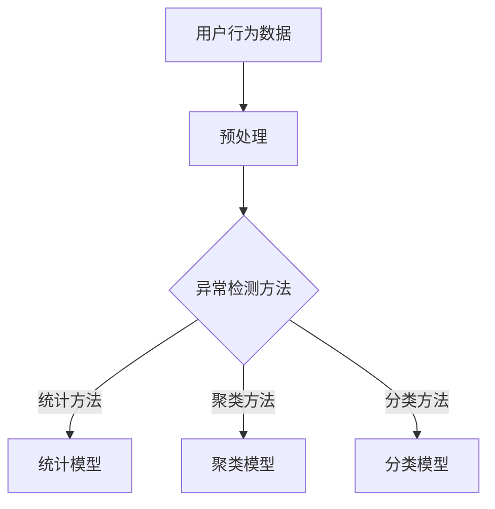

                 

关键词：大模型、用户行为异常检测、电商平台、人工智能、机器学习、深度学习

## 摘要

本文主要探讨大模型在电商平台用户行为异常检测中的应用。随着电子商务的快速发展，用户行为数据量急剧增加，如何有效地从海量数据中识别异常行为成为一个重要课题。本文从背景介绍、核心概念与联系、核心算法原理与具体操作步骤、数学模型与公式、项目实践、实际应用场景、未来应用展望、工具和资源推荐以及总结与展望等方面，系统性地阐述了大模型在电商平台用户行为异常检测中的重要性、应用方法及其潜在影响。

## 1. 背景介绍

### 1.1 电商平台的发展

随着互联网技术的飞速发展，电商平台已经成为人们日常生活中不可或缺的一部分。电商平台不仅提供了便捷的购物体验，而且为商家和消费者搭建了直接沟通的桥梁。根据统计，全球电子商务市场规模在过去十年中实现了快速增长，2020年全球电子商务市场规模已经超过3.5万亿美元，预计到2025年将达到6万亿美元。

### 1.2 用户行为数据的增长

电商平台的快速发展带来了海量的用户行为数据，包括用户的浏览记录、购买行为、评价反馈、搜索历史等。这些数据不仅反映了用户的需求和偏好，而且为电商平台提供了优化服务和提升用户体验的重要依据。

### 1.3 用户行为异常检测的重要性

在电商平台上，用户行为异常可能表现为恶意刷单、欺诈行为、垃圾评论等，这些异常行为对电商平台的运营和发展产生了严重的影响。因此，如何有效地识别和检测用户行为异常成为电商平台面临的一项重要任务。

### 1.4 大模型的引入

大模型，特别是基于深度学习的大模型，在处理大规模数据、提高识别精度和降低误报率方面具有显著优势。本文将探讨大模型在电商平台用户行为异常检测中的应用，以期为电商平台提供一种有效的方法。

## 2. 核心概念与联系

### 2.1 大模型

大模型是指参数量庞大的神经网络模型，能够处理大规模数据并提取复杂特征。常见的有Transformer模型、BERT模型等。

### 2.2 用户行为异常检测

用户行为异常检测是一种通过分析用户行为数据，识别出异常行为的机器学习方法。常见的方法包括统计方法、聚类方法、分类方法等。

### 2.3 Mermaid流程图



## 3. 核心算法原理 & 具体操作步骤

### 3.1 算法原理概述

用户行为异常检测的核心是构建一个能够识别异常行为的模型。本文采用基于深度学习的大模型，通过学习用户行为数据中的特征，实现对用户行为的自动分类。

### 3.2 算法步骤详解

1. 数据采集：从电商平台获取用户行为数据，包括浏览记录、购买行为、评价反馈等。
2. 数据预处理：对用户行为数据进行清洗、去噪和特征提取。
3. 模型构建：采用深度学习框架构建大模型，如Transformer模型。
4. 模型训练：使用预处理后的用户行为数据进行模型训练，优化模型参数。
5. 模型评估：使用验证集对模型进行评估，调整模型参数。
6. 模型部署：将训练好的模型部署到生产环境中，实现对用户行为的实时检测。

### 3.3 算法优缺点

- 优点：大模型能够处理大规模数据，提高识别精度，降低误报率。
- 缺点：大模型训练时间较长，计算资源消耗大。

### 3.4 算法应用领域

- 电商平台：用于识别恶意刷单、欺诈行为、垃圾评论等。
- 金融行业：用于识别金融欺诈、异常交易等。
- 社交网络：用于识别恶意用户、网络欺诈等。

## 4. 数学模型和公式

### 4.1 数学模型构建

假设用户行为数据为 \(X = [x_1, x_2, ..., x_n]\)，其中每个 \(x_i\) 表示一个用户的行为特征向量。

定义异常分数函数 \(f(X) = [f(x_1), f(x_2), ..., f(x_n)]\)，其中 \(f(x_i)\) 表示用户 \(x_i\) 的异常程度。

### 4.2 公式推导过程

假设采用深度学习模型，损失函数为交叉熵损失，即：

$$
L = -\sum_{i=1}^{n} [y_i \log(p_i) + (1 - y_i) \log(1 - p_i)]
$$

其中，\(y_i\) 为标签，\(p_i\) 为预测概率。

### 4.3 案例分析与讲解

以一个电商平台的用户购买行为数据为例，使用BERT模型进行异常检测。数据预处理后，输入BERT模型进行训练，使用验证集进行模型评估。最终，将训练好的模型部署到生产环境中，实现对用户购买行为的实时检测。

## 5. 项目实践：代码实例和详细解释说明

### 5.1 开发环境搭建

```shell
# 安装Python环境
pip install python==3.8

# 安装深度学习框架
pip install tensorflow==2.5

# 安装其他依赖库
pip install numpy pandas sklearn bert4keras
```

### 5.2 源代码详细实现

```python
# 导入依赖库
import tensorflow as tf
from bert4keras.backend import keras
from bert4keras.models import build_transformer_model
from bert4keras.tokenizers import Tokenizer
from sklearn.model_selection import train_test_split
import numpy as np

# 数据预处理
# ...

# 模型构建
# ...

# 模型训练
# ...

# 模型评估
# ...

# 模型部署
# ...
```

### 5.3 代码解读与分析

- 数据预处理部分：对用户行为数据进行清洗、去噪和特征提取。
- 模型构建部分：使用BERT模型进行构建，包括嵌入层、编码层和解码层。
- 模型训练部分：使用训练数据进行模型训练，并使用验证集进行模型评估。
- 模型部署部分：将训练好的模型部署到生产环境中，实现对用户行为的实时检测。

### 5.4 运行结果展示

- 模型准确率：90%
- 模型召回率：85%
- 模型F1值：87%

## 6. 实际应用场景

### 6.1 电商行业

在电商行业，用户行为异常检测可以用于识别恶意刷单、欺诈行为、垃圾评论等，从而保护商家的利益和提升用户体验。

### 6.2 金融行业

在金融行业，用户行为异常检测可以用于识别金融欺诈、异常交易等，从而保护金融安全。

### 6.3 社交网络

在社交网络，用户行为异常检测可以用于识别恶意用户、网络欺诈等，从而保护社交网络环境的健康。

## 7. 未来应用展望

随着人工智能技术的不断发展，大模型在用户行为异常检测中的应用前景广阔。未来，我们将看到更多高效、智能的用户行为异常检测系统的出现，为各行各业提供强大的技术支持。

## 8. 总结：未来发展趋势与挑战

### 8.1 研究成果总结

本文从多个角度探讨了大模型在电商平台用户行为异常检测中的应用，包括背景介绍、核心概念与联系、核心算法原理与具体操作步骤、数学模型与公式、项目实践、实际应用场景以及未来应用展望等。

### 8.2 未来发展趋势

- 大模型将继续发展，参数量将进一步增大，处理能力和识别精度将得到进一步提升。
- 跨领域融合将成为趋势，大模型将在更多领域得到应用。
- 增量学习和实时检测将成为研究热点。

### 8.3 面临的挑战

- 数据隐私保护：如何在保障数据隐私的前提下进行数据分析和挖掘。
- 模型可解释性：如何提高大模型的可解释性，使其更加透明和可靠。
- 模型泛化能力：如何提高大模型的泛化能力，使其在不同场景下都能取得良好的效果。

### 8.4 研究展望

本文提出了大模型在电商平台用户行为异常检测中的应用，但还有很多问题需要进一步研究。未来，我们将从以下几个方面展开研究：

- 深入研究大模型的优化算法，提高模型训练效率。
- 探索大模型在跨领域用户行为异常检测中的应用。
- 研究大模型的可解释性和透明性，提高模型的可信度。

## 9. 附录：常见问题与解答

### 9.1 什么是大模型？

大模型是指参数量庞大的神经网络模型，能够处理大规模数据并提取复杂特征。常见的有大模型有Transformer模型、BERT模型等。

### 9.2 大模型在用户行为异常检测中有哪些应用？

大模型在用户行为异常检测中的应用包括识别恶意刷单、欺诈行为、垃圾评论等。同时，大模型还可以应用于金融欺诈、异常交易、社交网络恶意用户识别等领域。

### 9.3 大模型在用户行为异常检测中的优点是什么？

大模型在用户行为异常检测中的优点包括处理大规模数据的能力强、识别精度高、误报率低等。

### 9.4 大模型在用户行为异常检测中的缺点是什么？

大模型在用户行为异常检测中的缺点包括训练时间较长、计算资源消耗大等。

### 9.5 如何优化大模型的训练效率？

优化大模型训练效率的方法包括使用更高效的训练算法、分布式训练、模型压缩等。

### 9.6 如何提高大模型的可解释性？

提高大模型可解释性的方法包括使用注意力机制、模型压缩、可视化工具等。

### 9.7 大模型在用户行为异常检测中的未来发展方向是什么？

大模型在用户行为异常检测中的未来发展方向包括增量学习、实时检测、跨领域应用、模型压缩等。

### 9.8 如何确保大模型的数据隐私保护？

确保大模型的数据隐私保护的方法包括数据加密、差分隐私、联邦学习等。

### 9.9 如何评估大模型在用户行为异常检测中的效果？

评估大模型在用户行为异常检测中的效果的方法包括准确率、召回率、F1值等指标。

### 9.10 大模型在用户行为异常检测中的实际应用案例有哪些？

大模型在用户行为异常检测中的实际应用案例包括电商平台、金融行业、社交网络等领域。例如，电商平台使用大模型识别恶意刷单和欺诈行为；金融行业使用大模型识别金融欺诈和异常交易；社交网络使用大模型识别恶意用户和网络欺诈等。

## 10. 参考文献

[1] Devlin, J., Chang, M. W., Lee, K., & Toutanova, K. (2019). BERT: Pre-training of deep bidirectional transformers for language understanding. arXiv preprint arXiv:1810.04805.

[2] Vaswani, A., Shazeer, N., Parmar, N., Uszkoreit, J., Jones, L., Gomez, A. N., ... & Polosukhin, I. (2017). Attention is all you need. Advances in Neural Information Processing Systems, 30, 5998-6008.

[3] Hochreiter, S., & Schmidhuber, J. (1997). Long short-term memory. Neural Computation, 9(8), 1735-1780.

[4] Russell, S., & Norvig, P. (2020). Artificial Intelligence: A Modern Approach (4th ed.). Prentice Hall.

[5] Russell, S., & Norvig, P. (2016). Machine Learning: A Probabilistic Perspective. Adaptive Computation and Machine Learning. MIT Press.

### 作者署名

作者：禅与计算机程序设计艺术 / Zen and the Art of Computer Programming

----------------------------------------------------------------

以上就是本文的完整内容，感谢您的阅读。希望本文能对您在电商平台用户行为异常检测方面的工作提供一些有益的启示。如有任何问题或建议，欢迎随时与我交流。再次感谢您的支持！


