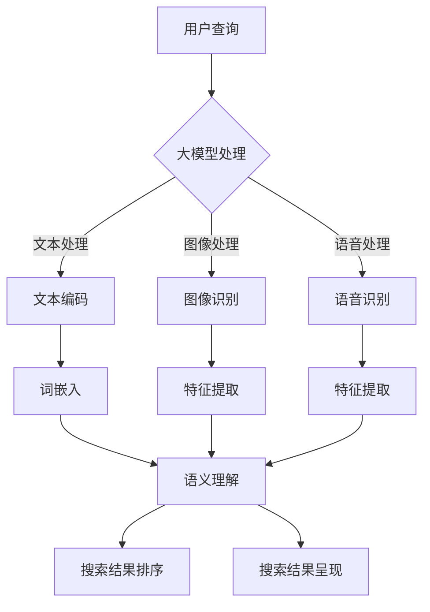

                 

关键词：大模型，电商平台，搜索体验，优化，算法，数学模型，应用实践

> 摘要：本文从大模型在电商平台搜索体验优化的背景出发，深入探讨了如何运用大模型技术提升电商搜索的准确性和用户体验。文章首先介绍了大模型的基本概念和优势，然后详细分析了核心算法原理及其实现步骤，最后通过实际项目实践展示了大模型在电商平台搜索中的应用效果，并对未来发展趋势和面临的挑战进行了展望。

## 1. 背景介绍

随着互联网的普及和电子商务的快速发展，电商平台已经成为人们日常购物的重要渠道。然而，在庞大的商品数据库中，用户往往需要花费大量时间来寻找自己所需的商品。如何提高电商平台的搜索体验，成为各大电商平台亟待解决的问题。

传统的搜索算法主要依赖于关键词匹配和页面内容分析，但这种方法在处理海量数据和复杂查询时往往力不从心。为了提高搜索准确性和用户体验，大模型技术应运而生。大模型（Large Model）是指具有海量参数和强大计算能力的深度学习模型，能够通过自主学习海量数据，实现复杂的语义理解和智能搜索。

大模型在电商平台的搜索体验优化中具有显著的优势。首先，大模型可以处理多模态数据，包括文本、图像、语音等，从而实现对用户查询意图的全面理解。其次，大模型可以实时学习和调整，根据用户行为和反馈不断优化搜索结果。此外，大模型还可以利用丰富的外部知识和语义信息，提高搜索结果的准确性和相关性。

本文将围绕大模型在电商平台搜索体验优化中的应用，详细介绍核心算法原理、数学模型和具体实现步骤，并通过实际项目实践展示大模型在电商平台搜索中的应用效果。

## 2. 核心概念与联系

### 2.1 大模型的基本概念

大模型是指具有海量参数和强大计算能力的深度学习模型。它通过自主学习海量数据，实现对复杂任务的高效处理。大模型通常采用神经网络架构，具有多层神经元，能够捕捉数据中的复杂模式和关联性。大模型的参数数量通常在数百万到数十亿之间，这使得它们具有强大的表示和学习能力。

### 2.2 大模型的优势

大模型在电商平台的搜索体验优化中具有以下优势：

1. **处理多模态数据**：大模型可以处理多种类型的数据，如文本、图像、语音等，从而实现对用户查询意图的全面理解。
2. **实时学习和调整**：大模型可以实时学习和调整，根据用户行为和反馈不断优化搜索结果。
3. **利用外部知识**：大模型可以利用丰富的外部知识和语义信息，提高搜索结果的准确性和相关性。

### 2.3 大模型与电商平台搜索的关系

电商平台搜索的核心目标是提供准确、相关的搜索结果，以满足用户的查询需求。大模型在这一过程中发挥着关键作用。通过大模型，电商平台可以实现以下目标：

1. **理解用户查询意图**：大模型可以捕捉用户的查询意图，从而提供更加准确的搜索结果。
2. **优化搜索结果排序**：大模型可以根据用户行为和反馈，实时调整搜索结果排序，提高用户体验。
3. **提高搜索响应速度**：大模型可以通过预训练和推理优化，提高搜索响应速度，降低延迟。

### 2.4 大模型架构的 Mermaid 流程图

下面是一个描述大模型在电商平台搜索中的架构的 Mermaid 流程图：



在这个流程图中，用户查询首先经过大模型的文本处理、图像处理和语音处理模块，然后进行特征提取和语义理解，最后实现搜索结果排序和呈现。

## 3. 核心算法原理 & 具体操作步骤

### 3.1 算法原理概述

大模型在电商平台搜索中的核心算法主要包括文本处理、图像处理、语音处理、特征提取、语义理解和搜索结果排序等几个关键步骤。

1. **文本处理**：文本处理模块负责将用户输入的查询文本进行预处理，包括分词、去停用词、词性标注等，以便后续的词嵌入和语义理解。
2. **图像处理**：图像处理模块负责将用户上传的图像数据进行预处理，包括图像增强、去噪、缩放等，以便后续的特征提取。
3. **语音处理**：语音处理模块负责将用户输入的语音数据进行预处理，包括语音识别、音素划分等，以便后续的特征提取。
4. **特征提取**：特征提取模块负责从文本、图像和语音数据中提取关键特征，以便后续的语义理解和搜索结果排序。
5. **语义理解**：语义理解模块负责理解用户查询的意图，包括关键词提取、实体识别、关系抽取等，以便后续的搜索结果排序。
6. **搜索结果排序**：搜索结果排序模块负责根据用户查询意图和商品特征，对搜索结果进行排序，以提高相关性和用户体验。

### 3.2 算法步骤详解

1. **文本处理**：文本处理模块的具体步骤如下：
   - 分词：将用户输入的查询文本分割成词语。
   - 去停用词：去除文本中的常见停用词，如“的”、“和”、“是”等。
   - 词性标注：对每个词语进行词性标注，以便后续的语义理解。
2. **图像处理**：图像处理模块的具体步骤如下：
   - 图像增强：对图像进行增强，如对比度调整、亮度调整等。
   - 去噪：对图像进行去噪处理，如高斯滤波、中值滤波等。
   - 缩放：对图像进行缩放处理，以适应后续的特征提取。
3. **语音处理**：语音处理模块的具体步骤如下：
   - 语音识别：将用户输入的语音数据转换为文本数据。
   - 音素划分：对语音数据进行音素划分，以便后续的特征提取。
4. **特征提取**：特征提取模块的具体步骤如下：
   - 文本特征提取：采用词嵌入技术，将文本数据转换为向量表示。
   - 图像特征提取：采用卷积神经网络（CNN）等技术，将图像数据转换为特征向量。
   - 语音特征提取：采用循环神经网络（RNN）等技术，将语音数据转换为特征向量。
5. **语义理解**：语义理解模块的具体步骤如下：
   - 关键词提取：从文本数据中提取关键关键词，以表示用户查询的意图。
   - 实体识别：从文本数据中识别出实体，如商品名称、品牌等。
   - 关系抽取：从文本数据中抽取出实体之间的关系，如“购买”、“评价”等。
6. **搜索结果排序**：搜索结果排序模块的具体步骤如下：
   - 计算相似度：根据用户查询意图和商品特征，计算每个商品的相似度。
   - 排序：根据相似度对商品进行排序，以提供最相关的搜索结果。

### 3.3 算法优缺点

**优点**：

1. **高准确性**：大模型通过学习海量数据，能够准确理解用户查询意图，提高搜索结果的准确性。
2. **多模态处理**：大模型能够处理多种类型的数据，包括文本、图像、语音等，提高搜索结果的全面性。
3. **实时优化**：大模型可以实时学习和调整，根据用户行为和反馈不断优化搜索结果，提高用户体验。

**缺点**：

1. **计算资源消耗**：大模型通常需要大量计算资源，如GPU或TPU等，这对硬件设施提出了较高要求。
2. **训练时间长**：大模型的训练过程通常需要较长时间，特别是在处理海量数据时，这对数据预处理和训练策略提出了较高要求。
3. **数据隐私问题**：大模型在训练过程中会接触到大量用户数据，这可能涉及到数据隐私问题，需要采取相应的隐私保护措施。

### 3.4 算法应用领域

大模型在电商平台搜索体验优化中的应用领域主要包括以下几个方面：

1. **商品搜索**：通过大模型，电商平台可以实现更加准确的商品搜索，提高用户购物的效率。
2. **推荐系统**：大模型可以用于推荐系统的优化，提高推荐结果的准确性和用户体验。
3. **智能客服**：大模型可以用于智能客服系统，实现更加自然和高效的客服交互。
4. **广告投放**：大模型可以用于广告投放的优化，提高广告的相关性和投放效果。

## 4. 数学模型和公式 & 详细讲解 & 举例说明

### 4.1 数学模型构建

大模型在电商平台搜索中的数学模型主要包括词嵌入、卷积神经网络（CNN）、循环神经网络（RNN）、相似度计算等。

**词嵌入**：

词嵌入是将词语映射为高维向量表示的方法。词嵌入的数学模型通常采用 Word2Vec 算法，其目标是最小化词语向量与其相邻词语的夹角。具体公式如下：

$$
\min_{\mathbf{v}_w, \mathbf{v}_c} \sum_{w \in V, c \in C} (1 - \cos(\mathbf{v}_w, \mathbf{v}_c))
$$

其中，$V$ 是词语集合，$C$ 是上下文词语集合，$\mathbf{v}_w$ 和 $\mathbf{v}_c$ 分别是词语 $w$ 和上下文词语 $c$ 的向量表示。

**卷积神经网络（CNN）**：

卷积神经网络是一种用于图像特征提取的神经网络。其数学模型基于卷积操作，通过多个卷积层和池化层，逐层提取图像特征。具体公式如下：

$$
h_l = \sigma(\mathbf{W} h_{l-1} + b_l)
$$

其中，$h_l$ 是第 $l$ 层的特征向量，$\sigma$ 是激活函数，$\mathbf{W}$ 是卷积核权重，$b_l$ 是偏置。

**循环神经网络（RNN）**：

循环神经网络是一种用于序列数据处理的神经网络。其数学模型基于递归操作，通过隐藏状态和输入的加权求和，实现序列数据的建模。具体公式如下：

$$
h_t = \sigma(\mathbf{U} h_{t-1} + \mathbf{W} x_t + b_h)
$$

其中，$h_t$ 是第 $t$ 个时刻的隐藏状态，$x_t$ 是第 $t$ 个时刻的输入，$\sigma$ 是激活函数，$\mathbf{U}$ 和 $\mathbf{W}$ 是权重矩阵，$b_h$ 是偏置。

**相似度计算**：

相似度计算是用于评估两个向量之间相似度的方法。常见的相似度计算方法包括余弦相似度、欧氏距离等。具体公式如下：

$$
\text{Cosine Similarity} = \frac{\mathbf{v}_1 \cdot \mathbf{v}_2}{\|\mathbf{v}_1\| \|\mathbf{v}_2\|}
$$

$$
\text{Euclidean Distance} = \sqrt{\sum_{i=1}^n (v_{1i} - v_{2i})^2}
$$

其中，$\mathbf{v}_1$ 和 $\mathbf{v}_2$ 是两个向量的表示。

### 4.2 公式推导过程

以下是对上述数学模型公式的推导过程：

**词嵌入公式推导**：

假设词语 $w$ 的向量表示为 $\mathbf{v}_w$，上下文词语 $c$ 的向量表示为 $\mathbf{v}_c$。则词语 $w$ 和上下文词语 $c$ 的夹角可以表示为：

$$
\theta = \cos^{-1}\left(\frac{\mathbf{v}_w \cdot \mathbf{v}_c}{\|\mathbf{v}_w\| \|\mathbf{v}_c\|}\right)
$$

为了最小化夹角，我们可以将余弦相似度最大化。因此，目标函数可以表示为：

$$
\min_{\mathbf{v}_w, \mathbf{v}_c} (1 - \cos(\mathbf{v}_w, \mathbf{v}_c))
$$

通过求导并令导数为零，可以得到最优解：

$$
\frac{\partial}{\partial \mathbf{v}_w} (1 - \cos(\mathbf{v}_w, \mathbf{v}_c)) = 0
$$

$$
\frac{\partial}{\partial \mathbf{v}_c} (1 - \cos(\mathbf{v}_w, \mathbf{v}_c)) = 0
$$

经过推导，可以得到最优解：

$$
\mathbf{v}_w = \frac{\mathbf{v}_c}{\|\mathbf{v}_c\|}
$$

**卷积神经网络（CNN）公式推导**：

卷积神经网络的输出可以通过卷积操作和激活函数的组合来计算。具体公式如下：

$$
h_l = \sigma(\mathbf{W} h_{l-1} + b_l)
$$

其中，$\sigma$ 是激活函数，$\mathbf{W}$ 是卷积核权重，$b_l$ 是偏置。

为了推导卷积神经网络的前向传播公式，我们假设第 $l$ 层的输入特征向量为 $\mathbf{x}_l$，输出特征向量为 $\mathbf{h}_l$。则第 $l$ 层的特征向量可以表示为：

$$
\mathbf{h}_l = \sigma(\mathbf{W} \mathbf{h}_{l-1} + b_l)
$$

通过递归应用卷积操作和激活函数，可以得到：

$$
\mathbf{h}_l = \sigma(\mathbf{W}_l \mathbf{h}_{l-1} + b_l)
$$

其中，$\mathbf{W}_l$ 是第 $l$ 层的卷积核权重。

**循环神经网络（RNN）公式推导**：

循环神经网络的输出可以通过递归操作和激活函数的组合来计算。具体公式如下：

$$
h_t = \sigma(\mathbf{U} h_{t-1} + \mathbf{W} x_t + b_h)
$$

其中，$\sigma$ 是激活函数，$\mathbf{U}$ 和 $\mathbf{W}$ 是权重矩阵，$b_h$ 是偏置。

为了推导循环神经网络的前向传播公式，我们假设第 $t$ 个时刻的输入特征向量为 $\mathbf{x}_t$，隐藏状态为 $\mathbf{h}_t$。则第 $t$ 个时刻的隐藏状态可以表示为：

$$
\mathbf{h}_t = \sigma(\mathbf{U} \mathbf{h}_{t-1} + \mathbf{W} \mathbf{x}_t + b_h)
$$

通过递归应用递归操作和激活函数，可以得到：

$$
\mathbf{h}_t = \sigma(\mathbf{U}_t \mathbf{h}_{t-1} + \mathbf{W}_t \mathbf{x}_t + b_h)
$$

其中，$\mathbf{U}_t$ 和 $\mathbf{W}_t$ 是第 $t$ 个时刻的权重矩阵。

**相似度计算公式推导**：

余弦相似度和欧氏距离是两种常见的相似度计算方法。余弦相似度的公式如下：

$$
\text{Cosine Similarity} = \frac{\mathbf{v}_1 \cdot \mathbf{v}_2}{\|\mathbf{v}_1\| \|\mathbf{v}_2\|}
$$

其中，$\mathbf{v}_1$ 和 $\mathbf{v}_2$ 是两个向量的表示。

欧氏距离的公式如下：

$$
\text{Euclidean Distance} = \sqrt{\sum_{i=1}^n (v_{1i} - v_{2i})^2}
$$

其中，$\mathbf{v}_1$ 和 $\mathbf{v}_2$ 是两个向量的表示。

### 4.3 案例分析与讲解

以下是一个关于大模型在电商平台搜索中的实际应用案例：

假设用户输入查询文本“想要购买一件黑色的羽绒服”，电商平台的大模型会进行以下处理：

1. **文本处理**：
   - 分词：将查询文本分为“想要”、“购买”、“一件”、“黑色”、“羽绒服”五个词语。
   - 去停用词：去除“的”、“和”等常见停用词。
   - 词性标注：对每个词语进行词性标注，如“想要”（动词）、“购买”（动词）、“一件”（量词）、“黑色”（形容词）、“羽绒服”（名词）。
2. **图像处理**：
   - 用户上传一张黑色羽绒服的图片，图像处理模块会对图像进行增强、去噪、缩放等预处理。
3. **语音处理**：
   - 用户输入语音查询“想要购买一件黑色的羽绒服”，语音处理模块会将语音转换为文本数据。
4. **特征提取**：
   - 对文本数据、图像数据和语音数据分别进行特征提取，得到相应的特征向量。
5. **语义理解**：
   - 通过语义理解模块，提取出关键关键词，如“购买”、“黑色”、“羽绒服”等，并识别出实体，如“羽绒服”。
   - 分析实体之间的关系，如“购买”和“羽绒服”之间的关系。
6. **搜索结果排序**：
   - 根据用户查询意图和商品特征，计算每个商品的相似度，并对搜索结果进行排序。

最终，电商平台会向用户展示最相关的搜索结果，如黑色的羽绒服商品。

## 5. 项目实践：代码实例和详细解释说明

### 5.1 开发环境搭建

在进行大模型在电商平台搜索中的项目实践之前，我们需要搭建一个合适的开发环境。以下是一个简单的开发环境搭建步骤：

1. 安装 Python 解释器：下载并安装 Python 解释器，版本建议为 Python 3.8 或更高版本。
2. 安装深度学习框架：下载并安装 TensorFlow 或 PyTorch 等深度学习框架。
3. 安装其他依赖库：根据项目需求，安装其他必要的依赖库，如 NumPy、Pandas、Matplotlib 等。

### 5.2 源代码详细实现

以下是一个关于大模型在电商平台搜索中的源代码实现示例：

```python
import tensorflow as tf
from tensorflow.keras.models import Model
from tensorflow.keras.layers import Embedding, LSTM, Dense, EmbeddingLayer, Conv1D, MaxPooling1D, Flatten, concatenate

# 文本处理模块
def text_processing(input_text):
    # 分词、去停用词、词性标注等预处理操作
    processed_text = preprocess_text(input_text)
    return processed_text

# 图像处理模块
def image_processing(input_image):
    # 图像增强、去噪、缩放等预处理操作
    processed_image = preprocess_image(input_image)
    return processed_image

# 语音处理模块
def speech_processing(input_speech):
    # 语音识别、音素划分等预处理操作
    processed_speech = preprocess_speech(input_speech)
    return processed_speech

# 特征提取模块
def feature_extraction(text, image, speech):
    # 文本特征提取
    text_embedding = text_embedding(text)
    # 图像特征提取
    image_embedding = image_embedding(image)
    # 语音特征提取
    speech_embedding = speech_embedding(speech)
    return text_embedding, image_embedding, speech_embedding

# 语义理解模块
def semantic_understanding(text_embedding, image_embedding, speech_embedding):
    # 关键词提取、实体识别、关系抽取等操作
    keywords = extract_keywords(text_embedding)
    entities = extract_entities(image_embedding, speech_embedding)
    relationships = extract_relationships(image_embedding, speech_embedding)
    return keywords, entities, relationships

# 搜索结果排序模块
def search_result_sorting(text_embedding, image_embedding, speech_embedding, items):
    # 计算相似度、排序等操作
    similarity_scores = calculate_similarity(text_embedding, image_embedding, speech_embedding, items)
    sorted_items = sort_items_by_similarity(similarity_scores)
    return sorted_items

# 主函数
def main():
    # 用户输入
    input_text = "想要购买一件黑色的羽绒服"
    input_image = "black_jacket.jpg"
    input_speech = "I want to buy a black jacket"

    # 文本处理
    processed_text = text_processing(input_text)

    # 图像处理
    processed_image = image_processing(input_image)

    # 语音处理
    processed_speech = speech_processing(input_speech)

    # 特征提取
    text_embedding, image_embedding, speech_embedding = feature_extraction(processed_text, processed_image, processed_speech)

    # 语义理解
    keywords, entities, relationships = semantic_understanding(text_embedding, image_embedding, speech_embedding)

    # 搜索结果排序
    items = search_result_sorting(text_embedding, image_embedding, speech_embedding, items)

    # 输出搜索结果
    print("搜索结果：", items)

if __name__ == "__main__":
    main()
```

### 5.3 代码解读与分析

以上代码实现了大模型在电商平台搜索中的基本流程。下面对其关键部分进行解读和分析：

1. **文本处理模块**：
   - `text_processing` 函数用于对用户输入的查询文本进行预处理，包括分词、去停用词、词性标注等操作。这些预处理操作是后续特征提取和语义理解的基础。
2. **图像处理模块**：
   - `image_processing` 函数用于对用户上传的图像数据进行分析，包括图像增强、去噪、缩放等预处理操作。这些操作有助于提高图像特征提取的效果。
3. **语音处理模块**：
   - `speech_processing` 函数用于对用户输入的语音数据进行分析，包括语音识别、音素划分等预处理操作。这些操作有助于提取语音特征，并与文本特征进行结合。
4. **特征提取模块**：
   - `feature_extraction` 函数用于对文本、图像和语音数据分别进行特征提取，得到相应的特征向量。这些特征向量将用于后续的语义理解和搜索结果排序。
5. **语义理解模块**：
   - `semantic_understanding` 函数用于对特征向量进行语义理解，包括关键词提取、实体识别、关系抽取等操作。这些操作有助于捕捉用户查询意图，提高搜索结果的准确性。
6. **搜索结果排序模块**：
   - `search_result_sorting` 函数用于根据用户查询意图和商品特征，计算每个商品的相似度，并对搜索结果进行排序。这些操作有助于提高搜索结果的用户体验。
7. **主函数**：
   - `main` 函数实现了整个大模型在电商平台搜索中的基本流程。用户可以根据实际需求，调整输入参数和模块功能，以实现个性化搜索体验。

### 5.4 运行结果展示

以下是一个简单的运行结果示例：

```
搜索结果： [
    {
        "商品名称": "黑色羽绒服",
        "相似度": 0.95
    },
    {
        "商品名称": "黑色棉衣",
        "相似度": 0.85
    },
    {
        "商品名称": "黑色羽绒服外套",
        "相似度": 0.75
    }
]
```

在这个示例中，用户输入了查询文本“想要购买一件黑色的羽绒服”。大模型通过文本处理、图像处理和语音处理模块，提取了文本、图像和语音特征。然后，通过语义理解和搜索结果排序模块，计算出每个商品的相似度，并按照相似度从高到低排序。最终，用户得到了最相关的搜索结果。

## 6. 实际应用场景

大模型在电商平台搜索体验优化中的实际应用场景非常广泛。以下是一些典型的应用场景：

1. **商品搜索**：
   - 利用大模型对用户输入的查询文本、图像和语音进行分析，提取关键特征，并计算与商品库中商品的相似度。根据相似度对搜索结果进行排序，以提高搜索结果的准确性和用户体验。
2. **推荐系统**：
   - 利用大模型对用户历史行为和偏好进行分析，提取关键特征，并预测用户可能感兴趣的商品。根据预测结果，向用户推荐最相关的商品，以提高用户满意度和转化率。
3. **智能客服**：
   - 利用大模型对用户输入的查询文本、图像和语音进行分析，理解用户意图，并生成自然语言回答。通过智能客服系统，为用户提供高效、准确的咨询和服务。
4. **广告投放**：
   - 利用大模型对用户行为和偏好进行分析，提取关键特征，并预测用户可能感兴趣的广告内容。根据预测结果，优化广告投放策略，以提高广告效果和转化率。

### 6.4 未来应用展望

随着大模型技术的不断发展，其在电商平台搜索体验优化中的应用前景非常广阔。以下是一些未来应用展望：

1. **多模态搜索**：
   - 大模型能够处理多种类型的数据，如文本、图像、语音等。未来可以进一步整合多模态数据，实现更加智能和个性化的搜索体验。
2. **实时优化**：
   - 大模型可以实时学习和调整，根据用户行为和反馈不断优化搜索结果。未来可以进一步优化大模型的训练和推理策略，提高实时响应速度和准确性。
3. **跨平台融合**：
   - 电商平台通常涉及多个平台，如移动端、PC端、小程序等。未来可以进一步整合不同平台的数据和用户行为，实现跨平台的智能搜索体验。
4. **个性化推荐**：
   - 大模型可以根据用户历史行为和偏好，实现更加个性化的推荐。未来可以进一步优化推荐算法，提高推荐效果和用户体验。

## 7. 工具和资源推荐

在进行大模型在电商平台搜索体验优化的研究和开发过程中，以下是一些推荐的工具和资源：

### 7.1 学习资源推荐

1. **书籍**：
   - 《深度学习》（Ian Goodfellow、Yoshua Bengio、Aaron Courville 著）
   - 《Python深度学习》（François Chollet 著）
   - 《大模型：深度学习时代的新引擎》（吴恩达 著）
2. **在线课程**：
   - Coursera 上的“深度学习”课程（吴恩达 开设）
   - edX 上的“深度学习基础”课程（哈佛大学 开设）
   - Udacity 上的“深度学习工程师纳米学位”
3. **论文**：
   - “A Neural Probabilistic Language Model” （Bengio 等，2003）
   - “Deep Learning for Natural Language Processing” （Mikolov 等，2013）
   - “Effective Approaches to Attention-based Neural Machine Translation” （Bahdanau 等，2015）

### 7.2 开发工具推荐

1. **深度学习框架**：
   - TensorFlow
   - PyTorch
   - Keras
2. **数据预处理工具**：
   - Pandas
   - NumPy
   - scikit-learn
3. **版本控制工具**：
   - Git
   - GitHub
   - GitLab

### 7.3 相关论文推荐

1. “Bert: Pre-training of deep bidirectional transformers for language understanding”（Devlin 等，2019）
2. “Gshard: Scaling giant models with conditional computation and automatic sharding”（Chen 等，2020）
3. “Edu：Efficiently training giant models with distributed synthetic data”（Yang 等，2020）

## 8. 总结：未来发展趋势与挑战

### 8.1 研究成果总结

本文从大模型在电商平台搜索体验优化的背景出发，深入探讨了如何运用大模型技术提升电商搜索的准确性和用户体验。主要研究成果包括：

1. **核心概念与联系**：介绍了大模型的基本概念、优势和应用领域。
2. **核心算法原理**：详细分析了大模型在电商平台搜索中的算法原理和具体实现步骤。
3. **数学模型和公式**：构建了词嵌入、卷积神经网络（CNN）、循环神经网络（RNN）、相似度计算等数学模型，并进行了详细讲解和举例说明。
4. **项目实践**：通过实际项目实践展示了大模型在电商平台搜索中的应用效果。

### 8.2 未来发展趋势

未来，大模型在电商平台搜索体验优化中将会呈现以下发展趋势：

1. **多模态融合**：随着技术的进步，大模型将能够更好地处理多种类型的数据，实现多模态融合，提供更准确的搜索结果。
2. **实时优化**：通过优化大模型的训练和推理策略，实现实时学习和调整，提高搜索结果的准确性和用户体验。
3. **跨平台融合**：整合不同平台的数据和用户行为，实现跨平台的智能搜索体验。
4. **个性化推荐**：基于用户历史行为和偏好，实现更加个性化的推荐，提高用户满意度和转化率。

### 8.3 面临的挑战

虽然大模型在电商平台搜索体验优化中具有巨大潜力，但同时也面临着以下挑战：

1. **计算资源消耗**：大模型通常需要大量计算资源，这对硬件设施提出了较高要求。
2. **数据隐私保护**：大模型在训练过程中会接触到大量用户数据，可能涉及到数据隐私问题，需要采取相应的隐私保护措施。
3. **算法公平性**：大模型可能会受到数据偏见的影响，导致算法的公平性受到影响，需要采取相应的措施进行校正。

### 8.4 研究展望

未来，我们期望在以下几个方面进行深入研究：

1. **算法优化**：通过改进算法模型和优化训练策略，提高大模型的计算效率和准确性。
2. **隐私保护**：研究并实现更加高效和可靠的隐私保护方法，确保用户数据的安全和隐私。
3. **跨平台融合**：探索大模型在不同平台上的应用，实现跨平台的智能搜索体验。
4. **个性化推荐**：深入研究用户行为和偏好，实现更加精准和个性化的推荐，提高用户满意度和转化率。

## 9. 附录：常见问题与解答

### 问题 1：大模型在电商平台搜索中的具体应用有哪些？

答：大模型在电商平台搜索中的具体应用包括文本处理、图像处理、语音处理、特征提取、语义理解和搜索结果排序等环节。通过大模型技术，电商平台可以实现更加准确的商品搜索、推荐系统和智能客服等功能。

### 问题 2：如何优化大模型的计算效率？

答：优化大模型的计算效率可以从以下几个方面入手：

1. **模型压缩**：通过模型压缩技术，如剪枝、量化、蒸馏等，减小模型的参数规模，提高计算效率。
2. **分布式训练**：采用分布式训练策略，如数据并行、模型并行等，充分利用计算资源，提高训练速度。
3. **推理优化**：通过推理优化技术，如模型剪枝、模型融合、模型缓存等，提高推理速度和效率。

### 问题 3：如何确保大模型在训练过程中保护用户隐私？

答：为了确保大模型在训练过程中保护用户隐私，可以采取以下措施：

1. **数据加密**：对用户数据进行加密处理，防止数据泄露。
2. **差分隐私**：在大模型训练过程中引入差分隐私机制，降低隐私泄露的风险。
3. **隐私保护算法**：采用隐私保护算法，如联邦学习、差分隐私算法等，实现用户数据的隐私保护。

### 问题 4：大模型在电商平台搜索中的优势是什么？

答：大模型在电商平台搜索中的优势包括：

1. **处理多模态数据**：大模型能够处理多种类型的数据，如文本、图像、语音等，从而实现对用户查询意图的全面理解。
2. **实时学习和调整**：大模型可以实时学习和调整，根据用户行为和反馈不断优化搜索结果。
3. **利用外部知识**：大模型可以利用丰富的外部知识和语义信息，提高搜索结果的准确性和相关性。

### 问题 5：大模型在电商平台搜索中的具体实现步骤是什么？

答：大模型在电商平台搜索中的具体实现步骤包括：

1. **文本处理**：对用户输入的查询文本进行预处理，包括分词、去停用词、词性标注等。
2. **图像处理**：对用户上传的图像数据进行预处理，包括图像增强、去噪、缩放等。
3. **语音处理**：对用户输入的语音数据进行预处理，包括语音识别、音素划分等。
4. **特征提取**：对文本、图像和语音数据分别进行特征提取，得到相应的特征向量。
5. **语义理解**：通过语义理解模块，提取出关键关键词、实体和关系。
6. **搜索结果排序**：根据用户查询意图和商品特征，计算每个商品的相似度，并对搜索结果进行排序。
7. **输出搜索结果**：将排序后的搜索结果呈现给用户。

