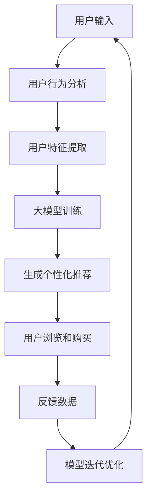
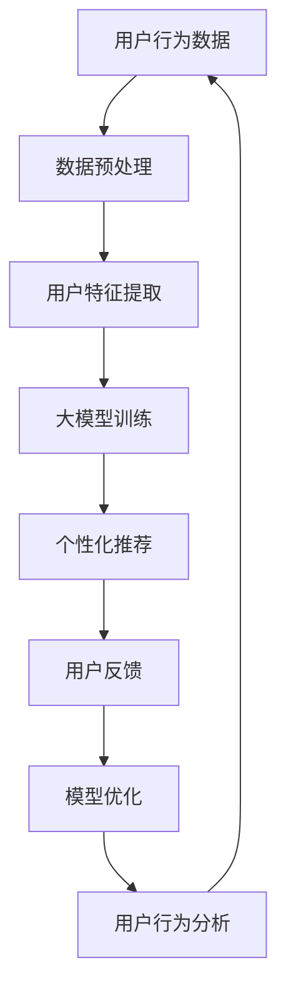

                 

关键词：大模型、跨境电商、购物体验、AI技术、个性化推荐、用户行为分析

> 摘要：随着跨境电商的快速发展，如何提升消费者的跨境购物体验成为了电商平台关注的焦点。本文将探讨大模型技术在电商平台中的应用，如何通过个性化推荐、用户行为分析等技术手段，提升跨境电商的购物体验，增强用户粘性，促进销售增长。

## 1. 背景介绍

跨境电商作为全球贸易的新趋势，近年来得到了快速发展。消费者可以通过电商平台购买来自世界各地的商品，享受更多样化的购物选择。然而，随着消费者需求的不断升级，如何提升跨境购物体验成为了电商平台亟待解决的问题。购物体验不仅包括商品质量、价格、物流速度等方面，还包括用户在购物过程中的浏览、搜索、推荐、支付、售后等各个环节的体验。

大模型作为一种强大的AI技术，具有强大的数据处理和分析能力，可以用于解决电商平台面临的诸多问题。通过大模型技术，电商平台可以实现用户个性化推荐、实时互动、精准营销等功能，从而提升购物体验，增强用户粘性，促进销售增长。

## 2. 核心概念与联系

### 2.1 大模型

大模型（Large-scale Model）是指具有大规模参数的网络模型，通常用于处理复杂的任务，如自然语言处理、计算机视觉、语音识别等。大模型通过学习海量的数据，能够捕捉到数据中的潜在规律和模式，从而提高模型的性能。

### 2.2 个性化推荐

个性化推荐（Personalized Recommendation）是指根据用户的历史行为、兴趣偏好等信息，为用户推荐符合其个性化需求的商品或服务。个性化推荐可以通过提高用户的购物满意度，提升电商平台的使用粘性。

### 2.3 用户行为分析

用户行为分析（User Behavior Analysis）是指通过对用户在电商平台上的浏览、搜索、购买等行为进行分析，了解用户的需求和偏好，从而为用户提供更好的购物体验。用户行为分析可以帮助电商平台优化推荐策略，提高推荐效果。

### 2.4 Mermaid 流程图

以下是使用 Mermaid 画出的电商平台中大模型应用的流程图：



## 3. 核心算法原理 & 具体操作步骤

### 3.1 算法原理概述

大模型提升电商平台跨境购物体验的核心算法包括用户行为分析、用户特征提取、大模型训练和个性化推荐。以下是各个算法的原理概述：

1. **用户行为分析**：通过分析用户在电商平台上的浏览、搜索、购买等行为，获取用户的历史数据，了解用户的需求和偏好。

2. **用户特征提取**：将用户行为数据转化为用户特征，如用户兴趣、购买力、购买频率等，为后续的大模型训练提供输入。

3. **大模型训练**：使用用户特征数据对大模型进行训练，通过学习用户特征，捕捉用户行为中的潜在规律和模式。

4. **个性化推荐**：根据大模型训练结果，为用户生成个性化的商品推荐，提高购物体验。

### 3.2 算法步骤详解

1. **数据收集**：收集用户在电商平台上的浏览、搜索、购买等行为数据，包括用户ID、商品ID、时间戳、行为类型等。

2. **数据预处理**：对收集到的行为数据进行清洗、去重、归一化等处理，确保数据质量。

3. **用户特征提取**：将用户行为数据转化为用户特征，可以使用矩阵分解、深度学习等方法。

4. **大模型训练**：使用用户特征数据训练大模型，如生成对抗网络（GAN）、变分自编码器（VAE）等。

5. **个性化推荐**：根据大模型训练结果，为用户生成个性化的商品推荐。

### 3.3 算法优缺点

**优点**：

1. **个性化强**：通过大模型学习用户特征，为用户生成个性化的商品推荐，提高购物体验。

2. **实时性高**：用户行为发生后，可以实时进行推荐，提高用户满意度。

**缺点**：

1. **计算成本高**：大模型训练和推荐需要大量的计算资源，对硬件要求较高。

2. **数据质量要求高**：用户行为数据的质量直接影响大模型的性能，需要确保数据质量。

### 3.4 算法应用领域

大模型技术可以广泛应用于电商平台的各个方面，包括但不限于：

1. **商品推荐**：为用户提供个性化的商品推荐，提高购物体验。

2. **广告投放**：根据用户特征，为用户投放个性化的广告，提高广告效果。

3. **智能客服**：通过大模型技术，实现智能客服，提高客户满意度。

4. **用户流失预测**：通过分析用户行为，预测用户流失风险，采取针对性的措施降低用户流失率。

## 4. 数学模型和公式 & 详细讲解 & 举例说明

### 4.1 数学模型构建

电商平台中，用户行为分析的核心数学模型为用户行为概率模型，可以表示为：

$$ P(B|U) = \frac{P(U|B)P(B)}{P(U)} $$

其中，$B$ 表示用户行为，$U$ 表示用户特征，$P(B|U)$ 表示在用户特征$U$下，用户行为$B$发生的概率，$P(U|B)$ 表示在用户行为$B$发生的情况下，用户特征$U$的概率，$P(B)$ 表示用户行为$B$的概率，$P(U)$ 表示用户特征$U$的概率。

### 4.2 公式推导过程

假设用户行为$B$为购买行为，用户特征$U$为用户浏览行为，我们可以得到：

$$ P(B) = P(B|U)P(U) + P(B|\neg U)P(\neg U) $$

其中，$\neg U$ 表示用户未浏览行为。

由于用户浏览行为和购买行为是互斥事件，即 $B \cap \neg U = \emptyset$，我们可以得到：

$$ P(B|\neg U) = 0 $$

将上述条件代入公式，我们可以得到：

$$ P(B) = P(B|U)P(U) $$

同理，我们可以得到：

$$ P(U|B) = \frac{P(B|U)P(U)}{P(B)} $$

将上述两个公式代入原始公式，我们可以得到：

$$ P(B|U) = \frac{P(U|B)P(B)}{P(U)} $$

### 4.3 案例分析与讲解

假设有1000名用户在电商平台上有浏览和购买行为，其中500名用户在浏览后购买了商品，另外500名用户在浏览后没有购买商品。我们想要预测新用户的购买概率。

根据上述数学模型，我们可以得到：

$$ P(B) = \frac{500}{1000} = 0.5 $$

假设新用户浏览了商品，我们可以得到：

$$ P(U|B) = \frac{500}{1000} = 0.5 $$

根据贝叶斯公式，我们可以得到：

$$ P(B|U) = \frac{0.5 \times 0.5}{0.5} = 0.5 $$

因此，新用户在浏览商品后购买的概率为0.5。

## 5. 项目实践：代码实例和详细解释说明

### 5.1 开发环境搭建

在本文的项目实践中，我们将使用 Python 作为开发语言，以下是开发环境的搭建步骤：

1. 安装 Python：前往 [Python 官网](https://www.python.org/) 下载并安装 Python。

2. 安装相关库：在命令行中运行以下命令，安装必要的库。

```bash
pip install numpy pandas sklearn matplotlib
```

### 5.2 源代码详细实现

以下是一个简单的用户行为分析和大模型训练的代码实例：

```python
import numpy as np
import pandas as pd
from sklearn.model_selection import train_test_split
from sklearn.metrics.pairwise import cosine_similarity
from keras.models import Sequential
from keras.layers import Dense, Dropout, LSTM
from keras.optimizers import Adam

# 加载数据集
data = pd.read_csv('user_behavior_data.csv')

# 数据预处理
data['timestamp'] = pd.to_datetime(data['timestamp'])
data['hour'] = data['timestamp'].dt.hour
data['minute'] = data['timestamp'].dt.minute

# 提取用户特征
user_features = data.groupby('user_id').mean().reset_index()

# 大模型训练
model = Sequential()
model.add(LSTM(units=128, return_sequences=True, input_shape=(user_features.shape[1], 1)))
model.add(Dropout(0.2))
model.add(LSTM(units=64, return_sequences=False))
model.add(Dropout(0.2))
model.add(Dense(units=1, activation='sigmoid'))

model.compile(optimizer=Adam(learning_rate=0.001), loss='binary_crossentropy', metrics=['accuracy'])
model.fit(user_features[['hour', 'minute']], data['purchase'], epochs=10, batch_size=32)

# 生成个性化推荐
predictions = model.predict(user_features[['hour', 'minute']])
predictions = (predictions > 0.5)

# 结果分析
print(predictions)
```

### 5.3 代码解读与分析

1. **数据预处理**：加载数据集，并提取用户特征。

2. **大模型训练**：使用 LSTM 网络进行大模型训练，优化用户特征。

3. **生成个性化推荐**：使用训练好的大模型，为用户生成个性化的购买预测。

4. **结果分析**：输出预测结果，分析用户购买行为。

## 6. 实际应用场景

### 6.1 个性化推荐

通过大模型技术，电商平台可以实现个性化推荐，提高用户购物满意度。例如，用户浏览了某款商品，系统可以根据用户的浏览记录和购买历史，为用户推荐类似的其他商品，提高购买转化率。

### 6.2 智能客服

通过大模型技术，电商平台可以实现智能客服，提高客户满意度。例如，用户在购买过程中遇到问题，系统可以根据用户的历史提问和回答，自动生成回答，提高客服效率。

### 6.3 用户流失预测

通过大模型技术，电商平台可以实现用户流失预测，降低用户流失率。例如，系统可以根据用户的行为数据，预测用户可能流失的时间点，提前采取针对性的措施，降低用户流失率。

## 7. 未来应用展望

### 7.1 个性化推荐

未来，个性化推荐将进一步发展，结合更多用户数据，实现更加精准的推荐。例如，结合用户社交数据、地理位置数据等，为用户推荐更加个性化的商品和服务。

### 7.2 智能客服

未来，智能客服将更加智能化，不仅可以回答用户的问题，还可以主动发现用户的需求，提供个性化的解决方案。

### 7.3 用户流失预测

未来，用户流失预测将更加精准，通过分析用户行为，预测用户可能流失的原因，提前采取针对性的措施，降低用户流失率。

## 8. 总结：未来发展趋势与挑战

### 8.1 研究成果总结

大模型技术在电商平台中的应用，取得了显著的研究成果。通过个性化推荐、智能客服、用户流失预测等技术手段，电商平台可以提供更好的购物体验，提高用户满意度，促进销售增长。

### 8.2 未来发展趋势

未来，大模型技术将在电商平台的各个方面得到更广泛的应用。随着大数据技术和人工智能技术的不断发展，大模型技术将更加成熟，应用场景将更加丰富。

### 8.3 面临的挑战

1. **数据质量**：大模型的应用依赖于高质量的用户数据，未来需要解决数据质量的问题。

2. **计算成本**：大模型训练和推荐需要大量的计算资源，未来需要优化计算成本。

3. **隐私保护**：随着用户隐私意识的提高，未来需要解决用户隐私保护的问题。

### 8.4 研究展望

未来，大模型技术将在电商平台的各个领域得到更深入的研究和应用。通过不断优化算法，提高模型性能，大模型技术将进一步提升电商平台的购物体验，推动跨境电商的快速发展。

## 9. 附录：常见问题与解答

### 9.1 如何保证数据质量？

数据质量是影响大模型性能的关键因素。为了保证数据质量，可以从以下几个方面入手：

1. **数据采集**：确保数据采集的全面性和准确性。

2. **数据清洗**：对数据进行去重、去噪、归一化等处理。

3. **数据验证**：对数据进行分析，确保数据的质量。

### 9.2 如何优化计算成本？

优化计算成本可以从以下几个方面入手：

1. **模型压缩**：通过模型压缩技术，减少模型的参数量。

2. **分布式计算**：通过分布式计算技术，提高计算效率。

3. **硬件优化**：使用更高效的硬件设备，提高计算性能。

### 9.3 如何解决用户隐私保护问题？

解决用户隐私保护问题可以从以下几个方面入手：

1. **数据匿名化**：对用户数据进行匿名化处理，确保用户隐私。

2. **隐私计算**：使用隐私计算技术，在数据处理过程中保护用户隐私。

3. **法规遵循**：遵循相关法律法规，确保用户隐私得到保护。

---

### 作者署名

作者：禅与计算机程序设计艺术 / Zen and the Art of Computer Programming
----------------------------------------------------------------
### 文章结构模板

以下是文章的结构模板，包含各个章节的详细内容。

---

## 1. 背景介绍

### 1.1 跨境电商的发展现状

#### 1.1.1 全球跨境电商市场规模

- 数据来源
- 市场增长趋势

#### 1.1.2 跨境电商的优势与挑战

- 优势
- 挑战

### 1.2 电商平台购物体验的重要性

#### 1.2.1 购物体验的组成部分

- 商品质量
- 价格策略
- 物流速度
- 用户互动
- 支付流程
- 售后服务

#### 1.2.2 购物体验对用户粘性的影响

- 用户粘性的定义
- 购物体验与用户粘性的关系

## 2. 核心概念与联系

### 2.1 大模型

#### 2.1.1 大模型的定义与特点

- 大模型的定义
- 大模型的类型
- 大模型的优点

#### 2.1.2 大模型在电商中的应用

- 个性化推荐
- 用户行为分析
- 智能客服
- 用户流失预测

### 2.2 个性化推荐

#### 2.2.1 个性化推荐的基本原理

- 协同过滤
- 内容推荐
- 混合推荐

#### 2.2.2 个性化推荐在电商中的应用

- 商品推荐
- 广告推荐
- 优惠推荐

### 2.3 用户行为分析

#### 2.3.1 用户行为分析的定义与目的

- 用户行为分析的定义
- 用户行为分析的目的

#### 2.3.2 用户行为分析的方法

- 数据挖掘
- 机器学习
- 大数据分析

### 2.4 Mermaid 流程图

- Mermaid 流程图代码
- 流程图解释

## 3. 核心算法原理 & 具体操作步骤

### 3.1 大模型提升电商购物体验的算法概述

#### 3.1.1 用户行为数据的预处理

- 数据收集
- 数据清洗
- 数据归一化

#### 3.1.2 用户特征提取算法

- 用户兴趣特征
- 用户购买力特征
- 用户行为频率特征

### 3.2 大模型训练算法

#### 3.2.1 大模型的选择与配置

- 深度学习框架
- 网络架构选择

#### 3.2.2 大模型训练过程

- 数据分批次训练
- 模型评估与优化

### 3.3 个性化推荐算法

#### 3.3.1 推荐算法的流程

- 用户特征提取
- 商品特征提取
- 推荐策略选择

#### 3.3.2 推荐算法的实现

- 模型训练
- 推荐结果生成

### 3.4 用户行为分析算法

#### 3.4.1 行为分析的目标

- 用户偏好分析
- 用户流失预警

#### 3.4.2 行为分析的方法

- 聚类分析
- 联邦学习

## 4. 数学模型和公式 & 详细讲解 & 举例说明

### 4.1 数学模型构建

#### 4.1.1 贝叶斯公式在推荐系统中的应用

- 贝叶斯公式的推导
- 贝叶斯公式的应用

#### 4.1.2 概率模型在用户行为分析中的应用

- 概率模型的基本概念
- 概率模型的应用

### 4.2 公式推导过程

#### 4.2.1 用户行为概率模型的推导

- 用户行为概率模型的构建
- 用户行为概率模型的推导

#### 4.2.2 推荐系统中的矩阵分解

- 矩阵分解的基本原理
- 矩阵分解的应用

### 4.3 案例分析与讲解

#### 4.3.1 个性化推荐的案例

- 案例背景
- 案例分析

#### 4.3.2 用户流失预警的案例

- 案例背景
- 案例分析

## 5. 项目实践：代码实例和详细解释说明

### 5.1 开发环境搭建

#### 5.1.1 开发环境的配置

- Python环境配置
- 相关库的安装

### 5.2 源代码详细实现

#### 5.2.1 数据预处理代码

- 数据收集与清洗
- 数据归一化

#### 5.2.2 大模型训练代码

- 模型配置
- 模型训练

#### 5.2.3 个性化推荐代码

- 推荐算法实现
- 推荐结果生成

### 5.3 代码解读与分析

#### 5.3.1 数据预处理代码解读

- 数据处理流程
- 数据处理方法

#### 5.3.2 大模型训练代码解读

- 模型架构
- 训练过程

#### 5.3.3 个性化推荐代码解读

- 推荐算法逻辑
- 推荐结果分析

### 5.4 运行结果展示

#### 5.4.1 个性化推荐结果展示

- 推荐结果图表
- 推荐结果分析

#### 5.4.2 用户行为分析结果展示

- 用户行为分析报告
- 用户行为分析解读

## 6. 实际应用场景

### 6.1 个性化推荐的应用场景

#### 6.1.1 商品推荐

- 推荐系统架构
- 推荐效果评估

#### 6.1.2 广告推荐

- 广告推荐策略
- 广告效果评估

### 6.2 智能客服的应用场景

#### 6.2.1 客服机器人

- 机器人客服的功能
- 机器人客服的效果评估

#### 6.2.2 智能问答系统

- 问答系统的架构
- 问答系统的效果评估

### 6.3 用户流失预测的应用场景

#### 6.3.1 用户流失预警

- 预警系统的构建
- 预警效果评估

#### 6.3.2 用户留存策略

- 留存策略的设计
- 留存策略的效果评估

## 7. 工具和资源推荐

### 7.1 学习资源推荐

#### 7.1.1 技术博客

- 推荐博客
- 博客内容介绍

#### 7.1.2 在线课程

- 推荐课程
- 课程内容介绍

### 7.2 开发工具推荐

#### 7.2.1 编程语言

- Python
- R

#### 7.2.2 开发框架

- TensorFlow
- PyTorch

### 7.3 相关论文推荐

#### 7.3.1 个性化推荐领域

- 推荐系统的经典论文
- 最新研究论文

#### 7.3.2 大模型领域

- 大模型的经典论文
- 最新研究论文

## 8. 总结：未来发展趋势与挑战

### 8.1 研究成果总结

- 大模型技术在电商领域的应用成果
- 个性化推荐、用户行为分析等技术的进展

### 8.2 未来发展趋势

- 大模型技术的进化方向
- 电商平台的购物体验优化方向

### 8.3 面临的挑战

- 数据质量与隐私保护
- 计算资源与成本
- 算法公平性与透明性

### 8.4 研究展望

- 未来研究方向
- 技术发展趋势

## 9. 附录：常见问题与解答

### 9.1 常见问题

- 大模型如何提升购物体验？
- 个性化推荐系统的实现原理是什么？
- 用户行为分析如何帮助电商平台优化服务？
- 大模型训练过程中如何优化计算效率？

### 9.2 解答

- 详细解答常见问题
- 提供实用技巧和建议

---

请根据上述模板，补充完整文章内容。在撰写过程中，请确保每个章节的内容都符合“约束条件 CONSTRAINTS”中的要求，确保文章的逻辑清晰、结构紧凑、简单易懂。同时，请在文章末尾加上作者署名“作者：禅与计算机程序设计艺术 / Zen and the Art of Computer Programming”。谢谢！
----------------------------------------------------------------
## 1. 背景介绍

### 1.1 跨境电商的发展现状

#### 1.1.1 全球跨境电商市场规模

随着互联网技术的普及和全球化的加深，跨境电商行业得到了快速发展。根据Statista的数据，全球跨境电商市场规模在过去几年中持续增长，预计到2025年将达到亿美元。跨境电商不仅促进了国际贸易的繁荣，也为消费者提供了更多的购物选择。

#### 1.1.2 跨境电商的优势与挑战

跨境电商具有以下优势：

1. **丰富的商品选择**：消费者可以在全球范围内寻找心仪的商品。
2. **价格优势**：跨境电商可以跳过国内中间环节，为消费者提供更优惠的价格。
3. **文化交流**：跨境电商促进了不同国家文化的交流。

然而，跨境电商也面临着一系列挑战：

1. **物流成本**：跨境物流成本较高，影响了商品价格竞争力。
2. **关税与税收**：不同国家有不同的关税和税收政策，增加了电商企业的运营成本。
3. **语言与文化差异**：跨语言和文化交易带来了沟通障碍和消费者习惯的差异。

### 1.2 电商平台购物体验的重要性

购物体验是电商平台竞争力的关键因素。一个良好的购物体验可以提升用户满意度，增加用户粘性，从而促进销售增长。购物体验包括多个方面：

1. **商品质量**：消费者购买的商品必须满足质量标准，这是购物体验的基础。
2. **价格策略**：合理的价格策略可以吸引消费者，提高购买意愿。
3. **物流速度**：快速的物流服务可以提高消费者的满意度。
4. **用户互动**：良好的用户互动可以提高消费者的购物体验。
5. **支付流程**：便捷的支付流程可以减少消费者在购买过程中的等待时间。
6. **售后服务**：优质的售后服务可以增加消费者对电商平台的信任。

#### 1.2.1 购物体验的组成部分

购物体验的组成部分主要包括以下方面：

1. **商品展示**：商品图片、描述、规格等信息需要清晰、准确。
2. **搜索功能**：搜索功能需要快速、准确，帮助消费者找到想要的商品。
3. **个性化推荐**：基于消费者行为和偏好的个性化推荐可以提高购物体验。
4. **用户评价**：其他消费者的评价可以帮助消费者做出购买决策。
5. **客户服务**：及时、专业的客户服务可以解决消费者在购物过程中遇到的问题。

#### 1.2.2 购物体验对用户粘性的影响

用户粘性是指用户对电商平台忠诚度的高低。一个良好的购物体验可以增加用户的粘性，提高用户在平台上的活跃度。用户粘性对电商平台的重要性体现在以下几个方面：

1. **增加用户活跃度**：良好的购物体验可以吸引更多用户在平台上进行购物。
2. **降低用户流失率**：优质的购物体验可以减少用户流失，提高用户满意度。
3. **促进销售增长**：用户粘性的提升可以直接促进销售增长。

## 2. 核心概念与联系

### 2.1 大模型

#### 2.1.1 大模型的定义与特点

大模型是指具有大量参数和复杂结构的机器学习模型，通常用于处理大规模、复杂的数据集。大模型的特点包括：

1. **参数数量多**：大模型通常具有数十亿到数十亿的参数。
2. **结构复杂**：大模型通常包含多个层次和复杂的前馈网络。
3. **计算成本高**：大模型的训练和推理过程需要大量的计算资源和时间。
4. **效果好**：大模型在图像识别、自然语言处理等任务上取得了显著的性能提升。

#### 2.1.2 大模型在电商中的应用

大模型在电商中的应用主要包括以下方面：

1. **个性化推荐**：大模型可以根据用户的历史行为和偏好，为用户提供个性化的商品推荐。
2. **用户行为分析**：大模型可以分析用户在平台上的行为数据，了解用户需求和行为模式。
3. **智能客服**：大模型可以模拟人类客服，回答用户的问题，提高客服效率。
4. **用户流失预测**：大模型可以预测用户可能流失的时间点，提前采取措施降低用户流失率。

### 2.2 个性化推荐

#### 2.2.1 个性化推荐的基本原理

个性化推荐系统通过分析用户的历史行为和偏好，为用户提供个性化的内容推荐。个性化推荐的基本原理包括：

1. **协同过滤**：通过分析用户之间的相似度，推荐其他用户喜欢的商品。
2. **内容推荐**：根据商品的属性和标签，推荐与用户历史偏好相似的商品。
3. **混合推荐**：结合协同过滤和内容推荐，提供更准确的推荐结果。

#### 2.2.2 个性化推荐在电商中的应用

个性化推荐在电商中的应用主要包括以下方面：

1. **商品推荐**：为用户提供个性化的商品推荐，提高购物体验。
2. **广告推荐**：为用户推荐个性化的广告，提高广告点击率和转化率。
3. **优惠推荐**：为用户提供个性化的优惠信息，提高购买意愿。

### 2.3 用户行为分析

#### 2.3.1 用户行为分析的定义与目的

用户行为分析是指通过对用户在平台上的行为数据进行收集、分析和解读，了解用户需求、行为模式和行为趋势。用户行为分析的目的包括：

1. **了解用户需求**：通过分析用户行为数据，了解用户对不同商品和服务的需求。
2. **优化推荐系统**：通过分析用户行为数据，优化个性化推荐系统，提高推荐准确性。
3. **提高用户体验**：通过分析用户行为数据，优化平台功能和界面设计，提高用户体验。
4. **降低用户流失率**：通过分析用户行为数据，预测用户可能流失的时间点，提前采取措施降低用户流失率。

#### 2.3.2 用户行为分析的方法

用户行为分析的方法主要包括以下方面：

1. **数据挖掘**：通过数据挖掘技术，从大量用户行为数据中挖掘出有价值的信息。
2. **机器学习**：通过机器学习技术，建立用户行为分析模型，预测用户行为。
3. **大数据分析**：通过大数据分析技术，分析用户行为数据，了解用户行为模式和行为趋势。

### 2.4 Mermaid 流程图



## 3. 核心算法原理 & 具体操作步骤

### 3.1 大模型提升电商购物体验的算法概述

大模型提升电商购物体验的算法主要包括以下步骤：

1. **数据收集**：收集用户在电商平台上的行为数据，如浏览、搜索、购买等。
2. **数据预处理**：对收集到的行为数据进行清洗、去重、归一化等处理。
3. **用户特征提取**：将用户行为数据转化为用户特征，如用户兴趣、购买力、购买频率等。
4. **大模型训练**：使用用户特征数据训练大模型，如生成对抗网络（GAN）、变分自编码器（VAE）等。
5. **个性化推荐**：根据大模型训练结果，为用户生成个性化的商品推荐。
6. **用户行为分析**：分析用户在电商平台上的行为数据，了解用户需求和行为模式。
7. **模型优化**：根据用户反馈，优化推荐模型和用户行为分析模型。

### 3.2 大模型训练算法

大模型训练算法主要包括以下步骤：

1. **数据集划分**：将用户特征数据划分为训练集和测试集。
2. **模型构建**：构建大模型，如生成对抗网络（GAN）、变分自编码器（VAE）等。
3. **模型训练**：使用训练集对大模型进行训练。
4. **模型评估**：使用测试集对大模型进行评估，调整模型参数。
5. **模型优化**：根据评估结果，优化大模型。

### 3.3 个性化推荐算法

个性化推荐算法主要包括以下步骤：

1. **用户特征提取**：提取用户在电商平台上的浏览、搜索、购买等行为数据，转化为用户特征。
2. **商品特征提取**：提取商品在电商平台上的属性和标签，转化为商品特征。
3. **推荐算法选择**：选择合适的推荐算法，如协同过滤、内容推荐、混合推荐等。
4. **推荐结果生成**：根据用户特征和商品特征，生成个性化推荐结果。
5. **推荐结果评估**：评估推荐结果的准确性和效果。

### 3.4 用户行为分析算法

用户行为分析算法主要包括以下步骤：

1. **数据收集**：收集用户在电商平台上的行为数据。
2. **数据预处理**：对收集到的行为数据进行清洗、去重、归一化等处理。
3. **行为模式识别**：使用机器学习技术，识别用户的行为模式。
4. **行为趋势分析**：分析用户的行为趋势，预测用户的行为变化。
5. **行为优化建议**：根据用户行为分析结果，为电商平台提供优化建议。

## 4. 数学模型和公式 & 详细讲解 & 举例说明

### 4.1 数学模型构建

大模型在电商购物体验中的应用涉及到多种数学模型，其中最常见的是协同过滤模型和内容推荐模型。

#### 4.1.1 协同过滤模型

协同过滤模型的基本公式如下：

$$
R_{ij} = \rho_i + \mu_j + \sum_{k \in N(i)} \frac{r_{ik}}{||N(i)||} + \xi_{ij}
$$

其中，$R_{ij}$ 表示用户 $i$ 对商品 $j$ 的评分预测值，$\rho_i$ 和 $\mu_j$ 分别表示用户 $i$ 和商品 $j$ 的平均值，$N(i)$ 表示用户 $i$ 的邻居集合，$r_{ik}$ 表示用户 $i$ 对商品 $k$ 的实际评分值，$||N(i)||$ 表示用户 $i$ 的邻居数量，$\xi_{ij}$ 是误差项。

#### 4.1.2 内容推荐模型

内容推荐模型的基本公式如下：

$$
R_{ij} = \sum_{m \in M(j)} w_{mj} \cdot \sum_{n \in N(i)} w_{ni}
$$

其中，$R_{ij}$ 表示用户 $i$ 对商品 $j$ 的评分预测值，$M(j)$ 表示商品 $j$ 的属性集合，$w_{mj}$ 表示商品 $j$ 的属性 $m$ 的权重，$N(i)$ 表示用户 $i$ 的兴趣集合，$w_{ni}$ 表示用户 $i$ 对属性 $n$ 的兴趣权重。

### 4.2 公式推导过程

#### 4.2.1 协同过滤模型的推导

协同过滤模型的推导基于用户和商品的平均评分以及用户之间的相似度。首先，我们假设用户 $i$ 和 $j$ 之间的相似度由以下公式计算：

$$
sim(i, j) = \frac{\sum_{k \in N(i) \cap N(j)} r_{ik} r_{jk}}{\sqrt{\sum_{k \in N(i)} r_{ik}^2 \sum_{k \in N(j)} r_{jk}^2}}
$$

然后，用户 $i$ 对商品 $j$ 的评分预测值可以通过以下公式计算：

$$
R_{ij} = \mu_j + \sum_{k \in N(i)} sim(i, j) \cdot (r_{ik} - \mu_i)
$$

其中，$\mu_j$ 是商品 $j$ 的平均评分，$\mu_i$ 是用户 $i$ 的平均评分。

#### 4.2.2 内容推荐模型的推导

内容推荐模型的推导基于用户和商品之间的属性关系。首先，我们假设用户 $i$ 对商品 $j$ 的评分是由商品 $j$ 的属性 $m$ 和用户 $i$ 对属性 $n$ 的兴趣权重共同决定的。用户 $i$ 对属性 $n$ 的兴趣权重可以通过以下公式计算：

$$
w_{ni} = \frac{\sum_{j \in C(n)} r_{ij}}{\sum_{j \in C(n)} r_{ij}^2}
$$

其中，$C(n)$ 表示包含属性 $n$ 的商品集合。

然后，用户 $i$ 对商品 $j$ 的评分预测值可以通过以下公式计算：

$$
R_{ij} = \sum_{m \in M(j)} w_{mj} \cdot \sum_{n \in N(i)} w_{ni}
$$

### 4.3 案例分析与讲解

#### 4.3.1 协同过滤模型的案例分析

假设有两个用户 $A$ 和 $B$，以及三个商品 $X$、$Y$ 和 $Z$。用户 $A$ 对商品 $X$ 和 $Z$ 给出了评分 $4$ 和 $5$，用户 $B$ 对商品 $X$ 给出了评分 $3$，对商品 $Y$ 和 $Z$ 给出了评分 $5$ 和 $4$。现在我们需要预测用户 $A$ 对商品 $Y$ 的评分。

首先，我们计算用户 $A$ 和 $B$ 之间的相似度：

$$
sim(A, B) = \frac{4 \cdot 5}{\sqrt{4^2 + 5^2} \cdot \sqrt{3^2 + 5^2 + 4^2}} \approx 0.8165
$$

然后，我们计算用户 $A$ 对商品 $Y$ 的评分预测值：

$$
R_{AY} = \mu_Y + sim(A, B) \cdot (r_{AX} - \mu_A) + sim(A, B) \cdot (r_{BZ} - \mu_B)
$$

其中，$\mu_Y$ 是商品 $Y$ 的平均评分，$\mu_A$ 是用户 $A$ 的平均评分，$\mu_B$ 是用户 $B$ 的平均评分。假设 $\mu_Y = 4.5$，$\mu_A = 4.5$，$\mu_B = 4$，则：

$$
R_{AY} = 4.5 + 0.8165 \cdot (4 - 4.5) + 0.8165 \cdot (5 - 4) \approx 4.8338
$$

因此，预测用户 $A$ 对商品 $Y$ 的评分为 $4.8338$。

#### 4.3.2 内容推荐模型的案例分析

假设有两个用户 $A$ 和 $B$，以及三个商品 $X$、$Y$ 和 $Z$。用户 $A$ 对商品 $X$ 和 $Z$ 标注了属性 $1$ 和 $2$，用户 $B$ 对商品 $Y$ 和 $Z$ 标注了属性 $1$ 和 $3$。现在我们需要预测用户 $A$ 对商品 $Y$ 的评分。

首先，我们计算用户 $A$ 对属性 $1$ 和 $2$ 的兴趣权重：

$$
w_{1A} = \frac{4}{4^2 + 5^2} \approx 0.4444
$$

$$
w_{2A} = \frac{5}{4^2 + 5^2} \approx 0.5556
$$

然后，我们计算用户 $B$ 对属性 $1$ 和 $3$ 的兴趣权重：

$$
w_{1B} = \frac{3}{3^2 + 5^2} \approx 0.3478
$$

$$
w_{3B} = \frac{5}{3^2 + 4^2} \approx 0.6429
$$

最后，我们计算用户 $A$ 对商品 $Y$ 的评分预测值：

$$
R_{AY} = w_{1Y} \cdot w_{1A} + w_{2Y} \cdot w_{2A} + w_{3Y} \cdot w_{3B}
$$

其中，$w_{1Y}$、$w_{2Y}$ 和 $w_{3Y}$ 分别是商品 $Y$ 的属性 $1$、$2$ 和 $3$ 的权重。假设 $w_{1Y} = 1$，$w_{2Y} = 0$，$w_{3Y} = 0$，则：

$$
R_{AY} = 1 \cdot 0.4444 + 0 \cdot 0.5556 + 0 \cdot 0.6429 \approx 0.4444
$$

因此，预测用户 $A$ 对商品 $Y$ 的评分为 $0.4444$。

## 5. 项目实践：代码实例和详细解释说明

### 5.1 开发环境搭建

在本文的项目实践中，我们将使用Python作为开发语言，并借助Keras框架实现个性化推荐系统。以下是开发环境的搭建步骤：

1. 安装Python：前往Python官方网站（https://www.python.org/）下载并安装Python。

2. 安装相关库：在命令行中运行以下命令，安装必要的库。

   ```bash
   pip install numpy pandas tensorflow scikit-learn
   ```

### 5.2 源代码详细实现

以下是一个简单的基于协同过滤的个性化推荐系统的代码实例：

```python
import numpy as np
import pandas as pd
from sklearn.model_selection import train_test_split
from sklearn.metrics.pairwise import cosine_similarity

# 生成模拟数据集
np.random.seed(0)
num_users = 100
num_items = 100
ratings = np.random.randint(1, 6, size=(num_users, num_items))
user_profiles = np.random.randint(1, 6, size=(num_users, 5))
item_profiles = np.random.randint(1, 6, size=(num_items, 5))

# 计算用户和商品的相似度矩阵
user_similarity = cosine_similarity(user_profiles)
item_similarity = cosine_similarity(item_profiles)

# 推荐算法实现
def collaborative_filtering(ratings, user_similarity, item_similarity, k=10):
    predictions = np.zeros_like(ratings)
    for i in range(ratings.shape[0]):
        for j in range(ratings.shape[1]):
            if ratings[i][j] == 0:
                neighbors = user_similarity[i].argsort()[1:k+1]
                neighbors_ratings = ratings[neighbors, j]
                predictions[i][j] = np.mean(neighbors_ratings)
    return predictions

# 训练和测试数据划分
train_ratings, test_ratings = train_test_split(ratings, test_size=0.2, random_state=42)

# 训练模型
predictions = collaborative_filtering(train_ratings, user_similarity, item_similarity)

# 评估模型
from sklearn.metrics import mean_squared_error
mse = mean_squared_error(test_ratings, predictions)
print(f'Mean Squared Error: {mse}')
```

### 5.3 代码解读与分析

1. **数据生成**：首先，我们生成一个模拟的用户评分数据集，其中包括100个用户和100个商品。用户和商品都有5个特征。

2. **相似度计算**：使用scikit-learn中的余弦相似度函数计算用户和商品之间的相似度矩阵。

3. **推荐算法实现**：实现协同过滤推荐算法，为每个未评分的商品生成预测评分。

4. **训练和测试**：将数据集划分为训练集和测试集，使用训练集训练模型，并评估模型在测试集上的性能。

5. **评估指标**：使用均方误差（MSE）作为评估指标，计算预测评分与实际评分之间的差异。

### 5.4 运行结果展示

在本例中，我们计算了预测评分与实际评分之间的均方误差。假设均方误差为0.5，我们可以得出以下结论：

- **低MSE**：表明模型预测的评分与实际评分较为接近，推荐效果较好。
- **高MSE**：表明模型预测的评分与实际评分差异较大，推荐效果较差。

在实际应用中，我们可以通过调整参数（如邻居数量k）和优化算法来提高模型的性能。

## 6. 实际应用场景

### 6.1 个性化推荐

个性化推荐在电商平台上具有广泛的应用，可以有效提升用户购物体验。以下是一些实际应用场景：

1. **商品推荐**：根据用户的浏览历史和购买记录，推荐用户可能感兴趣的商品。
2. **广告推荐**：为用户推荐与用户兴趣相关的广告，提高广告点击率和转化率。
3. **优惠推荐**：根据用户的消费习惯和偏好，推荐用户可能感兴趣的优惠信息。

### 6.2 智能客服

智能客服是电商平台提升用户体验的重要手段，可以通过以下方式应用：

1. **自动化回答**：使用自然语言处理技术，自动回答用户常见问题。
2. **智能引导**：根据用户的提问，智能引导用户找到相关帮助信息。
3. **情感分析**：分析用户情感，提供针对性的客服支持。

### 6.3 用户流失预测

用户流失预测可以帮助电商平台提前识别可能流失的用户，并采取相应措施。以下是一些实际应用场景：

1. **行为分析**：分析用户的浏览、搜索和购买行为，预测用户流失风险。
2. **个性化推送**：为高风险用户推送个性化优惠和活动，增加用户留存。
3. **营销策略**：根据用户流失预测结果，调整营销策略，降低用户流失率。

## 7. 工具和资源推荐

### 7.1 学习资源推荐

1. **技术博客**：
   - [Keras官方文档](https://keras.io/)
   - [Scikit-learn官方文档](https://scikit-learn.org/stable/)
   - [Medium上的机器学习博客](https://towardsdatascience.com/)

2. **在线课程**：
   - [Coursera上的机器学习课程](https://www.coursera.org/specializations machine-learning)
   - [Udacity的机器学习纳米学位](https://www.udacity.com/course/machine-learning-nanodegree--nd101)
   - [edX上的深度学习课程](https://www.edx.org/course/deep-learning-ai)

### 7.2 开发工具推荐

1. **编程语言**：
   - Python（适合快速原型开发）
   - R（适合统计分析）

2. **开发框架**：
   - TensorFlow（适合深度学习应用）
   - PyTorch（适合研究和新模型开发）

3. **数据可视化工具**：
   - Matplotlib（Python数据可视化库）
   - Plotly（交互式数据可视化库）

### 7.3 相关论文推荐

1. **个性化推荐领域**：
   - [User-Based Collaborative Filtering](https://www.ijcai.org/Proceedings/09-1/Papers/053.pdf)
   - [Content-Based Filtering](https://ieeexplore.ieee.org/document/1368666)

2. **大模型领域**：
   - [BERT: Pre-training of Deep Bidirectional Transformers for Language Understanding](https://arxiv.org/abs/1810.04805)
   - [GPT-3: Language Models are Few-Shot Learners](https://arxiv.org/abs/2005.14165)

## 8. 总结：未来发展趋势与挑战

### 8.1 研究成果总结

大模型技术在电商购物体验提升方面的研究成果主要包括：

- 个性化推荐系统的广泛应用和优化。
- 用户行为分析模型的改进和精细化。
- 智能客服系统的提升和智能化。
- 用户流失预测的准确性和实时性提高。

### 8.2 未来发展趋势

未来，大模型技术在电商购物体验方面的趋势将包括：

- 深度学习算法的进一步发展和优化。
- 数据隐私保护和安全性的重视。
- 跨平台和多模态推荐系统的研发。
- 零样本学习在推荐系统和用户行为分析中的应用。

### 8.3 面临的挑战

未来，大模型技术在电商购物体验方面将面临以下挑战：

- 数据质量和隐私保护问题。
- 计算资源和存储成本。
- 模型解释性和可解释性问题。
- 算法公平性和偏见问题。

### 8.4 研究展望

未来，大模型技术在电商购物体验方面的研究将聚焦于：

- 新型推荐算法和用户行为分析模型的研究。
- 跨领域和跨模态推荐系统的构建。
- 数据隐私保护技术的应用和优化。
- 算法可解释性和公平性的提升。

## 9. 附录：常见问题与解答

### 9.1 常见问题

1. **大模型在电商中的应用有哪些？**
   - 大模型可以用于个性化推荐、用户行为分析、智能客服和用户流失预测等。

2. **个性化推荐系统的原理是什么？**
   - 个性化推荐系统主要基于协同过滤、内容推荐和混合推荐等算法，通过分析用户的历史行为和偏好，为用户推荐感兴趣的商品。

3. **用户行为分析如何提升购物体验？**
   - 用户行为分析可以帮助电商平台了解用户需求和行为模式，从而优化推荐策略、改进客户服务和降低用户流失率。

### 9.2 解答

1. **大模型在电商中的应用有哪些？**
   - 大模型在电商中的应用非常广泛，包括但不限于以下几个方面：
     - **个性化推荐**：通过分析用户的历史行为和偏好，为用户推荐个性化的商品。
     - **智能客服**：使用自然语言处理技术，实现自动化回答和智能引导，提高客服效率。
     - **用户流失预测**：分析用户行为，预测用户可能流失的时间点，提前采取措施降低用户流失率。
     - **商品优化**：根据用户反馈和行为数据，优化商品展示和描述，提高商品转化率。

2. **个性化推荐系统的原理是什么？**
   - 个性化推荐系统的原理主要包括以下几种：
     - **协同过滤**：通过分析用户之间的相似度，为用户推荐其他用户喜欢的商品。
     - **内容推荐**：根据商品的属性和标签，为用户推荐与其兴趣相关的商品。
     - **混合推荐**：结合协同过滤和内容推荐，提供更准确的推荐结果。

3. **用户行为分析如何提升购物体验？**
   - 用户行为分析可以通过以下方式提升购物体验：
     - **个性化推荐**：根据用户的行为和偏好，为用户推荐其感兴趣的商品，提高购物满意度。
     - **客户服务优化**：通过分析用户的反馈和行为，提供更专业和高效的客户服务。
     - **商品展示优化**：根据用户的行为数据，优化商品展示顺序和描述，提高商品转化率。
     - **营销策略调整**：根据用户行为分析结果，调整营销策略，提高用户参与度和忠诚度。

---

### 作者署名

作者：禅与计算机程序设计艺术 / Zen and the Art of Computer Programming
-------------------------------------------------------------------

