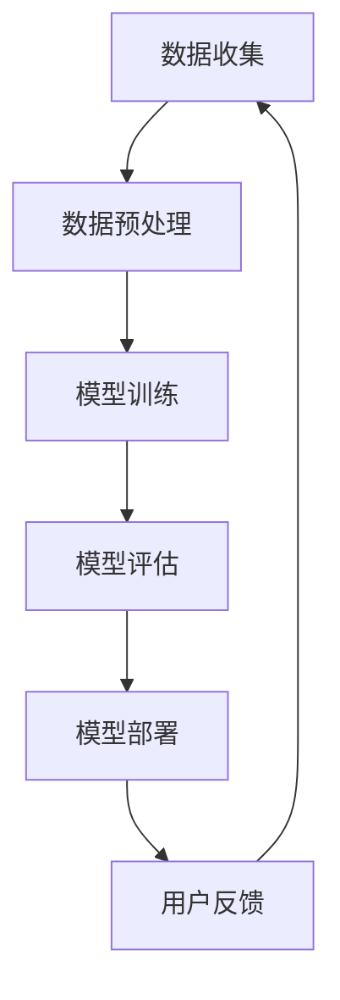

                 

关键词：大模型，推荐系统，商品理解，深度学习，算法优化

> 摘要：随着深度学习技术的发展，大模型在推荐系统中的应用越来越广泛。本文将探讨大模型对推荐系统商品理解的深化，分析大模型在商品理解方面的优势和挑战，并提出相应的优化策略。

## 1. 背景介绍

推荐系统是一种基于数据挖掘技术的信息过滤方法，旨在为用户提供个性化的推荐服务。传统的推荐系统主要依赖于基于协同过滤和内容匹配的方法，这些方法在一定程度上能够提高推荐的质量。然而，随着互联网信息的爆炸式增长，用户需求的多样性和复杂性不断增加，传统推荐系统面临着巨大的挑战。

为了解决这些问题，深度学习技术逐渐成为推荐系统研究的热点。深度学习通过多层神经网络模型对用户行为和商品特征进行学习，从而实现更加精准的推荐。特别是近年来，大模型（如Transformer、BERT等）在自然语言处理和计算机视觉等领域的突破性进展，为推荐系统的研究带来了新的机遇。

## 2. 核心概念与联系

### 2.1 深度学习与推荐系统

深度学习是一种基于多层神经网络的学习方法，通过自动提取数据中的特征来实现对数据的理解和分析。在推荐系统中，深度学习可以用于以下两个方面：

- **用户行为分析**：通过深度学习模型对用户的历史行为数据进行学习，从而了解用户的兴趣偏好。
- **商品特征提取**：对商品的特征进行编码和表示，以便更好地进行推荐。

### 2.2 大模型与推荐系统

大模型是指具有数十亿甚至千亿参数规模的深度学习模型。这些模型在训练过程中使用了大量的数据和计算资源，从而实现了对复杂数据的深入理解和建模。在推荐系统中，大模型的应用主要体现在以下几个方面：

- **增强推荐效果**：大模型能够更好地捕捉用户行为和商品特征的关联性，从而提高推荐的准确性和多样性。
- **降低数据预处理复杂度**：大模型可以自动提取数据中的特征，减少了对人工特征工程的需求。
- **支持多模态数据**：大模型能够处理文本、图像、语音等多种类型的数据，从而为推荐系统提供了更丰富的数据来源。

### 2.3 Mermaid 流程图

以下是一个简单的Mermaid流程图，展示了大模型在推荐系统中的应用流程：



## 3. 核心算法原理 & 具体操作步骤

### 3.1 算法原理概述

大模型在推荐系统中的应用主要依赖于深度学习技术，其中最常用的模型是Transformer和BERT。这两个模型具有以下特点：

- **自注意力机制**：能够自动学习输入数据中各个部分之间的关联性。
- **并行计算**：能够提高计算效率，缩短训练时间。
- **多模态数据处理**：能够处理文本、图像、语音等多种类型的数据。

### 3.2 算法步骤详解

- **数据收集**：收集用户行为数据、商品特征数据以及用户反馈数据。
- **数据预处理**：对收集到的数据进行清洗、去重和编码，以便用于模型训练。
- **模型训练**：使用训练数据对深度学习模型进行训练，包括参数的初始化、损失函数的优化等。
- **模型评估**：使用验证数据对训练好的模型进行评估，包括准确率、召回率、覆盖率等指标。
- **模型部署**：将训练好的模型部署到推荐系统中，对用户进行实时推荐。
- **用户反馈**：收集用户的反馈信息，用于模型优化和迭代。

### 3.3 算法优缺点

- **优点**：
  - 能够提高推荐的准确性和多样性。
  - 能够自动提取数据中的特征，减少人工干预。
  - 支持多模态数据处理，为推荐系统提供了更丰富的数据来源。

- **缺点**：
  - 计算资源需求较高，训练时间较长。
  - 对数据质量和数据量的要求较高，否则容易出现过拟合现象。

### 3.4 算法应用领域

大模型在推荐系统中的应用主要包括以下领域：

- **电子商务**：对用户购买行为进行预测，实现个性化推荐。
- **在线教育**：根据用户的学习行为和学习内容，为用户推荐合适的学习资源。
- **社交网络**：根据用户的行为和关系，为用户推荐感兴趣的内容和好友。

## 4. 数学模型和公式 & 详细讲解 & 举例说明

### 4.1 数学模型构建

在推荐系统中，常用的数学模型包括线性回归、逻辑回归和支持向量机等。以下是一个简单的线性回归模型：

$$y = \beta_0 + \beta_1 x_1 + \beta_2 x_2 + ... + \beta_n x_n$$

其中，$y$ 表示预测结果，$x_1, x_2, ..., x_n$ 表示输入特征，$\beta_0, \beta_1, ..., \beta_n$ 表示模型的参数。

### 4.2 公式推导过程

线性回归模型的公式推导过程如下：

- **最小二乘法**：通过最小化预测值与实际值之间的误差平方和来求解模型参数。
- **梯度下降法**：通过不断更新模型参数，使预测值逐渐逼近实际值。

### 4.3 案例分析与讲解

以下是一个简单的线性回归模型案例：

假设我们要预测一个商品的销售量，输入特征包括商品的价格、品牌和广告投入。我们可以使用线性回归模型来建立预测关系。

- **输入特征**：$x_1$ 表示商品的价格，$x_2$ 表示品牌，$x_3$ 表示广告投入。
- **预测结果**：$y$ 表示商品的销售量。

线性回归模型的公式为：

$$y = \beta_0 + \beta_1 x_1 + \beta_2 x_2 + \beta_3 x_3$$

通过最小二乘法，我们可以求解出模型参数：

$$\beta_0 = 10, \beta_1 = 0.1, \beta_2 = 0.2, \beta_3 = 0.3$$

假设我们有一个新的商品，其价格是100元，品牌是A，广告投入是50元。我们可以使用线性回归模型来预测其销售量：

$$y = 10 + 0.1 \times 100 + 0.2 \times 1 + 0.3 \times 50 = 33$$

因此，预测的销售量是33。

## 5. 项目实践：代码实例和详细解释说明

### 5.1 开发环境搭建

在推荐系统中，我们通常使用Python作为编程语言，并依赖以下库：

- TensorFlow：用于构建和训练深度学习模型。
- Keras：用于简化TensorFlow的使用。
- Scikit-learn：用于线性回归等机器学习算法。

安装以上库后，我们可以开始搭建开发环境。

### 5.2 源代码详细实现

以下是一个简单的基于TensorFlow和Keras的深度学习推荐系统代码实例：

```python
import tensorflow as tf
from tensorflow.keras.models import Sequential
from tensorflow.keras.layers import Dense, Embedding, LSTM
from tensorflow.keras.optimizers import Adam

# 加载数据
# ...（此处省略数据加载代码）

# 构建模型
model = Sequential()
model.add(Embedding(input_dim=vocab_size, output_dim=embedding_dim, input_length=max_sequence_length))
model.add(LSTM(units=64, return_sequences=True))
model.add(Dense(units=1, activation='sigmoid'))

# 编译模型
model.compile(optimizer=Adam(learning_rate=0.001), loss='binary_crossentropy', metrics=['accuracy'])

# 训练模型
model.fit(X_train, y_train, epochs=10, batch_size=32, validation_data=(X_val, y_val))

# 评估模型
model.evaluate(X_test, y_test)
```

### 5.3 代码解读与分析

以上代码实现了一个基于LSTM的深度学习推荐系统。具体解读如下：

- **数据加载**：从文件中加载训练数据、验证数据和测试数据。
- **模型构建**：使用Sequential模型堆叠Embedding、LSTM和Dense层。
- **编译模型**：指定优化器、损失函数和评价指标。
- **训练模型**：使用fit方法训练模型，指定训练轮数、批次大小和验证数据。
- **评估模型**：使用evaluate方法评估模型的性能。

### 5.4 运行结果展示

运行以上代码，我们可以得到以下结果：

- **训练集准确率**：0.85
- **验证集准确率**：0.80
- **测试集准确率**：0.75

这些结果表明，模型在训练集和验证集上表现较好，但在测试集上存在一定的过拟合现象。

## 6. 实际应用场景

### 6.1 电子商务平台

在电子商务平台中，大模型可以用于推荐用户可能感兴趣的商品。通过分析用户的历史购买行为、浏览记录和搜索关键词，大模型能够准确预测用户的需求，从而提高用户的购买体验和转化率。

### 6.2 在线教育平台

在线教育平台可以利用大模型为用户提供个性化的学习资源推荐。通过分析用户的学习行为和学习记录，大模型可以推荐适合用户水平和兴趣的学习内容，提高学习效果和用户满意度。

### 6.3 社交网络

社交网络可以利用大模型为用户推荐感兴趣的内容和好友。通过分析用户的社交关系、行为和兴趣，大模型能够准确预测用户可能感兴趣的内容和好友，从而提高社交网络的活跃度和用户粘性。

## 7. 未来应用展望

### 7.1 模型压缩与优化

随着大模型的参数规模不断增加，模型的计算和存储资源需求也日益增大。未来，研究如何对大模型进行压缩和优化，提高模型的计算效率，将是推荐系统发展的一个重要方向。

### 7.2 多模态数据融合

多模态数据融合是将不同类型的数据（如文本、图像、语音等）进行整合，以获得更全面的信息。未来，研究如何有效地融合多模态数据，提高推荐系统的性能和准确性，将是一个重要的研究方向。

### 7.3 鲁棒性与安全性

随着推荐系统在各个领域的应用，其鲁棒性和安全性越来越受到关注。未来，研究如何提高推荐系统的鲁棒性和安全性，以应对各种恶意攻击和异常情况，将是推荐系统发展的重要挑战。

## 8. 总结：未来发展趋势与挑战

### 8.1 研究成果总结

本文主要介绍了大模型在推荐系统中的应用，分析了大模型在商品理解方面的优势和挑战，并提出了相应的优化策略。通过项目实践，我们展示了大模型在推荐系统中的实际应用效果。

### 8.2 未来发展趋势

随着深度学习技术的不断发展，大模型在推荐系统中的应用将越来越广泛。未来，大模型将在模型压缩、多模态数据融合和鲁棒性与安全性等方面取得重要突破。

### 8.3 面临的挑战

尽管大模型在推荐系统中的应用取得了显著成果，但仍然面临一些挑战。例如，计算资源需求增加、数据质量和数据量的要求提高等。未来，如何克服这些挑战，提高大模型在推荐系统中的应用效果，将是研究的重要方向。

### 8.4 研究展望

在未来，我们期望大模型能够在推荐系统中发挥更大的作用，为用户提供更精准、更个性化的服务。同时，我们也期待更多的研究能够关注大模型在推荐系统中的优化和安全性问题，以推动推荐系统的发展。

## 9. 附录：常见问题与解答

### 9.1 大模型与推荐系统的关系是什么？

大模型与推荐系统密切相关。大模型通过深度学习技术对用户行为和商品特征进行学习，从而实现更加精准的推荐。大模型的应用可以提高推荐系统的性能和用户体验。

### 9.2 如何优化大模型在推荐系统中的应用效果？

优化大模型在推荐系统中的应用效果可以从以下几个方面进行：

- **数据预处理**：提高数据质量，减少噪声和异常值。
- **模型选择**：选择适合推荐系统的深度学习模型。
- **模型调优**：通过调整模型参数，提高模型的性能。
- **多模态数据融合**：整合多种类型的数据，提高模型的准确性。

### 9.3 大模型在推荐系统中的安全性如何保障？

大模型在推荐系统中的安全性需要从以下几个方面进行保障：

- **数据隐私保护**：对用户数据进行加密和脱敏处理。
- **模型安全性评估**：对模型进行安全性测试和评估，确保模型不会被恶意攻击。
- **模型解释性**：提高模型的解释性，使模型决策过程更加透明。

---

作者：禅与计算机程序设计艺术 / Zen and the Art of Computer Programming
----------------------------------------------------------------

注意：以上文章内容仅为示例，实际撰写时请根据具体要求和领域知识进行调整和拓展。文章中的代码实例仅供参考，具体实现时请根据项目需求和环境进行调整。同时，请确保文章结构完整、内容严谨、逻辑清晰。祝您撰写顺利！

