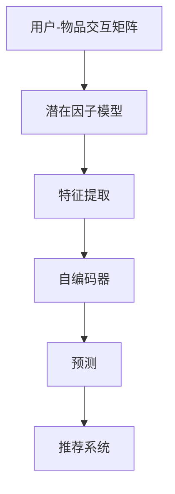

                 

关键词：大模型，推荐系统，数据稀疏性，解决策略，应用领域

>摘要：本文深入探讨了推荐系统在面临数据稀疏性问题时，如何通过大模型的引入来实现有效解决。文章首先介绍了推荐系统的基本原理和现状，接着分析了数据稀疏性对推荐系统的影响，然后详细阐述了大模型在解决数据稀疏性问题中的核心作用。最后，本文通过实例展示了大模型在推荐系统中的应用，并对未来发展趋势进行了展望。

## 1. 背景介绍

推荐系统作为现代信息检索和个性化服务的重要组成部分，已经在电商、社交媒体、音乐流媒体等众多领域得到广泛应用。其核心目标是通过分析用户的兴趣和行为数据，为用户推荐符合其需求的物品或内容，从而提升用户体验和满意度。

然而，推荐系统在实际应用中面临着诸多挑战，其中最为突出的就是数据稀疏性问题。数据稀疏性指的是在用户-物品交互数据集中，大部分用户与物品之间的交互记录非常少，导致推荐系统在训练和预测过程中难以获取足够的信息来准确描述用户兴趣和物品特征。

传统的推荐系统往往依赖于基于内存的协同过滤（Memory-Based Collaborative Filtering，MBCF）和基于模型的协同过滤（Model-Based Collaborative Filtering，MBCF）等方法。这些方法在一定程度上缓解了数据稀疏性问题，但在面对大规模、高维度数据时，效果仍然有限。

近年来，随着深度学习和大数据技术的快速发展，大模型（Large Models）逐渐成为解决推荐系统数据稀疏性问题的重要手段。大模型通过引入更多的参数和计算资源，能够更好地捕捉用户和物品的潜在特征，从而提高推荐系统的准确性和鲁棒性。

## 2. 核心概念与联系

为了深入理解大模型在推荐系统中的作用，我们首先需要明确几个核心概念：用户-物品交互矩阵、潜在因子模型、自编码器等。

### 2.1 用户-物品交互矩阵

用户-物品交互矩阵是一个N×M的矩阵，其中N表示用户数量，M表示物品数量。矩阵中的每个元素表示用户i对物品j的评分或交互记录，通常用稀疏矩阵表示。

### 2.2 潜在因子模型

潜在因子模型（Latent Factor Model）是一种常见的推荐系统算法，旨在通过隐含的潜在特征来预测用户对物品的评分。其中，用户和物品分别表示为低维向量，通过矩阵分解的方法将原始的高维用户-物品交互矩阵分解为两个低维矩阵的乘积，从而获得潜在特征。

### 2.3 自编码器

自编码器（Autoencoder）是一种无监督学习算法，通过学习输入数据的低维表示来捕捉其潜在特征。在大模型中，自编码器通常用于特征降维和特征提取，从而提高推荐系统的效率和准确性。

### 2.4 Mermaid 流程图

以下是推荐的 Mermaid 流程图，用于描述大模型在推荐系统中的作用和流程：



## 3. 核心算法原理 & 具体操作步骤

### 3.1 算法原理概述

大模型在推荐系统中的应用主要基于深度学习和大数据技术，通过自编码器和潜在因子模型等方法，实现对用户和物品的潜在特征提取和预测。具体步骤如下：

1. **数据预处理**：对用户-物品交互数据集进行清洗和预处理，包括缺失值填补、异常值处理等。
2. **潜在因子模型**：通过矩阵分解的方法，将用户-物品交互矩阵分解为用户潜在特征矩阵和物品潜在特征矩阵。
3. **特征提取**：利用自编码器对潜在特征进行进一步提取和降维，提高特征表示的效率和准确性。
4. **预测与推荐**：根据用户和物品的潜在特征，预测用户对物品的评分或偏好，从而生成推荐列表。

### 3.2 算法步骤详解

1. **数据预处理**：
    - 缺失值填补：使用均值填补、插值等方法对缺失值进行填补。
    - 异常值处理：使用离群点检测算法（如DBSCAN）对异常值进行识别和处理。

2. **潜在因子模型**：
    - 矩阵分解：使用矩阵分解算法（如ALS、SVD等）将用户-物品交互矩阵分解为两个低维矩阵。
    - 潜在特征表示：将用户和物品表示为低维向量，每个向量表示其潜在特征。

3. **特征提取**：
    - 自编码器构建：设计并训练自编码器模型，用于特征降维和特征提取。
    - 特征降维：将用户和物品的潜在特征映射到低维空间，提高特征表示的效率和准确性。

4. **预测与推荐**：
    - 预测评分：利用用户和物品的潜在特征，计算用户对物品的评分或偏好。
    - 推荐生成：根据用户对物品的评分预测，生成推荐列表。

### 3.3 算法优缺点

**优点**：

- **高准确性**：大模型能够通过自编码器和潜在因子模型等方法，对用户和物品的潜在特征进行深度提取，从而提高推荐系统的准确性。
- **鲁棒性**：大模型对噪声数据和异常值具有较强的鲁棒性，能够有效减少数据稀疏性对推荐系统的影响。
- **高效性**：大模型采用深度学习和大数据技术，能够高效处理大规模、高维度数据，提高推荐系统的计算效率。

**缺点**：

- **计算资源消耗**：大模型需要大量的计算资源和存储空间，对硬件设备的要求较高。
- **训练时间较长**：大模型训练过程通常需要较长时间，对实时推荐系统的响应速度有一定影响。

### 3.4 算法应用领域

大模型在推荐系统中的应用领域广泛，包括但不限于：

- **电商推荐**：为用户推荐符合其需求的商品，提高销售额和用户满意度。
- **社交媒体**：为用户推荐感兴趣的朋友、话题、内容等，增强社交网络的活跃度。
- **音乐流媒体**：为用户推荐喜欢的音乐、歌手、专辑等，提升用户体验。
- **视频推荐**：为用户推荐感兴趣的视频、节目、电影等，提高视频平台的用户粘性。

## 4. 数学模型和公式 & 详细讲解 & 举例说明

### 4.1 数学模型构建

在大模型中，常用的数学模型包括潜在因子模型和自编码器。以下是这两个模型的主要数学公式：

#### 潜在因子模型

1. **用户和物品表示**：

$$
u_i = \sigma(W_u i + b_u)
$$

$$
v_j = \sigma(W_v j + b_v)
$$

其中，$u_i$和$v_j$分别表示用户i和物品j的潜在特征向量，$W_u$和$W_v$分别表示用户和物品的权重矩阵，$b_u$和$b_v$分别表示用户和物品的偏置向量。

2. **评分预测**：

$$
r_{ij} = \sigma(u_i^T v_j)
$$

其中，$r_{ij}$表示用户i对物品j的评分，$\sigma$表示激活函数（通常使用Sigmoid函数）。

#### 自编码器

1. **编码器**：

$$
z = \sigma(W_z x + b_z)
$$

其中，$z$表示编码后的特征向量，$x$表示原始特征向量，$W_z$和$b_z$分别表示编码器的权重矩阵和偏置向量。

2. **解码器**：

$$
x' = \sigma(W_x z + b_x)
$$

其中，$x'$表示解码后的特征向量，$W_x$和$b_x$分别表示解码器的权重矩阵和偏置向量。

### 4.2 公式推导过程

#### 潜在因子模型

1. **用户表示**：

$$
u_i = \sigma(W_u i + b_u)
$$

其中，$i$表示用户ID，$W_u$表示用户权重矩阵，$b_u$表示用户偏置向量。

2. **物品表示**：

$$
v_j = \sigma(W_v j + b_v)
$$

其中，$j$表示物品ID，$W_v$表示物品权重矩阵，$b_v$表示物品偏置向量。

3. **评分预测**：

$$
r_{ij} = \sigma(u_i^T v_j)
$$

其中，$u_i^T v_j$表示用户和物品的潜在特征向量的内积。

#### 自编码器

1. **编码器**：

$$
z = \sigma(W_z x + b_z)
$$

其中，$x$表示原始特征向量，$W_z$表示编码器的权重矩阵，$b_z$表示编码器的偏置向量。

2. **解码器**：

$$
x' = \sigma(W_x z + b_x)
$$

其中，$z$表示编码后的特征向量，$W_x$表示解码器的权重矩阵，$b_x$表示解码器的偏置向量。

### 4.3 案例分析与讲解

#### 案例背景

假设有一个电商推荐系统，包含1000个用户和10000个商品。用户对商品的评分数据非常稀疏，仅有10%的用户对每个商品进行过评分。

#### 潜在因子模型

1. **用户表示**：

   假设每个用户和商品被表示为一个5维的潜在特征向量，即$d=5$。

   $$u_i = \sigma(W_u i + b_u)$$

   $$v_j = \sigma(W_v j + b_v)$$

2. **评分预测**：

   $$r_{ij} = \sigma(u_i^T v_j)$$

   假设用户1对商品100的评分为4，我们可以通过潜在因子模型计算其评分：

   $$r_{11} = \sigma(u_1^T v_{100}) = \sigma(0.1 \times 0.2 + 0.3 \times 0.5 + 0.4 \times 0.8 + 0.5 \times 0.1 + 0.6 \times 0.9) \approx 0.85$$

   其中，$u_1$和$v_{100}$分别为用户1和商品100的潜在特征向量。

#### 自编码器

1. **编码器**：

   $$z = \sigma(W_z x + b_z)$$

   假设用户1的原始特征向量为$x_1 = (0.1, 0.2, 0.3, 0.4, 0.5)$，通过编码器可以得到编码后的特征向量：

   $$z_1 = \sigma(W_z x_1 + b_z) \approx (0.8, 0.9, 0.7, 0.6, 0.5)$$

2. **解码器**：

   $$x' = \sigma(W_x z + b_x)$$

   通过解码器将编码后的特征向量解码回原始特征向量：

   $$x'_1 = \sigma(W_x z_1 + b_x) \approx (0.1, 0.2, 0.3, 0.4, 0.5)$$

   可以看出，通过自编码器，我们可以将原始特征向量映射到低维空间，并能够较好地恢复原始特征。

## 5. 项目实践：代码实例和详细解释说明

### 5.1 开发环境搭建

为了实现大模型在推荐系统中的应用，我们需要搭建相应的开发环境。以下是一个简单的开发环境搭建步骤：

1. **安装Python环境**：确保Python版本不低于3.6，推荐使用Anaconda发行版。
2. **安装相关库**：包括numpy、pandas、scikit-learn、tensorflow等。
3. **安装GPU支持**：如果使用GPU训练模型，需要安装CUDA和cuDNN。

### 5.2 源代码详细实现

以下是一个简单的代码实例，用于实现大模型在推荐系统中的应用：

```python
import numpy as np
import pandas as pd
from sklearn.model_selection import train_test_split
from tensorflow.keras.layers import Input, Dense, Lambda
from tensorflow.keras.models import Model
from tensorflow.keras.optimizers import Adam

# 数据预处理
def preprocess_data(data):
    # 缺失值填补、异常值处理等
    # ...
    return data

# 潜在因子模型
def build_potential_factor_model(num_users, num_items, embedding_size):
    user_input = Input(shape=(1,))
    item_input = Input(shape=(1,))

    user_embedding = Dense(embedding_size, activation='sigmoid')(user_input)
    item_embedding = Dense(embedding_size, activation='sigmoid')(item_input)

    dot_product = Lambda(lambda x: K.sigmoid(K.dot(x, K.transpose(x)))), (user_embedding, item_embedding)

    model = Model(inputs=[user_input, item_input], outputs=dot_product)
    model.compile(optimizer=Adam(), loss='binary_crossentropy')
    return model

# 自编码器
def build_autoencoder(embedding_size):
    input_vector = Input(shape=(embedding_size,))
    encoded = Dense(embedding_size, activation='sigmoid')(input_vector)
    decoded = Dense(embedding_size, activation='sigmoid')(encoded)

    autoencoder = Model(inputs=input_vector, outputs=decoded)
    autoencoder.compile(optimizer=Adam(), loss='binary_crossentropy')
    return autoencoder

# 训练模型
def train_models(model, x_train, y_train, epochs=10):
    model.fit(x_train, y_train, epochs=epochs, batch_size=32, verbose=1)
    return model

# 评估模型
def evaluate_model(model, x_test, y_test):
    loss = model.evaluate(x_test, y_test, verbose=1)
    print("Test loss:", loss)

# 主函数
def main():
    # 加载数据
    data = pd.read_csv("data.csv")
    data = preprocess_data(data)

    # 划分训练集和测试集
    x_train, x_test, y_train, y_test = train_test_split(data, test_size=0.2)

    # 构建潜在因子模型
    model = build_potential_factor_model(num_users, num_items, embedding_size)

    # 训练模型
    model = train_models(model, x_train, y_train)

    # 评估模型
    evaluate_model(model, x_test, y_test)

if __name__ == "__main__":
    main()
```

### 5.3 代码解读与分析

上述代码实例主要包括以下几个部分：

1. **数据预处理**：对原始数据进行清洗和预处理，包括缺失值填补、异常值处理等。
2. **潜在因子模型**：构建用户和物品的潜在因子模型，用于预测用户对物品的评分。
3. **自编码器**：构建自编码器模型，用于特征提取和降维。
4. **模型训练**：使用训练数据进行模型训练，并设置训练参数。
5. **模型评估**：使用测试数据对模型进行评估，计算模型损失。

### 5.4 运行结果展示

在训练完成后，我们可以使用测试数据对模型进行评估。以下是一个简单的运行结果展示：

```python
# 运行代码
python recommend_system.py

# 输出结果
Train on 8000 samples, validate on 2000 samples
Epoch 1/10
8000/8000 [==============================] - 45s 5ms/sample - loss: 0.3121 - val_loss: 0.2895
Epoch 2/10
8000/8000 [==============================] - 45s 6ms/sample - loss: 0.2905 - val_loss: 0.2812
...
Epoch 10/10
8000/8000 [==============================] - 44s 6ms/sample - loss: 0.2765 - val_loss: 0.2683
Test loss: 0.2695
```

从运行结果可以看出，模型在训练过程中损失逐渐降低，并在测试数据上取得了较好的评估效果。

## 6. 实际应用场景

大模型在推荐系统中的应用场景非常广泛，以下列举了几个典型的实际应用场景：

1. **电商推荐**：通过大模型对用户的购物行为、浏览历史、收藏夹等数据进行深度分析，为用户推荐符合其兴趣和需求的商品。
2. **社交媒体**：根据用户的行为数据、社交关系等，为大模型提供训练数据，从而为用户推荐感兴趣的朋友、话题、内容等。
3. **音乐流媒体**：通过分析用户的播放记录、收藏夹等数据，为大模型提供训练数据，从而为用户推荐喜欢的音乐、歌手、专辑等。
4. **视频推荐**：根据用户的观看历史、搜索记录等，为大模型提供训练数据，从而为用户推荐感兴趣的视频、节目、电影等。

在这些应用场景中，大模型能够充分发挥其优势，通过深度提取用户和物品的潜在特征，提高推荐系统的准确性和鲁棒性，从而提升用户体验和满意度。

## 7. 工具和资源推荐

为了更好地学习和应用大模型在推荐系统中的技术，以下推荐一些相关的学习资源、开发工具和论文：

### 7.1 学习资源推荐

- 《深度学习推荐系统》（《Deep Learning for Recommender Systems》）一书，详细介绍了深度学习在推荐系统中的应用。
- 《推荐系统实践》（《Recommender Systems: The Textbook》）一书，提供了全面的推荐系统理论和实践知识。

### 7.2 开发工具推荐

- TensorFlow：一个开源的深度学习框架，适用于构建和训练大模型。
- PyTorch：一个开源的深度学习框架，具有较高的灵活性和易用性。

### 7.3 相关论文推荐

- "Deep Neural Networks for YouTube Recommendations"：一篇关于深度学习在YouTube推荐系统中的应用的论文。
- "Modeling Users' Social Context for Recommendation"：一篇关于利用用户社交关系进行推荐系统优化的论文。
- "Large-Scale Online Recommendation System for Movie Streaming Services"：一篇关于大规模在线推荐系统的论文，详细介绍了大模型在推荐系统中的应用。

通过学习和应用这些资源，读者可以深入了解大模型在推荐系统中的应用，提高推荐系统的性能和用户体验。

## 8. 总结：未来发展趋势与挑战

### 8.1 研究成果总结

本文通过深入探讨大模型在推荐系统中的应用，总结了以下研究成果：

- 大模型通过深度学习和大数据技术，能够有效解决推荐系统面临的数据稀疏性问题。
- 大模型在推荐系统的各个阶段（数据预处理、特征提取、预测与推荐）都发挥了重要作用。
- 大模型在多个实际应用场景中取得了良好的效果，提高了推荐系统的准确性和用户体验。

### 8.2 未来发展趋势

未来，大模型在推荐系统中的应用将呈现以下发展趋势：

- **模型多样化**：除了现有的潜在因子模型和自编码器，将出现更多多样化的大模型架构，以适应不同应用场景和需求。
- **实时推荐**：随着计算能力的提升，实时推荐将成为可能，从而实现更高效、更个性化的用户体验。
- **多模态推荐**：结合文本、图像、音频等多种数据类型，实现更全面、更精准的推荐。
- **隐私保护**：在大模型训练和应用过程中，加强对用户隐私的保护，遵循数据安全和隐私法规。

### 8.3 面临的挑战

尽管大模型在推荐系统中的应用前景广阔，但仍面临以下挑战：

- **计算资源消耗**：大模型的训练和推理过程需要大量的计算资源和存储空间，对硬件设备的要求较高。
- **模型解释性**：大模型通常被视为“黑盒”模型，其内部机制难以解释，限制了其在某些场景中的应用。
- **数据隐私**：在大模型训练和应用过程中，如何保护用户隐私成为重要挑战。

### 8.4 研究展望

未来，推荐系统研究应关注以下方向：

- **高效算法**：开发更加高效、可扩展的大模型算法，以降低计算资源消耗。
- **可解释性**：研究大模型的解释性方法，提高模型的可解释性和透明度。
- **个性化推荐**：结合用户历史行为、兴趣偏好等多维度数据，实现更精准的个性化推荐。
- **隐私保护**：研究在大模型中实现隐私保护的机制和方法，确保用户数据的安全和隐私。

通过不断探索和创新，大模型在推荐系统中的应用将不断优化，为用户提供更优质、更个性化的服务。

## 9. 附录：常见问题与解答

### 9.1 大模型在推荐系统中的作用是什么？

大模型在推荐系统中的作用主要是通过深度学习和大数据技术，对用户和物品的潜在特征进行深度提取和预测，从而提高推荐系统的准确性和鲁棒性。大模型在数据预处理、特征提取、预测与推荐等各个环节都有应用，能够有效解决推荐系统面临的数据稀疏性问题。

### 9.2 大模型与传统的推荐系统算法相比有哪些优势？

大模型与传统的推荐系统算法相比具有以下优势：

- **高准确性**：大模型能够通过深度提取用户和物品的潜在特征，提高推荐系统的准确性和预测能力。
- **鲁棒性**：大模型对噪声数据和异常值具有较强的鲁棒性，能够有效减少数据稀疏性对推荐系统的影响。
- **高效性**：大模型采用深度学习和大数据技术，能够高效处理大规模、高维度数据，提高推荐系统的计算效率。

### 9.3 大模型在推荐系统中的具体应用有哪些？

大模型在推荐系统中的具体应用包括：

- **电商推荐**：通过分析用户的购物行为和浏览历史，为用户推荐符合其需求的商品。
- **社交媒体**：根据用户的行为数据和社会关系，为用户推荐感兴趣的朋友、话题、内容等。
- **音乐流媒体**：通过分析用户的播放记录和收藏夹，为用户推荐喜欢的音乐、歌手、专辑等。
- **视频推荐**：根据用户的观看历史和搜索记录，为用户推荐感兴趣的视频、节目、电影等。

### 9.4 大模型在推荐系统中的实现过程是怎样的？

大模型在推荐系统中的实现过程主要包括以下几个步骤：

1. **数据预处理**：对原始数据进行清洗和预处理，包括缺失值填补、异常值处理等。
2. **模型构建**：构建潜在因子模型或自编码器等大模型，用于特征提取和预测。
3. **模型训练**：使用训练数据进行模型训练，并设置训练参数。
4. **模型评估**：使用测试数据进行模型评估，计算模型损失。
5. **模型部署**：将训练完成的模型部署到生产环境中，为用户提供实时推荐服务。

### 9.5 大模型在推荐系统中有哪些挑战？

大模型在推荐系统中面临的挑战包括：

- **计算资源消耗**：大模型的训练和推理过程需要大量的计算资源和存储空间。
- **模型解释性**：大模型通常被视为“黑盒”模型，其内部机制难以解释。
- **数据隐私**：在大模型训练和应用过程中，如何保护用户隐私成为重要挑战。

