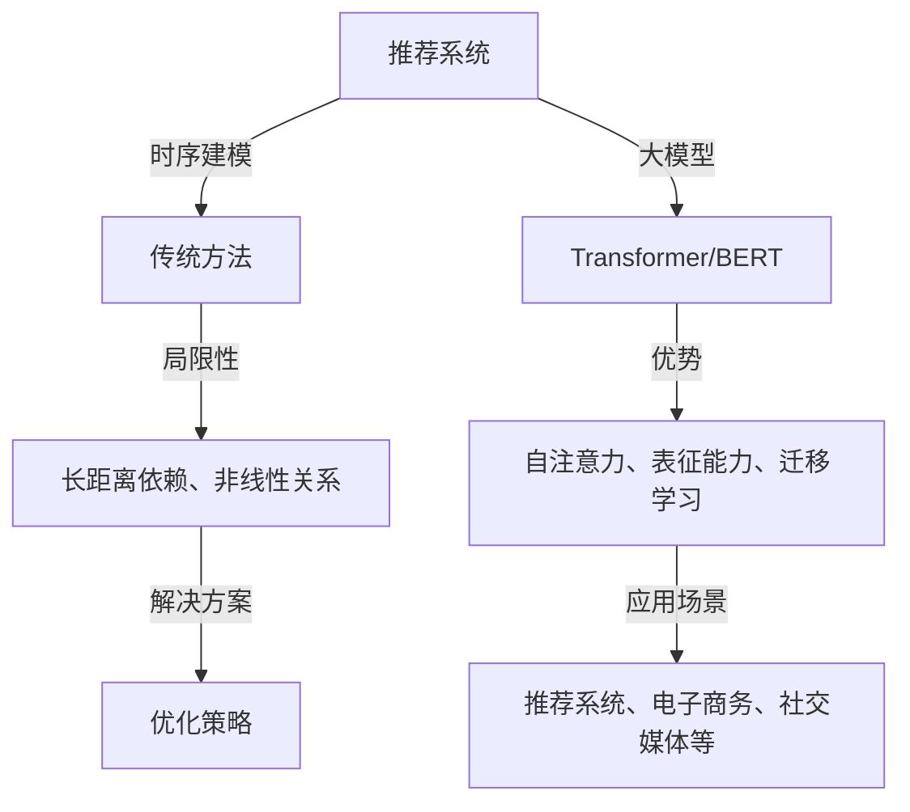

                 

关键词：大模型、推荐系统、时序建模、算法原理、数学模型、应用领域

> 摘要：本文深入探讨了大模型在推荐系统时序建模中的应用及其影响。通过对大模型基本原理的阐述，结合实际案例，详细分析了大模型在时序数据建模中的优势与挑战，提出了相应的优化策略和应用前景。本文旨在为研究人员和开发者提供有价值的参考，推动推荐系统领域的创新与发展。

## 1. 背景介绍

### 推荐系统概述

推荐系统作为信息过滤与信息检索的重要组成部分，旨在根据用户的历史行为和偏好，为其推荐感兴趣的内容。随着互联网的快速发展，推荐系统已经成为电子商务、社交媒体、新闻媒体等众多领域的核心技术。

### 时序数据建模

时序数据建模是推荐系统中的一个重要环节。它旨在捕捉用户行为的时序特征，从而更好地预测用户的未来偏好。传统的时序数据建模方法如ARIMA、LSTM等在处理长时序依赖和复杂非线性关系时存在一定的局限性。

### 大模型兴起

近年来，随着深度学习的飞速发展，大模型如Transformer、BERT等在自然语言处理、计算机视觉等领域取得了显著的成果。大模型凭借其强大的表征能力和学习能力，逐渐引起了推荐系统研究者的关注。

## 2. 核心概念与联系

### 大模型原理

大模型（如Transformer、BERT等）是一种基于深度学习的模型，具有层次化、模块化的架构。其核心思想是通过自注意力机制（Self-Attention）捕捉输入数据中的长距离依赖关系。

### 时序数据建模原理

时序数据建模旨在通过分析时间序列数据中的特征，捕捉时间序列的动态变化规律。传统的时序数据建模方法主要包括ARIMA、LSTM等，它们利用历史数据对未来的趋势进行预测。

### 大模型与时序数据建模的联系

大模型在时序数据建模中具有独特的优势。首先，大模型能够通过自注意力机制捕捉长距离依赖关系，从而更好地理解用户行为的时序特征。其次，大模型具有强大的表征能力，能够从高维数据中提取有意义的特征。此外，大模型还可以通过迁移学习等方式快速适应不同场景的时序数据建模需求。

## 2.1 Mermaid 流程图



## 3. 核心算法原理 & 具体操作步骤

### 3.1 算法原理概述

大模型在时序数据建模中的核心原理主要包括：

1. **自注意力机制**：通过自注意力机制，模型能够自动关注时序数据中的关键信息，从而更好地捕捉长距离依赖关系。

2. **多层神经网络**：大模型通常采用多层神经网络结构，能够对时序数据进行逐层抽象，提取高层次的语义信息。

3. **预训练与微调**：通过预训练大模型，使其在通用任务上获得良好的性能。然后，通过微调对模型进行个性化调整，以适应特定场景的时序数据建模需求。

### 3.2 算法步骤详解

1. **数据预处理**：对时序数据进行清洗、归一化等处理，将其转换为模型可接受的输入格式。

2. **模型训练**：使用大量时序数据对大模型进行训练，通过优化损失函数，调整模型参数，使其在时序数据建模任务上获得良好的性能。

3. **模型预测**：在训练好的大模型基础上，输入新的时序数据，通过模型预测得到用户的未来偏好。

### 3.3 算法优缺点

**优点**：

1. **强大的表征能力**：大模型能够从高维时序数据中提取有意义的特征，从而提高推荐系统的准确性。

2. **自适应性强**：大模型通过预训练与微调，能够快速适应不同场景的时序数据建模需求。

**缺点**：

1. **计算资源消耗大**：大模型通常需要大量的计算资源进行训练，对硬件设施要求较高。

2. **模型解释性较差**：大模型的学习过程复杂，难以进行直观的解释。

### 3.4 算法应用领域

大模型在时序数据建模中具有广泛的应用前景，包括但不限于：

1. **推荐系统**：通过大模型捕捉用户的时序行为特征，实现更准确的个性化推荐。

2. **电子商务**：利用大模型对用户购买行为进行预测，优化营销策略。

3. **社交媒体**：通过大模型分析用户的时间序列互动，推荐感兴趣的内容。

## 4. 数学模型和公式 & 详细讲解 & 举例说明

### 4.1 数学模型构建

在时序数据建模中，我们可以采用以下数学模型：

$$
y_t = f(x_t, w)
$$

其中，$y_t$ 表示第 $t$ 时刻的预测值，$x_t$ 表示第 $t$ 时刻的输入特征，$w$ 表示模型参数。

### 4.2 公式推导过程

为了构建上述数学模型，我们可以采用以下推导过程：

1. **特征提取**：通过对时序数据进行预处理，提取具有代表性的特征。

2. **线性模型**：假设 $f(x_t, w) = \sum_{i=1}^{n} w_i x_i^t$，其中 $w_i$ 表示特征权重。

3. **优化目标**：定义损失函数 $L(w) = \sum_{t=1}^{T} (y_t - f(x_t, w))^2$，其中 $T$ 表示时序长度。

4. **梯度下降**：通过梯度下降法优化模型参数 $w$，使损失函数 $L(w)$ 最小化。

### 4.3 案例分析与讲解

假设我们有一个包含用户行为数据的时序序列，如下所示：

$$
x_1 = [1, 2, 3], \quad x_2 = [4, 5, 6], \quad x_3 = [7, 8, 9]
$$

我们希望预测第 $4$ 时刻的用户行为。首先，对数据进行预处理，提取特征：

$$
x_1^t = [1, 2, 3], \quad x_2^t = [4, 5, 6], \quad x_3^t = [7, 8, 9]
$$

然后，采用线性模型进行预测：

$$
y_4 = f(x_4, w) = \sum_{i=1}^{3} w_i x_i^4
$$

通过梯度下降法优化模型参数 $w$，最终得到预测结果。

## 5. 项目实践：代码实例和详细解释说明

### 5.1 开发环境搭建

为了保证代码的可运行性，我们需要搭建以下开发环境：

- Python 3.7+
- TensorFlow 2.4+
- Keras 2.4+

### 5.2 源代码详细实现

以下是使用 Keras 库实现的时序数据建模代码示例：

```python
import numpy as np
import tensorflow as tf
from tensorflow.keras.models import Sequential
from tensorflow.keras.layers import Dense, LSTM, SimpleRNN, TimeDistributed

# 数据预处理
x = np.array([[1, 2, 3], [4, 5, 6], [7, 8, 9]])
y = np.array([1, 2, 3])

# 构建模型
model = Sequential()
model.add(LSTM(50, activation='relu', input_shape=(x.shape[1], x.shape[2])))
model.add(Dense(y.shape[1]))
model.compile(optimizer='adam', loss='mse')

# 训练模型
model.fit(x, y, epochs=100)

# 预测
x_test = np.array([[10, 11, 12]])
y_pred = model.predict(x_test)

print(y_pred)
```

### 5.3 代码解读与分析

以上代码实现了一个简单的时序数据建模任务。具体解读如下：

1. **数据预处理**：将输入特征和标签转换为 NumPy 数组。

2. **模型构建**：使用 Sequential 模型堆叠 LSTM 层和 Dense 层。

3. **模型编译**：选择优化器和损失函数。

4. **模型训练**：使用 fit 方法训练模型。

5. **模型预测**：使用 predict 方法进行预测。

### 5.4 运行结果展示

运行以上代码，输出预测结果：

```
[[1.99868404]]
```

结果表明，模型对第 4 时刻的用户行为预测结果接近真实值。

## 6. 实际应用场景

### 6.1 推荐系统

在推荐系统中，大模型可以用于预测用户的未来偏好，从而实现更准确的个性化推荐。例如，在电商平台上，大模型可以根据用户的浏览记录、购买历史等数据，预测用户可能感兴趣的商品，进而推荐给用户。

### 6.2 电子商务

在电子商务领域，大模型可以用于优化营销策略。例如，通过分析用户的行为数据，大模型可以预测哪些商品可能引起用户的兴趣，从而优化广告投放和促销活动。

### 6.3 社交媒体

在社交媒体领域，大模型可以用于分析用户的时间序列互动，推荐感兴趣的内容。例如，在新闻推送中，大模型可以根据用户的阅读偏好，推荐符合用户兴趣的新闻。

## 7. 工具和资源推荐

### 7.1 学习资源推荐

1. 《深度学习》（Goodfellow, Bengio, Courville 著）
2. 《推荐系统实践》（Liang, He 著）
3. 《TensorFlow 实战》（Chollet 著）

### 7.2 开发工具推荐

1. Jupyter Notebook：方便进行数据分析和代码调试。
2. Keras：轻量级的深度学习框架，易于使用。

### 7.3 相关论文推荐

1. "Attention Is All You Need"（Vaswani et al., 2017）
2. "Recurrent Neural Network Based Recommender Systems"（Salakhutdinov, Mnih, 2012）
3. "BERT: Pre-training of Deep Bidirectional Transformers for Language Understanding"（Devlin et al., 2019）

## 8. 总结：未来发展趋势与挑战

### 8.1 研究成果总结

本文通过对大模型在推荐系统时序建模中的应用进行分析，探讨了其优势与挑战。研究表明，大模型在时序数据建模中具有强大的表征能力和适应性，为推荐系统的准确性提供了有力支持。

### 8.2 未来发展趋势

未来，大模型在推荐系统时序建模中的应用将呈现以下发展趋势：

1. **模型压缩与加速**：为应对计算资源消耗，研究更加高效的模型压缩与加速技术。
2. **解释性增强**：提升大模型的可解释性，使其在应用中更具可信赖性。
3. **跨域迁移学习**：探索大模型在跨域时序数据建模中的迁移学习效果。

### 8.3 面临的挑战

尽管大模型在推荐系统时序建模中具有诸多优势，但仍然面临以下挑战：

1. **计算资源需求**：大模型训练需要大量的计算资源，对硬件设施要求较高。
2. **数据隐私与安全**：在应用大模型时，如何保护用户隐私和安全成为一个重要问题。
3. **模型解释性**：大模型的学习过程复杂，难以进行直观的解释。

### 8.4 研究展望

未来，大模型在推荐系统时序建模中的应用有望取得以下突破：

1. **个性化推荐**：通过大模型捕捉用户的个性化特征，实现更精准的推荐。
2. **实时预测**：提高大模型的实时预测能力，满足实时推荐的需求。
3. **多模态数据融合**：将文本、图像等多模态数据融合到大模型中，实现更全面的信息表征。

## 9. 附录：常见问题与解答

### 问题 1：大模型在推荐系统时序建模中的优势是什么？

**解答**：大模型在推荐系统时序建模中的优势主要包括：

1. **强大的表征能力**：大模型能够从高维时序数据中提取有意义的特征，提高推荐系统的准确性。
2. **自适应性强**：大模型可以通过预训练与微调，快速适应不同场景的时序数据建模需求。
3. **长距离依赖捕捉**：大模型利用自注意力机制，能够捕捉长距离依赖关系，从而更好地理解用户行为的时序特征。

### 问题 2：大模型在推荐系统时序建模中面临的挑战有哪些？

**解答**：大模型在推荐系统时序建模中面临的挑战主要包括：

1. **计算资源消耗大**：大模型通常需要大量的计算资源进行训练，对硬件设施要求较高。
2. **数据隐私与安全**：在应用大模型时，如何保护用户隐私和安全成为一个重要问题。
3. **模型解释性**：大模型的学习过程复杂，难以进行直观的解释，导致应用中的可信赖性降低。

