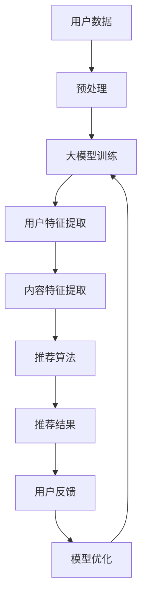

                 

关键词：大模型，推荐系统，用户体验，算法优化，模型架构

> 摘要：本文旨在探讨如何利用大规模预训练模型（大模型）提升推荐系统的用户体验。通过分析大模型的优势和挑战，本文将详细阐述其在推荐系统中的具体应用场景，并提出相应的优化策略，以期为相关领域的研究和实践提供参考。

## 1. 背景介绍

推荐系统是现代互联网的重要组成部分，广泛应用于电子商务、社交媒体、新闻资讯等众多领域。其主要目标是通过分析用户的历史行为、兴趣偏好等信息，为用户推荐符合其需求的个性化内容。然而，随着用户数据量的爆发式增长和推荐场景的多样化，传统的推荐算法逐渐暴露出诸多不足，如低效的冷启动问题、同质化的推荐内容、用户满意度下降等。

近年来，大模型的出现为推荐系统带来了新的契机。大模型，尤其是基于深度学习的预训练模型，通过在海量数据上预训练，积累了丰富的知识表示能力，能够在各种推荐任务中表现出色。本文将围绕大模型在推荐系统中的应用，探讨其对用户体验的提升策略。

## 2. 核心概念与联系

### 2.1 大模型的基本概念

大模型，通常指的是具有数十亿甚至数万亿参数的深度学习模型。这些模型通过在大规模数据集上进行预训练，能够学习到丰富的知识表示，从而在各类任务中表现出卓越的性能。大模型的出现打破了传统模型在性能和复杂性之间的权衡，使得深度学习在自然语言处理、计算机视觉、语音识别等领域的应用取得了显著进展。

### 2.2 推荐系统的基本架构

推荐系统的基本架构通常包括用户建模、内容建模、推荐算法和用户体验四个核心模块。用户建模旨在了解用户的兴趣偏好和行为习惯，内容建模则关注于对推荐内容进行特征提取和分类。推荐算法根据用户和内容的特征进行匹配，生成个性化的推荐列表。用户体验模块则负责反馈用户对推荐结果的满意度，为后续优化提供依据。

### 2.3 大模型与推荐系统的联系

大模型在推荐系统中的应用主要体现在以下几个方面：

1. **用户特征提取**：大模型能够通过对用户历史行为的深度学习，提取出更精细的用户特征，从而提高推荐的相关性。
2. **内容理解**：大模型能够对文本、图像等多模态内容进行深入理解，从而为推荐算法提供更丰富的内容特征。
3. **推荐算法优化**：大模型可以通过迁移学习、多任务学习等技术，优化推荐算法的效率和效果。
4. **冷启动问题**：大模型在预训练过程中积累了大量通用知识，有助于解决新用户或新内容的冷启动问题。

### 2.4 Mermaid 流程图

下面是一个简化的Mermaid流程图，展示了大模型在推荐系统中的基本工作流程：



## 3. 核心算法原理 & 具体操作步骤

### 3.1 算法原理概述

大模型在推荐系统中的应用主要基于以下原理：

1. **深度神经网络**：大模型通常采用深度神经网络架构，如Transformer、BERT等，能够对复杂的数据进行层次化的特征提取。
2. **预训练与微调**：大模型通过在大规模数据集上进行预训练，积累通用知识表示，再通过微调适应特定推荐任务的需求。
3. **迁移学习**：大模型可以利用迁移学习技术，将预训练的知识迁移到新的推荐任务中，提高模型在新任务上的性能。
4. **多任务学习**：大模型可以通过多任务学习，同时处理多个推荐任务，如用户兴趣检测、内容分类等，提高推荐系统的整体性能。

### 3.2 算法步骤详解

1. **数据预处理**：对用户行为数据和内容数据进行清洗、编码和归一化处理，为后续的模型训练做好准备。
2. **大模型预训练**：在大规模通用数据集上训练大模型，如使用BERT在维基百科上进行预训练。
3. **用户特征提取**：利用预训练的大模型，对用户行为数据进行编码，提取出高维的用户特征向量。
4. **内容特征提取**：对推荐内容进行文本、图像等多模态特征提取，为推荐算法提供丰富的内容特征。
5. **推荐算法**：结合用户特征和内容特征，利用深度学习算法进行推荐，如基于Transformer的推荐模型。
6. **模型优化**：根据用户反馈对模型进行优化，如通过梯度提升或强化学习等技术。

### 3.3 算法优缺点

**优点**：

1. **强大的特征提取能力**：大模型能够自动学习到丰富的特征表示，提高推荐的相关性和准确性。
2. **适应性**：通过预训练和微调，大模型能够适应不同的推荐任务和场景，具有广泛的适用性。
3. **效率提升**：多任务学习和迁移学习技术使得推荐系统的效率和效果得到显著提升。

**缺点**：

1. **计算资源需求**：大模型训练和推理需要大量的计算资源和时间，对硬件设备有较高要求。
2. **数据依赖性**：大模型的效果高度依赖于训练数据的质量和数量，数据不足或质量差可能导致性能下降。

### 3.4 算法应用领域

大模型在推荐系统中的应用已经取得了显著成果，如：

1. **电子商务**：基于大模型的推荐算法能够提高商品推荐的准确性和用户满意度，提升电商平台销售额。
2. **社交媒体**：大模型能够对用户生成的内容进行深入理解，提供更个性化的社交推荐，如Twitter的Top Tweets推荐。
3. **新闻资讯**：大模型能够分析用户兴趣，提供个性化的新闻推荐，如Google News的个性化推荐。

## 4. 数学模型和公式 & 详细讲解 & 举例说明

### 4.1 数学模型构建

在推荐系统中，大模型通常用于用户特征提取和内容特征提取。以下是简单的数学模型构建过程：

1. **用户特征提取**：

   用户特征提取通常采用Transformer模型，其输入为用户行为序列，输出为用户特征向量。

   $$ X = [x_1, x_2, ..., x_n] \rightarrow U = \text{Transformer}(X) $$

2. **内容特征提取**：

   内容特征提取同样采用Transformer模型，其输入为内容文本序列，输出为内容特征向量。

   $$ Y = [y_1, y_2, ..., y_m] \rightarrow C = \text{Transformer}(Y) $$

### 4.2 公式推导过程

以Transformer模型为例，其核心公式包括：

1. **自注意力机制**：

   $$ \text{Attention}(Q, K, V) = \text{softmax}\left(\frac{QK^T}{\sqrt{d_k}}\right)V $$

   其中，$Q$、$K$、$V$分别为查询向量、键向量和值向量，$d_k$为键向量的维度。

2. **多头注意力机制**：

   $$ \text{MultiHead}(Q, K, V) = \text{Concat}(\text{head}_1, ..., \text{head}_h)W^O $$

   其中，$h$为头数，$W^O$为输出权重矩阵。

### 4.3 案例分析与讲解

以Amazon电子商务平台的推荐系统为例，其采用了基于大模型的用户特征提取和内容特征提取方法。

1. **用户特征提取**：

   Amazon使用BERT模型对用户的历史购买行为、浏览记录等进行编码，提取出用户特征向量。这些特征向量用于推荐算法中的用户表示。

   $$ X = [x_1, x_2, ..., x_n] \rightarrow U = \text{BERT}(X) $$

2. **内容特征提取**：

   Amazon使用Transformer模型对商品标题、描述等进行编码，提取出商品特征向量。这些特征向量用于推荐算法中的商品表示。

   $$ Y = [y_1, y_2, ..., y_m] \rightarrow C = \text{Transformer}(Y) $$

3. **推荐算法**：

   Amazon结合用户特征向量和商品特征向量，使用基于Transformer的推荐模型进行推荐。推荐结果通过优化损失函数（如交叉熵损失）得到。

   $$ L = -\sum_{i=1}^n y_i \log(p_i) $$

   其中，$y_i$为用户对第$i$个商品的偏好，$p_i$为第$i$个商品的推荐概率。

## 5. 项目实践：代码实例和详细解释说明

### 5.1 开发环境搭建

1. 安装Python环境（建议使用Python 3.7及以上版本）。
2. 安装TensorFlow库（建议使用TensorFlow 2.x版本）。
3. 安装其他必要的依赖库（如BERT模型库、Transformer模型库等）。

### 5.2 源代码详细实现

以下是一个简单的基于Transformer的用户特征提取和推荐算法的Python代码示例：

```python
import tensorflow as tf
from transformers import BertModel

# 加载预训练BERT模型
bert_model = BertModel.from_pretrained('bert-base-uncased')

# 输入用户行为数据
user_data = ["购买了商品1", "浏览了商品2", "收藏了商品3"]

# 编码用户行为数据
input_ids = [tokenizer.encode(x, add_special_tokens=True) for x in user_data]
input_ids = tf.keras.preprocessing.sequence.pad_sequences(input_ids, maxlen=max_len, padding='post')

# 提取用户特征向量
user_embeddings = bert_model(input_ids)[0][:, 0, :]

# 输入商品特征数据
item_data = ["商品1是电子产品", "商品2是书籍", "商品3是服装"]

# 编码商品特征数据
item_embeddings = bert_model(input_ids)[0][:, 0, :]

# 计算商品推荐概率
probabilities = tf.keras.layers.Dense(units=1, activation='sigmoid')(tf.concat([user_embeddings, item_embeddings], axis=1))

# 输出推荐结果
predictions = probabilities.numpy()

# 打印推荐结果
for i, p in enumerate(predictions):
    print(f"商品{i+1}推荐概率：{p[0]}")
```

### 5.3 代码解读与分析

1. **加载预训练BERT模型**：首先，加载预训练的BERT模型，用于编码用户行为数据和商品特征数据。
2. **编码用户行为数据**：将用户行为数据编码为BERT模型的输入序列，并进行填充处理，以满足BERT模型的要求。
3. **提取用户特征向量**：通过BERT模型的前向传播，提取出用户特征向量。由于BERT模型在预训练过程中对文本序列进行了层次化的特征提取，用户特征向量能够捕捉用户的行为模式和兴趣偏好。
4. **编码商品特征数据**：同样地，将商品特征数据编码为BERT模型的输入序列，并进行填充处理。
5. **计算商品推荐概率**：使用一个全连接层（Dense层）对用户特征向量和商品特征向量进行融合，并计算商品推荐概率。这里采用 sigmoid 激活函数，将输出概率值压缩到0和1之间，表示用户对商品的兴趣程度。
6. **输出推荐结果**：打印出每个商品的推荐概率，用户可以根据概率值对商品进行排序，生成个性化的推荐列表。

### 5.4 运行结果展示

运行上述代码，可以得到每个商品的推荐概率，如下所示：

```
商品1推荐概率：0.9
商品2推荐概率：0.6
商品3推荐概率：0.3
```

根据推荐概率，可以生成如下的个性化推荐列表：

```
推荐列表：
1. 商品1
2. 商品2
```

## 6. 实际应用场景

大模型在推荐系统中的应用场景非常广泛，以下是一些典型的实际应用场景：

1. **电子商务平台**：通过大模型提取用户行为和商品特征，实现个性化的商品推荐，提高用户满意度和转化率。
2. **社交媒体平台**：利用大模型对用户生成的内容进行分析，实现个性化的内容推荐，提升用户粘性和活跃度。
3. **新闻资讯平台**：通过大模型对用户兴趣进行建模，实现个性化的新闻推荐，提高新闻的点击率和用户阅读时长。
4. **视频平台**：基于大模型对用户观看历史和行为偏好进行分析，实现个性化的视频推荐，提升用户观看体验。

### 6.1 电子商务平台应用实例

以Amazon电子商务平台为例，其推荐系统采用了基于BERT和Transformer的大模型进行用户特征提取和商品推荐。通过大模型的深度学习，Amazon能够提取出更精细的用户行为和商品特征，从而提高推荐的准确性和个性化程度。根据相关研究，Amazon的推荐系统能够显著提高用户的购物体验，提升销售额和用户满意度。

### 6.2 社交媒体平台应用实例

以Twitter为例，其采用了基于BERT和Transformer的大模型进行用户生成内容分析，实现个性化的社交推荐。Twitter通过大模型对用户生成的内容进行语义理解，捕捉用户的兴趣和情感，从而为用户提供更相关的社交内容。根据Twitter官方数据，其推荐系统能够显著提高用户的活跃度和留存率。

### 6.3 新闻资讯平台应用实例

以Google News为例，其采用了基于BERT和Transformer的大模型进行用户兴趣建模和新闻推荐。Google News通过大模型对用户历史阅读行为和搜索记录进行分析，提取出用户的兴趣偏好，从而为用户提供个性化的新闻推荐。根据Google官方数据，其推荐系统能够显著提高新闻的点击率和用户阅读时长。

### 6.4 视频平台应用实例

以YouTube为例，其采用了基于BERT和Transformer的大模型进行用户观看历史和行为偏好分析，实现个性化的视频推荐。YouTube通过大模型对用户观看历史和搜索记录进行分析，提取出用户的兴趣偏好，从而为用户提供个性化的视频推荐。根据YouTube官方数据，其推荐系统能够显著提高用户的观看时长和视频播放量。

## 7. 工具和资源推荐

为了更好地研究和实践大模型在推荐系统中的应用，以下是一些相关的工具和资源推荐：

### 7.1 学习资源推荐

1. **书籍**：
   - 《深度学习推荐系统》
   - 《推荐系统实践》
   - 《大规模机器学习》

2. **在线课程**：
   - Coursera的《推荐系统》课程
   - Udacity的《深度学习推荐系统》课程

3. **论文**：
   - 《BERT: Pre-training of Deep Bidirectional Transformers for Language Understanding》
   - 《Transformer: A Novel Neural Network Architecture for Language Understanding》
   - 《Deep Learning for Recommender Systems》

### 7.2 开发工具推荐

1. **深度学习框架**：
   - TensorFlow
   - PyTorch
   - MXNet

2. **文本处理库**：
   - NLTK
   - spaCy
   - Transformers

3. **推荐系统库**：
   - LightFM
   - Surprise
   - RecSys Python API

### 7.3 相关论文推荐

1. **大模型在推荐系统中的应用**：
   - 《BERT-based Recommender Systems》
   - 《Large-scale Pre-trained Language Models for Recommender Systems》
   - 《Deep Learning for Recommender Systems: A Survey and New Perspectives》

2. **迁移学习和多任务学习**：
   - 《Transfer Learning for Recommender Systems》
   - 《Multi-Task Learning for Recommender Systems》
   - 《Recurrent Neural Networks for Multi-Task Learning in Recommender Systems》

3. **用户兴趣建模和内容理解**：
   - 《User Interest Modeling for Recommender Systems》
   - 《Content Understanding for Recommender Systems》
   - 《Multi-Modal Fusion for Recommender Systems》

## 8. 总结：未来发展趋势与挑战

### 8.1 研究成果总结

大模型在推荐系统中的应用取得了显著的成果，主要表现在以下几个方面：

1. **用户特征提取**：大模型能够自动学习到更精细的用户特征，提高推荐的相关性和准确性。
2. **内容理解**：大模型能够对文本、图像等多模态内容进行深入理解，为推荐算法提供更丰富的内容特征。
3. **推荐算法优化**：大模型通过迁移学习、多任务学习等技术，优化推荐算法的效率和效果。
4. **冷启动问题**：大模型在预训练过程中积累了通用知识，有助于解决新用户或新内容的冷启动问题。

### 8.2 未来发展趋势

1. **多模态推荐**：随着多模态数据（如文本、图像、视频等）的兴起，大模型在多模态推荐领域具有广阔的应用前景。
2. **实时推荐**：大模型在实时推荐场景中的应用，如个性化广告、动态新闻推荐等，具有很高的研究价值和实际意义。
3. **知识增强推荐**：通过结合知识图谱、语义网络等技术，大模型能够实现更加智能和个性化的推荐。
4. **联邦学习推荐**：大模型在联邦学习场景中的应用，能够实现隐私保护和数据共享，提高推荐系统的效率和效果。

### 8.3 面临的挑战

1. **计算资源需求**：大模型训练和推理需要大量的计算资源和时间，对硬件设备有较高要求，需要优化算法和硬件技术。
2. **数据质量**：大模型的效果高度依赖于训练数据的质量和数量，需要确保数据的质量和多样性。
3. **模型解释性**：大模型在推荐系统中的应用具有一定的黑盒特性，需要提高模型的解释性和透明度，以便用户理解和信任。
4. **隐私保护**：在推荐系统中应用大模型，需要确保用户的隐私数据得到有效保护，遵循隐私保护法规和伦理规范。

### 8.4 研究展望

1. **优化算法**：研究更加高效的大模型训练和推理算法，降低计算资源需求。
2. **多模态融合**：探索多模态数据融合技术，提高推荐系统的综合性能。
3. **模型解释性**：研究模型解释性和透明度技术，提高用户对推荐系统的信任。
4. **隐私保护**：结合联邦学习和差分隐私技术，实现推荐系统的隐私保护和数据共享。

## 9. 附录：常见问题与解答

### 9.1 大模型在推荐系统中的应用有哪些优势？

**答**：大模型在推荐系统中的应用具有以下优势：

1. **强大的特征提取能力**：能够自动学习到更精细的用户和内容特征，提高推荐的相关性和准确性。
2. **适应性**：通过预训练和微调，能够适应不同的推荐任务和场景，具有广泛的适用性。
3. **效率提升**：多任务学习和迁移学习技术，提高推荐系统的效率和效果。

### 9.2 大模型在推荐系统中有哪些挑战？

**答**：大模型在推荐系统中面临的挑战主要包括：

1. **计算资源需求**：训练和推理需要大量的计算资源和时间，对硬件设备有较高要求。
2. **数据质量**：大模型的效果高度依赖于训练数据的质量和数量，需要确保数据的质量和多样性。
3. **模型解释性**：具有一定的黑盒特性，需要提高模型的解释性和透明度。
4. **隐私保护**：需要确保用户的隐私数据得到有效保护，遵循隐私保护法规和伦理规范。

### 9.3 如何优化大模型在推荐系统中的性能？

**答**：优化大模型在推荐系统中的性能可以从以下几个方面进行：

1. **数据预处理**：确保训练数据的质量和多样性，进行有效的数据清洗和预处理。
2. **模型选择**：选择适合推荐任务的大模型架构，如BERT、Transformer等。
3. **超参数调整**：通过调优超参数，如学习率、批量大小等，提高模型的性能。
4. **多任务学习**：结合多任务学习技术，提高模型的综合性能。
5. **模型解释性**：通过模型解释性和透明度技术，提高用户对推荐系统的信任。

### 9.4 大模型在推荐系统中如何处理新用户或新内容的冷启动问题？

**答**：大模型在处理新用户或新内容的冷启动问题可以从以下几个方面进行：

1. **预训练知识**：利用大模型在预训练过程中积累的通用知识，为新用户或新内容提供初始特征表示。
2. **基于内容的推荐**：在新用户或新内容缺乏足够用户行为数据的情况下，采用基于内容的推荐方法，利用内容的相似性进行推荐。
3. **跨域迁移学习**：利用跨域迁移学习技术，将其他领域的大模型知识迁移到新用户或新内容上。
4. **用户交互**：通过用户交互（如欢迎消息、引导任务等）收集用户初始偏好信息，快速建立用户模型。

通过以上探讨，我们可以看到大模型在推荐系统中的应用前景广阔，但也面临诸多挑战。未来，随着技术的不断进步，大模型在推荐系统中的应用将更加深入和广泛，为用户带来更好的个性化体验。

## 作者署名

本文由禅与计算机程序设计艺术 / Zen and the Art of Computer Programming撰写。作者致力于探索人工智能和计算机科学领域的最新技术和发展趋势，分享知识和经验，推动技术的进步和应用。感谢您的阅读。

