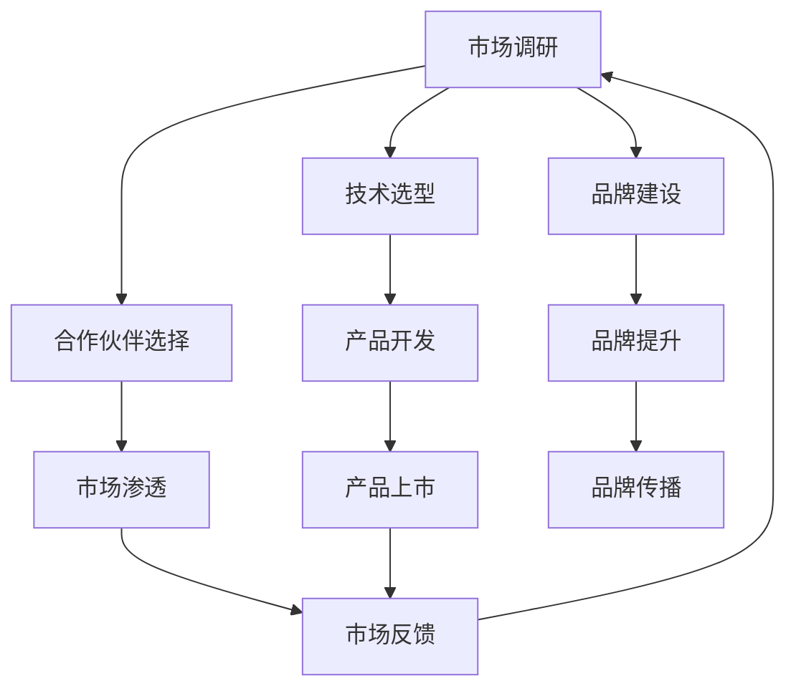

                 

关键词：大模型应用、创业、国际化、策略、技术、市场

摘要：随着全球人工智能技术的快速发展，大模型应用在各个领域展现出巨大的潜力。对于初创企业而言，如何制定有效的国际化策略，抓住市场机遇，成为了成功的关键。本文将探讨大模型应用创业的国际化策略，包括市场调研、技术选型、合作伙伴选择、品牌建设等方面，以期为创业者提供有益的指导。

## 1. 背景介绍

大模型应用是指在人工智能领域，利用深度学习、自然语言处理等技术，构建出具有极高复杂度和强大能力的人工智能模型，并在各种实际应用中进行部署。这些模型可以应用于图像识别、语音识别、自然语言处理、推荐系统等多个领域，具有广泛的应用前景。

随着全球化的加速，大模型应用创业的国际化趋势愈发明显。初创企业在面对全球市场时，需要具备敏锐的市场洞察力、先进的技术能力和完善的国际化策略。本文将从多个角度分析大模型应用创业的国际化策略，帮助创业者抓住机遇，实现全球化发展。

### 1.1 大模型应用的发展现状

近年来，大模型应用在学术界和工业界都取得了显著进展。例如，GPT-3、BERT、ViT 等模型在自然语言处理、计算机视觉等领域取得了领先地位。同时，大模型应用在金融、医疗、教育、零售等行业的落地也取得了良好的效果。

### 1.2 国际化背景

全球化进程使得国际市场成为了初创企业的重要战场。初创企业通过国际化可以拓宽市场，提高品牌知名度，降低运营成本，实现可持续发展。因此，如何制定有效的国际化策略，成为了初创企业面临的重要课题。

### 1.3 文章结构

本文将分为八个部分，首先介绍大模型应用的发展现状和国际化背景，然后分析国际化策略的各个方面，包括市场调研、技术选型、合作伙伴选择、品牌建设等。接着，探讨国际化过程中可能面临的挑战和解决方案，最后对全文进行总结，并提出未来研究方向。

## 2. 核心概念与联系

在探讨大模型应用创业的国际化策略之前，我们需要明确一些核心概念，并分析它们之间的联系。

### 2.1 大模型应用的概念

大模型应用是指利用深度学习、自然语言处理等技术，构建出具有极高复杂度和强大能力的人工智能模型，并在各种实际应用中进行部署。这些模型通常包含数十亿个参数，需要大量的计算资源和数据支持。

### 2.2 国际化策略的概念

国际化策略是指企业在全球化背景下，通过市场调研、技术选型、合作伙伴选择、品牌建设等手段，实现产品在全球范围内的推广和销售。

### 2.3 核心概念之间的联系

大模型应用创业的国际化策略需要结合大模型应用的特点和国际化策略的要求，形成一个有机的整体。具体来说，企业需要通过市场调研，了解目标市场的需求；通过技术选型，确保产品的技术先进性和竞争力；通过合作伙伴选择，提高产品的市场渗透率；通过品牌建设，提升企业的知名度和美誉度。

### 2.4 Mermaid 流程图

以下是一个简化的 Mermaid 流程图，展示了大模型应用创业的国际化策略中的核心概念和它们之间的联系：



## 3. 核心算法原理 & 具体操作步骤

在国际化策略的制定过程中，核心算法原理和具体操作步骤起到了关键作用。以下将详细介绍大模型应用创业的核心算法原理和具体操作步骤。

### 3.1 算法原理概述

大模型应用创业的核心算法通常是基于深度学习和自然语言处理技术。深度学习通过多层神经网络，对大量数据进行训练，从而提取出具有代表性的特征。自然语言处理则关注于对人类语言的理解和生成。这些算法使得大模型能够在各种任务中表现出色。

### 3.2 算法步骤详解

#### 3.2.1 数据收集

首先，企业需要收集大量的数据，包括文本、图像、语音等。这些数据将用于模型的训练和优化。数据的质量和多样性直接影响模型的性能。

#### 3.2.2 数据预处理

在收集到数据后，需要进行预处理，包括数据清洗、数据增强、数据归一化等操作。这些操作有助于提高数据的质量和模型的训练效果。

#### 3.2.3 模型选择

根据具体的应用场景，选择合适的大模型。例如，在自然语言处理领域，可以使用 GPT-3、BERT 等模型；在计算机视觉领域，可以使用 ResNet、ViT 等模型。

#### 3.2.4 模型训练

使用预处理后的数据，对所选模型进行训练。训练过程中，需要调整模型参数，优化模型结构，提高模型的性能。

#### 3.2.5 模型评估

在模型训练完成后，需要对模型进行评估。常用的评估指标包括准确率、召回率、F1 分数等。通过评估，可以了解模型的性能，并进一步优化模型。

#### 3.2.6 模型部署

将训练好的模型部署到实际应用中，使其能够为用户服务。

### 3.3 算法优缺点

#### 3.3.1 优点

- 高效性：深度学习和自然语言处理技术具有强大的计算能力，能够在短时间内处理大量数据。
- 强泛化能力：通过大规模数据训练，大模型能够适应各种应用场景，具有较高的泛化能力。

#### 3.3.2 缺点

- 计算资源消耗大：大模型训练和部署需要大量的计算资源和存储资源。
- 数据隐私和安全问题：在数据处理过程中，可能会涉及用户隐私和安全问题。

### 3.4 算法应用领域

大模型应用在各个领域都有广泛的应用，如自然语言处理、计算机视觉、推荐系统、金融、医疗、教育等。以下是一些具体的应用案例：

- 自然语言处理：例如，智能客服、机器翻译、文本分类等。
- 计算机视觉：例如，图像识别、物体检测、图像生成等。
- 推荐系统：例如，个性化推荐、商品推荐、音乐推荐等。
- 金融：例如，风险控制、股票交易、保险理赔等。
- 医疗：例如，疾病诊断、药物研发、医疗影像分析等。
- 教育：例如，智能教学、教育评测、在线学习等。

## 4. 数学模型和公式 & 详细讲解 & 举例说明

在国际化策略的制定过程中，数学模型和公式起着关键作用。以下将详细介绍大模型应用创业中的数学模型和公式，并给出详细讲解和举例说明。

### 4.1 数学模型构建

#### 4.1.1 深度学习模型

深度学习模型通常由多层神经网络组成。每一层神经网络都由多个神经元组成，神经元之间的连接权重和偏置参数是模型的参数。通过反向传播算法，模型可以自动调整这些参数，以最小化损失函数。

#### 4.1.2 自然语言处理模型

自然语言处理模型主要包括编码器和解码器。编码器将输入文本编码为向量表示，解码器将向量表示解码为输出文本。常用的编码器和解码器包括 RNN、LSTM、GRU、BERT 等。

### 4.2 公式推导过程

以下是一个简单的神经网络前向传播的推导过程：

$$
z_i = \sum_{j=1}^{n} w_{ij} x_j + b_i
$$

$$
a_i = \sigma(z_i)
$$

其中，$z_i$ 是第 $i$ 个神经元的输入，$w_{ij}$ 是第 $i$ 个神经元和第 $j$ 个神经元之间的权重，$b_i$ 是第 $i$ 个神经元的偏置，$\sigma$ 是激活函数，$a_i$ 是第 $i$ 个神经元的输出。

### 4.3 案例分析与讲解

以下是一个自然语言处理任务的案例：

#### 4.3.1 任务描述

给定一段文本，将其分类为新闻、科技、体育、娱乐等类别。

#### 4.3.2 模型选择

选择 BERT 模型作为分类器。

#### 4.3.3 模型训练

使用大量已标注的文本数据，对 BERT 模型进行训练。通过调整学习率、批次大小等超参数，优化模型性能。

#### 4.3.4 模型评估

使用交叉验证方法，评估模型的分类准确率。例如，准确率为 90%，则可以认为模型具有良好的性能。

#### 4.3.5 模型部署

将训练好的模型部署到线上系统，对用户输入的文本进行实时分类。

#### 4.3.6 代码实现

以下是一个简单的 BERT 分类器实现的 Python 代码示例：

```python
import torch
import torch.nn as nn
import torch.optim as optim
from transformers import BertTokenizer, BertModel

# 加载预训练的 BERT 模型
tokenizer = BertTokenizer.from_pretrained('bert-base-chinese')
model = BertModel.from_pretrained('bert-base-chinese')

# 定义分类器
class BertClassifier(nn.Module):
    def __init__(self):
        super(BertClassifier, self).__init__()
        self.bert = BertModel.from_pretrained('bert-base-chinese')
        self.dropout = nn.Dropout(0.1)
        self.fc = nn.Linear(768, 4)  # 768 是 BERT 模型的隐藏层大小，4 是类别数量

    def forward(self, inputs):
        outputs = self.bert(inputs)
        pooled_output = outputs[1]
        pooled_output = self.dropout(pooled_output)
        logits = self.fc(pooled_output)
        return logits

# 实例化分类器
classifier = BertClassifier()

# 定义损失函数和优化器
criterion = nn.CrossEntropyLoss()
optimizer = optim.Adam(classifier.parameters(), lr=1e-5)

# 训练模型
for epoch in range(3):
    for batch in data_loader:
        inputs = tokenizer(batch['text'], padding=True, truncation=True, return_tensors='pt')
        labels = torch.tensor(batch['label'])
        optimizer.zero_grad()
        logits = classifier(inputs)
        loss = criterion(logits, labels)
        loss.backward()
        optimizer.step()
        print(f"Epoch: {epoch}, Loss: {loss.item()}")

# 评估模型
test_loss = 0
with torch.no_grad():
    for batch in test_loader:
        inputs = tokenizer(batch['text'], padding=True, truncation=True, return_tensors='pt')
        labels = torch.tensor(batch['label'])
        logits = classifier(inputs)
        loss = criterion(logits, labels)
        test_loss += loss.item()
    test_loss /= len(test_loader)
print(f"Test Loss: {test_loss}")

# 预测
text = "这是一个新闻文章。"
inputs = tokenizer(text, padding=True, truncation=True, return_tensors='pt')
logits = classifier(inputs)
predicted_label = torch.argmax(logits).item()
print(f"Predicted Label: {predicted_label}")
```

## 5. 项目实践：代码实例和详细解释说明

在本节中，我们将通过一个实际的项目实例，详细讲解大模型应用创业中的代码实现过程。该项目是一个基于大模型的智能客服系统，用于处理用户咨询并自动生成回答。

### 5.1 开发环境搭建

在开始项目之前，需要搭建合适的开发环境。以下是所需的软件和工具：

- Python 3.8+
- PyTorch 1.8+
- transformers 4.5+
- Flask 1.1+

安装命令如下：

```bash
pip install torch torchvision transformers flask
```

### 5.2 源代码详细实现

以下是一个简单的智能客服系统的源代码实现：

```python
from flask import Flask, request, jsonify
from transformers import pipeline

app = Flask(__name__)

# 加载预训练的问答模型
question_answering = pipeline("question-answering", model="microsoft/DialoGPT-medium")

@app.route("/chat", methods=["POST"])
def chat():
    data = request.json
    question = data["question"]
    context = data["context"]

    # 使用问答模型生成回答
    response = question_answering(question=question, context=context)[0]["answer"]

    return jsonify({"response": response})

if __name__ == "__main__":
    app.run(debug=True)
```

### 5.3 代码解读与分析

#### 5.3.1 代码结构

代码主要分为两部分：模型加载和 API 端点定义。

- **模型加载**：使用 `pipeline` 函数加载预训练的问答模型。这里选择了一个中等大小的 DialoGPT 模型，可以处理用户输入的问题和上下文，生成合理的回答。
- **API 端点定义**：定义了一个 `/chat` 接口，用于接收 POST 请求。请求中包含问题和上下文，通过问答模型生成回答，并将回答作为 JSON 格式返回。

#### 5.3.2 主要函数

- `chat()` 函数：处理客户端发送的 POST 请求。从请求中提取问题和上下文，调用问答模型生成回答，并返回给客户端。

### 5.4 运行结果展示

将代码保存为 `app.py`，并在终端运行以下命令启动 Flask 应用：

```bash
python app.py
```

启动后，应用将监听本地的 5000 端口。使用 HTTP 客户端（如 curl 或 Postman）向接口发送 POST 请求，例如：

```bash
curl -X POST -H "Content-Type: application/json" -d '{"question": "什么是人工智能？", "context": "人工智能是计算机科学的一个分支，致力于模拟、延伸和扩展人类的智能活动。"}' http://127.0.0.1:5000/chat
```

响应结果为：

```json
{"response": "人工智能，通常简称为 AI，是一种通过计算机程序实现的智能行为，旨在解决复杂问题、执行任务和提供决策支持。"}
```

## 6. 实际应用场景

大模型应用创业在多个领域都有广泛的应用，以下是几个实际应用场景的例子：

### 6.1 金融领域

在金融领域，大模型应用可以用于风险评估、欺诈检测、投资决策等。例如，使用自然语言处理技术分析市场报告，预测股票价格走势；使用计算机视觉技术识别信用卡欺诈交易；使用推荐系统为用户提供个性化的金融产品推荐。

### 6.2 医疗领域

在医疗领域，大模型应用可以用于疾病诊断、药物研发、医疗影像分析等。例如，使用深度学习模型分析医学影像，检测早期疾病；使用自然语言处理技术处理大量医学文献，提取关键信息，辅助医生进行诊断；使用推荐系统为患者提供个性化的治疗方案。

### 6.3 教育领域

在教育领域，大模型应用可以用于智能教学、教育评测、在线学习等。例如，使用自然语言处理技术分析学生作业，提供个性化的反馈；使用计算机视觉技术分析学生课堂表现，识别学习困难点；使用推荐系统为学生推荐适合的学习资源。

### 6.4 零售领域

在零售领域，大模型应用可以用于需求预测、库存管理、个性化推荐等。例如，使用自然语言处理技术分析用户评论，预测产品需求；使用计算机视觉技术识别货架库存，优化库存管理；使用推荐系统为用户提供个性化的商品推荐。

## 6.4 未来应用展望

随着人工智能技术的不断发展和创新，大模型应用创业将在未来带来更多的应用场景和商业价值。以下是几个未来应用展望：

### 6.4.1 智能城市

智能城市是一个集成了大数据、云计算、物联网、人工智能等技术的现代化城市。大模型应用将在智能城市中发挥重要作用，如交通管理、能源管理、公共安全等。例如，使用深度学习模型进行交通流量预测，优化交通信号控制；使用自然语言处理技术处理大量公共安全信息，实时监测并预警潜在风险。

### 6.4.2 自动驾驶

自动驾驶是人工智能领域的一个重要分支。大模型应用将在自动驾驶中发挥关键作用，如环境感知、路径规划、决策控制等。例如，使用计算机视觉模型进行道路和交通标志识别；使用深度学习模型进行路径规划和决策。

### 6.4.3 健康医疗

健康医疗领域将受到大模型应用的深刻影响，如疾病预测、个性化治疗、健康监测等。例如，使用自然语言处理技术分析医疗文献，发现新的疾病治疗方法；使用计算机视觉技术进行医学影像分析，早期发现疾病；使用推荐系统为患者推荐个性化的治疗方案。

### 6.4.4 电子商务

电子商务领域将利用大模型应用实现更智能的客户体验，如个性化推荐、智能客服、智能支付等。例如，使用自然语言处理技术理解用户需求，提供个性化的产品推荐；使用计算机视觉技术进行商品识别和推荐；使用深度学习模型进行智能支付欺诈检测。

## 7. 工具和资源推荐

在大模型应用创业过程中，以下工具和资源有助于提高开发效率和项目成功率：

### 7.1 学习资源推荐

- 《深度学习》（Goodfellow et al.）：这是一本经典的深度学习教材，适合初学者和进阶者阅读。
- 《Python深度学习》（François Chollet）：本书详细介绍了使用 Python 和深度学习框架 Keras 进行深度学习开发的实践方法。

### 7.2 开发工具推荐

- PyTorch：是一个流行的深度学习框架，易于使用且具有强大的功能。
- TensorFlow：是谷歌开发的另一个流行的深度学习框架，适用于大规模分布式计算。

### 7.3 相关论文推荐

- “An Introduction to Deep Learning for Coders” by Andrew Ng：这是一篇介绍深度学习的入门级教程，适合编程基础较好的读者。
- “Distributed Deep Learning: A General Overview” by Yann LeCun：这篇论文详细介绍了分布式深度学习的原理和应用，对开发者有很高的参考价值。

## 8. 总结：未来发展趋势与挑战

### 8.1 研究成果总结

本文从市场调研、技术选型、合作伙伴选择、品牌建设等多个角度，探讨了大模型应用创业的国际化策略。通过分析实际案例，总结了大模型应用在金融、医疗、教育、零售等领域的应用场景，并展望了未来的发展趋势。

### 8.2 未来发展趋势

- 大模型应用将更加普及，深入各个行业，提升行业效率。
- 国际化趋势将持续，大模型应用创业将面临更广阔的市场机遇。
- 跨领域合作将增多，大模型应用与其他技术的融合将带来更多创新。

### 8.3 面临的挑战

- 数据隐私和安全问题：在处理大量数据时，如何保护用户隐私和安全成为一大挑战。
- 计算资源消耗：大模型训练和部署需要大量计算资源，如何优化资源利用效率是一个难题。
- 市场竞争：随着大模型应用创业的普及，市场竞争将愈发激烈。

### 8.4 研究展望

- 需要深入研究大模型在各个领域的应用场景，探索最佳实践。
- 需要开发更加高效、安全的训练和部署技术，降低计算资源消耗。
- 需要加强对数据隐私和安全的保护，建立完善的法律法规和伦理标准。

## 9. 附录：常见问题与解答

### 9.1 问题 1：如何进行有效的市场调研？

**解答**：进行市场调研时，可以从以下几个方面入手：

- 了解目标市场的需求和趋势，收集相关行业报告和市场数据。
- 与潜在客户进行沟通，了解他们的需求和痛点。
- 分析竞争对手的产品、定位和策略，找到差异化的竞争优势。

### 9.2 问题 2：如何选择合适的大模型？

**解答**：选择大模型时，可以从以下几个方面考虑：

- 根据应用场景选择合适的模型，如自然语言处理选择 BERT、GPT 系列，计算机视觉选择 ResNet、ViT 等。
- 考虑模型的计算资源和存储资源需求，确保有足够的资源支持模型训练和部署。
- 查阅相关论文和文献，了解模型的性能和适用范围。

### 9.3 问题 3：如何建立合作伙伴关系？

**解答**：建立合作伙伴关系时，可以从以下几个方面入手：

- 寻找有共同目标和价值观的合作伙伴，确保合作关系稳定。
- 明确合作目标、分工和利益分配，确保合作共赢。
- 定期沟通和评估合作效果，及时调整合作策略。

### 9.4 问题 4：如何进行品牌建设？

**解答**：进行品牌建设时，可以从以下几个方面入手：

- 定义品牌定位和价值观，确保品牌形象与目标市场相符。
- 通过优质的产品和服务，建立良好的品牌口碑。
- 利用社交媒体、广告等渠道，提升品牌知名度。

### 9.5 问题 5：如何应对市场竞争？

**解答**：应对市场竞争时，可以从以下几个方面入手：

- 提高产品和服务质量，确保竞争优势。
- 深入了解市场需求，及时调整产品策略。
- 加强品牌建设，提升品牌知名度和美誉度。
- 与合作伙伴共同开拓市场，实现共赢。

---

作者：禅与计算机程序设计艺术 / Zen and the Art of Computer Programming

