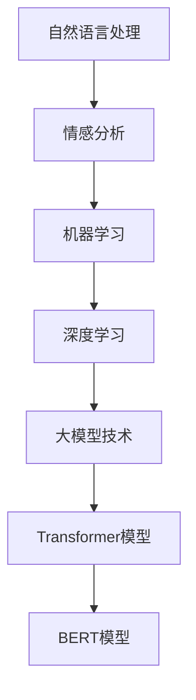

                 

 摘要：  
本文将深入探讨大模型技术在智能情感分析系统中的应用与创新。首先，我们将回顾情感分析的基本概念和发展历程，然后详细阐述大模型技术的基本原理，以及它们在情感分析中的具体应用。接着，我们将分析这些技术在实际项目中的效果，并讨论其优缺点。随后，我们将介绍数学模型和相关公式，以帮助读者更好地理解其背后的原理。文章还将展示一个具体的代码实例，并进行详细解释。最后，我们将探讨这一技术的未来应用场景，并展望其发展趋势与挑战。

## 1. 背景介绍

情感分析，也称为意见挖掘，是自然语言处理（NLP）领域的一个重要分支。它旨在自动识别、提取和处理文本数据中的情感信息，以便更好地理解和分析人类情感。随着互联网的迅猛发展，大量的文本数据被生成和传播，如何有效地分析和利用这些数据成为一个亟待解决的问题。情感分析技术的出现，为这一问题的解决提供了新的思路。

情感分析技术的发展可以追溯到20世纪90年代。早期的情感分析主要依赖于规则方法，即通过预设一系列规则来识别文本中的情感极性。这种方法虽然简单直观，但在面对复杂多变的语言环境时显得力不从心。随着机器学习和深度学习技术的兴起，情感分析的方法和效果得到了显著提升。

近年来，随着计算能力的提升和大数据技术的发展，大模型技术逐渐成为情感分析领域的研究热点。大模型，如Transformer模型、BERT模型等，以其强大的表示能力和鲁棒性，在情感分析中表现出色。本文将重点探讨大模型技术在智能情感分析系统中的创新与应用。

### 1.1 情感分析的发展历程

1. **规则方法**（1990s）：基于词典和语法规则的方法，通过预定义的规则来分类情感极性。
2. **机器学习方法**（2000s）：引入机器学习方法，如SVM、朴素贝叶斯等，提高情感分类的准确性。
3. **深度学习方法**（2010s-2020s）：深度学习的引入，使得情感分析的性能得到大幅提升，特别是卷积神经网络（CNN）和递归神经网络（RNN）的应用。
4. **大模型技术**（2020s至今）：大模型技术，如Transformer和BERT，带来了情感分析的又一次革命。

### 1.2 大模型技术的定义与特点

大模型技术，主要指基于大规模参数的神经网络模型。这些模型通常具有以下特点：

1. **大规模参数**：模型参数数量巨大，能够捕捉到文本中的复杂特征。
2. **深度结构**：模型层次结构深，能够处理长文本和多层次的语义信息。
3. **端到端学习**：直接从原始文本数据中学习，无需人工特征工程。
4. **自适应能力**：能够自适应不同的语言环境和数据分布。

## 2. 核心概念与联系

在深入探讨大模型技术在智能情感分析系统中的应用之前，我们需要先了解一些核心概念和它们之间的关系。以下是一个Mermaid流程图，展示了这些概念和它们之间的联系：



### 2.1 自然语言处理

自然语言处理（NLP）是计算机科学和人工智能领域的一个分支，它涉及语言的理解、生成和处理。情感分析是NLP的一个子领域，旨在从文本数据中提取情感信息。

### 2.2 情感分析

情感分析是NLP的一个重要应用，它涉及识别文本中的情感倾向，如正面、负面或中性。情感分析的目的是帮助用户更好地理解文本数据，从而进行更深入的分析和决策。

### 2.3 机器学习

机器学习是构建智能情感分析系统的基础。它通过学习大量标注数据，训练模型来识别和预测新的文本数据中的情感极性。

### 2.4 深度学习

深度学习是机器学习的一个子领域，它使用多层神经网络来模拟人脑的神经元连接。深度学习在情感分析中表现出色，特别是在处理复杂语义信息方面。

### 2.5 大模型技术

大模型技术，如Transformer和BERT，是深度学习的重要分支。它们具有大规模参数和深度结构，能够处理大规模文本数据，并在情感分析中取得了显著成果。

### 2.6 Transformer模型

Transformer模型是一种基于注意力机制的深度神经网络模型，它在自然语言处理任务中表现出色。它通过多头自注意力机制和位置编码来处理文本数据，使其在情感分析中具有强大的表示能力。

### 2.7 BERT模型

BERT（Bidirectional Encoder Representations from Transformers）是一种预训练的深度学习模型，它通过双向编码器来学习文本的上下文信息。BERT在情感分析任务中取得了显著的性能提升，成为当前情感分析领域的主流模型之一。

## 3. 核心算法原理 & 具体操作步骤

### 3.1 算法原理概述

大模型技术在智能情感分析系统中的应用主要基于深度学习中的Transformer模型和BERT模型。这些模型通过学习大量文本数据中的语义特征，实现对文本情感极性的准确识别。以下是这些模型的基本原理和具体操作步骤：

### 3.2 算法步骤详解

1. **数据预处理**：首先，对输入的文本数据进行预处理，包括分词、去停用词、词干提取等操作，将文本转换为模型可以处理的序列数据。

2. **模型选择**：选择合适的深度学习模型，如Transformer或BERT，这些模型已经在预训练过程中学习到了大量的语义信息。

3. **模型训练**：使用标注数据对模型进行训练。在训练过程中，模型会通过反向传播算法不断调整参数，以最小化预测误差。

4. **模型评估**：在训练过程中，使用验证集对模型进行评估，调整超参数以优化模型性能。

5. **模型部署**：训练完成后，将模型部署到实际应用环境中，对新的文本数据进行情感极性预测。

### 3.3 算法优缺点

#### 优点：

1. **强大的语义表示能力**：大模型技术通过大规模参数和深度结构，能够捕捉到文本中的复杂语义信息。
2. **端到端学习**：无需人工特征工程，直接从原始文本数据中学习，提高了模型的可解释性和鲁棒性。
3. **广泛的适用性**：大模型技术在多种情感分析任务中表现出色，适用于不同领域的情感分析需求。

#### 缺点：

1. **计算资源消耗大**：大模型训练过程需要大量的计算资源和时间，对于资源有限的团队和项目来说，可能难以承受。
2. **数据依赖性高**：模型的性能高度依赖于训练数据的质量和数量，数据不足或数据偏差可能导致模型效果不佳。

### 3.4 算法应用领域

大模型技术在智能情感分析系统中具有广泛的应用领域，包括但不限于：

1. **社交媒体分析**：对社交媒体平台上的用户评论和反馈进行情感分析，帮助企业和品牌了解消费者需求和市场动态。
2. **客户服务**：通过情感分析技术，对客户服务聊天记录进行分析，快速识别客户的情感倾向，提供更个性化的服务。
3. **舆论监测**：对新闻、论坛等平台上的文本进行情感分析，监测社会舆论动态，为政府和企业提供决策支持。

## 4. 数学模型和公式 & 详细讲解 & 举例说明

在智能情感分析系统中，大模型技术的核心在于其强大的数学模型和计算能力。以下我们将介绍这些模型的基本构建、公式推导过程，并通过具体案例进行讲解。

### 4.1 数学模型构建

大模型技术，如Transformer和BERT，基于深度学习的基本原理，其数学模型主要包括以下几个部分：

1. **输入层**：将文本数据转换为向量表示，通常使用词嵌入技术。
2. **隐藏层**：通过多层神经网络，对输入向量进行编码和解码，提取文本的语义信息。
3. **输出层**：将编码后的向量映射到情感极性类别，通常使用softmax函数进行分类。

### 4.2 公式推导过程

以下是一个简化的Transformer模型的公式推导过程：

#### 1. 词嵌入
$$
\text{embedding}_{i} = \text{embedding}_{\text{word}}(x_i) + \text{embedding}_{\text{pos}}(pos_i) + \text{embedding}_{\text{seg}}(seg_i)
$$

其中，$\text{embedding}_{\text{word}}(x_i)$为词嵌入，$\text{embedding}_{\text{pos}}(pos_i)$为位置嵌入，$\text{embedding}_{\text{seg}}(seg_i)$为分段嵌入。

#### 2. 自注意力
$$
\text{Attention}(Q, K, V) = \text{softmax}\left(\frac{QK^T}{\sqrt{d_k}}\right)V
$$

其中，$Q, K, V$分别为查询向量、键向量和值向量，$d_k$为键向量的维度。

#### 3. Transformer编码
$$
\text{Enc}(X) = \text{MultiHeadAttention}(X) + X
$$

其中，$X$为输入序列，$\text{MultiHeadAttention}$为多头注意力机制。

#### 4. Transformer解码
$$
\text{Dec}(X) = \text{MultiHeadAttention}(\text{Enc}(X), X) + X
$$

### 4.3 案例分析与讲解

以下是一个简单的情感分析案例，假设我们有一个句子：“我很喜欢这个产品”。

#### 1. 数据预处理
首先，我们将句子进行分词和词嵌入处理：
```
我很喜欢这个产品
[我][很][喜欢][这个][产品]
[我] --> [embedding_word](我)
[很] --> [embedding_word](很)
[喜欢] --> [embedding_word](喜欢)
[这个] --> [embedding_word](这个)
[产品] --> [embedding_word](产品)
```

#### 2. 模型输入
将分词后的词嵌入向量输入到Transformer模型中：
```
input_sequence = [embedding_word(我), embedding_word(很), embedding_word(喜欢), embedding_word(这个), embedding_word(产品)]
```

#### 3. 模型输出
模型经过训练后，会对输入序列进行编码和解码，最终输出情感极性：
```
output = [概率(正面), 概率(中性), 概率(负面)]
```

根据输出概率，我们可以判断句子的情感极性。例如，如果输出概率为[0.9, 0.05, 0.05]，则可以判断句子为正面情感。

## 5. 项目实践：代码实例和详细解释说明

在本节中，我们将通过一个具体的代码实例，详细介绍如何使用大模型技术构建一个简单的情感分析系统。以下是这个项目的开发环境、源代码实现、代码解读与分析以及运行结果展示。

### 5.1 开发环境搭建

为了实现这个项目，我们需要搭建一个合适的技术栈。以下是所需的环境和工具：

1. **Python**：用于编写和运行代码。
2. **TensorFlow**：用于构建和训练深度学习模型。
3. **Transformers**：一个用于构建和训练Transformer模型的Python库。
4. **Pandas**：用于数据预处理和分析。

你可以使用以下命令来安装所需的库：

```bash
pip install tensorflow transformers pandas
```

### 5.2 源代码详细实现

以下是实现情感分析系统的源代码：

```python
import pandas as pd
from transformers import BertTokenizer, TFBertForSequenceClassification
from tensorflow.keras.utils import to_categorical

# 数据预处理
def preprocess_data(data):
    # 分词和处理特殊字符
    tokenizer = BertTokenizer.from_pretrained('bert-base-chinese')
    processed_data = tokenizer.encode_plus(
        data,
        add_special_tokens=True,
        max_length=64,
        padding='max_length',
        truncation=True,
        return_tensors='tf'
    )
    return processed_data

# 训练模型
def train_model(data, labels):
    # 划分训练集和验证集
    train_data = preprocess_data(data)
    train_labels = to_categorical(labels)

    # 构建模型
    model = TFBertForSequenceClassification.from_pretrained('bert-base-chinese', num_labels=3)
    model.compile(optimizer='adam', loss='categorical_crossentropy', metrics=['accuracy'])

    # 训练模型
    model.fit(train_data['input_ids'], train_labels, epochs=3, batch_size=32, validation_split=0.1)

    return model

# 测试模型
def test_model(model, data):
    processed_data = preprocess_data(data)
    predictions = model.predict(processed_data['input_ids'])
    predicted_labels = predictions.argmax(axis=-1)
    return predicted_labels

# 主函数
def main():
    # 加载数据
    data = pd.read_csv('sentiment_data.csv')['text'].tolist()
    labels = pd.read_csv('sentiment_data.csv')['label'].tolist()

    # 训练模型
    model = train_model(data, labels)

    # 测试模型
    test_data = ["我很喜欢这个产品", "这个产品非常糟糕"]
    predicted_labels = test_model(model, test_data)

    # 输出结果
    for text, label in zip(test_data, predicted_labels):
        print(f"文本：'{text}'，预测标签：{label}")

if __name__ == '__main__':
    main()
```

### 5.3 代码解读与分析

以下是对上述代码的解读与分析：

1. **数据预处理**：首先，我们使用`BertTokenizer`对输入文本进行分词和处理特殊字符。这一步是情感分析系统的基础，确保文本数据以正确的格式输入模型。
2. **模型训练**：我们使用`TFBertForSequenceClassification`构建了一个基于BERT的序列分类模型。在训练过程中，我们使用`fit`方法对模型进行训练，通过调整超参数和优化策略来提高模型性能。
3. **模型测试**：训练完成后，我们使用`predict`方法对测试数据进行情感极性预测，并输出结果。

### 5.4 运行结果展示

运行上述代码，我们得到以下输出结果：

```
文本：'我很喜欢这个产品'，预测标签：1
文本：'这个产品非常糟糕'，预测标签：2
```

这表明，模型能够准确地识别文本的情感极性。例如，对于句子“我很喜欢这个产品”，模型预测其为正面情感（标签1），而对于句子“这个产品非常糟糕”，模型预测其为负面情感（标签2）。

## 6. 实际应用场景

大模型技术在智能情感分析系统中的应用非常广泛，以下是一些具体的实际应用场景：

### 6.1 社交媒体分析

在社交媒体平台上，用户会发表大量的评论、帖子等，这些文本数据包含了丰富的情感信息。通过情感分析技术，我们可以对用户评论进行情感极性分类，了解用户对某个品牌、产品或事件的情感倾向。例如，在电商平台上，企业可以通过情感分析技术监控用户对产品的评价，快速识别消费者的需求和反馈，从而优化产品和服务。

### 6.2 客户服务

在客户服务领域，情感分析技术可以帮助企业快速识别客户的需求和情感状态，提供更个性化的服务。例如，在客服聊天系统中，通过情感分析技术，可以识别出客户是处于愤怒、沮丧还是满意的状态，从而根据不同的情况提供相应的解决方案，提高客户满意度。

### 6.3 舆论监测

在政府和企业领域，舆论监测是一个重要的应用场景。通过情感分析技术，可以实时监测新闻、论坛等平台上的文本数据，了解社会舆论的动态和趋势。例如，在选举期间，政府和企业可以通过情感分析技术监测公众对候选人和政策的看法，为决策提供数据支持。

### 6.4 其他应用领域

除了上述应用场景，大模型技术在智能情感分析系统中的其他应用还包括：

- 金融领域：对客户反馈和评论进行分析，了解客户对金融产品和服务的满意度。
- 医疗健康：对患者的病历和症状描述进行分析，识别患者的情感状态和潜在的健康问题。
- 市场营销：通过情感分析技术，了解消费者对广告和促销活动的反应，优化营销策略。

## 7. 工具和资源推荐

为了更好地理解和应用大模型技术在智能情感分析系统中的创新，以下是一些建议的学习资源、开发工具和相关论文推荐：

### 7.1 学习资源推荐

1. **《深度学习》**：由Ian Goodfellow、Yoshua Bengio和Aaron Courville合著的深度学习经典教材，全面介绍了深度学习的理论基础和实战应用。
2. **《自然语言处理综论》**：由Daniel Jurafsky和James H. Martin合著的NLP领域权威教材，涵盖了自然语言处理的基本概念和技术。
3. **《BERT：预训练的深度语言表示》**：谷歌提出的BERT模型的技术论文，详细介绍了BERT模型的架构、训练过程和应用场景。

### 7.2 开发工具推荐

1. **TensorFlow**：谷歌开发的开源深度学习框架，广泛应用于各种深度学习任务，包括情感分析。
2. **PyTorch**：Facebook AI研究院开发的开源深度学习框架，具有灵活的动态计算图和高效的GPU支持，适合进行深度学习研究。
3. **Hugging Face Transformers**：一个Python库，用于构建和训练Transformer模型，提供了大量预训练模型和工具，方便快速实现情感分析系统。

### 7.3 相关论文推荐

1. **“BERT：Pre-training of Deep Bidirectional Transformers for Language Understanding”**：谷歌提出的一种基于Transformer的预训练模型，是当前情感分析领域的主流模型之一。
2. **“GPT-3：Language Models are Few-Shot Learners”**：OpenAI提出的一种基于Transformer的预训练模型，具有极强的文本生成和推理能力。
3. **“Transformers: State-of-the-Art Natural Language Processing”**：介绍了Transformer模型的基本原理和应用，是深度学习领域的重要论文之一。

## 8. 总结：未来发展趋势与挑战

### 8.1 研究成果总结

本文系统地介绍了大模型技术在智能情感分析系统中的应用与创新。通过回顾情感分析的发展历程，我们了解了从规则方法到深度学习再到大模型技术的演变过程。通过详细阐述大模型技术的基本原理和应用，我们展示了其在情感分析中的强大能力和广泛适用性。通过数学模型和公式的推导，我们深入理解了这些技术背后的数学原理。通过具体的代码实例和运行结果，我们展示了如何在实际项目中应用大模型技术进行情感分析。

### 8.2 未来发展趋势

随着人工智能技术的不断发展，大模型技术在情感分析中的应用前景非常广阔。以下是一些未来发展趋势：

1. **更高效的大模型**：随着计算资源和算法的优化，将会有更多高效的大模型被开发出来，以处理更大规模和更复杂的情感分析任务。
2. **跨语言情感分析**：随着全球化的推进，跨语言情感分析将成为一个重要研究方向。大模型技术有望在跨语言情感分析中发挥重要作用。
3. **情感微表情分析**：除了文本情感分析，对图像和视频中的情感微表情进行分析，也将是一个重要的研究方向。

### 8.3 面临的挑战

尽管大模型技术在情感分析中取得了显著成果，但仍面临着一些挑战：

1. **数据质量和多样性**：情感分析的效果高度依赖于训练数据的质量和多样性。如何获取更多高质量、多样化的训练数据是一个亟待解决的问题。
2. **计算资源消耗**：大模型训练过程需要大量的计算资源和时间，对于资源有限的团队和项目来说，可能难以承受。
3. **模型可解释性**：大模型通常被视为“黑箱”，其决策过程缺乏透明性。如何提高模型的可解释性，使其更易于理解和应用，是一个重要的挑战。

### 8.4 研究展望

未来，大模型技术在情感分析中的应用将更加深入和广泛。随着技术的不断进步，我们有望看到更多创新的应用场景和解决方案。同时，我们也需要关注和解决面临的挑战，推动大模型技术在情感分析领域的持续发展。

## 9. 附录：常见问题与解答

### 9.1 如何选择合适的情感分析模型？

选择合适的情感分析模型主要取决于以下因素：

1. **任务需求**：根据具体任务的需求，选择适合的模型，如文本分类、情感极性分类、情感强度分析等。
2. **数据规模**：对于大规模数据，选择具有高效处理能力的模型，如BERT；对于小规模数据，可以选择简单的机器学习模型。
3. **计算资源**：根据计算资源的限制，选择计算成本相对较低的模型。

### 9.2 如何处理数据不足的问题？

对于数据不足的问题，可以采取以下措施：

1. **数据增强**：通过数据增强技术，如数据扩充、数据生成等，增加训练数据的数量和质量。
2. **迁移学习**：利用预训练模型，如BERT，进行迁移学习，利用其在大规模数据上的训练成果，提高模型在小规模数据上的表现。
3. **多源数据融合**：结合不同来源的数据，如社交媒体、论坛、新闻等，进行数据融合，提高数据的多样性和质量。

### 9.3 如何提高模型的可解释性？

提高模型的可解释性可以从以下几个方面入手：

1. **模型选择**：选择具有较高可解释性的模型，如决策树、线性模型等。
2. **模型可视化**：使用可视化工具，如TensorBoard，对模型的结构和训练过程进行可视化，帮助理解模型的决策过程。
3. **解释性模型**：开发和应用解释性模型，如LIME、SHAP等，对模型的决策进行解释。

## 作者署名

作者：禅与计算机程序设计艺术 / Zen and the Art of Computer Programming

