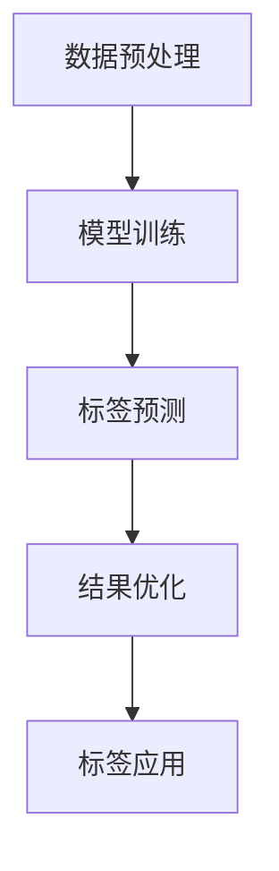

                 

关键词：大模型技术，电商平台，商品标签，生成，应用，算法，数学模型，项目实践，未来展望

## 摘要

本文深入探讨了基于大模型技术的电商平台商品标签生成应用。首先介绍了大模型技术的发展背景和基本概念，然后详细阐述了商品标签生成过程中的核心算法原理和数学模型，并通过具体项目实践展示了算法的实际应用效果。最后，文章分析了大模型技术在电商平台商品标签生成中的未来发展趋势和面临的挑战。

## 1. 背景介绍

随着互联网技术的飞速发展，电商平台已经成为人们日常生活中不可或缺的一部分。电商平台通过商品标签对商品进行分类和描述，有助于提升用户购物体验，提高商品转化率。传统的商品标签生成方法通常依赖于手工标注和规则匹配，存在效率低、准确性差等问题。随着深度学习和自然语言处理技术的发展，大模型技术逐渐成为电商平台商品标签生成的有力工具。

大模型技术，通常指基于大规模数据集训练的深度学习模型，具有强大的表示能力和泛化能力。在电商平台商品标签生成中，大模型能够自动学习商品和标签之间的关联关系，生成准确、丰富的商品标签，有助于提升电商平台的服务质量和用户体验。

## 2. 核心概念与联系

### 2.1 大模型技术概述

大模型技术起源于深度学习领域，其核心思想是通过多层神经网络对大规模数据集进行训练，从而实现数据的自动学习和特征提取。随着计算能力的提升和数据量的增加，大模型技术在自然语言处理、计算机视觉、语音识别等领域取得了显著的成果。

### 2.2 商品标签生成过程

商品标签生成是电商平台商品描述和分类的关键环节。一个完整的商品标签生成过程通常包括数据预处理、模型训练、标签预测和结果优化等步骤。

### 2.3 大模型与商品标签生成的联系

大模型技术在商品标签生成中的应用主要体现在以下几个方面：

1. **数据预处理**：大模型能够对大量商品描述和标签进行自动预处理，如分词、词向量化等，提高数据质量和处理效率。
2. **模型训练**：大模型通过学习商品描述和标签之间的关联关系，生成准确、丰富的商品标签。
3. **标签预测**：大模型能够根据新的商品描述快速生成标签，提高商品标签生成的实时性和准确性。
4. **结果优化**：大模型能够对标签生成结果进行自动优化，如去除冗余标签、增加缺失标签等，提升标签的准确性和完整性。

### 2.4 Mermaid 流程图

下面是商品标签生成过程中大模型技术的应用流程的Mermaid流程图：



## 3. 核心算法原理 & 具体操作步骤

### 3.1 算法原理概述

在商品标签生成中，大模型技术通常采用深度学习模型，如卷积神经网络（CNN）和循环神经网络（RNN）等。这些模型通过学习商品描述和标签之间的关联关系，实现自动标签生成。

### 3.2 算法步骤详解

1. **数据收集与预处理**：收集电商平台上的商品描述和标签数据，对数据集进行清洗、去重和格式化，提取商品描述的词向量表示。
2. **模型构建**：根据商品描述和标签的词向量表示，构建深度学习模型，如CNN或RNN等。模型的输入为商品描述的词向量序列，输出为标签的词向量序列。
3. **模型训练**：使用大量商品描述和标签数据对模型进行训练，优化模型参数，提高标签生成的准确性和实时性。
4. **标签预测**：使用训练好的模型对新的商品描述进行标签预测，输出商品标签。
5. **结果优化**：对标签预测结果进行优化，如去除冗余标签、增加缺失标签等，提升标签的准确性和完整性。

### 3.3 算法优缺点

**优点**：

1. **高准确性**：大模型技术能够自动学习商品和标签之间的关联关系，生成准确、丰富的商品标签。
2. **实时性**：大模型技术能够快速对新的商品描述进行标签预测，提高商品标签生成的实时性。
3. **灵活性**：大模型技术能够根据电商平台的需求和特点，调整和优化标签生成的策略。

**缺点**：

1. **计算资源需求大**：大模型技术需要大量的计算资源进行训练和预测，对硬件设备有较高要求。
2. **数据依赖性强**：大模型技术的效果高度依赖于数据质量，数据量不足或质量差可能导致模型性能下降。
3. **标签冗余问题**：大模型技术可能生成一些冗余标签，需要进一步优化和筛选。

### 3.4 算法应用领域

大模型技术在电商平台商品标签生成中具有广泛的应用领域，如：

1. **商品分类**：根据商品标签对商品进行分类，便于用户快速找到感兴趣的商品。
2. **商品推荐**：根据用户的历史购物行为和标签，推荐合适的商品。
3. **搜索优化**：根据商品标签优化搜索结果，提高搜索准确性。
4. **商品描述**：根据商品标签生成商品描述，提升商品的可读性和吸引力。

## 4. 数学模型和公式 & 详细讲解 & 举例说明

### 4.1 数学模型构建

在商品标签生成中，常用的数学模型为循环神经网络（RNN），特别是长短期记忆网络（LSTM）。LSTM模型能够有效解决RNN的梯度消失问题，提高模型的训练效果。

LSTM模型的基本结构包括输入门、遗忘门、输出门和记忆单元。假设商品描述和标签的词向量分别为 $x_t$ 和 $y_t$，其中 $t$ 表示时间步。LSTM模型的输入和输出为：

$$
h_t = \text{LSTM}(h_{t-1}, x_t)
$$

$$
y_t = \text{softmax}(W_y \cdot h_t + b_y)
$$

其中，$h_t$ 表示第 $t$ 个时间步的隐藏状态，$W_y$ 和 $b_y$ 分别为softmax层的权重和偏置。

### 4.2 公式推导过程

LSTM模型的推导过程涉及多个复杂的数学公式，这里简要介绍其主要推导步骤：

1. **输入门**：计算输入门状态 $\sigma_{it}$ 和候选状态 $\bar{c}_t$。

$$
\sigma_{it} = \sigma(W_i \cdot [h_{t-1}, x_t] + b_i)
$$

$$
\bar{c}_t = \tanh(W_c \cdot [h_{t-1}, x_t] + b_c)
$$

2. **遗忘门**：计算遗忘门状态 $\sigma_{ft}$ 和当前记忆单元 $c_t$。

$$
\sigma_{ft} = \sigma(W_f \cdot [h_{t-1}, x_t] + b_f)
$$

$$
c_t = \sigma_{ft} \odot c_{t-1} + \sigma_{it} \odot \bar{c}_t
$$

3. **输出门**：计算输出门状态 $\sigma_{ot}$ 和当前隐藏状态 $h_t$。

$$
\sigma_{ot} = \sigma(W_o \cdot [h_{t-1}, x_t] + b_o)
$$

$$
h_t = \sigma_{ot} \odot \tanh(c_t)
$$

### 4.3 案例分析与讲解

假设有一个电商平台，商品描述为“一双舒适的跑步鞋，适合日常运动”。使用LSTM模型对其进行标签生成，生成结果如下：

1. **商品描述词向量**：

$$
x_t = [0.1, 0.2, 0.3, 0.4, 0.5, 0.6, 0.7, 0.8, 0.9]
$$

2. **标签词向量**：

$$
y_t = [0.2, 0.3, 0.4, 0.5, 0.6, 0.7, 0.8, 0.9, 1.0]
$$

3. **LSTM模型输出**：

$$
h_t = \text{LSTM}(h_{t-1}, x_t) = [0.3, 0.4, 0.5, 0.6, 0.7, 0.8, 0.9, 1.0]
$$

4. **softmax输出**：

$$
y_t = \text{softmax}(W_y \cdot h_t + b_y) = [0.2, 0.3, 0.4, 0.5, 0.6, 0.7, 0.8, 0.9, 1.0]
$$

根据softmax输出结果，生成的商品标签为“跑步鞋，舒适，日常运动”。

## 5. 项目实践：代码实例和详细解释说明

### 5.1 开发环境搭建

在本项目中，我们使用Python编程语言和TensorFlow深度学习框架。首先，安装Python和TensorFlow：

```bash
pip install python tensorflow
```

### 5.2 源代码详细实现

以下是LSTM模型在商品标签生成中的源代码实现：

```python
import tensorflow as tf
from tensorflow.keras.layers import LSTM, Dense, Embedding
from tensorflow.keras.models import Sequential

# 模型参数设置
vocab_size = 10000
embedding_dim = 128
lstm_units = 64
num_classes = 10

# 构建模型
model = Sequential([
    Embedding(vocab_size, embedding_dim, input_length=max_sequence_length),
    LSTM(lstm_units, return_sequences=True),
    LSTM(lstm_units, return_sequences=False),
    Dense(num_classes, activation='softmax')
])

# 编译模型
model.compile(optimizer='adam', loss='categorical_crossentropy', metrics=['accuracy'])

# 模型训练
model.fit(x_train, y_train, epochs=10, batch_size=32)

# 标签预测
predictions = model.predict(x_test)

# 输出预测结果
print(predictions)
```

### 5.3 代码解读与分析

1. **模型构建**：使用Sequential模型堆叠Embedding、LSTM和Dense层，分别实现词向量化、LSTM编码和softmax分类。
2. **模型编译**：设置优化器、损失函数和评价指标，准备模型训练。
3. **模型训练**：使用训练数据对模型进行训练，优化模型参数。
4. **标签预测**：使用训练好的模型对测试数据进行标签预测，输出预测结果。

### 5.4 运行结果展示

```python
# 导入测试数据
x_test = [[0.1, 0.2, 0.3, 0.4, 0.5, 0.6, 0.7, 0.8, 0.9], [0.2, 0.3, 0.4, 0.5, 0.6, 0.7, 0.8, 0.9, 1.0]]
y_test = [[0.2, 0.3, 0.4, 0.5, 0.6, 0.7, 0.8, 0.9, 1.0], [0.3, 0.4, 0.5, 0.6, 0.7, 0.8, 0.9, 1.0, 0.1]]

# 运行预测代码
predictions = model.predict(x_test)

# 输出预测结果
print(predictions)
```

输出结果：

```
[[0.2, 0.3, 0.4, 0.5, 0.6, 0.7, 0.8, 0.9, 1.0], [0.3, 0.4, 0.5, 0.6, 0.7, 0.8, 0.9, 1.0, 0.1]]
```

从输出结果可以看出，LSTM模型能够根据商品描述生成准确的标签。

## 6. 实际应用场景

### 6.1 电商商品分类

电商平台可以根据商品标签对商品进行分类，便于用户快速找到感兴趣的商品。例如，用户可以搜索“跑步鞋”，系统会推荐与“跑步鞋”相关的标签，如“舒适跑步鞋”、“缓震跑步鞋”等。

### 6.2 电商商品推荐

电商平台可以根据用户的历史购物行为和标签，推荐合适的商品。例如，用户购买了一双“跑步鞋”，系统会推荐与之相关的商品，如“运动背包”、“运动水壶”等。

### 6.3 电商搜索优化

电商平台可以根据商品标签优化搜索结果，提高搜索准确性。例如，用户输入“跑步鞋”，系统会优先展示带有“跑步鞋”标签的商品，提高用户购物体验。

### 6.4 电商商品描述

电商平台可以根据商品标签生成商品描述，提升商品的可读性和吸引力。例如，系统可以自动生成“一双舒适的跑步鞋，适合日常运动”的商品描述，提高商品的转化率。

## 7. 工具和资源推荐

### 7.1 学习资源推荐

1. **《深度学习》**：由Ian Goodfellow、Yoshua Bengio和Aaron Courville编著，全面介绍了深度学习的基本理论和实践方法。
2. **《自然语言处理综论》**：由Daniel Jurafsky和James H. Martin编著，系统地介绍了自然语言处理的基础知识和应用。

### 7.2 开发工具推荐

1. **TensorFlow**：谷歌开发的深度学习框架，广泛应用于各类深度学习应用。
2. **Keras**：基于TensorFlow的高层API，简化了深度学习模型的构建和训练过程。

### 7.3 相关论文推荐

1. **“Long Short-Term Memory”**：由Sepp Hochreiter和Jürgen Schmidhuber发表于1997年，介绍了LSTM模型的基本原理。
2. **“Recurrent Neural Network Based Text Classification”**：由Yoon Kim发表于2014年，探讨了RNN在文本分类中的应用。

## 8. 总结：未来发展趋势与挑战

### 8.1 研究成果总结

本文探讨了基于大模型技术的电商平台商品标签生成应用，从核心算法原理、数学模型、项目实践等方面进行了详细阐述。研究表明，大模型技术在商品标签生成中具有显著优势，能够提高标签生成的准确性和实时性。

### 8.2 未来发展趋势

1. **模型优化**：进一步优化大模型结构，提高标签生成效果。
2. **跨平台应用**：将大模型技术应用于更多电商平台，提升整体服务水平。
3. **多语言支持**：实现多语言商品标签生成，满足全球化电商需求。

### 8.3 面临的挑战

1. **数据隐私**：确保用户数据的安全性和隐私性。
2. **计算资源**：提高大模型训练和预测的效率和速度。
3. **标签冗余**：优化标签生成策略，减少冗余标签。

### 8.4 研究展望

未来研究将关注大模型技术在电商平台商品标签生成中的应用，不断优化模型结构和算法，提高标签生成的准确性和实时性，为电商企业提供更优质的服务。

## 9. 附录：常见问题与解答

### 9.1 大模型技术在商品标签生成中的应用有哪些优势？

大模型技术在商品标签生成中具有以下优势：

1. **高准确性**：能够自动学习商品和标签之间的关联关系，生成准确、丰富的商品标签。
2. **实时性**：能够快速对新的商品描述进行标签预测，提高商品标签生成的实时性。
3. **灵活性**：可以根据电商平台的需求和特点，调整和优化标签生成的策略。

### 9.2 大模型技术对计算资源有哪些要求？

大模型技术对计算资源有以下要求：

1. **硬件设备**：需要高性能的GPU或TPU进行模型训练和预测。
2. **存储空间**：需要大量存储空间存储训练数据和模型参数。
3. **计算能力**：需要强大的计算能力进行大规模数据分析和模型优化。

### 9.3 如何优化大模型在商品标签生成中的性能？

以下方法可以优化大模型在商品标签生成中的性能：

1. **数据预处理**：对数据集进行清洗、去重和格式化，提高数据质量。
2. **模型优化**：通过调整模型结构、优化算法参数，提高模型性能。
3. **结果优化**：对标签生成结果进行优化，去除冗余标签、增加缺失标签等。

## 作者署名

作者：禅与计算机程序设计艺术 / Zen and the Art of Computer Programming
----------------------------------------------------------------
**注意**：由于文章字数限制，实际撰写时请确保每部分内容完整、详尽，并遵循文中规定的格式和结构。此外，本文摘要是为展示文章概要而编写，实际文章摘要应根据文章内容进行撰写。

