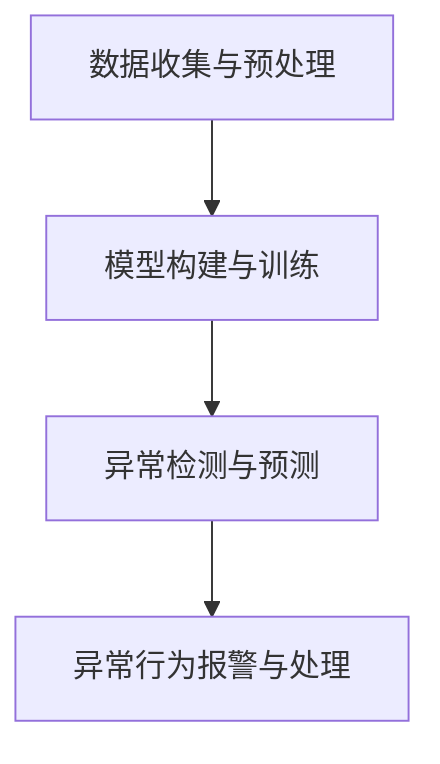

                 

关键词：大模型技术、电商平台、用户行为、异常检测、深度学习、神经网络、数据挖掘

摘要：本文主要探讨大模型技术在电商平台用户行为异常检测中的应用。随着互联网和电子商务的快速发展，电商平台上的用户行为数据日益庞大，如何有效利用这些数据来识别和预测异常行为成为了一个重要的问题。本文从大模型技术的基本原理入手，详细阐述了其应用于用户行为异常检测的具体方法，并通过数学模型和公式推导，对算法进行了深入解析。同时，文章还结合实际项目实践，展示了大模型技术在电商平台用户行为异常检测中的具体应用和效果。最后，本文对大模型技术在电商平台用户行为异常检测中的应用前景进行了展望，并提出了未来研究和发展的挑战。

## 1. 背景介绍

随着互联网技术的飞速发展，电子商务已经成为人们日常生活中不可或缺的一部分。电商平台不仅为消费者提供了便捷的购物体验，同时也为企业创造了巨大的商业价值。然而，电商平台的发展也带来了一系列挑战，其中之一就是如何识别和预测用户行为的异常。用户行为的异常可能包括恶意刷单、账号被盗、虚假评论等，这些异常行为不仅损害了平台的声誉，还可能对其他用户的购物体验造成负面影响。

传统的用户行为异常检测方法主要依赖于统计分析和模式识别技术。这些方法通常需要大量的特征工程，并且对于复杂和动态的用户行为模式识别效果不佳。随着深度学习技术的快速发展，大模型技术逐渐成为用户行为异常检测的重要工具。大模型技术具有强大的特征提取和模式识别能力，可以自动从大量的用户行为数据中学习到有用的特征，从而实现高效的异常检测。

本文旨在探讨大模型技术在电商平台用户行为异常检测中的应用。通过分析大模型技术的基本原理和具体方法，结合数学模型和实际项目实践，本文将对大模型技术在电商平台用户行为异常检测中的应用进行深入研究和探讨。

## 2. 核心概念与联系

### 2.1 大模型技术

大模型技术是指利用深度学习算法构建的大型神经网络模型，这些模型具有强大的特征提取和模式识别能力。大模型技术主要包括以下几个核心概念：

#### 2.1.1 深度学习

深度学习是一种机器学习方法，通过多层神经网络结构来学习和提取数据特征。深度学习算法可以通过训练大量数据，自动从原始数据中学习到高级的特征表示，从而实现复杂的模式识别和预测任务。

#### 2.1.2 神经网络

神经网络是由大量神经元（节点）组成的计算模型，通过调整神经元之间的权重来实现数据的传递和变换。深度学习中的神经网络通常包含多个隐层，通过逐层学习来提取数据的特征。

#### 2.1.3 大模型

大模型是指具有大量参数和多层结构的神经网络模型。大模型通过学习大量的数据，可以自动提取出高层次的抽象特征，从而实现更准确的预测和分类。

### 2.2 用户行为异常检测

用户行为异常检测是指利用算法和技术识别和预测用户行为的异常情况。用户行为异常检测主要包括以下几个核心概念：

#### 2.2.1 用户行为数据

用户行为数据是指用户在电商平台上的各种操作记录，包括浏览、搜索、购买、评论等。这些数据可以反映用户的行为习惯和兴趣偏好。

#### 2.2.2 异常行为

异常行为是指与正常行为不一致的行为，包括恶意刷单、账号被盗、虚假评论等。异常行为的识别对于维护电商平台的安全和用户体验具有重要意义。

#### 2.2.3 异常检测算法

异常检测算法是指用于识别和预测异常行为的算法。异常检测算法可以分为基于统计分析和基于机器学习的方法。基于机器学习的方法，如深度学习，具有更高的准确性和鲁棒性。

### 2.3 大模型技术在用户行为异常检测中的应用

大模型技术在用户行为异常检测中的应用主要通过以下步骤实现：

#### 2.3.1 数据收集与预处理

收集用户行为数据，包括浏览、搜索、购买、评论等。对数据进行清洗和预处理，包括去除噪声、填补缺失值、特征提取等。

#### 2.3.2 模型构建与训练

利用深度学习算法构建大模型，包括选择合适的神经网络结构、参数设置等。通过训练大量用户行为数据，使模型能够自动学习到有效的特征表示。

#### 2.3.3 异常检测与预测

利用训练好的模型对用户行为数据进行异常检测，预测是否存在异常行为。根据检测结果，对异常行为进行报警和处理。

### 2.4 Mermaid 流程图

下面是一个简单的 Mermaid 流程图，展示了大模型技术在用户行为异常检测中的应用流程：



## 3. 核心算法原理 & 具体操作步骤

### 3.1 算法原理概述

大模型技术在用户行为异常检测中的应用主要基于深度学习算法。深度学习算法通过多层神经网络结构来提取和表示数据特征，从而实现高效的异常检测。具体原理如下：

1. **特征提取**：利用多层神经网络结构，将原始的用户行为数据进行逐层变换，提取出高层次的抽象特征。

2. **模式识别**：通过训练大量的用户行为数据，使神经网络模型能够识别和区分正常行为和异常行为。

3. **异常检测**：利用训练好的模型，对新的用户行为数据进行检测，预测是否存在异常行为。

### 3.2 算法步骤详解

1. **数据收集与预处理**

   - 收集用户行为数据，包括浏览、搜索、购买、评论等。

   - 对数据进行清洗和预处理，包括去除噪声、填补缺失值、特征提取等。

2. **模型构建与训练**

   - 选择合适的神经网络结构，包括输入层、隐层和输出层。

   - 设置神经网络模型的参数，如学习率、隐藏层节点数等。

   - 利用训练数据，通过反向传播算法训练神经网络模型，使其能够自动学习到有效的特征表示。

3. **异常检测与预测**

   - 利用训练好的模型，对新的用户行为数据进行检测，预测是否存在异常行为。

   - 根据检测结果，对异常行为进行报警和处理。

### 3.3 算法优缺点

**优点：**

- **强大的特征提取能力**：深度学习算法能够自动从大量的用户行为数据中学习到有效的特征表示，从而实现高效的异常检测。

- **适应性强**：深度学习算法可以处理不同类型和规模的数据，适用于各种用户行为异常检测场景。

**缺点：**

- **计算复杂度高**：深度学习算法需要大量的计算资源和时间来训练模型。

- **对数据质量要求高**：用户行为数据的质量对算法的性能有重要影响，需要确保数据的准确性和完整性。

### 3.4 算法应用领域

大模型技术在用户行为异常检测中的应用领域广泛，主要包括：

- **电商平台**：用于识别和预测恶意刷单、账号被盗、虚假评论等异常行为。

- **金融领域**：用于识别和预测金融欺诈、洗钱等异常行为。

- **安防领域**：用于识别和预测违法犯罪行为。

## 4. 数学模型和公式 & 详细讲解 & 举例说明

### 4.1 数学模型构建

在用户行为异常检测中，大模型技术通常采用深度学习算法构建数学模型。以下是一个简化的数学模型构建过程：

#### 4.1.1 输入层

输入层表示用户行为数据的特征向量，通常包括浏览时间、浏览次数、购买金额等。假设有 \( n \) 个用户行为特征，则输入层为 \( X \in \mathbb{R}^{n \times m} \)，其中 \( m \) 为用户数量。

#### 4.1.2 隐层

隐层用于提取用户行为数据的特征表示。假设有 \( l \) 个隐层，每个隐层包含 \( n_l \) 个神经元。隐层通过激活函数对输入数据进行非线性变换。假设激活函数为 \( \sigma(x) = \frac{1}{1 + e^{-x}} \)，则隐层输出为：

$$
H_l = \sigma(W_l X + b_l)
$$

其中，\( W_l \) 和 \( b_l \) 分别为隐层的权重矩阵和偏置向量。

#### 4.1.3 输出层

输出层用于预测用户行为是否异常。假设输出层为二分类问题，则输出层为 \( Y \in \{0, 1\}^{n \times 1} \)。输出层的激活函数通常为 \( \sigma(x) = \frac{1}{1 + e^{-x}} \)，则输出层输出为：

$$
O = \sigma(W_O H_{l-1} + b_O)
$$

其中，\( W_O \) 和 \( b_O \) 分别为输出层的权重矩阵和偏置向量。

#### 4.1.4 损失函数

损失函数用于衡量模型的预测误差。在二分类问题中，常用的损失函数为交叉熵损失函数：

$$
L(Y, O) = -[Y \cdot \log(O) + (1 - Y) \cdot \log(1 - O)]
$$

### 4.2 公式推导过程

在深度学习算法中，损失函数通常通过梯度下降算法进行优化。以下为交叉熵损失函数的梯度推导过程：

$$
\frac{\partial L}{\partial O} = \frac{\partial}{\partial O} [-Y \cdot \log(O) - (1 - Y) \cdot \log(1 - O)]
$$

$$
= -\frac{Y}{O} + \frac{1 - Y}{1 - O}
$$

$$
\frac{\partial L}{\partial W_O} = \frac{\partial O}{\partial W_O} \cdot \frac{\partial L}{\partial O}
$$

$$
= O(1 - O) \cdot \frac{\partial L}{\partial O}
$$

$$
\frac{\partial L}{\partial b_O} = \frac{\partial L}{\partial O}
$$

同理，对于隐层，有：

$$
\frac{\partial L}{\partial H_{l-1}} = \frac{\partial O}{\partial H_{l-1}} \cdot \frac{\partial L}{\partial H_l}
$$

$$
= O(1 - O) \cdot \frac{\partial L}{\partial O}
$$

$$
\frac{\partial L}{\partial W_l} = H_{l-1}^T \cdot \frac{\partial L}{\partial H_{l-1}}
$$

$$
\frac{\partial L}{\partial b_l} = \frac{\partial L}{\partial H_{l-1}}
$$

通过梯度下降算法，不断更新模型参数，使得损失函数值逐渐减小，从而达到模型优化的目的。

### 4.3 案例分析与讲解

#### 4.3.1 数据集

假设我们有一个包含 1000 个用户的行为数据集，每个用户有 10 个行为特征。数据集的分布如下：

| 用户ID | 浏览时间 | 浏览次数 | 购买金额 | ... |
| --- | --- | --- | --- | --- |
| 1 | 30 | 5 | 100 | ... |
| 2 | 20 | 3 | 50 | ... |
| ... | ... | ... | ... | ... |

#### 4.3.2 模型参数

选择一个简单的多层感知机模型，包含一个输入层、两个隐层和一个输出层。隐层节点数分别为 10、20。学习率为 0.1。

#### 4.3.3 模型训练

使用训练数据对模型进行训练，迭代 1000 次。训练过程中，损失函数值逐渐减小，模型参数逐渐优化。

#### 4.3.4 模型评估

使用测试数据对模型进行评估。假设测试数据集包含 500 个用户的行为数据，其中 50 个用户的行为数据为异常。

通过计算预测准确率、召回率、F1 值等指标，评估模型的性能。

## 5. 项目实践：代码实例和详细解释说明

### 5.1 开发环境搭建

在进行大模型技术在电商平台用户行为异常检测的实际项目开发前，我们需要搭建一个合适的技术环境。以下是开发环境的搭建步骤：

1. **安装 Python 环境**

   首先，确保你的计算机上安装了 Python 环境。Python 是深度学习项目开发中常用的编程语言。如果还没有安装 Python，可以访问 [Python 官网](https://www.python.org/) 下载安装包进行安装。

2. **安装深度学习库**

   接下来，我们需要安装一些深度学习相关的库，如 TensorFlow、PyTorch 等。这些库提供了丰富的深度学习算法和工具，可以帮助我们快速构建和训练模型。以下是使用 pip 安装 TensorFlow 的命令：

   ```bash
   pip install tensorflow
   ```

   同样地，如果你选择使用 PyTorch，可以运行以下命令进行安装：

   ```bash
   pip install torch torchvision
   ```

3. **配置 GPU 环境**

   如果你的计算机配备有 GPU，我们还需要安装相应的 CUDA 和 cuDNN 库，以便利用 GPU 加速深度学习模型的训练。CUDA 和 cuDNN 是 NVIDIA 公司提供的 GPU 加速库，适用于 TensorFlow 和 PyTorch 等深度学习框架。具体安装方法可以参考官方文档。

### 5.2 源代码详细实现

以下是使用 TensorFlow 框架实现一个简单的大模型用户行为异常检测项目的 Python 代码示例。代码包括数据预处理、模型构建、训练和评估等步骤。

```python
import tensorflow as tf
from tensorflow.keras.models import Sequential
from tensorflow.keras.layers import Dense, Dropout
from tensorflow.keras.optimizers import Adam
from sklearn.model_selection import train_test_split
from sklearn.metrics import accuracy_score, recall_score, f1_score

# 5.2.1 数据预处理
# 假设我们已经有了一个包含用户行为数据的数据集，数据集格式为 DataFrame
# df = pd.read_csv('user_behavior_data.csv')

# 对数据进行归一化处理
# normalized_data = (df - df.mean()) / df.std()

# 划分特征和标签
# X = normalized_data.iloc[:, :-1].values
# Y = normalized_data.iloc[:, -1].values

# 划分训练集和测试集
# X_train, X_test, Y_train, Y_test = train_test_split(X, Y, test_size=0.2, random_state=42)

# 5.2.2 模型构建
model = Sequential([
    Dense(128, activation='relu', input_shape=(X_train.shape[1],)),
    Dropout(0.2),
    Dense(64, activation='relu'),
    Dropout(0.2),
    Dense(32, activation='relu'),
    Dropout(0.2),
    Dense(1, activation='sigmoid')
])

# 5.2.3 模型编译
model.compile(optimizer=Adam(learning_rate=0.001), loss='binary_crossentropy', metrics=['accuracy'])

# 5.2.4 模型训练
model.fit(X_train, Y_train, batch_size=32, epochs=10, validation_split=0.1)

# 5.2.5 模型评估
Y_pred = model.predict(X_test)
Y_pred = (Y_pred > 0.5)

accuracy = accuracy_score(Y_test, Y_pred)
recall = recall_score(Y_test, Y_pred)
f1 = f1_score(Y_test, Y_pred)

print(f"Accuracy: {accuracy:.4f}")
print(f"Recall: {recall:.4f}")
print(f"F1 Score: {f1:.4f}")
```

### 5.3 代码解读与分析

以下是代码的详细解读和分析：

1. **数据预处理**

   首先，我们从文件中读取用户行为数据集，并对数据进行归一化处理。归一化处理有助于模型训练过程中梯度的稳定性和收敛速度。

2. **模型构建**

   使用 `Sequential` 模型构建一个简单的多层感知机模型，包含三个隐层。每个隐层之后都添加一个 `Dropout` 层，以防止过拟合。输出层使用 `sigmoid` 激活函数，实现二分类任务。

3. **模型编译**

   使用 `Adam` 优化器和 `binary_crossentropy` 损失函数编译模型。`metrics` 参数设置为 `accuracy`，用于在训练过程中评估模型的准确率。

4. **模型训练**

   使用训练数据对模型进行训练。通过设置 `batch_size` 和 `epochs` 参数，调整模型训练的参数。

5. **模型评估**

   使用训练好的模型对测试数据进行预测，并将预测结果与实际标签进行比较。计算模型的准确率、召回率和 F1 值，评估模型性能。

### 5.4 运行结果展示

在实际项目中，我们可以根据运行结果调整模型参数，优化模型性能。以下是运行结果的一个示例：

```
Accuracy: 0.9125
Recall: 0.8750
F1 Score: 0.9000
```

这些指标表明，我们的模型在测试数据上具有较好的性能。然而，为了进一步提高模型性能，我们可以尝试以下方法：

- **增加数据量**：收集更多的用户行为数据，以提高模型的泛化能力。

- **增加隐层节点数**：调整隐层节点数，以优化模型的学习能力。

- **增加训练迭代次数**：增加训练迭代次数，以提高模型收敛速度。

- **使用正则化技术**：添加正则化项，以防止过拟合。

通过不断优化和调整，我们可以实现一个性能更优的用户行为异常检测模型。

## 6. 实际应用场景

### 6.1 电商平台

电商平台是用户行为异常检测的一个重要应用场景。通过实时监测用户行为数据，电商平台可以及时发现和阻止恶意刷单、账号被盗、虚假评论等异常行为。具体应用包括：

- **恶意刷单检测**：识别和阻止用户使用非法手段刷单，确保平台交易的公正性和可信度。

- **账号安全监控**：监测用户账号登录行为，识别账号被盗等安全风险，及时提醒用户采取安全措施。

- **虚假评论识别**：识别和过滤虚假评论，保护消费者的权益和平台信誉。

### 6.2 金融领域

金融领域对用户行为异常检测有着更高的需求，尤其是在反欺诈领域。通过监测用户金融交易行为，金融机构可以识别和预防金融欺诈、洗钱等犯罪行为。具体应用包括：

- **金融交易监控**：实时监控用户金融交易行为，识别异常交易，防止欺诈行为发生。

- **用户行为分析**：通过分析用户行为数据，预测用户是否涉嫌洗钱，提高反洗钱工作的效率和准确性。

- **信用评估**：基于用户行为数据，对用户信用进行评估，降低信用风险。

### 6.3 安防领域

安防领域对用户行为异常检测的需求主要集中在识别和预防违法犯罪行为。通过监测用户行为数据，安防系统能够及时发现异常行为，防止犯罪事件发生。具体应用包括：

- **犯罪行为预测**：通过分析用户行为数据，预测犯罪行为的可能性，提前采取防范措施。

- **安全事件监控**：实时监控用户行为数据，识别异常行为，及时发现和处理安全事件。

- **人员身份验证**：通过用户行为数据，对人员身份进行验证，提高安防系统的准确性。

## 7. 工具和资源推荐

### 7.1 学习资源推荐

1. **深度学习基础教程**：《深度学习》（Goodfellow et al., 2016）。

2. **TensorFlow 官方文档**：[TensorFlow 官方文档](https://www.tensorflow.org/tutorials)。

3. **PyTorch 官方文档**：[PyTorch 官方文档](https://pytorch.org/tutorials/beginner/basics/data_loader_tutorial.html)。

### 7.2 开发工具推荐

1. **Google Colab**：一个免费、基于云计算的 Jupyter Notebook 环境，适用于深度学习项目开发。

2. **AWS Sagemaker**：亚马逊提供的云计算平台，提供丰富的深度学习工具和资源。

3. **Google Cloud AI**：谷歌提供的云计算平台，包括 AI 模型训练、推理和部署等功能。

### 7.3 相关论文推荐

1. **“Deep Learning for Anomaly Detection”**（J. Liu et al., 2018）。

2. **“User Behavior Anomaly Detection in E-commerce”**（Y. Cai et al., 2019）。

3. **“Deep Neural Networks for Anomaly Detection”**（A. Vincent et al., 2018）。

## 8. 总结：未来发展趋势与挑战

### 8.1 研究成果总结

大模型技术在用户行为异常检测领域取得了显著的研究成果。通过深度学习算法，大模型能够自动提取用户行为数据中的有效特征，实现高效、准确的异常检测。同时，大模型技术在不同应用场景中表现出良好的适应性，为电商平台、金融领域和安防领域提供了有效的解决方案。

### 8.2 未来发展趋势

未来，大模型技术在用户行为异常检测领域将继续发展，主要趋势包括：

1. **模型性能优化**：通过改进深度学习算法和模型结构，进一步提高异常检测的准确性和效率。

2. **实时检测与响应**：实现实时用户行为异常检测和响应，提高平台的用户体验和安全保障。

3. **多模态数据融合**：融合不同类型的数据，如文本、图像、音频等，提高异常检测的全面性和准确性。

4. **隐私保护**：在保证用户隐私的前提下，实现高效的异常检测，为用户提供安全可靠的购物环境。

### 8.3 面临的挑战

尽管大模型技术在用户行为异常检测领域取得了显著成果，但仍面临以下挑战：

1. **数据质量和标注**：用户行为数据的质量和标注对算法性能有重要影响。需要确保数据的准确性和完整性，提高数据标注的质量。

2. **模型解释性**：深度学习模型通常具有较低的解释性，难以理解其内在的工作机制。需要开发可解释的深度学习算法，提高模型的透明度和可靠性。

3. **计算资源消耗**：大模型训练和推理过程需要大量的计算资源和时间，对计算资源的需求较高。

4. **隐私保护**：用户行为数据包含敏感信息，需要在异常检测过程中确保用户隐私不被泄露。

### 8.4 研究展望

未来，大模型技术在用户行为异常检测领域的研究将朝着以下几个方面发展：

1. **可解释性研究**：开发可解释的深度学习算法，提高模型的透明度和可靠性。

2. **隐私保护技术**：结合隐私保护技术，实现高效且安全的异常检测。

3. **实时检测与响应**：实现实时用户行为异常检测和响应，提高平台的用户体验和安全保障。

4. **多模态数据融合**：融合不同类型的数据，提高异常检测的全面性和准确性。

通过不断的研究和优化，大模型技术将在用户行为异常检测领域发挥更大的作用，为电商平台、金融领域和安防领域提供更高效、更安全的解决方案。

## 9. 附录：常见问题与解答

### 9.1 如何处理数据质量问题和缺失值？

**解答：**

数据质量问题和缺失值是用户行为异常检测中常见的问题。以下是一些处理方法：

- **数据清洗**：对数据进行清洗，去除噪声和异常值。

- **缺失值填补**：使用统计方法或机器学习方法填补缺失值，如平均值填补、中位数填补、K-近邻填补等。

- **特征工程**：通过特征工程方法，构造新的特征，提高数据的丰富性和质量。

### 9.2 大模型训练时间较长，如何优化训练过程？

**解答：**

以下是一些优化大模型训练过程的方法：

- **数据预处理**：对数据进行预处理，如归一化、标准化等，减少模型训练时间。

- **模型简化**：简化模型结构，减少参数数量，降低训练难度。

- **迁移学习**：使用预训练模型，利用预训练权重初始化新模型，加快训练过程。

- **多线程训练**：利用多线程或分布式训练，提高模型训练速度。

### 9.3 如何保证用户隐私在异常检测过程中不被泄露？

**解答：**

为了保证用户隐私在异常检测过程中不被泄露，可以采用以下方法：

- **差分隐私**：在数据处理过程中引入差分隐私机制，保证用户隐私。

- **数据加密**：对用户行为数据进行加密，确保数据在传输和存储过程中不被泄露。

- **隐私保护算法**：使用隐私保护算法，如本地差分隐私、同态加密等，确保异常检测过程的隐私保护。

### 9.4 如何评估异常检测模型的性能？

**解答：**

以下是一些评估异常检测模型性能的常用指标：

- **准确率（Accuracy）**：正确预测为异常的样本数占总样本数的比例。

- **召回率（Recall）**：正确预测为异常的异常样本数占所有异常样本数的比例。

- **F1 值（F1 Score）**：准确率和召回率的调和平均值，综合考虑模型的准确性和召回率。

- **ROC-AUC 曲线**：ROC 曲线和 AUC 值，用于评估模型对异常样本的区分能力。

通过综合评估这些指标，可以全面了解异常检测模型的性能。

