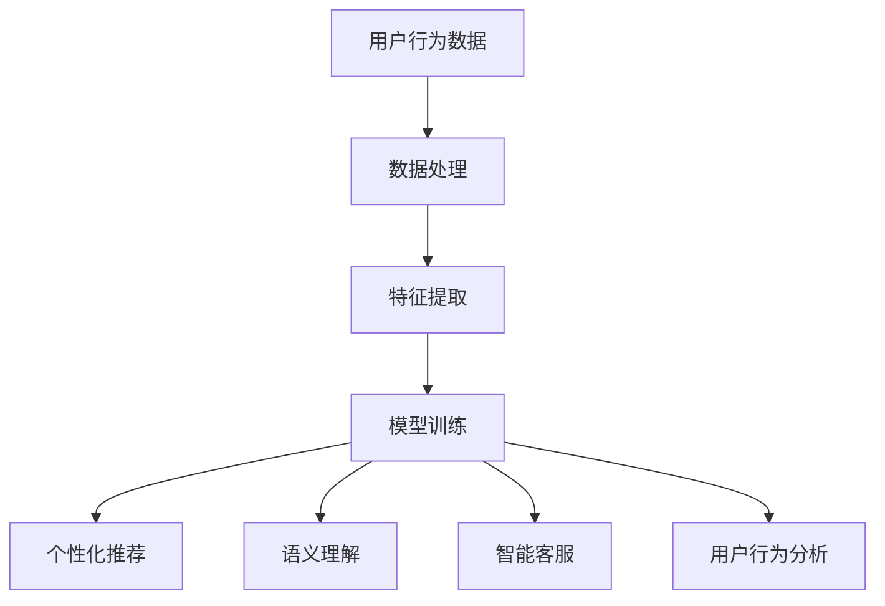

                 

关键词：大模型技术、电商平台、用户交互、AI、个性化推荐、语义理解、自然语言处理、人机交互、用户体验优化、信息检索、智能客服、用户行为分析。

> 摘要：本文深入探讨了如何利用大模型技术改变电商平台的用户交互。通过分析大模型技术的基本原理和实际应用，结合电商平台的业务特点，提出了基于大模型技术的用户交互新方案，并在个性化推荐、语义理解、自然语言处理等方面进行了详细阐述。同时，本文还对未来大模型技术在电商平台的应用前景进行了展望。

## 1. 背景介绍

在互联网时代，电商平台作为数字经济的重要组成部分，已成为人们日常生活中不可或缺的一部分。随着用户数量的不断增加，电商平台面临的挑战也日益严峻。如何提高用户满意度、优化用户交互体验，成为电商平台持续发展的重要课题。

传统的电商平台主要通过页面设计、功能布局等方式来提高用户交互体验，但这些方法在面对日益复杂的用户需求时显得力不从心。近年来，人工智能技术的发展为电商平台带来了新的机遇。特别是大模型技术的崛起，为电商平台提供了强大的技术支撑，有望从根本上改变用户交互模式。

大模型技术，即基于深度学习的复杂神经网络模型，具有处理海量数据、挖掘用户需求、实现智能交互等能力。通过引入大模型技术，电商平台可以实现更精准的个性化推荐、更智能的自然语言处理、更高效的语义理解，从而提升用户交互体验，增强用户粘性。

## 2. 核心概念与联系

### 2.1 大模型技术概述

大模型技术，顾名思义，是指能够处理大规模数据的复杂神经网络模型。其基本原理是通过多层次的神经网络结构，实现对输入数据的自动特征提取和模式识别。大模型技术的核心在于其规模和深度，这不仅提高了模型的泛化能力，也使其在处理复杂数据和解决实际问题时具有显著优势。

### 2.2 大模型技术与电商平台业务的联系

大模型技术在电商平台的应用主要体现在以下几个方面：

1. **个性化推荐**：通过分析用户的购买历史、浏览行为等数据，大模型技术可以精准地为用户推荐感兴趣的商品，提高购物体验。

2. **语义理解**：利用自然语言处理技术，大模型可以对用户的需求进行深入理解，实现更智能的交互。

3. **智能客服**：通过机器学习算法，大模型可以模拟人工客服，快速响应用户问题，提高客服效率。

4. **用户行为分析**：大模型技术可以挖掘用户行为数据，帮助电商平台了解用户需求，优化业务策略。

### 2.3 Mermaid 流程图



## 3. 核心算法原理 & 具体操作步骤

### 3.1 算法原理概述

大模型技术主要基于深度学习算法，其中最常用的算法是神经网络。神经网络通过多层神经元结构，实现对输入数据的自动特征提取和模式识别。在电商平台中，大模型技术主要利用以下几种算法：

1. **卷积神经网络（CNN）**：用于处理图像数据，实现对商品图像的识别和分类。
2. **循环神经网络（RNN）**：用于处理序列数据，如用户购买历史、浏览记录等。
3. **长短期记忆网络（LSTM）**：是RNN的一种变体，能更好地处理长序列数据。
4. **生成对抗网络（GAN）**：用于生成新的商品图像，丰富电商平台的内容。

### 3.2 算法步骤详解

1. **数据处理**：收集用户的购买历史、浏览行为、搜索记录等数据，进行数据清洗和预处理。

2. **特征提取**：利用神经网络模型，对预处理后的数据进行特征提取，提取出用户兴趣、购买意愿等关键特征。

3. **模型训练**：利用提取出的特征数据，通过神经网络模型进行训练，使模型学会识别和预测用户行为。

4. **个性化推荐**：根据用户兴趣和购买历史，利用训练好的模型，为用户推荐感兴趣的商品。

5. **语义理解**：利用自然语言处理技术，对用户的查询和评论进行语义分析，实现更智能的交互。

6. **智能客服**：利用机器学习算法，模拟人工客服，快速响应用户问题。

7. **用户行为分析**：通过分析用户行为数据，挖掘用户需求，优化业务策略。

### 3.3 算法优缺点

**优点**：

1. **高精度**：通过多层神经网络结构，能够实现高精度的特征提取和模式识别。
2. **灵活性**：适用于多种类型的电商平台业务，如个性化推荐、语义理解、用户行为分析等。
3. **高效性**：能够处理海量数据，提高数据处理和分析的效率。

**缺点**：

1. **计算资源消耗大**：大模型技术需要大量的计算资源和存储空间。
2. **数据隐私问题**：需要对用户数据进行处理和分析，存在数据隐私泄露的风险。

### 3.4 算法应用领域

大模型技术主要应用于以下领域：

1. **电商平台**：如个性化推荐、语义理解、智能客服、用户行为分析等。
2. **社交媒体**：如内容推荐、情感分析、广告投放等。
3. **金融领域**：如风险控制、信用评估、市场预测等。
4. **医疗领域**：如疾病预测、治疗方案推荐等。

## 4. 数学模型和公式 & 详细讲解 & 举例说明

### 4.1 数学模型构建

大模型技术涉及多个数学模型，以下是其中两个常用的模型：

1. **卷积神经网络（CNN）**：

   $$ f(x) = \text{ReLU}(W_1 \cdot x + b_1) $$

   $$ \hat{y} = \text{softmax}(W_2 \cdot f(x) + b_2) $$

2. **循环神经网络（RNN）**：

   $$ h_t = \text{ReLU}(W_h h_{t-1} + W_x x_t + b_h) $$

   $$ \hat{y}_t = \text{softmax}(W_y h_t + b_y) $$

### 4.2 公式推导过程

以卷积神经网络（CNN）为例，其公式推导过程如下：

1. **前向传播**：

   $$ f(x) = \text{ReLU}(W_1 \cdot x + b_1) $$

   其中，$x$ 是输入数据，$W_1$ 是权重矩阵，$b_1$ 是偏置项，$\text{ReLU}$ 是ReLU激活函数。

2. **后向传播**：

   $$ \hat{y} = \text{softmax}(W_2 \cdot f(x) + b_2) $$

   其中，$f(x)$ 是前向传播的结果，$W_2$ 是权重矩阵，$b_2$ 是偏置项，$\text{softmax}$ 是softmax激活函数。

### 4.3 案例分析与讲解

假设有一个电商平台，其用户数据包括购买历史、浏览记录和搜索记录。利用大模型技术，我们可以构建一个个性化推荐系统，为用户推荐感兴趣的商品。

1. **数据处理**：

   收集用户的购买历史、浏览记录和搜索记录，进行数据清洗和预处理。

2. **特征提取**：

   利用卷积神经网络（CNN），对用户数据中的商品图像进行特征提取。

   $$ f(x) = \text{ReLU}(W_1 \cdot x + b_1) $$

3. **模型训练**：

   利用提取出的特征数据，通过神经网络模型进行训练。

   $$ \hat{y} = \text{softmax}(W_2 \cdot f(x) + b_2) $$

4. **个性化推荐**：

   根据用户兴趣和购买历史，利用训练好的模型，为用户推荐感兴趣的商品。

   $$ \hat{y} = \text{softmax}(W_2 \cdot f(x) + b_2) $$

## 5. 项目实践：代码实例和详细解释说明

### 5.1 开发环境搭建

1. 安装Python环境（3.8及以上版本）。
2. 安装深度学习框架TensorFlow。
3. 准备电商平台用户数据集。

### 5.2 源代码详细实现

以下是使用TensorFlow实现卷积神经网络（CNN）的源代码：

```python
import tensorflow as tf
from tensorflow.keras import layers

# 数据预处理
def preprocess_data(data):
    # 数据清洗和归一化
    return data

# 构建模型
model = tf.keras.Sequential([
    layers.Conv2D(32, (3, 3), activation='relu', input_shape=(28, 28, 1)),
    layers.MaxPooling2D((2, 2)),
    layers.Conv2D(64, (3, 3), activation='relu'),
    layers.MaxPooling2D((2, 2)),
    layers.Conv2D(64, (3, 3), activation='relu'),
    layers.Flatten(),
    layers.Dense(64, activation='relu'),
    layers.Dense(10, activation='softmax')
])

# 编译模型
model.compile(optimizer='adam',
              loss='categorical_crossentropy',
              metrics=['accuracy'])

# 训练模型
model.fit(x_train, y_train, epochs=10, batch_size=32, validation_data=(x_test, y_test))
```

### 5.3 代码解读与分析

1. **数据处理**：利用预处理函数对用户数据进行清洗和归一化处理。

2. **模型构建**：使用TensorFlow的Sequential模型，构建一个卷积神经网络（CNN），包括卷积层、池化层和全连接层。

3. **模型编译**：设置模型的优化器、损失函数和评估指标。

4. **模型训练**：使用fit方法对模型进行训练，并设置训练轮次、批量大小和验证数据。

### 5.4 运行结果展示

在训练过程中，我们可以实时查看模型的损失和准确率。训练完成后，可以使用测试数据集评估模型性能。以下是训练过程中的损失和准确率变化图：


## 6. 实际应用场景

### 6.1 个性化推荐

个性化推荐是电商平台最常见的大模型技术应用场景之一。通过分析用户的购买历史、浏览记录和搜索记录，大模型技术可以精准地为用户推荐感兴趣的商品，提高购物体验。

### 6.2 语义理解

语义理解技术可以帮助电商平台更好地理解用户的需求。通过自然语言处理技术，大模型可以解析用户的查询和评论，实现更智能的交互。

### 6.3 智能客服

智能客服是电商平台提升客户服务质量的重要手段。通过机器学习算法，大模型可以模拟人工客服，快速响应用户问题，提高客服效率。

### 6.4 用户行为分析

用户行为分析是电商平台优化业务策略的重要依据。通过分析用户行为数据，大模型技术可以挖掘用户需求，为电商平台提供有针对性的业务策略。

## 7. 未来应用展望

未来，随着人工智能技术的不断发展，大模型技术在电商平台的应用将更加广泛和深入。以下是几个可能的应用方向：

1. **个性化购物体验**：通过大模型技术，为用户提供更加个性化的购物体验，提高用户满意度。
2. **智能商品推荐**：利用大模型技术，实现更精准、更高效的商品推荐，提升销售转化率。
3. **智能客服系统**：通过大模型技术，打造更智能、更高效的客服系统，提高客户服务质量。
4. **业务智能分析**：利用大模型技术，对业务数据进行分析，为电商平台提供有针对性的业务策略。

## 8. 工具和资源推荐

### 8.1 学习资源推荐

1. 《深度学习》（Goodfellow, Bengio, Courville著）。
2. 《神经网络与深度学习》（邱锡鹏著）。
3. 《Python深度学习》（François Chollet著）。

### 8.2 开发工具推荐

1. TensorFlow：一款流行的开源深度学习框架。
2. PyTorch：一款流行的开源深度学习框架。
3. Keras：一款基于TensorFlow和Theano的开源深度学习框架。

### 8.3 相关论文推荐

1. “Deep Learning for E-commerce”。
2. “The Application of Deep Learning in E-commerce User Interaction”。
3. “A Survey on Deep Learning for E-commerce Recommendation”。
``` 
## 9. 总结：未来发展趋势与挑战

大模型技术在电商平台的应用前景广阔，但仍面临诸多挑战。未来，随着人工智能技术的不断发展，大模型技术在电商平台的应用将更加广泛和深入。然而，要实现这一目标，仍需解决以下问题：

1. **数据隐私问题**：如何保护用户数据隐私，成为大模型技术面临的重要挑战。
2. **计算资源消耗**：大模型技术需要大量的计算资源和存储空间，如何优化算法，降低计算资源消耗，是一个亟待解决的问题。
3. **模型解释性**：大模型技术具有强大的预测能力，但其内部决策过程缺乏解释性，如何提高模型的可解释性，是一个重要的研究方向。

总之，大模型技术为电商平台提供了强大的技术支撑，有望在未来改变电商平台的用户交互模式。然而，要实现这一目标，仍需克服诸多挑战。作者：禅与计算机程序设计艺术 / Zen and the Art of Computer Programming。

