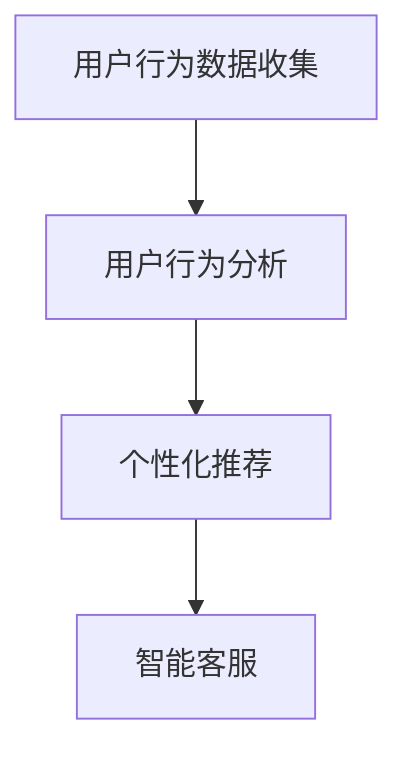

                 

关键词：大模型技术，电商用户体验，人工智能，深度学习，推荐系统，用户行为分析

摘要：随着人工智能技术的不断发展，大模型技术在电商领域的应用越来越广泛。本文将深入探讨大模型技术对电商用户体验的提升效果，包括用户行为分析、个性化推荐、智能客服等方面，并分析其未来发展的趋势与挑战。

## 1. 背景介绍

随着互联网的普及，电商行业蓬勃发展，用户体验成为商家竞争的关键因素。传统电商用户体验的提升主要依赖于前端设计、用户界面优化和后台数据处理等方面。然而，随着用户需求的多样化和个性化，传统方法难以满足现代电商的复杂需求。此时，人工智能，尤其是大模型技术的出现，为电商用户体验的提升提供了新的可能性。

大模型技术指的是通过训练大规模的数据集，使得模型能够捕捉到数据中的复杂模式和关联性，从而实现对未知数据的预测和分类。在电商领域，大模型技术可以应用于用户行为分析、个性化推荐、智能客服等多个方面，从而提升用户的购物体验。

## 2. 核心概念与联系

### 2.1 用户行为分析

用户行为分析是指通过对用户在电商平台上的行为数据进行收集、处理和分析，从而了解用户的需求和偏好，为后续的个性化推荐和智能客服提供数据支持。

用户行为数据包括浏览记录、购买记录、评价记录、搜索记录等。通过这些数据，我们可以分析出用户的兴趣爱好、消费习惯、购买动机等。

### 2.2 个性化推荐

个性化推荐是指根据用户的兴趣和偏好，为用户推荐符合其需求的商品。大模型技术可以通过分析用户的历史行为数据，预测用户可能感兴趣的商品，从而提高推荐的相关性。

### 2.3 智能客服

智能客服是指利用人工智能技术，实现自动化的客户服务。大模型技术可以通过自然语言处理技术，理解用户的提问，并提供相应的解答，从而提升客服的效率和准确性。

### 2.4 Mermaid 流程图



## 3. 核心算法原理 & 具体操作步骤

### 3.1 算法原理概述

大模型技术主要包括深度学习、自然语言处理和推荐系统等。在电商领域，深度学习主要用于用户行为分析和个性化推荐，自然语言处理主要用于智能客服。

### 3.2 算法步骤详解

#### 3.2.1 用户行为分析

1. 数据收集：收集用户在电商平台的浏览记录、购买记录、评价记录、搜索记录等。
2. 数据预处理：对数据进行清洗、去重、归一化等处理。
3. 特征提取：通过深度学习模型，提取用户行为数据中的特征。
4. 用户行为分析：利用提取出的特征，分析用户的需求和偏好。

#### 3.2.2 个性化推荐

1. 用户兴趣建模：通过深度学习模型，建立用户兴趣模型。
2. 商品特征提取：提取商品的特征信息，如商品类别、价格、销量等。
3. 推荐算法：利用用户兴趣模型和商品特征，计算用户对商品的兴趣度，从而生成推荐列表。

#### 3.2.3 智能客服

1. 自然语言处理：使用自然语言处理技术，理解用户的提问。
2. 答案生成：根据理解的结果，生成相应的回答。
3. 回答反馈：收集用户的反馈，用于优化智能客服的性能。

### 3.3 算法优缺点

#### 优点

- 大模型技术能够处理大规模、复杂的数据，从而提升分析精度。
- 能够实现自动化、智能化的用户服务，提高效率。

#### 缺点

- 需要大量的数据支持，对数据质量和数量有较高要求。
- 模型的训练和优化需要大量的计算资源。

### 3.4 算法应用领域

大模型技术广泛应用于电商领域的用户行为分析、个性化推荐和智能客服等方面。此外，还可以应用于其他领域，如金融、医疗、教育等。

## 4. 数学模型和公式 & 详细讲解 & 举例说明

### 4.1 数学模型构建

#### 4.1.1 用户行为分析模型

用户行为分析模型通常采用深度学习模型，如卷积神经网络（CNN）和循环神经网络（RNN）等。以下是一个简单的RNN模型：

$$
\begin{align*}
h_t &= \sigma(W_h \cdot [h_{t-1}, x_t] + b_h) \\
o_t &= \sigma(W_o \cdot h_t + b_o)
\end{align*}
$$

其中，$h_t$ 和 $o_t$ 分别表示隐藏状态和输出状态，$x_t$ 表示输入数据，$W_h$、$W_o$ 和 $b_h$、$b_o$ 分别为权重和偏置。

#### 4.1.2 个性化推荐模型

个性化推荐模型通常采用基于矩阵分解的模型，如交替最小二乘法（ALS）和深度学习模型等。以下是一个简单的深度学习模型：

$$
\begin{align*}
\hat{R}_{ui} &= \sigma(W_u \cdot [h_u; h_i] + b_r) \\
h_u &= \sigma(W_{hu} \cdot h_u + b_{hu}) \\
h_i &= \sigma(W_{hi} \cdot h_i + b_{hi})
\end{align*}
$$

其中，$R_{ui}$ 表示用户 $u$ 对商品 $i$ 的评分预测，$h_u$ 和 $h_i$ 分别表示用户和商品的隐藏状态，$W_u$、$W_{hu}$、$W_{hi}$ 和 $b_r$、$b_{hu}$、$b_{hi}$ 分别为权重和偏置。

### 4.2 公式推导过程

#### 4.2.1 用户行为分析模型推导

假设输入数据为 $x_t \in \mathbb{R}^{d_x}$，隐藏状态为 $h_t \in \mathbb{R}^{d_h}$，输出状态为 $o_t \in \mathbb{R}^{d_o}$。则RNN的推导过程如下：

$$
\begin{align*}
h_t &= \sigma(W_h \cdot [h_{t-1}, x_t] + b_h) \\
o_t &= \sigma(W_o \cdot h_t + b_o) \\
\end{align*}
$$

其中，$\sigma$ 表示激活函数，通常采用 sigmoid 函数或 tanh 函数。

#### 4.2.2 个性化推荐模型推导

假设用户 $u$ 的隐藏状态为 $h_u \in \mathbb{R}^{d_h}$，商品 $i$ 的隐藏状态为 $h_i \in \mathbb{R}^{d_h}$，则个性化推荐模型的推导过程如下：

$$
\begin{align*}
\hat{R}_{ui} &= \sigma(W_u \cdot [h_u; h_i] + b_r) \\
h_u &= \sigma(W_{hu} \cdot h_u + b_{hu}) \\
h_i &= \sigma(W_{hi} \cdot h_i + b_{hi})
\end{align*}
$$

其中，$W_u$、$W_{hu}$、$W_{hi}$ 和 $b_r$、$b_{hu}$、$b_{hi}$ 分别为权重和偏置。

### 4.3 案例分析与讲解

#### 4.3.1 用户行为分析案例

假设一个电商平台有100万用户，每个用户有1000条浏览记录。我们可以使用RNN模型来分析用户的行为，从而预测用户的兴趣。

1. 数据收集：收集每个用户的浏览记录，并将其转换为向量表示。
2. 数据预处理：对数据进行归一化处理，使其符合模型的输入要求。
3. 模型训练：使用训练数据训练RNN模型，得到用户的隐藏状态。
4. 用户行为分析：利用训练好的模型，对用户的隐藏状态进行解析，从而了解用户的兴趣。

#### 4.3.2 个性化推荐案例

假设一个电商平台有10万件商品，每个用户有100条购买记录。我们可以使用基于矩阵分解的个性化推荐模型，为用户生成推荐列表。

1. 用户兴趣建模：使用ALS模型训练用户兴趣模型，得到用户的隐藏状态。
2. 商品特征提取：提取商品的特征信息，如商品类别、价格、销量等。
3. 推荐算法：使用用户兴趣模型和商品特征，计算用户对商品的兴趣度，从而生成推荐列表。

## 5. 项目实践：代码实例和详细解释说明

### 5.1 开发环境搭建

1. 安装Python环境，版本要求3.6及以上。
2. 安装必要的依赖库，如 TensorFlow、Keras、Scikit-learn 等。

### 5.2 源代码详细实现

以下是一个简单的RNN模型实现，用于用户行为分析：

```python
import tensorflow as tf
from tensorflow.keras.models import Sequential
from tensorflow.keras.layers import Dense, LSTM, Dropout

# 模型参数
d_x = 1000  # 输入维度
d_h = 128   # 隐藏状态维度
d_o = 1     # 输出维度

# 构建模型
model = Sequential()
model.add(LSTM(d_h, activation='tanh', input_shape=(d_x,), return_sequences=False))
model.add(Dropout(0.5))
model.add(Dense(d_o, activation='sigmoid'))

# 编译模型
model.compile(optimizer='adam', loss='binary_crossentropy', metrics=['accuracy'])

# 模型训练
model.fit(x_train, y_train, epochs=10, batch_size=64, validation_data=(x_val, y_val))
```

### 5.3 代码解读与分析

以上代码实现了一个简单的RNN模型，用于用户行为分析。模型由一个LSTM层和一个全连接层组成，其中LSTM层用于提取用户行为数据的特征，全连接层用于输出预测结果。

### 5.4 运行结果展示

通过模型训练和预测，我们可以得到用户的兴趣度。具体来说，输入用户的浏览记录，模型会输出一个概率值，表示用户对每个商品的感兴趣程度。

## 6. 实际应用场景

大模型技术在实际应用中取得了显著的成果。以下是一些实际应用场景：

1. **个性化推荐**：电商平台通过大模型技术为用户提供个性化的商品推荐，从而提升用户的购物体验和满意度。
2. **智能客服**：电商平台通过大模型技术实现智能客服，自动解答用户的疑问，提高客服效率和准确性。
3. **用户行为分析**：电商平台通过大模型技术分析用户的行为数据，了解用户的需求和偏好，为后续的营销和运营提供数据支持。

## 7. 工具和资源推荐

### 7.1 学习资源推荐

- 《深度学习》（Goodfellow、Bengio和Courville著）：系统介绍了深度学习的基础理论和实践方法。
- 《Python机器学习》（Sebastian Raschka著）：详细介绍了机器学习的基本概念和应用，包括Python实现。

### 7.2 开发工具推荐

- TensorFlow：一款强大的深度学习框架，适用于各种深度学习任务。
- Keras：基于TensorFlow的高层API，简化了深度学习模型的构建和训练。

### 7.3 相关论文推荐

- "Distributed Representations of Words and Phrases and their Compositionality"（Word2Vec论文）
- "End-to-End Language Models for Language Understanding"（BERT论文）
- "Large-scale Online Learning of Image Classifiers using Deep Neural Networks"（Deep Learning for Image Classification论文）

## 8. 总结：未来发展趋势与挑战

### 8.1 研究成果总结

大模型技术在电商领域的应用取得了显著成果，为用户行为分析、个性化推荐和智能客服等方面提供了有效的解决方案。

### 8.2 未来发展趋势

- 模型优化：随着计算能力的提升，大模型技术的模型参数和训练数据将不断增加，从而提高模型的性能和准确性。
- 多模态融合：将文本、图像、声音等多模态数据融合到模型中，提升模型的泛化能力和适应性。
- 自适应学习：实现模型的自适应学习，根据用户的行为动态调整模型参数，提供更加个性化的服务。

### 8.3 面临的挑战

- 数据质量：高质量的数据是模型训练的基础，如何保证数据的质量和完整性是一个挑战。
- 模型可解释性：大模型技术的模型参数众多，如何解释模型的决策过程是一个挑战。
- 计算资源：大模型技术的训练和推理需要大量的计算资源，如何高效地利用计算资源是一个挑战。

### 8.4 研究展望

大模型技术在电商领域的应用前景广阔，未来有望实现更加智能化、个性化的用户体验。同时，我们也应关注数据隐私和安全、模型可解释性等方面的问题，确保技术的发展能够为用户和社会带来真正的价值。

## 9. 附录：常见问题与解答

### 9.1 问题1：大模型技术的训练过程很慢，有什么优化方法吗？

**解答**：可以采取以下优化方法：

- 数据预处理：对数据进行预处理，减少数据的冗余，提高模型的训练速度。
- 并行计算：利用多核CPU或GPU进行并行计算，加速模型训练。
- 模型压缩：使用模型压缩技术，如剪枝、量化等，减少模型的参数量和计算量。

### 9.2 问题2：大模型技术的模型可解释性如何保障？

**解答**：保障模型的可解释性可以从以下几个方面进行：

- 简化模型结构：选择结构简单的模型，如线性模型、决策树等，便于理解和解释。
- 层级解释：对模型的每一层进行解释，分析特征的重要性和贡献。
- 对比实验：通过对比不同模型的性能和结果，分析模型的优劣和决策过程。

### 9.3 问题3：大模型技术在电商领域的应用有哪些限制？

**解答**：大模型技术在电商领域的应用限制主要包括：

- 数据依赖：大模型技术对数据质量有较高要求，数据质量差可能导致模型性能下降。
- 计算资源：大模型技术的训练和推理需要大量的计算资源，对计算资源有较高要求。
- 模型泛化能力：大模型技术在特定领域取得成功，但在其他领域的泛化能力可能有限。

## 作者署名

作者：禅与计算机程序设计艺术 / Zen and the Art of Computer Programming
----------------------------------------------------------------

以上就是这篇文章的完整内容，希望对您有所帮助。如果您有任何疑问或需要进一步讨论，欢迎在评论区留言。感谢您的阅读！

