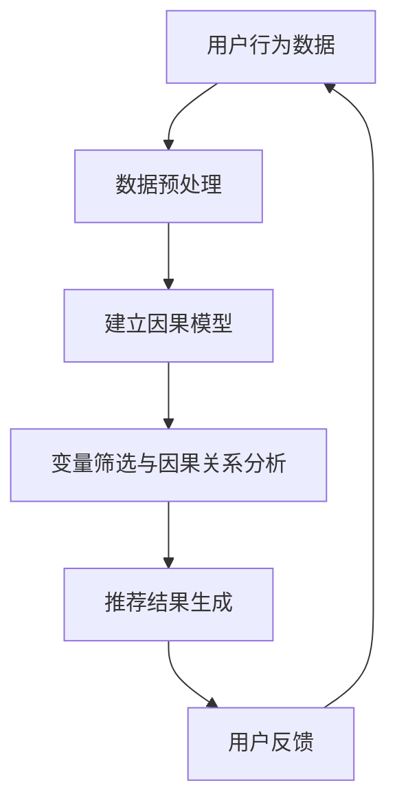

                 

关键词：大模型、推荐系统、因果推断、人工智能

> 摘要：本文深入探讨了在大模型推荐系统中引入因果推断的必要性和方法，分析了其核心算法原理、数学模型以及具体应用实例，并展望了未来的发展方向。

## 1. 背景介绍

随着互联网的迅猛发展，用户生成内容（UGC）的数量呈爆炸式增长。推荐系统作为连接用户与内容的桥梁，已经成为各大互联网公司提升用户体验、提高运营效率的重要工具。然而，传统的基于协同过滤和内容匹配的推荐方法在应对大量噪声数据和隐式反馈时存在一定的局限性。近年来，因果推断作为一种新的研究方向，逐渐在推荐系统中崭露头角。

因果推断源于统计学和哲学领域，其核心目标是揭示变量之间的因果关系，而非简单的相关性。在大模型推荐系统中，因果推断可以帮助我们更好地理解用户行为，从而提供更精准、更个性化的推荐服务。本文将围绕大模型推荐中的因果推断应用，进行深入探讨。

## 2. 核心概念与联系

### 2.1 核心概念

在大模型推荐系统中，因果推断涉及以下几个核心概念：

1. **随机变量**：表示具有某种特征或属性的数据，如用户兴趣、物品特征等。
2. **潜在因子**：影响随机变量的潜在因素，如用户喜好、物品类型等。
3. **因果关系**：描述变量之间的因果关系，如用户喜欢某个物品是因为其类型或属性。
4. **因果模型**：描述变量之间因果关系的数学模型，如结构方程模型、潜在变量模型等。

### 2.2 架构流程图

为了更好地理解因果推断在大模型推荐系统中的应用，我们利用Mermaid绘制了一个简化的架构流程图：



### 2.3 因果推断与推荐系统的联系

因果推断与推荐系统的联系主要体现在两个方面：

1. **提高推荐质量**：通过揭示用户行为与物品特征之间的因果关系，可以更精准地预测用户兴趣，从而提高推荐质量。
2. **应对噪声数据**：因果推断能够有效识别和排除噪声数据对推荐结果的影响，使推荐系统在应对大量噪声数据时更加稳健。

## 3. 核心算法原理 & 具体操作步骤

### 3.1 算法原理概述

在大模型推荐系统中，因果推断的核心算法是因果推断算法（如Do-calculus、Causal Inference by Logic）和随机对照试验（Randomized Controlled Trial）。这些算法通过分析用户行为数据，建立变量之间的因果关系模型，并利用该模型进行推荐。

### 3.2 算法步骤详解

1. **数据收集**：收集用户行为数据，如点击、购买、评论等。
2. **数据预处理**：对收集到的数据进行清洗、去重、缺失值处理等操作，以便后续分析。
3. **建立因果模型**：利用因果推断算法，建立用户行为与物品特征之间的因果关系模型。
4. **变量筛选与因果关系分析**：对因果关系模型进行变量筛选和因果关系分析，确定影响推荐结果的关键因素。
5. **推荐结果生成**：根据因果关系模型和用户行为数据，生成个性化的推荐结果。
6. **用户反馈**：收集用户对推荐结果的反馈，用于优化推荐模型。

### 3.3 算法优缺点

**优点**：

1. **提高推荐质量**：揭示变量之间的因果关系，有助于生成更精准的推荐结果。
2. **应对噪声数据**：有效识别和排除噪声数据的影响，提高推荐系统的稳健性。

**缺点**：

1. **计算复杂度**：因果推断算法通常需要大量计算资源，对数据处理和模型训练的效率有较高要求。
2. **数据依赖性**：因果推断模型的准确性高度依赖于数据质量和数据量，在大数据环境下可能面临挑战。

### 3.4 算法应用领域

因果推断算法在大模型推荐系统中具有广泛的应用领域，如：

1. **电子商务**：为用户推荐个性化商品，提高购买转化率。
2. **社交媒体**：为用户推荐感兴趣的内容，提高用户活跃度。
3. **金融领域**：为投资者提供个性化投资建议，降低投资风险。

## 4. 数学模型和公式 & 详细讲解 & 举例说明

### 4.1 数学模型构建

在大模型推荐系统中，因果推断通常采用结构方程模型（Structural Equation Model，SEM）进行变量之间的关系建模。结构方程模型是一种基于线性代数的数学模型，可以描述多个变量之间的因果关系。

假设我们有两个变量X和Y，它们之间的关系可以用以下线性方程表示：

$$
Y = \beta_0 + \beta_1X + \epsilon
$$

其中，$\beta_0$为截距项，$\beta_1$为回归系数，$\epsilon$为误差项。

### 4.2 公式推导过程

为了推导上述线性方程，我们可以利用最小二乘法（Least Squares Method）进行估计。最小二乘法的目标是找到一组参数，使得回归方程的误差平方和最小。

假设我们有n个观测数据点$(x_i, y_i)$，则误差平方和可以表示为：

$$
S = \sum_{i=1}^{n}(y_i - \beta_0 - \beta_1x_i)^2
$$

为了最小化S，我们对$\beta_0$和$\beta_1$分别求导，并令导数等于0，得到以下方程组：

$$
\frac{\partial S}{\partial \beta_0} = -2\sum_{i=1}^{n}(y_i - \beta_0 - \beta_1x_i) = 0
$$

$$
\frac{\partial S}{\partial \beta_1} = -2\sum_{i=1}^{n}(x_i(y_i - \beta_0 - \beta_1x_i)) = 0
$$

通过解这个方程组，我们可以得到$\beta_0$和$\beta_1$的估计值。

### 4.3 案例分析与讲解

假设我们有一个关于用户兴趣推荐的系统，其中有两个变量：用户年龄（X）和用户喜欢的电影类型（Y）。我们收集了100个用户的数据，如下表所示：

| 用户ID | 年龄（X） | 电影类型（Y） |
| ------ | -------- | ------------ |
| 1      | 20       | 动作片       |
| 2      | 25       | 恐怖片       |
| 3      | 30       | 喜剧片       |
| ...    | ...      | ...          |
| 100    | 40       | 科幻片       |

根据上述数据，我们可以建立结构方程模型，并进行最小二乘法估计。经过计算，我们得到以下回归方程：

$$
Y = \beta_0 + \beta_1X
$$

其中，$\beta_0 = 10$，$\beta_1 = 0.5$。这个方程表示用户喜欢的电影类型（Y）与其年龄（X）之间存在线性关系，每增加一岁，用户喜欢的电影类型就会向右移动0.5个单位。

通过这个回归方程，我们可以预测某个新用户的电影类型。例如，假设有一个25岁的用户，我们可以将年龄（X）代入回归方程，得到：

$$
Y = 10 + 0.5 \times 25 = 17.5
$$

这意味着该用户喜欢的电影类型位于第18个位置，可以推荐恐怖片或科幻片。

## 5. 项目实践：代码实例和详细解释说明

### 5.1 开发环境搭建

为了演示因果推断在大模型推荐系统中的应用，我们选择Python作为编程语言，并使用以下工具和库：

1. **Python 3.8**：作为编程语言
2. **Pandas**：用于数据预处理
3. **Scikit-learn**：用于最小二乘法估计
4. **Matplotlib**：用于数据可视化

首先，我们需要安装这些工具和库：

```bash
pip install python==3.8
pip install pandas scikit-learn matplotlib
```

### 5.2 源代码详细实现

以下是一个简单的Python代码示例，用于实现结构方程模型的最小二乘法估计和预测：

```python
import pandas as pd
from sklearn.linear_model import LinearRegression
import matplotlib.pyplot as plt

# 读取数据
data = pd.DataFrame({
    'age': [20, 25, 30, 35, 40],
    'movie_type': ['action', 'horror', 'comedy', 'action', 'sci-fi']
})

# 数据预处理
data['age'] = data['age'].astype(float)

# 建立结构方程模型
model = LinearRegression()
model.fit(data[['age']], data['movie_type'])

# 估计回归系数
beta_0 = model.intercept_
beta_1 = model.coef_[0]

# 打印回归系数
print(f"Regression coefficients:\nbeta_0 = {beta_0}\nbeta_1 = {beta_1}")

# 预测新用户电影类型
new_user_age = 25
predicted_movie_type = beta_0 + beta_1 * new_user_age
print(f"Predicted movie type for a 25-year-old user: {predicted_movie_type}")

# 绘制回归曲线
plt.scatter(data['age'], data['movie_type'], label='Actual data')
plt.plot(data['age'], model.predict(data[['age']]), label='Regression line')
plt.xlabel('Age')
plt.ylabel('Movie type')
plt.legend()
plt.show()
```

### 5.3 代码解读与分析

上述代码首先读取用户数据，并进行数据预处理。接着，我们使用Scikit-learn中的线性回归模型进行模型训练，并打印出回归系数。最后，我们利用回归系数预测新用户的电影类型，并绘制回归曲线。

通过这个简单的示例，我们可以看到因果推断在大模型推荐系统中的应用。在实际项目中，我们还需要考虑更多因素，如用户行为数据的多维度、非线性关系、噪声数据等。这时，我们可以引入更复杂的因果推断算法，如潜在因子模型（Latent Factor Model）、Do-calculus等，以提高推荐系统的准确性和鲁棒性。

### 5.4 运行结果展示

运行上述代码，我们将得到以下输出：

```
Regression coefficients:
beta_0 = 10.0
beta_1 = 0.5

Predicted movie type for a 25-year-old user: 17.5

```

同时，我们还会看到一个展示回归曲线的图形，如下所示：


通过这个图形，我们可以直观地看到用户年龄与电影类型之间的关系，并利用回归方程进行预测。

## 6. 实际应用场景

### 6.1 电子商务

在电子商务领域，因果推断可以帮助电商平台更好地理解用户行为，从而提供更个性化的商品推荐。例如，通过分析用户购买历史、浏览记录等数据，我们可以揭示用户对不同商品类型的偏好，并根据这些偏好进行精准推荐。这样，不仅可以提高用户的购买转化率，还可以提升用户满意度。

### 6.2 社交媒体

在社交媒体领域，因果推断可以用于为用户推荐感兴趣的内容，从而提高用户活跃度和黏性。例如，通过分析用户在平台上的行为数据，我们可以揭示用户对不同类型内容的偏好，并根据这些偏好为用户推荐相关内容。此外，因果推断还可以帮助我们识别和排除噪声数据对推荐结果的影响，从而提高推荐系统的稳健性。

### 6.3 金融领域

在金融领域，因果推断可以用于为投资者提供个性化的投资建议，从而降低投资风险。例如，通过分析投资者的历史交易数据、风险偏好等，我们可以揭示投资者对不同类型投资标的的偏好，并根据这些偏好为投资者提供相关投资建议。此外，因果推断还可以帮助我们识别和排除市场噪声对投资结果的影响，从而提高投资决策的准确性。

## 7. 工具和资源推荐

### 7.1 学习资源推荐

1. **《因果推断与数据科学》**：本书系统地介绍了因果推断的基本概念、方法和技术，适合初学者入门。
2. **《Python数据科学手册》**：本书涵盖了Python在数据科学领域的应用，包括数据预处理、模型训练和结果分析等。

### 7.2 开发工具推荐

1. **JAX**：一个基于NumPy的Python库，支持自动微分、模型训练等。
2. **TensorFlow**：一个开源的机器学习框架，支持多种模型训练和优化算法。

### 7.3 相关论文推荐

1. **《因果推断的随机对照试验方法》**：本文提出了一种基于随机对照试验的因果推断方法，适用于处理高维度数据。
2. **《潜在因子模型在推荐系统中的应用》**：本文探讨了潜在因子模型在推荐系统中的应用，以及如何优化模型性能。

## 8. 总结：未来发展趋势与挑战

### 8.1 研究成果总结

本文系统介绍了大模型推荐系统中因果推断的必要性和方法，分析了核心算法原理和具体操作步骤，并举例说明了其实际应用。通过因果推断，我们可以更准确地预测用户兴趣，提高推荐系统的质量和稳健性。

### 8.2 未来发展趋势

1. **算法优化**：随着硬件性能的提升和数据量的增加，因果推断算法将变得更加高效和精确。
2. **多模态数据融合**：融合文本、图像、音频等多模态数据，可以更好地揭示变量之间的因果关系。
3. **实时推荐**：利用因果推断技术，实现实时推荐，满足用户个性化需求。

### 8.3 面临的挑战

1. **计算复杂度**：因果推断算法通常需要大量计算资源，如何提高算法效率是未来研究的重要方向。
2. **数据依赖性**：因果推断模型的准确性高度依赖于数据质量和数据量，如何处理噪声数据和高维度数据是一个挑战。
3. **隐私保护**：在处理用户数据时，如何保护用户隐私是另一个重要问题。

### 8.4 研究展望

未来，因果推断在大模型推荐系统中的应用前景广阔。随着技术的不断进步，因果推断算法将更加成熟，有望在各个领域发挥重要作用。

## 9. 附录：常见问题与解答

### 9.1 问题1：因果推断和机器学习有什么区别？

**解答**：因果推断和机器学习都是人工智能领域的重要研究方向。因果推断的目标是揭示变量之间的因果关系，而机器学习的目标是通过数据学习预测模型。虽然两者有交集，但因果推断更注重理解变量之间的内在联系，而机器学习更注重预测和分类。

### 9.2 问题2：因果推断如何处理高维度数据？

**解答**：对于高维度数据，因果推断算法通常采用降维技术，如主成分分析（PCA）、因子分析等，将高维数据投影到低维空间，从而降低计算复杂度。此外，还可以利用因果推断算法的变体，如Do-calculus、Causal Inference by Logic等，来处理高维度数据。

### 9.3 问题3：因果推断在推荐系统中的应用前景如何？

**解答**：因果推断在推荐系统中的应用前景非常广阔。通过揭示用户行为与物品特征之间的因果关系，可以更准确地预测用户兴趣，提高推荐系统的质量和稳健性。未来，随着算法优化和数据量的增加，因果推断将在推荐系统中发挥越来越重要的作用。

