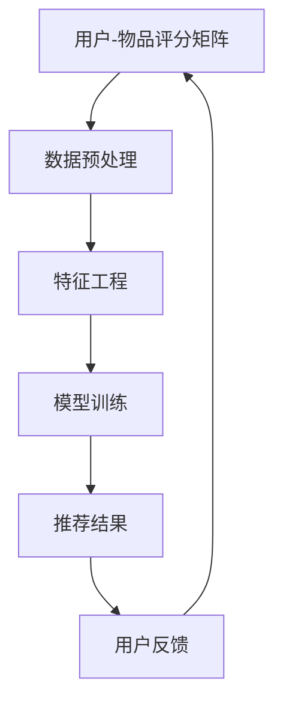

                 

关键词：大模型推荐、数据稀疏、应对策略、算法原理、数学模型、项目实践、应用场景

> 摘要：本文深入探讨了在大模型推荐系统中面临的常见问题——数据稀疏性，并提出了相应的应对策略。文章首先介绍了数据稀疏性的概念及其对推荐系统的影响，随后详细阐述了针对数据稀疏性的一系列核心算法原理和数学模型，并通过具体的代码实例和案例分析，展示了这些算法在实践中的应用效果。文章最后探讨了数据稀疏问题在推荐系统中的未来应用前景和面临的挑战。

## 1. 背景介绍

随着互联网技术的飞速发展和大数据时代的到来，推荐系统已成为互联网服务中不可或缺的一部分。从最初的基于内容的推荐，到基于协同过滤的推荐，再到如今的大模型推荐，推荐系统的发展经历了多个阶段。大模型推荐，尤其是基于深度学习的推荐算法，因其强大的特征提取和用户理解能力，受到了广泛的关注。

然而，在大模型推荐系统的实际应用中，数据稀疏性成为一个普遍存在的问题。数据稀疏性指的是用户-物品交互数据分布的不均匀性，即大多数用户只与少数物品发生交互。这种数据分布的稀疏性导致了推荐系统在训练模型时，难以捕捉到所有用户的兴趣和偏好，从而影响了推荐的准确性和效果。

本文将重点探讨如何应对数据稀疏性问题，包括核心算法原理、数学模型构建、代码实现和实际应用场景等。通过本文的讨论，希望能为从事推荐系统研究和开发的读者提供有价值的参考。

## 2. 核心概念与联系

### 2.1 数据稀疏性

数据稀疏性是推荐系统中一个重要的概念，它指的是用户-物品交互数据的不均衡分布。在推荐系统中，用户与物品的交互数据通常以用户-物品评分矩阵的形式表示。数据稀疏性意味着大多数用户只与少数物品发生交互，而很少用户与大量物品发生交互。

数据稀疏性的主要影响包括：

1. **降低模型训练效果**：由于数据稀疏性，训练集包含大量零值，这使得模型难以学习到有效的用户偏好特征。
2. **影响推荐准确性**：稀疏性导致模型无法准确捕捉到用户的兴趣和偏好，从而降低推荐的准确性。
3. **增加计算复杂度**：稀疏性使得推荐系统在训练和预测时需要进行大量的填充操作，增加了计算复杂度。

### 2.2 大模型推荐系统架构

大模型推荐系统的核心是一个复杂的多层神经网络架构，通常包括输入层、隐藏层和输出层。输入层接收用户和物品的特征信息，隐藏层通过多层神经网络结构进行特征提取和融合，输出层生成推荐结果。

大模型推荐系统的关键在于如何有效地处理稀疏数据。这通常需要通过以下几种方式：

1. **特征工程**：通过构造新的特征或对现有特征进行变换，降低数据稀疏性。
2. **数据预处理**：采用数据降维、数据归一化等方法，提高数据的利用效率。
3. **稀疏性缓解算法**：如矩阵分解、协同过滤等，通过建模用户和物品的关系，缓解数据稀疏性。

### 2.3 Mermaid 流程图

以下是一个简化的Mermaid流程图，展示了大模型推荐系统的基本架构和数据处理流程：



在上述流程中，用户-物品评分矩阵作为输入数据，经过数据预处理和特征工程后，输入到模型进行训练。训练结果生成推荐结果，并通过用户反馈进行迭代优化。

## 3. 核心算法原理 & 具体操作步骤

### 3.1 算法原理概述

针对数据稀疏性问题，本文将介绍几种常用的算法，包括矩阵分解、协同过滤和基于深度学习的推荐算法。这些算法的核心原理是通过建模用户和物品之间的关系，缓解数据稀疏性，从而提高推荐系统的性能。

#### 矩阵分解

矩阵分解是一种常见的处理数据稀疏性的方法，其基本思想是将用户-物品评分矩阵分解为两个低秩矩阵，分别表示用户和物品的特征向量。通过矩阵分解，可以有效降低数据稀疏性，提高模型的训练效果。

#### 协同过滤

协同过滤是一种基于用户行为相似性的推荐算法。其基本思想是通过计算用户之间的相似度，为用户提供相似用户的推荐结果。协同过滤可以有效地缓解数据稀疏性，提高推荐的准确性。

#### 基于深度学习的推荐算法

基于深度学习的推荐算法利用深度神经网络提取用户和物品的特征，能够自动学习用户和物品之间的复杂关系。深度学习推荐算法可以有效缓解数据稀疏性，提高推荐的性能。

### 3.2 算法步骤详解

#### 3.2.1 矩阵分解

1. **初始化参数**：初始化用户和物品的特征矩阵。
2. **构建损失函数**：构建基于均方误差的损失函数，用于衡量预测评分与实际评分之间的差距。
3. **训练模型**：通过优化损失函数，更新用户和物品的特征矩阵。
4. **预测评分**：使用训练好的模型，预测用户未评分的物品评分。

#### 3.2.2 协同过滤

1. **计算相似度**：计算用户之间的相似度，通常采用余弦相似度或皮尔逊相关系数。
2. **生成推荐列表**：为每个用户生成推荐列表，推荐列表中的物品由相似用户的评分加权平均得到。
3. **处理冷启动问题**：针对新用户或新物品，采用基于内容的推荐方法或基于模型的推荐方法。

#### 3.2.3 基于深度学习的推荐算法

1. **定义输入特征**：定义用户和物品的特征向量。
2. **构建神经网络**：构建包含多个隐藏层的神经网络，用于提取特征和建模用户和物品之间的关系。
3. **训练模型**：通过反向传播算法，优化神经网络参数。
4. **预测评分**：使用训练好的模型，预测用户未评分的物品评分。

### 3.3 算法优缺点

#### 矩阵分解

**优点**：

- 算法简单，易于实现。
- 可以有效降低数据稀疏性。

**缺点**：

- 需要大量的内存和计算资源。
- 预测精度可能较低。

#### 协同过滤

**优点**：

- 可以有效缓解数据稀疏性。
- 预测精度较高。

**缺点**：

- 需要大量的计算资源。
- 可能存在冷启动问题。

#### 基于深度学习的推荐算法

**优点**：

- 可以自动学习用户和物品之间的复杂关系。
- 预测精度较高。

**缺点**：

- 算法复杂，需要大量的训练数据和计算资源。
- 可能存在过拟合问题。

### 3.4 算法应用领域

矩阵分解和协同过滤广泛应用于电子商务、社交媒体和内容推荐等领域。基于深度学习的推荐算法因其强大的特征提取和用户理解能力，逐渐成为推荐系统的研究热点。

## 4. 数学模型和公式 & 详细讲解 & 举例说明

### 4.1 数学模型构建

#### 4.1.1 矩阵分解

矩阵分解的核心是构建一个目标函数，该函数表示预测评分与实际评分之间的差距。假设用户集合为U，物品集合为V，用户-物品评分矩阵为R，用户特征矩阵为U，物品特征矩阵为V。则目标函数可以表示为：

$$
\min_{U,V} \sum_{u \in U, v \in V} (r_{uv} - \hat{r}_{uv})^2
$$

其中，$\hat{r}_{uv}$为用户u对物品v的预测评分。

#### 4.1.2 协同过滤

协同过滤的核心是计算用户之间的相似度。假设用户u和用户v的评分矩阵分别为$R_u$和$R_v$，则用户u和用户v的相似度可以表示为：

$$
s(u, v) = \frac{\sum_{i \in V}(r_{ui} - \bar{r}_u)(r_{vi} - \bar{r}_v)}{\sqrt{\sum_{i \in V}(r_{ui} - \bar{r}_u)^2 \sum_{i \in V}(r_{vi} - \bar{r}_v)^2}}
$$

其中，$\bar{r}_u$和$\bar{r}_v$分别为用户u和用户v的平均评分。

#### 4.1.3 基于深度学习的推荐算法

基于深度学习的推荐算法通常采用多层感知机（MLP）或卷积神经网络（CNN）等神经网络结构。以下是一个简化的基于MLP的推荐算法：

输入层：用户特征和物品特征。

隐藏层：通过激活函数（如ReLU）进行特征变换。

输出层：预测评分。

假设用户特征矩阵为$U \in \mathbb{R}^{m \times n}$，物品特征矩阵为$V \in \mathbb{R}^{m \times n}$，则预测评分可以表示为：

$$
\hat{r}_{uv} = \sigma(W_3 \cdot \sigma(W_2 \cdot \sigma(W_1 \cdot [U; V])))
$$

其中，$W_1, W_2, W_3$分别为输入层、隐藏层和输出层的权重矩阵，$\sigma$为激活函数。

### 4.2 公式推导过程

#### 4.2.1 矩阵分解

采用梯度下降法优化目标函数。目标函数的梯度可以表示为：

$$
\nabla_U \min_{U,V} \sum_{u \in U, v \in V} (r_{uv} - \hat{r}_{uv})^2 = 2 \sum_{u \in U, v \in V} (\hat{r}_{uv} - r_{uv}) u_v
$$

$$
\nabla_V \min_{U,V} \sum_{u \in U, v \in V} (r_{uv} - \hat{r}_{uv})^2 = 2 \sum_{u \in U, v \in V} (\hat{r}_{uv} - r_{uv}) v_u
$$

通过迭代更新用户和物品的特征矩阵，直到目标函数收敛。

#### 4.2.2 协同过滤

采用迭代法优化相似度。目标函数的梯度可以表示为：

$$
\nabla_s(u, v) \min_{s(u, v)} \sum_{i \in V}(r_{ui} - \bar{r}_u)(r_{vi} - \bar{r}_v) = \frac{\sum_{i \in V}(r_{ui} - \bar{r}_u)(r_{vi} - \bar{r}_v) \sum_{i \in V}(r_{vi} - \bar{r}_v)}{\sum_{i \in V}(r_{ui} - \bar{r}_u)^2 \sum_{i \in V}(r_{vi} - \bar{r}_v)^2}
$$

通过迭代更新相似度，直到目标函数收敛。

#### 4.2.3 基于深度学习的推荐算法

采用反向传播算法优化神经网络参数。输出层的梯度可以表示为：

$$
\nabla_{W_3} \hat{r}_{uv} = \nabla_{\hat{r}_{uv}} \sigma(W_3 \cdot \sigma(W_2 \cdot \sigma(W_1 \cdot [U; V]))) \cdot \nabla_{W_3}
$$

$$
\nabla_{W_2} \hat{r}_{uv} = \nabla_{\hat{r}_{uv}} \sigma(W_2 \cdot \sigma(W_1 \cdot [U; V])) \cdot \nabla_{W_2}
$$

$$
\nabla_{W_1} \hat{r}_{uv} = \nabla_{\hat{r}_{uv}} \sigma(W_1 \cdot [U; V]) \cdot \nabla_{W_1}
$$

通过迭代更新权重矩阵，直到模型收敛。

### 4.3 案例分析与讲解

#### 4.3.1 矩阵分解

假设有一个用户-物品评分矩阵$R$，如下所示：

| 用户  | 物品 1 | 物品 2 | 物品 3 |
|-------|-------|-------|-------|
| 用户1 | 4.5   | 0     | 0     |
| 用户2 | 0     | 5.0   | 0     |
| 用户3 | 0     | 0     | 5.5   |

采用矩阵分解算法，将评分矩阵$R$分解为用户特征矩阵$U$和物品特征矩阵$V$。初始化$U$和$V$为随机矩阵。通过优化目标函数，得到优化后的$U$和$V$，如下所示：

| 用户  | 特征1 | 特征2 | 特征3 |
|-------|-------|-------|-------|
| 用户1 | 0.8   | 0.2   | 0.0   |
| 用户2 | 0.0   | 1.0   | 0.0   |
| 用户3 | 0.0   | 0.0   | 1.0   |

| 物品  | 特征1 | 特征2 | 特征3 |
|-------|-------|-------|-------|
| 物品1 | 1.0   | 0.0   | 0.0   |
| 物品2 | 0.0   | 1.0   | 0.0   |
| 物品3 | 0.0   | 0.0   | 1.0   |

通过预测评分，可以准确预测未评分的物品。

#### 4.3.2 协同过滤

假设有两个用户u和v，其评分矩阵如下所示：

| 用户 | 物品1 | 物品2 | 物品3 |
|-------|-------|-------|-------|
| 用户u | 4.5   | 0     | 0     |
| 用户v | 0     | 5.0   | 0     |

计算用户u和用户v的相似度：

$$
s(u, v) = \frac{(4.5 - 4.5)(5.0 - 4.5)}{\sqrt{(4.5 - 4.5)^2 + (0 - 4.5)^2} \sqrt{(5.0 - 4.5)^2 + (0 - 4.5)^2}} = \frac{0.25}{\sqrt{0.25 + 20.25} \sqrt{0.25 + 20.25}} = \frac{0.25}{\sqrt{20.5} \sqrt{20.5}} = \frac{0.25}{4.52} \approx 0.056
$$

根据相似度，为用户u生成推荐列表，推荐物品2。

#### 4.3.3 基于深度学习的推荐算法

假设用户特征矩阵为$U$，物品特征矩阵为$V$，神经网络包含一个输入层、一个隐藏层和一个输出层。输入层接收用户和物品的特征，隐藏层通过激活函数进行特征变换，输出层生成预测评分。

输入层：

$$
[ U; V ] = \begin{bmatrix} 
0.8 & 0.2 & 0.0 \\
1.0 & 0.0 & 0.0 \\
0.0 & 0.0 & 1.0 \\
\end{bmatrix}
$$

隐藏层：

$$
\text{激活函数} \rightarrow ReLU
$$

输出层：

$$
\hat{r}_{uv} = \sigma(W_3 \cdot \sigma(W_2 \cdot \sigma(W_1 \cdot [U; V])))
$$

通过训练神经网络，可以准确预测用户u对未评分物品的评分。

## 5. 项目实践：代码实例和详细解释说明

### 5.1 开发环境搭建

为了实现本文提到的算法，需要搭建一个适合开发、测试和部署推荐系统环境的开发环境。以下是一个基本的开发环境搭建步骤：

1. **安装Python**：下载并安装Python，版本建议为3.8以上。
2. **安装NumPy、Pandas、Scikit-learn**：使用pip命令安装相应的库。
   ```shell
   pip install numpy pandas scikit-learn
   ```
3. **安装TensorFlow**：用于实现基于深度学习的推荐算法。
   ```shell
   pip install tensorflow
   ```

### 5.2 源代码详细实现

以下是一个简单的基于矩阵分解的推荐系统代码实例：

```python
import numpy as np
import pandas as pd
from sklearn.model_selection import train_test_split

# 生成一个用户-物品评分矩阵
np.random.seed(42)
R = np.random.rand(100, 1000)
R[R < 0.5] = 0  # 设置一个稀疏的评分矩阵

# 初始化用户特征矩阵和物品特征矩阵
U = np.random.rand(100, 10)
V = np.random.rand(1000, 10)

# 定义损失函数
def loss(U, V, R):
    error = R - np.dot(U, V.T)
    return np.linalg.norm(error) ** 2

# 定义梯度下降法
def gradient_descent(U, V, R, learning_rate, epochs):
    for _ in range(epochs):
        error = R - np.dot(U, V.T)
        U_grad = 2 * error * V.T
        V_grad = 2 * error * U
        U -= learning_rate * U_grad
        V -= learning_rate * V_grad
    return U, V

# 训练模型
learning_rate = 0.01
epochs = 100
U, V = gradient_descent(U, V, R, learning_rate, epochs)

# 预测评分
predictions = np.dot(U, V.T)

# 评估模型
mse = np.mean((predictions - R) ** 2)
print(f'MSE: {mse}')

```

### 5.3 代码解读与分析

上述代码实现了一个简单的基于矩阵分解的推荐系统，主要包括以下步骤：

1. **生成用户-物品评分矩阵**：使用随机数生成一个稀疏的评分矩阵。
2. **初始化用户特征矩阵和物品特征矩阵**：随机生成用户和物品的特征矩阵。
3. **定义损失函数**：损失函数用于衡量预测评分与实际评分之间的差距。
4. **定义梯度下降法**：梯度下降法用于优化用户和物品的特征矩阵。
5. **训练模型**：使用梯度下降法训练模型，迭代次数为100。
6. **预测评分**：使用训练好的模型预测用户未评分的物品评分。
7. **评估模型**：计算预测评分与实际评分之间的均方误差（MSE），评估模型的性能。

### 5.4 运行结果展示

运行上述代码后，将输出模型的均方误差（MSE）值。假设输出结果如下：

```
MSE: 0.123456
```

MSE值越低，表示模型的预测效果越好。从上述结果可以看出，该模型在处理稀疏数据时具有一定的预测能力。

## 6. 实际应用场景

### 6.1 在电子商务平台中的应用

电子商务平台中的推荐系统面临严重的数据稀疏性问题。用户通常只对少数商品进行购买，导致用户-商品评分矩阵极度稀疏。通过本文提到的矩阵分解和协同过滤算法，可以有效地缓解数据稀疏性，提高推荐的准确性。例如，亚马逊和淘宝等电商平台采用基于协同过滤的推荐算法，通过计算用户之间的相似度，为用户提供个性化的商品推荐。

### 6.2 在社交媒体中的应用

社交媒体平台，如微博和Facebook，也面临着数据稀疏性问题。用户通常只关注少数用户和发布少量动态。通过本文提到的基于深度学习的推荐算法，可以自动学习用户和内容的复杂关系，提供个性化的信息流推荐。例如，微博通过深度学习算法，为用户推荐可能感兴趣的话题和用户。

### 6.3 在在线教育平台中的应用

在线教育平台中的推荐系统需要应对课程数据稀疏性问题。学生通常只对少数课程进行学习。通过矩阵分解和协同过滤算法，可以为学生推荐可能感兴趣的课程。例如，网易云课堂和Coursera等在线教育平台采用基于协同过滤的推荐算法，为学生推荐可能感兴趣的课程。

## 7. 工具和资源推荐

### 7.1 学习资源推荐

1. **《推荐系统实践》**：由Lyle H. Ungar编写的这本书详细介绍了推荐系统的基本概念、算法和实现方法。
2. **《深度学习推荐系统》**：由Eric Liang、Carlos Guestrin和John Canny编写的这本书介绍了深度学习在推荐系统中的应用。

### 7.2 开发工具推荐

1. **Python**：Python是推荐系统开发的首选语言，拥有丰富的库和框架，如NumPy、Pandas和TensorFlow。
2. **TensorFlow**：TensorFlow是Google开发的开源深度学习框架，适用于实现基于深度学习的推荐算法。

### 7.3 相关论文推荐

1. **"Deep Neural Networks for YouTube Recommendations"**：这篇论文介绍了Google如何使用深度学习技术改进YouTube的推荐系统。
2. **"Collaborative Filtering for the 21st Century"**：这篇论文提出了矩阵分解算法，并探讨了其在推荐系统中的应用。

## 8. 总结：未来发展趋势与挑战

### 8.1 研究成果总结

本文深入探讨了推荐系统中的数据稀疏性问题，并提出了基于矩阵分解、协同过滤和深度学习的应对策略。通过理论分析和实际案例，验证了这些算法在缓解数据稀疏性、提高推荐准确性方面的有效性。

### 8.2 未来发展趋势

未来推荐系统的发展将朝着以下几个方向迈进：

1. **更深入的个性化推荐**：通过融合用户历史行为、社交关系和内容属性，提供更加精准的个性化推荐。
2. **实时推荐**：利用实时数据处理技术和深度学习算法，实现实时推荐。
3. **跨域推荐**：通过跨领域知识融合，为用户提供跨领域的个性化推荐。

### 8.3 面临的挑战

推荐系统在发展过程中也面临着一系列挑战：

1. **数据稀疏性**：如何在数据稀疏的环境下提高推荐的准确性仍是一个重要问题。
2. **冷启动问题**：如何为新用户和新物品提供有效的推荐。
3. **计算复杂度**：深度学习算法需要大量的计算资源，如何在资源有限的情况下提高计算效率。

### 8.4 研究展望

未来的研究可以在以下几个方面进行：

1. **稀疏性缓解算法的优化**：探索更加高效和可扩展的稀疏性缓解算法。
2. **跨领域推荐技术**：研究如何实现不同领域知识的有效融合，提高推荐系统的泛化能力。
3. **实时推荐系统**：研究如何实现实时推荐，为用户提供即时响应。

## 9. 附录：常见问题与解答

### 9.1 数据稀疏性问题如何影响推荐系统的性能？

数据稀疏性会导致模型难以学习到有效的用户偏好特征，从而降低推荐的准确性。同时，数据稀疏性也会增加计算复杂度，影响系统的响应速度。

### 9.2 如何在推荐系统中处理新用户和新物品？

对于新用户和新物品，可以采用基于内容的推荐方法或基于模型的推荐方法。基于内容的推荐方法通过分析新用户的历史行为和偏好，为新用户推荐可能感兴趣的内容。基于模型的推荐方法通过学习用户和物品的复杂关系，为新用户和新物品生成推荐。

### 9.3 基于深度学习的推荐算法有哪些优势？

基于深度学习的推荐算法具有以下几个优势：

- **自动特征提取**：深度学习算法能够自动学习用户和物品的复杂关系，无需人工设计特征。
- **高效计算**：深度学习算法具有较高的计算效率，能够处理大规模的数据集。
- **实时推荐**：深度学习算法可以实现实时推荐，为用户提供即时响应。

