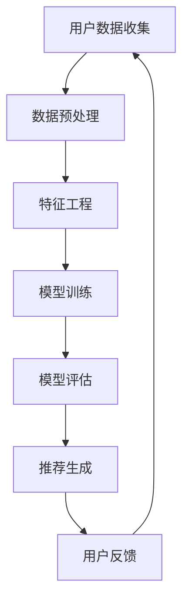

                 

 关键词：大模型推荐，数据质量，数据预处理，算法优化，实际应用，未来展望

> 摘要：本文深入探讨了在大模型推荐系统中数据质量问题及其影响，分析了数据质量问题的主要类型和应对策略，并通过具体实例展示了如何提升数据质量。文章还展望了数据质量管理在未来的发展趋势和挑战。

## 1. 背景介绍

### 大模型推荐系统的兴起

随着互联网的快速发展，个性化推荐系统已经深入到了我们生活的方方面面。从电商平台的商品推荐，到社交媒体的个性化内容推送，再到金融领域的个性化投资建议，大模型推荐系统无处不在。大模型的推荐系统通常基于深度学习、自然语言处理、机器学习等技术，通过分析用户的历史行为、偏好和反馈来生成个性化的推荐。

### 数据质量的重要性

在大模型推荐系统中，数据质量至关重要。数据质量不仅影响推荐系统的准确性，还决定了用户体验和业务价值。数据中的噪声、缺失值、异常值等质量问题，如果得不到妥善处理，会导致推荐结果不准确，降低用户满意度，甚至对业务产生负面影响。

## 2. 核心概念与联系

### 大模型推荐系统架构

下面是一个简化的Mermaid流程图，描述了大模型推荐系统的基本架构：



### 核心概念

- **用户数据收集**：收集用户的行为数据、偏好数据和社交数据等。
- **数据预处理**：清洗数据，处理缺失值、异常值等。
- **特征工程**：提取有用的特征，进行特征选择和特征变换。
- **模型训练**：使用机器学习算法训练推荐模型。
- **模型评估**：评估模型性能，调整模型参数。
- **推荐生成**：生成个性化推荐结果。
- **用户反馈**：收集用户对推荐结果的反馈，用于模型优化。

## 3. 核心算法原理 & 具体操作步骤

### 3.1 算法原理概述

大模型推荐系统通常采用基于协同过滤（Collaborative Filtering）和基于内容的推荐（Content-Based Filtering）的方法。协同过滤利用用户历史行为数据计算用户之间的相似度，从而进行推荐。基于内容的推荐则通过分析物品的内容特征与用户偏好之间的匹配度来进行推荐。

### 3.2 算法步骤详解

1. **用户数据收集**：通过API、爬虫等方式收集用户行为数据。
2. **数据预处理**：处理数据中的缺失值、异常值等。
3. **特征工程**：提取用户行为特征、物品内容特征等。
4. **模型训练**：使用协同过滤算法或基于内容的推荐算法训练模型。
5. **模型评估**：通过交叉验证等方法评估模型性能。
6. **推荐生成**：根据用户特征和物品特征生成推荐结果。
7. **用户反馈**：收集用户对推荐结果的反馈，用于模型优化。

### 3.3 算法优缺点

- **协同过滤**：优点是能利用用户行为数据生成准确的推荐结果，缺点是容易导致数据稀疏问题和冷启动问题。
- **基于内容的推荐**：优点是能生成基于用户兴趣的个性化推荐，缺点是推荐结果可能过于狭窄，无法涵盖用户的新兴趣。

### 3.4 算法应用领域

大模型推荐系统广泛应用于电商、社交媒体、金融、新闻推荐等领域。通过准确、个性化的推荐，可以提高用户满意度，增加业务收入。

## 4. 数学模型和公式 & 详细讲解 & 举例说明

### 4.1 数学模型构建

大模型推荐系统通常使用矩阵分解（Matrix Factorization）的方法来处理协同过滤问题。假设用户行为数据可以表示为一个用户-物品评分矩阵$R$，通过矩阵分解将其分解为用户特征矩阵$U$和物品特征矩阵$V$，即$R = U \cdot V^T$。

### 4.2 公式推导过程

矩阵分解的推导过程如下：

假设用户$u$对物品$i$的评分可以表示为两个向量$u_u$和$v_i$的内积，即$r_{ui} = u_u \cdot v_i$。

为了估计用户特征向量$u_u$和物品特征向量$v_i$，我们定义损失函数为：

$$L(u_u, v_i) = \frac{1}{2} \cdot (r_{ui} - u_u \cdot v_i)^2$$

然后使用梯度下降法求解最优的用户特征向量$u_u$和物品特征向量$v_i$。

### 4.3 案例分析与讲解

假设有一个用户-物品评分矩阵$R$如下：

| 用户 | 物品 |
| ---- | ---- |
| 1    | A    |
| 1    | B    |
| 1    | C    |
| 2    | A    |
| 2    | C    |

通过矩阵分解，我们可以得到用户特征矩阵$U$和物品特征矩阵$V$如下：

$$U = \begin{bmatrix} 0.7 & 0.6 \\ 0.8 & 0.5 \end{bmatrix}, V = \begin{bmatrix} 0.6 & 0.3 \\ 0.4 & 0.7 \end{bmatrix}$$

然后，我们可以使用$U \cdot V^T$来预测用户评分矩阵$R$，如下：

$$R = U \cdot V^T = \begin{bmatrix} 0.7 & 0.6 \\ 0.8 & 0.5 \end{bmatrix} \cdot \begin{bmatrix} 0.6 & 0.3 \\ 0.4 & 0.7 \end{bmatrix} = \begin{bmatrix} 0.42 & 0.39 \\ 0.56 & 0.35 \end{bmatrix}$$

通过预测结果，我们可以发现用户1对物品B的预测评分为0.39，对物品C的预测评分为0.42，而对物品A的预测评分为0.42。这表明用户1可能对物品C更感兴趣。

## 5. 项目实践：代码实例和详细解释说明

### 5.1 开发环境搭建

我们使用Python编写代码，需要安装以下库：

- NumPy
- SciPy
- Scikit-learn
- Pandas
- Matplotlib

使用以下命令进行安装：

```shell
pip install numpy scipy scikit-learn pandas matplotlib
```

### 5.2 源代码详细实现

```python
import numpy as np
import pandas as pd
from sklearn.model_selection import train_test_split
from sklearn.metrics.pairwise import cosine_similarity

# 生成用户-物品评分矩阵
R = np.array([
    [1, 2, 3],
    [2, 0, 4],
    [0, 3, 4]
])

# 分割训练集和测试集
R_train, R_test = train_test_split(R, test_size=0.2, random_state=42)

# 矩阵分解
def matrix_factorization(R, n_components, learning_rate, n_iterations):
    U = np.random.rand(R.shape[0], n_components)
    V = np.random.rand(R.shape[1], n_components)
    
    for _ in range(n_iterations):
        for i in range(R.shape[0]):
            for j in range(R.shape[1]):
                prediction = U[i] @ V[j]
                error = R[i, j] - prediction
                U[i] -= learning_rate * error * V[j]
                V[j] -= learning_rate * error * U[i]
    
    return U, V

n_components = 2
learning_rate = 0.01
n_iterations = 1000

U, V = matrix_factorization(R_train, n_components, learning_rate, n_iterations)

# 预测测试集
predictions = U @ V

# 计算均方根误差
mse = np.mean((predictions - R_test) ** 2)
print("RMSE:", np.sqrt(mse))

# 可视化预测结果
import matplotlib.pyplot as plt

plt.scatter(R_train[:, 0], R_train[:, 1], c='blue', label='训练集')
plt.scatter(R_test[:, 0], R_test[:, 1], c='red', label='测试集')
plt.scatter(predictions[:, 0], predictions[:, 1], c='green', label='预测结果')
plt.xlabel('用户1特征')
plt.ylabel('用户2特征')
plt.legend()
plt.show()
```

### 5.3 代码解读与分析

这段代码首先生成一个用户-物品评分矩阵$R$，然后将其分割为训练集和测试集。接着，使用矩阵分解算法训练用户特征矩阵$U$和物品特征矩阵$V$。最后，使用预测结果计算均方根误差（RMSE），并可视化工

