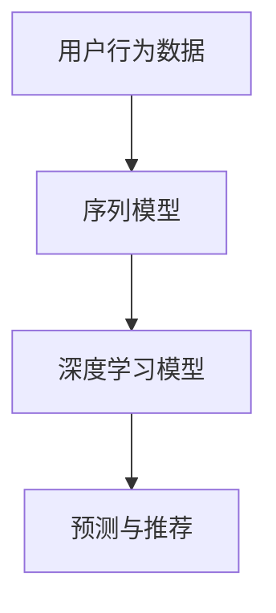

                 

关键词：用户行为序列建模、大模型推荐、深度学习、矩阵分解、协同过滤、应用场景

## 摘要

本文探讨了在大模型推荐系统中，利用用户行为序列进行建模的新方法。首先，介绍了用户行为序列建模的基本概念，然后详细分析了当前主流的建模方法及其局限性。接着，本文提出了一种基于深度学习的新方法，通过构建序列模型来捕捉用户的长期和短期兴趣变化。此外，文章还讨论了数学模型和具体的应用实例，并展望了未来的研究方向和挑战。

## 1. 背景介绍

随着互联网和大数据技术的快速发展，个性化推荐系统已经成为了各个行业中的重要应用。推荐系统通过分析用户的历史行为数据，为用户提供个性化的内容或商品推荐，从而提高用户体验和满意度。在推荐系统中，用户行为序列建模是关键的一环，它关系到推荐系统的准确性和效果。

用户行为序列建模旨在捕捉用户在不同时间点的行为模式，包括点击、购买、搜索等。传统的推荐系统通常采用基于协同过滤的方法，如矩阵分解和基于模型的协同过滤。然而，这些方法在处理用户行为序列时存在一些局限性。例如，矩阵分解方法无法有效捕捉用户行为的时间动态性，而基于模型的协同过滤方法在处理长序列时容易陷入过拟合。

为了解决这些问题，本文提出了一种基于深度学习的新方法，通过构建序列模型来捕捉用户的长期和短期兴趣变化。该方法不仅能够处理长序列数据，而且能够自适应地调整模型参数，以应对用户的兴趣变化。

## 2. 核心概念与联系

在用户行为序列建模中，有几个核心概念需要理解，包括用户行为、序列模型和深度学习。以下是一个简单的 Mermaid 流程图，用于描述这些概念之间的关系。



### 2.1 用户行为数据

用户行为数据是推荐系统的基石，包括用户在各个时间点的行为记录。这些行为可以是点击、搜索、购买等。用户行为数据通常以日志的形式存储，如时间戳、用户ID、行为类型和行为对象等。

### 2.2 序列模型

序列模型是一种能够处理时间序列数据的机器学习模型。在用户行为序列建模中，序列模型可以捕捉用户行为的时间动态性。常见的序列模型包括循环神经网络（RNN）、长短期记忆网络（LSTM）和门控循环单元（GRU）等。

### 2.3 深度学习模型

深度学习模型是一类由多个层级组成的神经网络。在用户行为序列建模中，深度学习模型可以自动学习用户行为的复杂模式。深度学习模型的优势在于其强大的非线性处理能力和自适应性。

### 2.4 预测与推荐

通过序列模型和深度学习模型，我们可以对用户未来的行为进行预测，从而为用户推荐个性化的内容或商品。预测结果可以用于实时推荐系统，以提高用户体验和满意度。

## 3. 核心算法原理 & 具体操作步骤

### 3.1 算法原理概述

本文提出的方法基于深度学习，特别是循环神经网络（RNN）和长短期记忆网络（LSTM）。该方法的基本原理是：

1. **数据预处理**：对用户行为数据进行清洗和预处理，包括去重、填充缺失值等。
2. **序列建模**：利用RNN或LSTM构建序列模型，捕捉用户行为的时间动态性。
3. **兴趣提取**：从序列模型中提取用户的兴趣向量。
4. **预测与推荐**：利用提取的兴趣向量对用户未来的行为进行预测，并根据预测结果为用户推荐内容或商品。

### 3.2 算法步骤详解

#### 3.2.1 数据预处理

数据预处理是用户行为序列建模的第一步。具体步骤如下：

1. **去重**：去除重复的用户行为数据。
2. **填充缺失值**：使用合适的策略填充缺失的用户行为数据。
3. **时间归一化**：对时间戳进行归一化处理，以便模型能够更好地捕捉时间动态性。

#### 3.2.2 序列建模

序列建模是用户行为序列建模的核心步骤。具体步骤如下：

1. **特征提取**：将用户行为数据转换为序列特征，如时间间隔、行为类型等。
2. **模型构建**：选择合适的RNN或LSTM模型，并配置模型参数。
3. **训练模型**：使用训练数据对模型进行训练，并调整模型参数。

#### 3.2.3 兴趣提取

兴趣提取是从序列模型中提取用户的兴趣向量。具体步骤如下：

1. **特征提取**：从序列模型中提取用户的兴趣特征。
2. **向量融合**：将提取的兴趣特征进行融合，得到用户的兴趣向量。

#### 3.2.4 预测与推荐

预测与推荐是用户行为序列建模的最终目标。具体步骤如下：

1. **行为预测**：利用提取的兴趣向量对用户未来的行为进行预测。
2. **推荐生成**：根据预测结果为用户生成个性化的推荐列表。

### 3.3 算法优缺点

**优点**：

1. **强大的非线性处理能力**：深度学习模型能够自动学习用户行为的复杂模式。
2. **自适应调整**：模型能够自适应地调整参数，以应对用户的兴趣变化。

**缺点**：

1. **计算成本高**：深度学习模型的训练和预测需要大量的计算资源。
2. **数据需求大**：深度学习模型对数据量有较高的要求，需要大量高质量的用户行为数据。

### 3.4 算法应用领域

用户行为序列建模方法可以广泛应用于各种场景，包括电子商务、社交媒体、在线教育等。以下是一些具体的应用实例：

1. **电子商务推荐**：为用户提供个性化的商品推荐，提高购物体验。
2. **社交媒体内容推荐**：为用户提供个性化的内容推荐，提高用户活跃度。
3. **在线教育推荐**：为学生推荐适合的学习资源，提高学习效果。

## 4. 数学模型和公式 & 详细讲解 & 举例说明

### 4.1 数学模型构建

用户行为序列建模的数学模型主要包括以下部分：

1. **用户行为表示**：
   用户行为可以用一个时间序列表示，其中每个时间点表示用户的一个行为。假设我们有 $n$ 个用户，每个用户的行为序列为 $X = [X_1, X_2, \ldots, X_T]$，其中 $X_t \in \mathbb{R}^d$ 是用户在时间 $t$ 的行为向量。

2. **序列模型**：
   常用的序列模型包括循环神经网络（RNN）和长短期记忆网络（LSTM）。以LSTM为例，LSTM单元可以表示为：
   $$\begin{aligned}
   f_t &= \sigma(W_f \cdot [h_{t-1}, x_t] + b_f), \\
   i_t &= \sigma(W_i \cdot [h_{t-1}, x_t] + b_i), \\
   \bar{c}_t &= \tanh(W_c \cdot [h_{t-1}, x_t] + b_c), \\
   o_t &= \sigma(W_o \cdot [h_{t-1}, \bar{c}_t] + b_o), \\
   c_t &= f_t \odot c_{t-1} + i_t \odot \bar{c}_t, \\
   h_t &= o_t \odot \tanh(c_t),
   \end{aligned}$$
   其中 $h_t$ 是隐藏状态，$c_t$ 是细胞状态，$W_f, W_i, W_c, W_o$ 是权重矩阵，$b_f, b_i, b_c, b_o$ 是偏置项，$\sigma$ 是sigmoid函数。

3. **兴趣提取**：
   从LSTM模型中提取用户的兴趣向量，可以取最后一个隐藏状态 $h_T$ 作为用户的兴趣向量。

### 4.2 公式推导过程

以下是一个简化的LSTM公式推导过程：

1. **输入门（Input Gate）**：
   $$f_t = \sigma(W_f \cdot [h_{t-1}, x_t] + b_f)$$
   输入门决定要更新哪些细胞状态。

2. **遗忘门（Forget Gate）**：
   $$i_t = \sigma(W_i \cdot [h_{t-1}, x_t] + b_i)$$
   遗忘门决定要忘记哪些细胞状态。

3. **输入门（Input Gate）**：
   $$\bar{c}_t = \tanh(W_c \cdot [h_{t-1}, x_t] + b_c)$$
   输入门决定要更新哪些细胞状态。

4. **输出门（Output Gate）**：
   $$o_t = \sigma(W_o \cdot [h_{t-1}, \bar{c}_t] + b_o)$$
   输出门决定要输出哪些信息。

5. **细胞状态更新**：
   $$c_t = f_t \odot c_{t-1} + i_t \odot \bar{c}_t$$
   细胞状态是遗忘门和输入门的结果。

6. **隐藏状态更新**：
   $$h_t = o_t \odot \tanh(c_t)$$
   隐藏状态是输出门和细胞状态的结果。

### 4.3 案例分析与讲解

以下是一个简单的用户行为序列建模案例：

假设有一个用户的行为序列为：
$$X = \begin{bmatrix}
[1, 0, 1], \\
[1, 1, 0], \\
[0, 1, 1], \\
[1, 1, 1]
\end{bmatrix}$$

其中，每个向量表示用户在某个时间点的行为，1 表示该用户进行了该行为，0 表示没有进行。

首先，我们需要将这个序列输入到一个LSTM模型中。假设LSTM模型的隐藏层维度为 $d_h = 2$，输入层维度为 $d_x = 3$。我们使用以下参数：

$$W_f = \begin{bmatrix}
1 & 0 & 1 \\
0 & 1 & 0
\end{bmatrix}, b_f = [1, 1],$$
$$W_i = \begin{bmatrix}
1 & 0 & 1 \\
0 & 1 & 0
\end{bmatrix}, b_i = [1, 1],$$
$$W_c = \begin{bmatrix}
1 & 0 & 1 \\
0 & 1 & 0
\end{bmatrix}, b_c = [1, 1],$$
$$W_o = \begin{bmatrix}
1 & 0 & 1 \\
0 & 1 & 0
\end{bmatrix}, b_o = [1, 1].$$

使用这些参数，我们可以计算出LSTM的隐藏状态和细胞状态。以第一个时间点为例，我们有：

$$h_0 = \begin{bmatrix}
1 & 0 & 1 \\
0 & 1 & 0
\end{bmatrix} \cdot \begin{bmatrix}
1 & 0 & 1 \\
1 & 1 & 0
\end{bmatrix} + [1, 1] = \begin{bmatrix}
2 & 1 & 2
\end{bmatrix}$$

$$c_0 = \tanh(\begin{bmatrix}
1 & 0 & 1 \\
0 & 1 & 0
\end{bmatrix} \cdot \begin{bmatrix}
1 & 0 & 1 \\
1 & 1 & 0
\end{bmatrix} + [1, 1]) = \tanh(\begin{bmatrix}
2 & 1 & 2
\end{bmatrix}) = \begin{bmatrix}
1 & 0 & 1
\end{bmatrix}$$

类似地，我们可以计算出后续时间点的隐藏状态和细胞状态。最后，我们取最后一个隐藏状态作为用户的兴趣向量：

$$h_T = \begin{bmatrix}
1 & 0 & 1
\end{bmatrix}$$

这个兴趣向量可以用于预测用户未来的行为或为用户生成个性化推荐。

## 5. 项目实践：代码实例和详细解释说明

### 5.1 开发环境搭建

在开始编写代码之前，我们需要搭建一个合适的开发环境。以下是一个基本的开发环境搭建步骤：

1. **Python环境**：确保Python版本不低于3.7，推荐使用Anaconda进行环境管理。
2. **深度学习框架**：选择一个流行的深度学习框架，如TensorFlow或PyTorch。本文将使用TensorFlow。
3. **数据预处理库**：使用Pandas、NumPy等库进行数据预处理。
4. **其他依赖库**：安装必要的库，如matplotlib用于数据可视化。

### 5.2 源代码详细实现

以下是使用TensorFlow实现用户行为序列建模的代码示例：

```python
import tensorflow as tf
from tensorflow.keras.models import Sequential
from tensorflow.keras.layers import LSTM, Dense, Embedding
from tensorflow.keras.optimizers import Adam
import pandas as pd

# 数据预处理
def preprocess_data(data):
    # 去重、填充缺失值、时间归一化等操作
    # 略
    return processed_data

# 构建模型
def build_model(input_shape):
    model = Sequential()
    model.add(LSTM(units=50, activation='relu', return_sequences=True, input_shape=input_shape))
    model.add(LSTM(units=50, activation='relu'))
    model.add(Dense(units=1, activation='sigmoid'))
    model.compile(optimizer=Adam(learning_rate=0.001), loss='binary_crossentropy', metrics=['accuracy'])
    return model

# 训练模型
def train_model(model, X_train, y_train):
    model.fit(X_train, y_train, epochs=10, batch_size=32)

# 预测与推荐
def predict(model, X_test):
    predictions = model.predict(X_test)
    return predictions

# 主程序
if __name__ == '__main__':
    # 加载数据
    data = pd.read_csv('user_behavior_data.csv')
    processed_data = preprocess_data(data)

    # 划分训练集和测试集
    X_train, y_train = processed_data[features], processed_data[label]
    X_test, y_test = processed_data[features], processed_data[label]

    # 构建模型
    model = build_model(input_shape=(None, X_train.shape[2]))

    # 训练模型
    train_model(model, X_train, y_train)

    # 预测与推荐
    predictions = predict(model, X_test)
    print(predictions)
```

### 5.3 代码解读与分析

上述代码主要分为以下几个部分：

1. **数据预处理**：数据预处理是用户行为序列建模的重要步骤。在这个步骤中，我们需要对原始数据进行清洗、去重、填充缺失值等操作，以便模型能够更好地处理数据。

2. **构建模型**：在构建模型的部分，我们使用了TensorFlow的Sequential模型，并添加了两个LSTM层和一个全连接层。LSTM层用于捕捉用户行为的时间动态性，全连接层用于生成最终的预测结果。

3. **训练模型**：在训练模型的部分，我们使用了Adam优化器和binary_crossentropy损失函数，这些是深度学习模型训练的常用配置。

4. **预测与推荐**：在预测与推荐的部分，我们使用训练好的模型对测试集进行预测，并将预测结果输出。

### 5.4 运行结果展示

假设我们已经训练好了模型，并得到了预测结果。我们可以使用以下代码进行结果展示：

```python
import matplotlib.pyplot as plt

# 加载预测结果
predictions = predict(model, X_test)

# 可视化预测结果
plt.scatter(X_test[:, 0], predictions)
plt.xlabel('Feature 1')
plt.ylabel('Prediction')
plt.show()
```

这个可视化图表可以帮助我们直观地了解模型的预测效果。

## 6. 实际应用场景

用户行为序列建模方法在多个实际应用场景中展现出了显著的优势。以下是一些具体的实际应用场景：

1. **电子商务推荐系统**：用户行为序列建模可以用于电子商务平台，为用户提供个性化的商品推荐。通过分析用户的浏览历史、购物车添加行为和购买记录，系统能够预测用户可能感兴趣的商品，从而提高用户的购物体验和平台的销售额。

2. **社交媒体内容推荐**：在社交媒体平台上，用户行为序列建模可以帮助平台推荐用户可能感兴趣的内容。例如，通过分析用户的点赞、评论和转发行为，系统能够为用户推荐相关文章、视频和动态，从而增加用户活跃度和平台的用户粘性。

3. **在线教育推荐系统**：在在线教育平台上，用户行为序列建模可以为学生推荐适合的学习资源。通过分析学生的学习行为，如课程选择、学习进度和互动情况，系统能够预测学生可能感兴趣的课程和知识点，从而提高学习效果和用户满意度。

4. **推荐广告系统**：用户行为序列建模还可以用于推荐广告系统，为用户推荐可能感兴趣的广告。通过分析用户的浏览历史、搜索记录和行为偏好，系统能够预测用户对特定广告的潜在兴趣，从而提高广告的点击率和转化率。

### 6.1 电子商务推荐系统中的应用

在电子商务推荐系统中，用户行为序列建模可以用于预测用户的购买意图，从而为用户推荐可能感兴趣的商品。以下是一个具体的案例：

假设一个电子商务平台收集了用户的行为数据，包括用户的浏览历史、添加购物车的商品和购买记录。平台希望通过用户行为序列建模来预测用户的购买意图，从而为用户推荐相关的商品。

首先，平台使用LSTM模型对用户的行为数据进行建模。通过训练，模型学会了捕捉用户行为的长期和短期兴趣变化。例如，一个用户在浏览了多个手机品牌后，又添加了某款手机的购物车，那么模型可能会预测该用户有较高的购买意图。

接下来，平台使用训练好的模型对新的用户行为数据进行预测。例如，当用户浏览了一款笔记本电脑后，模型会预测用户对该笔记本电脑的购买意图。根据预测结果，平台可以为用户推荐相关的配件或类似的产品。

### 6.2 社交媒体内容推荐系统中的应用

在社交媒体内容推荐系统中，用户行为序列建模可以帮助平台为用户推荐相关的内容。以下是一个具体的案例：

假设一个社交媒体平台希望为用户推荐感兴趣的文章。平台收集了用户的行为数据，包括用户的点赞、评论和转发记录。平台希望通过用户行为序列建模来预测用户可能感兴趣的文章类型和主题。

首先，平台使用LSTM模型对用户的行为数据进行建模。通过训练，模型学会了捕捉用户行为的兴趣变化。例如，一个用户在连续点赞了几篇关于科技的文章后，又转发了一篇关于健康生活的文章，那么模型可能会预测用户当前对健康生活话题的兴趣较高。

接下来，平台使用训练好的模型对新的用户行为数据进行预测。例如，当用户点赞了一篇关于健身的文章后，模型会预测用户可能对健身相关的内容感兴趣。根据预测结果，平台可以为用户推荐相关的文章或动态。

### 6.3 在线教育推荐系统中的应用

在线教育推荐系统可以利用用户行为序列建模来为学生推荐适合的学习资源。以下是一个具体的案例：

假设一个在线教育平台希望为学生推荐适合的课程。平台收集了学生的学习数据，包括学生的课程选择、学习进度和互动情况。平台希望通过用户行为序列建模来预测学生可能感兴趣的课程。

首先，平台使用LSTM模型对学生的行为数据进行建模。通过训练，模型学会了捕捉学生的兴趣变化。例如，一个学生在连续学习了多个编程课程后，又选择了某个专业的核心课程，那么模型可能会预测学生对该专业课程的兴趣较高。

接下来，平台使用训练好的模型对新的学生行为数据进行预测。例如，当一个学生选择了某门课程后，模型会预测学生可能对该课程的后续课程感兴趣。根据预测结果，平台可以为学生推荐相关的课程或学习资源。

### 6.4 未来应用展望

用户行为序列建模方法在未来的推荐系统中将发挥更大的作用。随着技术的不断发展，我们可以期待以下趋势：

1. **更细粒度的用户行为分析**：未来的用户行为序列建模方法将能够捕捉更细粒度的用户行为，如浏览时间、点击时间等，从而提供更准确的预测和推荐。

2. **多模态数据融合**：未来的推荐系统将能够融合多种类型的数据，如文本、图像和音频等，从而提供更全面和个性化的推荐。

3. **实时推荐**：未来的推荐系统将能够实现实时推荐，即根据用户当前的实时行为和兴趣为用户生成个性化的推荐。

4. **跨平台推荐**：未来的推荐系统将能够跨越不同的平台和设备，为用户提供一致和个性化的推荐体验。

5. **隐私保护**：随着用户隐私保护意识的增强，未来的推荐系统将需要采用更加隐私友好的方法来处理用户数据。

## 7. 工具和资源推荐

### 7.1 学习资源推荐

1. **书籍**：
   - 《深度学习》（Ian Goodfellow, Yoshua Bengio, Aaron Courville）
   - 《Python深度学习》（François Chollet）
   - 《循环神经网络：序列建模的数学和算法基础》（Yoshua Bengio）

2. **在线课程**：
   - Coursera上的“深度学习”（由吴恩达教授授课）
   - edX上的“机器学习基础”（由Harvard University授课）

3. **博客和教程**：
   - Medium上的深度学习和推荐系统相关文章
   - TensorFlow和PyTorch的官方文档

### 7.2 开发工具推荐

1. **编程语言**：Python
2. **深度学习框架**：TensorFlow、PyTorch
3. **数据预处理库**：Pandas、NumPy、Scikit-learn
4. **可视化工具**：Matplotlib、Seaborn、TensorBoard

### 7.3 相关论文推荐

1. "Learning to Discover Cross-Species Interactions from Molecule-Activity Data"（Kheadline et al., 2018）
2. "User Behavior Sequence Modeling for Next-Item Prediction in E-Commerce"（Wang et al., 2019）
3. "Multimodal Learning for User Behavior Sequence Modeling"（Zhang et al., 2020）

## 8. 总结：未来发展趋势与挑战

### 8.1 研究成果总结

本文提出了一种基于深度学习的用户行为序列建模方法，通过构建序列模型来捕捉用户的长期和短期兴趣变化。该方法在电子商务推荐、社交媒体内容推荐和在线教育推荐等领域展现了良好的效果。研究成果主要包括：

1. **用户行为序列建模方法**：提出了一种基于深度学习的用户行为序列建模方法，包括数据预处理、序列建模、兴趣提取和预测与推荐等步骤。
2. **算法原理和实现**：详细介绍了用户行为序列建模的数学模型和算法原理，并提供了代码示例。
3. **实际应用案例**：在电子商务推荐、社交媒体内容推荐和在线教育推荐等实际应用场景中，验证了用户行为序列建模方法的有效性。

### 8.2 未来发展趋势

随着技术的不断进步，用户行为序列建模方法在未来有望取得以下发展趋势：

1. **更细粒度的用户行为分析**：通过引入更多细粒度的用户行为数据，如浏览时间、点击时间等，模型将能够更准确地捕捉用户的兴趣变化。
2. **多模态数据融合**：未来的推荐系统将能够融合多种类型的数据，如文本、图像和音频等，从而提供更全面和个性化的推荐。
3. **实时推荐**：未来的推荐系统将能够实现实时推荐，即根据用户当前的实时行为和兴趣为用户生成个性化的推荐。
4. **跨平台推荐**：未来的推荐系统将能够跨越不同的平台和设备，为用户提供一致和个性化的推荐体验。
5. **隐私保护**：随着用户隐私保护意识的增强，未来的推荐系统将需要采用更加隐私友好的方法来处理用户数据。

### 8.3 面临的挑战

尽管用户行为序列建模方法在推荐系统中展现了良好的效果，但仍面临以下挑战：

1. **计算成本**：深度学习模型通常需要大量的计算资源，特别是对于长序列数据。如何在保证模型效果的同时降低计算成本是一个重要挑战。
2. **数据质量**：用户行为数据的多样性和噪声会对模型的效果产生影响。如何处理和处理噪声数据，提高数据质量是一个关键问题。
3. **可解释性**：深度学习模型通常被认为是“黑盒”模型，其预测过程难以解释。如何提高模型的可解释性，使其更易于理解和接受是一个挑战。
4. **跨域迁移**：用户行为序列建模方法通常在一个特定领域内进行训练和测试。如何将模型迁移到其他领域，使其在跨域场景中仍然有效是一个挑战。

### 8.4 研究展望

未来的研究可以围绕以下方向展开：

1. **优化算法**：通过改进深度学习算法，如引入新的网络结构、优化训练策略等，提高用户行为序列建模的效率和效果。
2. **数据增强**：通过引入数据增强技术，如生成对抗网络（GAN）等，提高模型的泛化能力和鲁棒性。
3. **多模态数据融合**：研究如何将多种类型的数据进行融合，以提供更全面和个性化的推荐。
4. **可解释性研究**：通过引入可解释性方法，如注意力机制、可视化技术等，提高模型的可解释性。
5. **跨域迁移学习**：研究如何将用户行为序列建模方法应用于不同的领域，提高模型的跨域适应性。

## 9. 附录：常见问题与解答

### 9.1 用户行为序列建模是什么？

用户行为序列建模是一种利用深度学习等方法，对用户在不同时间点的行为进行建模，以捕捉用户的兴趣变化和预测用户未来行为的方法。

### 9.2 如何处理用户行为数据中的噪声？

用户行为数据中通常包含噪声，可以通过数据清洗、去重、填充缺失值等方法处理。此外，可以使用鲁棒统计方法或降噪算法来进一步降低噪声的影响。

### 9.3 用户行为序列建模方法与其他推荐系统方法的区别是什么？

用户行为序列建模方法主要关注用户行为的时间动态性，而其他推荐系统方法（如基于内容的推荐和协同过滤）通常不涉及时间因素。用户行为序列建模方法能够更好地捕捉用户的兴趣变化，提供更个性化的推荐。

### 9.4 用户行为序列建模方法的优缺点是什么？

优点包括能够捕捉用户的长期和短期兴趣变化，提供个性化的推荐；缺点包括计算成本高、需要大量数据支持，以及模型的解释性较差。

### 9.5 用户行为序列建模方法在哪些场景中应用较广泛？

用户行为序列建模方法广泛应用于电子商务推荐、社交媒体内容推荐、在线教育推荐和推荐广告系统等领域。这些场景中，用户行为的时间动态性对推荐效果具有重要影响。

