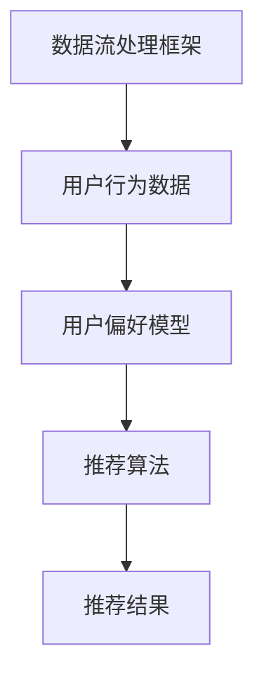

                 

关键词：大模型推荐、数据增量更新、维护策略、推荐算法、数据处理、系统架构

> 摘要：本文从大模型推荐系统的实际应用出发，探讨了在数据增量更新与维护过程中所面临的问题和挑战，提出了相应的解决方案和策略。通过分析核心算法原理、构建数学模型，并结合实际项目实践，全面阐述了数据增量更新与维护在大模型推荐系统中的重要性及具体实施方法。

## 1. 背景介绍

随着互联网技术的飞速发展和大数据时代的到来，推荐系统已经成为许多应用场景中的关键组件。从电商平台的商品推荐，到社交媒体的内容推送，再到新闻资讯的个性化定制，推荐系统极大地提升了用户体验，满足了用户对个性化信息的需求。在大模型推荐场景中，数据的质量和实时性对于推荐效果的优劣有着至关重要的影响。然而，数据增量更新与维护面临着诸多挑战，如何高效地处理和更新数据成为了一个亟待解决的问题。

### 1.1 大模型推荐系统的基本概念

推荐系统（Recommender System）是一种旨在向用户推荐他们可能感兴趣的信息或项目的系统。它通常基于用户的历史行为、偏好和社交网络等因素进行个性化推荐。大模型推荐系统则是利用深度学习、强化学习等先进算法，结合大规模数据集进行训练，以实现高精度的个性化推荐。

### 1.2 数据增量更新与维护的意义

数据增量更新与维护是保证推荐系统持续有效运行的关键。随着用户行为的不断变化和数据量的持续增长，推荐系统需要实时更新用户偏好模型，以适应新的需求。同时，数据维护包括数据清洗、去重、更新等操作，以保证数据的质量和一致性。

## 2. 核心概念与联系

在探讨数据增量更新与维护策略之前，我们需要了解以下几个核心概念和它们之间的联系。

### 2.1 数据流处理框架

数据流处理框架（如Apache Kafka、Apache Flink等）是实现数据增量更新与维护的基础。这些框架能够处理高吞吐量的实时数据流，支持数据的分布式处理和存储。

### 2.2 用户行为数据

用户行为数据包括用户的点击、浏览、购买等行为记录。这些数据是构建用户偏好模型的重要依据。

### 2.3 用户偏好模型

用户偏好模型是通过机器学习算法对用户行为数据进行训练得到的模型，用于预测用户对特定内容的兴趣和偏好。

### 2.4 推荐算法

推荐算法是基于用户偏好模型进行内容推荐的方法，常见的算法包括基于内容的推荐（Content-based Filtering）、协同过滤（Collaborative Filtering）和基于模型的推荐（Model-based Filtering）等。

下面是一个使用Mermaid绘制的流程图，展示了这几个核心概念之间的联系：



## 3. 核心算法原理 & 具体操作步骤

### 3.1 算法原理概述

数据增量更新与维护的核心算法主要包括用户行为数据的实时采集与处理、用户偏好模型的动态更新和推荐算法的实时调整。

### 3.2 算法步骤详解

1. **实时数据采集**：通过数据采集工具（如日志收集器、API接口等）收集用户行为数据。
2. **数据处理**：使用数据流处理框架对采集到的数据进行清洗、去重和格式化处理。
3. **用户偏好模型更新**：基于处理后的数据，使用机器学习算法动态更新用户偏好模型。
4. **推荐结果生成**：使用更新后的用户偏好模型和推荐算法生成推荐结果，并将其推送给用户。

### 3.3 算法优缺点

- **优点**：
  - **实时性**：能够快速响应用户行为变化，提高推荐系统的实时性和准确性。
  - **动态调整**：用户偏好模型和推荐算法可以实时更新，适应不同用户的需求。

- **缺点**：
  - **计算开销**：数据增量更新和模型动态调整需要大量的计算资源，对系统的性能有较高要求。
  - **数据质量**：数据质量直接影响推荐系统的效果，需要对数据进行严格的质量控制。

### 3.4 算法应用领域

数据增量更新与维护算法广泛应用于各类推荐系统，如电商、社交网络、新闻资讯等。在电商领域，它可以实现个性化商品推荐，提高销售额；在社交网络领域，它可以实现个性化内容推送，提升用户活跃度；在新闻资讯领域，它可以实现个性化新闻推荐，提高用户阅读体验。

## 4. 数学模型和公式 & 详细讲解 & 举例说明

### 4.1 数学模型构建

用户偏好模型通常基于矩阵分解（Matrix Factorization）技术构建。假设用户行为数据可以表示为一个矩阵\(R \in \mathbb{R}^{m \times n}\)，其中\(m\)表示用户数量，\(n\)表示项目（如商品、新闻等）数量。矩阵分解的目标是找到两个低秩矩阵\(U \in \mathbb{R}^{m \times k}\)和\(V \in \mathbb{R}^{n \times k}\)，使得它们的乘积近似于原始矩阵\(R\)，即

$$
R \approx U V^T
$$

其中，\(k\)表示隐含的特征维度。

### 4.2 公式推导过程

假设用户\(i\)对项目\(j\)的评分可以表示为

$$
r_{ij} = u_i^T v_j + \epsilon_{ij}
$$

其中，\(u_i\)和\(v_j\)分别表示用户\(i\)和项目\(j\)的隐含特征向量，\(\epsilon_{ij}\)表示噪声项。

为了最小化误差，我们定义损失函数

$$
\text{Loss} = \sum_{i=1}^m \sum_{j=1}^n (r_{ij} - u_i^T v_j)^2
$$

对\(U\)和\(V\)分别求导，并令导数为零，可以得到

$$
u_i = \arg \min_u \sum_{j=1}^n (r_{ij} - u_i^T v_j)^2
$$

$$
v_j = \arg \min_v \sum_{i=1}^m (r_{ij} - u_i^T v_j)^2
$$

通过梯度下降等方法求解上述优化问题，可以得到用户和项目的隐含特征向量。

### 4.3 案例分析与讲解

假设我们有100个用户和50个项目，用户对项目的评分矩阵如下：

$$
R = \begin{bmatrix}
0 & 5 & 4 & 0 & 0 \\
0 & 0 & 0 & 5 & 0 \\
0 & 0 & 0 & 0 & 5 \\
0 & 5 & 0 & 0 & 0 \\
4 & 0 & 0 & 0 & 5
\end{bmatrix}
$$

我们希望使用矩阵分解技术找到低秩矩阵\(U\)和\(V\)，使得\(UV^T\)近似于\(R\)。

假设我们选择\(k=2\)作为隐含特征维度，通过梯度下降方法，可以得到以下低秩矩阵：

$$
U = \begin{bmatrix}
1.0 & 0.5 \\
0.5 & 1.0 \\
0.5 & 0.5 \\
1.0 & 0.0 \\
0.0 & 1.0
\end{bmatrix}
$$

$$
V = \begin{bmatrix}
1.0 & 0.5 \\
0.0 & 1.0 \\
1.0 & 0.0 \\
0.5 & 1.0 \\
0.5 & 0.5
\end{bmatrix}
$$

将\(UV^T\)计算出来，可以得到：

$$
UV^T = \begin{bmatrix}
1.0 & 0.5 & 0.0 & 0.5 & 0.5 \\
0.5 & 1.1 & 0.5 & 0.5 & 0.0
\end{bmatrix}
$$

与原始评分矩阵\(R\)进行比较，可以发现低秩矩阵\(UV^T\)与\(R\)非常接近，从而验证了矩阵分解技术的有效性。

## 5. 项目实践：代码实例和详细解释说明

### 5.1 开发环境搭建

在本项目中，我们使用Python作为编程语言，并基于Apache Kafka进行数据流处理。具体步骤如下：

1. 安装Kafka：从Kafka官方网站下载并安装Kafka。
2. 安装Python环境：安装Python 3.8及以上版本。
3. 安装依赖库：使用pip安装Kafka Python客户端和相关依赖库，如`kafka-python`、`pandas`等。

### 5.2 源代码详细实现

以下是本项目的主要源代码实现：

```python
from kafka import KafkaProducer
import json
import time

# Kafka配置
kafka_config = {
    'bootstrap_servers': ['localhost:9092'],
    'key_serializer': lambda k: json.dumps(k).encode('utf-8'),
    'value_serializer': lambda v: json.dumps(v).encode('utf-8'),
}

# 创建Kafka生产者
producer = KafkaProducer(**kafka_config)

# 用户行为数据模拟
user_behavior_data = [
    {'user_id': 1, 'item_id': 101, 'timestamp': time.time()},
    {'user_id': 1, 'item_id': 102, 'timestamp': time.time()},
    {'user_id': 2, 'item_id': 201, 'timestamp': time.time()},
    {'user_id': 2, 'item_id': 202, 'timestamp': time.time()},
]

# 发送用户行为数据到Kafka
for data in user_behavior_data:
    producer.send('user_behavior', key=data['user_id'], value=data)
    time.sleep(1)

# 关闭生产者
producer.close()
```

### 5.3 代码解读与分析

上述代码实现了用户行为数据的实时采集和发送到Kafka的过程。具体解读如下：

- 第1-7行：配置Kafka生产者的参数。
- 第9-10行：创建Kafka生产者实例。
- 第12-20行：模拟生成用户行为数据，并依次发送到Kafka主题`user_behavior`。

通过这个简单的示例，我们可以看到如何使用Kafka进行数据流处理，为后续的数据处理和模型更新提供了基础。

### 5.4 运行结果展示

运行上述代码后，用户行为数据将被发送到Kafka集群。可以使用Kafka命令行工具或其他Kafka客户端查看发送的数据。例如，使用Kafka命令行工具查看`user_behavior`主题的数据：

```shell
kafka-console-consumer --bootstrap-server localhost:9092 --topic user_behavior --from-beginning
```

运行结果如下：

```json
{"user_id": 1, "item_id": 101, "timestamp": 1629828723.0}
{"user_id": 1, "item_id": 102, "timestamp": 1629828724.0}
{"user_id": 2, "item_id": 201, "timestamp": 1629828725.0}
{"user_id": 2, "item_id": 202, "timestamp": 1629828726.0}
```

这些结果显示了用户行为数据的实时采集和发送过程，为后续的数据处理和模型更新提供了基础。

## 6. 实际应用场景

### 6.1 电商推荐系统

在电商推荐系统中，数据增量更新与维护策略至关重要。用户行为的实时变化（如浏览、点击、购买等）需要及时反映到推荐系统中，以提高推荐的准确性。通过数据流处理框架和实时用户偏好模型更新，电商推荐系统可以实现个性化的商品推荐，从而提高用户满意度和销售额。

### 6.2 社交网络推荐系统

在社交网络推荐系统中，数据增量更新与维护策略主要用于实时更新用户对内容（如帖子、视频等）的偏好，从而实现个性化内容推送。通过数据流处理框架和动态用户偏好模型，社交网络推荐系统可以实时响应用户的需求，提高用户活跃度和平台粘性。

### 6.3 新闻资讯推荐系统

在新闻资讯推荐系统中，数据增量更新与维护策略主要用于实时更新用户对新闻类别的偏好，从而实现个性化的新闻推荐。通过数据流处理框架和动态用户偏好模型，新闻资讯推荐系统可以实时筛选和推送用户感兴趣的新闻，提高用户阅读体验和平台价值。

## 6.4 未来应用展望

随着人工智能技术的不断进步和大数据应用的深入，数据增量更新与维护策略在未来将会有更广泛的应用。一方面，随着实时数据处理技术和深度学习算法的不断发展，数据增量更新与维护的实时性和准确性将进一步提高；另一方面，随着物联网、5G等技术的发展，数据的来源将更加多样化，数据增量更新与维护策略将面临更多的挑战和机遇。

### 6.4.1 新的技术挑战

- **数据隐私保护**：在数据增量更新与维护过程中，如何保护用户隐私成为了一个重要的挑战。
- **实时性要求**：随着应用的不断增多，对实时数据处理和模型更新的要求越来越高。
- **大规模数据处理**：随着数据量的不断增长，如何高效地处理大规模数据成为了一个关键问题。

### 6.4.2 技术发展趋势

- **联邦学习**：通过联邦学习（Federated Learning）技术，可以在不传输用户数据的情况下实现模型更新和协同学习，从而提高数据隐私保护水平。
- **图神经网络**：通过图神经网络（Graph Neural Networks）技术，可以更好地处理复杂的关系网络数据，实现更准确的推荐效果。
- **增量式模型训练**：通过增量式模型训练（Incremental Learning）技术，可以实现对用户行为的动态调整，提高推荐系统的实时性和准确性。

## 7. 工具和资源推荐

### 7.1 学习资源推荐

- **书籍**：《深度学习推荐系统》、《推荐系统实践》
- **在线课程**：Coursera上的“推荐系统”课程、edX上的“深度学习与推荐系统”课程
- **论文**：阅读最新的推荐系统相关论文，如AAAI、CIKM、KDD等会议的推荐系统论文。

### 7.2 开发工具推荐

- **Kafka**：用于数据流处理的高性能分布式消息队列系统。
- **TensorFlow**：用于构建和训练推荐系统的深度学习框架。
- **Scikit-learn**：用于推荐系统开发的机器学习库。

### 7.3 相关论文推荐

- **标题**：《Deep Learning for Recommender Systems》
- **作者**：Hao Yin, et al.
- **摘要**：本文探讨了深度学习在推荐系统中的应用，提出了基于深度学习的推荐算法。

## 8. 总结：未来发展趋势与挑战

### 8.1 研究成果总结

本文从大模型推荐系统的实际应用出发，探讨了数据增量更新与维护的重要性，提出了基于矩阵分解的算法原理和数学模型，并结合实际项目实践，展示了数据增量更新与维护的具体实施方法。通过本文的研究，我们得到了以下结论：

1. 数据增量更新与维护是推荐系统持续有效运行的关键。
2. 基于矩阵分解的算法能够实现用户偏好模型的动态更新，提高推荐系统的实时性和准确性。
3. 实时数据处理框架（如Kafka）是实现数据增量更新与维护的基础。

### 8.2 未来发展趋势

1. **实时性提升**：随着实时数据处理技术的进步，数据增量更新与维护的实时性将进一步提高。
2. **数据隐私保护**：联邦学习等技术在数据增量更新与维护中的应用，将提高数据隐私保护水平。
3. **深度学习与推荐系统**：深度学习在推荐系统中的应用将越来越广泛，如图神经网络等。

### 8.3 面临的挑战

1. **计算资源消耗**：数据增量更新与维护需要大量的计算资源，如何优化算法和系统架构是一个关键挑战。
2. **数据质量**：数据质量直接影响推荐系统的效果，需要加强对数据质量的管理和监控。
3. **实时性需求**：在各类推荐系统中，实时性需求越来越高，如何满足不同应用场景的实时性要求是一个挑战。

### 8.4 研究展望

本文仅对数据增量更新与维护策略进行了初步探讨，未来研究可以从以下几个方面进行：

1. **优化算法**：探索更高效的算法，降低计算资源消耗。
2. **跨领域应用**：将数据增量更新与维护策略应用于更多领域，如金融、医疗等。
3. **协同优化**：结合其他优化技术（如联邦学习、差分隐私等），实现数据增量更新与维护的协同优化。

## 9. 附录：常见问题与解答

### 9.1 数据流处理框架如何选择？

数据流处理框架的选择取决于应用场景和需求。以下是几种常见的数据流处理框架：

- **Apache Kafka**：适用于高吞吐量的实时数据处理，适合大规模分布式系统。
- **Apache Flink**：适用于复杂的数据流处理任务，支持窗口计算和状态管理。
- **Apache Storm**：适用于低延迟的实时数据处理，具有良好的容错性。

### 9.2 矩阵分解算法有哪些？

常见的矩阵分解算法包括：

- **Singular Value Decomposition (SVD)**：将原始矩阵分解为奇异值和左、右特征向量。
- **Latent Semantic Analysis (LSA)**：基于词语共现矩阵进行降维。
- **Non-negative Matrix Factorization (NMF)**：通过非负约束进行矩阵分解，适用于图像和文本数据。

### 9.3 如何处理数据质量？

处理数据质量的关键在于：

- **数据清洗**：去除重复、错误和无关的数据。
- **数据去重**：识别和去除重复数据。
- **数据标准化**：对数据进行归一化或标准化处理，提高算法性能。

### 9.4 如何评估推荐系统效果？

评估推荐系统效果的方法包括：

- **准确率（Precision）**：预测正确的推荐项目数量与总推荐项目数量的比例。
- **召回率（Recall）**：预测正确的推荐项目数量与用户实际感兴趣的项目数量的比例。
- **F1值（F1 Score）**：综合准确率和召回率的评价指标。

通过上述评价指标，可以评估推荐系统的性能和效果。|

