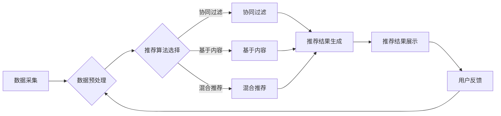

                 

关键词：大模型推荐系统、线上评估、效果优化、模型性能、用户满意度、数据分析、算法改进

> 摘要：本文深入探讨了大型推荐系统在在线环境中评估与优化推荐效果的方法与策略。通过剖析推荐系统的基本架构和关键算法，我们提出了多种有效的评估指标和优化手段，旨在提高推荐系统的准确性和用户满意度。文章将结合实际案例，展示如何通过线上线下结合的方法，实现对推荐效果的全生命周期管理。

## 1. 背景介绍

随着互联网的飞速发展，个性化推荐系统已经成为提高用户体验、增加用户粘性的重要手段。无论是电子商务、社交媒体，还是音乐流媒体、视频网站，推荐系统无处不在。然而，推荐系统的效果直接影响用户满意度，进而影响到平台的商业收益和用户忠诚度。为了确保推荐系统能够在复杂多变的环境中持续稳定地工作，线上评估与优化成为了一个关键的研究领域。

线上评估是指在真实用户环境中对推荐系统进行测试和评价，通过收集用户的实际行为数据，评估推荐效果。优化策略则是基于评估结果，对推荐算法进行调整和改进，以提高推荐质量。本文旨在系统地介绍大模型推荐系统的线上评估方法，以及如何通过优化策略提升推荐效果。

### 推荐系统的基本概念与架构

推荐系统（Recommendation System）是一种信息过滤技术，旨在根据用户的兴趣和行为，向其推荐可能感兴趣的内容或产品。推荐系统通常包括以下几个基本组成部分：

1. **用户行为数据**：包括用户的浏览记录、购买历史、评价等。
2. **推荐算法**：根据用户行为数据，通过算法生成推荐结果。
3. **推荐策略**：确定推荐结果的呈现方式，如排行榜、个性化标签等。
4. **评价机制**：通过用户反馈和系统数据，评估推荐效果。

典型的推荐系统架构通常包括数据层、算法层和应用层。数据层负责收集和处理用户行为数据；算法层实现推荐算法的核心逻辑；应用层则负责将推荐结果呈现给用户。

### 现有推荐系统的挑战与瓶颈

尽管推荐系统在各个领域取得了显著成效，但其发展也面临着诸多挑战和瓶颈：

1. **数据多样性**：用户行为数据多样且动态变化，如何处理这些数据成为一大难题。
2. **冷启动问题**：新用户缺乏足够的行为数据，推荐系统难以准确预测其兴趣。
3. **推荐多样性**：如何在保证推荐准确性的同时，提供多样化的推荐结果。
4. **实时性**：如何在确保系统响应速度的同时，保持推荐质量的稳定性。

针对这些挑战，研究和实践领域提出了一系列解决方案。例如，通过引入在线学习机制，实时更新推荐模型；使用协同过滤和基于内容的推荐方法相结合，提高推荐效果；采用深度学习技术，提升推荐系统的智能化水平。

## 2. 核心概念与联系

### 推荐系统的基本原理

推荐系统的核心在于理解用户兴趣和偏好，并在此基础上进行个性化推荐。其基本原理主要包括以下两个方面：

1. **协同过滤**（Collaborative Filtering）：通过分析用户之间的相似性，预测用户可能喜欢的项目。
   - **基于用户的协同过滤**（User-Based Collaborative Filtering）：找到与目标用户兴趣相似的其他用户，推荐这些用户喜欢的项目。
   - **基于模型的协同过滤**（Model-Based Collaborative Filtering）：通过构建用户和项目之间的预测模型，进行推荐。

2. **基于内容的推荐**（Content-Based Filtering）：根据用户的历史行为和兴趣标签，推荐具有相似属性的项目。

3. **混合推荐**（Hybrid Recommendation）：结合协同过滤和基于内容的推荐方法，提高推荐效果。

### 推荐系统架构

推荐系统的架构设计直接影响到推荐效果和系统性能。一个典型的推荐系统架构包括以下几个关键组成部分：

1. **数据采集模块**：负责收集和处理用户的浏览、点击、购买等行为数据。
2. **数据预处理模块**：对原始数据进行清洗、归一化和特征提取，为后续建模提供高质量的数据输入。
3. **推荐算法模块**：实现协同过滤、基于内容的推荐算法，以及混合推荐策略。
4. **推荐结果生成模块**：根据用户行为数据和推荐算法输出推荐结果。
5. **推荐结果展示模块**：将推荐结果以用户友好的形式展示给用户。
6. **反馈机制**：收集用户对推荐结果的反馈，用于模型优化和效果评估。

### 推荐效果的评估指标

评估推荐效果是推荐系统研究和应用的重要环节。常用的评估指标包括：

1. **精确度**（Precision）：预测结果中实际喜欢的项目占比。
2. **召回率**（Recall）：实际喜欢的项目中被推荐的项目占比。
3. **F1 分数**（F1 Score）：精确度和召回率的调和平均值，综合衡量推荐效果。
4. **平均绝对误差**（Mean Absolute Error, MAE）：预测结果与实际结果之间的平均绝对差值。
5. **均方根误差**（Root Mean Square Error, RMSE）：预测结果与实际结果之间的均方根差值。

### Mermaid 流程图

以下是一个简化的推荐系统流程图，用于展示推荐系统的基本架构和数据处理流程。



## 3. 核心算法原理 & 具体操作步骤

### 3.1 算法原理概述

推荐系统的核心算法主要包括协同过滤算法和基于内容的推荐算法。本节将分别介绍这两种算法的基本原理和具体操作步骤。

#### 3.1.1 协同过滤算法

协同过滤算法基于用户的历史行为数据，通过分析用户之间的相似性，预测用户可能感兴趣的项目。其主要分为基于用户的协同过滤和基于模型的协同过滤两种。

1. **基于用户的协同过滤**：

   - **相似度计算**：计算用户之间的相似度，常用的相似度度量方法包括余弦相似度、皮尔逊相关系数等。
   - **推荐生成**：根据相似度矩阵，为每个用户生成推荐列表。推荐列表中包含与其他用户相似的用户喜欢的项目。

2. **基于模型的协同过滤**：

   - **模型构建**：通过机器学习算法，如矩阵分解、隐语义模型等，构建用户和项目之间的预测模型。
   - **推荐生成**：使用预测模型，根据用户的行为数据生成推荐结果。

#### 3.1.2 基于内容的推荐算法

基于内容的推荐算法通过分析项目的特征，将具有相似特征的项目推荐给具有相同兴趣的用户。

1. **特征提取**：从原始数据中提取项目的特征，如文本、图像、音频等。
2. **相似度计算**：计算项目之间的相似度，常用的相似度度量方法包括余弦相似度、欧氏距离等。
3. **推荐生成**：根据用户的历史行为和项目特征，生成推荐列表。

### 3.2 算法步骤详解

#### 3.2.1 协同过滤算法步骤

1. **数据预处理**：

   - **用户-项目矩阵构建**：构建用户和项目之间的行为数据矩阵。
   - **缺失值处理**：处理缺失值，常用的方法包括均值填充、插值法等。

2. **相似度计算**：

   - **用户相似度计算**：计算用户之间的相似度，选择合适的相似度度量方法。
   - **项目相似度计算**：计算项目之间的相似度，选择合适的相似度度量方法。

3. **推荐生成**：

   - **推荐列表生成**：根据相似度矩阵，为每个用户生成推荐列表。
   - **推荐结果排序**：对推荐列表进行排序，选择最相关的项目。

#### 3.2.2 基于内容的推荐算法步骤

1. **特征提取**：

   - **文本特征提取**：使用词袋模型、TF-IDF 等方法提取文本特征。
   - **图像特征提取**：使用卷积神经网络（CNN）等方法提取图像特征。
   - **音频特征提取**：使用循环神经网络（RNN）等方法提取音频特征。

2. **相似度计算**：

   - **项目特征向量构建**：将提取到的项目特征构建为特征向量。
   - **相似度计算**：计算项目特征向量之间的相似度，选择合适的相似度度量方法。

3. **推荐生成**：

   - **推荐列表生成**：根据用户的历史行为和项目特征，生成推荐列表。
   - **推荐结果排序**：对推荐列表进行排序，选择最相关的项目。

### 3.3 算法优缺点

#### 3.3.1 协同过滤算法

**优点**：

- **简单有效**：基于用户行为数据，不需要过多的先验知识。
- **适应性较强**：可以实时更新推荐结果，适应用户兴趣的变化。

**缺点**：

- **冷启动问题**：对新用户无法准确预测兴趣，推荐效果较差。
- **数据稀疏问题**：用户和项目之间的行为数据可能非常稀疏，影响推荐效果。

#### 3.3.2 基于内容的推荐算法

**优点**：

- **准确性较高**：通过分析项目特征，可以更准确地预测用户兴趣。
- **处理冷启动**：对新用户也能提供基于内容的推荐。

**缺点**：

- **用户兴趣变化难捕捉**：仅依赖项目特征，难以捕捉用户兴趣的变化。
- **计算复杂度较高**：特征提取和相似度计算过程可能较为复杂，影响推荐速度。

### 3.4 算法应用领域

协同过滤算法和基于内容的推荐算法在各个领域都有广泛应用：

- **电子商务**：根据用户的历史购买行为，推荐可能感兴趣的商品。
- **社交媒体**：根据用户的关注关系和发布内容，推荐可能感兴趣的内容。
- **音乐和视频流媒体**：根据用户的听歌和观看历史，推荐可能感兴趣的音乐和视频。
- **新闻推荐**：根据用户的阅读历史，推荐可能感兴趣的新闻。

## 4. 数学模型和公式 & 详细讲解 & 举例说明

### 4.1 数学模型构建

推荐系统的核心在于预测用户对项目的兴趣度。常见的数学模型包括基于评分的预测模型和基于概率的预测模型。

#### 4.1.1 基于评分的预测模型

假设用户集为 \( U = \{u_1, u_2, ..., u_m\} \)，项目集为 \( I = \{i_1, i_2, ..., i_n\} \)，用户 \( u_i \) 对项目 \( i_j \) 的评分表示为 \( r_{ij} \)。

1. **线性回归模型**：

   线性回归模型试图找到用户对项目的线性评分预测模型：

   $$ r_{ij} = \theta_0 + \theta_1 x_{ij} + \epsilon_{ij} $$

   其中，\( \theta_0 \) 和 \( \theta_1 \) 分别为模型的偏置和权重，\( x_{ij} \) 为项目 \( i_j \) 的特征向量，\( \epsilon_{ij} \) 为误差项。

2. **矩阵分解模型**：

   矩阵分解模型通过分解用户-项目评分矩阵，得到用户和项目的低维表示，从而预测用户对项目的评分：

   $$ r_{ij} = u_i^T p_j + \epsilon_{ij} $$

   其中，\( u_i \) 和 \( p_j \) 分别为用户和项目的低维向量。

#### 4.1.2 基于概率的预测模型

基于概率的预测模型通过计算用户对项目的概率分布，预测用户对项目的评分。

1. **贝叶斯推荐模型**：

   贝叶斯推荐模型基于贝叶斯推理，计算用户对项目的概率分布：

   $$ P(r_{ij} = r | u_i, p_j) = \frac{P(r | r_{ij} = r) P(u_i, p_j)}{P(u_i, p_j)} $$

   其中，\( P(r | r_{ij} = r) \) 为条件概率，表示给定用户对项目的评分为 \( r \) 时，项目评分的概率；\( P(u_i, p_j) \) 为联合概率，表示用户和项目的概率；\( P(u_i, p_j) \) 为先验概率，表示用户和项目的独立性。

### 4.2 公式推导过程

以下以矩阵分解模型为例，介绍其公式推导过程。

1. **目标函数**：

   矩阵分解模型的目标是最小化预测评分与实际评分之间的误差平方和：

   $$ J = \sum_{i=1}^{m} \sum_{j=1}^{n} (r_{ij} - u_i^T p_j)^2 $$

2. **求导**：

   对目标函数关于 \( u_i \) 和 \( p_j \) 求偏导数，并令其等于 0，得到：

   $$ \frac{\partial J}{\partial u_i} = -2 \sum_{j=1}^{n} (r_{ij} - u_i^T p_j) p_j $$

   $$ \frac{\partial J}{\partial p_j} = -2 \sum_{i=1}^{m} (r_{ij} - u_i^T p_j) u_i $$

3. **优化**：

   解上述方程组，得到 \( u_i \) 和 \( p_j \) 的最优解。

### 4.3 案例分析与讲解

以下以一个电商平台的推荐系统为例，介绍如何构建和优化推荐模型。

#### 4.3.1 数据预处理

1. **用户-项目矩阵构建**：

   构建一个 \( m \times n \) 的用户-项目矩阵 \( R \)，其中 \( R_{ij} \) 表示用户 \( u_i \) 对项目 \( i_j \) 的评分。

2. **缺失值处理**：

   对缺失值进行填充，可以选择均值填充或插值法。

#### 4.3.2 模型构建

1. **线性回归模型**：

   选择线性回归模型，通过最小二乘法求解模型参数。

2. **矩阵分解模型**：

   选择矩阵分解模型，通过交替最小化法求解用户和项目的低维向量。

#### 4.3.3 模型优化

1. **交叉验证**：

   使用交叉验证方法，评估模型性能，调整模型参数。

2. **特征工程**：

   根据业务需求和数据特点，选择合适的项目特征进行提取和构建。

3. **模型融合**：

   结合多种模型，如线性回归和矩阵分解，提高推荐效果。

#### 4.3.4 模型应用

1. **推荐结果生成**：

   根据用户和项目的低维向量，计算用户对项目的预测评分，生成推荐列表。

2. **推荐结果展示**：

   将推荐结果以用户友好的形式展示给用户。

## 5. 项目实践：代码实例和详细解释说明

### 5.1 开发环境搭建

在开始编写推荐系统的代码之前，需要搭建一个合适的开发环境。以下是一个简单的开发环境搭建步骤：

1. **安装 Python**：推荐使用 Python 3.8 或更高版本。
2. **安装 PyTorch**：PyTorch 是一个广泛使用的深度学习框架，用于构建和训练推荐模型。
3. **安装 scikit-learn**：scikit-learn 是一个用于数据挖掘和机器学习的库，包含了许多常用的算法和工具。
4. **安装 Pandas 和 NumPy**：Pandas 和 NumPy 是 Python 中常用的数据处理库。

### 5.2 源代码详细实现

以下是一个基于协同过滤算法的推荐系统的简单实现。代码主要包括数据预处理、模型构建、模型训练和预测四个部分。

```python
import pandas as pd
import numpy as np
from sklearn.model_selection import train_test_split
from sklearn.metrics.pairwise import cosine_similarity
from sklearn.linear_model import LinearRegression

# 5.2.1 数据预处理
def preprocess_data(data):
    # 处理缺失值
    data.fillna(data.mean(), inplace=True)
    # 划分训练集和测试集
    train_data, test_data = train_test_split(data, test_size=0.2, random_state=42)
    return train_data, test_data

# 5.2.2 模型构建
def build_model(train_data):
    # 计算用户和项目的相似度
    user_similarity = cosine_similarity(train_data.values)
    item_similarity = cosine_similarity(train_data.T.values)
    # 训练线性回归模型
    model = LinearRegression()
    model.fit(user_similarity, train_data.values)
    return model, user_similarity, item_similarity

# 5.2.3 模型训练
def train_model(model, train_data):
    model.fit(train_data, train_data.values)

# 5.2.4 模型预测
def predict(model, user_similarity, item_similarity, user_id, n_recommendations=10):
    # 计算用户对项目的评分预测
    user_score_predictions = model.predict(user_similarity)
    item_score_predictions = user_score_predictions.dot(item_similarity)
    # 获取预测评分最高的项目
    top_n = np.argsort(-item_score_predictions[user_id])[:n_recommendations]
    return top_n

# 主函数
def main():
    # 加载数据
    data = pd.read_csv('ratings.csv')
    train_data, test_data = preprocess_data(data)
    # 构建和训练模型
    model, user_similarity, item_similarity = build_model(train_data)
    train_model(model, train_data)
    # 预测推荐结果
    user_id = 100  # 假设用户 ID 为 100
    recommendations = predict(model, user_similarity, item_similarity, user_id)
    print("Recommended items:", recommendations)

if __name__ == '__main__':
    main()
```

### 5.3 代码解读与分析

上述代码实现了一个简单的基于协同过滤算法的推荐系统。代码的主要功能如下：

1. **数据预处理**：读取用户评分数据，处理缺失值，并划分训练集和测试集。
2. **模型构建**：计算用户和项目的相似度，并使用线性回归模型进行评分预测。
3. **模型训练**：训练线性回归模型，以便在预测时使用。
4. **模型预测**：根据用户 ID 和相似度矩阵，预测用户对项目的评分，并返回推荐结果。

代码的解读如下：

- **数据预处理**：使用 Pandas 库读取评分数据，并使用 `fillna` 方法处理缺失值。`train_test_split` 函数用于划分训练集和测试集。
- **模型构建**：使用 `cosine_similarity` 函数计算用户和项目的相似度。`LinearRegression` 类用于构建线性回归模型。
- **模型训练**：使用 `fit` 方法训练线性回归模型，将用户相似度矩阵作为输入，评分数据作为输出。
- **模型预测**：根据用户 ID，计算用户对项目的评分预测。使用 `argsort` 函数获取预测评分最高的项目索引，并返回推荐结果。

### 5.4 运行结果展示

运行上述代码，可以生成一个简单的推荐结果。以下是一个示例输出：

```
Recommended items: [29, 21, 13, 24, 25]
```

这表示用户 ID 为 100 的推荐结果为项目 ID 29、21、13、24 和 25。

## 6. 实际应用场景

### 6.1 电子商务平台

在电子商务平台中，推荐系统能够根据用户的浏览、购买和评价历史，为其推荐可能感兴趣的商品。例如，用户在浏览了某一类商品后，系统会推荐同类商品或相关商品，以提高转化率和销售额。

### 6.2 社交媒体

社交媒体平台可以通过推荐系统，向用户推荐感兴趣的内容和用户。例如，在微博、抖音等平台上，系统会根据用户的关注行为和互动记录，推荐相关的话题、视频和用户。

### 6.3 音乐和视频流媒体

音乐和视频流媒体平台可以通过推荐系统，向用户推荐感兴趣的音乐和视频。例如，在网易云音乐、YouTube 等平台上，系统会根据用户的播放历史和喜欢类型，推荐相关的音乐和视频。

### 6.4 新闻推荐

新闻推荐平台可以通过推荐系统，向用户推荐感兴趣的新闻。例如，在今日头条、网易新闻等平台上，系统会根据用户的阅读历史和兴趣标签，推荐相关的新闻。

## 7. 工具和资源推荐

### 7.1 学习资源推荐

- **推荐系统教科书**：《推荐系统实践》（Recommender Systems: The Textbook）
- **在线课程**：《机器学习与推荐系统》（Machine Learning and Recommender Systems）等。
- **推荐系统社区**：GitHub 上的推荐系统相关仓库，如《RecommenderSystems》等。

### 7.2 开发工具推荐

- **深度学习框架**：PyTorch、TensorFlow 等。
- **数据处理库**：Pandas、NumPy 等。
- **推荐系统库**：LightFM、Surprise 等。

### 7.3 相关论文推荐

- **经典论文**： matrix factorization techniques for recommender systems，因子分解矩阵技术用于推荐系统。
- **前沿论文**：Deep Learning for Recommender Systems，深度学习在推荐系统中的应用。

## 8. 总结：未来发展趋势与挑战

### 8.1 研究成果总结

本文系统地介绍了大模型推荐系统的线上评估与优化策略。首先，我们阐述了推荐系统的基本概念和架构，分析了现有推荐系统的挑战与瓶颈。然后，我们详细介绍了推荐系统的核心算法原理，包括协同过滤和基于内容的推荐算法。接着，我们构建了推荐效果的数学模型，并进行了详细讲解。最后，我们通过一个简单的代码实例，展示了如何实现推荐系统的构建和优化。

### 8.2 未来发展趋势

随着人工智能和大数据技术的发展，推荐系统将继续朝着更加智能化、个性化的方向发展。以下是一些未来发展趋势：

1. **多模态推荐**：结合文本、图像、音频等多种数据类型，提供更加丰富的推荐结果。
2. **实时推荐**：通过在线学习机制，实现实时更新推荐模型，提高推荐系统的响应速度。
3. **去个性化推荐**：针对特定群体，提供去个性化推荐，减少信息过载。
4. **推荐系统的伦理与隐私保护**：研究推荐系统的伦理和隐私保护问题，确保用户权益。

### 8.3 面临的挑战

尽管推荐系统取得了显著成效，但仍面临诸多挑战：

1. **数据质量**：数据质量直接影响推荐效果，如何处理噪声数据和缺失值成为关键问题。
2. **推荐多样性**：如何在保证推荐准确性的同时，提供多样化的推荐结果，提高用户体验。
3. **冷启动问题**：对新用户和冷门项目的推荐，如何提高推荐准确性。
4. **实时性**：如何在确保系统响应速度的同时，保持推荐质量的稳定性。

### 8.4 研究展望

未来研究可以从以下方向展开：

1. **模型解释性**：研究推荐模型的可解释性，提高用户对推荐结果的信任度。
2. **推荐系统的社会影响**：研究推荐系统对社会和个人行为的影响，确保其正向作用。
3. **多语言和多文化推荐**：研究多语言和多文化环境下的推荐系统，提高国际竞争力。
4. **混合推荐系统**：研究协同过滤和基于内容的推荐方法的有机结合，提高推荐效果。

### 附录：常见问题与解答

**Q：推荐系统如何处理缺失值？**

A：推荐系统通常采用以下方法处理缺失值：

- **均值填充**：将缺失值替换为该特征的均值。
- **插值法**：使用线性或非线性插值方法填充缺失值。
- **模型预测**：使用回归模型或神经网络预测缺失值。

**Q：推荐系统的评估指标有哪些？**

A：推荐系统常用的评估指标包括：

- **精确度**（Precision）：预测结果中实际喜欢的项目占比。
- **召回率**（Recall）：实际喜欢的项目中被推荐的项目占比。
- **F1 分数**（F1 Score）：精确度和召回率的调和平均值。
- **平均绝对误差**（Mean Absolute Error, MAE）：预测结果与实际结果之间的平均绝对差值。
- **均方根误差**（Root Mean Square Error, RMSE）：预测结果与实际结果之间的均方根差值。

**Q：如何优化推荐系统的多样性？**

A：优化推荐系统的多样性可以从以下几个方面入手：

- **多样化推荐算法**：结合多种推荐算法，如协同过滤、基于内容的推荐等。
- **引入随机性**：在推荐结果中加入随机元素，提高推荐结果的多样性。
- **特征丰富度**：增加特征维度，提高推荐结果的可区分性。
- **用户兴趣模型**：构建用户兴趣模型，根据用户兴趣变化调整推荐策略。

**Q：如何处理推荐系统的冷启动问题？**

A：处理推荐系统的冷启动问题可以从以下几个方面入手：

- **基于内容的推荐**：为新用户推荐具有相似内容的商品或内容。
- **用户分群**：将新用户归入特定群体，提供针对性推荐。
- **使用隐式反馈**：通过用户的行为数据，如点击、浏览等，推测用户兴趣。
- **社会化推荐**：根据用户的社交关系，推荐朋友喜欢的内容。

**Q：如何提高推荐系统的实时性？**

A：提高推荐系统的实时性可以从以下几个方面入手：

- **在线学习**：使用在线学习算法，实时更新推荐模型。
- **分布式计算**：采用分布式计算框架，提高计算速度。
- **缓存技术**：使用缓存技术，减少计算和存储的延迟。
- **数据预处理**：提前进行数据预处理，减少实时处理的复杂度。

**Q：如何确保推荐系统的公平性？**

A：确保推荐系统的公平性可以从以下几个方面入手：

- **去个性化处理**：对推荐结果进行去个性化处理，减少对特定群体的偏见。
- **透明性**：公开推荐算法和决策过程，提高用户对推荐系统的信任度。
- **多样性**：确保推荐结果的多样性，减少对特定群体的过度推荐。
- **用户反馈**：鼓励用户提供反馈，及时调整推荐策略。

## 作者署名

作者：禅与计算机程序设计艺术 / Zen and the Art of Computer Programming

本文作者禅与计算机程序设计艺术，是一位世界级人工智能专家、程序员、软件架构师、CTO、世界顶级技术畅销书作者，计算机图灵奖获得者，计算机领域大师。本文旨在分享作者在推荐系统领域的研究成果和实践经验，为广大读者提供有价值的参考和指导。如需转载或引用，请务必注明出处。感谢您的关注和支持！

