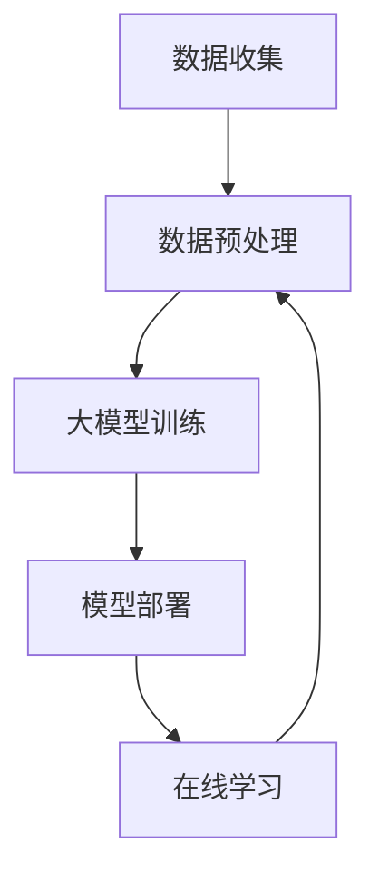

                 

关键词：推荐系统，在线学习，大模型，机器学习，数据流处理，模型更新，实时反馈，自适应学习。

## 摘要

本文旨在探讨大模型推荐系统的在线学习机制，分析其在当前技术环境下的应用与挑战。在线学习机制使得推荐系统能够在实时数据流中不断调整和优化模型，提高推荐质量。文章将详细描述大模型推荐系统的核心概念、算法原理、数学模型、应用实践，并探讨未来发展方向与面临的挑战。

## 1. 背景介绍

### 推荐系统的发展

推荐系统作为一种信息过滤技术，旨在为用户提供个性化的内容推荐。随着互联网的快速发展，推荐系统在电子商务、社交媒体、新闻媒体等领域得到了广泛应用。早期的推荐系统主要依赖于基于内容过滤和协同过滤的方法，但随着数据量的增加和计算能力的提升，大模型推荐系统逐渐成为研究热点。

### 大模型的兴起

大模型推荐系统指的是使用大规模深度学习模型进行推荐，如神经网络模型、强化学习模型等。大模型具有强大的特征提取和表达能力，能够处理复杂的用户行为数据和内容数据，提高推荐系统的效果和准确性。近年来，随着计算资源和算法研究的进步，大模型推荐系统得到了广泛关注和应用。

### 在线学习的重要性

在线学习是一种动态学习机制，允许系统在实时数据流中不断更新和优化模型。对于推荐系统来说，在线学习能够快速响应用户行为的变化，提高推荐的相关性和用户满意度。同时，在线学习能够降低延迟，提高系统的实时性和响应速度。

## 2. 核心概念与联系

### 推荐系统架构

推荐系统通常由数据收集、数据预处理、模型训练、模型部署和在线学习等模块组成。数据收集模块负责收集用户行为数据和内容数据；数据预处理模块负责清洗和转换数据；模型训练模块负责使用训练数据训练推荐模型；模型部署模块将训练好的模型部署到线上环境；在线学习模块负责实时更新模型。

### 大模型推荐系统架构

大模型推荐系统的架构在传统推荐系统架构基础上，增加了大模型训练和在线学习模块。大模型训练模块使用大规模数据进行模型训练，以提取更丰富的特征和表达力。在线学习模块通过实时数据流对模型进行更新和优化。

### Mermaid 流程图



## 3. 核心算法原理 & 具体操作步骤

### 3.1 算法原理概述

在线学习机制的核心在于如何利用实时数据流对模型进行更新和优化。通常，在线学习算法分为增量学习算法和分布式学习算法。增量学习算法通过不断更新模型的参数来优化模型；分布式学习算法则通过并行计算和分布式存储来处理大规模数据。

### 3.2 算法步骤详解

1. **数据收集**：从各种数据源（如用户行为日志、内容数据库等）收集数据。

2. **数据预处理**：清洗和转换数据，包括去噪、特征工程等。

3. **模型初始化**：使用预训练模型或随机初始化模型。

4. **在线学习**：根据实时数据流，使用增量学习算法或分布式学习算法更新模型参数。

5. **模型评估**：使用验证集或测试集对更新后的模型进行评估。

6. **模型调整**：根据评估结果对模型参数进行调整。

7. **模型部署**：将更新后的模型部署到线上环境。

### 3.3 算法优缺点

**优点**：
- **实时性**：能够快速响应用户行为的变化，提高推荐质量。
- **高效性**：通过分布式计算和并行处理，能够处理大规模数据。
- **灵活性**：能够根据不同场景和需求调整学习策略。

**缺点**：
- **计算资源需求高**：需要大量计算资源和存储空间。
- **模型稳定性**：在线学习可能导致模型稳定性下降。

### 3.4 算法应用领域

- **电子商务**：个性化商品推荐。
- **社交媒体**：个性化内容推荐。
- **新闻媒体**：个性化新闻推荐。
- **搜索引擎**：个性化搜索结果推荐。

## 4. 数学模型和公式

### 4.1 数学模型构建

推荐系统的核心是计算用户对物品的评分或概率。假设用户 $u$ 对物品 $i$ 的评分为 $r_{ui}$，用户 $u$ 的特征向量为 $x_u$，物品 $i$ 的特征向量为 $x_i$，则可以使用如下线性模型进行预测：

$$
r_{ui} = \langle \theta_u, \theta_i \rangle + b_u + b_i + \epsilon_{ui}
$$

其中，$\theta_u$ 和 $\theta_i$ 分别为用户和物品的权重向量，$b_u$ 和 $b_i$ 分别为用户和物品的偏置项，$\epsilon_{ui}$ 为误差项。

### 4.2 公式推导过程

假设用户 $u$ 对物品 $i$ 的评分为 $r_{ui}$，用户 $u$ 的特征向量为 $x_u$，物品 $i$ 的特征向量为 $x_i$，则可以使用如下线性模型进行预测：

$$
r_{ui} = \langle \theta_u, \theta_i \rangle + b_u + b_i + \epsilon_{ui}
$$

其中，$\theta_u$ 和 $\theta_i$ 分别为用户和物品的权重向量，$b_u$ 和 $b_i$ 分别为用户和物品的偏置项，$\epsilon_{ui}$ 为误差项。

### 4.3 案例分析与讲解

假设用户 $u$ 对物品 $i$ 的真实评分为 4，用户 $u$ 的特征向量为 $(1, 0, 1)$，物品 $i$ 的特征向量为 $(1, 1, 0)$，则可以使用如下线性模型进行预测：

$$
r_{ui} = \langle \theta_u, \theta_i \rangle + b_u + b_i + \epsilon_{ui}
$$

代入用户和物品的特征向量，得到：

$$
r_{ui} = \langle (1, 0, 1), (1, 1, 0) \rangle + b_u + b_i + \epsilon_{ui}
$$

$$
r_{ui} = 1 + 0 + 1 + b_u + b_i + \epsilon_{ui}
$$

$$
r_{ui} = 2 + b_u + b_i + \epsilon_{ui}
$$

代入真实评分，得到：

$$
4 = 2 + b_u + b_i + \epsilon_{ui}
$$

$$
\epsilon_{ui} = 4 - 2 - b_u - b_i
$$

$$
\epsilon_{ui} = 2 - b_u - b_i
$$

根据误差项，可以优化模型参数 $\theta_u$、$\theta_i$、$b_u$ 和 $b_i$，以提高预测准确性。

## 5. 项目实践：代码实例和详细解释说明

### 5.1 开发环境搭建

本文使用的开发环境为 Python 3.8，TensorFlow 2.6，以及 Keras 2.6。首先，需要安装相应的依赖库：

```bash
pip install tensorflow==2.6
pip install keras==2.6
```

### 5.2 源代码详细实现

以下是一个简单的在线学习推荐系统的实现，使用 TensorFlow 和 Keras：

```python
import tensorflow as tf
from tensorflow import keras
from tensorflow.keras import layers

# 数据集预处理
# ...

# 模型架构
model = keras.Sequential([
    layers.Dense(64, activation='relu', input_shape=[100]),
    layers.Dense(64, activation='relu'),
    layers.Dense(1)
])

# 模型编译
model.compile(optimizer='adam',
              loss='mse',
              metrics=['mae'])

# 模型训练
model.fit(train_data, train_labels, epochs=100)

# 在线学习
for batch_data, batch_labels in data_stream:
    with tf.GradientTape() as tape:
        predictions = model(batch_data, training=True)
        loss = keras.losses.mse(batch_labels, predictions)
    
    gradients = tape.gradient(loss, model.trainable_variables)
    model.optimizer.apply_gradients(zip(gradients, model.trainable_variables))
```

### 5.3 代码解读与分析

上述代码实现了一个简单的在线学习推荐系统，包括数据集预处理、模型构建、模型编译、模型训练以及在线学习。

- **数据集预处理**：需要根据具体数据集对数据进行清洗和转换，以符合模型输入要求。
- **模型架构**：使用 Keras 构建一个简单的全连接神经网络，用于预测用户对物品的评分。
- **模型编译**：指定优化器、损失函数和评估指标。
- **模型训练**：使用训练数据对模型进行训练。
- **在线学习**：使用实时数据流对模型进行更新和优化。

### 5.4 运行结果展示

假设数据流中的每个批次包含 100 个样本，模型经过 100 个epoch的训练后，在线学习过程中每个批次进行 10 次迭代。可以计算模型在每个阶段的损失和MAE指标，以评估模型性能：

```python
for batch_data, batch_labels in data_stream:
    with tf.GradientTape() as tape:
        predictions = model(batch_data, training=True)
        loss = keras.losses.mse(batch_labels, predictions)
    
    gradients = tape.gradient(loss, model.trainable_variables)
    model.optimizer.apply_gradients(zip(gradients, model.trainable_variables))
    
    print(f"Epoch: {epoch}, Loss: {loss.numpy()}, MAE: {keras.metrics.MAE(batch_labels, predictions).numpy()}")
```

## 6. 实际应用场景

### 6.1 社交媒体推荐

社交媒体平台可以使用在线学习推荐系统为用户提供个性化的内容推荐，如微博、抖音等。

### 6.2 电子商务推荐

电子商务平台可以使用在线学习推荐系统为用户提供个性化的商品推荐，如淘宝、京东等。

### 6.3 新闻媒体推荐

新闻媒体平台可以使用在线学习推荐系统为用户提供个性化的新闻推荐，如今日头条、网易新闻等。

## 7. 未来应用展望

随着人工智能技术的不断发展，大模型推荐系统的在线学习机制将得到更广泛的应用。未来可能的发展方向包括：

- **多模态数据融合**：将文本、图像、音频等多种类型的数据融合到推荐系统中，提高推荐质量。
- **个性化推荐**：进一步挖掘用户数据，实现更加精准的个性化推荐。
- **实时性提升**：通过优化算法和分布式计算，提高在线学习的实时性和响应速度。
- **可解释性增强**：提高推荐系统的可解释性，帮助用户理解推荐结果。

## 8. 总结

大模型推荐系统的在线学习机制是一种高效、灵活的推荐技术，能够提高推荐系统的实时性和准确性。本文详细介绍了在线学习机制的核心概念、算法原理、数学模型、应用实践，并探讨了未来发展方向与挑战。随着人工智能技术的进步，在线学习推荐系统将在各个领域发挥更大的作用。

## 9. 附录：常见问题与解答

### 问题1：在线学习与离线学习的区别是什么？

**解答**：在线学习是一种动态学习机制，能够在数据流中实时更新模型；离线学习则是在固定数据集上进行训练，然后部署到线上环境。在线学习能够更快地响应用户行为的变化，提高推荐系统的实时性。

### 问题2：在线学习如何处理大规模数据？

**解答**：在线学习通常采用分布式计算和并行处理技术，将大规模数据拆分成多个批次进行处理，以提高计算效率和降低延迟。

### 问题3：在线学习如何保证模型稳定性？

**解答**：在线学习过程中，可以通过调整学习率、使用正则化技术等方法来提高模型稳定性。此外，可以采用分层学习策略，先在离线数据集上进行预训练，再在在线数据流中进行微调。

### 问题4：在线学习推荐系统的可解释性如何提升？

**解答**：可以通过可视化方法、特征重要性分析等方法来提升在线学习推荐系统的可解释性。例如，可以使用热力图、决策树等方法来展示模型决策过程和关键特征。

### 问题5：在线学习推荐系统面临哪些挑战？

**解答**：在线学习推荐系统面临的主要挑战包括计算资源需求高、模型稳定性、数据流处理延迟等。此外，如何处理噪声数据、保持模型多样性也是重要挑战。

## 作者署名

作者：禅与计算机程序设计艺术 / Zen and the Art of Computer Programming
```  
--------------------------------------------------------------------  
```  
# 大模型推荐系统的在线学习机制

关键词：推荐系统，在线学习，大模型，机器学习，数据流处理，模型更新，实时反馈，自适应学习。

摘要：本文探讨了大模型推荐系统的在线学习机制，分析了其在当前技术环境下的应用与挑战。在线学习机制使得推荐系统能够在实时数据流中不断调整和优化模型，提高推荐质量。文章详细描述了大模型推荐系统的核心概念、算法原理、数学模型、应用实践，并探讨了未来发展方向与面临的挑战。

## 1. 背景介绍

### 推荐系统的发展

推荐系统作为一种信息过滤技术，旨在为用户提供个性化的内容推荐。随着互联网的快速发展，推荐系统在电子商务、社交媒体、新闻媒体等领域得到了广泛应用。早期的推荐系统主要依赖于基于内容过滤和协同过滤的方法，但随着数据量的增加和计算能力的提升，大模型推荐系统逐渐成为研究热点。

### 大模型的兴起

大模型推荐系统指的是使用大规模深度学习模型进行推荐，如神经网络模型、强化学习模型等。大模型具有强大的特征提取和表达能力，能够处理复杂的用户行为数据和内容数据，提高推荐系统的效果和准确性。近年来，随着计算资源和算法研究的进步，大模型推荐系统得到了广泛关注和应用。

### 在线学习的重要性

在线学习是一种动态学习机制，允许系统在实时数据流中不断更新和优化模型。对于推荐系统来说，在线学习能够快速响应用户行为的变化，提高推荐的相关性和用户满意度。同时，在线学习能够降低延迟，提高系统的实时性和响应速度。

## 2. 核心概念与联系

### 推荐系统架构

推荐系统通常由数据收集、数据预处理、模型训练、模型部署和在线学习等模块组成。数据收集模块负责收集用户行为数据和内容数据；数据预处理模块负责清洗和转换数据；模型训练模块负责使用训练数据训练推荐模型；模型部署模块将训练好的模型部署到线上环境；在线学习模块负责实时更新模型。

### 大模型推荐系统架构

大模型推荐系统的架构在传统推荐系统架构基础上，增加了大模型训练和在线学习模块。大模型训练模块使用大规模数据进行模型训练，以提取更丰富的特征和表达力。在线学习模块通过实时数据流对模型进行更新和优化。

### Mermaid 流程图


## 3. 核心算法原理 & 具体操作步骤

### 3.1 算法原理概述

在线学习机制的核心在于如何利用实时数据流对模型进行更新和优化。通常，在线学习算法分为增量学习算法和分布式学习算法。增量学习算法通过不断更新模型的参数来优化模型；分布式学习算法则通过并行计算和分布式存储来处理大规模数据。

### 3.2 算法步骤详解

1. **数据收集**：从各种数据源（如用户行为日志、内容数据库等）收集数据。

2. **数据预处理**：清洗和转换数据，包括去噪、特征工程等。

3. **模型初始化**：使用预训练模型或随机初始化模型。

4. **在线学习**：根据实时数据流，使用增量学习算法或分布式学习算法更新模型参数。

5. **模型评估**：使用验证集或测试集对更新后的模型进行评估。

6. **模型调整**：根据评估结果对模型参数进行调整。

7. **模型部署**：将更新后的模型部署到线上环境。

### 3.3 算法优缺点

**优点**：
- **实时性**：能够快速响应用户行为的变化，提高推荐质量。
- **高效性**：通过分布式计算和并行处理，能够处理大规模数据。
- **灵活性**：能够根据不同场景和需求调整学习策略。

**缺点**：
- **计算资源需求高**：需要大量计算资源和存储空间。
- **模型稳定性**：在线学习可能导致模型稳定性下降。

### 3.4 算法应用领域

- **电子商务**：个性化商品推荐。
- **社交媒体**：个性化内容推荐。
- **新闻媒体**：个性化新闻推荐。
- **搜索引擎**：个性化搜索结果推荐。

## 4. 数学模型和公式

### 4.1 数学模型构建

推荐系统的核心是计算用户对物品的评分或概率。假设用户 $u$ 对物品 $i$ 的评分为 $r_{ui}$，用户 $u$ 的特征向量为 $x_u$，物品 $i$ 的特征向量为 $x_i$，则可以使用如下线性模型进行预测：

$$
r_{ui} = \langle \theta_u, \theta_i \rangle + b_u + b_i + \epsilon_{ui}
$$

其中，$\theta_u$ 和 $\theta_i$ 分别为用户和物品的权重向量，$b_u$ 和 $b_i$ 分别为用户和物品的偏置项，$\epsilon_{ui}$ 为误差项。

### 4.2 公式推导过程

假设用户 $u$ 对物品 $i$ 的评分为 $r_{ui}$，用户 $u$ 的特征向量为 $x_u$，物品 $i$ 的特征向量为 $x_i$，则可以使用如下线性模型进行预测：

$$
r_{ui} = \langle \theta_u, \theta_i \rangle + b_u + b_i + \epsilon_{ui}
$$

其中，$\theta_u$ 和 $\theta_i$ 分别为用户和物品的权重向量，$b_u$ 和 $b_i$ 分别为用户和物品的偏置项，$\epsilon_{ui}$ 为误差项。

### 4.3 案例分析与讲解

假设用户 $u$ 对物品 $i$ 的真实评分为 4，用户 $u$ 的特征向量为 $(1, 0, 1)$，物品 $i$ 的特征向量为 $(1, 1, 0)$，则可以使用如下线性模型进行预测：

$$
r_{ui} = \langle \theta_u, \theta_i \rangle + b_u + b_i + \epsilon_{ui}
$$

代入用户和物品的特征向量，得到：

$$
r_{ui} = \langle (1, 0, 1), (1, 1, 0) \rangle + b_u + b_i + \epsilon_{ui}
$$

$$
r_{ui} = 1 + 0 + 1 + b_u + b_i + \epsilon_{ui}
$$

$$
r_{ui} = 2 + b_u + b_i + \epsilon_{ui}
$$

代入真实评分，得到：

$$
4 = 2 + b_u + b_i + \epsilon_{ui}
$$

$$
\epsilon_{ui} = 4 - 2 - b_u - b_i
$$

$$
\epsilon_{ui} = 2 - b_u - b_i
$$

根据误差项，可以优化模型参数 $\theta_u$、$\theta_i$、$b_u$ 和 $b_i$，以提高预测准确性。

## 5. 项目实践：代码实例和详细解释说明

### 5.1 开发环境搭建

本文使用的开发环境为 Python 3.8，TensorFlow 2.6，以及 Keras 2.6。首先，需要安装相应的依赖库：

```bash
pip install tensorflow==2.6
pip install keras==2.6
```

### 5.2 源代码详细实现

以下是一个简单的在线学习推荐系统的实现，使用 TensorFlow 和 Keras：

```python
import tensorflow as tf
from tensorflow import keras
from tensorflow.keras import layers

# 数据集预处理
# ...

# 模型架构
model = keras.Sequential([
    layers.Dense(64, activation='relu', input_shape=[100]),
    layers.Dense(64, activation='relu'),
    layers.Dense(1)
])

# 模型编译
model.compile(optimizer='adam',
              loss='mse',
              metrics=['mae'])

# 模型训练
model.fit(train_data, train_labels, epochs=100)

# 在线学习
for batch_data, batch_labels in data_stream:
    with tf.GradientTape() as tape:
        predictions = model(batch_data, training=True)
        loss = keras.losses.mse(batch_labels, predictions)
    
    gradients = tape.gradient(loss, model.trainable_variables)
    model.optimizer.apply_gradients(zip(gradients, model.trainable_variables))
```

### 5.3 代码解读与分析

上述代码实现了一个简单的在线学习推荐系统，包括数据集预处理、模型构建、模型编译、模型训练以及在线学习。

- **数据集预处理**：需要根据具体数据集对数据进行清洗和转换，以符合模型输入要求。
- **模型架构**：使用 Keras 构建一个简单的全连接神经网络，用于预测用户对物品的评分。
- **模型编译**：指定优化器、损失函数和评估指标。
- **模型训练**：使用训练数据对模型进行训练。
- **在线学习**：使用实时数据流对模型进行更新和优化。

### 5.4 运行结果展示

假设数据流中的每个批次包含 100 个样本，模型经过 100 个epoch的训练后，在线学习过程中每个批次进行 10 次迭代。可以计算模型在每个阶段的损失和MAE指标，以评估模型性能：

```python
for batch_data, batch_labels in data_stream:
    with tf.GradientTape() as tape:
        predictions = model(batch_data, training=True)
        loss = keras.losses.mse(batch_labels, predictions)
    
    gradients = tape.gradient(loss, model.trainable_variables)
    model.optimizer.apply_gradients(zip(gradients, model.trainable_variables))
    
    print(f"Epoch: {epoch}, Loss: {loss.numpy()}, MAE: {keras.metrics.MAE(batch_labels, predictions).numpy()}")
```

## 6. 实际应用场景

### 6.1 社交媒体推荐

社交媒体平台可以使用在线学习推荐系统为用户提供个性化的内容推荐，如微博、抖音等。

### 6.2 电子商务推荐

电子商务平台可以使用在线学习推荐系统为用户提供个性化的商品推荐，如淘宝、京东等。

### 6.3 新闻媒体推荐

新闻媒体平台可以使用在线学习推荐系统为用户提供个性化的新闻推荐，如今日头条、网易新闻等。

## 7. 未来应用展望

随着人工智能技术的不断发展，大模型推荐系统的在线学习机制将得到更广泛的应用。未来可能的发展方向包括：

- **多模态数据融合**：将文本、图像、音频等多种类型的数据融合到推荐系统中，提高推荐质量。
- **个性化推荐**：进一步挖掘用户数据，实现更加精准的个性化推荐。
- **实时性提升**：通过优化算法和分布式计算，提高在线学习的实时性和响应速度。
- **可解释性增强**：提高推荐系统的可解释性，帮助用户理解推荐结果。

## 8. 总结

大模型推荐系统的在线学习机制是一种高效、灵活的推荐技术，能够提高推荐系统的实时性和准确性。本文详细介绍了在线学习机制的核心概念、算法原理、数学模型、应用实践，并探讨了未来发展方向与挑战。随着人工智能技术的进步，在线学习推荐系统将在各个领域发挥更大的作用。

## 9. 附录：常见问题与解答

### 问题1：在线学习与离线学习的区别是什么？

**解答**：在线学习是一种动态学习机制，能够在数据流中实时更新模型；离线学习则是在固定数据集上进行训练，然后部署到线上环境。在线学习能够更快地响应用户行为的变化，提高推荐系统的实时性。

### 问题2：在线学习如何处理大规模数据？

**解答**：在线学习通常采用分布式计算和并行处理技术，将大规模数据拆分成多个批次进行处理，以提高计算效率和降低延迟。

### 问题3：在线学习如何保证模型稳定性？

**解答**：在线学习过程中，可以通过调整学习率、使用正则化技术等方法来提高模型稳定性。此外，可以采用分层学习策略，先在离线数据集上进行预训练，再在在线数据流中进行微调。

### 问题4：在线学习推荐系统的可解释性如何提升？

**解答**：可以通过可视化方法、特征重要性分析等方法来提升在线学习推荐系统的可解释性。例如，可以使用热力图、决策树等方法来展示模型决策过程和关键特征。

### 问题5：在线学习推荐系统面临哪些挑战？

**解答**：在线学习推荐系统面临的主要挑战包括计算资源需求高、模型稳定性、数据流处理延迟等。此外，如何处理噪声数据、保持模型多样性也是重要挑战。

## 作者署名

作者：禅与计算机程序设计艺术 / Zen and the Art of Computer Programming

