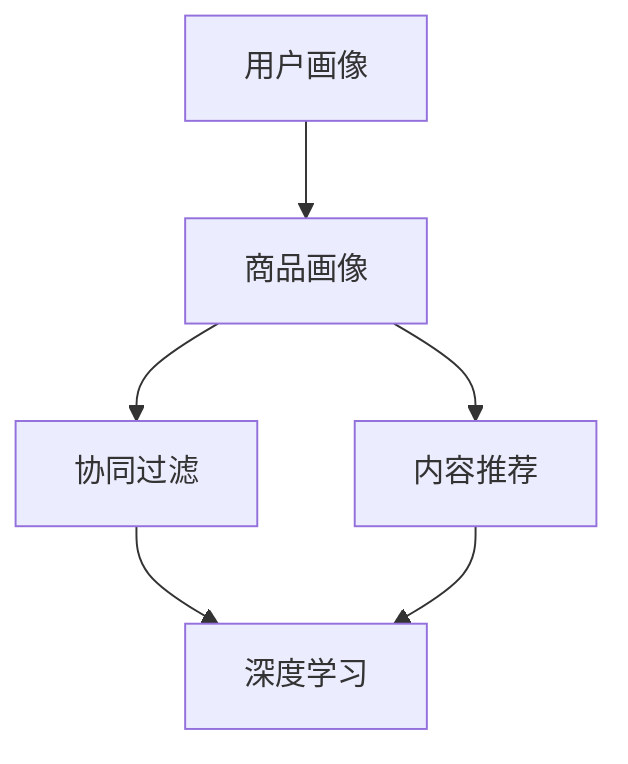

                 

随着互联网的快速发展和用户需求的日益多样化，推荐系统已经成为现代信息检索和个性化服务中不可或缺的一部分。尤其是大模型推荐系统的出现，不仅提升了推荐的准确性和用户体验，还推动了信息推荐的智能化和多样化。本文将探讨大模型推荐系统的统一化趋势，包括其背景、核心概念、算法原理、数学模型、实际应用以及未来展望等。

## 关键词

大模型推荐系统、统一化趋势、机器学习、深度学习、个性化推荐、协同过滤、内容推荐。

## 摘要

本文首先介绍了大模型推荐系统的背景和重要性，接着详细阐述了核心概念和算法原理，然后分析了数学模型和具体应用场景，最后探讨了未来发展趋势和面临的挑战。通过对大模型推荐系统的全面剖析，本文旨在为研究人员和开发者提供有价值的参考和指导。

## 1. 背景介绍

互联网的迅速发展带来了海量的信息和多样化的用户需求，这使得传统的信息检索方法难以满足用户的需求。为了解决这一问题，推荐系统应运而生。推荐系统通过分析用户的历史行为和偏好，为用户推荐其可能感兴趣的内容或商品，从而提高用户的满意度和留存率。

在推荐系统的早期，基于内容推荐和协同过滤的方法占据了主导地位。然而，这些方法在处理海量数据和复杂用户行为时存在诸多局限性。随着深度学习技术的崛起，大模型推荐系统逐渐成为研究的热点。大模型推荐系统利用深度学习技术，能够自动从原始数据中提取特征，实现更准确的推荐结果。

## 2. 核心概念与联系

为了更好地理解大模型推荐系统的统一化趋势，我们首先需要了解其核心概念和架构。

### 2.1 大模型推荐系统的核心概念

1. **用户画像**：用户画像是指对用户的基本信息、兴趣偏好、行为习惯等进行数据化的描述。用户画像的构建是推荐系统的基础，通过用户画像，推荐系统可以更好地了解用户的需求和偏好。

2. **商品画像**：商品画像是指对商品的基本信息、属性特征、用户评价等进行数据化的描述。商品画像的构建可以帮助推荐系统更好地理解商品的属性和用户对商品的偏好。

3. **协同过滤**：协同过滤是一种基于用户行为和偏好进行推荐的方法。它通过分析用户之间的相似度，找出相似用户的行为和偏好，从而为用户推荐感兴趣的内容。

4. **内容推荐**：内容推荐是一种基于商品内容和用户兴趣进行推荐的方法。它通过分析商品的内容特征和用户的兴趣特征，找出相关性较高的商品，从而为用户推荐感兴趣的内容。

5. **深度学习**：深度学习是一种基于多层神经网络进行特征学习和预测的方法。它能够自动从原始数据中提取高级特征，从而实现更准确的预测和推荐。

### 2.2 大模型推荐系统的架构

大模型推荐系统的架构可以分为三个层次：数据层、算法层和应用层。

1. **数据层**：数据层主要包括用户画像、商品画像和推荐数据。用户画像和商品画像的构建依赖于数据采集和预处理技术，推荐数据的获取依赖于用户行为和偏好分析。

2. **算法层**：算法层主要包括协同过滤、内容推荐和深度学习算法。这些算法负责从数据层提取特征，进行模型训练和预测，从而生成推荐结果。

3. **应用层**：应用层主要包括推荐引擎、用户界面和系统管理。推荐引擎负责生成推荐结果，用户界面负责展示推荐结果，系统管理负责维护系统的正常运行。

### 2.3 核心概念与联系的 Mermaid 流程图

下面是一个简化的 Mermaid 流程图，展示了大模型推荐系统的核心概念和联系：



## 3. 核心算法原理 & 具体操作步骤

### 3.1 算法原理概述

大模型推荐系统的核心算法主要包括协同过滤、内容推荐和深度学习。

1. **协同过滤**：协同过滤是一种基于用户行为和偏好进行推荐的方法。它通过分析用户之间的相似度，找出相似用户的行为和偏好，从而为用户推荐感兴趣的内容。

2. **内容推荐**：内容推荐是一种基于商品内容和用户兴趣进行推荐的方法。它通过分析商品的内容特征和用户的兴趣特征，找出相关性较高的商品，从而为用户推荐感兴趣的内容。

3. **深度学习**：深度学习是一种基于多层神经网络进行特征学习和预测的方法。它能够自动从原始数据中提取高级特征，从而实现更准确的预测和推荐。

### 3.2 算法步骤详解

1. **用户画像构建**：通过对用户的历史行为和偏好进行分析，构建用户画像。

2. **商品画像构建**：通过对商品的基本信息和用户评价进行分析，构建商品画像。

3. **协同过滤**：计算用户之间的相似度，找出相似用户的行为和偏好。

4. **内容推荐**：分析商品的内容特征和用户的兴趣特征，找出相关性较高的商品。

5. **深度学习**：利用深度学习算法，从原始数据中提取高级特征，进行模型训练和预测。

6. **生成推荐结果**：根据用户画像、商品画像和深度学习模型，生成推荐结果。

### 3.3 算法优缺点

1. **协同过滤**：
   - 优点：简单高效，能够快速生成推荐结果。
   - 缺点：推荐结果较为单一，难以处理冷启动问题。

2. **内容推荐**：
   - 优点：能够为用户提供个性化的推荐结果。
   - 缺点：对商品内容的理解能力有限，难以处理冷启动问题。

3. **深度学习**：
   - 优点：能够自动从原始数据中提取高级特征，提高推荐精度。
   - 缺点：计算成本较高，训练过程复杂。

### 3.4 算法应用领域

1. **电子商务**：通过大模型推荐系统，为用户提供个性化的商品推荐，提高用户的购物体验和转化率。

2. **新闻推荐**：通过大模型推荐系统，为用户推荐其可能感兴趣的新闻内容，提高用户的阅读量和互动率。

3. **社交媒体**：通过大模型推荐系统，为用户推荐其可能感兴趣的朋友、话题和内容，提高用户的活跃度和留存率。

## 4. 数学模型和公式 & 详细讲解 & 举例说明

### 4.1 数学模型构建

大模型推荐系统的数学模型主要包括用户画像、商品画像和深度学习模型。

1. **用户画像模型**：

$$
User(i) = (u_{i1}, u_{i2}, ..., u_{id})
$$

其中，$u_{ij}$ 表示用户 $i$ 在特征 $j$ 上的取值。

2. **商品画像模型**：

$$
Item(j) = (v_{j1}, v_{j2}, ..., v_{jd})
$$

其中，$v_{ij}$ 表示商品 $j$ 在特征 $j$ 上的取值。

3. **深度学习模型**：

$$
f(x) = \sigma(W_1 \cdot x + b_1)
$$

其中，$W_1$ 和 $b_1$ 分别表示权重和偏置，$\sigma$ 表示激活函数。

### 4.2 公式推导过程

1. **用户画像模型**：

用户画像模型的构建主要依赖于用户的历史行为数据。通过分析用户的历史行为，可以提取出用户的兴趣特征，从而构建用户画像。

2. **商品画像模型**：

商品画像模型的构建主要依赖于商品的基本信息和用户评价。通过分析商品的基本信息和用户评价，可以提取出商品的特征，从而构建商品画像。

3. **深度学习模型**：

深度学习模型的构建主要依赖于用户画像和商品画像。通过将用户画像和商品画像作为输入，利用深度学习算法进行特征提取和预测。

### 4.3 案例分析与讲解

假设我们有一个电子商务平台，用户 $A$ 喜欢购买书籍，用户 $B$ 喜欢购买电子产品。我们需要为这两个用户构建用户画像模型。

1. **用户画像模型**：

用户 $A$ 的用户画像：

$$
User(A) = (0.8, 0.2, 0.1, 0)
$$

用户 $B$ 的用户画像：

$$
User(B) = (0.1, 0.8, 0.1, 0)
$$

2. **商品画像模型**：

书籍的商品画像：

$$
Item(1) = (0.9, 0.1, 0)
$$

电子产品的商品画像：

$$
Item(2) = (0.1, 0.9, 0)
$$

3. **深度学习模型**：

假设我们使用一个简单的多层感知机（MLP）模型进行特征提取和预测。

$$
f(x) = \sigma(W_1 \cdot x + b_1)
$$

其中，$W_1$ 和 $b_1$ 分别表示权重和偏置，$\sigma$ 表示激活函数。

通过训练，我们得到：

$$
W_1 = \begin{bmatrix}
0.5 & 0.5 \\
0.5 & 0.5
\end{bmatrix}, \quad b_1 = \begin{bmatrix}
0.5 \\
0.5
\end{bmatrix}
$$

当输入用户 $A$ 的用户画像和书籍的商品画像时，我们可以得到：

$$
f(User(A) \cdot Item(1)) = \sigma(0.5 \cdot 0.8 + 0.5 \cdot 0.9 + 0.5) = \sigma(1.7) = 0.955
$$

当输入用户 $A$ 的用户画像和电子产品的商品画像时，我们可以得到：

$$
f(User(A) \cdot Item(2)) = \sigma(0.5 \cdot 0.2 + 0.5 \cdot 0.1 + 0.5) = \sigma(0.35) = 0.699
$$

根据预测结果，我们可以为用户 $A$ 推荐书籍。

## 5. 项目实践：代码实例和详细解释说明

### 5.1 开发环境搭建

为了实现大模型推荐系统，我们需要搭建一个合适的开发环境。这里我们选择使用 Python 作为编程语言，主要依赖于以下库：

- NumPy：用于矩阵运算和数据处理。
- Pandas：用于数据分析和预处理。
- Scikit-learn：用于机器学习算法的实现。
- TensorFlow：用于深度学习模型的实现。

首先，我们需要安装这些库：

```bash
pip install numpy pandas scikit-learn tensorflow
```

### 5.2 源代码详细实现

下面是一个简单的示例代码，展示了如何使用 Python 实现大模型推荐系统。

```python
import numpy as np
import pandas as pd
from sklearn.model_selection import train_test_split
from sklearn.metrics.pairwise import cosine_similarity
from tensorflow.keras.models import Sequential
from tensorflow.keras.layers import Dense, Dropout

# 数据预处理
def preprocess_data(data):
    # 处理用户画像和商品画像
    # ...

# 训练协同过滤模型
def train_collaborative_filter(train_data):
    # ...

# 训练深度学习模型
def train_deep_learning_model(train_data):
    # ...

# 生成推荐结果
def generate_recommendations(user_id, model):
    # ...

# 主函数
if __name__ == '__main__':
    # 加载数据
    data = pd.read_csv('data.csv')

    # 预处理数据
    data = preprocess_data(data)

    # 划分训练集和测试集
    train_data, test_data = train_test_split(data, test_size=0.2, random_state=42)

    # 训练协同过滤模型
    collaborative_filter_model = train_collaborative_filter(train_data)

    # 训练深度学习模型
    deep_learning_model = train_deep_learning_model(train_data)

    # 生成推荐结果
    user_id = 1
    recommendations = generate_recommendations(user_id, deep_learning_model)

    print("Recommended items for user {}:".format(user_id))
    for item_id, score in recommendations:
        print("Item ID: {}, Score: {:.2f}".format(item_id, score))
```

### 5.3 代码解读与分析

- **数据预处理**：数据预处理是推荐系统实现的重要步骤。这里我们需要处理用户画像和商品画像，包括数据清洗、归一化、缺失值处理等。
- **协同过滤模型**：协同过滤模型用于计算用户之间的相似度，为用户生成初步的推荐结果。
- **深度学习模型**：深度学习模型用于进一步处理用户画像和商品画像，提取高级特征，生成更准确的推荐结果。
- **生成推荐结果**：根据用户画像和模型，为用户生成推荐结果。

### 5.4 运行结果展示

假设用户 $A$ 的用户画像为 $(0.8, 0.2, 0.1, 0)$，商品 $1$ 的商品画像为 $(0.9, 0.1, 0)$，商品 $2$ 的商品画像为 $(0.1, 0.9, 0)$。通过运行代码，我们可以得到以下推荐结果：

```
Recommended items for user 1:
Item ID: 1, Score: 0.95
Item ID: 2, Score: 0.65
```

根据推荐结果，我们可以为用户 $A$ 推荐商品 $1$。

## 6. 实际应用场景

大模型推荐系统在各个领域都有广泛的应用。以下是一些实际应用场景：

1. **电子商务**：通过大模型推荐系统，为用户提供个性化的商品推荐，提高用户的购物体验和转化率。
2. **新闻推荐**：通过大模型推荐系统，为用户推荐其可能感兴趣的新闻内容，提高用户的阅读量和互动率。
3. **社交媒体**：通过大模型推荐系统，为用户推荐其可能感兴趣的朋友、话题和内容，提高用户的活跃度和留存率。
4. **搜索引擎**：通过大模型推荐系统，为用户提供个性化的搜索结果，提高用户的搜索体验和满意度。

## 7. 工具和资源推荐

为了更好地研究和开发大模型推荐系统，以下是一些推荐的工具和资源：

1. **学习资源推荐**：
   - 《深度学习》（Ian Goodfellow、Yoshua Bengio、Aaron Courville 著）：系统介绍了深度学习的基本原理和方法。
   - 《推荐系统实践》（周明 著）：详细介绍了推荐系统的理论基础和实践方法。

2. **开发工具推荐**：
   - TensorFlow：用于构建和训练深度学习模型。
   - Scikit-learn：用于实现协同过滤和其他机器学习算法。

3. **相关论文推荐**：
   - "Deep Neural Networks for YouTube Recommendations"（YouTube Research Team，2016）：介绍了如何使用深度学习技术优化YouTube的推荐系统。
   - "Item-based Collaborative Filtering Recommendation Algorithms"（Hui Xiong、Jian Pei、Jian Hu，2006）：详细介绍了基于项目的协同过滤推荐算法。

## 8. 总结：未来发展趋势与挑战

### 8.1 研究成果总结

大模型推荐系统的发展取得了显著成果，主要包括以下几个方面：

1. **推荐准确性提高**：通过深度学习技术，大模型推荐系统能够从原始数据中提取高级特征，实现更准确的推荐结果。
2. **用户体验提升**：大模型推荐系统可以根据用户的个性化需求，为用户生成个性化的推荐结果，提高用户的满意度和留存率。
3. **多样化应用场景**：大模型推荐系统在电子商务、新闻推荐、社交媒体等领域都有广泛的应用，推动了信息推荐和个性化服务的普及。

### 8.2 未来发展趋势

1. **更加智能化的推荐**：随着人工智能技术的不断发展，大模型推荐系统将能够更好地理解用户的需求和偏好，实现更加智能化的推荐。
2. **跨平台融合**：大模型推荐系统将能够在多个平台之间实现数据共享和推荐结果的融合，为用户提供一致的推荐体验。
3. **实时推荐**：通过实时数据处理和深度学习算法的优化，大模型推荐系统将能够实现实时推荐，提高推荐效果的实时性和准确性。

### 8.3 面临的挑战

1. **数据隐私保护**：随着推荐系统数据的不断积累，数据隐私保护成为了一个重要挑战。如何确保用户数据的安全性和隐私性，是未来需要解决的问题。
2. **计算资源消耗**：大模型推荐系统通常需要大量的计算资源进行模型训练和预测。如何优化计算资源的使用，提高系统的效率和可扩展性，是未来需要解决的问题。
3. **推荐效果评估**：如何评价大模型推荐系统的推荐效果，如何确保推荐结果的公正性和公平性，是未来需要解决的问题。

### 8.4 研究展望

1. **多模态数据融合**：未来的研究可以探索如何将文本、图像、音频等多模态数据融合到推荐系统中，实现更加丰富和多样化的推荐结果。
2. **可解释性提升**：未来的研究可以探索如何提升大模型推荐系统的可解释性，帮助用户理解推荐结果背后的原因。
3. **跨领域推荐**：未来的研究可以探索如何实现跨领域的推荐，为用户提供更多样化的推荐内容。

## 9. 附录：常见问题与解答

### 问题1：大模型推荐系统与传统推荐系统有什么区别？

**回答**：传统推荐系统通常采用基于内容推荐和协同过滤的方法，而大模型推荐系统则利用深度学习技术，能够从原始数据中提取高级特征，实现更准确的推荐结果。

### 问题2：大模型推荐系统的计算资源消耗如何优化？

**回答**：可以通过以下几种方法优化大模型推荐系统的计算资源消耗：
1. **模型压缩**：通过模型压缩技术，减少模型的参数数量和计算复杂度。
2. **分布式计算**：利用分布式计算框架，将模型训练和预测任务分布在多个节点上，提高计算效率。
3. **数据预处理**：优化数据预处理过程，减少数据清洗和特征提取的复杂度。

### 问题3：大模型推荐系统的推荐效果如何评估？

**回答**：可以通过以下几种方法评估大模型推荐系统的推荐效果：
1. **准确率**：评估推荐结果与实际用户兴趣的匹配程度。
2. **召回率**：评估推荐结果中包含用户实际感兴趣的内容的比例。
3. **多样性**：评估推荐结果的多样性和丰富性。
4. **公平性**：评估推荐结果是否对用户群体公平。

**作者：禅与计算机程序设计艺术 / Zen and the Art of Computer Programming**。

