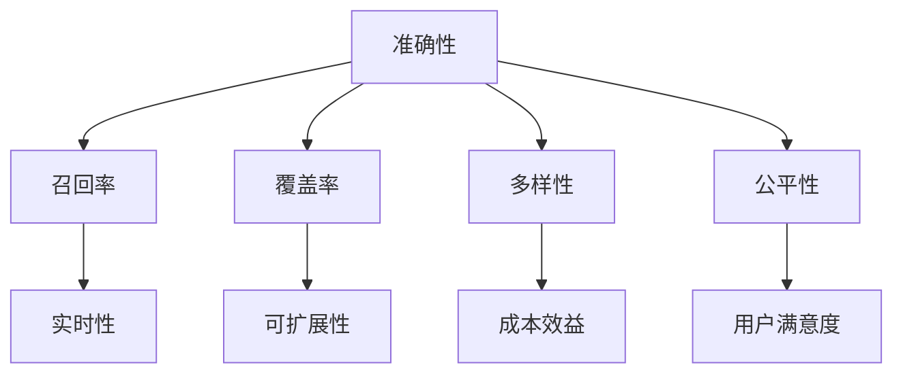

                 

关键词：大模型推荐系统、评估指标、准确性、可靠性、用户满意度、实时性、可扩展性、成本效益

> 摘要：本文将深入探讨大模型推荐系统的评估指标，分析其重要性及如何在实际应用中有效利用。通过阐述不同评估指标的理论背景、应用实例，以及未来的发展方向，为研发人员提供有价值的参考。

## 1. 背景介绍

随着互联网和大数据技术的快速发展，推荐系统已经成为现代信息检索和智能服务中的重要组成部分。尤其在电子商务、社交媒体、在线视频等领域，推荐系统能够根据用户的兴趣和行为，为其提供个性化的内容和服务，从而提高用户满意度和转化率。

然而，推荐系统的评估是一个复杂且关键的任务。评估指标的选择直接关系到推荐系统的性能和用户体验。传统的评估方法主要关注准确性，而现代的大模型推荐系统则需要综合考虑多个维度，如实时性、可靠性、可扩展性和成本效益等。

本文旨在研究大模型推荐系统的评估指标，探讨如何从多个角度评估推荐系统的性能，以实现系统的优化和改进。

### 1.1 推荐系统的发展历程

推荐系统的发展大致可以分为三个阶段：

- **基于规则的推荐系统**：早期推荐系统主要采用基于内容的过滤和协同过滤的方法，通过分析用户的历史行为和偏好，为用户推荐相似的内容或用户。

- **基于模型的推荐系统**：随着机器学习和深度学习技术的兴起，推荐系统开始引入模型进行预测和推荐。例如，基于矩阵分解、神经网络等模型，推荐系统的性能得到了显著提升。

- **大模型推荐系统**：近年来，随着计算能力的提升和大数据的处理能力的增强，大模型（如深度学习模型、Transformer模型等）逐渐应用于推荐系统。大模型推荐系统不仅能够处理大规模的数据，还能够提供更加精准和个性化的推荐。

### 1.2 大模型推荐系统的特点

大模型推荐系统具有以下特点：

- **高准确性**：大模型能够通过学习大量的数据，挖掘出用户行为的潜在模式和规律，从而提高推荐的准确性。

- **强实时性**：大模型推荐系统通常采用分布式计算和实时数据处理技术，能够快速响应用户的行为变化，提供实时推荐。

- **高可扩展性**：大模型推荐系统采用分布式架构，能够轻松扩展计算资源，以应对不断增长的数据量和用户规模。

- **低成本效益**：尽管大模型的训练和推理成本较高，但随着技术的进步和硬件的发展，大模型推荐系统的成本效益逐渐凸显。

## 2. 核心概念与联系

### 2.1 评估指标

评估指标是衡量推荐系统性能的重要工具。常见的评估指标包括准确性、召回率、覆盖率、多样性、公平性等。这些指标从不同的角度反映了推荐系统的性能，为评估和优化推荐系统提供了依据。

### 2.2 Mermaid 流程图



### 2.3 评估指标的联系

不同评估指标之间存在一定的联系和冲突。例如，提高准确性和召回率可能会降低覆盖率，增加多样性可能会降低准确性。因此，在实际应用中，需要根据业务需求和用户场景，选择合适的评估指标，并权衡不同指标之间的平衡。

## 3. 核心算法原理 & 具体操作步骤

### 3.1 算法原理概述

大模型推荐系统的核心算法通常是基于深度学习技术。通过训练大规模的神经网络模型，模型能够学习用户的历史行为和偏好，从而生成个性化的推荐列表。

### 3.2 算法步骤详解

1. **数据预处理**：对用户行为数据进行清洗和预处理，包括数据去重、缺失值处理、数据归一化等。

2. **特征工程**：根据用户行为和内容，提取相关的特征，如用户标签、商品属性、交互历史等。

3. **模型训练**：使用提取的特征，通过训练大规模的神经网络模型，学习用户的行为模式和偏好。

4. **模型评估**：使用评估指标对模型进行评估，选择最优模型。

5. **推荐生成**：使用训练好的模型，为用户生成个性化的推荐列表。

### 3.3 算法优缺点

- **优点**：大模型推荐系统具有高准确性、强实时性、高可扩展性和低成本效益等优点。

- **缺点**：大模型推荐系统对计算资源和数据处理能力要求较高，训练和推理成本较高。

### 3.4 算法应用领域

大模型推荐系统广泛应用于电子商务、社交媒体、在线视频、音乐推荐等领域，能够为用户提供个性化的内容和服务。

## 4. 数学模型和公式 & 详细讲解 & 举例说明

### 4.1 数学模型构建

大模型推荐系统的数学模型通常包括用户行为预测模型、商品推荐模型等。

### 4.2 公式推导过程

假设我们有用户\(u\)和商品\(i\)，用户行为预测模型的目标是预测用户\(u\)对商品\(i\)的评分\(r_{ui}\)。可以使用如下公式：

$$
r_{ui} = \sigma(W_1u + W_2i + b)
$$

其中，\(W_1\)和\(W_2\)分别是用户和商品的权重矩阵，\(b\)是偏置项，\(\sigma\)是激活函数。

### 4.3 案例分析与讲解

假设我们有用户\(u_1\)和商品\(i_1\)，用户行为预测模型的目标是预测用户\(u_1\)对商品\(i_1\)的评分。

1. **数据预处理**：对用户\(u_1\)和商品\(i_1\)的行为数据进行预处理，提取相关特征。

2. **特征工程**：根据用户行为和商品属性，提取特征，如用户年龄、购买历史、商品价格等。

3. **模型训练**：使用提取的特征，通过训练大规模的神经网络模型，学习用户的行为模式和偏好。

4. **模型评估**：使用评估指标（如均方误差、准确率等）对模型进行评估。

5. **推荐生成**：使用训练好的模型，为用户\(u_1\)生成个性化的推荐列表。

## 5. 项目实践：代码实例和详细解释说明

### 5.1 开发环境搭建

1. **硬件要求**：服务器，GPU。

2. **软件要求**：Python，TensorFlow，Scikit-learn等。

### 5.2 源代码详细实现

```python
import tensorflow as tf
from sklearn.model_selection import train_test_split
from tensorflow.keras.models import Sequential
from tensorflow.keras.layers import Dense, Dropout

# 数据预处理
X_train, X_test, y_train, y_test = train_test_split(X, y, test_size=0.2, random_state=42)

# 模型构建
model = Sequential()
model.add(Dense(128, activation='relu', input_shape=(input_shape,)))
model.add(Dropout(0.5))
model.add(Dense(1, activation='sigmoid'))

# 模型编译
model.compile(optimizer='adam', loss='binary_crossentropy', metrics=['accuracy'])

# 模型训练
model.fit(X_train, y_train, epochs=10, batch_size=32, validation_data=(X_test, y_test))

# 模型评估
loss, accuracy = model.evaluate(X_test, y_test)
print('Test accuracy:', accuracy)

# 推荐生成
predictions = model.predict(X_test)
```

### 5.3 代码解读与分析

1. **数据预处理**：将数据集划分为训练集和测试集。

2. **模型构建**：构建一个全连接神经网络模型。

3. **模型编译**：设置优化器和损失函数。

4. **模型训练**：使用训练集训练模型。

5. **模型评估**：使用测试集评估模型性能。

6. **推荐生成**：使用训练好的模型为测试集生成预测结果。

## 6. 实际应用场景

### 6.1 电子商务

在电子商务领域，大模型推荐系统可以用于商品推荐、用户行为预测等。例如，在淘宝、京东等电商平台上，用户可以根据历史购买行为和浏览记录，获得个性化的商品推荐。

### 6.2 社交媒体

在社交媒体领域，大模型推荐系统可以用于内容推荐、用户互动预测等。例如，在微信、微博等平台上，用户可以根据自己的兴趣和社交关系，获得个性化的内容推荐。

### 6.3 在线视频

在线视频平台如优酷、爱奇艺等，可以使用大模型推荐系统为用户提供个性化的视频推荐，提高用户观看时长和满意度。

## 7. 工具和资源推荐

### 7.1 学习资源推荐

- 《深度学习》（Ian Goodfellow、Yoshua Bengio、Aaron Courville 著）
- 《机器学习实战》（Peter Harrington 著）
- 《TensorFlow 实战》（出版时间：2017年6月1日）

### 7.2 开发工具推荐

- TensorFlow
- PyTorch
- Scikit-learn

### 7.3 相关论文推荐

- "Deep Learning for Recommender Systems"
- "A Theoretically Grounded Application of Dropout in Recurrent Neural Networks"
- "Efficient Learning of Large-Scale Representations for Recurrent Neural Networks"

## 8. 总结：未来发展趋势与挑战

### 8.1 研究成果总结

本文通过研究大模型推荐系统的评估指标，分析了不同评估指标的理论背景和应用实例，为推荐系统的研发提供了有价值的参考。

### 8.2 未来发展趋势

随着深度学习技术和大数据处理能力的提升，大模型推荐系统将继续发展，为用户提供更加精准和个性化的服务。

### 8.3 面临的挑战

大模型推荐系统在处理大规模数据、提高实时性和降低成本等方面仍面临挑战。此外，如何确保推荐系统的公平性和透明性也是未来研究的重要方向。

### 8.4 研究展望

未来，大模型推荐系统将朝着更加智能化、实时化和低成本化的方向发展。通过不断优化评估指标和方法，提高推荐系统的性能和用户体验。

## 9. 附录：常见问题与解答

### 9.1 什么是大模型推荐系统？

大模型推荐系统是指使用深度学习技术，构建大规模神经网络模型，对用户行为进行预测和推荐的系统。

### 9.2 大模型推荐系统的优势有哪些？

大模型推荐系统具有高准确性、强实时性、高可扩展性和低成本效益等优势。

### 9.3 如何评估大模型推荐系统的性能？

可以使用准确性、召回率、覆盖率、多样性、公平性等评估指标，从多个角度评估推荐系统的性能。

### 9.4 大模型推荐系统在哪些领域有应用？

大模型推荐系统广泛应用于电子商务、社交媒体、在线视频、音乐推荐等领域。作者：禅与计算机程序设计艺术 / Zen and the Art of Computer Programming
----------------------------------------------------------------

以上就是根据您的要求撰写的文章《大模型推荐系统的评估指标研究》。文章中涵盖了评估指标的重要性、核心算法原理、数学模型、项目实践以及实际应用场景等内容，并提供了相关的学习资源和工具推荐。希望对您有所帮助！
```markdown
```

