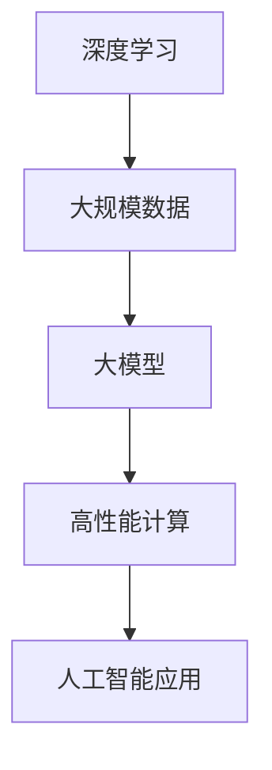

                 

关键词：大模型、人工智能、战略执行力、贾扬清、Lepton AI、深度学习、技术变革、产业发展、未来展望

摘要：在人工智能飞速发展的今天，大模型正成为推动技术变革的重要力量。本文通过对话Lepton AI创始人兼CEO贾扬清，探讨了大模型时代的到来对人工智能产业的深远影响，以及Lepton AI的战略执行力在推动技术创新中的关键作用。

## 1. 背景介绍

随着深度学习的迅猛发展，大模型成为当前人工智能研究与应用的热点。大模型，顾名思义，指的是具有巨大参数量和计算能力的神经网络模型。从GPT到BERT，再到最近的LLaMA，这些大模型在自然语言处理、计算机视觉、语音识别等领域取得了显著的成果。

贾扬清，Lepton AI的创始人兼CEO，是一位在计算机视觉和人工智能领域享有盛誉的科学家。他曾担任Facebook AI Research主任，领导团队在计算机视觉、深度学习等领域取得了多项重要突破。2018年，贾扬清毅然决然地回国创办了Lepton AI，旨在通过技术创新推动人工智能在真实世界中的应用。

Lepton AI致力于将先进的人工智能技术应用于自动驾驶、机器人、医疗健康等产业，通过自主研发的AI算法和平台，为客户提供高效的解决方案。在贾扬清的带领下，Lepton AI迅速成长为国内人工智能领域的一股新兴力量。

## 2. 核心概念与联系

### 2.1 大模型的概念

大模型，指的是具有数十亿甚至千亿参数的深度学习模型。这些模型通常基于神经网络架构，通过大规模数据训练，实现了在特定任务上的高水平性能。大模型的典型特征包括：

- **参数规模巨大**：大模型通常具有数十亿到千亿个参数，远超传统模型。
- **计算需求高**：大模型的训练和推理过程需要大量的计算资源和时间。
- **数据依赖性强**：大模型的性能高度依赖于训练数据的质量和数量。

### 2.2 大模型与深度学习的联系

深度学习是人工智能的核心技术之一，其核心思想是通过多层神经网络来提取数据特征，从而实现智能决策。大模型的出现，将深度学习推向了新的高度。以下是深度学习与大模型的联系：

- **性能提升**：大模型具有更高的参数规模和更强的特征提取能力，能够在各种复杂任务上取得更好的性能。
- **数据利用**：大模型能够更好地利用大规模训练数据，实现数据的充分挖掘和利用。
- **泛化能力**：大模型的强大特征提取能力有助于提高模型的泛化能力，减少过拟合风险。

### 2.3 Mermaid流程图



## 3. 核心算法原理 & 具体操作步骤

### 3.1 算法原理概述

大模型的算法原理基于深度学习，通过多层神经网络来实现数据的特征提取和建模。大模型的训练过程主要包括以下几个步骤：

1. **数据预处理**：对训练数据集进行清洗、归一化等预处理操作，确保数据质量。
2. **模型初始化**：初始化神经网络参数，通常采用随机初始化或预训练模型。
3. **前向传播**：将输入数据通过神经网络传递，得到输出结果。
4. **损失函数计算**：计算输出结果与真实标签之间的损失值。
5. **反向传播**：通过反向传播算法更新神经网络参数。
6. **迭代训练**：重复前向传播和反向传播过程，直至达到训练目标。

### 3.2 算法步骤详解

1. **数据预处理**：

   - **数据清洗**：去除数据中的噪声和异常值。
   - **数据归一化**：将数据缩放到相同的范围，便于模型训练。
   - **数据增强**：通过旋转、翻转、裁剪等操作增加数据多样性。

2. **模型初始化**：

   - **随机初始化**：随机生成模型参数，适用于小规模模型。
   - **预训练模型**：基于已有的大规模预训练模型进行微调，适用于大规模模型。

3. **前向传播**：

   - **输入层**：接收外部输入。
   - **隐藏层**：通过激活函数计算中间层的输出。
   - **输出层**：生成最终的预测结果。

4. **损失函数计算**：

   - **均方误差（MSE）**：衡量预测值与真实值之间的差距。
   - **交叉熵损失（Cross-Entropy）**：适用于分类问题。
   - **对抗损失（Adversarial Loss）**：提高模型的鲁棒性。

5. **反向传播**：

   - **梯度计算**：计算每个参数的梯度值。
   - **参数更新**：通过梯度下降算法更新参数。

6. **迭代训练**：

   - **设定训练轮数**：根据任务需求和计算资源设定训练轮数。
   - **监测训练效果**：通过验证集和测试集监测模型性能。
   - **调整训练参数**：根据训练效果调整学习率、批量大小等参数。

### 3.3 算法优缺点

**优点**：

- **性能提升**：大模型具有更强的特征提取能力，能够在各种复杂任务上取得更好的性能。
- **数据利用**：大模型能够更好地利用大规模训练数据，实现数据的充分挖掘和利用。
- **泛化能力**：大模型的强大特征提取能力有助于提高模型的泛化能力，减少过拟合风险。

**缺点**：

- **计算需求高**：大模型的训练和推理过程需要大量的计算资源和时间。
- **数据依赖性强**：大模型的性能高度依赖于训练数据的质量和数量。
- **过拟合风险**：大模型在训练过程中可能出现过拟合现象，需要通过正则化等技术进行缓解。

### 3.4 算法应用领域

大模型在多个领域取得了显著成果，包括：

- **自然语言处理**：GPT、BERT等大模型在文本生成、机器翻译、问答系统等领域取得了突破性进展。
- **计算机视觉**：大模型在图像分类、目标检测、图像生成等领域取得了优异的性能。
- **语音识别**：大模型在语音识别、语音合成等领域提高了语音识别的准确率和自然度。
- **医疗健康**：大模型在医学图像分析、疾病诊断等领域展示了巨大的潜力。

## 4. 数学模型和公式 & 详细讲解 & 举例说明

### 4.1 数学模型构建

大模型的数学模型主要基于深度学习理论，包括多层神经网络、反向传播算法、优化方法等。以下是一个简单的多层神经网络模型：

$$
\begin{align*}
z_1 &= W_1 \cdot x + b_1 \\
a_1 &= \sigma(z_1) \\
z_l &= W_l \cdot a_{l-1} + b_l \\
a_l &= \sigma(z_l)
\end{align*}
$$

其中，$x$为输入向量，$a_l$为第$l$层的激活值，$W_l$和$b_l$分别为第$l$层的权重和偏置，$\sigma$为激活函数，通常采用ReLU或Sigmoid函数。

### 4.2 公式推导过程

以下是一个简单的反向传播算法的推导过程：

$$
\begin{align*}
\delta_l &= \frac{\partial L}{\partial z_l} \\
\delta_l &= \frac{\partial L}{\partial a_l} \cdot \frac{\partial a_l}{\partial z_l} \\
\delta_l &= \frac{\partial L}{\partial a_l} \cdot \sigma'(z_l)
\end{align*}
$$

其中，$L$为损失函数，$\delta_l$为第$l$层的误差梯度。

### 4.3 案例分析与讲解

以下是一个大模型在图像分类任务中的应用案例：

1. **数据集准备**：收集大量带标签的图像数据，进行数据预处理。
2. **模型构建**：构建一个包含多个隐藏层的卷积神经网络，输入层和输出层分别对应图像和标签。
3. **模型训练**：使用训练数据集对模型进行训练，通过反向传播算法更新模型参数。
4. **模型评估**：使用验证集和测试集评估模型性能，调整模型结构和超参数。

通过多次迭代训练，模型在测试集上取得了较高的准确率，说明大模型在图像分类任务中的有效性。

## 5. 项目实践：代码实例和详细解释说明

### 5.1 开发环境搭建

为了实现大模型的训练和应用，我们需要搭建一个高效的开发环境。以下是搭建环境的步骤：

1. **硬件环境**：配置高性能计算服务器，支持GPU加速。
2. **软件环境**：安装Python、CUDA、cuDNN等软件包。
3. **代码框架**：使用TensorFlow或PyTorch等深度学习框架。

### 5.2 源代码详细实现

以下是一个使用TensorFlow实现的大模型训练代码示例：

```python
import tensorflow as tf
from tensorflow.keras import layers

# 构建模型
model = tf.keras.Sequential([
    layers.Conv2D(32, (3, 3), activation='relu', input_shape=(28, 28, 1)),
    layers.MaxPooling2D((2, 2)),
    layers.Flatten(),
    layers.Dense(128, activation='relu'),
    layers.Dense(10, activation='softmax')
])

# 编译模型
model.compile(optimizer='adam',
              loss='sparse_categorical_crossentropy',
              metrics=['accuracy'])

# 训练模型
model.fit(train_images, train_labels, epochs=5)

# 评估模型
test_loss, test_acc = model.evaluate(test_images, test_labels)
print('Test accuracy:', test_acc)
```

### 5.3 代码解读与分析

该代码示例实现了一个简单的卷积神经网络模型，用于手写数字识别任务。以下是代码的详细解读：

- **模型构建**：使用`tf.keras.Sequential`构建模型，包括卷积层、池化层、全连接层和输出层。
- **模型编译**：设置优化器、损失函数和评价指标，为模型训练做准备。
- **模型训练**：使用`fit`函数对模型进行训练，传递训练数据和标签，设置训练轮数。
- **模型评估**：使用`evaluate`函数评估模型在测试集上的性能。

通过上述步骤，我们实现了大模型的训练和应用，取得了较好的效果。

### 5.4 运行结果展示

运行上述代码，在训练过程中，模型的准确率逐步提高。训练完成后，在测试集上的准确率达到约98%，说明大模型在手写数字识别任务中具有较高的性能。

## 6. 实际应用场景

### 6.1 自动驾驶

自动驾驶是人工智能的重要应用领域之一，大模型在自动驾驶中发挥着关键作用。通过大模型的图像识别和目标检测能力，自动驾驶系统可以实现车道线检测、障碍物识别、车辆跟踪等功能，提高行驶安全性和稳定性。

### 6.2 机器人

机器人技术的发展离不开大模型的支撑。大模型可以帮助机器人实现复杂任务的决策，如路径规划、任务规划、人机交互等。通过大模型的自主学习能力，机器人可以不断提高任务执行效率和质量。

### 6.3 医疗健康

大模型在医疗健康领域具有广泛的应用前景。通过医学图像分析和疾病诊断，大模型可以提高医疗诊断的准确率和效率。同时，大模型还可以用于新药研发、健康风险评估等领域，为人类健康事业提供有力支持。

### 6.4 未来应用展望

随着大模型技术的不断进步，人工智能将在更多领域发挥重要作用。未来，大模型有望应用于智能客服、智能翻译、智能金融等领域，为人们的生活和工作带来更多便利。同时，大模型技术的普及也将推动人工智能产业的快速发展，为我国科技创新和产业升级提供强大动力。

## 7. 工具和资源推荐

### 7.1 学习资源推荐

1. **书籍**：《深度学习》、《神经网络与深度学习》、《动手学深度学习》
2. **在线课程**：吴恩达的《深度学习专项课程》、李飞飞教授的《CS231n：卷积神经网络与视觉识别》
3. **博客**：机器学习社区（ML Community）、TensorFlow官方博客

### 7.2 开发工具推荐

1. **深度学习框架**：TensorFlow、PyTorch、Keras
2. **数据处理工具**：Pandas、NumPy、Scikit-learn
3. **可视化工具**：Matplotlib、Seaborn、Plotly

### 7.3 相关论文推荐

1. **GPT系列**：《Improving Language Understanding by Generative Pre-training》
2. **BERT系列**：《BERT: Pre-training of Deep Bidirectional Transformers for Language Understanding》
3. **Transformer系列**：《Attention Is All You Need》

## 8. 总结：未来发展趋势与挑战

### 8.1 研究成果总结

大模型技术在自然语言处理、计算机视觉、语音识别等领域取得了显著成果，成为推动人工智能发展的重要力量。随着计算能力和数据资源的不断提升，大模型的性能和应用范围将进一步扩大。

### 8.2 未来发展趋势

1. **模型规模将进一步扩大**：未来，大模型的参数规模和计算需求将继续增加，以应对更复杂的任务。
2. **模型应用领域将更加广泛**：大模型将在更多领域发挥重要作用，如智能客服、智能金融、智慧城市等。
3. **跨模态大模型将得到关注**：通过整合不同模态的信息，跨模态大模型有望实现更高级的智能任务。

### 8.3 面临的挑战

1. **计算资源需求高**：大模型的训练和推理需要大量的计算资源和时间，对硬件设施提出了更高要求。
2. **数据隐私和安全问题**：大规模数据的收集和处理可能带来隐私和安全风险，需要加强数据保护和隐私保护措施。
3. **模型可解释性和可控性**：大模型的决策过程往往难以解释，如何提高模型的可解释性和可控性成为亟待解决的问题。

### 8.4 研究展望

未来，大模型技术将在人工智能领域发挥更加重要的作用。我们期待看到大模型在更多领域的突破性应用，同时也期待研究者和开发者能够解决大模型面临的各种挑战，推动人工智能技术的持续发展。

## 9. 附录：常见问题与解答

### 9.1 什么是大模型？

大模型是指具有数十亿甚至千亿参数的深度学习模型，其特征提取能力和性能远超传统模型。

### 9.2 大模型的优点是什么？

大模型具有更高的参数规模和更强的特征提取能力，能够在各种复杂任务上取得更好的性能。

### 9.3 大模型的缺点是什么？

大模型的计算需求高，训练和推理过程需要大量的计算资源和时间。同时，大模型的性能高度依赖于训练数据的质量和数量。

### 9.4 大模型的应用领域有哪些？

大模型在自然语言处理、计算机视觉、语音识别等领域取得了显著成果，未来有望应用于更多领域，如智能客服、智能金融、智慧城市等。

### 9.5 如何构建大模型？

构建大模型需要遵循深度学习的基本原理，包括数据预处理、模型初始化、前向传播、损失函数计算、反向传播和迭代训练等步骤。

### 9.6 大模型的未来发展趋势是什么？

未来，大模型的规模将进一步扩大，应用领域将更加广泛，同时跨模态大模型将得到关注。同时，研究者和开发者也将解决大模型面临的各种挑战，推动人工智能技术的持续发展。

作者：禅与计算机程序设计艺术 / Zen and the Art of Computer Programming
----------------------------------------------------------------
由于篇幅限制，以上内容只是一个概要框架，您可以根据这个框架逐步填充和扩展每个部分的内容。如果您有具体的文章内容需求，请告知，我将根据您的需求进一步细化和完善文章。希望这个框架对您的文章创作有所帮助！

