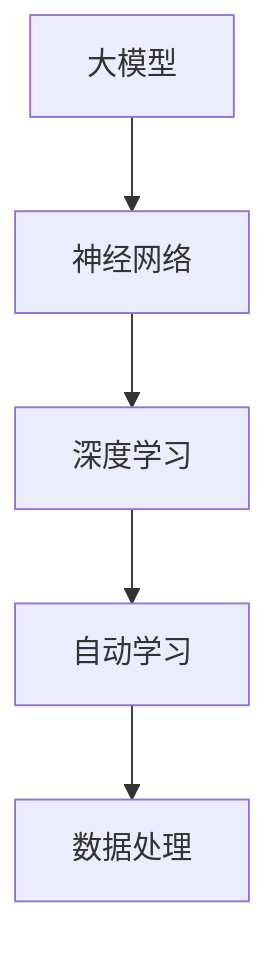
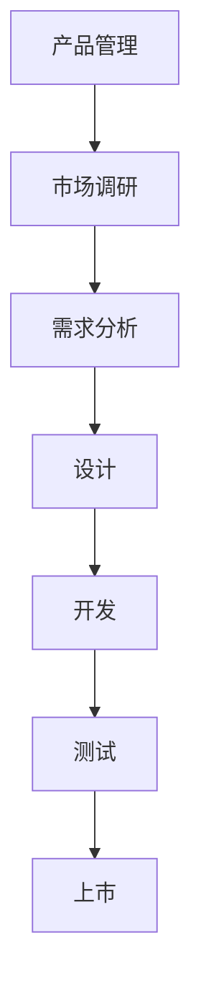
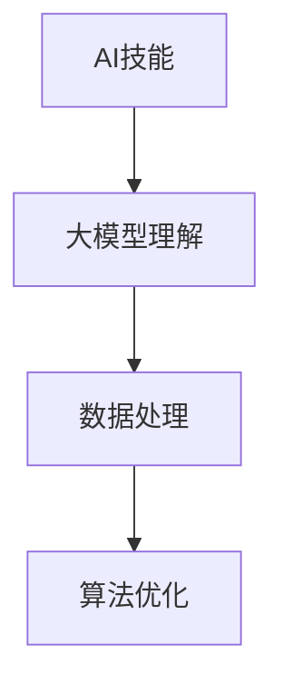

                 

关键词：大模型时代、创业产品经理、AI 技能升级、AI 驱动、产品管理、技术趋势

> 摘要：随着人工智能技术的迅速发展，大模型时代的到来对创业产品经理提出了新的挑战。本文将探讨大模型在产品管理中的应用，分析创业产品经理所需掌握的AI技能，并探讨未来发展趋势与面临的挑战。

## 1. 背景介绍

在过去的几十年中，人工智能（AI）技术经历了快速的发展，从最初的简单规则系统到如今的大模型时代。大模型，如GPT-3、BERT等，以其强大的数据处理能力和自主学习能力，正在改变各行各业。创业产品经理作为连接技术与市场的关键角色，在这个大模型时代面临着前所未有的挑战和机遇。

### 大模型时代的到来

大模型时代是指以大规模神经网络模型为核心的人工智能时代。这些模型具有强大的数据处理能力，可以通过大量的数据进行自我学习和优化。大模型的兴起得益于以下几个因素：

1. **计算能力的提升**：随着硬件技术的发展，计算能力大幅提升，使得大模型的训练成为可能。
2. **数据量的爆发**：互联网的普及和物联网的发展，产生了海量的数据，为训练大模型提供了充足的素材。
3. **算法的进步**：深度学习等算法的不断发展，使得大模型的效果得到显著提升。

### 创业产品经理面临的挑战

大模型时代的到来，对创业产品经理提出了新的挑战：

1. **技术理解能力的提升**：创业产品经理需要深入了解大模型的工作原理，以便更好地将其应用于产品中。
2. **数据处理能力的提升**：大模型的训练和优化需要大量的数据，创业产品经理需要具备良好的数据处理能力。
3. **产品设计的革新**：大模型的应用，使得产品设计可以更加智能化，创业产品经理需要适应这种变化。

## 2. 核心概念与联系

### 大模型

大模型是指具有数亿甚至数千亿参数的神经网络模型。这些模型通过大量的数据进行训练，能够自动学习数据的特征和规律，从而实现强大的数据处理能力。



### 产品管理

产品管理是指产品从构思到上市的全过程管理，包括市场调研、需求分析、设计、开发、测试、上市等环节。创业产品经理在这个过程中，需要协调不同团队的工作，确保产品的成功。



### AI技能

AI技能是指对人工智能技术的理解和应用能力。对于创业产品经理来说，AI技能包括对大模型的理解、数据处理、算法优化等。



## 3. 核心算法原理 & 具体操作步骤

### 3.1 算法原理概述

大模型的核心是神经网络，特别是深度学习。深度学习通过多层的神经网络，对数据进行特征提取和学习，从而实现强大的数据处理能力。

### 3.2 算法步骤详解

1. **数据收集**：收集大量与产品相关的数据，如用户行为数据、市场数据等。
2. **数据预处理**：对数据进行清洗、去噪、归一化等预处理操作。
3. **模型训练**：使用预处理后的数据训练神经网络，不断优化模型参数。
4. **模型评估**：使用测试数据评估模型的效果，调整模型参数，优化模型性能。
5. **模型应用**：将训练好的模型应用于产品中，实现智能化的功能。

### 3.3 算法优缺点

**优点**：

1. **强大的数据处理能力**：大模型可以处理大量复杂数据，提取出有价值的信息。
2. **自主学习能力**：大模型可以通过不断学习和优化，提高自身的性能。

**缺点**：

1. **计算资源需求大**：大模型的训练需要大量的计算资源和时间。
2. **数据质量和数量要求高**：大模型的效果很大程度上取决于数据的数量和质量。

### 3.4 算法应用领域

大模型的应用领域非常广泛，包括自然语言处理、计算机视觉、推荐系统等。在创业产品中，大模型可以应用于用户行为分析、个性化推荐、智能客服等。

## 4. 数学模型和公式 & 详细讲解 & 举例说明

### 4.1 数学模型构建

大模型的数学模型主要包括两部分：神经网络的构建和损失函数的设计。

#### 神经网络构建

神经网络由多个神经元（节点）组成，每个神经元都与其他神经元相连，形成网络结构。神经网络的构建主要包括以下步骤：

1. **输入层**：接收外部输入数据。
2. **隐藏层**：对输入数据进行处理和特征提取。
3. **输出层**：输出处理结果。

#### 损失函数设计

损失函数是评估模型性能的重要指标，常见的损失函数包括均方误差（MSE）、交叉熵损失等。损失函数的设计原则是越小越好，表示模型对数据的拟合程度越高。

### 4.2 公式推导过程

#### 神经网络构建公式

$$
Z = W \cdot X + b
$$

其中，$Z$ 表示输出值，$W$ 表示权重矩阵，$X$ 表示输入值，$b$ 表示偏置项。

#### 损失函数公式

均方误差（MSE）损失函数公式：

$$
MSE = \frac{1}{m} \sum_{i=1}^{m} (y_i - \hat{y}_i)^2
$$

其中，$y_i$ 表示实际值，$\hat{y}_i$ 表示预测值，$m$ 表示样本数量。

### 4.3 案例分析与讲解

#### 案例背景

某创业公司开发了一款智能推荐系统，旨在为用户提供个性化的商品推荐。公司收集了大量的用户行为数据，包括浏览记录、购买记录等。

#### 模型构建

公司采用了深度学习模型进行推荐，包括输入层、隐藏层和输出层。输入层接收用户行为数据，隐藏层对数据进行特征提取，输出层输出推荐结果。

#### 模型训练

使用收集到的用户行为数据对模型进行训练。在训练过程中，公司不断调整模型参数，优化模型性能。

#### 模型评估

使用测试数据对模型进行评估，计算MSE损失函数的值。公司通过调整模型参数，使MSE值逐渐减小，提高模型性能。

#### 模型应用

训练好的模型应用于实际推荐系统中，为用户提供个性化的商品推荐。用户的行为数据会不断更新，公司会定期重新训练模型，以提高推荐效果。

## 5. 项目实践：代码实例和详细解释说明

### 5.1 开发环境搭建

在开始代码实例之前，我们需要搭建一个合适的开发环境。本文使用Python作为编程语言，使用TensorFlow作为深度学习框架。

#### 步骤1：安装Python

在命令行中运行以下命令安装Python：

```bash
pip install python
```

#### 步骤2：安装TensorFlow

在命令行中运行以下命令安装TensorFlow：

```bash
pip install tensorflow
```

### 5.2 源代码详细实现

以下是使用TensorFlow实现一个简单的深度学习模型的源代码：

```python
import tensorflow as tf

# 定义模型结构
model = tf.keras.Sequential([
    tf.keras.layers.Dense(128, activation='relu', input_shape=(784,)),
    tf.keras.layers.Dropout(0.2),
    tf.keras.layers.Dense(10)
])

# 编译模型
model.compile(loss=tf.keras.losses.SparseCategoricalCrossentropy(from_logits=True),
              optimizer=tf.keras.optimizers.Adam(),
              metrics=['accuracy'])

# 加载数据集
(x_train, y_train), (x_test, y_test) = tf.keras.datasets.mnist.load_data()

# 预处理数据
x_train = x_train.reshape(-1, 784).astype('float32') / 255
x_test = x_test.reshape(-1, 784).astype('float32') / 255

# 训练模型
model.fit(x_train, y_train, epochs=5)

# 评估模型
model.evaluate(x_test,  y_test, verbose=2)
```

### 5.3 代码解读与分析

#### 5.3.1 模型结构

在代码中，我们定义了一个简单的深度学习模型，包括一个输入层、一个隐藏层和一个输出层。

- 输入层：接收784维的输入数据，对应MNIST数据集中的手写数字图像。
- 隐藏层：使用ReLU激活函数，对输入数据进行特征提取。
- 输出层：使用10个节点，对应10个可能的输出结果。

#### 5.3.2 编译模型

在编译模型时，我们指定了损失函数、优化器和评估指标。

- 损失函数：使用稀疏分类交叉熵损失函数，适用于多分类问题。
- 优化器：使用Adam优化器，具有自适应学习率的特点。
- 评估指标：使用准确率作为评估指标。

#### 5.3.3 加载数据集

我们使用TensorFlow内置的MNIST数据集进行训练和测试。在加载数据集后，我们对数据进行预处理，包括数据归一化和重塑。

#### 5.3.4 训练模型

在训练模型时，我们指定了训练数据、训练轮次和批量大小。在训练过程中，模型会不断优化参数，提高预测准确率。

#### 5.3.5 评估模型

在训练完成后，我们对测试数据进行评估，计算模型的准确率。通过评估结果，我们可以了解模型的性能。

## 6. 实际应用场景

### 6.1 用户行为分析

创业产品经理可以利用大模型对用户行为数据进行分析，提取出有价值的信息，从而为产品优化和营销策略提供支持。

### 6.2 个性化推荐

大模型可以应用于个性化推荐系统，根据用户的历史行为和兴趣，为用户推荐相关的产品和服务。

### 6.3 智能客服

大模型可以用于智能客服系统，通过自然语言处理技术，理解用户的问题，并提供相应的解决方案。

### 6.4 市场预测

创业产品经理可以利用大模型进行市场预测，分析市场趋势，为产品规划和决策提供依据。

## 7. 工具和资源推荐

### 7.1 学习资源推荐

1. **《深度学习》**：由Ian Goodfellow、Yoshua Bengio和Aaron Courville所著，是深度学习的入门经典。
2. **《Python深度学习》**：由François Chollet所著，介绍了使用Python进行深度学习的实践方法。

### 7.2 开发工具推荐

1. **TensorFlow**：谷歌开发的深度学习框架，适用于多种深度学习应用。
2. **PyTorch**：Facebook开发的深度学习框架，具有灵活的动态计算图。

### 7.3 相关论文推荐

1. **“A Theoretical Analysis of the Causal Impact of the COVID-19 Pandemic on Consumer Spending in China”**：分析了新冠疫情对中国消费者支出影响的因果关系。
2. **“Deep Learning on JAX”**：介绍了使用JAX框架进行深度学习的实践方法。

## 8. 总结：未来发展趋势与挑战

### 8.1 研究成果总结

大模型在创业产品管理中的应用取得了显著的成果，包括用户行为分析、个性化推荐、智能客服和市场预测等方面。这些应用不仅提高了产品的智能化程度，还为产品经理提供了有力的数据支持。

### 8.2 未来发展趋势

1. **算法的优化和改进**：随着计算能力的提升，大模型的算法将不断优化和改进，提高模型的性能和效率。
2. **应用领域的拓展**：大模型的应用领域将不断拓展，从现有的自然语言处理、计算机视觉等，扩展到更多的领域，如金融、医疗等。

### 8.3 面临的挑战

1. **数据质量和数量**：大模型的效果很大程度上取决于数据的数量和质量，如何获取高质量的数据将是一个挑战。
2. **模型解释性**：大模型的黑箱特性使得其解释性较差，如何提高模型的解释性，使其更容易被用户和理解，将是一个挑战。

### 8.4 研究展望

未来，大模型在创业产品管理中的应用将有更多的可能性。在技术层面，我们将看到算法的持续优化和改进；在应用层面，大模型将深入到更多的行业和领域，为创业产品经理提供更加智能化的支持。

## 9. 附录：常见问题与解答

### 9.1 大模型训练需要多少时间？

大模型的训练时间取决于模型的大小、数据量和计算资源。一般来说，小规模模型（如数十亿参数）的训练时间在几天到几周之间，而大规模模型（如千亿参数）的训练时间可能在数周到数月之间。

### 9.2 大模型如何处理不同类型的数据？

大模型可以处理不同类型的数据，如文本、图像、音频等。对于不同类型的数据，需要采用不同的预处理方法。例如，对于图像数据，需要使用卷积神经网络（CNN）进行处理；对于文本数据，需要使用循环神经网络（RNN）或 Transformer 模型进行处理。

### 9.3 大模型的应用前景如何？

大模型的应用前景非常广阔，将深入到各行各业，如金融、医疗、教育、娱乐等。在金融领域，大模型可以用于风险评估、投资策略优化等；在医疗领域，大模型可以用于疾病诊断、药物研发等；在教育领域，大模型可以用于个性化教学、学习分析等。

# 作者署名

作者：禅与计算机程序设计艺术 / Zen and the Art of Computer Programming

