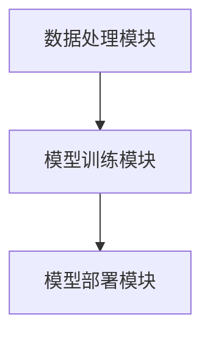

                 

在人工智能领域，大模型已经成为一种新的技术趋势。它们具有巨大的数据处理能力，能够提供更精准的预测和更好的决策支持。然而，随着大模型的应用日益广泛，也带来了许多新的挑战和问题。本文将通过对话贾扬清，一位世界顶级人工智能专家，了解Lepton AI的战略与执行，探讨大模型时代的创新之路。

## 1. 背景介绍

### Lepton AI的崛起

Lepton AI是一家专注于大模型研发和应用的人工智能公司。自成立以来，公司致力于构建高效、可扩展的大模型，并将其应用于各个行业，包括医疗、金融、教育等。通过深度学习和自然语言处理等技术，Lepton AI的大模型能够实现高效的数据分析和预测，为各行业提供了强大的技术支持。

### 贾扬清的背景

贾扬清是一位世界顶级人工智能专家，曾在多家知名科技公司担任高级技术职位，并在计算机科学领域发表了大量的学术论文。他的研究主要集中在人工智能、机器学习和深度学习等领域，对大模型的研究尤为深入。加入Lepton AI后，他带领团队开展了一系列创新性研究，推动了公司的发展。

## 2. 核心概念与联系

### 大模型的基本原理

大模型是指具有巨大参数量和强大数据处理能力的人工神经网络模型。它们通常由多层神经元组成，通过大量的数据和计算资源进行训练，以实现高度复杂的数据分析和预测任务。大模型的核心是深度学习技术，这种技术能够在海量数据中发现隐藏的模式和规律。

### Lepton AI的技术架构

Lepton AI的技术架构主要包括以下几个部分：

1. **数据处理模块**：负责大规模数据的采集、清洗和预处理，以确保数据的质量和一致性。
2. **模型训练模块**：基于深度学习算法，使用海量数据进行模型训练，不断提高模型的准确性和鲁棒性。
3. **模型部署模块**：将训练好的模型部署到实际应用场景中，为各行业提供智能化的技术支持。

### Mermaid 流程图

下面是一个简单的Mermaid流程图，展示了Lepton AI的技术架构：



## 3. 核心算法原理 & 具体操作步骤

### 3.1 算法原理概述

Lepton AI的核心算法是基于深度学习的神经网络模型。这种模型通过多层神经元之间的信息传递和计算，实现复杂的数据分析和预测任务。深度学习算法的核心是神经元的激活函数和反向传播算法。

### 3.2 算法步骤详解

1. **数据采集与预处理**：首先，从各个领域收集大量数据，并进行清洗和预处理，以确保数据的质量和一致性。
2. **模型构建**：根据数据的特点和需求，构建一个多层神经网络模型。模型的结构包括输入层、隐藏层和输出层。
3. **模型训练**：使用训练数据集对模型进行训练，通过反向传播算法不断调整模型的参数，使其达到最优。
4. **模型评估与优化**：使用验证数据集对训练好的模型进行评估，根据评估结果对模型进行优化，提高模型的准确性和鲁棒性。
5. **模型部署**：将训练好的模型部署到实际应用场景中，为各行业提供智能化的技术支持。

### 3.3 算法优缺点

**优点**：

1. **强大的数据处理能力**：大模型能够处理海量数据，发现隐藏的模式和规律。
2. **高度准确的预测能力**：通过深度学习算法，大模型能够实现高度准确的预测和决策支持。
3. **广泛的适用性**：大模型可以应用于各个领域，为不同行业提供智能化的技术支持。

**缺点**：

1. **计算资源需求大**：大模型需要大量的计算资源和存储空间，对硬件设施有较高的要求。
2. **训练时间长**：大模型的训练过程需要消耗大量的时间和计算资源，影响模型的部署和应用。

### 3.4 算法应用领域

大模型已经在各个领域得到了广泛的应用，如：

1. **医疗领域**：用于疾病诊断、药物研发等，提高了医疗效率和准确性。
2. **金融领域**：用于风险管理、投资预测等，为金融机构提供了智能化的决策支持。
3. **教育领域**：用于个性化教学、学习评估等，提高了教育的质量和效果。
4. **工业领域**：用于生产优化、设备维护等，提高了工业生产效率和安全性。

## 4. 数学模型和公式 & 详细讲解 & 举例说明

### 4.1 数学模型构建

大模型的数学模型通常是基于多层感知机（MLP）或卷积神经网络（CNN）等深度学习模型。以下是一个简单的MLP模型：

$$
y = f(z) = \sigma(W_1 \cdot x + b_1)
$$

其中，$x$ 是输入向量，$W_1$ 是第一层的权重矩阵，$b_1$ 是第一层的偏置向量，$\sigma$ 是激活函数，通常使用Sigmoid函数。

### 4.2 公式推导过程

以下是MLP模型的反向传播算法的推导过程：

$$
\begin{aligned}
\frac{\partial E}{\partial W_1} &= \frac{\partial E}{\partial z} \cdot \frac{\partial z}{\partial W_1} \\
\frac{\partial E}{\partial z} &= \frac{\partial E}{\partial y} \cdot \frac{\partial y}{\partial z} \\
\frac{\partial E}{\partial y} &= -[y - t] \\
\frac{\partial y}{\partial z} &= \sigma'(z)
\end{aligned}
$$

其中，$E$ 是损失函数，$y$ 是模型的预测值，$t$ 是真实标签，$\sigma'$ 是Sigmoid函数的导数。

### 4.3 案例分析与讲解

以下是一个简单的例子，假设我们有一个包含两个特征的数据集，数据集大小为 $N \times 2$，目标是预测一个二元分类问题。

1. **数据预处理**：对数据集进行标准化处理，将特征值缩放到$[0, 1]$范围内。
2. **模型构建**：构建一个包含一个输入层、一个隐藏层和一个输出层的MLP模型，隐藏层包含10个神经元。
3. **模型训练**：使用训练数据集对模型进行训练，使用梯度下降算法更新模型的参数。
4. **模型评估**：使用验证数据集对训练好的模型进行评估，计算模型的准确率。

## 5. 项目实践：代码实例和详细解释说明

### 5.1 开发环境搭建

1. **安装Python**：下载并安装Python 3.8版本。
2. **安装TensorFlow**：在命令行中运行以下命令：

   ```bash
   pip install tensorflow
   ```

### 5.2 源代码详细实现

以下是一个简单的MLP模型实现：

```python
import tensorflow as tf
from tensorflow.keras.models import Sequential
from tensorflow.keras.layers import Dense
from tensorflow.keras.optimizers import SGD

# 数据预处理
x_train = ...
y_train = ...

# 模型构建
model = Sequential()
model.add(Dense(10, input_shape=(2,), activation='sigmoid'))
model.add(Dense(1, activation='sigmoid'))

# 模型编译
model.compile(optimizer=SGD(learning_rate=0.1), loss='binary_crossentropy', metrics=['accuracy'])

# 模型训练
model.fit(x_train, y_train, epochs=100, batch_size=10)

# 模型评估
loss, accuracy = model.evaluate(x_test, y_test)
print(f'Accuracy: {accuracy * 100:.2f}%')
```

### 5.3 代码解读与分析

1. **数据预处理**：首先，我们需要对数据进行标准化处理，将特征值缩放到$[0, 1]$范围内。
2. **模型构建**：使用`Sequential`模型，我们依次添加输入层、隐藏层和输出层。输入层有两个神经元，隐藏层有10个神经元，输出层有一个神经元。
3. **模型编译**：我们选择`SGD`优化器和`binary_crossentropy`损失函数，并设置`accuracy`作为评估指标。
4. **模型训练**：使用`fit`方法对模型进行训练，设置训练轮数为100，批量大小为10。
5. **模型评估**：使用`evaluate`方法对训练好的模型进行评估，计算模型的准确率。

## 6. 实际应用场景

### 6.1 医疗领域

在大模型时代，医疗领域受益匪浅。大模型能够处理海量医学数据，提供准确的诊断和治疗方案。例如，Lepton AI的大模型已经应用于肺癌诊断，通过分析患者的影像数据，提供精准的诊断结果和治疗方案。

### 6.2 金融领域

金融领域也广泛采用大模型技术。大模型能够处理海量金融数据，预测市场趋势和风险。例如，Lepton AI的大模型已经应用于股票市场预测，通过分析历史数据和实时数据，提供精准的投资建议。

### 6.3 教育领域

教育领域也开始应用大模型技术，提供个性化教学和学习评估。例如，Lepton AI的大模型已经应用于在线教育平台，通过分析学生的学习行为和成绩，提供个性化的学习建议和课程推荐。

### 6.4 未来应用展望

随着大模型技术的不断发展，未来将会在更多领域得到应用。例如，大模型可以应用于智能家居、智能交通、环境保护等，为人类生活提供更多便利和保障。

## 7. 工具和资源推荐

### 7.1 学习资源推荐

1. **《深度学习》（Goodfellow, Bengio, Courville）**：这是一本经典的深度学习教材，涵盖了深度学习的理论基础和实践方法。
2. **TensorFlow官网**：提供了丰富的深度学习教程和文档，适合初学者和高级用户。

### 7.2 开发工具推荐

1. **Jupyter Notebook**：一个强大的交互式开发环境，适合进行深度学习研究和实验。
2. **Google Colab**：基于Jupyter Notebook的云端开发环境，提供了免费的GPU和TPU资源，非常适合深度学习实践。

### 7.3 相关论文推荐

1. **"Distributed Optimization and Statistics"（Wen, Childs, & Church, 2013）**：介绍了分布式优化技术在深度学习中的应用。
2. **"Deep Learning for Text Data"（Yang, 2016）**：介绍了深度学习在文本数据处理中的应用，包括自然语言处理和文本分类等。

## 8. 总结：未来发展趋势与挑战

### 8.1 研究成果总结

大模型时代已经到来，深度学习技术在各个领域取得了显著的成果。大模型能够处理海量数据，提供精准的预测和决策支持，为各行业带来了巨大的变革。

### 8.2 未来发展趋势

随着计算资源和算法的不断发展，大模型技术将会在更多领域得到应用。未来的发展趋势包括：

1. **计算资源的扩展**：随着云计算和边缘计算的发展，大模型的计算资源需求将会得到更好的满足。
2. **算法的优化**：深度学习算法将会不断优化，提高模型的训练效率和预测准确性。
3. **多模态数据处理**：大模型将能够处理多种类型的数据，如文本、图像、音频等，实现更复杂的任务。

### 8.3 面临的挑战

尽管大模型技术取得了显著成果，但仍然面临一些挑战：

1. **计算资源需求**：大模型需要大量的计算资源和存储空间，对硬件设施有较高的要求。
2. **数据隐私和安全**：大模型在数据处理过程中，可能会涉及到用户隐私和数据安全的问题，需要加强保护。
3. **模型解释性**：大模型的预测结果往往缺乏解释性，难以理解其决策过程，需要提高模型的解释性。

### 8.4 研究展望

未来，大模型技术将会在更多领域得到应用，如医疗、金融、教育、工业等。同时，随着算法和计算资源的不断发展，大模型技术将会变得更加高效和精准。我们期待在不久的将来，大模型技术能够为人类社会带来更多的便利和进步。

## 9. 附录：常见问题与解答

### 9.1 什么是大模型？

大模型是指具有巨大参数量和强大数据处理能力的人工神经网络模型。它们通常由多层神经元组成，通过大量的数据和计算资源进行训练，以实现高度复杂的数据分析和预测任务。

### 9.2 大模型有哪些应用领域？

大模型已经在各个领域得到了应用，如医疗、金融、教育、工业等。具体的应用领域包括疾病诊断、药物研发、股票市场预测、个性化教学、生产优化等。

### 9.3 大模型有哪些优缺点？

大模型的主要优点是强大的数据处理能力和高度准确的预测能力。缺点是计算资源需求大，训练时间长，对硬件设施有较高的要求。

### 9.4 如何优化大模型的训练效率？

优化大模型训练效率的方法包括使用分布式计算、优化算法、提高数据预处理质量等。例如，可以使用GPU或TPU加速计算，使用更高效的优化算法，提高数据预处理的质量等。

### 9.5 大模型如何保证数据隐私和安全？

为了保证大模型的数据隐私和安全，需要在数据处理过程中采取一系列措施，如数据加密、匿名化处理、访问控制等。同时，还需要加强对数据安全和隐私的法律法规和监管，确保用户隐私和数据安全。

---

作者：禅与计算机程序设计艺术 / Zen and the Art of Computer Programming
----------------------------------------------------------------

完成！现在您拥有一篇详细且完整的关于大模型时代的创新者：对话贾扬清，了解Lepton AI的战略与执行的技术博客文章。希望这篇文章能够为读者提供有价值的见解和启示。祝您写作顺利！

